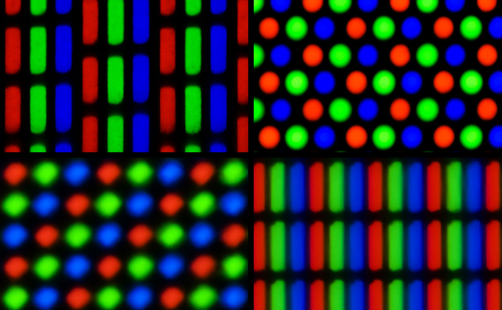

**[← Back to Course Homepage](../../../)**

> "Those analysis droids you've got over there only focus on symbols. Hagh! I should think you Jedi would have more respect for the difference between knowledge and, hu-hu-hu... *wisdom*."
>
> -- Dexter Jettster in *Attack of the Clones*, written by George Lucas and Jonathan Hales [@lucas_hales_aotc_2000, p. 35]

> "Where is the Life we have lost in living? Where is the wisdom we have lost in knowledge? Where is the knowledge we have lost in information?"
>
> -- T. S. Eliot in *The Rock* [@eliot_rock_1934]

*This chapter is in-progress.*

As one works through the various stages of the [data science lifecycle](https://learningds.org/ch/01/lifecycle_cycle.html), it is helpful to consider how each stage relates to what is often called the data-information-knowledge-wisdom "hierarchy" or the "DIKW pyramid" for short. As argued by this chapter and other sources, the definitive logical hierarchy implied by the DIKW pyramid is somewhat misleading, however, the intuitions around the pyramid metaphor offer helpful framing for the work of data science.

The basic premise of the DIKW pyramid is as follows. To build a pyramid, start with a large, well-organized layer of bricks. Multiple datum give us data, upon which one can construct knowledge: the foundation of our DIKW pyramid.

## What are data?
TK

## What is information?
TK

## What is knowledge?

Knowledge must be appreciated as more than a fixed, static set of facts. To know something is more than just to store some information. Knowledge is also more than merely processing information. @zeleny_management_1987 describes knowledge as a "network of relations through which humans coordinate their actions," adding that "knowledge brings (through language) coherence and coordination to the otherwise turbulent and chaotic world of human action."

For example, consider what makes Wikipedia a source of knowledge...

### Common Knowledge
Something profound happens when multiple people "read" (look at, watch, draw, view, etc.) something together. In brief, this is the phenomena of common knowledge: shared awareness about what other people know.

It is a common method for creating suspense in film and television. Alfred Hitchcock described the distinction between "surprise" and "suspense" as a difference in common knowledge: in a surprise, the audience discovers an important fact at the same time as the characters. The information is withheld from everyone @hitchcock_interview_1973.

But suspense depends on *partially* shared information. For example, if the audience knows that there is a bomb under the dining table, but they also know that Bob was gone when the bomb was placed under the table. In Hitchcock's framing, this scenario creates suspense because the audience anticipates danger from the bomb, and also knows that Bob does not anticipate the same danger...

## Understanding
TK.

## What is wisdom?
Anyone who wants to answer the question "what is wisdom" would benefit from also being able to answer the question, "what is a triangle?"

Let's try to display a perfect triangle on your screen, or at least get as close as we can. Here is an attempt.

::: {#fig-triangle-ideal}

An attempt to display a perfect triangle.
:::

Looks like a pretty good triangle! It uses scalable vector graphics (i.e. an svg file), to make the lines look as crisp as they possibly can on a computer screen. The image only uses a few pieces of information: the size of the frame (using the golden ratio, of course), the location of the three points for an equilateral triangle within that frame, and the color and width of the line to connect those dots. This particular image uses a black line with a width of six pixels (a multiple of three, of course).

But is there really a triangle in this image? Is it a perfect triangle? One way to find out is to zoom in on a portion of it.

::: {#fig-triangle-frame}

The red rectangular frame will be the outer frame for the next image.
:::

The red rectangle represents another golden-ratio rectangle, this one being 1/10th the size of the original rectangle (160 pixels instead of the original 1600 pixels). Now, we will look at that frame up close.

::: {#fig-triangle-edge}

The left edge of the "perfect" triangle, which may not be perfect after all.
:::

Although the original picture may have looked like a perfect triangle at first, alas, closer inspection shows the left edge of the triangle is not even a straight line. Those edges are pretty jagged, and indeed, that is the only way to draw "lines" on a computer screen. We can look even closer to see how this works, zooming in by another factor of ten.

::: {#fig-triangle-edge-frame}

The red rectangular frame will be the outer frame for the next zoomed-in image.
:::

Again, the red frame shows the area where we will zoom in.

::: {#fig-triangle-edge-zoom}

The left edge of the "perfect" triangle breaks down even further.
:::

Now, the flaws of the triangle are even closer and more apparent. We have laid bare its imperfections (or at least some of its imperfections). Then again, those imperfections have lain there all along: the pixels (picture elements) in the original, perfect-looking triangle were always there, they were just too small to see.

Even now, this image of the black squares is not really showing you the pixels. This is what a pixel *actually* looks like up close:

::: {#fig-lcd-pixel-macro}

A microscopic image of an LCD display showing subpixels. Source: Jacek Halicki, [*2023 Mikroskopowy obraz matrycy LCD*](https://commons.wikimedia.org/wiki/File:2023_Mikroskopowy_obraz_matrycy_LCD.jpg), licensed under [CC BY-SA 4.0](https://creativecommons.org/licenses/by-sa/4.0/).
:::

Yet again, even this statement is somewhat inaccurate - this is not really what a pixel looks like. There is no way to show a zoomed-in picture of *your* screen at this very moment, however, you could go get a magnifying glass if you are curious. If you looked through that magnifying glass and you zoomed in further, you might see "subpixels" of red, blue, and green in your screen.

::: {#fig-lcd-pixel-macro-zoom}

A 10x zoom into the center of the LCD subpixel image, showing rectangular subpixels. Source: Jacek Halicki, [*2023 Mikroskopowy obraz matrycy LCD*](https://commons.wikimedia.org/wiki/File:2023_Mikroskopowy_obraz_matrycy_LCD.jpg), licensed under [CC BY-SA 4.0](https://creativecommons.org/licenses/by-sa/4.0/).
:::

But the subpixels on your screen might not be the same shape as the subpixels on someone else's screen. For example, subpixels look rather different on a standard definition CRT television, a CRT computer monitor, and LCD laptop screens, as shown below.

::: {#fig-pixel-geometries}

Pixel geometries from CRT and LCD displays, center-cropped to a golden-ratio rectangle. Source: Peter Halasz (Pengo), [*Pixel geometry 02 Pengo.jpg*](https://commons.wikimedia.org/wiki/File:Pixel_geometry_02_Pengo.jpg), licensed under [CC BY-SA 3.0](https://creativecommons.org/licenses/by-sa/3.0/).
:::

This chapter could go on for a long time with this repeated zoom-in effect. But what does all of this have to do with data science?

During the work of data science, you may find yourself (or your team) in an "repeated zoom-in" cycle. You may have been tasked with answering a deceptively simple question:
* Do guests like the new cold brew recipe?
* Is the running plan helping people run faster?
* Do people sleep better with noise machines?

But any real, live, curious human asking these questions will want more than "yes" or "no" as an answer. The task of a data scientist is not merely to deliver the answer up the chain, like a machine that takes data as input and gives knowledge as output.

Instead, the real value of a wise and competent data scientist is to understand, in detail, how the subpixels of data can become images of information. That is, a data scientist must explore the many possible decisions that can take data to construct information and/or knowledge.

As glimpsed here, and as will be discussed throughout the chapters, these possible decisions are...

## Case study: statistical worldviews

One facet of decision-making in the data science workflow involves...

These statistical frameworks/paradigms are essentialy worldviews that entail specific commitments about uncertainty, evidence, and subjectivity [@sep-statistics].

### Frequentist worldview (long-run behavior)

* Probability as long-run frequency across repeated trials
* Confidence intervals and p-values as procedures with guaranteed long-run error rates
* The reference-class problem
* Statistics links data to hypotheses by using probability distributions over possible data sets [@sep-statistics].
* Classical statistics treats probabilities as chances attached to repeatable events, not as probabilities that hypotheses themselves are true [@sep-statistics].
* Frequentist procedures provide long-run error guarantees, but they also face a reference-class problem when reasoning about individual cases [@sep-statistics].

### Bayesian worldview (degrees of belief)

* Probability as a measure of uncertainty (belief) given information
* Parameters are treated as uncertain
* Data update beliefs ( Bayes' rule )
* Bayesian epistemology treats belief as coming in degrees, often called credences [@sep-epistemology-bayesian].
* Bayesian norms ask both how credences should fit together and how they should change with new evidence [@sep-epistemology-bayesian].
* Data update beliefs through conditionalization, but the result depends on the prior credences brought into the analysis [@sep-epistemology-bayesian].
* The problem of the priors matters because coherent starting points can still support different inductive conclusions [@sep-epistemology-bayesian].
* In Bayesian statistics, parameters are treated as uncertain, and posterior distributions support estimates and credibility intervals [@sep-statistics].

### Causal inference worldview (effects of interventions)

* Core question: what would happen if we intervened?
* Potential outcomes / counterfactuals, causal graphs (DAGs)
* A causal model represents causal relationships within a system or population so that statistical data can support causal inference [@sep-causal-models].
* Directed acyclic graphs make assumptions about dependence, independence, and causal direction explicit [@sep-causal-models].
* Observed probabilities alone may identify only a Markov equivalence class, so causal claims often require background assumptions or interventions [@sep-causal-models].
* The core causal question is interventionist: what would happen if we changed one part of the system? [@sep-causal-models]
* Regularity theories begin from the idea that causes are regularly followed by effects, but accidental regularities are not enough [@sep-causation-regularity].
* Millian regularity approaches treat causes as lawlike combinations of present positive factors and absent negative factors [@sep-causation-regularity].
* Inferential theories analyze causation through what effects can be inferred from causes within an appropriate background theory [@sep-causation-regularity].

## Test
These are test citations for @ackoff_data_1989, @vance_information_1997, @bernstein_data-information-knowledge-wisdom_2011, @rowley_wisdom_2007, @fricke_knowledge_2009, @zeleny_management_1987, and @payne_perfect_circles_2019.

The data-information-knowledge-wisdom (DIKW) framing is commonly discussed in the literature (e.g., @ackoff_data_1989; @vance_information_1997; @bernstein_data-information-knowledge-wisdom_2011).

## References
