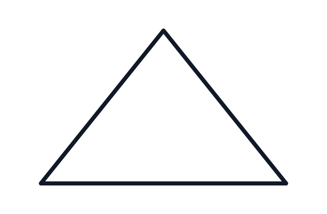
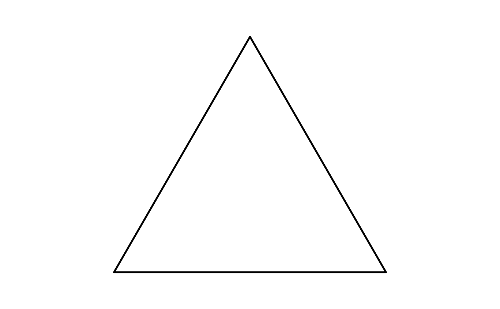
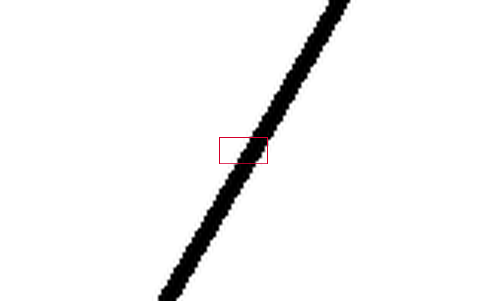
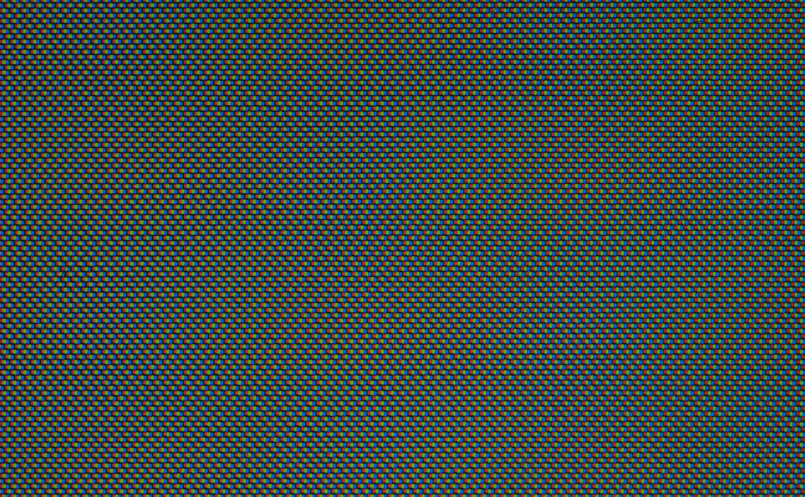

**[← Back to Course Homepage](../../../)**

> "Those analysis droids you've got over there only focus on symbols. Hagh! I should think you Jedi would have more respect for the difference between knowledge and, hu-hu-hu... *wisdom*."
>
> -- Dexter Jettster in *Attack of the Clones*, written by George Lucas and Jonathan Hales [@lucas_hales_aotc_2000, p. 35]

> "Where is the Life we have lost in living? Where is the wisdom we have lost in knowledge? Where is the knowledge we have lost in information?"
>
> -- T. S. Eliot in *The Rock* [@eliot_rock_1934]

{fig-alt="A simple triangle."}

*This chapter is in-progress.*

As one works through the various stages of the [data science lifecycle](https://learningds.org/ch/01/lifecycle_cycle.html), it is helpful to consider how each stage relates to what is often called the data-information-knowledge-wisdom "hierarchy" or the "DIKW pyramid" for short. As argued by this chapter and other sources, the definitive logical hierarchy implied by the DIKW pyramid is somewhat misleading, however, the intuitions around the pyramid metaphor offer helpful framing for the work of data science.

## What are data?

## What is information?

## What is knowledge?

Knowledge must be appreciated as more than a fixed and static set of facts. To know something is more than just to store some information. It is also more than merely processing information. @zeleny_management_1987 describes knowledge as a "network of relations through which [humans] coordinate their actions," adding that "knowledge brings (through language) coherence and coordination to the otherwise turbulent and chaotic world of human action."

For example, consider what makes Wikipedia a source of knowledge..

## Understanding
TK.

## What is wisdom?
Anyone who wants to answer the question "what is wisdom" should also be able to answer the question, "what is a triangle?"

Let's try to display a perfect triangle on your screen, or at least get as close as we can. Here is an attempt.

::: {#fig-triangle-ideal}

Placeholder caption for the ideal triangle.
:::

Looks like a pretty good triangle! It uses scalable vector graphics (i.e. an svg file), to make the lines look as crisp as possible. The image only uses a few pieces of information: the size of the frame (using the golden ratio, of course), the location of the three points for an equilateral triangle within that frame, and the color and width of the line to connect those dots. This particular image uses a black line with a width of six pixels (had to use a multiple of three, of course).

But is this really a triangle? Is it a perfect triangle? To find out, we can zoom in on a portion of it.

::: {#fig-triangle-frame}

Placeholder caption for the triangle with the first frame.
:::

The red rectangle represents another golden-ratio rectangle, this one being 1/10th the size of the original rectangle (160 pixels instead of the original 1600 pixels). Now, let's look at it up close.

::: {#fig-triangle-edge}

Placeholder caption for the first cropped edge view.
:::

Bad news... it may have looked like a perfect triangle at first, but alas, that does not look like a line. Those edges are pretty jagged, and indeed, that is the only way to draw "lines" on a computer screen. We can look even closer to see how this works, zooming in by another power of ten.

::: {#fig-triangle-edge-frame}

Placeholder caption for the second framed edge view.
:::

Again, the red frame shows the area where we will zoom in.

::: {#fig-triangle-edge-zoom}

Placeholder caption for the pixelated zoomed edge view.
:::

Now, the flaws of the triangle are even closer and more apparent. We have laid bare its imperfections. Then again, they have lain there all along: the pixels (picture elements) in the original, perfect-looking triangle were always there, they were just too small to see.

Even now, this image is not really showing you the pixels.

This is what a pixel actually looks like up close:

::: {#fig-lcd-pixel-macro}

A microscopic image of an LCD display showing subpixels. Source: Jacek Halicki, [*2023 Mikroskopowy obraz matrycy LCD*](https://commons.wikimedia.org/wiki/File:2023_Mikroskopowy_obraz_matrycy_LCD.jpg), licensed under [CC BY-SA 4.0](https://creativecommons.org/licenses/by-sa/4.0/).
:::

::: {#fig-lcd-pixel-macro-zoom}

A 10x zoom into the center of the LCD subpixel image. Source: Jacek Halicki, [*2023 Mikroskopowy obraz matrycy LCD*](https://commons.wikimedia.org/wiki/File:2023_Mikroskopowy_obraz_matrycy_LCD.jpg), licensed under [CC BY-SA 4.0](https://creativecommons.org/licenses/by-sa/4.0/).
:::

These are some test citations for @ackoff_data_1989, @vance_information_1997, @bernstein_data-information-knowledge-wisdom_2011, @rowley_wisdom_2007, @fricke_knowledge_2009, and @zeleny_management_1987.

The data-information-knowledge-wisdom (DIKW) framing is commonly discussed in the literature (e.g., @ackoff_data_1989; @vance_information_1997; @bernstein_data-information-knowledge-wisdom_2011).

https://www.cmu.edu/mcs/news-events/2019/0314_pi-day-perfect-circles.html

## Case study: statistics worldviews

These statistical frameworks/paradigms are essentialy worldviews that entail specific commitments about uncertainty, evidence, and subjectivity [@sep-statistics].

### Frequentist worldview (long-run behavior)

* Probability as long-run frequency across repeated trials
* Confidence intervals and p-values as procedures with guaranteed long-run error rates

### Bayesian worldview (degrees of belief)

* Probability as a measure of uncertainty (belief) given information
* Parameters are treated as uncertain; data update beliefs via Bayes' rule

### Causal inference worldview (effects of interventions)

* Core question: what would happen if we intervened?
* potential outcomes / counterfactuals, causal graphs (DAGs)

## References
