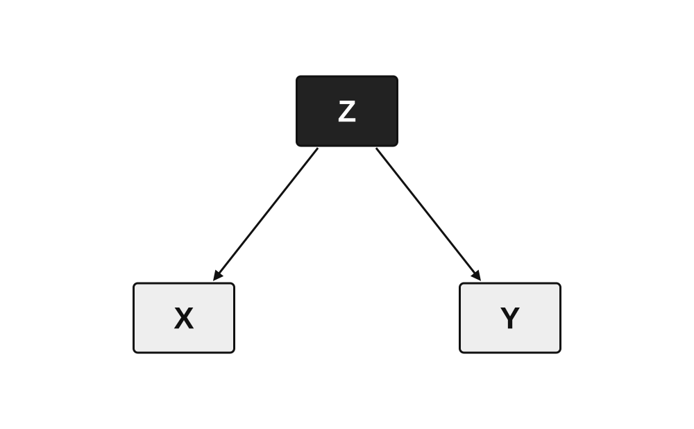
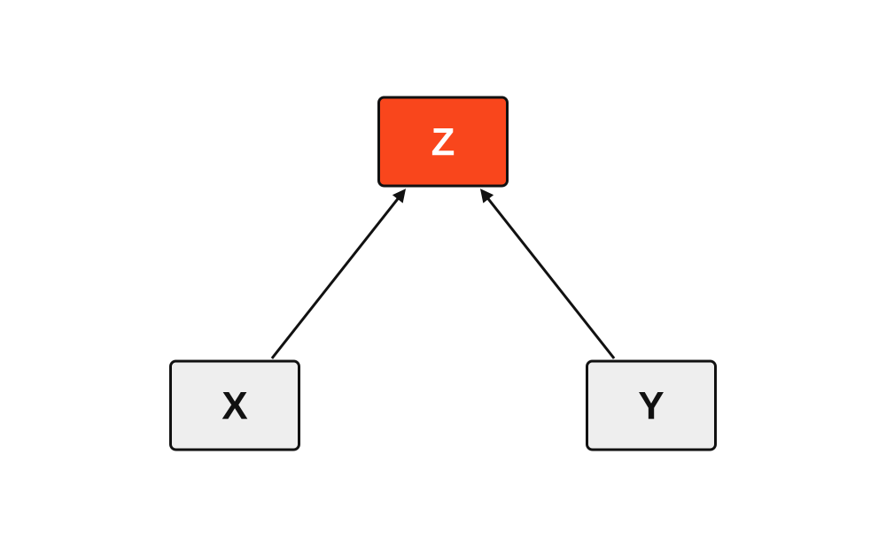

**[← Back to Course Homepage](../../index.html)**

::: {#fig-dikw-pyramid-blank}
<object type="image/svg+xml" data="../../assets/pyramid/comparison-of-pyramids-smil.svg" aria-label="Profiles of popular pyramid and near-pyramid buildings, drawn to a common scale." style="width: 100%; height: auto; aspect-ratio: 560 / 350; background: #fff; border: 1px solid var(--bs-border-color);"></object>

Profiles of popular pyramid and near-pyramid structures drawn to a common scale. Hover over a label or profile to bring it forward. Source: Cmglee, [*Comparison of pyramids SMIL.svg*](https://commons.wikimedia.org/wiki/File:Comparison_of_pyramids_SMIL.svg), licensed under [CC BY-SA 3.0](https://creativecommons.org/licenses/by-sa/3.0/).
:::

> "Those analysis droids you've got over there only focus on symbols. Hagh! I should think you Jedi would have more respect for the difference between knowledge and, hu-hu-hu... *wisdom*."

-- Dexter Jettster in *Attack of the Clones*, written by George Lucas and Jonathan Hales [@lucas_hales_aotc_2000, p. 35]


> "Where is the Life we have lost in living? Where is the wisdom we have lost in knowledge? Where is the knowledge we have lost in information?"

-- T. S. Eliot in *The Rock* [@eliot_rock_1934]


> "Wisdom cannot be passed on... Knowledge can be conveyed, but not wisdom. It can be found, it can be lived... but it cannot be expressed in words and taught."

-- Siddhartha in Hermann Hesse's *Siddhartha* [@hesse_siddhartha_1922]


> **Overview:** This chapter describes the DIKW pyramid — data, information, knowledge, wisdom — and its relevance to the data science lifecycle, especially as a way to consider the fundamental goals and purposes of data science work. The chapter also discusses concepts of *understanding* and *common knowledge*, and describes their relevance to data science. It closes with a brief discussion of statistical worldviews (e.g. Bayesian versus Frequentist), explaining why data scientists cannot simply "just do the math" - they often must choose particular beliefs about math and the world at large.

As one works through the various stages of the [data science lifecycle](https://learningds.org/ch/01/lifecycle_cycle.html), it is helpful to consider how each stage relates to what is often called the data-information-knowledge-wisdom "hierarchy" or the "DIKW pyramid" for short [@rowley_wisdom_2007]. The DIKW framing has a long history across systems thinking and information science (e.g., @ackoff_data_1989; @vance_information_1997; @bernstein_data-information-knowledge-wisdom_2011). As argued by this chapter and other sources, the definitive hierarchy implied by the DIKW pyramid is somewhat misleading [@fricke_knowledge_2009], however, the intuitions around the metaphor offer helpful framing for data science work.

::: {#fig-dikw-pyramid}


A rendition of the DIKW pyramid, with data at the base supporting successive layers of information, knowledge, and wisdom.
:::

The basic premise of the DIKW pyramid is as follows. To build a pyramid with wisdom at the top, start with a brick: a datum. Use multiple bricks to create a large organized layer of bricks: data. Upon a solid foundation of data, we can begin to construct information, and upon a solid layer of information, we can construct knowledge.

Like all metaphors, the DIKW pyramid eventually breaks down. Knowledge creation is not always a matter of assembling data into information and then assembling that information into knowledge. And wisdom is not *literally* the top layer of a pyramid, nor is it the guaranteed product of assembling data, information, and knowledge.

Still, the DIKW model accurately suggests that one purpose of data (i.e. data science) is, generally, to point one toward wisdom. "Wisdom" may be a surprising word to see in a data science book, and it may seem better suited for other textbooks. Yet the concept of wisdom is helpful to consider as an end goal, or *telos*, in data science work.

## What is wisdom?

To answer the question "what is wisdom," one would benefit from also being able to answer the question, "what is a triangle?"[^triangle-spinoza]

To start, let us try to display a perfect equilateral triangle on your screen, or at least get as close as we can. Here is an attempt.

::: {#fig-triangle-ideal}


An attempt to display a perfect equilateral triangle.
:::

Figure @fig-triangle-ideal looks like a pretty good triangle! It uses scalable vector graphics (i.e. an svg file) to make the lines look as crisp as they possibly can on a computer screen. The image only uses a few pieces of information: the size of the frame (using the golden ratio, of course), the location of the three points for an equilateral triangle within that frame, and the color and width of the line to connect those dots. This particular image uses a black line with a width of six pixels.

The entire image comes from just a few lines of code:

``` {.xml filename="00-triangle-best.svg"}
<svg
  xmlns="http://www.w3.org/2000/svg"
  width="1600"
  height="989"
  viewBox="0 0 1600 989"
>
  <rect width="100%" height="100%" fill="white" />
  <polygon
    points="364.84,871.36 800.00,117.64 1235.16,871.36"
    fill="none"
    stroke="black"
    stroke-width="6"
    stroke-linejoin="round"
  />
</svg>
```

But is there really a triangle in this image? Is there a *perfect* triangle in this image? (Similar philosophical questions are asked about various shapes, such as the existence of perfect circles [@payne_perfect_circles_2019], or perfect spheres [@muller_roundest_object_2013].) One way to find out if it is truly "perfect" is to zoom in on a portion of the triangle. We will zoom in by a power of ten, inspired by the Eames films [@eames_powers_of_ten_1968; @eames_powers_of_ten_1977].

::: {#fig-triangle-frame}


The red rectangular frame will be the outer frame for the next image.
:::

The red rectangle represents another golden-ratio rectangle, this one being 1/10th the size of the original rectangle (e.g. 160 pixels of the original 1600 pixels). Now, we will look at that frame up close.

::: {#fig-triangle-edge}


The left edge of the "perfect" equilateral triangle, which may not be perfect after all.
:::

Although the original picture may have looked like a perfect triangle at first, alas, closer inspection shows the left edge of the triangle is not even a straight line. Those edges are quite jagged, and indeed, that is the only way to draw "lines" on a computer screen - with blocky, square pixels. We can look even closer to see how this works, zooming in by another factor of ten.

::: {#fig-triangle-edge-frame}


The red rectangular frame will be the outer frame for the next zoomed-in image.
:::

Again, the red frame shows the area where we will zoom in.

::: {#fig-triangle-edge-zoom}


The left edge of the "perfect" equilateral triangle breaks down even further.
:::

Now, the flaws of the triangle are even closer and more apparent. We have laid bare its imperfections (or at least some of its imperfections). Then again, those imperfections have been there all along: the square pixels (picture elements) in the original, perfect-looking triangle were always *there*, they were just too small to see.

Even now, this image of the black squares is not really showing you the pixels. Here is what those "black" pixels actually look like up close:

::: {#fig-lcd-pixel-macro}


A microscopic image of an LCD display showing subpixels. Source: Jacek Halicki, [*2023 Mikroskopowy obraz matrycy LCD*](https://commons.wikimedia.org/wiki/File:2023_Mikroskopowy_obraz_matrycy_LCD.jpg), licensed under [CC BY-SA 4.0](https://creativecommons.org/licenses/by-sa/4.0/).
:::

And even this statement about "what pixels look like" is somewhat inaccurate - this is not *exactly* what pixels look like. There is no way to show a zoomed-in picture of *your* screen at this very moment, although you could go get a magnifying glass if you are curious. And if you looked through that magnifying glass, zooming in further, you might see "subpixels" of red, blue, and green in your screen.

::: {#fig-lcd-pixel-macro-zoom}


A 10x zoom into the LCD subpixel image, showing rectangular subpixels. Source: Jacek Halicki, [*2023 Mikroskopowy obraz matrycy LCD*](https://commons.wikimedia.org/wiki/File:2023_Mikroskopowy_obraz_matrycy_LCD.jpg), licensed under [CC BY-SA 4.0](https://creativecommons.org/licenses/by-sa/4.0/).
:::

Still, the subpixels on your screen might not be the same shape as the subpixels on someone else's screen. Subpixels look rather different on a standard definition CRT television, a CRT computer monitor, and LCD laptop screens, as shown below.

::: {#fig-pixel-geometries}


Up-close pixel geometries from CRT and LCD displays. Source: Peter Halasz (Pengo), [*Pixel geometry 02 Pengo.jpg*](https://commons.wikimedia.org/wiki/File:Pixel_geometry_02_Pengo.jpg), licensed under [CC BY-SA 3.0](https://creativecommons.org/licenses/by-sa/3.0/).
:::

We could go on for quite a while with this repeated zoom-in effect. The Eames films about "powers of ten" zoom in all the way to...(quarks?)...

And what does all of this have to do with data science?

We began by asking "what is a triangle?" A seemingly simple quest for understanding. Analogously, data scientists will often be tasked with answering deceptively simple questions:
* How much does stretching help reduce injuries?
* Do people sleep better with noise machines?
* Is the cafe serving more customers than it was last year?
* Did the flyers bring more people to the restaurant?

Any real, living, curious human asking these questions will want more than a one-word answer. Even the yes-or-no questions beg for a story (more on questions in the next chapter). The task of a data scientist, then, is not merely to extract and deliver a one-word answer.

This is the second point for which the triangle adventure is relevant. The real value of a (competent) data scientist is to understand, in detail, how the subpixels of data can become images of information. That is, a data scientist will constantly explore the possible decisions involved in turning data into information and/or knowledge, and the story that unfolds from those decisions.

Practically, this means data scientists benefit from a strong understanding of data acquisition processes, sampling processes, and how those processes fit into any conclusions drawn from the data. In short, data scientists will pay attention to data *provenance*.

A strong grasp of provenance is an important component of "data science wisdom." When traced back to its origins, data are always limited. Thus, George Box's famous aphorism that "all models are wrong, but some are useful" [@box_draper_empirical_model_building_1987] might be amended. We can add that all *data* are wrong, too: all data are imperfect representations of the real world (or what we call the real world). Some data are very useful, but all data are limited snapshots of the world. Chapter 4 calls this the "treachery of data" and discusses it in more detail.

The triangle figure thus illustrates several dimensions of "data science wisdom." Wisdom involves being able to explain why the figure was not *exactly* a perfect triangle. Wisdom requires *understanding the process* of going from subpixels to pixels to (an appearance of) lines to an imperfect representation of a triangle. Data science wisdom requires paying attention to *provenance* - tracing the (appearance of) a triangle all the way to its origins in subpixels, or perhaps even further!

Wisdom also involves a willingness to say why the original figure was, in some sense, a triangle. One must occasionally bow to the consensus and accept "equilateral triangle" as the best available, most recognizable name for the shape that appears in the figure. As will be discussed in Chapter 5, this kind of wisdom requires an awareness of goals, audience knowledge, and other contextual factors which can improve communication.


## Understanding

Notably missing from the DIKW pyramid is the word "understanding." This points to another limitation of the metaphor: fixed, static data are not automatically converted to information and/or knowledge and/or wisdom. The existence of the DIKW pyramid thus implies human understanding - someone had to build the pyramid.

To quote Ursula Le Guin, "What good are all the objects in the universe, if there is no subject?" [@leguin_mrs_brown_1979]. And to rephrase this sentiment in the context of the DIKW pyramid, "what good are all the data, if there is no data scientist?"

To construct the DIKW pyramid, there must be some subject that transforms data into information, information into knowledge, and so on. If and when these transformations happen, they happen through the effort of human attention.

For example, what makes Wikipedia a source of knowledge is not merely the text on the page(s), but the coordination process of the many Wikipedia editor communities which iteratively write, review, and update Wikipedia pages. Furthermore, the information captured on Wikipedia pages can only "spread" and become knowledge when people read and trust that information. And a person trusts the information because of the subjects who crafted and re-crafted the language, ensuring its coherence and alignment with existing language.

This construction process is understanding: information is more than compiled data, it is *understood* data. In other words, information is not automatically a property of data. And knowledge is not just stored information, it is *understood* information. @zeleny_management_1987 describes knowledge as a "network of relations through which humans coordinate their actions," adding that "knowledge brings (through language) coherence and coordination to the otherwise turbulent and chaotic world of human action."

This activity, exemplified by the continuous editing of Wikipedia editor communities, is the essence of understanding. The DIKW pyramid does not build itself: it is built by the human activity of devoting attention to gain understanding, which is often done in community.

Human relations can often complicate things. Different people and organizations do not all construct knowledge in the same way(s), and Chapter 5 revisits the pyramid metaphor along with some of the alternative metaphors for knowledge construction - e.g. cathedrals and bazars.

Furthermore, when it comes to understanding among multiple people, we broach the phenomenon of *common knowledge* — shared awareness not just of facts, but awareness of the facts other people know. This phenomenon has direct implications for how data scientists communicate results, and is also discussed in Chapter 5. Effective communication in building the DIKW pyramid also requires a distinction between "understanding the data" and "understanding the world" - discussed further in Chapter 4.

(TK mention example - same dataset, multiple analysts)


## Statistical worldviews {#sec-statistical-worldviews}

One final component of wisdom for the data scientist is an awareness of different worldviews and their relevance to various steps in the data science lifecycle. Although some may view data scientists as having a neutral, objective, "view from nowhere" [@nagel_view_from_nowhere_1986; @haraway_situated_knowledges_1988; @dignazio_klein_data_feminism_2020], there are many "researcher degrees of freedom" exercised throughout the lifecycle. Making decisions within these degrees of freedom entails a degree of subjectivity, and requires data scientists to bring some humanity to their work.

To help demonstrate the relevance of worldviews in data science, we will conclude the chapter with the example of frequentist versus Bayesian statistics.

Consider a simple scenario from [@ipeirotis_bayesian_frequentist_2008]:

* You have a coin that, when flipped, ends up head with probability *p* (and ends up tail with probability *1−p*)
* The value of *p* is unknown, and you want to know it
* You flip the coin 14 times and get 10 heads
* A stranger walks by after the 14th flip and offers a bet as to whether the next two flips will yield two heads
* Do you take the bet?

The mathematical details are worked out in the original source; what matters here is the different conclusions reached through different statistical worldviews.

In this particular example, a *frequentist* would estimate *p* from the 14 observations, estimating a 51% chance of two consecutive heads. A *Bayesian* reaches a different estimate, 48.5% (by treating *p* as a distribution, incorporating prior beliefs, and using Bayes' theorem to account for the 14 observations).

There are underlying beliefs supporting these numbers: frequentists treat probability as long-run frequency/percentages and judge procedures by their error rates across repeated trials [@sep-statistics]. Bayesians, on the other hand, treat probability as a degree of belief (or "credence") that is updated as evidence arrives [@sep-epistemology-bayesian].

So, do you take the bet? One might expect there to be a single answer to the statistical question: "just do the math!" But we have multiple paradigms upon which we might base our math. This is a case where a data scientist must choose which math to use, and to some extent, what to believe about the world.

This particular debate actually seems to have settled down. In a widely-cited 1986 paper, Bradley Efron asked "Why Isn't Everyone a Bayesian?" and implied the choice as an active contest [@efron_why_isnt_bayesian_1986]. More recently, however, Richard McElreath (and others) have suggested that the Bayesian-versus-frequentist debate has essentially been subsumed by the question of causal inference [@mcelreath_statistical_rethinking_2020]. That is, the main question has become: what can we expect to happen from a particular intervention?

But even if "everyone is a Bayesian," this does not settle the matter, or eliminate the existence of subjective worldviews. In short, you cannot "just do the math," you still need to have an opinion. A particularly relevant example is sometimes called the "problem of the priors" in Bayesian epistemology [@sep-epistemology-bayesian]. Bayesians may agree to treat probability as a degree of belief, but how exactly do you form a belief before data are available? Different camps of Bayesians (i.e. "subjective Bayesians" or "objective Bayesians") will have different answers to this question.

Bayesians also disagree on a number of other questions [@sep-epistemology-bayesian], for example, about whether a prior/credence must be a single number, whether a given body of evidence permits exactly one rational credence or several, and how to update credences/beliefs. These are cases in which a (Bayesian) data scientist must make a choice (e.g. when choosing a prior), and cannot simply "do the math."

All this is *not* to say the process is unscientific. There are well-justified norms, standards, and conventions throughout the data science lifecycle. But not every norm, standard, or convention is one that all data scientists agree upon. And whenever there is a lack of consensus, it is helpful to understand how people reach different viewpoints, and where one's own worldview fits in.

Even the rise of the causal inference paradigm described by @mcelreath_statistical_rethinking_2020 does not imply a conclusion to subjective decision-making in data science. Causal modeling may offer more regularity in asking questions (i.e., "what would happen after an intervention?") and helpful standards in structural modeling via causal graphs (specifically, directed acyclic graphs, or DAGs).

Causal inference offers more formal structures [@sep-causal-models], it also opens up additional cans of worms. Namely, what does it actually means for one thing to "cause" another thing? Here are some common complications:

* **Spurious regularities**: The rooster crows every morning right before sunrise, but the rooster does not cause the sun to rise. How do we separate real causes from things that just consistently show up at the same time?
	* (Structurally, this is a **fork**: some third factor drives two events without either causing the other.)
* **Multiple necessary conditions**: When a fire needs heat, fuel, and oxygen, which one is considered "the cause" of the fire?
	* (Structurally, this is a **collider**: several independent conditions point into the same effect.)
* **Causation without pattern**: How do we make sense of (or prove) one-time "causes" and effects that we cannot replicate? For example, how do we know the meteor caused dinosaur extinction?
* **Common causes**: Ice cream sales and drownings rise and fall together, but ice cream does not cause drowning (and drowning does not cause ice cream sales). How do we figure out when there is an underlying third factor (in this case summer weather) that drives multiple effects?
	* (Structurally, this is also a **fork**: the third factor points to both measured variables.)

::: {#fig-wisdom-fork}


The fork: a common cause $Z$ (e.g., summer weather, or the Earth's rotation) drives both $X$ and $Y$, producing a correlation between them even though neither causes the other.
:::

* **Directionality**: A train's speedometer needle turns as the train goes faster, and the train goes faster as the speedometer needle turns. But of course, manually moving the needle will not speed up the train. How do we determine causal directionality in more complicated scenarios?
	* (Structurally, this is a **pipe** read backwards: the needle is a downstream effect of the speed, not a cause of it.)
* **Overdetermination**: Two people each empty a full bucket of water onto a campfire at the same moment, and either bucket alone may have been enough to put out the fire. Which bucket "caused" the fire to go out?
	* (Structurally, this is also a **collider**: two independent causes converge on one effect.)

::: {#fig-wisdom-collider}


The collider: independent causes $X$ and $Y$ (e.g., heat and fuel, or two buckets of water) both point into a shared effect $Z$, so conditioning on $Z$ (e.g., "there is a fire") can make $X$ and $Y$ appear associated even when they are not.
:::

For further discussion of these questions, see [@sep-causation-regularity]. And if you enjoy these kinds of philosophical puzzles, you are hopefully going to enjoy the next chapter. The [Week 6 slides on causal graphs](../slides/week6.qmd) work through all four elemental confounds — fork, pipe, collider, and descendant — in more depth.

## Conclusion

TK

## References

[^triangle-spinoza]: The triangle example was inspired by a memorable lecture I attended as an undergraduate student at Wheaton College. The speaker drew a triangle on a chalkboard and asked "what is that?" When the audience answered "it's a triangle," he responded: "that's not a triangle, let's talk about Spinoza." See [Spinoza's *Ethics*, Part 1](https://en.wikisource.org/wiki/Ethics_(Spinoza)/Part_1).
