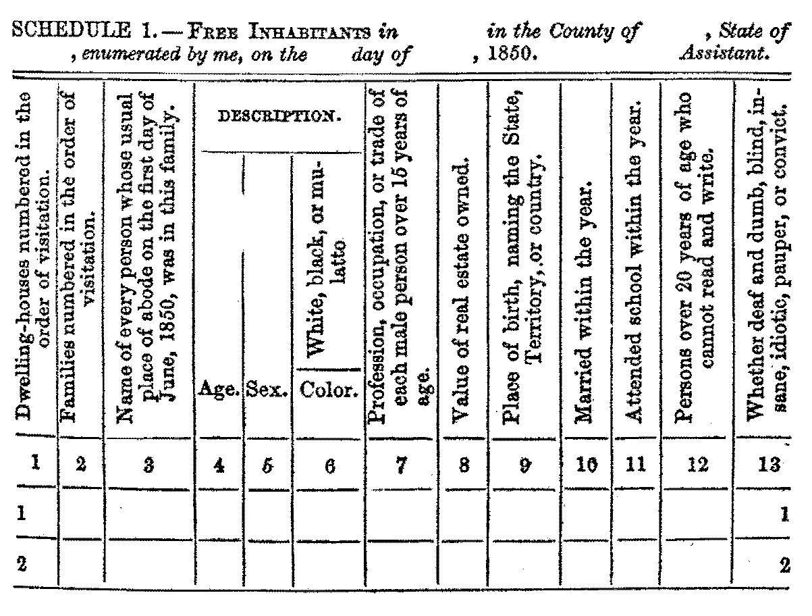

# Ethics in Obtaining Data

**[← Back to Course Homepage](../../../)**

*This chapter is in-progress.*

## Where do data come from?

Do you generate it?
Do you collect it?
Do you obtain it?

## What "obtaining data" includes

TK

## Case Study: Facebook Profile
The first Facebook profile

## Case Study: Census Data

Four original census artifacts:

### Census form in 1790

[Massachusetts printed schedule used in the 1790 census](assets/census/1790-massachusetts-printed-schedule.pdf)

Categories: free White males 16 and over, free White males under 16, free White females, all other free persons, and slaves.

<embed src="assets/census/1790-massachusetts-printed-schedule.pdf" type="application/pdf" width="100%" height="700px">

Source: [Census Bureau 1790 questionnaire page](https://www.census.gov/programs-surveys/decennial-census/technical-documentation/questionnaires.1790_Census.html), [National Archives scan hosted by Census.gov](https://s3.amazonaws.com/NARAprodstorage/lz/dc-metro/rg-029/5634994/5634994_01_01790.pdf).

### Census form in 1850

[Free Inhabitants schedule](assets/census/1850-free-inhabitants-schedule.png)

Categories: name, age, sex, color, occupation, value of real estate, birthplace, married within the year, school attendance, literacy, deafness, dumbness, blindness, insanity, idiocy, pauper status, and conviction.

Source: [Census Bureau 1850 questionnaire page](https://www.census.gov/programs-surveys/decennial-census/technical-documentation/questionnaires.1850_Census.html), [direct image file from Census Bureau](https://www2.census.gov/programs-surveys/decennial/technical-documentation/questionnaires/1850/1850-free-inhabitants-schedule.png).

### Census form in 1940

[Population questionnaire](assets/census/1940-population-questionnaire.pdf)

Categories: name, relationship, personal description, residence, birthplace, citizenship, education, employment, occupation, income, veteran status, Social Security, and selected supplemental questions for sample respondents.

<embed src="assets/census/1940-population-questionnaire.pdf" type="application/pdf" width="100%" height="700px">

Source: [Census Bureau 1940 questionnaire page](https://www.census.gov/programs-surveys/decennial-census/technical-documentation/questionnaires.1940_Census.html), [direct PDF from Census Bureau](https://www.census.gov/content/dam/Census/programs-surveys/decennial/technical-documentation/questionnaires/1940_population_questionnaire.pdf).

### Census form in 2020

[Informational bilingual questionnaire](assets/census/2020-informational-questionnaire.pdf)

Categories: household count, ownership or tenure, phone number, name, sex, age and date of birth, Hispanic/Latino/Spanish origin, race, relationship, and whether the person usually lives or stays elsewhere.

<embed src="assets/census/2020-informational-questionnaire.pdf" type="application/pdf" width="100%" height="700px">

Source: [Census Bureau 2020 questionnaire page](https://www.census.gov/programs-surveys/decennial-census/technical-documentation/questionnaires.2020_Census.html), [direct PDF from Census Bureau](https://www2.census.gov/programs-surveys/decennial/2020/technical-documentation/questionnaires-and-instructions/questionnaires/2020-informational-questionnaire.pdf).

Notes from [Wikipedia's "Race and ethnicity in the United States census," section "Relation between ethnicity and race in census results"](https://en.wikipedia.org/wiki/Race_and_ethnicity_in_the_United_States_census#Relation_between_ethnicity_and_race_in_census_results)
* treats `Hispanic or Latino` as ethnicity, not race, so it asks as separate questions.
* In `2000`, a large share of Hispanic/Latino respondents selected `Some other race`, showing a mismatch between official categories and how respondents describe themselves.
* Since `2000`, respondents have been allowed to select more than one race, so race totals can exceed the total population (not directly comparable with older censuses).

Source summary: .

## References
