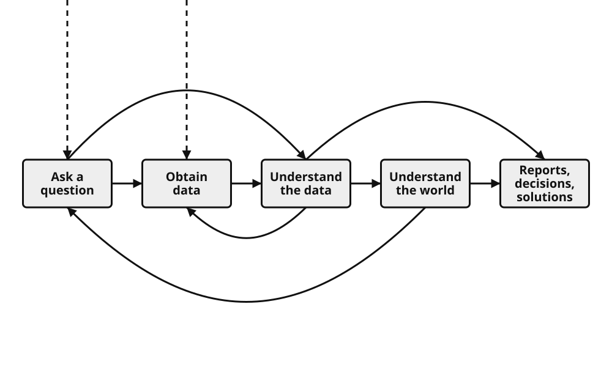

# Introduction to Ethics in Data Science

**[← Back to Course Homepage](../../../)**

*This is a placeholder page. The book is a work-in-progress.*

::: {#fig-ds-lifecycle}

The data science lifecycle.
:::

The purpose of this mini-book is to introduce data scientists to ethical considerations that arise throughout the data science lifecycle. The book is thus organized around the lifecycle described in *Learning Data Science*, which divides data work into four broad stages [@lau_learning_2023].

These stages correspond to the chapters in this book as follows:

| *Learning Data Science* | Corresponding material in this book |
| --- | --- |
|  | Introduction (this chapter) |
| [1. The Data Science Lifecycle](https://learningds.org/ch/01/lifecycle_intro.html) | [Working Toward Wisdom](01-working-toward-wisdom.md) |
| [1.1. The Stages of the Lifecycle: Ask a Question](https://learningds.org/ch/01/lifecycle_cycle.html) | [Ethics in Asking Questions](02-ethics-in-asking-questions.md) |
| [1.1. The Stages of the Lifecycle: Obtain Data](https://learningds.org/ch/01/lifecycle_cycle.html) | [Ethics in Obtaining Data](03-ethics-in-obtaining-data.md) |
| [1.1. The Stages of the Lifecycle: Understand the Data](https://learningds.org/ch/01/lifecycle_cycle.html) | [Ethics in Understanding](04-ethics-in-understanding.md) |
| [1.1. The Stages of the Lifecycle: Understand the World](https://learningds.org/ch/01/lifecycle_cycle.html) | [Ethics in Understanding](04-ethics-in-understanding.md) |
| Reports, decisions, solutions| [Ethics in Reporting Decisions & Solutions](05-ethics-in-reporting-decisions-solutions.md) |
|  | [Concluding remarks](06-conclusions.md) |

The central premise is that ethical judgment is not a separate task to complete after the technical work is finished. It shapes how data scientists frame questions, define scope, collect and prepare data, interpret patterns, draw conclusions, communicate uncertainty, and support decisions.

*Format testing*

Lorem ipsum dolor sit amet, consectetur adipiscing elit. Sed do eiusmod tempor incididunt ut labore et dolore magna aliqua. Ut enim ad minim veniam, quis nostrud exercitation ullamco laboris nisi ut aliquip ex ea commodo consequat.

Duis aute irure dolor in reprehenderit in voluptate velit esse cillum dolore eu fugiat nulla pariatur. Excepteur sint occaecat cupidatat non proident, sunt in culpa qui officia deserunt mollit anim id est laborum.

## Section 1

Lorem ipsum dolor sit amet, consectetur adipiscing elit. Sed do eiusmod tempor incididunt ut labore et dolore magna aliqua.

- Point 1: Lorem ipsum dolor sit amet
- Point 2: Consectetur adipiscing elit
- Point 3: Sed do eiusmod tempor incididunt

## Section 2

Ut labore et dolore magna aliqua. Ut enim ad minim veniam, quis nostrud exercitation ullamco laboris nisi ut aliquip ex ea commodo consequat.

### Subsection A

Duis aute irure dolor in reprehenderit in voluptate velit esse cillum dolore eu fugiat nulla pariatur.

### Subsection B

Excepteur sint occaecat cupidatat non proident, sunt in culpa qui officia deserunt mollit anim id est laborum.

## Section 3

Lorem ipsum dolor sit amet, consectetur adipiscing elit, sed do eiusmod tempor incididunt ut labore et dolore magna aliqua. Ut enim ad minim veniam, quis nostrud exercitation ullamco laboris nisi ut aliquip ex ea commodo consequat.

---

Chapters to align with from [learning data science textbook](https://learningds.org/ch/01/lifecycle_cycle.html):
* Ethics in asking questions
	* Eugenics example
* Ethics in obtaining data
* Ethics in understanding data
* Ethics in understanding the world
* Ethics in reports, decisions, and solutions
	* Designing and testing interventions

Tentative topics list:
* what ethics means in data science
	* does ethics ever really change?
* tech debt and documentation debt
* defining and handling sensitive information
* risks from data triangulation (i.e. re-identification, de-anonymization)
* prediction as influence 
* what can and cannot (should/should not) be predicted
* practices in data collection/generation
	* incomplete data, non-consensually collected data
	* too much / too invasive data
* ad-hoc support of suspect decision-making

## References
