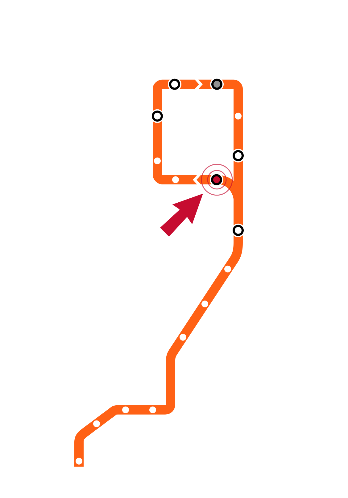

# Week 0 Slide Deck {.course-title}

<h2>Quarto Slide Demo</h2>

Jack Bandy
2026

This is a demo slide deck for reference and experimentation.

# Week 0, Day 1 {.course-title .photo-title data-state="photo-title" background-image="../assets/orange-line-stops-better/stop01-harold-washington-library-a.jpg" background-size="cover"}

<h2>Harold Washington Library</h2>

CS 418 · Week 0 · 🟠 Harold Washington Library 🟠

---

## {.photo-only data-state="photo-only" background-image="../assets/orange-line-stops-better/stop01-harold-washington-library-a.jpg" background-size="cover"}

## Map {.split}

::: {.split-content .narrow-aside}

::: {}
- Week 0: Harold Washington Library
- Day 1
    - Common Slide Templates
    - Image & Embed Slides
:::

{.figure alt="Orange Line map with the Harold Washington Library stop marked, the Week 0 stop"}

:::

---

# Common Slide Templates {.section-header}


## Section Headers {.smaller}

- `slide-level: 2` in the frontmatter turns every `#` into a section divider
- the `##` slides that follow it nest underneath it in the navigation menu (press
<kbd>M</kbd>) as an indented group

``` markdown
# Common Slide Templates {.section-header}

## Content Slide

## Incremental Bullets
```

::: {.aside-note}
Common issues: a `---` directly before or after a `#` emits a blank slide, and a
title-slide subtitle must be written as raw `<h2>…</h2>` so it does not start a
slide of its own.
:::

---

## Content Slide

Here is a basic content slide.

- Lorem ipsum dolor sit amet
- Consectetur adipiscing elit
- Sed do eiusmod tempor incididunt ut labore et dolore magna aliqua
- Test quote below

> "The greatest value of a picture is when it forces us to notice what we never expected to see." — John Tukey

---

## Tukey on Pictures {.quote-slide}

> The greatest value of a picture is when it forces us to notice what we never expected to see.

::: {.attribution}
John W. Tukey
:::

::: {.quote-source}
*Exploratory Data Analysis* (1977), p. vi. (Note the `h1` ("Tukey on Pictures") is hidden but stays in the markdown, so the slide still shows up in the outline and slide menu.)
:::

---

## Incremental Bullets

::: {.incremental}
* display this first
* display this second
* display this third
* display this fourth
* display this fifth
:::

---

## Fragments

Unlike `.incremental`, individual `.fragment` divs can be ordered and given
their own animation, which is what the build slides below rely on.

::: {.fragment}
A plain `.fragment` is hidden until you advance to it.
:::

::: {.fragment .fade-out fragment-index=2}
`.fade-out` is the reverse: visible from the start, gone at step 2.
:::

::: {.fragment .fade-in-then-out fragment-index=2}
`.fade-in-then-out` appears at step 2 and leaves again at step 3.
:::

::: {.fragment fragment-index=3}
Sharing a `fragment-index` is how one block swaps in as another swaps out.
:::

::: {.notes}
Anything inside a `.notes` div is speaker-only — press `S` to open the speaker
view. It never renders on the slide itself.
:::

---

## Tabsets

Drop a finger on a random spot of the spinning globe: **Water** or **Land**? About 75% of Earth's surface is water, so each toss is a coin flip weighted by `p`. Here it is in four languages:

::: {.panel-tabset}

### Python

```python
import random

def globe_toss(p=0.75):
    return "Water" if random.random() < p else "Land"
```

### R

```r
globe_toss <- function(p = 0.75) {
  sample(c("Water", "Land"), size = 1, prob = c(p, 1 - p))
}
```

### Julia

```julia
globe_toss(p = 0.75) = rand() < p ? "Water" : "Land"
```

### JavaScript

```javascript
function globeToss(p = 0.75) {
  return Math.random() < p ? "Water" : "Land";
}
```

:::

---

## Pretty Code

- Syntax highlighting works in revealjs slides
- Code uses the theme's Courier stack

```python
import polars as pl


def summarize_ridership(stations: pl.DataFrame) -> pl.DataFrame:
    return (
        stations
        .group_by("line")
        .len(name="station_count")
        .sort("station_count", descending=True)
    )
```

---

## Line Highlighting

```{.python code-line-numbers="1-2|4-5|7-11|13"}
import numpy as np
import polars as pl

stations = pl.read_csv("cta_stations.csv")
orange = stations.filter(pl.col("line") == "Orange")

by_access = orange.group_by("accessible").len(name="station_count")
share = np.round(
    by_access["station_count"] / by_access["station_count"].sum(),
    2,
)

print(by_access.with_columns(accessible_share=share))
```

---

## Code + Figure {.code-figure-slide}

The globe toss from earlier: the proportion of water converges on `p`.

```{python}
#| echo: true
#| fig-alt: "Running proportion of water across 500 simulated globe tosses, converging toward the dashed line at 0.75"
import numpy as np
import matplotlib.pyplot as plt
water = np.random.default_rng(418).random(500) < 0.75
running = np.cumsum(water) / np.arange(1, 501)
fig, ax = plt.subplots()
ax.plot(running, color="#f9461c")
ax.axhline(0.75, color="#565a5c", linestyle="--")
ax.set(xlabel="toss", ylabel="proportion water", ylim=(0, 1))
```

---

## Code + Figure, Side by Side {.code-figure-side}

Simulate 9 tosses at a time: how often does water come up 0, 1, ... 9 times?

```{python}
#| echo: true
#| fig-width: 4.5
#| fig-height: 4.5
#| fig-alt: "Histogram of the number of water results in 9 globe tosses across 10,000 simulations, peaking near 7"
rng = np.random.default_rng(418)
counts = rng.binomial(9, 0.75, size=10_000)
fig, ax = plt.subplots()
ax.hist(
    counts,
    bins=np.arange(11) - 0.5,
    color="#f9461c",
    edgecolor="white",
)
ax.set(
    xlabel="water in 9 tosses",
    ylabel="simulations",
    xticks=range(10),
);
```

---

## Figure Only {.figure-slide}

```{python}
#| echo: false
#| fig-width: 10
#| fig-height: 4.2
#| fig-alt: "Running proportion of water across 500 simulated globe tosses, drawn wide with no code shown, converging toward the dashed line at 0.75"
fig, ax = plt.subplots(figsize=(10, 4.2))
ax.plot(running, color="#f9461c")
ax.axhline(0.75, color="#565a5c", linestyle="--")
ax.set(xlabel="toss", ylabel="proportion water", ylim=(0, 1));
```

---

## Building Up a Figure {.code-figure-slide .build-slide}

::: {.r-stack}

::: {.fragment .fade-out fragment-index=1}
```{python}
#| echo: true
#| fig-alt: "Running proportion of water across 500 globe tosses, plotted with default styling and a full 0-to-1 y-axis"
fig, ax = plt.subplots()
ax.plot(running)
```
:::

::: {.fragment .fade-in-then-out fragment-index=1}
```{python}
#| echo: true
#| fig-alt: "The same running-proportion line, now drawn in UIC orange"
fig, ax = plt.subplots()
ax.plot(running, color="#f9461c")
ax.set(ylim=(0, 1))
```
:::

::: {.fragment fragment-index=2}
```{python}
#| echo: true
#| fig-alt: "The same line with axis labels and a dashed reference line marking the true proportion of 0.75"
fig, ax = plt.subplots()
ax.plot(running, color="#f9461c")
ax.axhline(0.75, color="#565a5c", linestyle="--")
ax.set(xlabel="toss", ylabel="proportion water", ylim=(0, 1))
```
:::

:::

---

## Text + Figure {.text-figure-slide}

::: {.columns}
::: {.column width="50%"}
::: {.incremental}
- Bullets on the left, tall figure on the right
- The figure cell uses `echo: false`
- Each toss lands **Water** with probability `p = 0.75`
- Most batches of 9 tosses give 6–8 waters
:::
:::
::: {.column width="50%"}
```{python}
#| echo: false
#| fig-alt: "Histogram of the number of water results in 9 globe tosses across 10,000 simulations, drawn tall to fill the right column"
fig, ax = plt.subplots()
_w = plt.rcParams["figure.figsize"][0]
fig.set_size_inches(_w, _w * 1.2)
ax.hist(
    counts,
    bins=np.arange(11) - 0.5,
    color="#f9461c",
    edgecolor="white",
)
ax.set(xlabel="water in 9 tosses", ylabel="simulations", xticks=range(10));
```
:::
:::

---

## Column Layout {.smaller}

::: columns
::: {.column width="42%"}
### Course Pattern

- Ask a data question
- Find the relevant table
- Check the units
- Make a readable view
:::

::: {.column width="58%"}
A little table

| Week | Focus |
|---:|---|
| 0 | Setup and orientation |
| 1 | Blah blah |
| 2 | Blah blah blah |
| 3 | Blah blah blah blah |
:::
:::


---

## Auto-Animate {auto-animate="true" auto-animate-easing="ease-in-out"}

::: r-hstack
::: {data-id="box1" style="background: #f9461c; width: 260px; height: 56px; margin: 10px;"}
:::
::: {data-id="box2" style="background: #565a5c; width: 180px; height: 56px; margin: 10px;"}
:::
:::

---

## Auto-Animate {auto-animate="true" auto-animate-easing="ease-in-out"}

::: r-stack
::: {data-id="box1" style="background: #f9461c; width: 360px; height: 360px; border-radius: 220px;"}
:::
::: {data-id="box2" style="background: #565a5c; width: 190px; height: 190px; border-radius: 120px;"}
:::
:::

---

## Auto-Animate Notes {.smaller}

::: {style="font-size:0.8em; line-height:1.5;"}
- `auto-animate` on a single slide will do nothing
- needs back-to-back slides
- **Give matched elements a `data-id`.**
- Reveal will auto-matche text by content and images by `src`
- an explicit `data-id` wins and keeps a figure connected
:::


# Image & Embed Slides {.section-header}


## Image Frame Slide {.image-frame-slide}


---

## Standard Image Treatment {.smaller}

Content images have a hairline border and a soft drop shadow as shown below. The border
gives a white-background image an edge against a white slide and the shadow makes it appear as a picture of something (rather than as part of the slide itself).

::: {style="font-size:0.8em; line-height:1.5;"}
- **Automatic** on `{.image-frame-slide}` and `{.image-slide}` — the theme styles the image, so add no inline style.
- **`{.split}` layouts deliberately opt out** — the diagrams sit inside a text column, where a frame would crowd them.
- **Styling an image inline** (e.g. inside `::: {.columns}`) bypasses the theme, so add the treatment yourself:
:::

``` html
border:1px solid rgba(0, 0, 0, 0.12); box-shadow:0 10px 28px rgba(0, 0, 0, 0.12);
```

::: {style="font-size:0.72em; color:#565a5c; margin-top:0.4em;"}
For exceptions meant to float on the slide background (transparent
SVGs), set `border:none; box-shadow:none; background:transparent;`
:::

---

## Golden Rectangles {.smaller}

make figures/pictures/things **[golden rectangles](https://en.wikipedia.org/wiki/Golden_rectangle)** whenever possible !
( sides in the ratio 1 : φ, φ ≈ 1.618)

::: {style="font-size:0.8em; line-height:1.5;"}
- Consistent proportions mean figures sit at the same size slide to slide, instead of each one needing its own `max-height` nudge.
- can be portrait or landscape rectangles
- Ex. `00-triangle-best.svg` is **1600 × 989**,
- Just a convention / fingerprint / signature
:::


---

## Florence Nightingale's Mortality Diagram (1858) {.split data-auto-animate=""}

::: {.split-content}

::: {}

A **polar area chart** showing causes of mortality in the Crimean War:

- Blue: deaths from preventable disease
- Red: deaths from wounds
- Black: other causes

Used to advocate for sanitary reforms in military hospitals.
:::


:::

---

## Auto-Animate: Grow and Center {data-auto-animate=""}


---

## Auto-Animate: Bring in a Caption {data-auto-animate=""}


::: {.caption}
Blue: preventable disease · Red: wounds · Black: other causes.
:::

---

## Auto-Animate: Cross the Slide {.split .smaller data-auto-animate=""}

::: {.split-content}


::: {}

- Same element, different box
- `data-id` on both copies matches them
- Keep `object-fit` the same across the chain
:::

:::

---

## Image Only: Full-Bleed {.image-only data-state="image-only"}

<!-- No data-id here on purpose: .image-only crops with object-fit: cover, and
     object-fit is not animatable, so morphing into it from the contained
     figures above snaps mid-flight. This slide cuts instead. -->


---

## University of Illinois Chicago {.iframe-slide}

<iframe src="https://www.uic.edu" style="border: 1px solid #999; box-shadow: 0 10px 28px rgba(0,0,0,0.12); border-radius: 3px;"></iframe>

::: {.iframe-caption}
An `.iframe-caption` sits under the embed at small type — use it for a source line or a URL: <https://www.uic.edu>
:::

---


## Discussion Template w Timer {.split}

::: {.split-content .golden-columns}

::: {}

1. Demo question 1
2. Demo question 2
3. Demo question 3
:::

<!-- The golden ratio is in the column split (φ : 1), so the frame itself is
     free to be whatever shape shows the timer best. -->
<iframe src="https://dodatascience.fun/timer/" title="CTA-style countdown timer" loading="lazy" style="width: 100%; height: 420px; display: block; border: 1px solid #999; box-shadow: 0 10px 28px rgba(0,0,0,0.12); border-radius: 3px;"></iframe>

:::

---


## TODO Slide Template

::: {style="border:3px dashed #f9461c; border-radius:12px; padding:0.8em 1em; margin-top:0.4em;"}
[TODO]{.eyebrow .todo}

``` markdown
<!-- TODO: what's missing  -->
```
:::

::: {.aside-note}
`.eyebrow .todo` is the theme's boxed drafting marker — use it instead of an
inline `style` so every unfinished slide in every deck looks the same and is
greppable.
:::

---

## How to do Citations {.smaller}

- `_quarto.yml` sets `bibliography: references.bib`, so Pandoc will resolve it
- e.g. for parenthetical — `[@tukey1986collected]` will become: [@tukey1986collected]
- In-text — `@brillinger2011eda` will become: @brillinger2011eda
- There is also a catch-all 'sources' slide at the end of every week
- Also add links in captions for figures/images
- Suppress the author with `[-@key]`: [-@tukey1986collected]. Add a locator with
`[@key, p. 806]`: [@tukey1986collected, p. 806].

::: {.notes}
Test slide: confirms citations resolve in the revealjs decks. The rest of the
decks currently cite manually on a Sources slide instead, so this is currently the only
place citeproc is exercised. Will polish soon, but low-priority since there are other ways to cite...
:::

---

## References {.smaller}

Anything cited above is collected here by the `#refs` div:

::: {#refs}
:::


# Week 0, Day 2 {.course-title .photo-title data-state="photo-title photo-title-zoom" background-image="../assets/orange-line-stops-better/stop01-harold-washington-library-a.jpg" background-size="cover"}

<h2>TODO</h2>

Jack Bandy
2026

---

## Map {.split}

::: {.split-content .narrow-aside}

::: {}
<!-- TODO: Day 2 has no content yet -- move this title slide and map to
     wherever the split belongs, then fill in the agenda. -->
- Week 0: Harold Washington Library
- Day 2
    - TODO
:::

{.figure alt="Orange Line map with the Harold Washington Library stop marked, the Week 0 stop"}

:::

---

# Appendix: More Template Slides {.section-header}

## What's in the Appendix {.smaller}

The templates above cover the shapes a slide deck needs when it is mostly code
and figures. These are the shapes the content weeks actually reach for: a static
figure next to prose, parallel columns, a definition built up in fragments, a
single number, and the small-text vocabulary that goes with all of them.

::: {.dense-smaller}
- **`.figure-aside`** — text left, static figure + credit right
- **`.compare-columns`** — two or three parallel columns, evenly split
- **`.prompt-slide`** — a question that owns the whole slide
- **`.stat-callout`** — one number as the whole argument
- **`.term` / `.key` / `.strike`** — inline emphasis with fixed meanings
- **`.eyebrow` / `.dense` / `.dense-smaller` / `.caption`** — the small-text scale
:::

---

## Text + Figure {.figure-aside}

::: {.columns}
::: {.column}
::: {.incremental}
- Prose on the left, a **static** figure on the right
- Different from `.text-figure-slide`, which wraps a computed `{python}` cell
- The right column has room for a `.caption` credit line
- Column widths come from the theme — do not set `width=` here
:::
:::
::: {.column}


::: {.caption}
Source line goes here, under the figure it credits.
:::
:::
:::

---

## Text + Figure: the markup {.smaller}

``` markdown
## Slide Title {.figure-aside}

::: {.columns}
::: {.column}
- bullets on the left
:::
::: {.column}


::: {.caption}
Credit line.
:::
:::
:::
```

::: {.aside-note}
Use `.figure-sm` or `.figure-lg` alongside `.figure` when one image needs to run
shorter or taller than the 520px default — not a bespoke `max-height`.
:::

---

## Two Parallel Columns

::: {.columns .compare-columns}

::: {.column}
[THE CLAIM]{.eyebrow}

::: {.dense}
- Neither column is the main one
- So neither gets the wider half
- `.compare-columns` splits the row evenly
:::
:::

::: {.column}
[THE CATCH]{.eyebrow}

::: {.dense}
- Add or drop a column and nothing needs re-measuring
- The class goes on the `.columns` row, not on the slide
- `.eyebrow` labels each column
:::
:::

:::

---

## Three Parallel Columns

::: {.columns .compare-columns}

::: {.column}
[ONE]{.eyebrow}

::: {.dense-smaller}
Same class, three children. The row splits into thirds on its own.
:::
:::

::: {.column}
[TWO]{.eyebrow}

::: {.dense-smaller}
Use `.dense-smaller` in narrow columns so the text still fits without a per-slide font size.
:::
:::

::: {.column}
[THREE]{.eyebrow}

::: {.dense-smaller}
Works with images too — give each one `.figure .figure-sm` and let the column set the width.
:::
:::

:::

---

## Parallel Columns: the markup {.smaller}

``` markdown
::: {.columns .compare-columns}

::: {.column}
[LABEL]{.eyebrow}

::: {.dense}
- points
:::
:::

::: {.column}
[OTHER LABEL]{.eyebrow}

::: {.dense}
- other points
:::
:::

:::
```

---

## Building Up a Definition

::: {.caption}
A source line at the *top* of a slide credits the content below it, not a figure.
:::

::: {.fragment .strike}
The phrasing we are about to correct.
:::

::: {.fragment}
The corrected phrasing, with the [operative word]{.key} carried in orange.
:::

::: {.fragment}
[term]{.term}: the thing being named sits in navy, so a highlight means the same
thing on every slide.
:::

::: {.fragment}
So what does that leave us with? [The sentence worth remembering.]{.key}
:::

::: {.notes}
`.term` and `.key` both set their own bold, so write `[data]{.term}` — not
`[**data**]{.term}`.
:::

---

## One Number

::: {.stat-callout}
[~400 million]{.stat-number}
[terabytes of data created — every single day]{.stat-label}
:::

::: {.dense-smaller style="text-align:center; margin-top:0.6em;"}
A short line underneath says why the number matters.
:::

::: {.caption}
Credit the number. A statistic without a source is a rumor.
:::

---

## One Number: the markup {.smaller}

``` markdown
::: {.stat-callout}
[~400 million]{.stat-number}
[terabytes of data created — every single day]{.stat-label}
:::
```

::: {.dense}
- The number is set in the title face, at display size, in orange
- The navy panel sets it apart the way `.quote-slide` sets apart a quotation
- One number per slide — a second one is a table, not a callout
:::

---

## Your Turn: What Should This Deck Add? {.prompt-slide}

::: {.prompt-eyebrow}
Discuss
:::

::: {.prompt-question}
Which slide shape did you reach for that this deck does not have?
:::

---

## The Prompt Slide {.smaller}

``` markdown
## Slide Title (hidden on the slide) {.prompt-slide}

::: {.prompt-eyebrow}
Discuss
:::

::: {.prompt-question}
The question, set large enough to read from the back.
:::
```

::: {.aside-note}
The `##` title is hidden but kept in the markdown so the slide still appears in
the outline and the slide menu (<kbd>M</kbd>) — the same trick `.quote-slide`
uses.
:::

---

## The Small-Text Scale {.smaller}

::: {.dense}
| Class | Role | Where it sits |
|---|---|---|
| `.caption` | credit or source | under a figure, or atop a body of prose |
| `.aside-note` | pointer to a reading or a caveat | after the content it qualifies |
| `.eyebrow` | label for the block below | above a column or a panel |
| `.eyebrow .todo` | drafting marker | on unfinished slides |
| `.dense` | tighten body copy | lists and tables |
| `.dense-smaller` | tighten it further | narrow columns |
:::

::: {.aside-note}
All six are theme classes. Reach for one of them before writing an inline
`style=`; if none of them fits, that is a sign the theme is missing something.
:::


# Sources {.sources}

1. GitHub source: <https://github.com/jackbandy/data-science-fun/blob/main/docs/slides/week0.qmd>.
2. Slides developed using materials from [Elena Zheleva](https://www.cs.uic.edu/~elena/) and [Gonzalo Bello Lander](https://cs.uic.edu/profiles/gonzalo-bello/), the Berkeley DS 100 team, Marine Carpuat, and Brian Ziebart.
3. Slide deck built with [Quarto](https://quarto.org/) revealjs.
4. Title font is Big Shoulders; Body font is [Libre Franklin](https://en.wikipedia.org/wiki/Franklin_Gothic#Libre_Franklin).
5. Nightingale, Florence. "Diagram of the causes of mortality in the army in the East." *Notes on Matters Affecting the Health, Efficiency, and Hospital Administration of the British Army*, 1858. Image via Wikimedia Commons: <https://commons.wikimedia.org/wiki/File:Nightingale-mortality.jpg>. Public domain.
6. Tukey, John W. *Exploratory Data Analysis*. Addison-Wesley, 1977.
