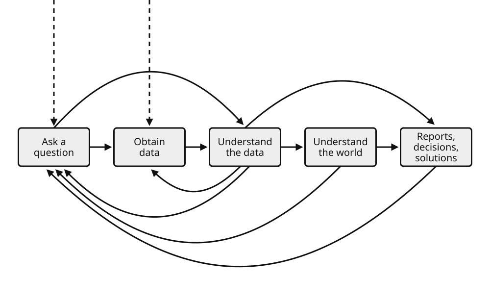
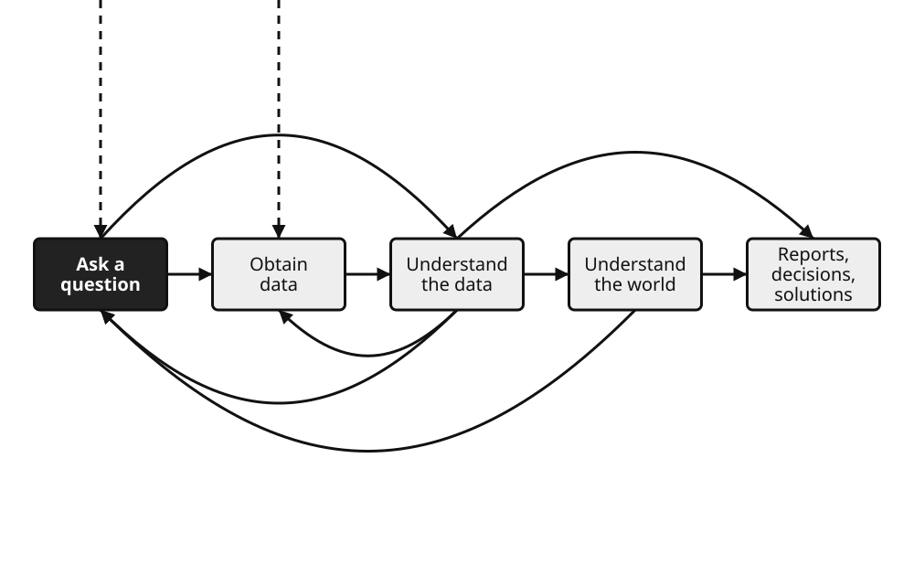
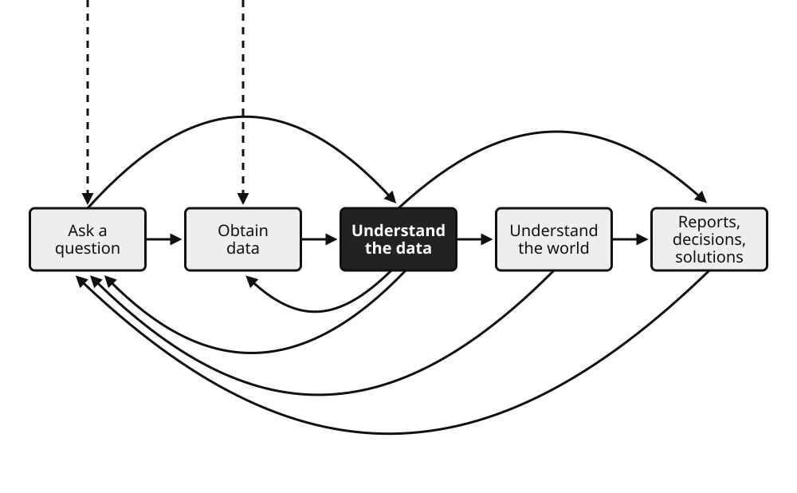
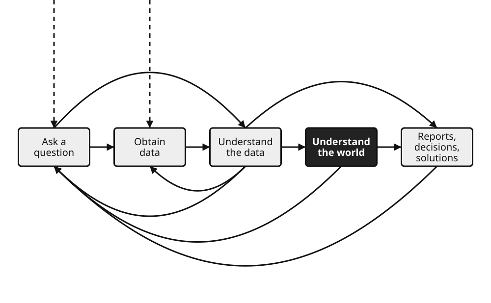
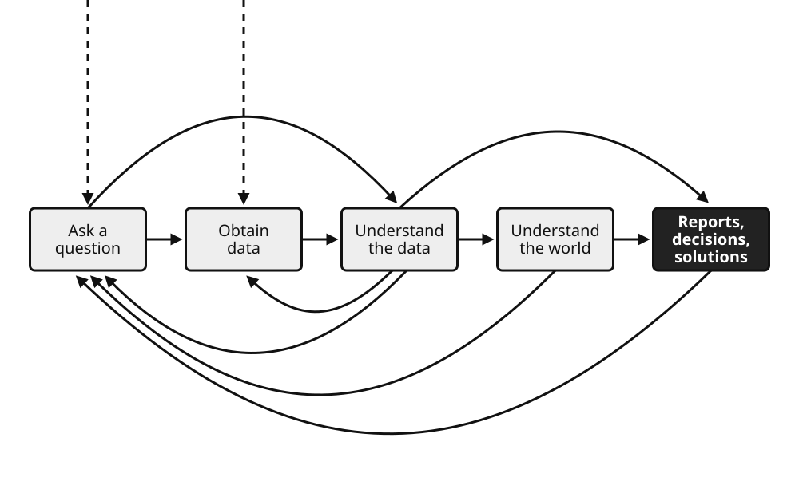

# Week 1 Slide Deck {.course-title}

## Intro, Stats Review; Data Science Lifecycle

Jack Bandy
2026

---

# Demo Content Slide

Placeholder content for Week 1.

- Course introduction
- Statistics review
- Data science lifecycle

---

# Data Science Lifecycle {.section-header}

---

# The Data Science Lifecycle {.image-frame-slide}

---

# The Data Science Lifecycle {.image-frame-slide}

---

# The Data Science Lifecycle {.image-frame-slide}

---

# The Data Science Lifecycle {.image-frame-slide}

---

# The Data Science Lifecycle {.image-frame-slide}

---

# The Data Science Lifecycle {.image-frame-slide}

---

# The DIKW Pyramid {.section-header}

---

# The DIKW Pyramid {.image-frame-slide}

---

# The DIKW Pyramid {.image-frame-slide}

---

# The DIKW Pyramid {.image-frame-slide}

---

# The DIKW Pyramid {.image-frame-slide}

---

# The DIKW Pyramid {.image-frame-slide}

---

# The DIKW Pyramid {.image-frame-slide}

---

# Sources {.sources}

1. GitHub source: <https://github.com/jackbandy/data-science-fun/blob/main/docs/slides/week1.md>.
2. Slides developed using materials from [Elena Zheleva](https://www.cs.uic.edu/~elena/) and [Gonzalo Bello Lander](https://cs.uic.edu/profiles/gonzalo-bello/), the Berkeley DS 100 team, Marine Carpuat, and Brian Ziebart.
3. Slide deck built with [Quarto](https://quarto.org/) revealjs.
4. Title font is Big Shoulders; Body font is [Libre Franklin](https://en.wikipedia.org/wiki/Franklin_Gothic#Libre_Franklin).
