# Week 1, Day 1 {.course-title .photo-title data-state="photo-title" background-image="../assets/orange-line-stops-better/stop01-harold-washington-library-a.jpg" background-size="cover"}

<h2>Intro; Data Science Lifecycle</h2>

Jack Bandy
2026

---

## {.photo-only data-state="photo-only" background-image="../assets/orange-line-stops-better/stop01-harold-washington-library-a.jpg" background-size="cover"}

---

## Week 1

- Course introduction / syllabus overview
- Data science lifecycle
- The DIKW pyramid
- Statistics review

# Course Logistics {.section-header}

## Syllabus Overview {.iframe-slide}

<iframe src="../syllabus/" title="CS 418 syllabus" loading="lazy" style="border: 1px solid #999; box-shadow: 0 10px 28px rgba(0,0,0,0.12); border-radius: 3px;"></iframe>

::: {.iframe-caption}
Full syllabus: <https://dodatascience.fun/syllabus/>
:::

---

## Attendance Policy

::: {style="border:3px dashed #f9461c; border-radius:12px; padding:0.8em 1em; margin-top:0.4em;"}
[TODO]{.eyebrow .todo}

::: {.dense}
- **TK**
:::
:::

---

## In-Class Tech

::: {style="border:3px dashed #f9461c; border-radius:12px; padding:0.8em 1em; margin-top:0.4em;"}
[TODO]{.eyebrow .todo}

::: {.dense}
- **TK** — laptops, phones, etc. during class...
:::
:::

<!-- TODO: when laptops are open vs. closed -->

---

## Let's Talk About It {.image-frame-slide}

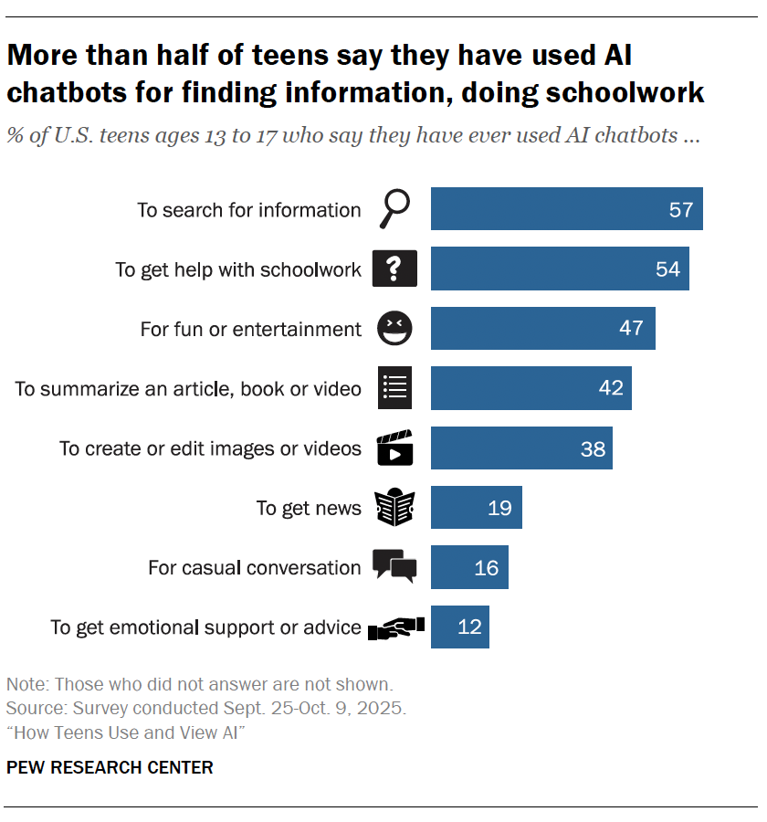

::: {.caption}
From Colleen McClain, Monica Anderson, Olivia Sidoti, and William Bishop, ["How Teens Use and View AI"](https://www.pewresearch.org/internet/2026/02/24/how-teens-use-and-view-ai/), Pew Research Center, February 24, 2026.
:::

---

## The Benefits of Paper

::: {style="border:3px dashed #f9461c; border-radius:12px; padding:0.8em 1em; margin-top:0.4em;"}
[TODO]{.eyebrow .todo}

::: {.dense}
- **TK**
:::
:::

<!-- TODO: handwritten notes, worksheets, sketch charts first, etc. -->

---

## Schedule Overview

::::: {.columns}

:::: {.column width="60%"}
::: {.dense-smaller}
| Weeks | Topic |
|:--|:--|
| **1** | Intro; statistics review; the lifecycle |
| **2–3** | Python, Polars, obtaining & wrangling data |
| **4** | Exploratory analysis; descriptive statistics |
| **5–6** | Visualization |
| **7** | Hypothesis testing; estimation & sampling |
| **8–9** | Regression; classification; trees; SVMs |
| **10** | Clustering; PCA; model evaluation |
| **11** | Recommendation systems; A/B testing |
| **12** | Network analysis; graphs |
| **14–15** | Presentations |
:::

::: {.aside-note}
Schedule is on the course [home](https://dodatascience.fun/#schedule).
:::
::::

:::: {.column width="36%"}
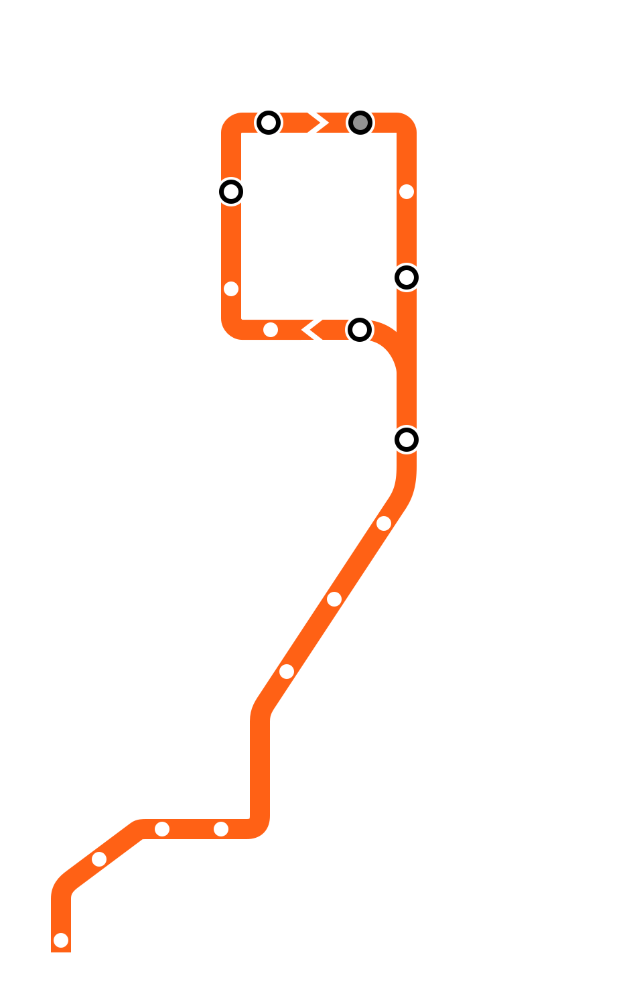

::: {.caption}
:::
::::

:::::

---

## What to Expect in this Class

::::: {.columns}

:::: {.column width="32%"}
TOOLING

::: {.incremental}
::: {.dense-smaller}
- **Python**
- **Polars** for dataframes
- **seaborn**, **plotnine**
- Also!
- Sample of **R** and **Rstudio**
- **tidyverse** and **ggplot**
- Also!
- **git** + **GitHub**
:::
:::
::::

:::: {.column width="32%"}
TECHNIQUES

::: {.incremental}
::: {.dense-smaller}
- Sampling / randomness
- Exploratory analysis
- **Chart/figure design**
- Confidence intervals
- Linear regression
- Classification methods
- (trees, SVMs, etc.)
- $k$-means clustering, PCA
- A/B testing, RCT setup
- Network/community analysis
:::
:::
::::

:::: {.column width="32%"}
THEMES

::: {.incremental}
::: {.dense-smaller}
- The data science lifecycle
- Questions worth answering
- **Provenance**: tracing data through the lifecycle
- Reasoning under uncertainty
- What models can / can't do
- Ethics and implications
- Reproducible work
- Communicating results
:::
:::
::::

:::::

---

## Do the Tools Matter?

::: {style="border:3px dashed #f9461c; border-radius:12px; padding:0.8em 1em; margin-top:0.4em;"}
[TODO]{.eyebrow .todo}

::: {.dense}
- **TK**
:::
:::

<!-- TODO: Polars vs. pandas, Python vs. R, notebook vs. script; etc. -->

# Defining Data Science {.section-header}

## A Dictionary Definition

[START WITH THE FIRST WORD]{.eyebrow}

::: {.fragment .strike}
What is data?
:::

::: {.fragment}
What [**are**]{style="color:#f9461c;"} data?
:::

::: {.fragment}
[**data**]{style="color:#001E62;"}: plural of [**datum**]{style="color:#001E62;"}, i.e. multiple datum, borrowed from Latin *data*, past participle of *dō*, "to give."
:::

::: {.fragment}
A [**datum**]{style="color:#001E62;"} is "a single recorded phenomenon, especially obtained by scientific work" literally *a thing that is given*.
:::

::: {.caption}
Definitions and etymology: Wiktionary, [*data*](https://en.wiktionary.org/wiki/data), [*datum*](https://en.wiktionary.org/wiki/datum) ([CC BY-SA 4.0](https://creativecommons.org/licenses/by-sa/4.0/))
:::

---

## What is Science?

[NOW THE SECOND WORD]{.eyebrow}

::: {.fragment}
[**science**]{style="color:#001E62;"} — from Latin *scientia*, "knowledge," from *scire*, "to know."
:::

::: {.fragment}
"The collective discipline of study or learning acquired through the [**scientific method**]{style="color:#f9461c;"}; the sum of knowledge gained from such methods and discipline."
:::

::: {.fragment}
What does that make [**data science**]{style="color:#001E62;"}? Not "the science of data," mores: [**knowing, by way of things/data we are given**]{style="color:#f9461c;"}.
:::

::: {.fragment}
*Given* by whom? Chosen, measured, and recorded by a human being with situated knowledge (we'll come back to that).
:::

::: {.caption}
Definitions and etymology: Wiktionary, [*science*](https://en.wiktionary.org/wiki/science) ([CC BY-SA 4.0](https://creativecommons.org/licenses/by-sa/4.0/))
:::

---

## What is Data Science?

[**Data science**]{style="color:#001E62;"} is an [**interdisciplinary**]{style="color:#f9461c;"} field that studies and applies tools and techniques for [**deriving useful insights from data**]{style="color:#f9461c;"}.

::::: {.columns}

:::: {.column width="26%"}
::: {.dense-smaller style="text-align:center; margin-top:1.4em;"}
It uses techniques from [**computer science**]{style="color:#c0392b;"} and [**statistics**]{style="color:#c0392b;"}…
:::
::::

:::: {.column width="48%"}
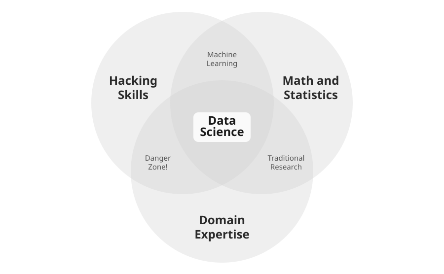
::::

:::: {.column width="26%"}
::: {.dense-smaller style="text-align:center; margin-top:1.4em;"}
…to find patterns and explain relationships using data from different [**domains**]{style="color:#c0392b;"}.
:::
::::

:::::

::: {.caption}
Source: Drew Conway, The Data Science Venn Diagram (2010)
:::

---

## What is Data Science? (A Venn Diagram) {.image-frame-slide}

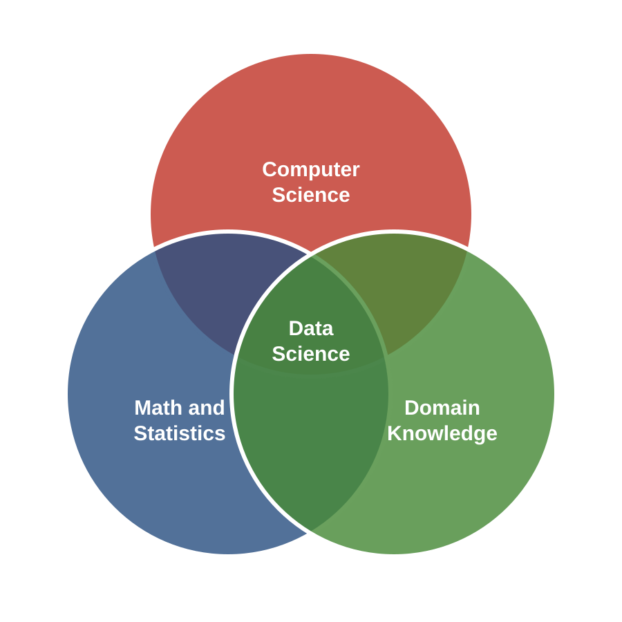

::: {.caption}
Source: Drew Conway, [The Data Science Venn Diagram](http://drewconway.com/zia/2013/3/26/the-data-science-venn-diagram) (2010)
:::

---

## The Data Science Venn Diagram {.image-frame-slide}

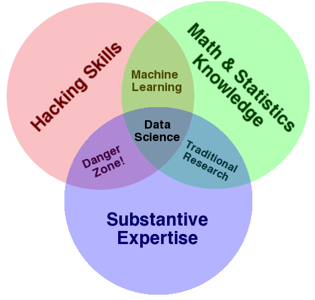

::: {.caption}
Drew Conway, [*The Data Science Venn Diagram*](http://drewconway.com/zia/2013/3/26/the-data-science-venn-diagram) (2010), [CC BY-NC 3.0](https://creativecommons.org/licenses/by-nc/3.0/).
:::

---

## A Data Science Elephant? {.image-frame-slide}

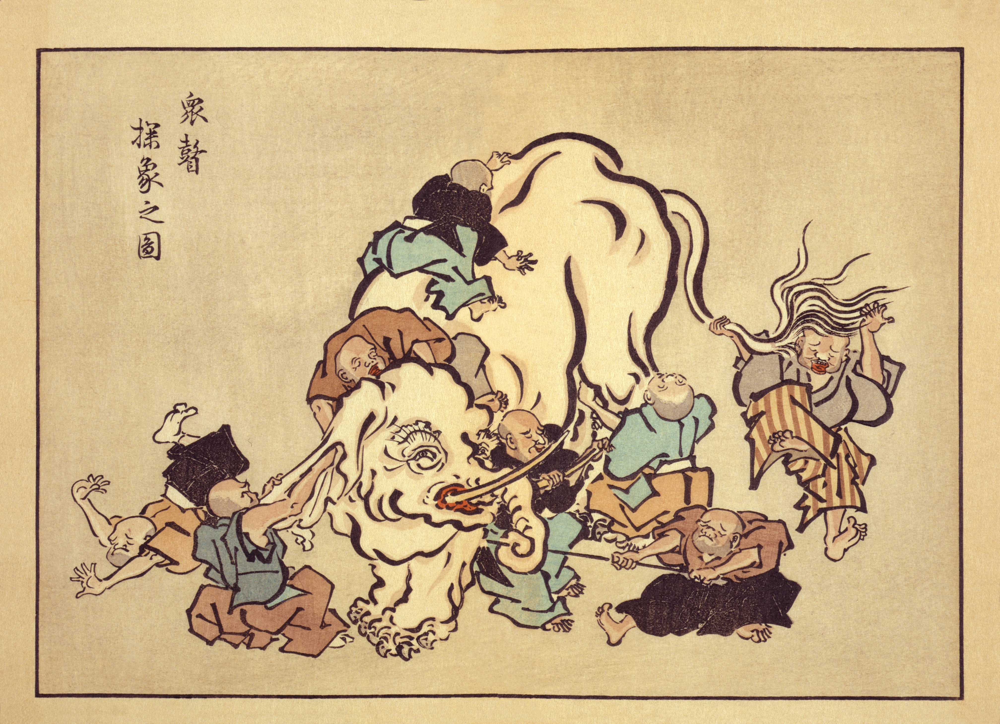

::: {.caption}
Hanabusa Itchō, *Blind Monks Examining an Elephant* (1888 woodblock print reproduction), public domain. [Wikimedia Commons](https://commons.wikimedia.org/wiki/File:Blind_monks_examining_an_elephant.jpg).
:::

---

## My Take: The Data Science Elephantidae

::::: {.columns}

:::: {.column width="48%"}
::: {.incremental}
- Data scientists often define the field by the part they touched
- **Elephantidae**: biological family including elephants, mammoths, mastodons
- Data science as a "family" of related methods, topics, etc.
:::
::::

:::: {.column width="48%"}
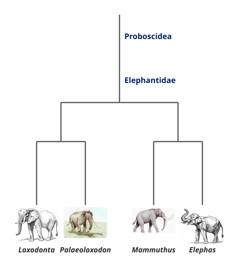

::: {.caption}
Based on [Wikipedia, "Elephant"](https://en.wikipedia.org/wiki/Elephant#Taxonomy).
:::
::::

:::::

---

## My Take: A Bigger Ecosystem

::::: {.columns}

:::: {.column width="48%"}
::: {.incremental}
- The family runs deeper than a single member
- Data scientists do not have a monopoly on knowledge 
- Data scientists are in a much larger ecosystem!
:::
::::

:::: {.column width="48%"}

::: {.caption}
Based on [Wikipedia, "Elephant"](https://en.wikipedia.org/wiki/Elephant#Taxonomy).
:::
::::

:::::

---

## Why Data Science?

:::: {style="max-width:88%; margin:0 auto; height:100%; display:flex; flex-direction:column; justify-content:flex-start; padding-top:2%;"}

::: {style="background:#001E62; border-radius:20px; padding:1.2em 0.9em; text-align:center;"}
[~400 million]{style="display:block; font-size:3em; font-weight:800; color:#f9461c; line-height:1.05;"}
[terabytes of data created — every single day]{style="font-size:1.1em; color:#ffffff;"}
:::

::: {.caption}
Source: [Exploding Topics](https://explodingtopics.com/blog/data-generated-per-day)
:::

::: {.dense-smaller style="text-align:center; margin-top:0.6em;"}
**Data science can help turn the flood of data into information and knowledge**
:::

::::

---

## Visualizing a Terabyte?

::: {style="border:3px dashed #f9461c; border-radius:12px; padding:0.8em 1em; margin-top:0.4em;"}
[TODO]{.eyebrow .todo}

::: {.dense}
- **TK**
:::
:::

<!-- TODO: add 1 TB visual before the 400M TB/day slide -->

---

## What is Data Science? (A Hub of Fields) {.image-frame-slide}

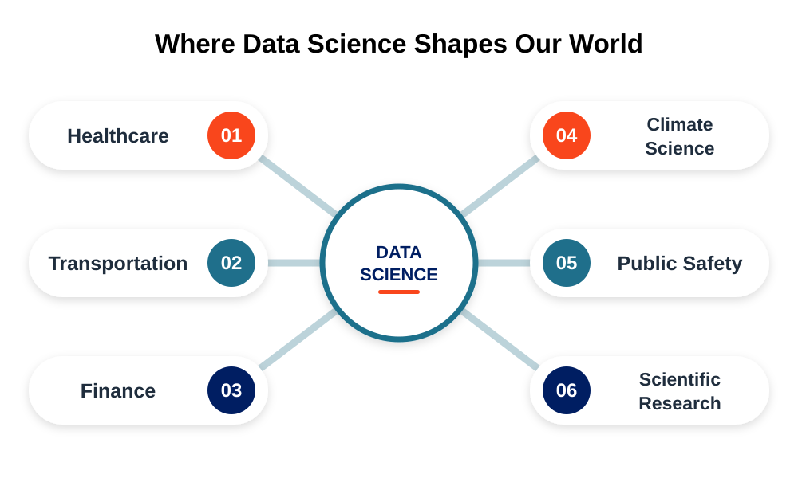

---

## What is Data Science? (Yet Another Metaphor)

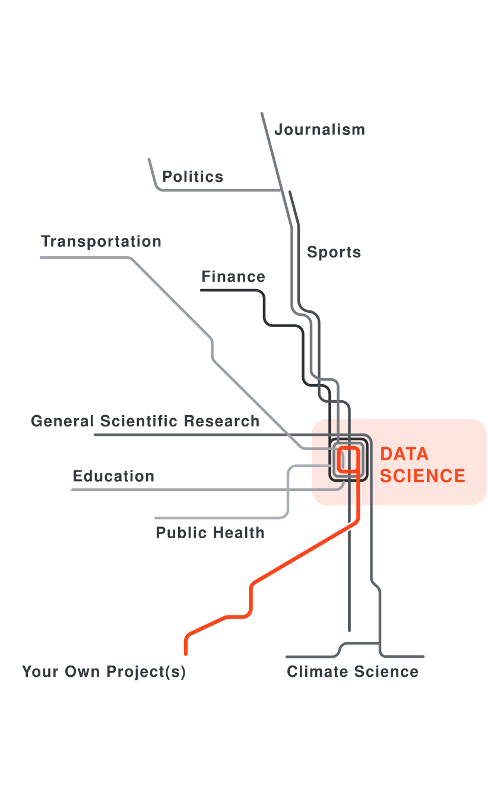

::: {.notes}
- Many fields "share the same track" (i.e. methods, tools, etc.)
- Data science makes up much of that shared track
- Data science can also go in a different direction
:::

---

## So what Do Data Scientists Do?

::: {.incremental}
1. **Ask good questions** — turn a vague goal into something measurable
2. **Obtain & clean the data** — collect, merge, and fix messy real-world data
3. **Explore & visualize** — search and discover patterns, outliers, and surprises
4. **Model & predict** — build something that explains and/or forecasts
5. **Communicate** — turn results into stories, decisions
:::

# Asking Good Questions {.section-header}

## Pasteur's Quadrant: Blank Grid {.image-frame-slide}

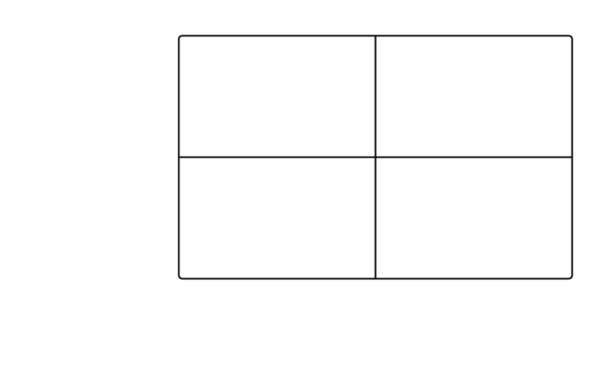

::: {.caption}
Donald E. Stokes, *Pasteur's Quadrant: Basic Science and Technological Innovation* (Brookings, 1997).
:::

---

## Pasteur's Quadrant: Considerations of Use? {.image-frame-slide}

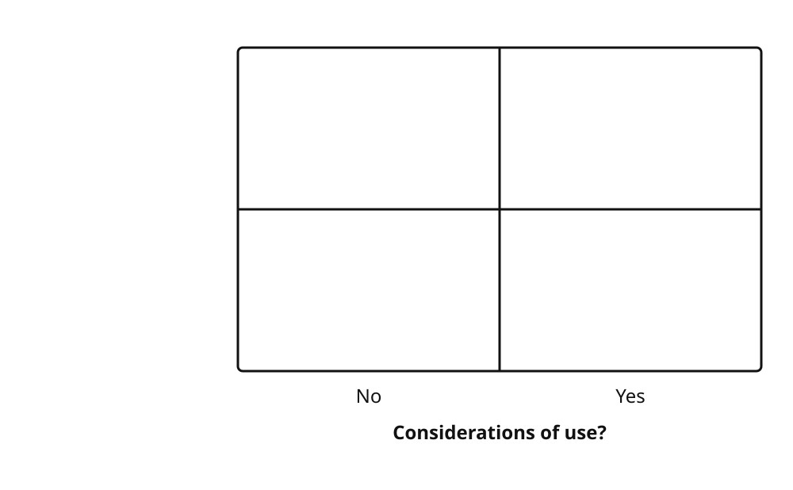

::: {.caption}
Donald E. Stokes, *Pasteur's Quadrant: Basic Science and Technological Innovation* (Brookings, 1997).
:::

---

## Pasteur's Quadrant: Fundamental Understanding? {.image-frame-slide}

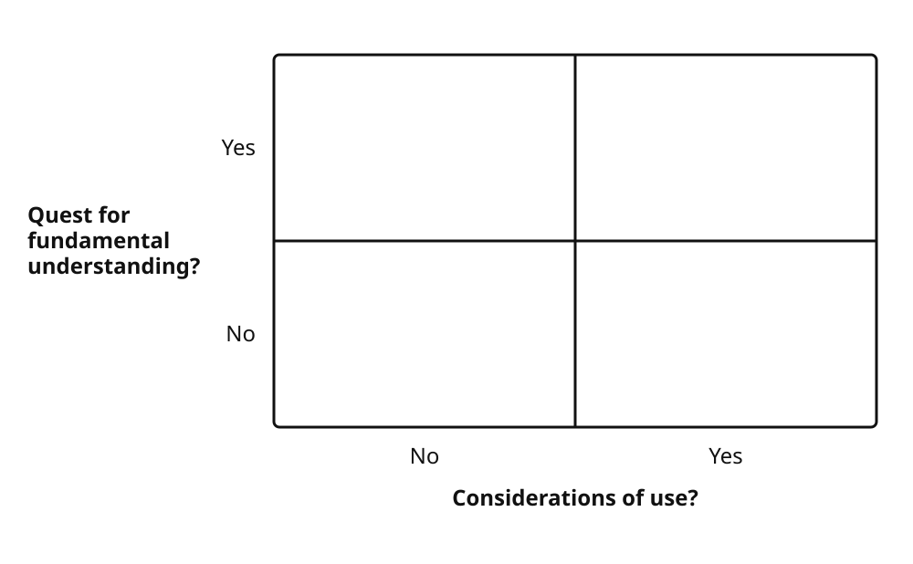

::: {.caption}
Donald E. Stokes, *Pasteur's Quadrant: Basic Science and Technological Innovation* (Brookings, 1997).
:::

---

## Pasteur's Quadrant: Bohr {.image-frame-slide}

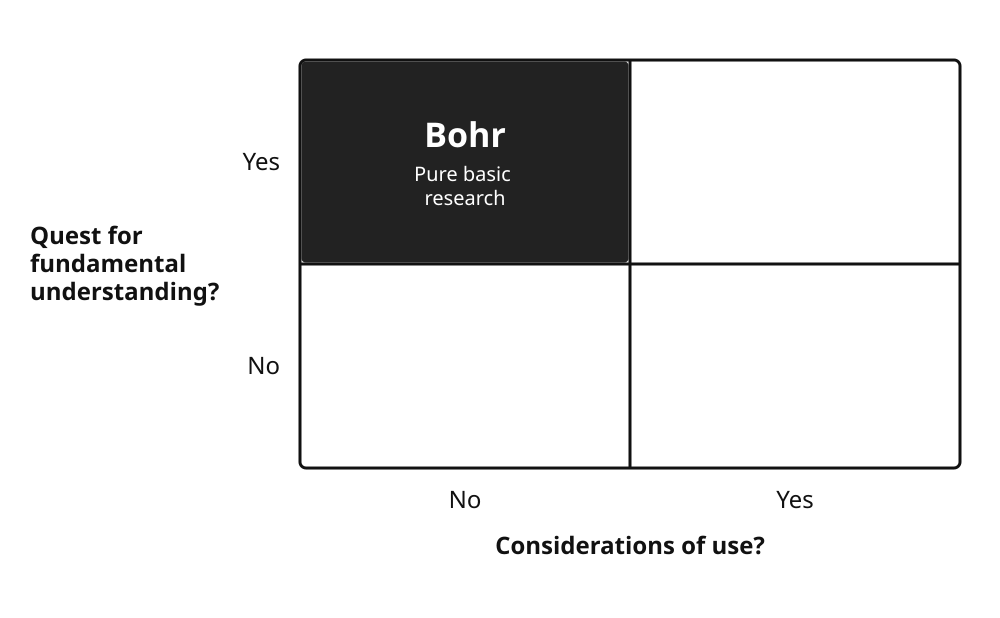

::: {.caption}
Donald E. Stokes, *Pasteur's Quadrant: Basic Science and Technological Innovation* (Brookings, 1997).
:::

---

## Pasteur's Quadrant: Edison {.image-frame-slide}

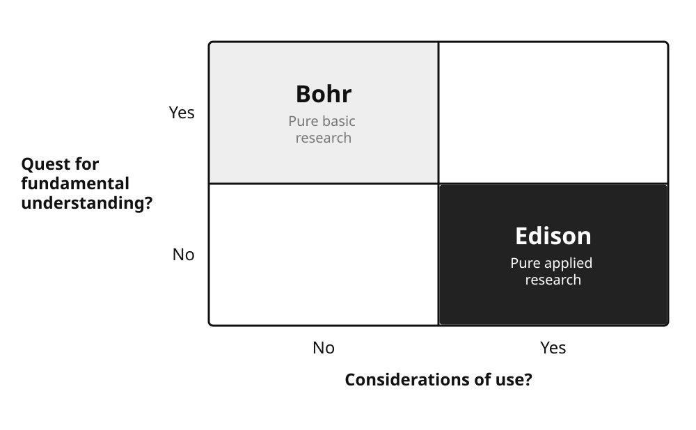

::: {.caption}
Donald E. Stokes, *Pasteur's Quadrant: Basic Science and Technological Innovation* (Brookings, 1997).
:::

---

## Pasteur's Quadrant: Pasteur {.image-frame-slide auto-animate=true}

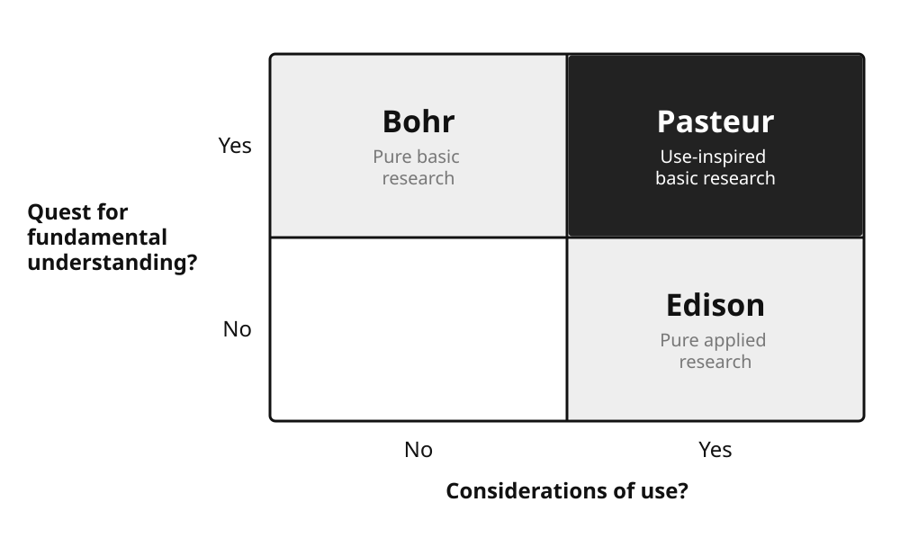

::: {.caption}
Donald E. Stokes, *Pasteur's Quadrant: Basic Science and Technological Innovation* (Brookings, 1997).
:::

---

## Full table from Donald E. Stokes {.image-frame-slide auto-animate=true}

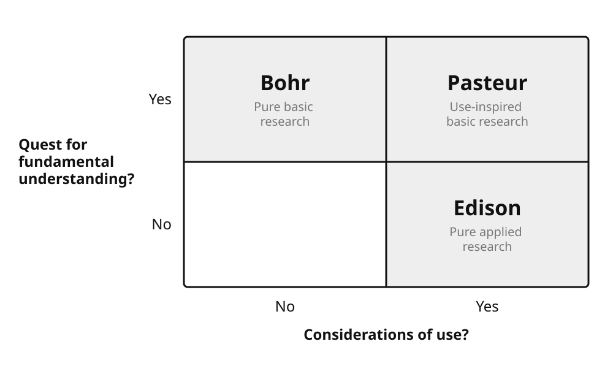

::: {.caption}
Donald E. Stokes, *Pasteur's Quadrant: Basic Science and Technological Innovation* (Brookings, 1997).
:::

---

## Bohr's Quadrant: Curiosity {auto-animate=true}

::::: {.columns}

:::: {.column width="46%"}
::: {.incremental}
- What is the molecular structure of caffeine?
- ...
- Examples TK
:::

::::

:::: {.column width="50%"}

::: {.caption}
Donald E. Stokes, *Pasteur's Quadrant: Basic Science and Technological Innovation* (Brookings, 1997).
:::
::::

:::::

---

## Edison's Quadrant: Use Only

::::: {.columns}

:::: {.column width="46%"}
::: {.incremental}
- Which cold brew recipe do guests rate highest?
- Which version of the headline gets more clicks?
- What is the fastest route to CDRLC right now?
:::

::: {.incremental}
- **Less about "why."**
:::
::::

:::: {.column width="50%"}

::: {.caption}
Donald E. Stokes, *Pasteur's Quadrant: Basic Science and Technological Innovation* (Brookings, 1997).
:::
::::

:::::

---

## Pasteur's Quadrant: Understanding and Use

::::: {.columns}

:::: {.column width="46%"}
::: {.incremental}
- Do noise machines help people sleep? What is it about the noise that does it?
- How does the running plan influence people's performance?
- Which bus stops have the longest wait times?
:::

::: {.incremental}
- **Knowledge you can act on *and* learn from.**
:::
::::

:::: {.column width="50%"}

::: {.caption}
Donald E. Stokes, *Pasteur's Quadrant: Basic Science and Technological Innovation* (Brookings, 1997).
:::
::::

:::::

---

## More Example Questions

::: {.incremental}
- Do guests like the new cold brew recipe?
- Is the running plan helping people run faster?
- Do people sleep better with noise machines?
- Does surveillance improve safety?
- Did the advertising campaign make a difference?
- 
- **No real, curious human wants just "yes" or "no."**
- Data scientists can *explain* answers in detail.
- (See mini-book, [Chapter 1: Working Toward Wisdom](../ethics-in-data-science/book/01-working-toward-wisdom.html)).
:::

# Data Science Lifecycle {.section-header}

## The Data Science Lifecycle: Building Blocks {.image-frame-slide}

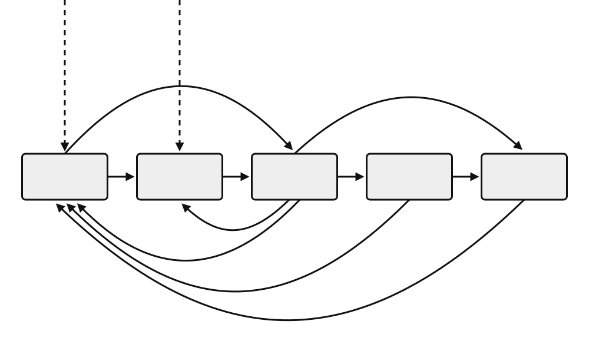

---

## The Data Science Lifecycle: Ask a Question {.image-frame-slide}

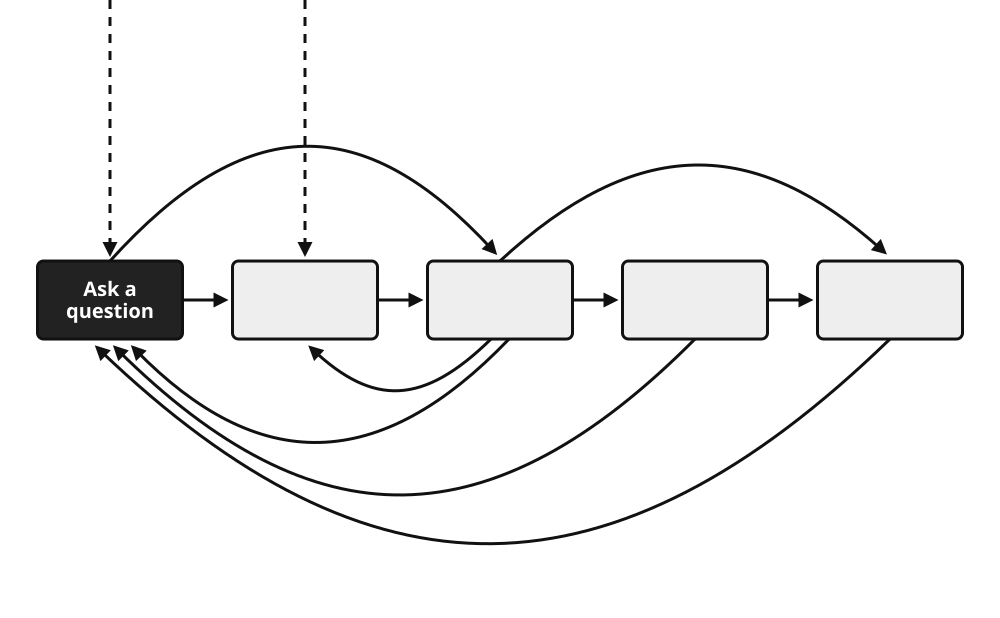

---

## The Data Science Lifecycle: Obtain Data {.image-frame-slide}

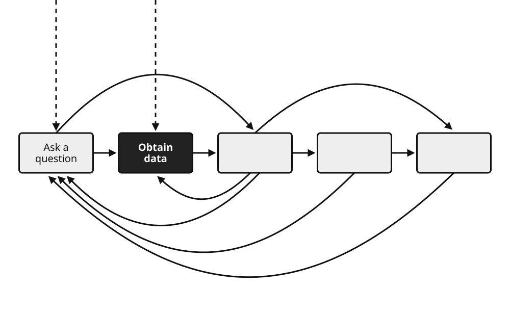

---

## The Data Science Lifecycle: Understand the Data {.image-frame-slide}

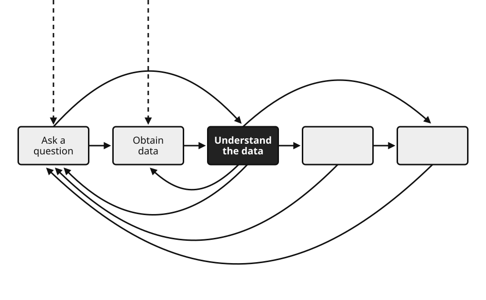

---

## The Data Science Lifecycle: Understand the World {.image-frame-slide}

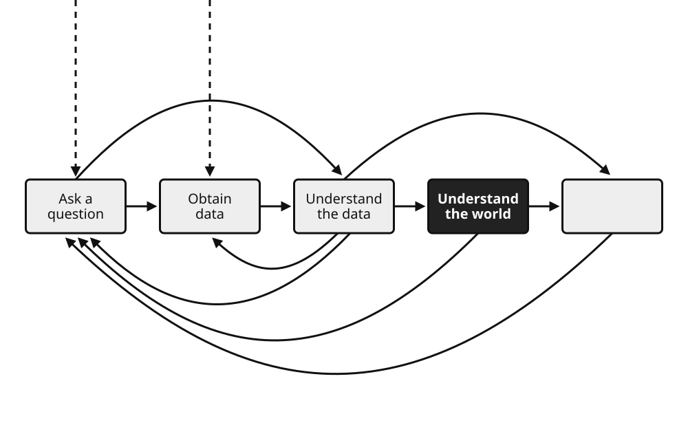

---

## The Data Science Lifecycle: Communicate {.image-frame-slide}

---

## Source for the Lifecycle {.image-frame-slide}

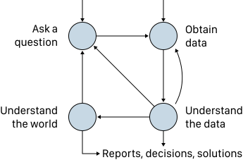

::: {.caption}
Sam Lau, Joey Gonzalez, and Deb Nolan, ["The Data Science Lifecycle"](https://learningds.org/ch/01/lifecycle_intro.html), in *[Learning Data Science](https://learningds.org/)*.
:::

---

## Related Cycles

::: {.dense}
- similar shapes, different vocabulary
- design thinking, science, etc.
- learning + making = some version of this loop
:::

---

## Another Data Science Cycle {.image-frame-slide}

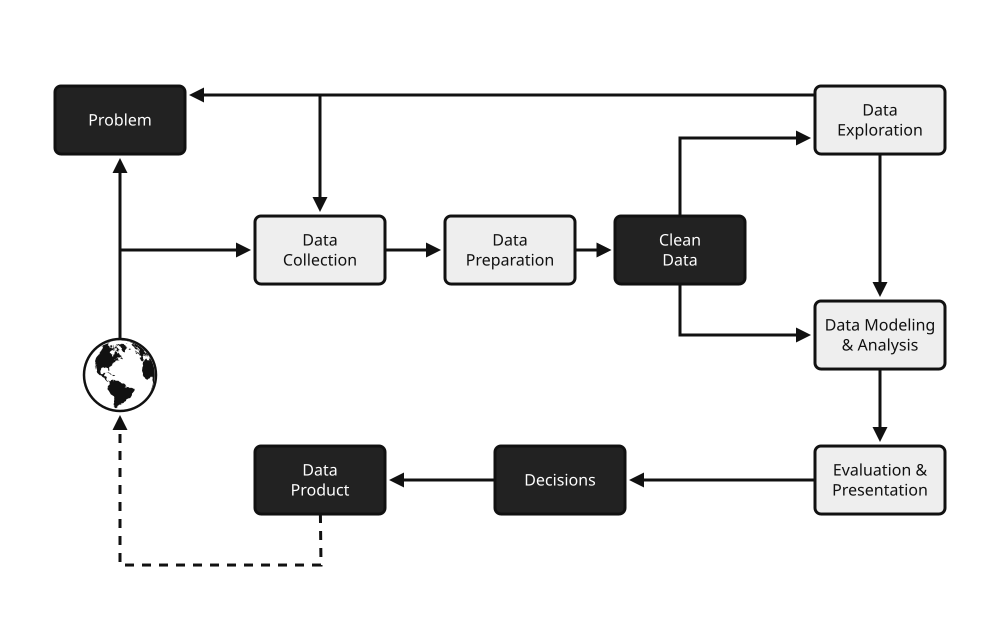

::: {.caption}
Adapted from Cathy O'Neil and Rachel Schutt, *[Doing Data Science](https://www.oreilly.com/library/view/doing-data-science/9781449363871/)* (O'Reilly, 2013), and from Gonzalo Bello Lander.
:::

---

## Another Cycle: McElreath's Bayesian Workflow {.image-frame-slide}

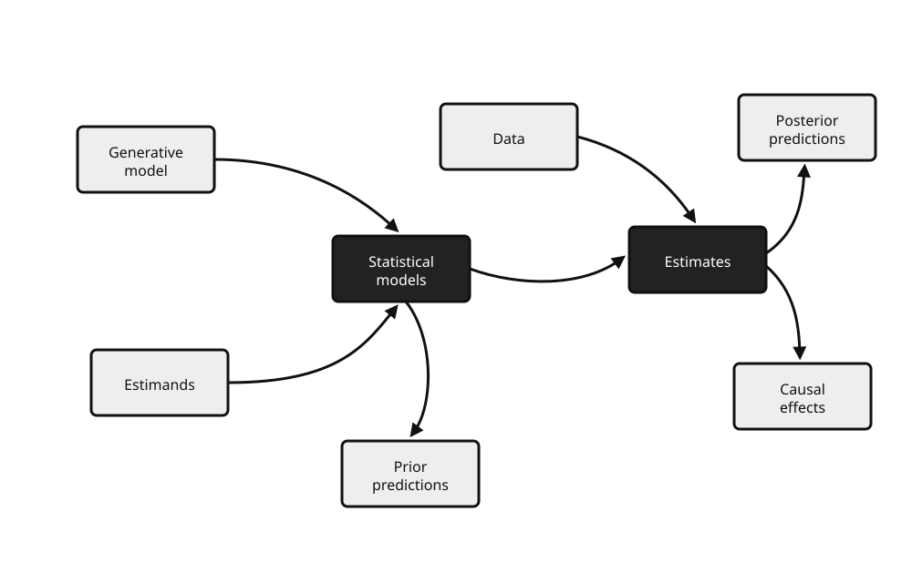

::: {.caption}
After Richard McElreath, *[Statistical Rethinking](https://xcelab.net/rm/statistical-rethinking/)* and the [Statistical Rethinking lecture series](https://github.com/rmcelreath/stat_rethinking_2026).
:::

---

## Another Cycle: Science {.image-frame-slide}

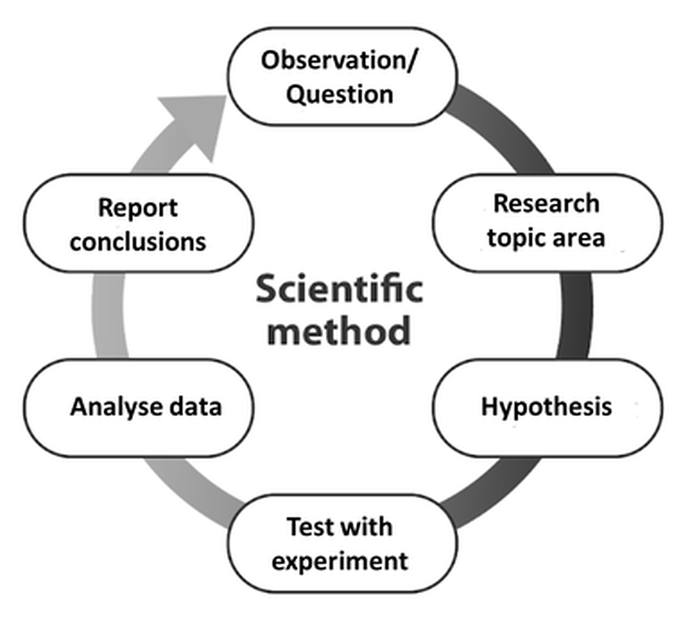

::: {.caption}
From Simon Goorney, Jonas Bley, Stefan Heusler, and Jacob Sherson, ["A Framework for Curriculum Transformation in Quantum Information Science and Technology Education"](https://doi.org/10.1088/1361-6404/ad7e60), *European Journal of Physics* 45(6), 2024.
:::

---

## Another Cycle: Inquiry Learning {.image-frame-slide}

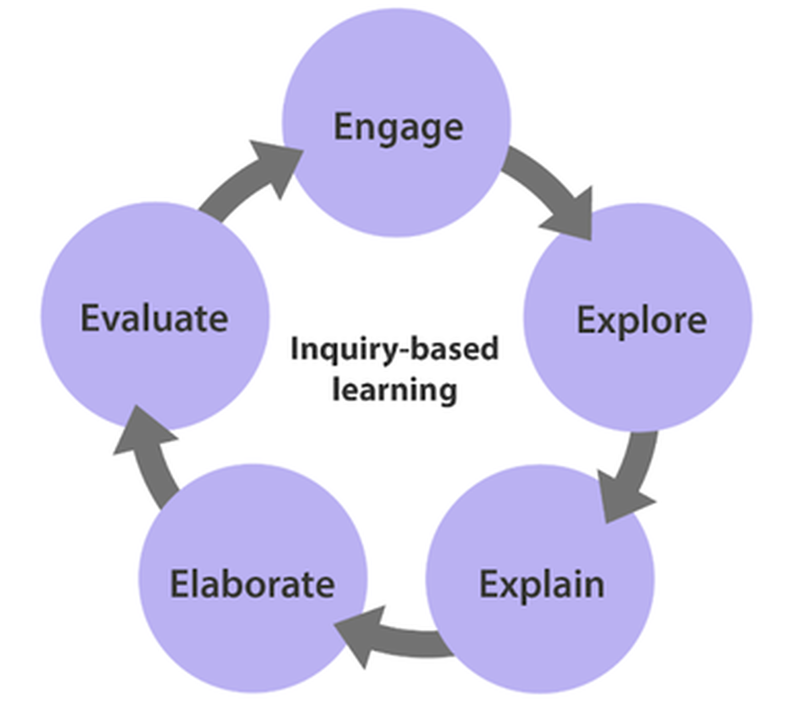

::: {.caption}
From Simon Goorney, Jonas Bley, Stefan Heusler, and Jacob Sherson, ["A Framework for Curriculum Transformation in Quantum Information Science and Technology Education"](https://doi.org/10.1088/1361-6404/ad7e60), *European Journal of Physics* 45(6), 2024.
:::

---

## Another Cycle: Design {.image-frame-slide}

::: {style="border:3px dashed #f9461c; border-radius:12px; padding:0.8em 1em; margin-top:0.4em;"}
[TODO]{.eyebrow .todo}

::: {.dense}
- **TK** — `../assets/lifecycle/design-thinking.webp`
:::
:::

<!--  -->

::: {.caption}
[TK — source]{style="color:#f9461c;"}
:::

---

## Your Turn: Other Work Cycles {.prompt-slide}

::: {.prompt-question}
Other work cycles have you seen or used?
:::

# The DIKW Pyramid {.section-header}

## Pyramids {.image-frame-slide}

<object type="image/svg+xml" data="../assets/pyramid/comparison-of-pyramids-smil.svg" aria-label="Profiles of well-known pyramid and near-pyramid structures — from the Great Pyramid of Giza and the Pyramid of Djoser to the Louvre Pyramid, the Transamerica Pyramid, and the Ryugyong Hotel — all drawn to a common scale with a height axis in metres." style="width:auto; height:452px; aspect-ratio:560/350; display:block; margin:0 auto; background:#fff; border:1px solid rgba(0, 0, 0, 0.12); box-shadow:0 10px 28px rgba(0, 0, 0, 0.12);"></object>

::: {.caption}
Cmglee, [*Comparison of pyramids SMIL*](https://commons.wikimedia.org/wiki/File:Comparison_of_pyramids_SMIL.svg), [CC BY-SA 3.0](https://creativecommons.org/licenses/by-sa/3.0/).
:::

---

## The DIKW Pyramid: Empty {.image-frame-slide}

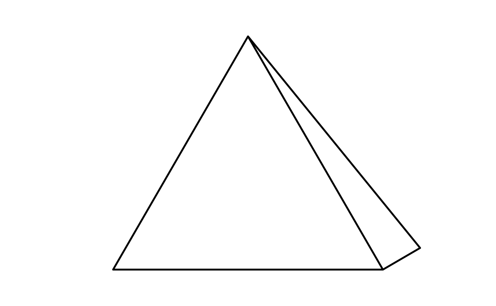

---

## The DIKW Pyramid: Four Layers {.image-frame-slide}

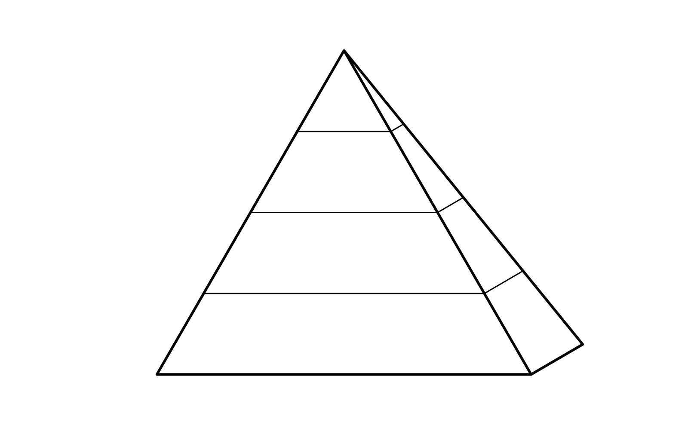

---

## The DIKW Pyramid: Data {.image-frame-slide}

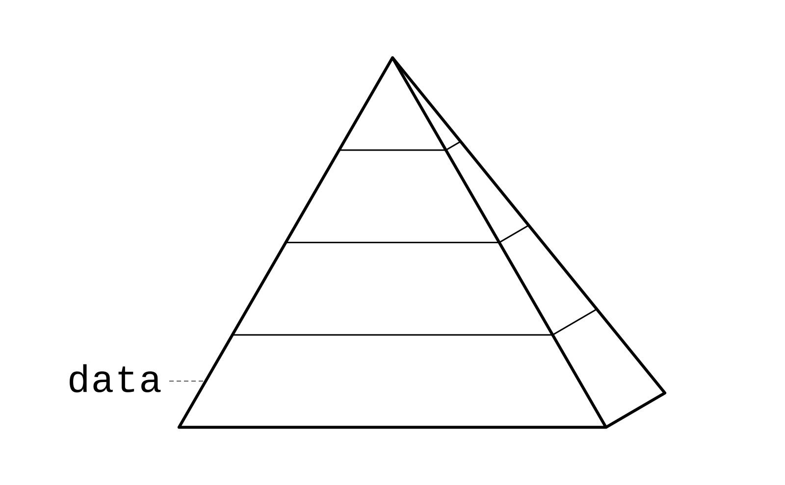

---

## The DIKW Pyramid: Information {.image-frame-slide}

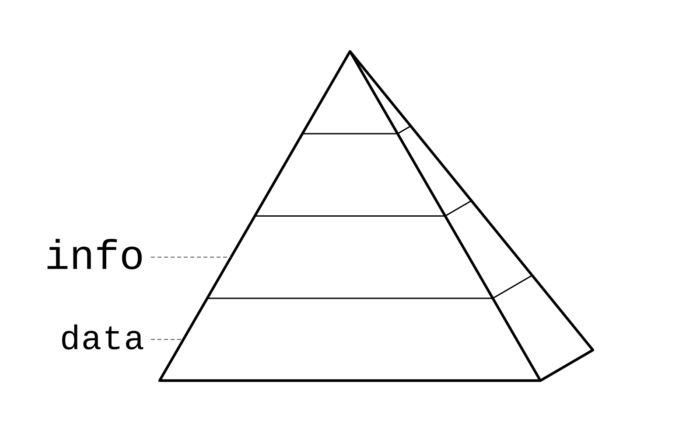

---

## The DIKW Pyramid: Knowledge {.image-frame-slide}

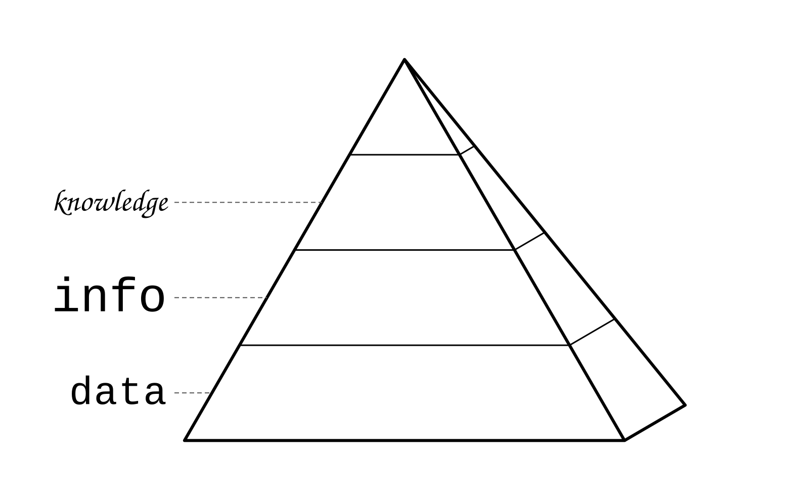

---

## The DIKW Pyramid: Wisdom {.image-frame-slide}

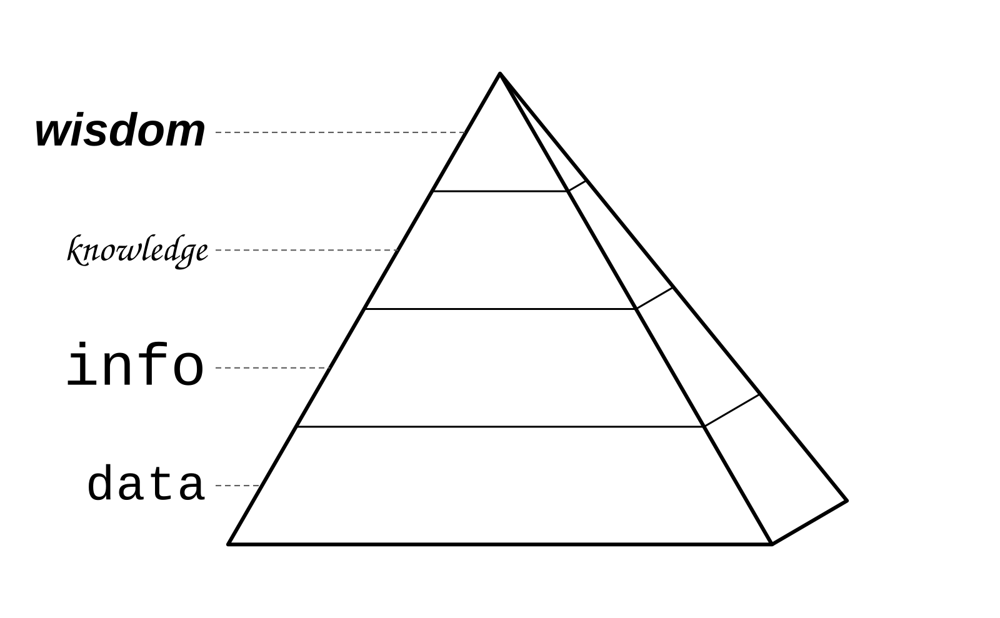

---

## Is the Pyramid Upside Down?

::::: {.columns}

:::: {.column width="52%"}
::: {.incremental}
- Tuomi (1999): "data emerges only after we have information...  information emerges only after we already have knowledge"
- You need knowledge to decide what is even worth measuring
:::
::::

:::: {.column width="44%"}
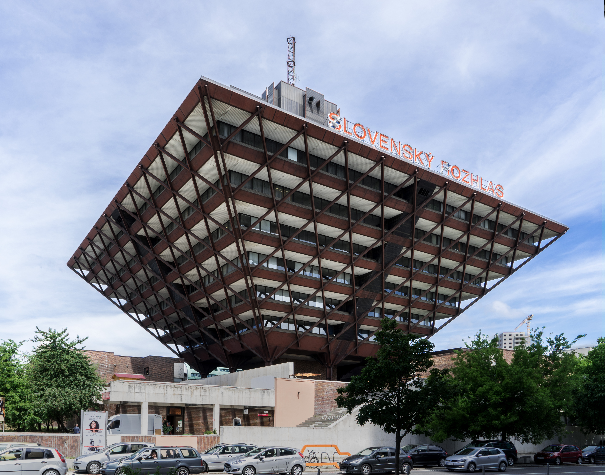

::: {.caption}
Slovak Radio Building, Bratislava. Thomas Ledl, [*Upside down Pyramid, Bratislava 02*](https://commons.wikimedia.org/wiki/File:Upside_down_Pyramid,_Bratislava_02.jpg), [CC BY-SA 4.0](https://creativecommons.org/licenses/by-sa/4.0/).
:::
::::

:::::

---

## So, Is the Pyramid Upside Down?

::::: {.columns}

:::: {.column width="52%"}
::: {.incremental}
- Does wisdom sit at the top of the pyramid?
- Or does wisdom hold up the whole thing?
- What else could be messing in this metaphor?
:::
::::

:::: {.column width="44%"}

::: {.caption}
Slovak Radio Building, Bratislava. Thomas Ledl, [*Upside down Pyramid, Bratislava 02*](https://commons.wikimedia.org/wiki/File:Upside_down_Pyramid,_Bratislava_02.jpg), [CC BY-SA 4.0](https://creativecommons.org/licenses/by-sa/4.0/).
:::
::::

:::::

---

## Martin Frické {.quote-slide}

> [A data-first pyramid] encourages the mindless and meaningless collection of data in the hope that one day it will ascend to information.

::: {.attribution}
Martin Frické
:::

::: {.quote-source}
["The Knowledge Pyramid: A Critique of the DIKW Hierarchy"](https://doi.org/10.1177/0165551508094050), *Journal of Information Science* 35(2), 2009, pp. 131–142.
:::

---

## What else is Missing? {data-auto-animate=""}

---

## What else is Missing? {data-auto-animate=""}

::::: {.columns}

:::: {.column width="52%"}
::: {.incremental}
- **Understanding** — no layer in the pyramid 
- The pyramid does not build itself
- Knowledge as a "network of relations through which humans coordinate their actions" (Zeleny, 1987)
:::
::::

:::: {.column width="44%"}

::::

:::::

---

## Ursula K. Le Guin {.quote-slide}

> What good are all the objects in the universe, if there is no subject?

::: {.attribution}
Ursula K. Le Guin
:::

::: {.quote-source}
"Science Fiction and Mrs. Brown" (1975), in *[The Language of the Night](https://openlibrary.org/books/OL4100441M/The_language_of_the_night)* (1979).
:::

---

## Questions about the DIKW Pyramid? {.image-frame-slide}

# The Treachery of Images {.section-header}

## {.photo-only data-state="photo-only" background-image="../assets/art/belgium_2026_wide.webp" background-size="cover"}

---

## What is this? {.image-frame-slide}

---

## This is not a jersey {.image-frame-slide}

::: {.caption}
Belgium's 2026 World Cup away jersey, "Ceci n'est pas un maillot." Photo via [Hyperallergic](https://hyperallergic.com/belgiums-magritte-inspired-soccer-jersey-mirrors-a-surreal-world-cup/).
:::

---

## This is not a pipe {.image-frame-slide}

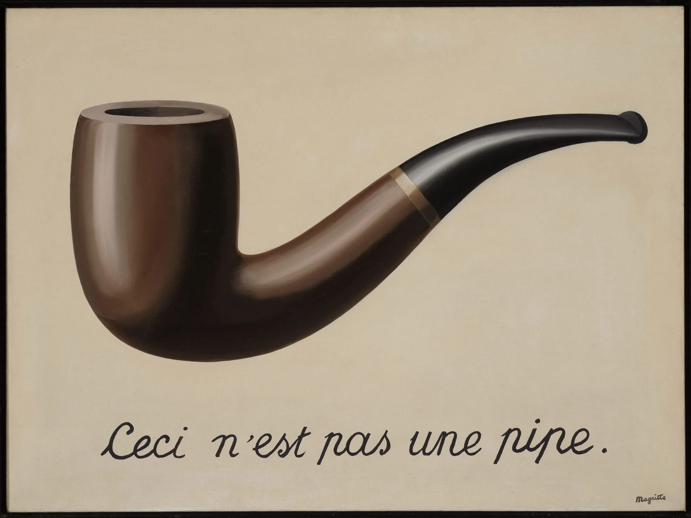

::: {.caption}
René Magritte, *The Treachery of Images* (1929). [LACMA Collections](https://collections.lacma.org/object/31931).
:::

---

## This is not a triangle {.image-frame-slide}

::: {.caption}
See [Chapter 1: Working Toward Wisdom](../ethics-in-data-science/book/01-working-toward-wisdom.html).
:::

---

## Zooming In (Powers of Ten) {.image-frame-slide}

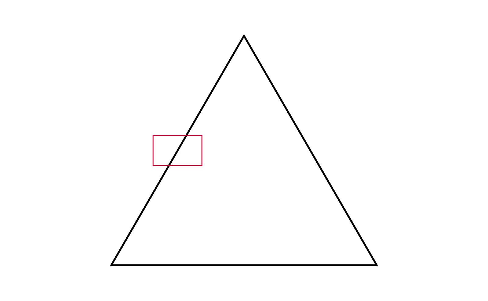

::: {.caption}
The red frame is 1/10th the size of the original canvas (160px vs. 1600px).
:::

---

## 10× Zoom {.image-frame-slide}

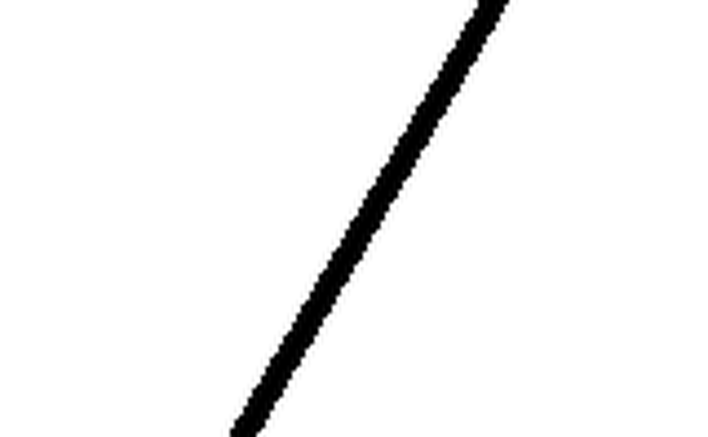

::: {.caption}
The "straight" line is jagged: the only way to draw a line with square pixels.
:::

---

## Another 10× Zoom {.image-frame-slide}

::: {.caption}
Again, the red frame marks where we zoom next.
:::

---

## 100× Zoom {.image-frame-slide}

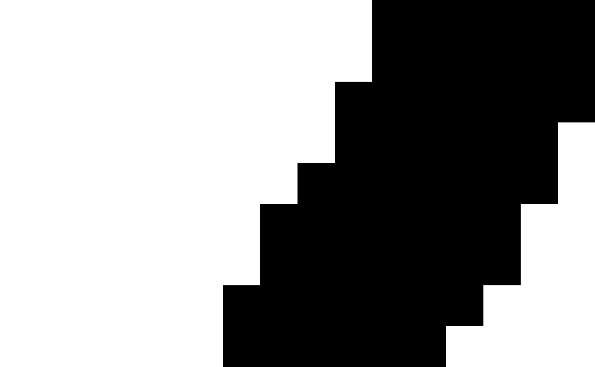

::: {.caption}
The pixels are there the whole time, but they are sometimes too small to see.
:::

---

## ...these are not pixels {.image-frame-slide}

::: {.caption}
Jacek Halicki, [*2023 Mikroskopowy obraz matrycy LCD*](https://commons.wikimedia.org/wiki/File:2023_Mikroskopowy_obraz_matrycy_LCD.jpg), [CC BY-SA 4.0](https://creativecommons.org/licenses/by-sa/4.0/).
:::

---

## Subpixels {.image-frame-slide}

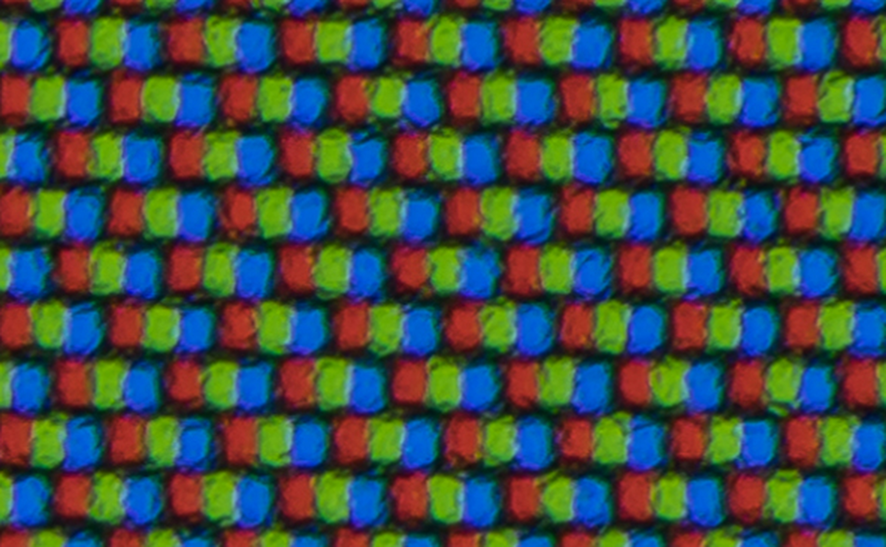

::: {.caption}
Jacek Halicki, [*2023 Mikroskopowy obraz matrycy LCD*](https://commons.wikimedia.org/wiki/File:2023_Mikroskopowy_obraz_matrycy_LCD.jpg), [CC BY-SA 4.0](https://creativecommons.org/licenses/by-sa/4.0/).
:::

---

## One Subpixel {.image-frame-slide}

::: {.caption}
One red subpixel, cropped from Jacek Halicki, [*2023 Mikroskopowy obraz matrycy LCD*](https://commons.wikimedia.org/wiki/File:2023_Mikroskopowy_obraz_matrycy_LCD.jpg), [CC BY-SA 4.0](https://creativecommons.org/licenses/by-sa/4.0/).
:::

---

## From Subpixel to Triangle {.image-frame-slide}

::: {style="position:relative; flex:0 0 auto; width:810px; height:487px; margin:0.2em auto 0;"}

:::

---

## Provenance {.image-frame-slide}

::: {.dense-smaller}
- Analogy: data scientists can explain *why* the figure was not a perfect triangle
- and are willing to say why it *is*, in some sense, a triangle
- understand how "subpixels of data" become "images of information"
- "All models are wrong" (Box)
	- All **data** are wrong too!
	- Or at least incomplete
:::

::: {.caption}
See [Chapter 1: Working Toward Wisdom](../ethics-in-data-science/book/01-working-toward-wisdom.html).
:::

---

## Another Complication {.image-frame-slide}

::: {.caption}
Different types of screens have different pixel / sub pixel shapes. Source: Peter Halasz (Pengo), [*Pixel geometry 02*](https://commons.wikimedia.org/wiki/File:Pixel_geometry_02_Pengo.jpg), [CC BY-SA 3.0](https://creativecommons.org/licenses/by-sa/3.0/).
:::

# Week 1, Day 2 {.course-title .photo-title data-state="photo-title photo-title-zoom" background-image="../assets/orange-line-stops-better/stop01-harold-washington-library-a.jpg" background-size="cover"}

<h2>Statistics Review</h2>

Jack Bandy and Elda Shatro
2026

# Statistics Review {.section-header}

## Map

Four things we'll cover:

::: {.incremental}
1. **The role of statistics in data science**
2. **Probability**
3. **Distributions**
4. **Sampling**
:::

---

## Statistics in Data Science

::: {.incremental}
- Statistics: the science of learning from data under uncertainty.
- It turns raw numbers into evidence we can actually trust.
- It tells us what a sample says about the whole population.
- It underpins every stage of the data science lifecycle.
:::

---

## Probability {.smaller}

- **Probability** is a measure of the **likelihood** of an event occurring.
- Probability is the language we use to quantify uncertainty in what the data tells us.

:::: {.columns}

::: {.column width="30%"}

$$P(E) = \frac{|E|}{|S|}$$

:::

::: {.column width="66%"}

<b style="color:#f9461c;">E</b> = the event 
<b style="color:#f9461c;">S</b> = sample space 
<b style="color:#f9461c;">|E|</b> = number of outcomes in event E 
<b style="color:#f9461c;">|S|</b> = total number of possible outcomes in S

:::

::::

- The probability of an event is always between <b>0 and 1</b>.

<i><b style="color:#f9461c;">Example:</b></i> A bag has 6 blue, 3 red, and 5 yellow marbles. 
What is the probability of drawing a blue or red marble on the first draw? 
 
<i><b>P(E) =</b></i>

---

## Key Terminology

::: {.dense}
- **Experiment** — a process or action with an uncertain result
- **Outcome** — a single possible result of an experiment
- **Event** — a set of one or more outcomes we care about
- **Sample space** — the set of all possible outcomes
- **Complementary events** — two events where one occurs if and only if the other does not
	- E.g. coin flip
:::
---

## Conditional Probability {.smaller}

- **Conditional probability** is the probability of an event **given that another event has already happened**.
- **P(A | B)** — "the probability of A given B."

:::: {.columns}

::: {.column width="30%"}

$$P(A \mid B) = \frac{P(A \cap B)}{P(B)}$$

:::

::: {.column width="62%"}

<b style="color:#f9461c;">P(A | B)</b>   =   probability of A given B 
<b style="color:#f9461c;">P(A ∩ B)</b> = probability of both A and B 
<b style="color:#f9461c;">P(B)</b> = probability of B (must be &gt; 0)

:::

::::

---

## Conditional Probability: An Example {.smaller}

**Example:** A deck contains 15 distinct cards labeled 1 through 15. Two cards are drawn at random without replacement.

:::: {.columns}

::: {.column width="48%"}
[SET UP]{.eyebrow}

::: {.fragment}
**A** = both cards odd &nbsp;&nbsp; **B** = sum is even
:::

::: {.fragment}
*Sum is even if both cards are odd, or both are even.*
:::

::: {.fragment}
**Odd numbers (8)** 
13579111315
:::

::: {.fragment}
**Even numbers (7)** 
2468101214
:::
:::

::: {.column width="52%"}
[SOLUTION]{.eyebrow}

::: {.fragment}
$$n(B) = \binom{8}{2} + \binom{7}{2} = 28 + 21 = 49$$
:::

::: {.fragment}
$$n(A \cap B) = \binom{8}{2} = 28$$
:::

::: {.fragment}
$$P(A \mid B) = \frac{n(A \cap B)}{n(B)} = \frac{28}{49} = \frac{4}{7}$$
:::

::: {.fragment}

ANSWER &nbsp;&nbsp; P(A | B) = 4/7

:::
:::

::::

---

## Bayes' Theorem

Conditional probabilities can be reversed using Bayes' theorem, which provides a systematic method for expressing one conditional probability in terms of another.

$$P(A \mid B) = \frac{P(B \mid A)\,P(A)}{P(B)}$$

$$P(B) = P(B \mid A)\,P(A) + P(B \mid A')\,P(A')$$

---

## A Coin, 14 Flips, and a Bet {.image-frame-slide}

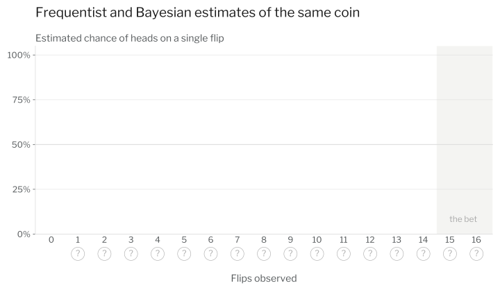

::: {.caption}
This example is based on the scenario from Panos Ipeirotis, ["Are You a Bayesian or a Frequentist?"](https://www.behind-the-enemy-lines.com/2008/01/are-you-bayesian-or-frequentist-or.html) (2008).
:::

---

## Before Any Flips {.image-frame-slide}

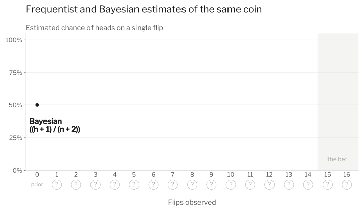

::: {.caption}
This example is based on the scenario from Panos Ipeirotis, ["Are You a Bayesian or a Frequentist?"](https://www.behind-the-enemy-lines.com/2008/01/are-you-bayesian-or-frequentist-or.html) (2008).
:::

---

## One Flip: Heads {.image-frame-slide}

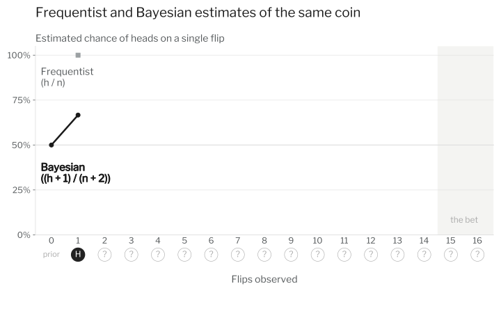

::: {.caption}
This example is based on the scenario from Panos Ipeirotis, ["Are You a Bayesian or a Frequentist?"](https://www.behind-the-enemy-lines.com/2008/01/are-you-bayesian-or-frequentist-or.html) (2008).
:::

---

## Two Flips: Heads, Heads {.image-frame-slide}

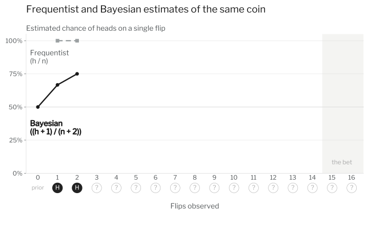

::: {.caption}
This example is based on the scenario from Panos Ipeirotis, ["Are You a Bayesian or a Frequentist?"](https://www.behind-the-enemy-lines.com/2008/01/are-you-bayesian-or-frequentist-or.html) (2008).
:::

---

## Three Flips: The First Tails {.image-frame-slide}

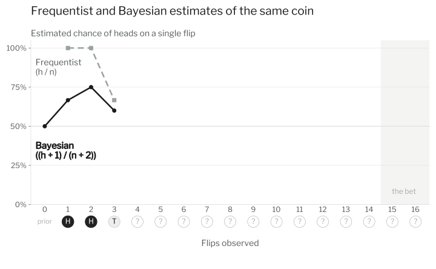

::: {.caption}
This example is based on the scenario from Panos Ipeirotis, ["Are You a Bayesian or a Frequentist?"](https://www.behind-the-enemy-lines.com/2008/01/are-you-bayesian-or-frequentist-or.html) (2008).
:::

---

## All 14 Flips: 10 Heads, 4 Tails {.image-frame-slide}

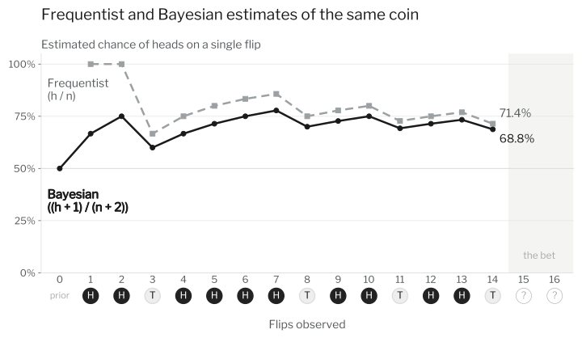

::: {.caption}
This example is based on the scenario from Panos Ipeirotis, ["Are You a Bayesian or a Frequentist?"](https://www.behind-the-enemy-lines.com/2008/01/are-you-bayesian-or-frequentist-or.html) (2008).
:::

---

## Coin Flip Odds

::::: {.columns}

:::: {.column width="56%"}
::: {.incremental}
- **14 flips, 10 heads.**
- Will the next two both be heads?
- [FREQUENTIST]{style="color:#001E62; font-weight:bold; letter-spacing:2px;"} — **51%**
- [BAYESIAN]{style="color:#f9461c; font-weight:bold; letter-spacing:2px;"} — **48.5%**
- **Same data, opposite sides of the bet?!**
:::
::::

:::: {.column width="40%"}

::: {.caption}
ICMA Photos, [*Coin Toss*](https://commons.wikimedia.org/wiki/File:Coin_Toss_(3635981474).jpg), [CC BY-SA 2.0](https://creativecommons.org/licenses/by-sa/2.0/).
:::
::::

:::::

::: {.caption}
Example from Panos Ipeirotis, ["Are You a Bayesian or a Frequentist?"](https://www.behind-the-enemy-lines.com/2008/01/are-you-bayesian-or-frequentist-or.html) (2008).
:::

---

## How Frequentists Get to 51% {.smaller}

::::: {.columns}

:::: {.column width="56%"}
::: {.fragment}
*p* is a **fixed, unknown constant** — estimate it from what we observed.
:::

::: {.fragment}
$$\hat{p} = \frac{h}{n} = \frac{10}{14} \approx 0.714$$
:::

::: {.fragment}
Given *p*, the two remaining flips are **independent** — so square the estimate.
:::

::: {.fragment}
$$P(\text{two heads}) = \hat{p}^{\,2} = \left(\frac{10}{14}\right)^{2} \approx 0.51$$
:::
::::

:::: {.column width="40%"}

::::

:::::

---

## How Bayesians Get to 48.5% {.smaller}

::::: {.columns}

:::: {.column width="56%"}
::: {.fragment}
*p* is a **distribution**. Start with a uniform prior, $\text{Beta}(1,1)$ — every value of *p* equally plausible.
:::

::: {.fragment}
10 heads and 4 tails update it to the posterior $\text{Beta}(11,5)$, whose mean is
$$E[p] = \frac{h + 1}{n + 2} = \frac{11}{16} = 0.6875$$
:::

::: {.fragment}
Bayesians don't just square it! The first flip is **evidence about *p*** that revises the belief used for the second.
:::

::: {.fragment}
Average $p^2$ across the whole posterior (plausible values):
$$P(\text{two heads}) = E[p^{2}] = \frac{11}{16}\cdot\frac{12}{17} \approx 0.485$$
:::
::::

:::: {.column width="40%"}

::::

:::::

---

## "Just Do the Math"

::: {.incremental}
- **Frequentist**: probability = long-run frequency; judge procedures by error rates
- **Bayesian**: probability = degree of belief, updated as evidence arrives
- Efron (1986) asked "Why Isn't Everyone a Bayesian?" — an active contest at the time
- McElreath (2020): the debate has largely been **subsumed by causal inference**
- Even so: you still have to choose a prior.
- One of many examples in data science where there is not always a single correct option
:::

# Sources {.sources}

1. GitHub source: <https://github.com/jackbandy/data-science-fun/blob/main/docs/slides/week1.md>.
2. Slides developed using materials from [Elena Zheleva](https://www.cs.uic.edu/~elena/), [Gonzalo Bello Lander](https://cs.uic.edu/profiles/gonzalo-bello/), the [Berkeley DS 100 team](https://ds100.org/), [Marine Carpuat](https://www.cs.umd.edu/~marine/), and [Brian Ziebart](https://cs.uic.edu/profiles/brian-ziebart).
3. [Elda Shatro](https://github.com/eldashatro4) contributed to these slides.
4. Slide deck built with [Quarto](https://quarto.org/) revealjs.
5. Title font is Big Shoulders; Body font is [Libre Franklin](https://en.wikipedia.org/wiki/Franklin_Gothic#Libre_Franklin).
6. Colleen McClain, Monica Anderson, Olivia Sidoti, and William Bishop, ["How Teens Use and View AI"](https://www.pewresearch.org/internet/2026/02/24/how-teens-use-and-view-ai/), Pew Research Center, February 24, 2026; the chart of teen AI chatbot uses is reproduced from that report.
7. Drew Conway, [*The Data Science Venn Diagram*](http://drewconway.com/zia/2013/3/26/the-data-science-venn-diagram) (2010), [CC BY-NC 3.0](https://creativecommons.org/licenses/by-nc/3.0/); the remixed Venn diagrams in this deck are derived from it.
8. The zoom sequence, DIKW discussion, and frequentist/Bayesian coin bet draw on [Chapter 1: Working Toward Wisdom](../ethics-in-data-science/book/01-working-toward-wisdom.html); the coin-bet example is from [Panos Ipeirotis (2008)](https://www.behind-the-enemy-lines.com/2008/01/are-you-bayesian-or-frequentist-or.html).
9. Sam Lau, Joey Gonzalez, and Deb Nolan, ["The Data Science Lifecycle"](https://learningds.org/ch/01/lifecycle_intro.html), in *[Learning Data Science](https://learningds.org/)*.
10. Cathy O'Neil and Rachel Schutt, *[Doing Data Science](https://www.oreilly.com/library/view/doing-data-science/9781449363871/)*, O'Reilly, 2013; the data science process diagram in this deck is remixed from Gonzalo Bello Lander's adaptation of it.
11. The Bayesian workflow diagram is remixed from Richard McElreath's *[Statistical Rethinking](https://xcelab.net/rm/statistical-rethinking/)* [lecture series](https://github.com/rmcelreath/stat_rethinking_2026).
12. Richard McElreath, *[Statistical Rethinking: A Bayesian Course with Examples in R and Stan](https://xcelab.net/rm/statistical-rethinking/)*, 2nd ed., Chapman and Hall/CRC, 2020.
13. Ilkka Tuomi, ["Data Is More than Knowledge: Implications of the Reversed Knowledge Hierarchy for Knowledge Management and Organizational Memory"](https://doi.org/10.1080/07421222.1999.11518258), *Journal of Management Information Systems* 16(3), 1999, pp. 103–117.
14. Slovak Radio Building photo by Thomas Ledl, [*Upside down Pyramid, Bratislava 02*](https://commons.wikimedia.org/wiki/File:Upside_down_Pyramid,_Bratislava_02.jpg), [CC BY-SA 4.0](https://creativecommons.org/licenses/by-sa/4.0/).
15. Martin Frické, ["The Knowledge Pyramid: A Critique of the DIKW Hierarchy"](https://doi.org/10.1177/0165551508094050), *Journal of Information Science* 35(2), 2009, pp. 131–142.
16. Belgium 2026 World Cup away jersey by adidas and the Royal Belgian Football Association, photo via [Hyperallergic](https://hyperallergic.com/belgiums-magritte-inspired-soccer-jersey-mirrors-a-surreal-world-cup/); used under fair use for educational commentary.
17. *The Treachery of Images* (1929) by René Magritte, courtesy of [LACMA Collections](https://collections.lacma.org/object/31931); public domain in the United States.
18. "Powers of ten" zoom framing after Charles and Ray Eames, *Powers of Ten* (1968/1977).
19. LCD subpixel micrographs by Jacek Halicki, [*2023 Mikroskopowy obraz matrycy LCD*](https://commons.wikimedia.org/wiki/File:2023_Mikroskopowy_obraz_matrycy_LCD.jpg), [CC BY-SA 4.0](https://creativecommons.org/licenses/by-sa/4.0/).
20. Pixel geometry comparison by Peter Halasz (Pengo), [*Pixel geometry 02*](https://commons.wikimedia.org/wiki/File:Pixel_geometry_02_Pengo.jpg), [CC BY-SA 3.0](https://creativecommons.org/licenses/by-sa/3.0/).
21. Coin toss photo by ICMA Photos, [*Coin Toss*](https://commons.wikimedia.org/wiki/File:Coin_Toss_(3635981474).jpg), [CC BY-SA 2.0](https://creativecommons.org/licenses/by-sa/2.0/).
22. Bradley Efron, ["Why Isn't Everyone a Bayesian?"](https://doi.org/10.1080/00031305.1986.10475342), *The American Statistician* 40(1), 1986, pp. 1–5.
