# Week 1, Day 1 {.course-title .photo-title data-state="photo-title" background-image="../assets/orange-line-stops-better/stop01-harold-washington-library-a.jpg" background-size="cover"}

<h2>Intro; Data Science Lifecycle</h2>

Jack Bandy
2026

---

## {.photo-only data-state="photo-only" background-image="../assets/orange-line-stops-better/stop01-harold-washington-library-a.jpg" background-size="cover"}

---

## Map {.split}

::: {.split-content .narrow-aside}

::: {.dense}
- Week 1: Harold Washington Library
- Day 1
    - Course Logistics
    - Defining Data Science
    - Data Science Lifecycle
    - Pasteur's Quadrant
    - The DIKW Pyramid
    - The Treachery of Images
    - Answers to your Quiz on Wednesday
:::

{.figure alt="Orange Line map with the Harold Washington Library stop marked, the Week 1 stop"}

:::

---

## Meet Your Elbow Neighbor(s)! {.split}

::: {.split-content .golden-columns}

::: {}

Turn to the people on either side of you:

1. Your name
2. Favorite meal/food you ate in the last week
3. Why you're at UIC
4. Why you're in this class
:::

<iframe src="https://dodatascience.fun/timer/" title="CTA-style countdown timer" loading="lazy" style="width: 100%; height: 420px; display: block; border: 1px solid #999; box-shadow: 0 10px 28px rgba(0,0,0,0.12); border-radius: 3px;"></iframe>

:::

# Course Logistics {.section-header}

## Syllabus Overview {.iframe-slide}

<iframe src="https://dodatascience.fun/syllabus/" title="CS 418 syllabus" loading="lazy" style="border: 1px solid #999; box-shadow: 0 10px 28px rgba(0,0,0,0.12); border-radius: 3px;"></iframe>

::: {.iframe-caption}
Full syllabus: <https://dodatascience.fun/syllabus/>
:::

---

## Zone of Proximal Development {.figure-aside .golden}

::: {.columns}
::: {.column}

::: {.caption}
Based on Vygotsky's zone of proximal development; remixed from a [CC0 diagram by Dcoetzee](https://commons.wikimedia.org/wiki/File:Zone_of_proximal_development.svg).
:::

::: {.fragment fragment-index=1}
- Not too easy
:::

::: {.fragment fragment-index=2}
- Not too difficult
:::

::: {.fragment fragment-index=3}
- Just right
:::

::: {.fragment fragment-index=4}
- Productive struggle — [this is the point!]{.key}
:::

:::
::: {.column}

:::
:::

---

## Privacy Note {.image-frame-slide}

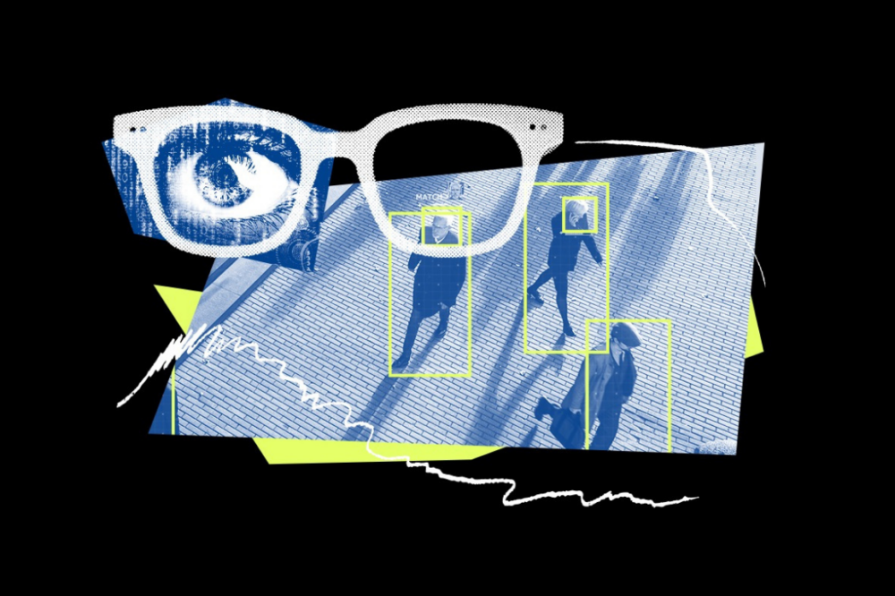

::: {.caption}
Image from the [ACLU](https://www.aclum.org/campaigns-initiatives/eyewear-not-spywear/).
:::

---

## Things are Rarely Perfect on the First Attempt {.image-frame-slide}

::: {.caption}
UIC's elevated walkways connected campus buildings at the second floor until they were removed in the 1990s. Photo courtesy University of Illinois Chicago, via [UIC Today](https://today.uic.edu/walk-through-uics-architectural-history/); likely by architectural photographer Orlando Cabanban.
:::

---

## Help improve the class! {.image-frame-slide}

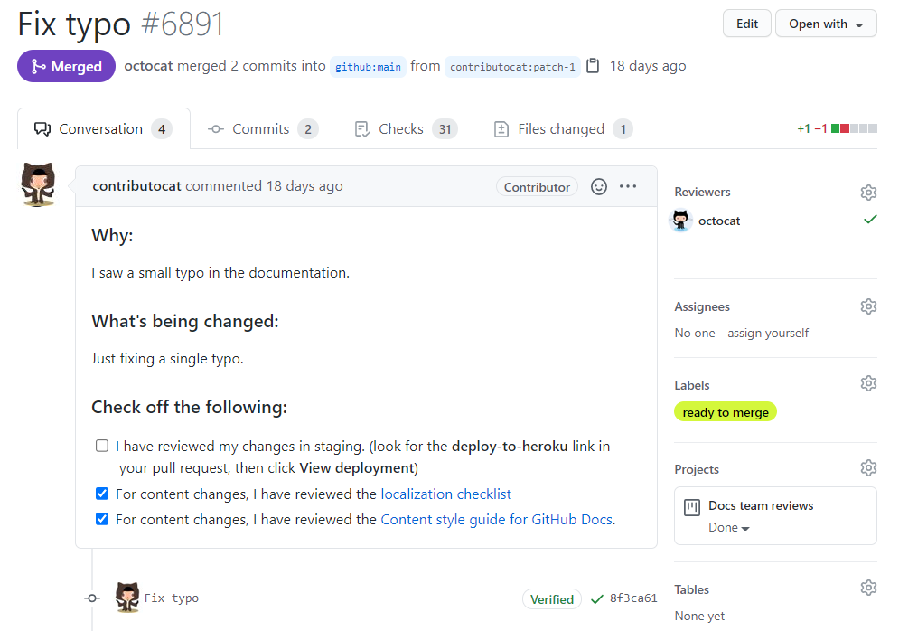

::: {.caption}
Open a pull request on the course repo to fix a typo, a broken link, a confusing sentence, etc. Image: [GitHub Docs](https://github.com/github/docs), [CC BY 4.0](https://creativecommons.org/licenses/by/4.0/).
:::

---

## Attendance Policy: An Audacious Experiment

::: {.columns .compare-columns}
::: {.column}
::: {.incremental}
::: {.dense}
- Random roll call!
- 10 names per class
- live random numbers via random.org
- called after agenda slide each day
- everyone gets the same grade for the day
:::
:::
:::

::: {.column}
::: {.incremental}
::: {.dense}
- helps me collect attendance data
- class should be worth attending
- if it's not, let's discuss why
- it's only 1% of your grade
:::
:::
:::
:::

---

## In-Class Tech {.figure-aside .golden}

::: {.caption}
Evidence reviewed in the [syllabus](../syllabus/): [Flanigan et al. (2023)](https://doi.org/10.1007/s10648-023-09780-y); [Sana, Weston, & Cepeda (2013)](https://doi.org/10.1016/j.compedu.2012.10.003).
:::

[TLDR: NO PHONES, NO LAPTOPS — TAKE NOTES ON PAPER]{.eyebrow}

::::: {.columns}

:::: {.column}
::: {.incremental}
::: {.dense-smaller}
- The purpose of our meeting time is to learn together
- So **by default, all class periods are free from cell phones, laptops, and tablets**
- I review the latest studies/evidence every year
- I looked at the evidence again in Summer 2026
- Sometimes we *will* use devices for an activity, usually at the end of class
- Using a phone/laptop has a **chain reaction** — it distracts the people around you too
- You will get a **worksheet** most sessions: guided notes, and a place to write down questions
- I know this is weird/unusual
- I will **revisit this policy** with you during the semester
:::
:::
::::

:::: {.column}

::::

:::::

---

## Benefits of Paper

::: {.caption}
Craik & Lockhart (1972); Mueller & Oppenheimer (2014); Morehead, Dunlosky, & Rawson (2019). In-class device evidence is in the [syllabus](../syllabus/).
:::

::: {.incremental}
::: {.dense-smaller}
- To keep a memory, you have to **encode** it
    - select, condense, connect it to what you already know
- Handwriting is too slow to transcribe
    - you are forced to decide **what matters**
    - deciding is learning!
    - deeper processing, more durable memory (Craik & Lockhart, 1972)
- Ask questions out loud - someone else might be wondering too
- A page has no notifications and no other tabs :-)
- One famous longhand study (Mueller & Oppenheimer, 2014) did not fully replicate (Morehead et al., 2019)
- But generally: distractions hurt learning
    - writing/processing/thinking helps
:::
:::

---

## Let's Talk About It {.image-frame-slide}

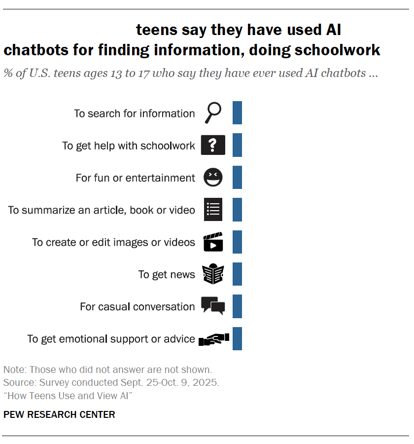

::: {.caption}
From Colleen McClain, Monica Anderson, Olivia Sidoti, and William Bishop, ["How Teens Use and View AI"](https://www.pewresearch.org/internet/2026/02/24/how-teens-use-and-view-ai/), Pew Research Center, February 24, 2026.
:::

---

## Let's Talk About It {.image-frame-slide}

::: {.caption}
From Colleen McClain, Monica Anderson, Olivia Sidoti, and William Bishop, ["How Teens Use and View AI"](https://www.pewresearch.org/internet/2026/02/24/how-teens-use-and-view-ai/), Pew Research Center, February 24, 2026.
:::

---

## Let's Talk About It, Continued {.image-frame-slide}

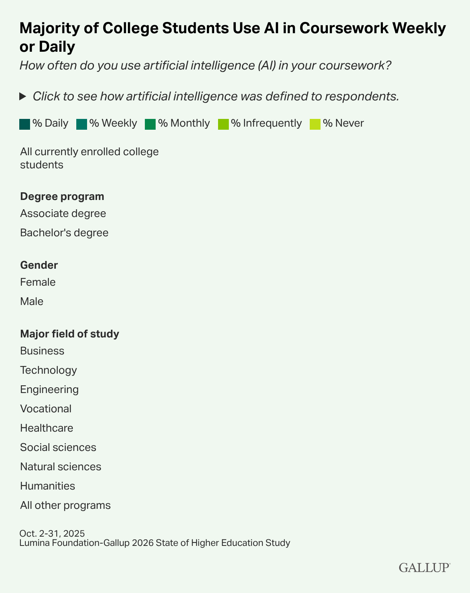

::: {.caption}
From Stephanie Marken, ["AI Is Routine for College Students, Despite Campus Limits"](https://news.gallup.com/poll/704090/routine-college-students-despite-campus-limits.aspx), Gallup, April 2, 2026. Lumina Foundation-Gallup 2026 State of Higher Education study; 1,433 U.S. students surveyed Oct. 2–31, 2025.
:::

---

## Let's Talk About It, Continued {.image-frame-slide}

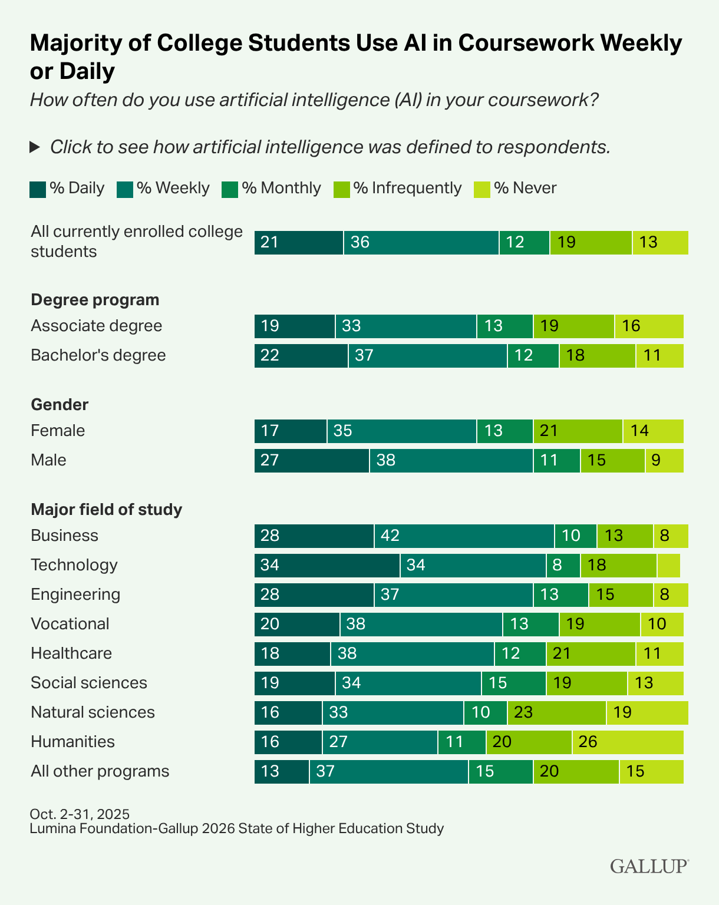

::: {.caption}
From Stephanie Marken, ["AI Is Routine for College Students, Despite Campus Limits"](https://news.gallup.com/poll/704090/routine-college-students-despite-campus-limits.aspx), Gallup, April 2, 2026. Lumina Foundation-Gallup 2026 State of Higher Education study; 1,433 U.S. students surveyed Oct. 2–31, 2025.
:::

---

## Homework Scores {.image-frame-slide}

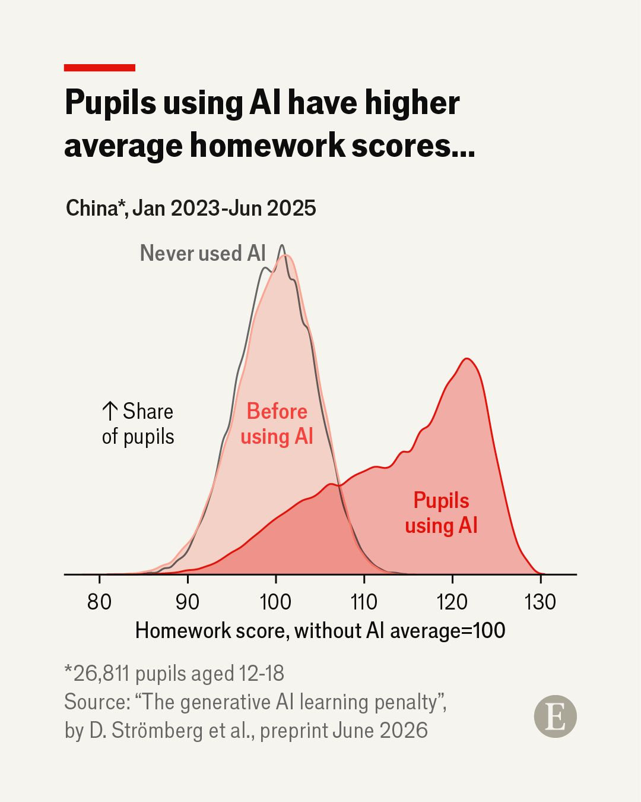

::: {.caption}
From ["Does AI stop children from learning?"](https://www.economist.com/graphic-detail/2026/08/18/does-ai-stop-children-from-learning), *The Economist*
:::

---

## Homework Time {.image-frame-slide}

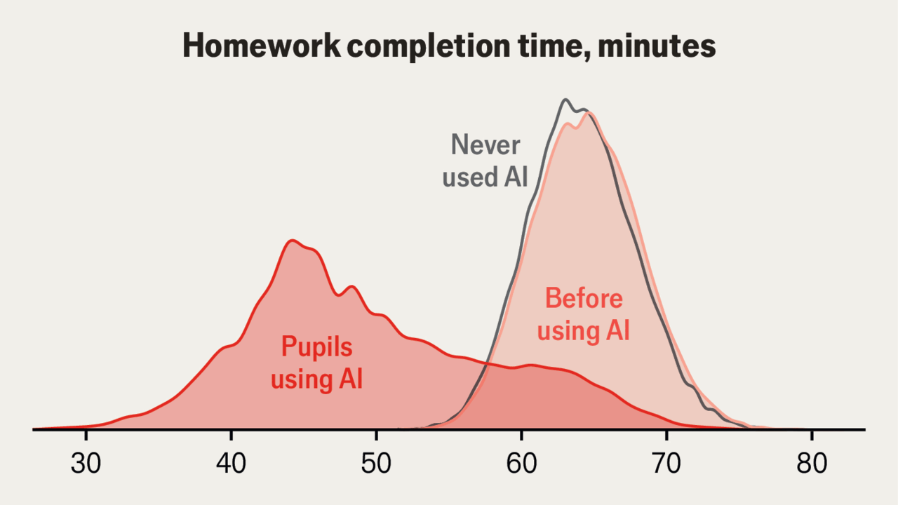

::: {.caption}
From ["Does AI stop children from learning?"](https://www.economist.com/graphic-detail/2026/08/18/does-ai-stop-children-from-learning), *The Economist*
:::

---

## Exams {.image-frame-slide}

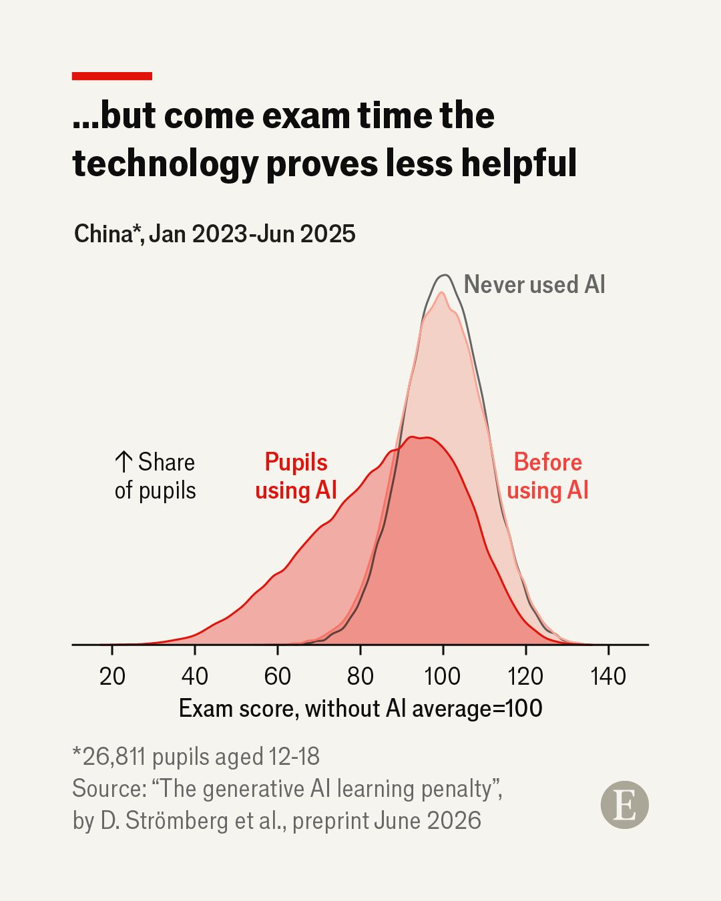

::: {.caption}
From ["Does AI stop children from learning?"](https://www.economist.com/graphic-detail/2026/08/18/does-ai-stop-children-from-learning), *The Economist*
:::

---

## AI/LLM Use: Three Phases

::::: {.columns .compare-columns}

:::: {.column .fragment}
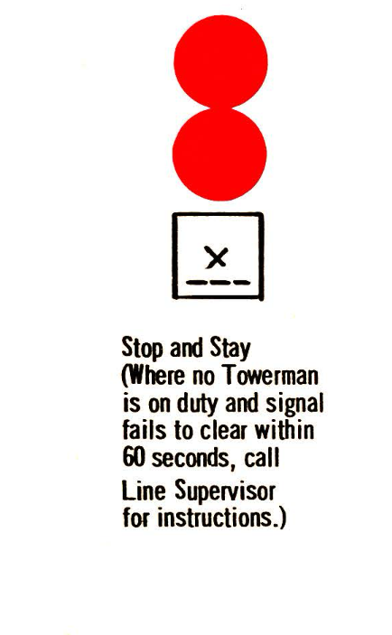

::: {.dense-smaller}
No AI/LLM use at all. Starting point/default.
:::
::::

:::: {.column .fragment}
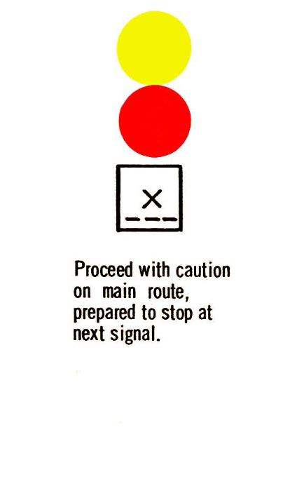

::: {.dense-smaller}
Allowed for a specific, carefully-scoped set of tasks (not required). 
:::
::::

:::: {.column .fragment}
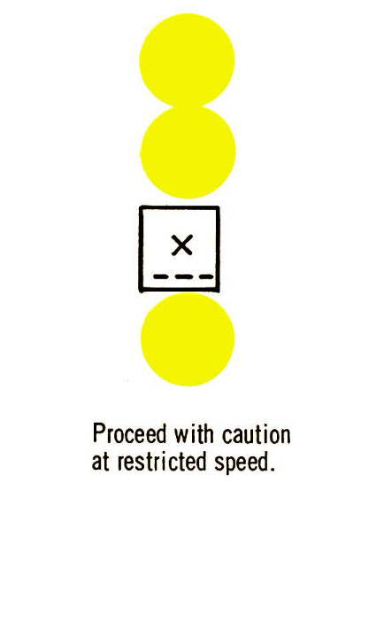

::: {.dense-smaller}
You choose where it fits. Still reduced speed, full attention. Be ready to justify/explain.
:::
::::

:::::

---

## Schedule Overview {.figure-aside .golden}

[Four units: wrangling, exploring, modeling, adventuring]{.eyebrow}

::::: {.columns}

:::: {.column}
::: {.dense-smaller}
- **Week 1** — intro; the lifecycle; asking questions
- **Weeks 2–3** — statistics review; Python, Polars, obtaining & wrangling data
- **Week 4** — exploratory analysis; descriptive statistics
- **Weeks 5–6** — visualization!!!!
- **Week 7** — hypothesis testing; estimation & sampling
- **Weeks 8–9** — regression; classification; trees; SVMs
- **Week 10** — clustering; PCA; model evaluation
- **Week 11** — recommendation systems; A/B testing, RCTs
- **Week 12** — network analysis;
- **Weeks 14–15** — presentations
:::

::: {.aside-note}
Full schedule is on the course [home](https://dodatascience.fun/#schedule).
:::
::::

:::: {.column}

::::

:::::

---

## Grading Breakdown

::: {.dense}
- In-Class Worksheets — **20%**
- In-Class Quizzes — **20%**
- Group Project — **20%**
- PrairieLearn Homeworks — **15%**
- Coding Exercises — **15%**
- Final Exam — **9%**
- Collective Attendance — **1%**
- **Total — 100%**
:::

::: {.aside-note}
Weights are in the [syllabus](../syllabus/).
:::

---

## Late Homeworks {.image-frame-slide}

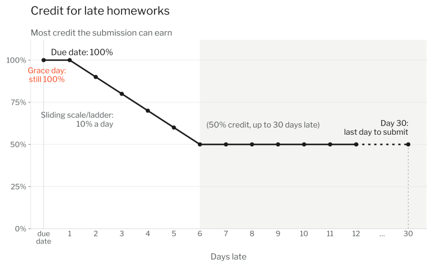

::: {.caption}
One grace day, then 10 points a day down to 50%. Nothing drops below 50%, and nothing is accepted after day 30 — see the [syllabus](../syllabus/).
:::

---

## Discuss with your elbow neighbor(s) {.split}

::: {.split-content .golden-columns}

::: {}

1. What are you expecting from this class?
2. What do you want to learn? Anything sound particularly exciting?
3. What skills do you hope to develop and/or strengthen?
:::

<iframe src="https://dodatascience.fun/timer/" title="CTA-style countdown timer" loading="lazy" style="width: 100%; height: 420px; display: block; border: 1px solid #999; box-shadow: 0 10px 28px rgba(0,0,0,0.12); border-radius: 3px;"></iframe>

:::

---

## What to Expect in this Class

::::: {.columns .compare-columns}

:::: {.column}
[TOOLING]{.eyebrow}

::: {.incremental}
::: {.dense-smaller}
- **Python**
- **Polars** for dataframes
- **seaborn**, **plotnine**
- Also!
- Sample of **R** and **Rstudio**
- **tidyverse** and **ggplot**
- Also!
- **git** + **GitHub**
:::
:::
::::

:::: {.column}
[TECHNIQUES]{.eyebrow}

::: {.incremental}
::: {.dense-smaller}
- Sampling / randomness
- Exploratory analysis
- **Chart/figure design**
- Confidence intervals
- Linear regression
- Classification methods
- (trees, SVMs, etc.)
- $k$-means clustering, PCA
- A/B testing, RCT setup
- Network/community analysis
:::
:::
::::

:::: {.column}
[THEMES]{.eyebrow}

::: {.incremental}
::: {.dense-smaller}
- The data science lifecycle
- Questions worth answering
- **Provenance**: tracing data through the lifecycle
- Reasoning under uncertainty
- What models can / can't do
- Ethics and implications
- Reproducible work
- Communicating results
:::
:::
::::

:::::

---

# Defining Data Science {.section-header}

## A Dictionary Definition

::: {.caption}
Definitions and etymology: Wiktionary, [*data*](https://en.wiktionary.org/wiki/data), [*datum*](https://en.wiktionary.org/wiki/datum) ([CC BY-SA 4.0](https://creativecommons.org/licenses/by-sa/4.0/))
:::

::: {.fragment .strike}
What is data?
:::

::: {.fragment}
What [are]{.key} data?
:::

::: {.fragment}
[data]{.term}: plural of [datum]{.term}, i.e. multiple datum, borrowed from Latin *data*, past participle of *dō*, "to give."
:::

::: {.fragment}
A [datum]{.term} is "a single recorded phenomenon, especially obtained by scientific work" literally *a thing that is given*.
:::

---

## What is Science?

::: {.caption}
Definitions and etymology: Wiktionary, [*science*](https://en.wiktionary.org/wiki/science) ([CC BY-SA 4.0](https://creativecommons.org/licenses/by-sa/4.0/))
:::

::: {.fragment}
[science]{.term} — from Latin *scientia*, "knowledge," from *scire*, "to know."
:::

::: {.fragment}
"The collective discipline of study or learning acquired through the [scientific method]{.key}"
:::

::: {.fragment}
"the sum of knowledge gained from such methods and discipline."
:::

::: {.fragment}
What does that make [data science]{.term}? Not "the science of data," moreso: [knowing, by way of things/data we are given]{.key}.
:::

::: {.fragment}
*Given* by whom? Chosen, measured, and recorded by a human being with situated knowledge (we'll come back to that).
:::

---

## What is Data Science?

[Data science]{.term} is an [interdisciplinary]{.key} field that studies and applies tools and techniques for [deriving useful insights from data]{.key}.

::::: {.columns}

:::: {.column width="26%"}
::: {.dense-smaller style="text-align:center; margin-top:1.4em;"}
It uses techniques from [computer science]{.term} and [statistics]{.term}…
:::
::::

:::: {.column width="48%"}

::::

:::: {.column width="26%"}
::: {.dense-smaller style="text-align:center; margin-top:1.4em;"}
…to find patterns and explain relationships using data from different [domains]{.term}.
:::
::::

:::::

::: {.caption}
Based on: Drew Conway, The Data Science Venn Diagram (2010)
:::

---

## What is Data Science? (A Venn Diagram) {.image-frame-slide}

::: {.caption}
Based on: Drew Conway, [The Data Science Venn Diagram](http://drewconway.com/zia/2013/3/26/the-data-science-venn-diagram) (2010)
:::

---

## The Data Science Venn Diagram {.image-frame-slide}

::: {.caption}
Drew Conway, [*The Data Science Venn Diagram*](http://drewconway.com/zia/2013/3/26/the-data-science-venn-diagram) (2010), [CC BY-NC 3.0](https://creativecommons.org/licenses/by-nc/3.0/).
:::

---

## A Data Science Elephant? {.image-frame-slide}

::: {.caption}
Hanabusa Itchō, *Blind Monks Examining an Elephant* (1888 woodblock print reproduction), public domain. [Wikimedia Commons](https://commons.wikimedia.org/wiki/File:Blind_monks_examining_an_elephant.jpg).
:::

---

## My Take: The Data Science Elephantidae {.figure-aside}

::::: {.columns}

:::: {.column}
::: {.incremental}
- Data scientists often define the field by the part they touched
- **Elephantidae**: biological family including elephants, mammoths, mastodons
- Data science as a "family" of related methods, topics, etc.
:::
::::

:::: {.column}

::: {.caption}
Based on [Wikipedia, "Elephant"](https://en.wikipedia.org/wiki/Elephant#Taxonomy).
:::
::::

:::::

---

## My Take: A Bigger Ecosystem {.figure-aside}

::::: {.columns}

:::: {.column}
::: {.incremental}
- The family runs deeper than a single member
- Data scientists do not have a monopoly on knowledge 
- Data scientists are in a much larger ecosystem!
:::
::::

:::: {.column}

::: {.caption}
Based on [Wikipedia, "Elephant"](https://en.wikipedia.org/wiki/Elephant#Taxonomy).
:::
::::

:::::

---

## Why Data Science?

::: {.caption}
Source: [Exploding Topics](https://explodingtopics.com/blog/data-generated-per-day)
:::

::: {.stat-callout}
[~400 million]{.stat-number}
[terabytes of data created — every single day]{.stat-label}
:::

::: {.dense-smaller style="text-align:center; margin-top:0.6em;"}
**Data science can help turn the flood of data into information and knowledge**
:::

---

## Visualizing a Terabyte?

::: {style="border:3px dashed #f9461c; border-radius:12px; padding:0.8em 1em; margin-top:0.4em;"}
[TODO]{.eyebrow .todo}

::: {.dense}
- I did not finish a visual for this, so...
- You tell me how you think of a terabyte
:::
:::

<!-- TODO: 1 TB visual -->

---

## A Terabyte in Phones {.figure-aside .golden}

::::: {.columns}

:::: {.column}
::: {.incremental}
::: {.dense}
- Fill up a 256 GB phone with photos — **4 full phones ≈ 1 TB**
- Every UIC student with a full phone: (**35,869** as of Fall 2025) ≈ **9,000 TB**
- Every Cook County resident with a full phone: (**5.2 million**) ≈ **1.3 million TB**
- Everyone in the US (**340 million**) ≈ **85 million TB**
    - Still less than the estimated 400 million terabytes created every day!
:::
:::
::::

:::: {.column}
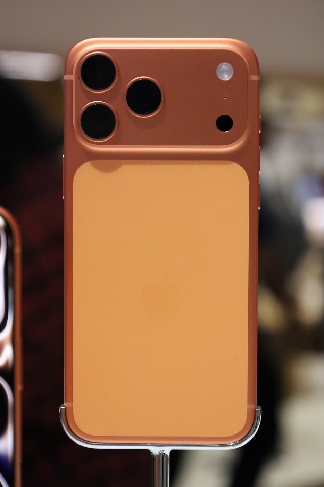

::: {.caption}
Ahmad Ali Karim, [*Cosmic Orange iPhone 17 Pro Max*](https://commons.wikimedia.org/wiki/File:Cosmic_Orange_iPhone_17_Pro_Max.jpg), [CC0](https://creativecommons.org/publicdomain/zero/1.0/). Populations: [Census Bureau 2024 estimates](https://www.census.gov/programs-surveys/popest.html); enrollment: [UIC Today](https://today.uic.edu/uic-enrollment-hits-all-time-best-mark/).
:::
::::

:::::

---

## A Terabyte in Streaming {.figure-aside .golden}

::::: {.columns}

:::: {.column}
::: {.incremental}
::: {.dense}
- **~30 hours of 4K video ≈ 1 TB**
- Stream 4K nonstop for **a week** ≈ **5.6 TB**
- Stream nonstop for **a month** ≈ **24 TB**
- Stream nonstop for **a year** ≈ **292 TB**
    - apparently the world creates that much 0.06 seconds
    - according to the 400 million terabytes per day estimate
- All **35,869** UIC students streaming 4K nonstop for a year ≈ **10.5 million TB**
    - Again less than the estimated 400 million terabytes created every day
:::
:::
::::

:::: {.column}
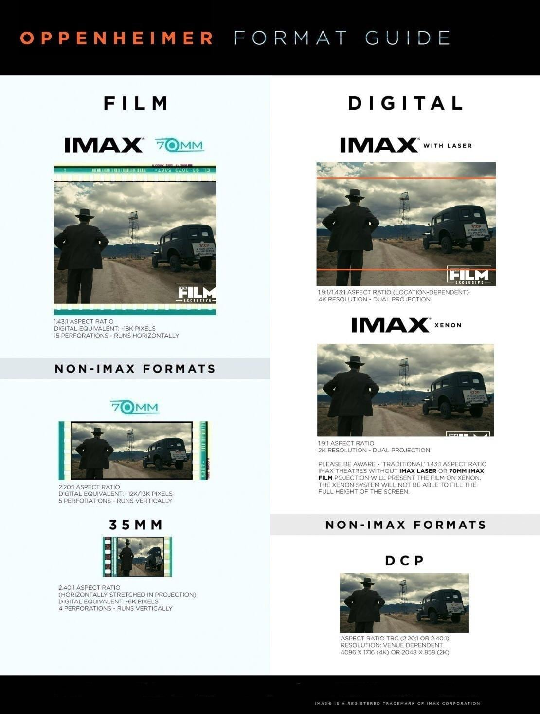

::: {.caption}
*Oppenheimer* format guide, Universal Pictures / IMAX, via Rasmus Larsen, [FlatpanelsHD](https://www.flatpanelshd.com/news.php?subaction=showfull&id=1685963488) (2023); fair use. Capacities: [Kingston](https://www.kingston.com/en/memory-cards/storage-chart).
:::
::::

:::::

::: {.notes}
- IMAX 70mm - roughly an 18K digital equivalent

:::

---

## Footnote about terabyte in streaming {.image-frame-slide}

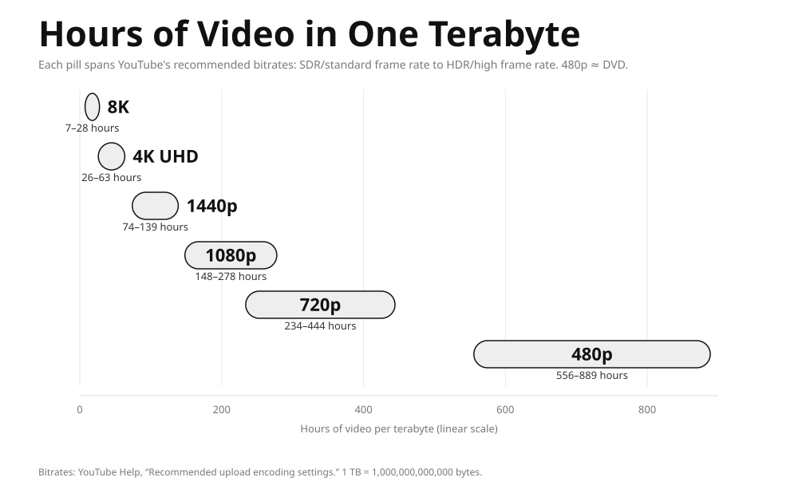

---

## Footnote about terabyte in streaming {.image-frame-slide}

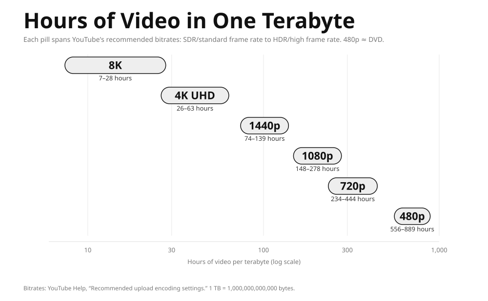

---

## What is Data Science? (A Hub of Fields) {.image-frame-slide}

---

## What is Data Science? (Yet Another Metaphor)

::: {.notes}
- Many fields "share the same track" (i.e. methods, tools, etc.)
- Data science makes up much of that shared track
- Data science can also go in a different direction
:::

---

## So what Do Data Scientists Do?

::: {.incremental}
1. **Ask good questions** — turn a vague goal into something measurable
2. **Obtain & clean the data** — collect, merge, and fix messy real-world data
3. **Explore & visualize** — search and discover patterns, outliers, and surprises
4. **Model & predict** — build something that explains and/or forecasts
5. **Communicate** — turn results into stories, decisions
:::

# Data Science Lifecycle {.section-header}

## The Data Science Lifecycle: Building Blocks {.image-frame-slide}

---

## The Data Science Lifecycle: Ask a Question {.image-frame-slide}

---

## The Data Science Lifecycle: Obtain Data {.image-frame-slide}

---

## The Data Science Lifecycle: Understand the Data {.image-frame-slide}

---

## The Data Science Lifecycle: Understand the World {.image-frame-slide}

---

## The Data Science Lifecycle: Communicate {.image-frame-slide}

---

## Source for the Lifecycle {.image-frame-slide}

::: {.caption}
Sam Lau, Joey Gonzalez, and Deb Nolan, ["The Data Science Lifecycle"](https://learningds.org/ch/01/lifecycle_intro.html), in *[Learning Data Science](https://learningds.org/)*.
:::

---

## Related Cycles

::: {.dense}
- similar shapes, different vocabulary
- design thinking, science, etc.
- learning + making = some version of this loop
:::

---

## Another Data Science Cycle {.image-frame-slide}

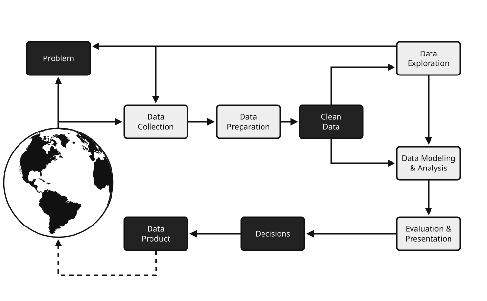

::: {.caption}
Adapted from Cathy O'Neil and Rachel Schutt, *[Doing Data Science](https://www.oreilly.com/library/view/doing-data-science/9781449363871/)* (O'Reilly, 2013), and from Gonzalo Bello Lander.
:::

---

## Another Cycle: McElreath's Bayesian Workflow {.image-frame-slide}

::: {.caption}
After Richard McElreath, *[Statistical Rethinking](https://xcelab.net/rm/statistical-rethinking/)* and the [Statistical Rethinking lecture series](https://github.com/rmcelreath/stat_rethinking_2026).
:::

---

## Another Cycle: Science {.image-frame-slide}

::: {.caption}
From Simon Goorney, Jonas Bley, Stefan Heusler, and Jacob Sherson, ["A Framework for Curriculum Transformation in Quantum Information Science and Technology Education"](https://doi.org/10.1088/1361-6404/ad7e60), *European Journal of Physics* 45(6), 2024.
:::

---

## Another Cycle: Inquiry Learning {.image-frame-slide}

::: {.caption}
From Simon Goorney, Jonas Bley, Stefan Heusler, and Jacob Sherson, ["A Framework for Curriculum Transformation in Quantum Information Science and Technology Education"](https://doi.org/10.1088/1361-6404/ad7e60), *European Journal of Physics* 45(6), 2024.
:::

---

## Yet Another Data Science Cycle {.image-frame-slide}

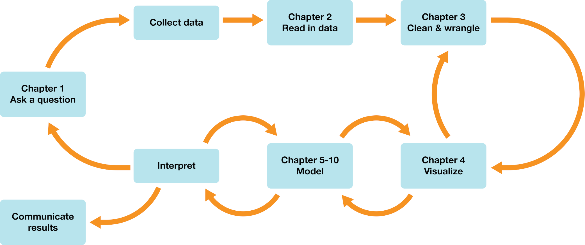

::: {.caption}
From Tiffany Timbers, Trevor Campbell, and Melissa Lee, [*Data Science: A First Introduction*](https://datasciencebook.ca/).
:::

---

## Questions about the lifecycle? {.image-frame-slide}

# Pasteur's Quadrant {.section-header}

## Pasteur's Quadrant: Blank Grid {.image-frame-slide}

::: {.caption}
Donald E. Stokes, *Pasteur's Quadrant: Basic Science and Technological Innovation* (Brookings, 1997).
:::

---

## Pasteur's Quadrant: Considerations of Use? {.image-frame-slide}

::: {.caption}
Donald E. Stokes, *Pasteur's Quadrant: Basic Science and Technological Innovation* (Brookings, 1997).
:::

---

## Pasteur's Quadrant: Fundamental Understanding? {.image-frame-slide}

::: {.caption}
Donald E. Stokes, *Pasteur's Quadrant: Basic Science and Technological Innovation* (Brookings, 1997).
:::

---

## Pasteur's Quadrant: Bohr {.image-frame-slide}

::: {.caption}
Donald E. Stokes, *Pasteur's Quadrant: Basic Science and Technological Innovation* (Brookings, 1997).
:::

---

## Pasteur's Quadrant: Edison {.image-frame-slide}

::: {.caption}
Donald E. Stokes, *Pasteur's Quadrant: Basic Science and Technological Innovation* (Brookings, 1997).
:::

---

## Pasteur's Quadrant: Pasteur {.image-frame-slide auto-animate=true}

::: {.caption}
Donald E. Stokes, *Pasteur's Quadrant: Basic Science and Technological Innovation* (Brookings, 1997).
:::

---

## Full table from Donald E. Stokes {.image-frame-slide auto-animate=true}

::: {.caption}
Donald E. Stokes, *Pasteur's Quadrant: Basic Science and Technological Innovation* (Brookings, 1997).
:::

---

## Bohr's Quadrant: Curiosity {.figure-aside auto-animate=true}

::::: {.columns}

:::: {.column .dense}
::: {.incremental}
- What determines the stability of atoms?
- What is the molecular structure of caffeine?
- Does $P = NP$?
- "Pure basic research"
:::

::::

:::: {.column}

::: {.caption}
Donald E. Stokes, *Pasteur's Quadrant: Basic Science and Technological Innovation* (Brookings, 1997).
:::
::::

:::::

---

## Edison's Quadrant: Uses, Applications {.figure-aside}

::::: {.columns}

:::: {.column .dense}
::: {.incremental}
- Which cold brew recipe do guests rate highest?
- Which version of the headline gets more clicks?
- What is the fastest route to CDRLC right now?
- **Less about "why."**
:::
::::

:::: {.column}

::: {.caption}
Donald E. Stokes, *Pasteur's Quadrant: Basic Science and Technological Innovation* (Brookings, 1997).
:::
::::

:::::

---

## Pasteur's Quadrant: Understanding and Use {.figure-aside}

::::: {.columns}

:::: {.column .dense}
::: {.incremental}
- Do noise machines help people sleep? Why or why not?
- How does the running plan influence people's performance?
- Which bus stops have the longest wait times?
:::

::: {.incremental}
- **Knowledge you can act on *and* learn from.**
:::
::::

:::: {.column}

::: {.caption}
Donald E. Stokes, *Pasteur's Quadrant: Basic Science and Technological Innovation* (Brookings, 1997).
:::
::::

:::::

---

## More Example Questions

:::: {.dense}
::: {.incremental}
- Do guests like the new cold brew recipe?
- Is the running plan helping people run faster?
- Do people sleep better with noise machines?
- Does surveillance improve safety?
- Did the advertising campaign make a difference?
- 
- **No real, curious human wants just "yes" or "no."**
- Data scientists can *explain* answers in detail.
- (See mini-book, [Chapter 1: Working Toward Wisdom](../ethics-in-data-science/book/01-working-toward-wisdom.html)).
:::
::::

---

## Your Turn: Questions You're Curious About {.prompt-slide}

::: {.prompt-question}
What other questions are you curious about that you think could be answered/addressed with data?
:::

---

## The Lifecycle: Ask a Question {.image-frame-slide}

---

# The DIKW Pyramid {.section-header}

## Pyramids {.image-frame-slide}

<object type="image/svg+xml" data="../assets/pyramid/comparison-of-pyramids-smil.svg" aria-label="Profiles of well-known pyramid and near-pyramid structures — from the Great Pyramid of Giza and the Pyramid of Djoser to the Louvre Pyramid, the Transamerica Pyramid, and the Ryugyong Hotel — all drawn to a common scale with a height axis in metres." style="width:auto; height:452px; aspect-ratio:560/350; display:block; margin:0 auto; background:#fff; border:1px solid rgba(0, 0, 0, 0.12); box-shadow:0 10px 28px rgba(0, 0, 0, 0.12);"></object>

::: {.caption}
Cmglee, [*Comparison of pyramids SMIL*](https://commons.wikimedia.org/wiki/File:Comparison_of_pyramids_SMIL.svg), [CC BY-SA 3.0](https://creativecommons.org/licenses/by-sa/3.0/).
:::

---

## The DIKW Pyramid: Empty {.image-frame-slide}

---

## The DIKW Pyramid: Four Layers {.image-frame-slide}

---

## The DIKW Pyramid: Data {.image-frame-slide}

---

## The DIKW Pyramid: Information {.image-frame-slide}

---

## The DIKW Pyramid: Knowledge {.image-frame-slide}

---

## The DIKW Pyramid: Wisdom {.image-frame-slide}

---

## Is the Pyramid Upside Down? {.figure-aside}

::::: {.columns}

:::: {.column}
::: {.incremental}
- Tuomi (1999): "data emerges only after we have information...  information emerges only after we already have knowledge"
- You need knowledge to decide what is even worth measuring
:::
::::

:::: {.column}

::: {.caption}
Slovak Radio Building, Bratislava. Thomas Ledl, [*Upside down Pyramid, Bratislava 02*](https://commons.wikimedia.org/wiki/File:Upside_down_Pyramid,_Bratislava_02.jpg), [CC BY-SA 4.0](https://creativecommons.org/licenses/by-sa/4.0/).
:::
::::

:::::

---

## So, Is the Pyramid Upside Down? {.figure-aside}

::::: {.columns}

:::: {.column}
::: {.incremental}
- Does wisdom sit at the top of the pyramid?
- Or does wisdom hold up the whole thing?
- What else could be messing in this metaphor?
:::
::::

:::: {.column}

::: {.caption}
Slovak Radio Building, Bratislava. Thomas Ledl, [*Upside down Pyramid, Bratislava 02*](https://commons.wikimedia.org/wiki/File:Upside_down_Pyramid,_Bratislava_02.jpg), [CC BY-SA 4.0](https://creativecommons.org/licenses/by-sa/4.0/).
:::
::::

:::::

---

## Martin Frické {.quote-slide}

> [A data-first pyramid] encourages the mindless and meaningless collection of data in the hope that one day it will ascend to information.

::: {.attribution}
Martin Frické
:::

::: {.quote-source}
["The Knowledge Pyramid: A Critique of the DIKW Hierarchy"](https://doi.org/10.1177/0165551508094050), *Journal of Information Science* 35(2), 2009, pp. 131–142.
:::

---

## What else is Missing? {data-auto-animate=""}

---

## What else is Missing? {.figure-aside data-auto-animate=""}

::::: {.columns}

:::: {.column}
::: {.incremental}
- **Understanding** — no layer in the pyramid 
- The pyramid does not build itself
- Knowledge as a "network of relations through which humans coordinate their actions" (Zeleny, 1987)
:::
::::

:::: {.column}

::::

:::::

---

## Ursula K. Le Guin {.quote-slide}

> What good are all the objects in the universe, if there is no subject?

::: {.attribution}
Ursula K. Le Guin
:::

::: {.quote-source}
"Science Fiction and Mrs. Brown" (1975), in *[The Language of the Night](https://openlibrary.org/books/OL4100441M/The_language_of_the_night)* (1979).
:::

---

## Questions about the DIKW Pyramid? {.image-frame-slide}

# The Treachery of Images {.section-header}

## {.photo-only data-state="photo-only" background-image="../assets/art/belgium_2026_wide.webp" background-size="cover"}

---

## What is this? {.image-frame-slide}

---

## This is not a jersey {.image-frame-slide}

::: {.caption}
Belgium's 2026 World Cup away jersey, "Ceci n'est pas un maillot." Photo via [Hyperallergic](https://hyperallergic.com/belgiums-magritte-inspired-soccer-jersey-mirrors-a-surreal-world-cup/).
:::

---

## This is not a pipe {.image-frame-slide}

::: {.caption}
René Magritte, *The Treachery of Images* (1929). [LACMA Collections](https://collections.lacma.org/object/31931).
:::

---

## This is not a triangle {.image-frame-slide}

::: {.caption}
See [Chapter 1: Working Toward Wisdom](../ethics-in-data-science/book/01-working-toward-wisdom.html).
:::

---

## Zooming In (Powers of Ten) {.image-frame-slide}

::: {.caption}
The red frame is 1/10th the size of the original canvas (160px vs. 1600px).
:::

---

## 10× Zoom {.image-frame-slide}

::: {.caption}
The "straight" line is jagged: the only way to draw a line with square pixels.
:::

---

## Another 10× Zoom {.image-frame-slide}

::: {.caption}
Again, the red frame marks where we zoom next.
:::

---

## 100× Zoom {.image-frame-slide}

::: {.caption}
The pixels are there the whole time, but they are sometimes too small to see.
:::

---

## ...these are not pixels {.image-frame-slide}

::: {.caption}
Jacek Halicki, [*2023 Mikroskopowy obraz matrycy LCD*](https://commons.wikimedia.org/wiki/File:2023_Mikroskopowy_obraz_matrycy_LCD.jpg), [CC BY-SA 4.0](https://creativecommons.org/licenses/by-sa/4.0/).
:::

---

## Subpixels {.image-frame-slide}

::: {.caption}
Jacek Halicki, [*2023 Mikroskopowy obraz matrycy LCD*](https://commons.wikimedia.org/wiki/File:2023_Mikroskopowy_obraz_matrycy_LCD.jpg), [CC BY-SA 4.0](https://creativecommons.org/licenses/by-sa/4.0/).
:::

---

## One Subpixel {.image-frame-slide}

::: {.caption}
One red subpixel, cropped from Jacek Halicki, [*2023 Mikroskopowy obraz matrycy LCD*](https://commons.wikimedia.org/wiki/File:2023_Mikroskopowy_obraz_matrycy_LCD.jpg), [CC BY-SA 4.0](https://creativecommons.org/licenses/by-sa/4.0/).
:::

---

## From Subpixel to Triangle {.image-frame-slide}

::: {style="position:relative; flex:0 0 auto; width:810px; height:487px; margin:0.2em auto 0;"}

:::

---

## Provenance {.image-frame-slide}

::: {.dense-smaller}
- Analogy: data scientists can explain *why* the figure was not a perfect triangle
- and are willing to say why it *is*, in some sense, a triangle
- understand how "subpixels of data" become "images of information"
- "All models are wrong" (Box)
	- All **data** are wrong too!
	- Or at least incomplete
:::

::: {.caption}
See [Chapter 1: Working Toward Wisdom](../ethics-in-data-science/book/01-working-toward-wisdom.html).
:::

---

## Another Complication {.image-frame-slide}

::: {.caption}
Different types of screens have different pixel / sub pixel shapes. Source: Peter Halasz (Pengo), [*Pixel geometry 02*](https://commons.wikimedia.org/wiki/File:Pixel_geometry_02_Pengo.jpg), [CC BY-SA 3.0](https://creativecommons.org/licenses/by-sa/3.0/).
:::

# Your Quiz on Wednesday {.section-header}

## Your Quiz on Wednesday

:::: {.dense}
::: {.incremental}
- A "systems check" for PrairieLearn
- **Ten questions**
- Two sections
	- **course logistics**
	- **data science basics**
- Mostly true/false, one "select all that apply," one fill-in-the-blank, one short answer
- **Everything on it was covered today.**
:::
::::

---

## Section 1: Course Logistics

::: {.aside-note}
All three are in the [syllabus](../syllabus/) and the [FAQ](../faq.html) too.
:::

::: {.dense-smaller}
You should be able to say...

- whether laptops are always allowed in class
- whether AI/LLM use is allowed on every exercise
- whether you are encouraged to ask questions in class
:::

---

## Section 2: Data Science Basics

::: {.dense-smaller}
You should be able to say...

- whether "data" is singular or plural
- how data science treats domain knowledge
- whether the lifecycle only moves forward
- which regions are labeled in Conway's Venn diagram
- the one word for tracing data back to its sources
- the axes of the 2×2 matrix, explain one quadrant
:::

---

## Homework 1 {.split}

::: {.split-content .narrow-aside .fill-height}

::: {.dense}
- **Ten questions**, only homework that will be due on a Wednesday
- A "systems check" to make sure you're in PrairieLearn
- Basic probability review (chain rule / product rule)
- Variants of the same questions will be on the quiz on Wednesday
- Unlimited retakes!
:::

{.figure .figure-sm alt="The PrairieLearn logo, a white line drawing of a purple coneflower on a dark blue panel"}

:::

---

## Your Turn: Questions about the Quiz? {.prompt-slide}

::: {.prompt-question}
Anything you want to go over before Wednesday?
:::

# Week 1, Day 2 {.course-title .photo-title data-state="photo-title photo-title-zoom" background-image="../assets/orange-line-stops-better/stop01-harold-washington-library-a.jpg" background-size="cover"}

<h2>Asking Questions</h2>

Jack Bandy and Elda Shatro
2026

## Map {.split}

::: {.split-content .narrow-aside}

::: {}
- Week 1: Harold Washington Library
- Day 2
    - Random Roll Call
    - Meet your TA
    - Logistical Questions
    - More about Questions
    - Quiz time (on your laptops)
        - Make sure I start by 4:25
:::

{.figure alt="Orange Line map with the Harold Washington Library stop marked, the Week 1 stop"}

:::

## Random Roll Call {.iframe-slide}

<button type="button" class="random-draw-button">Draw</button> 

::: {.iframe-caption}
Numbers drawn live from <a href="https://www.random.org/integers/?num=12&min=1&max=62&col=1&base=10&format=plain&rnd=new">random.org/integers/?num=12&min=1&max=62&col=1&base=10&format=plain&rnd=new</a>
:::

# Meet your TA! {.section-header}

# Logistical Questions? {.section-header}

## Homework 2 {.split}

::: {.split-content .narrow-aside .fill-height}

::: {.dense}
- Due Monday (sorry for the quick turnaround)
- More probability review (rule of subtraction)
- A few more challenging questions
- Variants of the same questions will be on the week3 quiz
- Unlimited retakes!
- Collaboration is encouraged!
- Paper / whiteboard work is encouraged!
:::

{.figure .figure-sm alt="The PrairieLearn logo, a white line drawing of a purple coneflower on a dark blue panel"}

:::

---

# More about Questions {.section-header}

## Questions in the Data Science Lifecycle {.image-frame-slide}

---

## Susanne Langer {.quote-slide}

> The way a question is asked limits and disposes the ways in which any answer to it — right or wrong — may be given.

::: {.attribution}
Susanne Langer
:::

::: {.quote-source}
*Philosophy in a New Key* (1942).
:::

---

## Which Question is Better?
::: {.caption}
Examples from Booth et al., *The Craft of Research* (2024).
:::

::: {.incremental}
- "Are there ultimate particles?"
- "Was Abraham Lincoln's right thumb longer than his nose?"
- Both are concrete and answerable!
- Today we will develop vocabulary to describe the differences
:::

---

## Warm-up Activity {.split}

::: {.split-content .golden-columns}

::: {}

- Gather with your elbow neighbor(s)
- You must speak to each other only in questions
- Topic can be anything
    - If you're stuck, start with something you enjoyed eating/drinking recently
:::

<iframe src="https://dodatascience.fun/timer/" title="CTA-style countdown timer" loading="lazy" style="width: 100%; height: 420px; display: block; border: 1px solid #999; box-shadow: 0 10px 28px rgba(0,0,0,0.12); border-radius: 3px;"></iframe>

:::

---

# Basic Types of Questions {.section-header}

## Basic Types of Questions {.split}

::: {.split-content .narrow-aside .fill-height}

::: {.dense}

::: {.caption}
Taxonomy from the *Stanford Encyclopedia of Philosophy* entry on questions.
:::

::: {.incremental}
- **"Whether"** — a finite set of direct answers (yes/no, multiple choice)
- **"Which"** — seeks a person, thing, or value; possibly infinite answers
- **"Why"** — asks for an explanation, not just a fact
- **Indirect ("embedded")** — implied by a larger statement ("Bob knows who spoke to Mary")
:::

:::

{.figure alt="A student in a lecture hall raising her hand, with classmates seated in the rows around her"}

:::

---

## What About "How" Questions?

::: {.incremental}
- Paraphrase test: if "how" can be reworded as "**in what way**," it is explanation-seeking (a "why" question)
- Otherwise it asks for a value (a "which" question)
- "How far is it to Cleveland?" (a distance)
- "How does screen time influence mental health?" (an explanation)
:::

---

## Cross's Seven "Ways"

::: {.caption}
Charles B. Cross, ["Explanation and the Theory of Questions"](https://doi.org/10.1007/BF00385722), *Erkenntnis* 34(2), 1991, pp. 248–249.
:::

:::: {.dense}
::: {.incremental}
- **By what road** — the route taken ("How did you get here?")
- **In what manner** — the style of the doing ("How did you behave at the party?")
- **By what argument** — the reasoning offered ("How will you justify this?")
- **By what method** — the established procedure ("How do you perform an appendectomy?")
- **By what means** — the resource or instrument used ("How did you get that money?")
- **In what respect** — the dimension of comparison ("How do these differ?")
- **By what process** — the mechanism unfolding over time ("How do DNA molecules replicate?")
:::
::::

---

# Common Pitfalls in Questions {.section-header}

## Carl Sagan {.quote-slide}

> There are naïve questions, tedious questions, ill-phrased questions, questions put after inadequate self-criticism. But every question is a cry to understand the world.

::: {.attribution}
Carl Sagan
:::

::: {.quote-source}
*The Demon-Haunted World: Science as a Candle in the Dark* (1995).
:::

---

## Common Pitfalls {.split}

::: {.split-content .narrow-aside}

::: {}

::: {.incremental}
- Naïve questions
- Tedious questions
- ill-phrased questions
- Leading questions
- Settled, speculative, or dead-end
- Invasive questions
- "Gotcha" questions
:::

:::

{.figure alt="A student in a lecture hall raising her hand, with classmates seated in the rows around her"}

:::

---

## Naïve Questions

::: {.incremental}
- Naïve about a particular context or setting
- Can also reveal assumptions "experts" have stopped considering
- e.g. "Was Michael Jordan good at basketball?"
- e.g. "Which NBA players are the best scorers?"
	- points per game vs. efficiency, possession context, etc.
:::

---

## Tedious Questions

::: {.incremental}
- Effort to answer is disproportionate to the value of the answer
- Measurable details are not always meaningful
- "How many times did each council member say the word 'budget'?"
    - (e.g. but ignoring how they actually voted)
:::

---

## ill-Phrased Questions

::: {.incremental}
- Terms, scope, or possible answers are unclear
- "Are students doing better this year?"
	- which students, compared with when, by what metric?
- "Is our museum's collection diverse?"
	- diverse in who/what/when, counted how?
- "Is news coverage biased?"
	- in story selection, sourcing, or word choice?
:::

---

## Leading Questions

::: {.incremental}
- Implies a preferred answer
- "How much did the tutoring program raise test scores?"
- "Everything tasting good over here?"
- Other examples of leading questions?
:::

---

## Settled, Speculative, and Dead-End Questions

::: {.incremental}
- **Settled** — already answered "well enough"
	- although replication studies can change this!
- **Speculative** — no evidence could realistically settle it
	- ("what if I-90 had never been built?")
- **Dead end** — answerable and precise, but nothing follows
	- ("how many bus stops face north?")
:::

---

## Invasive Questions

:::: {.dense}
::: {.incremental}
- All questions ask for information
- But information sensitivity can exceed the context
    - "Contextual integrity"
- E.g. Asking your weight at a job interview vs. at the DMV
- Can become coercive, e.g. if answers required for grades, jobs, housing, healthcare
- Ask for the **least sensitive** data that can address the question
    - More on this when we get to obtaining data, privacy
:::
::::

---

## "Gotcha" Questions {.split}

::: {.split-content .narrow-aside}

::: {}

::: {.incremental}
- Asked to call someone out, not to learn/explore
- The asker already knows the answer they want
- "What's the sample size for that?"
- sometimes a matter of how it's said
- Usually best saved for politicians / laywers
:::

:::

::: {.captioned-figure}
{.figure alt="A student in a lecture hall raising her hand, with classmates seated in the rows around her"}

::: {.caption}
"If Thanos was so worried about overpopulation, why didn't he use the magic glove to make more food?"
:::
:::

:::

---

# Temporality and More {.section-header}

## Presuppositions

::: {.incremental}
- A **presupposition** is a background claim that must be true for the question to have a meaningful answer
- "Who was the Roman emperor in 2020?"
- Presupposes an active Roman Empire
- Try to name your presuppositions!
:::

---

## Contrast Classes

:::: {.dense}
::: {.incremental}
- Explanatory questions often presuppose a set of alternatives
	- "compared to **what**?"
- "How do DNA molecules (vs. benzene and hexane) replicate?"
	- only one replicates -> no contrast class
- "How do reptiles (vs. mammals and birds) reproduce?"
	- every member reproduces -> contrast classes!
- A different "contrast class" can imply a different study design
:::
::::

---

## Temporality in Questions

::: {.incremental}
- Past/Present/Future
- **Counterfactual** — what would have happened?
- **Descriptive** — what is happening now?
- **Predictive** — what might happen in the future?
:::

---

## The Question can be the Hard Part {.quote-slide}

> In my opinion, the social sciences are the hard sciences.

::: {.attribution}
Michael Shermer
:::

::: {.quote-source}
*The Mind of the Market* (2008).
:::

---

## On your own: What Questions do you wonder about? {.split}

::: {.split-content .golden-columns}

::: {}

- Write down as many questions as come to mind
- Anything you are curious about
- Ideally, questions that could be addressed with data
- I know you are doing this multiple times - it's intentional
:::

<iframe src="https://dodatascience.fun/timer/" title="CTA-style countdown timer" loading="lazy" style="width: 100%; height: 420px; display: block; border: 1px solid #999; box-shadow: 0 10px 28px rgba(0,0,0,0.12); border-radius: 3px;"></iframe>

:::

---

## Your Turn: Discuss Your Questions {.split}

::: {.split-content .golden-columns}

::: {}

Discuss with your elbow neighbor(s):

1. What type is it? (whether, which, why, indirect, etc.)
2. What does it presuppose, if anything?
:::

<iframe src="https://dodatascience.fun/timer/" title="CTA-style countdown timer" loading="lazy" style="width: 100%; height: 420px; display: block; border: 1px solid #999; box-shadow: 0 10px 28px rgba(0,0,0,0.12); border-radius: 3px;"></iframe>

:::

---

# Upload today's worksheet in Canvas! {.section-header}

# Quiz {.section-header}

## Quiz Time!

- PrairieLearn
- Week1 Quiz
- It should give you your score instantly
- You can leave when finished!

# Sources {.sources}

1. GitHub source: <https://github.com/jackbandy/data-science-fun/blob/main/docs/slides/week1.qmd>.
2. Slides developed using materials from [Elena Zheleva](https://www.cs.uic.edu/~elena/), [Gonzalo Bello Lander](https://cs.uic.edu/profiles/gonzalo-bello/), the [Berkeley DS 100 team](https://ds100.org/), [Marine Carpuat](https://www.cs.umd.edu/~marine/), and [Brian Ziebart](https://cs.uic.edu/profiles/brian-ziebart).
3. [Elda Shatro](https://github.com/eldashatro4) contributed to these slides.
4. Slide deck built with [Quarto](https://quarto.org/) revealjs.
5. Title font is Big Shoulders; Body font is [Libre Franklin](https://en.wikipedia.org/wiki/Franklin_Gothic#Libre_Franklin).
6. Colleen McClain, Monica Anderson, Olivia Sidoti, and William Bishop, ["How Teens Use and View AI"](https://www.pewresearch.org/internet/2026/02/24/how-teens-use-and-view-ai/), Pew Research Center, February 24, 2026; the chart of teen AI chatbot uses is reproduced from that report.
7. Drew Conway, [*The Data Science Venn Diagram*](http://drewconway.com/zia/2013/3/26/the-data-science-venn-diagram) (2010), [CC BY-NC 3.0](https://creativecommons.org/licenses/by-nc/3.0/); the remixed Venn diagrams in this deck are derived from it.
8. The zoom sequence, DIKW discussion, and frequentist/Bayesian coin bet draw on [Chapter 1: Working Toward Wisdom](../ethics-in-data-science/book/01-working-toward-wisdom.html); the coin-bet example is from [Panos Ipeirotis (2008)](https://www.behind-the-enemy-lines.com/2008/01/are-you-bayesian-or-frequentist-or.html).
9. Sam Lau, Joey Gonzalez, and Deb Nolan, ["The Data Science Lifecycle"](https://learningds.org/ch/01/lifecycle_intro.html), in *[Learning Data Science](https://learningds.org/)*.
10. Cathy O'Neil and Rachel Schutt, *[Doing Data Science](https://www.oreilly.com/library/view/doing-data-science/9781449363871/)*, O'Reilly, 2013; the data science process diagram in this deck is remixed from Gonzalo Bello Lander's adaptation of it.
11. The Bayesian workflow diagram is remixed from Richard McElreath's *[Statistical Rethinking](https://xcelab.net/rm/statistical-rethinking/)* [lecture series](https://github.com/rmcelreath/stat_rethinking_2026).
12. Richard McElreath, *[Statistical Rethinking: A Bayesian Course with Examples in R and Stan](https://xcelab.net/rm/statistical-rethinking/)*, 2nd ed., Chapman and Hall/CRC, 2020.
13. Ilkka Tuomi, ["Data Is More than Knowledge: Implications of the Reversed Knowledge Hierarchy for Knowledge Management and Organizational Memory"](https://doi.org/10.1080/07421222.1999.11518258), *Journal of Management Information Systems* 16(3), 1999, pp. 103–117.
14. Slovak Radio Building photo by Thomas Ledl, [*Upside down Pyramid, Bratislava 02*](https://commons.wikimedia.org/wiki/File:Upside_down_Pyramid,_Bratislava_02.jpg), [CC BY-SA 4.0](https://creativecommons.org/licenses/by-sa/4.0/).
15. Martin Frické, ["The Knowledge Pyramid: A Critique of the DIKW Hierarchy"](https://doi.org/10.1177/0165551508094050), *Journal of Information Science* 35(2), 2009, pp. 131–142.
16. Belgium 2026 World Cup away jersey by adidas and the Royal Belgian Football Association, photo via [Hyperallergic](https://hyperallergic.com/belgiums-magritte-inspired-soccer-jersey-mirrors-a-surreal-world-cup/); used under fair use for educational commentary.
17. *The Treachery of Images* (1929) by René Magritte, courtesy of [LACMA Collections](https://collections.lacma.org/object/31931); public domain in the United States.
18. "Powers of ten" zoom framing after Charles and Ray Eames, *Powers of Ten* (1968/1977).
19. LCD subpixel micrographs by Jacek Halicki, [*2023 Mikroskopowy obraz matrycy LCD*](https://commons.wikimedia.org/wiki/File:2023_Mikroskopowy_obraz_matrycy_LCD.jpg), [CC BY-SA 4.0](https://creativecommons.org/licenses/by-sa/4.0/).
20. Pixel geometry comparison by Peter Halasz (Pengo), [*Pixel geometry 02*](https://commons.wikimedia.org/wiki/File:Pixel_geometry_02_Pengo.jpg), [CC BY-SA 3.0](https://creativecommons.org/licenses/by-sa/3.0/).
21. Coin toss photo by ICMA Photos, [*Coin Toss*](https://commons.wikimedia.org/wiki/File:Coin_Toss_(3635981474).jpg), [CC BY-SA 2.0](https://creativecommons.org/licenses/by-sa/2.0/).
22. Bradley Efron, ["Why Isn't Everyone a Bayesian?"](https://doi.org/10.1080/00031305.1986.10475342), *The American Statistician* 40(1), 1986, pp. 1–5.
23. UIC elevated walkway photo courtesy University of Illinois Chicago, via Hillary Bird, ["Walk through UIC's architectural history"](https://today.uic.edu/walk-through-uics-architectural-history/), *UIC Today*, June 9, 2025; the article prints no photographer credit, but the filename points to architectural photographer Orlando Cabanban.
24. The "Asking Questions" section follows [Chapter 2: Ethics in Asking Questions](../ethics-in-data-science/book/02-ethics-in-asking-questions.html), which draws on the *[Stanford Encyclopedia of Philosophy](https://plato.stanford.edu/entries/questions/)* entry on questions, Charles B. Cross, ["Explanation and the Theory of Questions"](https://doi.org/10.1007/BF00385722), *Erkenntnis* 34(2), 1991, pp. 237–260, and Wayne C. Booth et al., *The Craft of Research*, 5th ed., University of Chicago Press, 2024.
25. Note-taking evidence on "The Benefits of Paper": Fergus I. M. Craik and Robert S. Lockhart, ["Levels of Processing: A Framework for Memory Research"](https://doi.org/10.1016/S0022-5371(72)80001-X), *Journal of Verbal Learning and Verbal Behavior* 11(6), 1972, pp. 671–684; Pam A. Mueller and Daniel M. Oppenheimer, ["The Pen Is Mightier Than the Keyboard"](https://doi.org/10.1177/0956797614524581), *Psychological Science* 25(6), 2014, pp. 1159–1168; and Kayla Morehead, John Dunlosky, and Katherine A. Rawson, ["How Much Mightier Is the Pen than the Keyboard for Note-Taking? A Replication and Extension of Mueller and Oppenheimer (2014)"](https://doi.org/10.1007/s10648-019-09468-2), *Educational Psychology Review* 31(3), 2019, pp. 753–780.
26. iPhone 17 Pro Max photo by Ahmad Ali Karim, [*Cosmic Orange iPhone 17 Pro Max*](https://commons.wikimedia.org/wiki/File:Cosmic_Orange_iPhone_17_Pro_Max.jpg), [CC0](https://creativecommons.org/publicdomain/zero/1.0/).
27. Population figures for the terabyte analogies are Census Bureau [Population Estimates Program](https://www.census.gov/programs-surveys/popest.html) vintage 2024 (Cook County 5,182,617; United States 340,110,988); the UIC figure is the Fall 2025 record enrollment of 35,869 reported by [*UIC Today*](https://today.uic.edu/uic-enrollment-hits-all-time-best-mark/).
28. The "~30 hours of 4K per terabyte" figure is from Kingston Technology, ["Flash Memory Storage Chart"](https://www.kingston.com/en/memory-cards/storage-chart) (2019), cross-checked against [Clip Sweeper](https://clipsweeper.com/blog/how-long-record-1tb-ssd). The interval chart uses bitrates from YouTube Help, ["Recommended upload encoding settings"](https://support.google.com/youtube/answer/1722171), with hours derived exactly (1 TB = 8 × 10^12 bits, so hours = 2,222 ÷ Mbps); the streaming comparison in the speaker notes is [Netflix's published data usage](https://help.netflix.com/en/node/87). See [assets/terabyte-scale/SOURCES.md](https://github.com/jackbandy/data-science-fun/blob/main/docs/assets/terabyte-scale/SOURCES.md) for why the chart does not use Kingston's bitrate labels.
29. *Oppenheimer* format guide by Universal Pictures and IMAX, via Rasmus Larsen, ["Only 30 theaters will screen 'Oppenheimer' as intended by Christopher Nolan"](https://www.flatpanelshd.com/news.php?subaction=showfull&id=1685963488), *FlatpanelsHD*, June 5, 2023; used under fair use for educational commentary.
