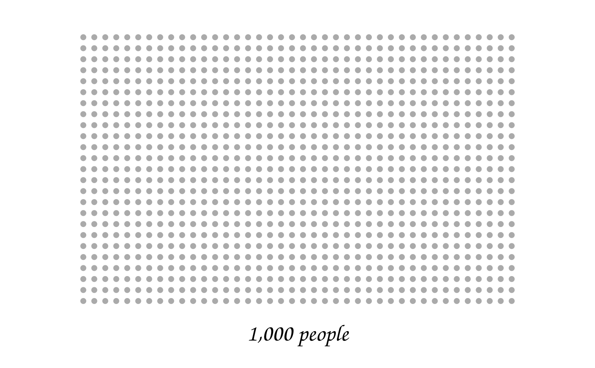
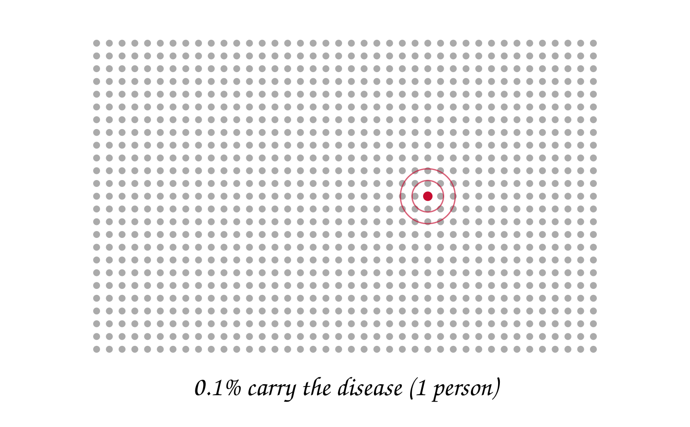
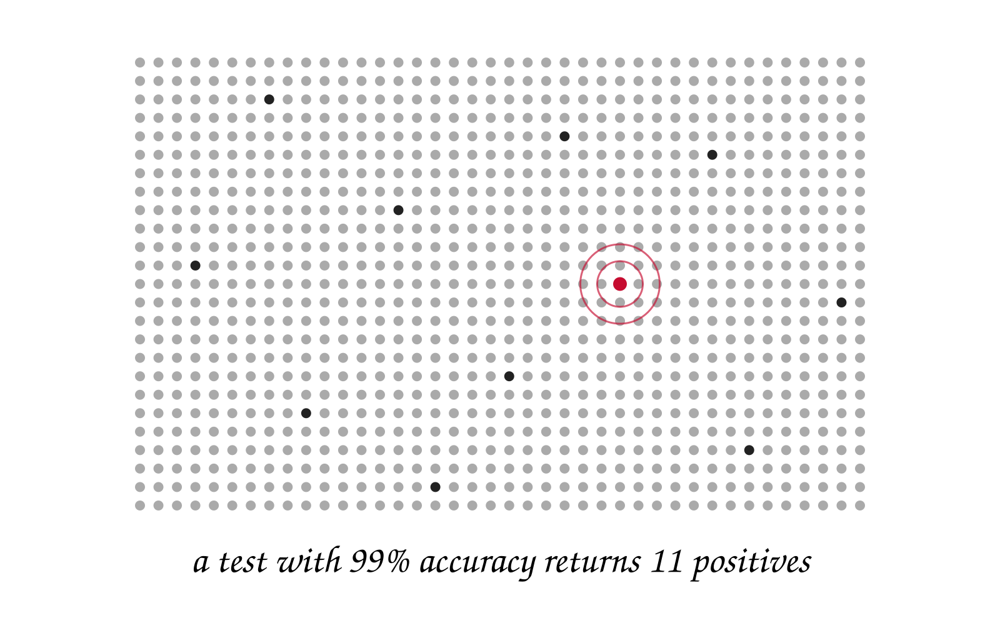
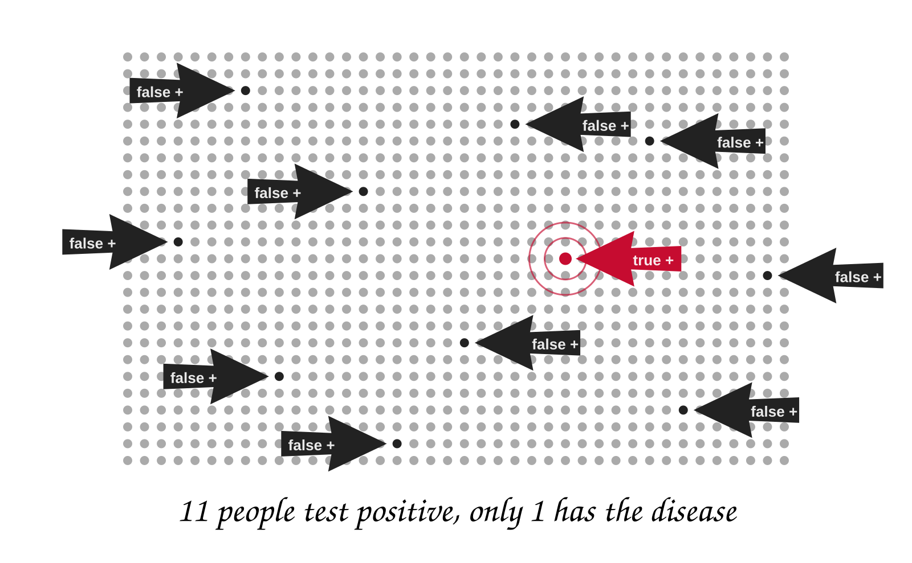
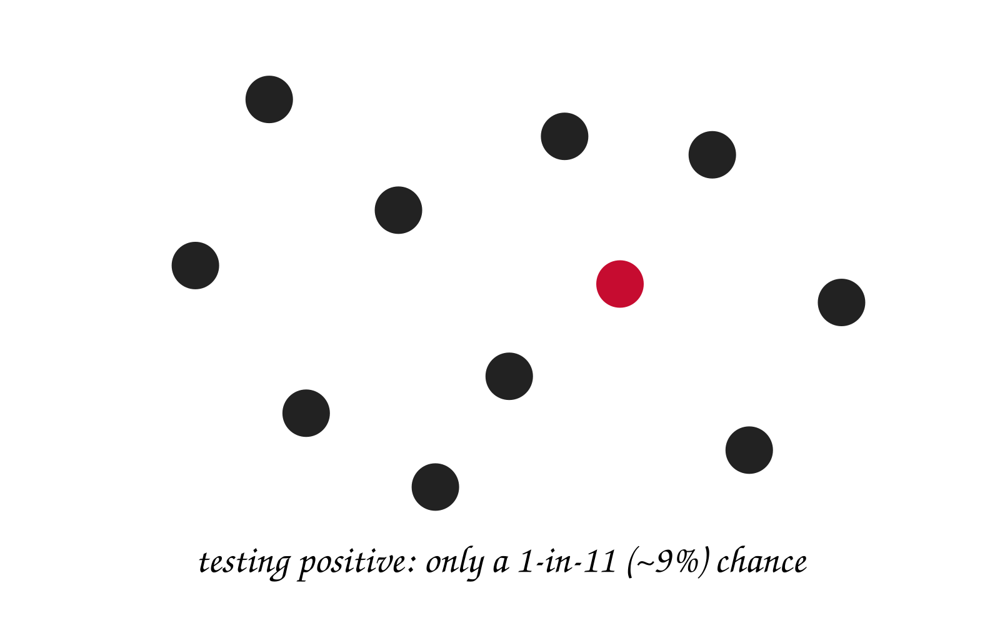

```{python}
#| echo: false
# Shared setup for the figure cells in this deck.
import numpy as np
import polars as pl
from plotnine import *

ORANGE = "#f9461c"
DARK = "#c83214"
INK = "#1a1a1a"

def note(x, y, text, ha="left", color=INK, size=13):
    """A text annotation in the deck's type and colors."""
    return annotate("text", x=x, y=y, label=text, ha=ha, size=size, color=color)
```


# Week 2, Day 1 {.course-title .photo-title data-state="photo-title" background-image="../assets/orange-line-stops-better/stop02-lasalle-van-buren-a.jpg" background-size="cover"}

<h2>Statistics Review; Python and Polars</h2>

CS 418 · Week 2 · 🟠 LaSalle/Van Buren 🟠

## {.photo-only data-state="photo-only" background-image="../assets/orange-line-stops-better/stop02-lasalle-van-buren-a.jpg" background-size="cover"}
---

## Map {.split}
::: {.split-content .narrow-aside}

::: {}
- Week 2: LaSalle/Van Buren
- Day 1
    - Random Roll Call
    - Statistics Review
    - Python Foundations
    - Dataframes and Polars
:::

{.figure alt="Orange Line map with the LaSalle/Van Buren stop marked, the Week 2 stop"}

:::

---

## Random Roll Call {.iframe-slide}
<div class="random-draw" data-num="12" data-min="1" data-max="62">
<div class="random-draw-frame">
<div class="random-draw-numbers" role="status" aria-live="polite" data-placeholder="Press “Draw” for 12 random numbers between 1 and 62."></div>
</div>
<p class="random-draw-controls"><button type="button" class="random-draw-button">Draw</button> <label class="random-draw-sort"><input type="checkbox" class="random-draw-sort-input"> Sort</label> <span class="random-draw-status"></span></p>
</div>

<style>
.random-draw { display: flex; flex-direction: column; flex: 1; min-height: 0; }
.random-draw-frame { flex: 1; min-height: 0; display: flex; justify-content: center; }
.random-draw-numbers { height: 100%; aspect-ratio: 1.618 / 1; max-width: 100%; border: 1px solid #999; display: grid; grid-template-columns: repeat(6, 1fr); grid-template-rows: repeat(2, 1fr); place-items: center; }
.random-draw-numbers .random-draw-number { font-size: 3rem; font-weight: 700; line-height: 1; }
.random-draw-numbers .random-draw-placeholder { grid-column: 1 / -1; grid-row: 1 / -1; text-align: center; font-size: 1.4rem; color: #555; padding: 0 1.5em; }
.random-draw-controls { flex: none; margin: 12px 0 0; }
.random-draw-button { font: inherit; font-size: 1.1rem; font-weight: 600; padding: 0.3em 1.2em; border: none; border-radius: 3px; background: #f9461c; color: #fff; cursor: pointer; }
.random-draw-button:hover:not(:disabled) { background: #e03c14; }
.random-draw-button:disabled { opacity: 0.6; cursor: default; }
.random-draw-sort { font-size: 1rem; color: #555; margin-left: 0.75em; cursor: pointer; }
.random-draw-status { font-size: 1rem; color: #555; margin-left: 0.75em; }
</style>

<script>
(() => {
  const API = "https://www.random.org/integers/";
  function setup(root) {
    if (root.dataset.wired) return;
    root.dataset.wired = "1";
    const out = root.querySelector(".random-draw-numbers");
    const button = root.querySelector(".random-draw-button");
    const status = root.querySelector(".random-draw-status");
    const sortBox = root.querySelector(".random-draw-sort-input");
    const num = root.dataset.num, min = root.dataset.min, max = root.dataset.max;
    const url = API + "?num=" + num + "&min=" + min + "&max=" + max + "&col=1&base=10&format=plain&rnd=new";
    let drawn = null;
    function placeholder(text) {
      out.innerHTML = "";
      const p = document.createElement("div");
      p.className = "random-draw-placeholder";
      p.textContent = text;
      out.appendChild(p);
    }
    function render() {
      if (!drawn) return;
      const numbers = sortBox.checked ? drawn.slice().sort(function (a, b) { return a - b; }) : drawn;
      out.innerHTML = "";
      numbers.forEach(function (n) {
        const cell = document.createElement("div");
        cell.className = "random-draw-number";
        cell.textContent = n;
        out.appendChild(cell);
      });
    }
    function draw() {
      button.disabled = true;
      status.textContent = "drawing from random.org…";
      fetch(url, { cache: "no-store" })
        .then(function (r) { if (!r.ok) throw new Error("HTTP " + r.status); return r.text(); })
        .then(function (text) {
          const numbers = text.trim().split(/\s+/).filter(Boolean).map(Number);
          if (!numbers.length) throw new Error("empty response");
          drawn = numbers;
          render();
          status.textContent = "true random numbers from random.org";
        })
        .catch(function (err) {
          drawn = null;
          placeholder("Could not reach random.org (" + err.message + "). Open the draw in a new tab instead.");
          status.textContent = "";
        })
        .then(function () { button.disabled = false; });
    }
    button.addEventListener("click", draw);
    sortBox.addEventListener("change", render);
    placeholder(out.dataset.placeholder);
  }
  function init() {
    document.querySelectorAll(".random-draw").forEach(setup);
  }
  if (document.readyState === "loading") {
    document.addEventListener("DOMContentLoaded", init);
  } else {
    init();
  }
})();
</script>

::: {.iframe-caption}
Numbers drawn live from <a href="https://www.random.org/integers/?num=12&min=1&max=62&col=1&base=10&format=plain&rnd=new">random.org/integers/?num=12&min=1&max=62&col=1&base=10&format=plain&rnd=new</a>
:::


# Statistics Review {.section-header}


## Statistics in Data Science {.figure-aside}
::: {.columns}

::: {.column}
- **Statistics**: learning from data under uncertainty.
- "How can these raw numbers be used as evidence?"
- "What does this sample say about the whole population?"
:::

::: {.column}


::: {.caption}
ICMA Photos, [*Coin Toss*](https://commons.wikimedia.org/wiki/File:Coin_Toss_(3635981474).jpg), [CC BY-SA 2.0](https://creativecommons.org/licenses/by-sa/2.0/).
:::
:::

:::

---

## Kinds of Statistics

::: {.columns .compare-columns}

::: {.column}
[DESCRIPTIVE]{.eyebrow}

- Summarizes the **sample** (the actual data we have)
- Measures of **center**: mean, median, mode
- Measures of **spread**: range, standard deviation, variance
- Measures of **position**: quartiles, percentiles
:::

::: {.column}
[INFERENTIAL]{.eyebrow}

- Uses the sample to conclude something about the **population**
- Hypothesis testing, confidence intervals
- A **parameter** is a numerical characteristic of a population
- Week 2 is a review; we return to inference in Week 8
:::

:::

---

## Descriptive Stats: Measures of Center
::: {.columns .compare-columns}

::: {.column width="50%"}
[THE THREE MIDDLES]{.eyebrow}

**Mean** — the sum divided by the number of values

$$\bar{x} = \frac{1}{n}\sum_{i=1}^{n} a_i$$

**Median** — the middle value of the sorted data, or the mean of the two middle values when $n$ is even

**Mode** — the most frequent value. A dataset with two modes is **bimodal**
:::

::: {.column width="50%"}
[WORKED THROUGH]{.eyebrow}

| Ages | 24 | 35 | 32 | 21 | 28 |
|:--|--:|--:|--:|--:|--:|

$$\bar{x} = \frac{24+35+32+21+28}{5} = 28$$

Grades: 78, 90, 90, 80, 78, 95, 76, 84

Sorted: 76, 78, 78, 80, 84, 90, 90, 95

$$\text{median} = \frac{80+84}{2} = 82
\qquad \text{mode} = 78, 90$$
:::

:::

---

## Why it's Mean to Use the Mean {.smaller}
Which measure better summarizes these salaries?

::: {.columns}

::: {.column width="20%"}
| Salaries |
|--:|
| 75,000 |
| 70,000 |
| 72,000 |
| 65,000 |
| **675,000** |
| 75,000 |
| 68,000 |
| 74,000 |
:::

::: {.column width="80%"}
::: {.incremental}
- Mean = **\$146,750**
- Median = **\$73,000**
- [675,000 is an **outlier**]{.key} — a value much higher or much lower than the rest of the data
- The mean is **not robust** to outliers
- The median is the better one-number summary here
- Often the case for social media data, where a few accounts dwarf the rest

:::
:::

:::

---

## Sneak Peek: Where Is the Middle? {.figure-slide}
```{python}
#| echo: false
# Copied from the Week 4 deck: builds up the arithmetic vs. geometric mean number line.
A, B = 10, 10_000
AM = (A + B) / 2            # 5005
GM = (A * B) ** 0.5         # ~316.23
TEAL = "#1f8a9b"            # the deck's secondary accent

def number_line(positions, labels, marks, title, xmax):
    """A bare horizontal axis with tick labels and annotated marks.

    `marks` is a list of (position, label, color, level) drawn as a dot with a
    caption on a stem above it; `level` 0 or 1 picks the stem height so that
    labels for values close together don't collide. Every stage draws the same
    axis and the same limits, so the .r-stack fragments swap without the
    layout shifting.
    """
    pad = 0.14 * xmax           # room for labels that overhang the ends
    axis = pl.DataFrame({"x": [0.0], "y": [0.0]})
    p = (ggplot(axis, aes("x", "y"))
         + annotate("segment", x=0, xend=xmax, y=0, yend=0, color=INK, size=1)
         + theme_void()
         + theme(figure_size=(10, 3.4)))
    for pos, lab in zip(positions, labels):
        p = (p
             + annotate("segment", x=pos, xend=pos, y=-0.08, yend=0.08, color=INK)
             + note(pos, -0.3, lab, ha="center", size=12))
    for pos, lab, col, level in marks:
        top = 0.5 + 0.6 * level
        p = (p
             + annotate("point", x=pos, y=0, color=col, size=5)
             + annotate("segment", x=pos, xend=pos, y=0.14, yend=top, color=col)
             + note(pos, top + 0.12, lab, ha="center", color=col, size=13))
    return (p
            + note(xmax / 2, 2.0, title, ha="center", size=15)
            + scale_x_continuous(limits=(-pad, xmax + pad))
            + scale_y_continuous(limits=(-0.55, 2.2)))

lin_ticks = [0, 2500, 5000, 7500, 10000]
lin_labels = ["0", "2,500", "5,000", "7,500", "10,000"]
lin_data = [(A, "10", ORANGE, 0), (B, "10,000", ORANGE, 0)]

log_ticks = [1, 2, 3, 4]
log_labels = ["10", "100", "1,000", "10,000"]
log_data = [(1, "10", ORANGE, 0), (4, "10,000", ORANGE, 0)]
```

:::: {.r-stack}

::: {.fragment .fade-out fragment-index=1}
```{python}
#| echo: false
#| fig-width: 10
#| fig-height: 3.4
#| fig-alt: "A linear number line from 0 to 10,000 with two orange points, one at 10 near the far left and one at 10,000 at the right end"
number_line(lin_ticks, lin_labels, lin_data, "Two values on a linear scale", 10000)
```
:::

::: {.fragment .fade-in-then-out fragment-index=1}
```{python}
#| echo: false
#| fig-width: 10
#| fig-height: 3.4
#| fig-alt: "The same linear number line with the arithmetic mean of 5,005 marked at the halfway point, far from both data values"
number_line(lin_ticks, lin_labels,
            lin_data + [(AM, "arithmetic mean\n5,005", DARK, 0)],
            "Arithmetic mean (the middle of the linear scale)", 10000)
```
:::

::: {.fragment .fade-in-then-out fragment-index=2}
```{python}
#| echo: false
#| fig-width: 10
#| fig-height: 3.4
#| fig-alt: "The same linear number line with the geometric mean of about 316 marked close to the left end, and the arithmetic mean still at 5,005"
number_line(lin_ticks, lin_labels,
            lin_data + [(AM, "arithmetic mean\n5,005", DARK, 0),
                        (GM, "geometric mean\n≈ 316", TEAL, 1)],
            "Geometric mean (much closer to both values)", 10000)
```
:::

::: {.fragment fragment-index=3}
```{python}
#| echo: false
#| fig-width: 10
#| fig-height: 3.4
#| fig-alt: "The same two values redrawn on a logarithmic number line with ticks at 10, 100, 1,000 and 10,000; the geometric mean of about 316 now sits exactly halfway between the points, while the arithmetic mean of 5,005 sits far to the right"
number_line(log_ticks, log_labels,
            log_data + [(np.log10(AM), "arithmetic mean\n5,005", DARK, 1),
                        (np.log10(GM), "geometric mean\n≈ 316", TEAL, 0)],
            "Same values on a log₁₀ scale, the geometric mean is the middle",
            4.6)
```
:::

::::


---


## Descriptive Stats: Measures of Spread
::: {.columns .compare-columns}

::: {.column}
[HOW SPREAD OUT?]{.eyebrow}

- **Range** = maximum − minimum
- **Standard deviation** — typical distance between a value and the mean
- **Variance** = $s^2$

$$s = \sqrt{\frac{\sum_{i=1}^{n}(a_i - \bar{x})^2}{n-1}}$$
:::

::: {.column}
[WORKED THROUGH]{.eyebrow}

| Ages | 24 | 35 | 32 | 21 | 28 |
|:--|--:|--:|--:|--:|--:|

Mean = 28

$$\frac{(-4)^2 + 7^2 + 4^2 + (-7)^2 + 0^2}{4} = 32.5$$

Variance = **32.5** &nbsp;&nbsp; Std. dev. = **5.7**
:::

:::

---

## Descriptive Stats: Percentiles and Quartiles {.smaller}

- **Percentiles** divide the data into 100 equal parts: $n$% of the data is at or below the $n$th percentile
- **Quartiles** divide it into quarters — $Q_1$ (25th), $Q_2$ (50th, the median), $Q_3$ (75th)
- The minimum, $Q_1$, median, $Q_3$, and maximum are the **five-number summary**

::: {.columns}

::: {.column width="48%"}
Grades, sorted: 76, 78, 78, 80, 84, 90, 90, 95

| | Value |
|:--|--:|
| Minimum | 76 |
| $Q_1$ | 78 |
| Median | 82 |
| $Q_3$ | 90 |
| Maximum | 95 |
:::

::: {.column width="48%"}
```{python}
#| echo: false
#| fig-alt: "Horizontal box plot of eight grades, with the box spanning the first quartile at 78 to the third quartile at 90, a median line at 82, and whiskers reaching 76 and 95"
import matplotlib.pyplot as plt
fig, ax = plt.subplots(figsize=(4.6, 2.0))
ax.boxplot([78, 90, 90, 80, 78, 95, 76, 84], vert=False, widths=0.45,
           boxprops=dict(color="#f9461c"), medianprops=dict(color="#001E62"),
           whiskerprops=dict(color="#565a5c"), capprops=dict(color="#565a5c"))
ax.set(xlabel="grade", yticks=[])
ax.spines[["top", "right", "left"]].set_visible(False)
```

:::

:::

---

## Probability Terminology

- An **experiment** is a procedure with more than one possible outcome
    - the **sample space** $S$ is the set of all outcomes
    - an **event** $E$ is a subset of $S$
- **Conditional probability** — the probability of $A$ given that $B$ already happened: $P(A \mid B) = \frac{P(A \cap B)}{P(B)}$
- **Bayes' theorem** — flip the condition around: $P(A \mid B) = \frac{P(B \mid A)\,P(A)}{P(B)}$

---

## Hypothesis Testing Terminology

- The **null hypothesis** $H_0$ is assumed true unless the evidence says otherwise; the **alternative** $H_a$ contradicts it
- A **$p$-value** is the probability of seeing evidence at least this extreme, if $H_0$ were true
- If $p$ is below the **significance level** $\alpha$ (typically 0.05), the result is said to be **statistically significant**

| | $H_0$ is true | $H_0$ is false |
|:--|:--|:--|
| **Reject $H_0$** | Type I error (prob. $\alpha$) | Correct decision |
| **Fail to reject $H_0$** | Correct decision | Type II error (prob. $\beta$) |


---

## Lots of Descriptive Stats at Once {.smaller}

`describe()` gives: count, nulls, mean, standard deviation, and the five-number summary — on every column of a dataframe.

::: {.columns}

::: {.column width="46%"}
```{python}
#| echo: true
import polars as pl

grades = pl.DataFrame(
    {"grade": [78, 90, 90, 80, 78, 95, 76, 84]}
)

grades.describe()
```
:::

::: {.column width="52%"}
- Works on any dataframe, or just one column
- Good first thing to run on data you have never seen
- `null_count` is often useful for cleaning/wrangling
:::

:::

---

## Why describe() Exists

This is not super fun:

::: {.columns}

::: {.column width="52%"}
```{python}
#| echo: true
grades.select(
    pl.col("grade").mean().alias("mean"),
    pl.col("grade").median().alias("median"),
    pl.col("grade").std().round(2).alias("std"),
)
```
:::

::: {.column width="46%"}
```{python}
#| echo: true
grades.select(
    pl.col("grade").min().alias("min"),
    pl.col("grade").quantile(0.25).alias("Q1"),
    pl.col("grade").quantile(0.75).alias("Q3"),
    pl.col("grade").max().alias("max"),
)
```
:::

:::


# Python Foundations {.section-header}


## Python Foundations

::: {style="border:3px dashed #f9461c; border-radius:12px; padding:0.8em 1em; margin-top:0.4em;"}
[TODO]{.eyebrow .todo}

- **TK**
:::

---

## Why Python for This Course {.plain-code}
You already know Python from previous classes. Reasons it is useful for data science:

- **Readable** — sort of close to plain English, very forgiving
- **Libraries** — e.g. `polars` for dataframes, `matplotlib` for figures, `requests` for pulling data off the web
- **Visualization** — charts and maps without leaving the notebook

::: {style="border:3px dashed #f9461c; border-radius:12px; padding:0.8em 1em; margin-top:0.4em;"}
[TODO]{.eyebrow .todo}

- **TK**
:::


---

## Review: Types in Python {.plain-code}
Every value in Python has a type

:::: {.columns}

::: {.column width="48%"}
| Type | Example |
|:--|:--|
| `int` | `5231` |
| `float` | `7423.5` |
| `complex` | `3 + 4j` |
| `str` | `'Midway'` |
| `list` | `[1, 2, 3]` |
| `tuple` | `(41.78, -87.73)` |
| `range` | `range(0, 10)` |
:::

::: {.column width="48%"}
| Type | Example |
|:--|:--|
| `dict` | `{'rides': 5231}` |
| `set` | `{'W', 'A', 'U'}` |
| `frozenset` | `frozenset({1, 2})` |
| `bool` | `True` |
:::

::::

::: {.notes}
- `tuple` is an immutable list
:::

---

## Kinds of Data
For understanding the *meaning* of values. (Python types: how a value is *stored*.)

<svg viewBox="0 0 1000 215" width="100%" style="max-height:180px; display:block; margin:0.2em auto 0;" role="img" aria-label="A tree diagram: Data splits into Quantitative Data and Categorical Data; Categorical Data splits again into Ordinal and Nominal">
  <g fill="none" stroke="#f9461c" stroke-width="1.5">
    <path d="M470 44 L270 88"/>
    <path d="M530 44 L640 78"/>
    <path d="M655 122 L625 164"/>
    <path d="M725 122 L800 164"/>
  </g>
  <g font-family="inherit" text-anchor="middle" fill="#ffffff">
    <rect x="440" y="6" width="120" height="38" rx="8" fill="#c83214"/>
    <text x="500" y="31" font-size="20" font-weight="700">Data</text>
    <rect x="70" y="88" width="200" height="38" rx="8" fill="#f9461c"/>
    <text x="170" y="112" font-size="16" font-weight="600">Quantitative Data</text>
    <rect x="595" y="78" width="190" height="38" rx="8" fill="#f9461c"/>
    <text x="690" y="102" font-size="16" font-weight="600">Categorical Data</text>
    <rect x="555" y="164" width="140" height="36" rx="8" fill="#f9461c"/>
    <text x="625" y="187" font-size="16" font-weight="600">Ordinal</text>
    <rect x="730" y="164" width="140" height="36" rx="8" fill="#f9461c"/>
    <text x="800" y="187" font-size="16" font-weight="600">Nominal</text>
  </g>
</svg>

::: {.columns .compare-columns}

::: {.column}
[QUANTITATIVE]{.eyebrow}

Numbers with meaningful ratios or intervals.

Price, quantity, temperature, date
:::

::: {.column}
[ORDINAL]{.eyebrow}

Categories with an order, but no consistent meaning "in between"

e.g. ranked preferences, level of education
:::

::: {.column}
[NOMINAL]{.eyebrow}

Categories with no ordering.

e.g. color, product type, operating system
:::

:::


---

## On your own: Which Kind of Datum Is It? {.split}
::: {.split-content .golden-columns}

::: {}

Quantitative, ordinal, or nominal?

1. The price of a product
2. TODO add more examples
:::

<iframe src="https://dodatascience.fun/timer/" title="CTA-style countdown timer" loading="lazy" style="width: 100%; height: 420px; display: block; border: 1px solid #999; box-shadow: 0 10px 28px rgba(0,0,0,0.12); border-radius: 3px;"></iframe>

:::


---

## Storage Type vs. Kind of Data {.smaller .plain-code}
| Column | Kind of data | Stored as | Polars dtype |
|:--|:--|:--|:--|
| `%` (share of the vote) | quantitative | number | `pl.Float64` |
| `Year` | quantitative | number | `pl.Int64` |
| `Party` | nominal | text | `pl.String` / `pl.Categorical` |
| `Result` (`win` / `loss`) | nominal | text | `pl.String` |
| star rating, 1–5 | ordinal | number | `pl.Enum` (keeps the order) |
| ZIP code | nominal | number | `pl.String` — **not** an integer |

- A ZIP code is *stored* as a number, but it is not a quantity
    - Nothing stops you from taking the mean of a column of ZIP codes — it just means nothing
- `pl.Categorical`: "repeated labels, store them once"
- `pl.Enum`: "these labels, in this order"
- TODO more examples for categorical/enum

---

## Lists {.smaller .plain-code}
A list holds several values in one variable, in order.

:::: {.columns}

::: {.column width="42%"}
- **Ordered, mutable (changeable), and indexable** — position is stable, and you can change items in place
- **Allow duplicate items** — unlike a set, a repeated value is kept
- **Support slicing** — `[start:stop]` takes a range, and the stop is excluded
- **Negative indexing** — `-1` is the last item, counting back from the end
:::

::: {.column width="58%"}
```python
grades = [88, 92, 79, 92, 65]

# index from zero
grades[0]            # 88
# negative indexing counts from the end
grades[-1]           # 65
# slicing - the stop is excluded
grades[1:3]          # [92, 79]
len(grades)          # 5

# mutable - both of these change the list itself
grades.append(100)
grades[2] = 85
grades               # [88, 92, 85, 92, 65, 100]
```
:::

::::


---

## Where Are Lists Mostly Used? {.smaller}
:::: {.columns}

::: {.column width="42%"}
- **Handling collections of data** — any group of values you work with together: station names, grades, scores
- **Managing request and response payloads** — a web API answers with a JSON array, which arrives as a list of dictionaries
- **Processing database results** — a query hands back one row per result, in order, ready to loop over
:::

::: {.column width="58%"}
```python
# 1. a collection you build yourself
grades = [88, 92, 79]
grades.append(95)
sum(grades) / len(grades)

# 2. a web API response
data = requests.get(url).json()
data[0]['stationname']

# 3. a database query result
rows = cur.fetchall()
rows[0][1]
```
:::

::::


---

## Tuples and Sets
:::: {.columns}

::: {.column width="42%"}
- **Tuple** — like a list, but you cannot change it after you create it
- **Use a tuple for a fixed record** — a (name, score) pair, a coordinate
- **Set** — unordered, no duplicates, very fast membership test
:::

::: {.column width="58%"}
```python
# tuple like a list, but cannot be changed
student = ('Ana', 88)
student[0]
name, score = student
student[1] = 91

# set
scores = {88, 92, 79, 92}
len(scores)

# turning a list into a set to see distinct values
grades = [88, 92, 79, 92, 65]
set(grades)
```
:::

::::

::: {.notes}
- Immutable is the whole tuple story: `student[1] = 91` raises a TypeError, and that is the feature
- Reach for a tuple when the record's shape is fixed and nobody should edit it — a (name, score) pair, a lat/lon pair
- `name, score = student` is unpacking; it shows up constantly in loops
- The set literal drops the duplicate 92, so `len(scores)` is 3, not 4
- The payoff is the last block: `set(grades)` is how you find out what values actually appear in a column — the first thing you do with any unfamiliar categorical column
- Two trip-ups: a set has no order, so you cannot index one; and `{}` makes an empty *dict*, not an empty set — that is `set()`
:::

---

## Dictionaries {.smaller}
:::: {.columns}

::: {.column width="42%"}
- **Key to value** — the key is a label
- **Keys are unique** — assigning to a key that exists replaces the value
- **.get() is the safest way to access values** — gives back None (instead of an error) when the key is missing
- **This is the shape of data** — one dictionary = one record = one row
:::

::: {.column width="58%"}
```python
# values stored under labels, not positions
student = {'name': 'Ana', 'grade': 88, 'major': 'CS'}
student['grade']
student['email']
student.get('email')

# all the labels, all the values
student.keys()
student.values()

# replace an existing key, or add a new one
student['grade'] = 91
student['year'] = 'junior'
```
:::

::::


---

## Strings
:::: {.columns}

::: {.column width="42%"}
- **Strings are sequences** — index and slice them exactly like lists
- **Immutable** — methods hand back a new string
- **.strip() and .split()** — for messy data
- **f-strings** — put values inside text
:::

::: {.column width="58%"}
```python
# strings are sequences, like lists
name = 'Midway'
name[0]
len(name)
'way' in name

# methods return a new string
name.upper()
'  Midway  '.strip()
'W,A,U'.split(',')

# f-strings build text out of values
rides = 7423
f'{name}: {rides} entries'
```
:::

::::


---

## Loops
:::: {.columns}

::: {.column width="42%"}
- **for** - go one item at a time, in order
- **Indentation is the body**
- **enumerate()** — when you need the position and the value
- **.items()** — loop over a dictionary's keys and values
:::

::: {.column width="58%"}
```python
grades = [88, 92, 79, 92, 65]

# do the same thing to every item
total = 0
for g in grades:
    total = total + g

# position and value together
for i, g in enumerate(grades):
    print(i, g)

# keys and values of a dictionary
scores = {'Ana': 88, 'Ben': 92}
for name, score in scores.items():
    print(name, score)
```
:::

::::


---

## Comprehensions

::: {style="border:3px dashed #f9461c; border-radius:12px; padding:0.8em 1em; margin-top:0.4em;"}
[TODO]{.eyebrow .todo}

- **TK**
:::

---

## Types of Errors and Exceptions

::: {style="border:3px dashed #f9461c; border-radius:12px; padding:0.8em 1em; margin-top:0.4em;"}
[TODO]{.eyebrow .todo}

- **TK**
:::

# Dataframes and Polars {.section-header}


## Dataframes and Polars

::: {style="border:3px dashed #f9461c; border-radius:12px; padding:0.8em 1em; margin-top:0.4em;"}
[TODO]{.eyebrow .todo}

- **TK**
:::

---

## Rectangular Data {.smaller}
Data scientists tend to prefer **rectangular** data for analysis.

::: {.columns}

::: {.column width="56%"}
- A big part of wrangling / cleaning is transforming data to be **more rectangular**
- Rectangular representations:
    - Tables in Excel
    - Relations in a database
    - Matrices (`numpy.ndarray`)
    - A list of dictionaries — one dict per row
- Next: the **dataframe**
:::

::: {.column width="40%"}
| | Candidate | Party | % |
|--:|:--|:--|--:|
| **0** | Reagan | Republican | 50.9 |
| **1** | Carter | Democratic | 41.1 |
| **2** | Anderson | Independent | 6.6 |

Columns are **fields / attributes / features**.

Rows are **records / observations**.
:::

:::

---

## Polars Data Structures {.plain-code}
::: {.columns .compare-columns}

::: {.column}
[DATAFRAME]{.eyebrow}

Two-dimensional tabular data. A collection of Series that all have the same length.
:::

::: {.column}
[SERIES]{.eyebrow}

One-dimensional data — a single column, with a name and one data type.
:::

:::

Pandas also has the **Index** (row labels that can be non-numeric, named, or even non-unique). In Polars a row is identified by its position and nothing else.

---

## Why Polars {.plain-code}
- Selecting, filtering, and computing all go through *expressions* — `pl.col("...")` — instead of different bracket behaviors
- **Fast.** Written in Rust, runs on all cores, can work on data larger than memory 😎
- **Strict about types.** A column has one data type, and Polars tells you when an operation does not make sense
- **Pandas is still everywhere.** The concepts transfer pretty directly

::: {.caption}
Docs: <https://docs.pola.rs/>
:::

---

## Example Data: U.S. Presidential Elections {.smaller}
One row per candidate per election, keep 1980 onward and drop candidates under 1% of the popular vote.

```{python}
#| echo: true
import polars as pl

elections = (
    pl.read_csv("../../datasets/us-presidential-elections/elections.csv")
    .filter((pl.col("Year") >= 1980) & (pl.col("%") > 1))
    .select("Candidate", "Party", pl.col("%").round(1), "Year", "Result")
)
elections.sample(6, seed=418)
```

::: {.caption}
Data from the [Berkeley Data 100 course notes](https://github.com/DS-100/course-notes/blob/main/content/pandas_1/data/elections.csv), compiled from Wikipedia's popular-vote tables. `Result` is the result of the *election*, not of the popular vote.
:::

---

## Selecting One Column
Passing a column name to `[]` gives back a **Series**.

```{python}
#| echo: true
elections["Candidate"].head(6)
```

---

## Selecting Several Columns
`select` takes any number of columns and always gives back a **DataFrame**.

```{python}
#| echo: true
elections.select("Candidate", "Party").sample(6, seed=418)
```

---

## Expressions {.smaller .plain-code}
`pl.col("Party")` does not compute anything. It is a **description** of a computation that Polars applies to a column.

```{python}
#| echo: true
elections.select(
    pl.col("Candidate"),
    pl.col("%").round(0).alias("rounded"),
    (pl.col("%") > 50).alias("majority"),
).head(5)
```

---

## Selecting Rows by Position
A numeric slice gives back rows, and the stop is excluded — the same rule as a Python list.

```{python}
#| echo: true
elections[0:3]
```

---

## Rows and Columns by Position
Polars has no `.loc` and no `.iloc` 🥲 A two-part slice indexes rows then columns, by position.

```{python}
#| echo: true
elections[0:3, 0:2]
```

---

## Filtering Rows
`filter` keeps the rows where an expression is `True`.

```{python}
#| echo: true
elections.filter(pl.col("Party") == "Independent")
```

---

## Filtering on Several Conditions
Which candidates won the election with less than half the popular vote?

```{python}
#| echo: true
elections.filter(pl.col("Result") == "win", pl.col("%") < 50)
```

---

## Handy Properties
Three things worth knowing about a dataframe before you touch it.

```{python}
#| echo: true
elections.shape
```

```{python}
#| echo: true
elections.columns
```

```{python}
#| echo: true
elections.schema
```

---

## Sorting
`sort` returns a **new** dataframe; the original is untouched.

```{python}
#| echo: true
elections.sort("%", descending=True).head(5)
```

---

## Counting Values
`value_counts` on a Series counts every distinct value.

```{python}
#| echo: true
elections["Party"].value_counts(sort=True)
```

---

## Unique Values
```{python}
#| echo: true
elections["Party"].unique(maintain_order=True).to_list()
```

---

## Grouping and Aggregating {.smaller}
Split the rows into groups, then compute something for each group.

```{python}
#| echo: true
(elections
 .group_by("Party")
 .agg(pl.len().alias("candidates"),
      pl.col("%").mean().round(1).alias("mean_pct"))
 .sort("candidates", "Party", descending=[True, False]))
```

---

## A Question: The Closest Elections?
Which elections had the smallest gap between the top two finishers?

```{python}
#| echo: true
top_two = (elections
           .sort(["Year", "%"], descending=[False, True])
           .group_by("Year", maintain_order=True)
           .head(2))

margins = (top_two
           .group_by("Year")
           .agg(margin=pl.col("%").diff().last().abs().round(1)))

margins.sort("margin").head(5)
```

---

## A Question: The Most Lopsided Elections
And which elections had the biggest gaps?

```{python}
#| echo: true
margins.sort("margin", descending=True).head(5)
```

---

## A Question: Could a Third Party Have Won? {.smaller}
Three steps, building on the `top_two` and `margins` computed above:

1. **Get the top two finishers** from each election — already done, that's `top_two`
2. **Check the margin of victory** — already done, that's `margins`
3. **Check the most popular third-party candidate's vote %** — did any of them outpoll that margin?

```{python}
#| echo: true
third_party_best = (elections
                     .filter(~pl.col("Party").is_in(["Democratic", "Republican"]))
                     .sort("%", descending=True)
                     .group_by("Year", maintain_order=True)
                     .head(1)
                     .rename({"%": "third_party_pct", "Candidate": "third_party_candidate"}))

(third_party_best
 .join(margins, on="Year")
 .filter(pl.col("third_party_pct") > pl.col("margin"))
 .select("Year", "third_party_candidate", "Party", "third_party_pct", "margin"))
```

---

## Pandas to Polars: Getting Rows and Columns {.plain-code}
| Task | pandas | Polars |
|:--|:--|:--|
| one column | `df["Party"]` | `df["Party"]` |
| several columns | `df[["Party", "Year"]]` | `df.select("Party", "Year")` |
| first rows | `df.head(3)` / `df[0:3]` | `df.head(3)` / `df[0:3]` |
| by label | `df.loc[0:3, "Party"]` | *no index — use `filter`* |
| by position | `df.iloc[0:3, 0:3]` | `df[0:3, 0:3]` |
| filter rows | `df[df["%"] > 50]` | `df.filter(pl.col("%") > 50)` |

---

## Pandas to Polars: Changing the Data {.plain-code}
| Task | pandas | Polars |
|:--|:--|:--|
| new column | `df["x"] = ...` | `df.with_columns(x=...)` |
| sort | `df.sort_values("%")` | `df.sort("%")` |
| counts | `df["Party"].value_counts()` | `df["Party"].value_counts()` |
| group | `df.groupby("Party").mean()` | `df.group_by("Party").agg(...)` |

::: {.caption}
Full mapping: [Polars user guide, "Coming from pandas"](https://docs.pola.rs/user-guide/migration/pandas/).
:::

# Week 2, Day 2 {.course-title .photo-title data-state="photo-title photo-title-zoom" background-image="../assets/orange-line-stops-better/stop02-lasalle-van-buren-a.jpg" background-size="cover"}

<h2>Obtaining Data</h2>

CS 418 · Week 2 · 🟠 LaSalle/Van Buren 🟠

---

## Map {.split}
::: {.split-content .narrow-aside}

::: {}
- Week 2: LaSalle/Van Buren
- Day 2
    - Obtaining Data
:::

{.figure alt="Orange Line map with the LaSalle/Van Buren stop marked, the Week 2 stop"}

:::


# Obtaining Data {.section-header}


## Obtaining Data

::: {style="border:3px dashed #f9461c; border-radius:12px; padding:0.8em 1em; margin-top:0.4em;"}
[TODO]{.eyebrow .todo}

- **TK**
:::


# Appendix: Probability in Depth {.section-header}

## What's in the Appendix
The Statistics Review earlier in this deck compresses probability into a single slide. These slides are the long version, kept here so the worked examples stay available:

- Conditional probability, worked through a two-card draw
- Bayes' theorem, and the 99%-accurate medical test that trips everyone up
- A coin bet where a frequentist and a Bayesian give different answers

---

## Probability
- **Probability** is a measure of the **likelihood** of an event occurring.
- Probability is the language we use to quantify uncertainty in what the data tells us.

:::: {.columns}

::: {.column width="30%"}
<div style="border:1px solid #001E62; border-radius:8px; padding:6px 16px; text-align:center; width:fit-content; margin:0.2em auto;">
$$P(E) = \frac{|E|}{|S|}$$
</div>
:::

::: {.column width="66%"}
<div class="dense">
<b style="color:#f9461c;">E</b> = the event<br>
<b style="color:#f9461c;">S</b> = sample space<br>
<b style="color:#f9461c;">|E|</b> = number of outcomes in event E<br>
<b style="color:#f9461c;">|S|</b> = total number of possible outcomes in S
</div>
:::

::::

- The probability of an event is always between <b>0 and 1</b>.

<div class="dense-smaller" style="border-radius:8px; padding:8px 16px; margin-top:0.4em;">
<i><b style="color:#f9461c;">Example:</b></i> A bag has 6 blue, 3 red, and 5 yellow marbles.<br>
What is the probability of drawing a blue or red marble on the first draw? 
<br>
<i><b>P(E) =</b></i>
</div>

---

## Key Terminology

- **Experiment** — a process or action with an uncertain result
- **Outcome** — a single possible result of an experiment
- **Event** — a set of one or more outcomes we care about
- **Sample space** — the set of all possible outcomes
- **Complementary events** — two events where one occurs if and only if the other does not
	- E.g. coin flip
---

## Conditional Probability
- **Conditional probability** is the probability of an event **given that another event has already happened**.
- **P(A | B)** — "the probability of A given B."

:::: {.columns}

::: {.column width="30%"}
<div style="border:2px solid #f9461c; border-radius:8px; padding:2px 7px; text-align:center; width:fit-content; margin:0.3em auto;">
$$P(A \mid B) = \frac{P(A \cap B)}{P(B)}$$
</div>
:::

::: {.column width="62%"}
<div class="dense-smaller" style="line-height:2.5; margin-top:0.4em;">
<b style="color:#f9461c;">P(A | B)</b>   =   probability of A given B<br>
<b style="color:#f9461c;">P(A ∩ B)</b> = probability of both A and B<br>
<b style="color:#f9461c;">P(B)</b> = probability of B (must be &gt; 0)
</div>
:::

::::

---

## Conditional Probability: An Example
**Example:** A deck contains 15 distinct cards labeled 1 through 15. Two cards are drawn at random without replacement.

:::: {.columns}

::: {.column width="48%"}
[SET UP]{.eyebrow}

::: {.fragment}
**A** = both cards odd &nbsp;&nbsp; **B** = sum is even
:::

::: {.fragment}
*Sum is even if both cards are odd, or both are even.*
:::

::: {.fragment}
**Odd numbers (8)**<br>
<span style="display:inline-block; background:#FDE7E0; border:1px solid #f9461c; color:#f9461c; font-weight:bold; border-radius:5px; padding:3px 8px; margin:2px;">1</span><span style="display:inline-block; background:#FDE7E0; border:1px solid #f9461c; color:#f9461c; font-weight:bold; border-radius:5px; padding:3px 8px; margin:2px;">3</span><span style="display:inline-block; background:#FDE7E0; border:1px solid #f9461c; color:#f9461c; font-weight:bold; border-radius:5px; padding:3px 8px; margin:2px;">5</span><span style="display:inline-block; background:#FDE7E0; border:1px solid #f9461c; color:#f9461c; font-weight:bold; border-radius:5px; padding:3px 8px; margin:2px;">7</span><span style="display:inline-block; background:#FDE7E0; border:1px solid #f9461c; color:#f9461c; font-weight:bold; border-radius:5px; padding:3px 8px; margin:2px;">9</span><span style="display:inline-block; background:#FDE7E0; border:1px solid #f9461c; color:#f9461c; font-weight:bold; border-radius:5px; padding:3px 8px; margin:2px;">11</span><span style="display:inline-block; background:#FDE7E0; border:1px solid #f9461c; color:#f9461c; font-weight:bold; border-radius:5px; padding:3px 8px; margin:2px;">13</span><span style="display:inline-block; background:#FDE7E0; border:1px solid #f9461c; color:#f9461c; font-weight:bold; border-radius:5px; padding:3px 8px; margin:2px;">15</span>
:::

::: {.fragment}
**Even numbers (7)**<br>
<span style="display:inline-block; background:#DCE6F1; border:1px solid #001E62; color:#001E62; font-weight:bold; border-radius:5px; padding:3px 8px; margin:2px;">2</span><span style="display:inline-block; background:#DCE6F1; border:1px solid #001E62; color:#001E62; font-weight:bold; border-radius:5px; padding:3px 8px; margin:2px;">4</span><span style="display:inline-block; background:#DCE6F1; border:1px solid #001E62; color:#001E62; font-weight:bold; border-radius:5px; padding:3px 8px; margin:2px;">6</span><span style="display:inline-block; background:#DCE6F1; border:1px solid #001E62; color:#001E62; font-weight:bold; border-radius:5px; padding:3px 8px; margin:2px;">8</span><span style="display:inline-block; background:#DCE6F1; border:1px solid #001E62; color:#001E62; font-weight:bold; border-radius:5px; padding:3px 8px; margin:2px;">10</span><span style="display:inline-block; background:#DCE6F1; border:1px solid #001E62; color:#001E62; font-weight:bold; border-radius:5px; padding:3px 8px; margin:2px;">12</span><span style="display:inline-block; background:#DCE6F1; border:1px solid #001E62; color:#001E62; font-weight:bold; border-radius:5px; padding:3px 8px; margin:2px;">14</span>
:::
:::

::: {.column width="52%"}
[SOLUTION]{.eyebrow}

::: {.fragment}
$$n(B) = \binom{8}{2} + \binom{7}{2} = 28 + 21 = 49$$
:::

::: {.fragment}
$$n(A \cap B) = \binom{8}{2} = 28$$
:::

::: {.fragment}
$$P(A \mid B) = \frac{n(A \cap B)}{n(B)} = \frac{28}{49} = \frac{4}{7}$$
:::

::: {.fragment}
<div style="border-radius:8px; padding:8px 16px; text-align:center; margin-top:0.3em;">
<span class="eyebrow" style="color:#fff;">ANSWER</span> &nbsp;&nbsp; <span style="font-weight:bold; font-size:1.1em;">P(A | B) = 4/7</span>
</div>
:::
:::

::::

---

## Bayes Basics
**Example:** Consider two events about a randomly chosen adult. **A** = the adult develops lung cancer &nbsp;&nbsp; **B** = the adult smokes cigarettes

:::: {.columns}

::: {.column width="48%"}
::: {.fragment}
$$P(A \mid B)$$
:::

::: {.fragment}
"Among adults who smoke cigarettes, how many develop lung cancer?"
:::

::: {.fragment}
Between 1 in 9 and 1 in 6 current smokers (116–172 per 1,000, depending on the cohort).
:::

::: {.fragment}
Most smokers never develop lung cancer.
:::
:::

::: {.column width="52%"}

::: {.fragment}
$$P(B \mid A)$$
:::

::: {.fragment}
Among people with lung cancer, how many smoked?
:::

::: {.fragment}
**About 8 in 10** ("cigarette smoking is linked to about 80% of lung cancer deaths")
:::

::: {.fragment}
Most cases of lung cancer trace back to smoking.
:::
:::

::::

::: {.fragment}
<div style="border-radius:8px; padding:8px 16px; text-align:center; margin-top:0.3em;">
<span class="eyebrow" style="color:#fff;">TAKEAWAY</span> &nbsp;&nbsp; <span style="font-weight:bold; font-size:1.1em;">P(A | B) &ne; P(B | A)</span>
</div>
:::

::: {.caption}
Lifetime risks from Villeneuve & Mao (1994); attribution figure from the [CDC](https://www.cdc.gov/lung-cancer/risk-factors/index.html).
:::


---

## Example: A Test That Is 99% Accurate {.image-frame-slide}


::: {.caption}
Diagnostic-test walkthrough adapted from Veritasium, ["The Bayesian Trap"](https://www.youtube.com/watch?v=R13BD8qKeTg) (2017).
:::

---

## One Person in a Thousand Is Sick {.image-frame-slide}


::: {.caption}
Diagnostic-test walkthrough adapted from Veritasium, ["The Bayesian Trap"](https://www.youtube.com/watch?v=R13BD8qKeTg) (2017).
:::

---

## Test Everyone {.image-frame-slide}


::: {.caption}
Diagnostic-test walkthrough adapted from Veritasium, ["The Bayesian Trap"](https://www.youtube.com/watch?v=R13BD8qKeTg) (2017).
:::

::: {.notes}
1% of the 999 healthy people test positive anyway — about 10 false positives, alongside the 1 true positive.
:::

---

## Who Are the 11? {.image-frame-slide}


::: {.caption}
Diagnostic-test walkthrough adapted from Veritasium, ["The Bayesian Trap"](https://www.youtube.com/watch?v=R13BD8qKeTg) (2017).
:::

---

## You Tested Positive. Now What? {.image-frame-slide}


::: {.notes}
$P(\text{positive} \mid \text{sick}) = 99\%$, but $P(\text{sick} \mid \text{positive}) \approx 9\%$. The rest of this section is how to get from one to the other.
:::

---

## Bayes' Theorem

Conditional probabilities can be reversed using Bayes' theorem, which provides a systematic method for expressing one conditional probability in terms of another.

$$P(A \mid B) = \frac{P(B \mid A)\,P(A)}{P(B)}$$

$$P(B) = P(B \mid A)\,P(A) + P(B \mid A')\,P(A')$$

---

## Bayes' Theorem: An Example {.smaller}
**Example:** What are the odds that Charli will have lung cancer, given that Charli smokes cigarettes?

:::: {.columns}

::: {.column width="48%"}

::: {.fragment}
**A** = Charli has lung cancer &nbsp;&nbsp; **B** = Charli smokes a pack every day
:::

::: {.fragment}
$$P(B \mid A) = 0.90$$
Suppose 90% of people with lung cancer smoked
:::

::: {.fragment}
$$P(A) = 0.04$$
Suppose 4% of adults develop lung cancer
:::

::: {.fragment}
$$P(B) = 0.24$$
Suppose 24% of adults smoke cigarettes
:::

::: {.fragment}
*We want* $P(A \mid B)$ *— cancer given smoking.*
:::
:::

::: {.column width="52%"}
[SOLUTION]{.eyebrow}

::: {.fragment}
$$P(A \mid B) = \frac{P(B \mid A)\,P(A)}{P(B)}$$
:::

::: {.fragment}
$$P(A \mid B) = \frac{(0.90)(0.04)}{0.24}$$
:::

::: {.fragment}
$$P(A \mid B) = \frac{0.036}{0.24} = 0.15$$
:::

::: {.fragment}
<div style="border-radius:8px; padding:8px 16px; text-align:center; margin-top:0.3em;">
<span class="eyebrow" style="color:#fff;">ANSWER</span> &nbsp;&nbsp; <span style="font-weight:bold; font-size:1.1em;">P(A | B) = 15%</span>
</div>
:::

::: {.fragment}
P(B) was given in this case, but it can also be expanded:
$$P(B) = P(B \mid A)\,P(A) + P(B \mid A')\,P(A')$$
:::
:::

::::


---

## Bayes' Law

::: {style="display:flex; align-items:center; justify-content:center; min-height:440px;"}
::: {style="font-size:2em;"}
$$P(A \mid B) = \frac{P(B \mid A)\,P(A)}{P(B)}$$
:::
:::

---

## A Coin, 14 Flips, and a Bet {.image-frame-slide}


::: {.caption}
This example is based on the scenario from Panos Ipeirotis, ["Are You a Bayesian or a Frequentist?"](https://www.behind-the-enemy-lines.com/2008/01/are-you-bayesian-or-frequentist-or.html) (2008).
:::

---

## Before Any Flips {.image-frame-slide}


::: {.caption}
This example is based on the scenario from Panos Ipeirotis, ["Are You a Bayesian or a Frequentist?"](https://www.behind-the-enemy-lines.com/2008/01/are-you-bayesian-or-frequentist-or.html) (2008).
:::

---

## One Flip: Heads {.image-frame-slide}


::: {.caption}
This example is based on the scenario from Panos Ipeirotis, ["Are You a Bayesian or a Frequentist?"](https://www.behind-the-enemy-lines.com/2008/01/are-you-bayesian-or-frequentist-or.html) (2008).
:::

---

## Two Flips: Heads, Heads {.image-frame-slide}


::: {.caption}
This example is based on the scenario from Panos Ipeirotis, ["Are You a Bayesian or a Frequentist?"](https://www.behind-the-enemy-lines.com/2008/01/are-you-bayesian-or-frequentist-or.html) (2008).
:::

---

## Three Flips: The First Tails {.image-frame-slide}


::: {.caption}
This example is based on the scenario from Panos Ipeirotis, ["Are You a Bayesian or a Frequentist?"](https://www.behind-the-enemy-lines.com/2008/01/are-you-bayesian-or-frequentist-or.html) (2008).
:::

---

## All 14 Flips: 10 Heads, 4 Tails {.image-frame-slide}


::: {.caption}
This example is based on the scenario from Panos Ipeirotis, ["Are You a Bayesian or a Frequentist?"](https://www.behind-the-enemy-lines.com/2008/01/are-you-bayesian-or-frequentist-or.html) (2008).
:::

---

## Coin Flip Odds

::::: {.columns}

:::: {.column width="56%"}
::: {.incremental}
- **14 flips, 10 heads.**
- Will the next two both be heads?
- [FREQUENTIST]{style="color:#001E62; font-weight:bold; letter-spacing:2px;"} — **51%**
- [BAYESIAN]{style="color:#f9461c; font-weight:bold; letter-spacing:2px;"} — **48.5%**
- **Same data, opposite sides of the bet?!**
:::
::::

:::: {.column width="40%"}


::: {.caption}
ICMA Photos, [*Coin Toss*](https://commons.wikimedia.org/wiki/File:Coin_Toss_(3635981474).jpg), [CC BY-SA 2.0](https://creativecommons.org/licenses/by-sa/2.0/).
:::
::::

:::::

::: {.caption}
Example from Panos Ipeirotis, ["Are You a Bayesian or a Frequentist?"](https://www.behind-the-enemy-lines.com/2008/01/are-you-bayesian-or-frequentist-or.html) (2008).
:::

---

## How Frequentists Get to 51%
::::: {.columns}

:::: {.column width="56%"}
::: {.fragment}
*p* is a **fixed, unknown constant** — estimate it from what we observed.
:::

::: {.fragment}
$$\hat{p} = \frac{h}{n} = \frac{10}{14} \approx 0.714$$
:::

::: {.fragment}
Given *p*, the two remaining flips are **independent** — so square the estimate.
:::

::: {.fragment}
$$P(\text{two heads}) = \hat{p}^{\,2} = \left(\frac{10}{14}\right)^{2} \approx 0.51$$
:::
::::

:::: {.column width="40%"}

::::

:::::

---

## How Bayesians Get to 48.5% {.smaller}
::::: {.columns}

:::: {.column width="56%"}
::: {.fragment}
*p* is a **distribution**. Start with a uniform prior, $\text{Beta}(1,1)$ — every value of *p* equally plausible.
:::

::: {.fragment}
10 heads and 4 tails update it to the posterior $\text{Beta}(11,5)$, whose mean is
$$E[p] = \frac{h + 1}{n + 2} = \frac{11}{16} = 0.6875$$
:::

::: {.fragment}
Bayesians don't just square it! The first flip is **evidence about *p*** that revises the belief used for the second.
:::

::: {.fragment}
Average $p^2$ across the whole posterior (plausible values):
$$P(\text{two heads}) = E[p^{2}] = \frac{11}{16}\cdot\frac{12}{17} \approx 0.485$$
:::
::::

:::: {.column width="40%"}

::::

:::::

---

## "Just Do the Math"

::: {.incremental}
- **Frequentist**: probability = long-run frequency; judge procedures by error rates
- **Bayesian**: probability = degree of belief, updated as evidence arrives
- Efron (1986) asked "Why Isn't Everyone a Bayesian?" — an active contest at the time
- McElreath (2020): the debate has largely been **subsumed by causal inference**
- Even so: you still have to choose prior belief(s)
- One of many examples in data science where there is not always a single correct option
:::


# Sources {.sources}

1. GitHub source: <https://github.com/jackbandy/data-science-fun/blob/main/docs/slides/week2.qmd>.
2. Slides developed using materials from [Elena Zheleva](https://www.cs.uic.edu/~elena/) and [Gonzalo Bello Lander](https://cs.uic.edu/profiles/gonzalo-bello/), the Berkeley DS 100 team, Marine Carpuat, and Brian Ziebart.
3. Slide deck built with [Quarto](https://quarto.org/) revealjs.
4. Title font is Big Shoulders; Body font is [Libre Franklin](https://en.wikipedia.org/wiki/Franklin_Gothic#Libre_Franklin).
5. [Elda Shatro](https://github.com/eldashatro4) contributed to the Statistics Review slides.
6. The Statistics Review follows Gonzalo Bello's CS 418 lectures 02–04, "Preliminaries: Probability & Statistics (I)–(III)," which in turn cite Diez, Barr & Çetinkaya-Rundel, *OpenIntro Statistics* (2015); Grus, *Data Science from Scratch* (2015); and OpenStax, *Introductory Statistics* (2016).
7. The Polars section recreates Elena Zheleva's CS 418 pandas lecture (January 20, 2026), itself built on Berkeley DS 100 materials, with Polars in place of pandas.
8. Elections data from the [Berkeley Data 100 course notes](https://github.com/DS-100/course-notes/blob/main/content/pandas_1/data/elections.csv), mirrored in this repo at [`datasets/us-presidential-elections`](https://github.com/jackbandy/data-science-fun/tree/main/datasets/us-presidential-elections).
9. Polars user guide and API reference: <https://docs.pola.rs/>.
10. The "Kinds of Data" taxonomy (quantitative / categorical → ordinal, nominal) follows Elena Zheleva's CS 418 data-wrangling lecture (January 22, 2026).
11. The log-scale sneak peek is copied from the [Week 4 deck](week4.html), where the geometric mean is developed in full.
12. Course core texts, all freely available: Sam Lau, Joey Gonzalez & Deb Nolan, *[Learning Data Science](https://learningds.org/)*; Tiffany Timbers, Trevor Campbell, Melissa Lee, Joel Ostblom & Lindsey Heagy, *[Data Science: A First Introduction with Python](https://python.datasciencebook.ca/)*; Roger D. Peng & Elizabeth Matsui, *[The Art of Data Science](https://bookdown.org/rdpeng/artofdatascience/)*.
13. The frequentist/Bayesian coin bet draws on [Chapter 1: Working Toward Wisdom](../ethics-in-data-science/book/01-working-toward-wisdom.html); the coin-bet example is from [Panos Ipeirotis (2008)](https://www.behind-the-enemy-lines.com/2008/01/are-you-bayesian-or-frequentist-or.html).
14. Richard McElreath, *[Statistical Rethinking: A Bayesian Course with Examples in R and Stan](https://xcelab.net/rm/statistical-rethinking/)*, 2nd ed., Chapman and Hall/CRC, 2020.
15. Coin toss photo by ICMA Photos, [*Coin Toss*](https://commons.wikimedia.org/wiki/File:Coin_Toss_(3635981474).jpg), [CC BY-SA 2.0](https://creativecommons.org/licenses/by-sa/2.0/).
16. Bradley Efron, ["Why Isn't Everyone a Bayesian?"](https://doi.org/10.1080/00031305.1986.10475342), *The American Statistician* 40(1), 1986, pp. 1–5.
17. The diagnostic-test walkthrough (1,000 people, a 99% accurate test, 11 positives) is adapted from Veritasium, ["The Bayesian Trap"](https://www.youtube.com/watch?v=R13BD8qKeTg) (2017).
18. Paul J. Villeneuve and Yang Mao, ["Lifetime probability of developing lung cancer, by smoking status, Canada"](https://pubmed.ncbi.nlm.nih.gov/7895211/), *Canadian Journal of Public Health* 85(6), 1994, pp. 385–388.
19. CDC, ["Risk Factors for Lung Cancer"](https://www.cdc.gov/lung-cancer/risk-factors/index.html).
