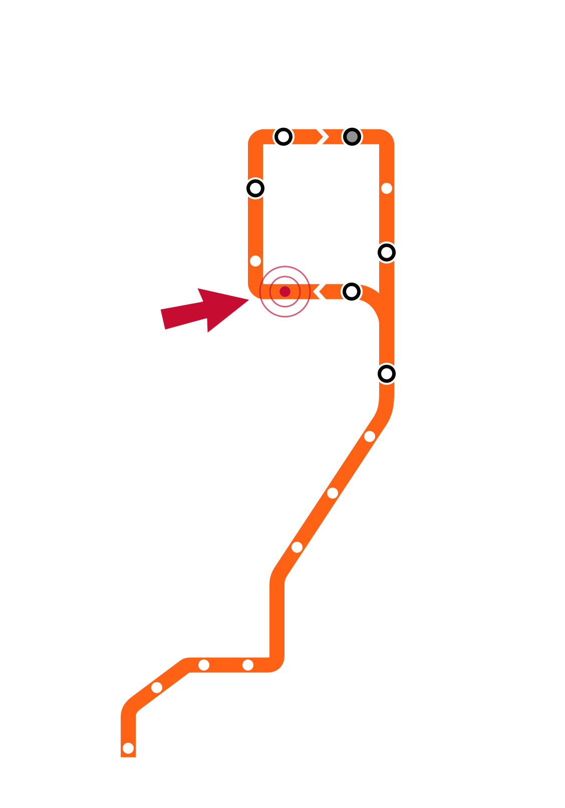

# Week 2 Slide Deck {.course-title}

## Statistics Review; Python, Dataframes, Polars; Obtaining Data

Jack Bandy
2026

---

# Week 2, Day 1 {.course-title .photo-title data-state="photo-title" background-image="../assets/orange-line-stops-better/stop02-lasalle-van-buren-a.jpg" background-size="cover"}

CS 418 · Week 2 · 🟠 LaSalle/Van Buren 🟠

---

# {.photo-only data-state="photo-only" background-image="../assets/orange-line-stops-better/stop02-lasalle-van-buren-a.jpg" background-size="cover"}

---

# Map {.split}

::: {.split-content .narrow-aside}

::: {}
- Week 2: LaSalle/Van Buren
- Day 1
    - Statistics Review
    - Python Foundations
    - Dataframes and Polars
:::

{.figure alt="Orange Line map with the LaSalle/Van Buren stop marked, the Week 2 stop"}

:::

---

# Statistics Review {.section-header}

# Statistics in Data Science

::: {.incremental}
- Statistics: the science of learning from data under uncertainty.
- It turns raw numbers into evidence we can actually trust.
- It tells us what a sample says about the whole population.
- It underpins every stage of the data science lifecycle.
:::

---

# Probability {.smaller}

- **Probability** is a measure of the **likelihood** of an event occurring.
- Probability is the language we use to quantify uncertainty in what the data tells us.

:::: {.columns}

::: {.column width="30%"}

$$P(E) = \frac{|E|}{|S|}$$

:::

::: {.column width="66%"}

<b style="color:#f9461c;">E</b> = the event 
<b style="color:#f9461c;">S</b> = sample space 
<b style="color:#f9461c;">|E|</b> = number of outcomes in event E 
<b style="color:#f9461c;">|S|</b> = total number of possible outcomes in S

:::

::::

- The probability of an event is always between <b>0 and 1</b>.

<i><b style="color:#f9461c;">Example:</b></i> A bag has 6 blue, 3 red, and 5 yellow marbles. 
What is the probability of drawing a blue or red marble on the first draw? 
 
<i><b>P(E) =</b></i>

---

# Key Terminology

::: {.dense}
- **Experiment** — a process or action with an uncertain result
- **Outcome** — a single possible result of an experiment
- **Event** — a set of one or more outcomes we care about
- **Sample space** — the set of all possible outcomes
- **Complementary events** — two events where one occurs if and only if the other does not
	- E.g. coin flip
:::
---

# Conditional Probability {.smaller}

- **Conditional probability** is the probability of an event **given that another event has already happened**.
- **P(A | B)** — "the probability of A given B."

:::: {.columns}

::: {.column width="30%"}

$$P(A \mid B) = \frac{P(A \cap B)}{P(B)}$$

:::

::: {.column width="62%"}

<b style="color:#f9461c;">P(A | B)</b>   =   probability of A given B 
<b style="color:#f9461c;">P(A ∩ B)</b> = probability of both A and B 
<b style="color:#f9461c;">P(B)</b> = probability of B (must be &gt; 0)

:::

::::

---

# Conditional Probability: An Example {.smaller}

**Example:** A deck contains 15 distinct cards labeled 1 through 15. Two cards are drawn at random without replacement.

:::: {.columns}

::: {.column width="48%"}
[SET UP]{.eyebrow}

::: {.fragment}
**A** = both cards odd &nbsp;&nbsp; **B** = sum is even
:::

::: {.fragment}
*Sum is even if both cards are odd, or both are even.*
:::

::: {.fragment}
**Odd numbers (8)** 
13579111315
:::

::: {.fragment}
**Even numbers (7)** 
2468101214
:::
:::

::: {.column width="52%"}
[SOLUTION]{.eyebrow}

::: {.fragment}
$$n(B) = \binom{8}{2} + \binom{7}{2} = 28 + 21 = 49$$
:::

::: {.fragment}
$$n(A \cap B) = \binom{8}{2} = 28$$
:::

::: {.fragment}
$$P(A \mid B) = \frac{n(A \cap B)}{n(B)} = \frac{28}{49} = \frac{4}{7}$$
:::

::: {.fragment}

ANSWER &nbsp;&nbsp; P(A | B) = 4/7

:::
:::

::::

---

# Bayes' Theorem

Conditional probabilities can be reversed using Bayes' theorem, which provides a systematic method for expressing one conditional probability in terms of another.

$$P(A \mid B) = \frac{P(B \mid A)\,P(A)}{P(B)}$$

$$P(B) = P(B \mid A)\,P(A) + P(B \mid A')\,P(A')$$

---

# A Coin, 14 Flips, and a Bet {.image-frame-slide}

::: {.caption}
This example is based on the scenario from Panos Ipeirotis, ["Are You a Bayesian or a Frequentist?"](https://www.behind-the-enemy-lines.com/2008/01/are-you-bayesian-or-frequentist-or.html) (2008).
:::

---

# Before Any Flips {.image-frame-slide}

::: {.caption}
This example is based on the scenario from Panos Ipeirotis, ["Are You a Bayesian or a Frequentist?"](https://www.behind-the-enemy-lines.com/2008/01/are-you-bayesian-or-frequentist-or.html) (2008).
:::

---

# One Flip: Heads {.image-frame-slide}

::: {.caption}
This example is based on the scenario from Panos Ipeirotis, ["Are You a Bayesian or a Frequentist?"](https://www.behind-the-enemy-lines.com/2008/01/are-you-bayesian-or-frequentist-or.html) (2008).
:::

---

# Two Flips: Heads, Heads {.image-frame-slide}

::: {.caption}
This example is based on the scenario from Panos Ipeirotis, ["Are You a Bayesian or a Frequentist?"](https://www.behind-the-enemy-lines.com/2008/01/are-you-bayesian-or-frequentist-or.html) (2008).
:::

---

# Three Flips: The First Tails {.image-frame-slide}

::: {.caption}
This example is based on the scenario from Panos Ipeirotis, ["Are You a Bayesian or a Frequentist?"](https://www.behind-the-enemy-lines.com/2008/01/are-you-bayesian-or-frequentist-or.html) (2008).
:::

---

# All 14 Flips: 10 Heads, 4 Tails {.image-frame-slide}

::: {.caption}
This example is based on the scenario from Panos Ipeirotis, ["Are You a Bayesian or a Frequentist?"](https://www.behind-the-enemy-lines.com/2008/01/are-you-bayesian-or-frequentist-or.html) (2008).
:::

---

# Coin Flip Odds

::: {.caption}
Example from Panos Ipeirotis, ["Are You a Bayesian or a Frequentist?"](https://www.behind-the-enemy-lines.com/2008/01/are-you-bayesian-or-frequentist-or.html) (2008).
:::

::::: {.columns}

:::: {.column width="56%"}
::: {.incremental}
- **14 flips, 10 heads.**
- Will the next two both be heads?
- [FREQUENTIST]{style="color:#001E62; font-weight:bold; letter-spacing:2px;"} — **51%**
- [BAYESIAN]{style="color:#f9461c; font-weight:bold; letter-spacing:2px;"} — **48.5%**
- **Same data, opposite sides of the bet?!**
:::
::::

:::: {.column width="40%"}

::: {.caption}
ICMA Photos, [*Coin Toss*](https://commons.wikimedia.org/wiki/File:Coin_Toss_(3635981474).jpg), [CC BY-SA 2.0](https://creativecommons.org/licenses/by-sa/2.0/).
:::
::::

:::::

---

# How Frequentists Get to 51% {.smaller}

::::: {.columns}

:::: {.column width="56%"}
::: {.fragment}
*p* is a **fixed, unknown constant** — estimate it from what we observed.
:::

::: {.fragment}
$$\hat{p} = \frac{h}{n} = \frac{10}{14} \approx 0.714$$
:::

::: {.fragment}
Given *p*, the two remaining flips are **independent** — so square the estimate.
:::

::: {.fragment}
$$P(\text{two heads}) = \hat{p}^{\,2} = \left(\frac{10}{14}\right)^{2} \approx 0.51$$
:::
::::

:::: {.column width="40%"}

::::

:::::

---

# How Bayesians Get to 48.5% {.smaller}

::::: {.columns}

:::: {.column width="56%"}
::: {.fragment}
*p* is a **distribution**. Start with a uniform prior, $\text{Beta}(1,1)$ — every value of *p* equally plausible.
:::

::: {.fragment}
10 heads and 4 tails update it to the posterior $\text{Beta}(11,5)$, whose mean is
$$E[p] = \frac{h + 1}{n + 2} = \frac{11}{16} = 0.6875$$
:::

::: {.fragment}
Bayesians don't just square it! The first flip is **evidence about *p*** that revises the belief used for the second.
:::

::: {.fragment}
Average $p^2$ across the whole posterior (plausible values):
$$P(\text{two heads}) = E[p^{2}] = \frac{11}{16}\cdot\frac{12}{17} \approx 0.485$$
:::
::::

:::: {.column width="40%"}

::::

:::::

---

# "Just Do the Math"

::: {.incremental}
- **Frequentist**: probability = long-run frequency; judge procedures by error rates
- **Bayesian**: probability = degree of belief, updated as evidence arrives
- Efron (1986) asked "Why Isn't Everyone a Bayesian?" — an active contest at the time
- McElreath (2020): the debate has largely been **subsumed by causal inference**
- Even so: you still have to choose prior belief(s)
- One of many examples in data science where there is not always a single correct option
:::

# Python Foundations {.section-header}

---

# Python Foundations

::: {style="border:3px dashed #f9461c; border-radius:12px; padding:0.8em 1em; margin-top:0.4em;"}
[TODO]{.eyebrow .todo}

::: {.dense}
- **TK**
:::
:::

---

# Dataframes and Polars {.section-header}

---

# Dataframes and Polars

::: {style="border:3px dashed #f9461c; border-radius:12px; padding:0.8em 1em; margin-top:0.4em;"}
[TODO]{.eyebrow .todo}

::: {.dense}
- **TK**
:::
:::

---

# Week 2, Day 2 {.course-title .photo-title data-state="photo-title photo-title-zoom" background-image="../assets/orange-line-stops-better/stop02-lasalle-van-buren-a.jpg" background-size="cover"}

<h2>Obtaining Data</h2>

Jack Bandy
2026

---

# Map {.split}

::: {.split-content .narrow-aside}

::: {}
- Week 2: LaSalle/Van Buren
- Day 2
    - Obtaining Data
:::

{.figure alt="Orange Line map with the LaSalle/Van Buren stop marked, the Week 2 stop"}

:::

---

# Obtaining Data {.section-header}

---

# Obtaining Data

::: {style="border:3px dashed #f9461c; border-radius:12px; padding:0.8em 1em; margin-top:0.4em;"}
[TODO]{.eyebrow .todo}

::: {.dense}
- **TK**
:::
:::

---

# Sources {.sources}

1. GitHub source: <https://github.com/jackbandy/data-science-fun/blob/main/docs/slides/week2.qmd>.
2. Slides developed using materials from [Elena Zheleva](https://www.cs.uic.edu/~elena/) and [Gonzalo Bello Lander](https://cs.uic.edu/profiles/gonzalo-bello/), the Berkeley DS 100 team, Marine Carpuat, and Brian Ziebart.
3. Slide deck built with [Quarto](https://quarto.org/) revealjs.
4. Title font is Big Shoulders; Body font is [Libre Franklin](https://en.wikipedia.org/wiki/Franklin_Gothic#Libre_Franklin).
5. [Elda Shatro](https://github.com/eldashatro4) contributed to the Statistics Review slides.
6. The frequentist/Bayesian coin bet draws on [Chapter 1: Working Toward Wisdom](../ethics-in-data-science/book/01-working-toward-wisdom.html); the coin-bet example is from [Panos Ipeirotis (2008)](https://www.behind-the-enemy-lines.com/2008/01/are-you-bayesian-or-frequentist-or.html).
7. Richard McElreath, *[Statistical Rethinking: A Bayesian Course with Examples in R and Stan](https://xcelab.net/rm/statistical-rethinking/)*, 2nd ed., Chapman and Hall/CRC, 2020.
8. Coin toss photo by ICMA Photos, [*Coin Toss*](https://commons.wikimedia.org/wiki/File:Coin_Toss_(3635981474).jpg), [CC BY-SA 2.0](https://creativecommons.org/licenses/by-sa/2.0/).
9. Bradley Efron, ["Why Isn't Everyone a Bayesian?"](https://doi.org/10.1080/00031305.1986.10475342), *The American Statistician* 40(1), 1986, pp. 1–5.
