# Week 3 Slide Deck {.course-title}

<h2>Wrangling, Aggregation; Formats</h2>

Jack Bandy
2026


# Week 3, Day 2 {.course-title .photo-title data-state="photo-title" background-image="../assets/orange-line-stops-better/stop03-quincy-c.jpg" background-size="cover"}

<h2>Wrangling, Aggregation; Formats</h2>

CS 418 · Week 3 · 🟠 Quincy 🟠

---

## {.photo-only data-state="photo-only" background-image="../assets/orange-line-stops-better/stop03-quincy-c.jpg" background-size="cover"}

---

## Map {.split}

::: {.split-content .narrow-aside}

::: {}
- Week 3: Quincy
- Day 2 (Monday was Labor Day)
    - Data Wrangling
    - Granularity & Aggregation
    - Data Formats (time permitting)
    - Week 3 Quiz
:::

{.figure alt="Orange Line map with the Quincy stop marked, the Week 3 stop"}

:::


# Data Wrangling {.section-header}

---

## What to Check when Wrangling a New Dataset {.smaller}

::: {.caption}
Based on Data 100 course notes, [Data Cleaning and EDA](https://ds100.org/course-notes-su23/eda/eda.html)
:::

- **Structure**: how the data is encoded and laid out
- **Granularity**
- **Scope**
- **Temporality**: the period the data covers, and/or what its timestamps mean
- **Faithfulness**: does the data accurately capture the "real world?"
- (We'll look at all of these today)

---

## What is Data Wrangling? {.figure-aside .golden .smaller}

::: {.columns}
::: {.column}

*"the process of transforming raw, messy, unstructured data into coherent, structured data that can support intended applications and/or analyses"*

**How to wrangle?**

1. Discover and address quality issues
2. Reshape data into the structure your analysis needs
3. Add information to datasets (data augmentation)
4. Verify accuracy and consistency in the dataset

:::
::: {.column}

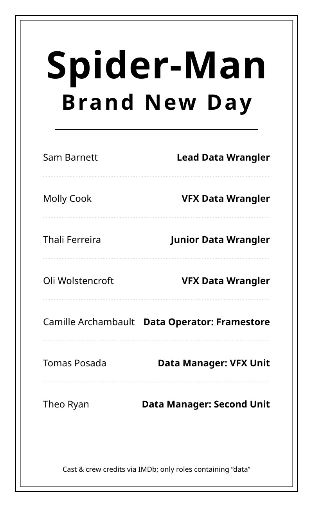

::: {.caption}
Crew on *Spider-Man: Brand New Day*, filtered to roles containing "data" ([full crew on IMDb](https://www.imdb.com/title/tt22084616/fullcredits/)).
:::

:::
:::

---

## Types of quality issues {.smaller}


::: {.caption}
Details in *Learning Data Science*, [§9.2 Quality Checks](https://learningds.org/ch/09/wrangling_checks.html) and [§9.3 Missing Values](https://learningds.org/ch/09/wrangling_missing.html)
:::

Common issues to discover and address:

:::: {.columns}

::: {.column width="55%"}

- **Missing values**: nulls, `NaN`, or disguised blanks like `"N/A"`, `-999`
- **Duplicates**: the same row or entity recorded more than once
- **Inconsistent formatting**: `"IL"` vs `"Illinois"`, `mm/dd/yyyy` vs `yyyy/dd/mm`
- **Wrong data types**: numbers or dates stored as strings
- **Structure issues**: mixed units, e.g. miles vs km
- **Invalid values**: impossible entries such as age = 350
:::

::: {.column width="45%"}

<p class="code-caption" style="margin-bottom:0.4em;">Raw data might look like this:</p>

<table style="border-collapse:collapse; margin:0.2em auto 0; font-size:0.62em;">
<tr>
<td style="border:2px solid #f9461c; background:#f9461c; color:#fff; font-weight:bold; padding:6px 16px; text-align:center;">id</td>
<td style="border:2px solid #f9461c; background:#f9461c; color:#fff; font-weight:bold; padding:6px 16px; text-align:center;">age</td>
<td style="border:2px solid #f9461c; background:#f9461c; color:#fff; font-weight:bold; padding:6px 16px; text-align:center;">city</td>
</tr>
<tr>
<td style="border:2px solid #f9461c; padding:6px 16px; text-align:center;">1</td>
<td style="border:2px solid #f9461c; padding:6px 16px; text-align:center;">34</td>
<td style="border:2px solid #f9461c; padding:6px 16px; text-align:center;">Chicago</td>
</tr>
<tr>
<td style="border:2px solid #f9461c; padding:6px 16px; text-align:center;">2</td>
<td style="border:2px solid #f9461c; background:#fbe0d8; color:#c0392b; font-weight:bold; font-family:monospace; padding:6px 16px; text-align:center;">NaN</td>
<td style="border:2px solid #f9461c; padding:6px 16px; text-align:center;">Naperville</td>
</tr>
<tr>
<td style="border:2px solid #f9461c; padding:6px 16px; text-align:center;">2</td>
<td style="border:2px solid #f9461c; background:#fbe0d8; color:#c0392b; font-weight:bold; font-family:monospace; padding:6px 16px; text-align:center;">NaN</td>
<td style="border:2px solid #f9461c; padding:6px 16px; text-align:center;">Naperville</td>
</tr>
<tr>
<td style="border:2px solid #f9461c; padding:6px 16px; text-align:center;">3</td>
<td style="border:2px solid #f9461c; background:#fbe0d8; color:#c0392b; font-weight:bold; font-family:monospace; padding:6px 16px; text-align:center;">350</td>
<td style="border:2px solid #f9461c; background:#fbe0d8; color:#c0392b; font-weight:bold; font-family:monospace; padding:6px 16px; text-align:center;">N/A</td>
</tr>
</table>

:::

::::


---

## Vocabulary for reshaping data {.smaller}

Rearrange rows and columns for analysis needs.

:::: {.columns}

::: {.column width="55%"}

- **"Tidy" data** — one row per observation, one column per variable
- **Wide → long** — collapse many columns into key/value pairs with `df.unpivot()`
- **Long → wide** — spread one column back out into many with `df.pivot()`
- **Combine tables** — stack rows/dataframes with `pl.concat()`
    - merge/match rows on keys with `df.join()`
- **Rename and reorder** — clean up column names with `df.rename()`, put the rows in order with `df.sort()`
:::

::: {.column width="45%"}

<p style="margin:0 0 0.3em; text-align:center; font-size:0.62em; font-weight:700; color:#333;">Wide format</p>

<table style="border-collapse:collapse; margin:0 auto; font-size:0.62em;">
<tr>
<td style="border:2px solid #f9461c; background:#f9461c; color:#fff; font-weight:bold; padding:5px 18px; text-align:center;">id</td>
<td style="border:2px solid #f9461c; background:#f9461c; color:#fff; font-weight:bold; padding:5px 18px; text-align:center;">2023</td>
<td style="border:2px solid #f9461c; background:#f9461c; color:#fff; font-weight:bold; padding:5px 18px; text-align:center;">2024</td>
</tr>
<tr>
<td style="border:2px solid #f9461c; padding:5px 18px; text-align:center;">1</td>
<td style="border:2px solid #f9461c; padding:5px 18px; text-align:center;">30</td>
<td style="border:2px solid #f9461c; padding:5px 18px; text-align:center;">34</td>
</tr>
<tr>
<td style="border:2px solid #f9461c; padding:5px 18px; text-align:center;">2</td>
<td style="border:2px solid #f9461c; padding:5px 18px; text-align:center;">41</td>
<td style="border:2px solid #f9461c; padding:5px 18px; text-align:center;">45</td>
</tr>
</table>

<p style="margin:0.9em 0 0.3em; text-align:center; font-size:0.62em; font-weight:700; color:#333;">Long format</p>

<table style="border-collapse:collapse; margin:0 auto; font-size:0.62em;">
<tr>
<td style="border:2px solid #f9461c; background:#f9461c; color:#fff; font-weight:bold; padding:5px 18px; text-align:center;">id</td>
<td style="border:2px solid #f9461c; background:#f9461c; color:#fff; font-weight:bold; padding:5px 18px; text-align:center;">year</td>
<td style="border:2px solid #f9461c; background:#f9461c; color:#fff; font-weight:bold; padding:5px 18px; text-align:center;">value</td>
</tr>
<tr>
<td style="border:2px solid #f9461c; padding:5px 18px; text-align:center;">1</td>
<td style="border:2px solid #f9461c; padding:5px 18px; text-align:center;">2023</td>
<td style="border:2px solid #f9461c; padding:5px 18px; text-align:center;">30</td>
</tr>
<tr>
<td style="border:2px solid #f9461c; padding:5px 18px; text-align:center;">1</td>
<td style="border:2px solid #f9461c; padding:5px 18px; text-align:center;">2024</td>
<td style="border:2px solid #f9461c; padding:5px 18px; text-align:center;">34</td>
</tr>
<tr>
<td style="border:2px solid #f9461c; padding:5px 18px; text-align:center;">2</td>
<td style="border:2px solid #f9461c; padding:5px 18px; text-align:center;">2023</td>
<td style="border:2px solid #f9461c; padding:5px 18px; text-align:center;">41</td>
</tr>
<tr>
<td style="border:2px solid #f9461c; padding:5px 18px; text-align:center;">2</td>
<td style="border:2px solid #f9461c; padding:5px 18px; text-align:center;">2024</td>
<td style="border:2px solid #f9461c; padding:5px 18px; text-align:center;">45</td>
</tr>
</table>
:::

::::

Polars: `df.unpivot()`, `df.pivot()`, `pl.concat()`, and `df.join()`.

---

## Adding information (?) to existing datasets {.smaller}

We can "add information" to a dataset through **data augmentation**.

:::: {.columns}

::: {.column width="55%"}

- **Derived columns**: compute from what you already have, e.g. speed from miles and hours (`df.with_columns()`)
- **Binning**: classify numeric data into categories based on the ranges you specify (`pl.col().cut()`)
- **External joins**: attach weather, census, or geographic data on a shared key (`df.join()`)
- **Group features**: include a group's summary statistic onto each of its rows (`pl.col().mean().over()`)
- **Encoding**: convert text variables into numerical columns of 0s and 1s for modeling (`df.to_dummies()`)
:::

::: {.column width="45%"}

<p style="margin:0 0 0.3em; text-align:center; font-size:0.62em; font-weight:700; color:#333;">Raw dataset</p>

<table style="border-collapse:collapse; margin:0 auto; font-size:0.6em;">
<tr>
<td style="border:2px solid #f9461c; background:#f9461c; color:#fff; font-weight:bold; padding:6px 14px; text-align:center;">trip</td>
<td style="border:2px solid #f9461c; background:#f9461c; color:#fff; font-weight:bold; padding:6px 14px; text-align:center;">driver</td>
<td style="border:2px solid #f9461c; background:#f9461c; color:#fff; font-weight:bold; padding:6px 14px; text-align:center;">city</td>
<td style="border:2px solid #f9461c; background:#f9461c; color:#fff; font-weight:bold; padding:6px 14px; text-align:center;">miles</td>
<td style="border:2px solid #f9461c; background:#f9461c; color:#fff; font-weight:bold; padding:6px 14px; text-align:center;">hours</td>
</tr>
<tr>
<td style="border:2px solid #f9461c; padding:6px 14px; text-align:center;">1</td>
<td style="border:2px solid #f9461c; padding:6px 14px; text-align:center;">Kevin</td>
<td style="border:2px solid #f9461c; padding:6px 14px; text-align:center;">Chicago</td>
<td style="border:2px solid #f9461c; padding:6px 14px; text-align:center;">12</td>
<td style="border:2px solid #f9461c; padding:6px 14px; text-align:center;">0.5</td>
</tr>
<tr>
<td style="border:2px solid #f9461c; padding:6px 14px; text-align:center;">2</td>
<td style="border:2px solid #f9461c; padding:6px 14px; text-align:center;">Kevin</td>
<td style="border:2px solid #f9461c; padding:6px 14px; text-align:center;">Naperville</td>
<td style="border:2px solid #f9461c; padding:6px 14px; text-align:center;">30</td>
<td style="border:2px solid #f9461c; padding:6px 14px; text-align:center;">0.6</td>
</tr>
<tr>
<td style="border:2px solid #f9461c; padding:6px 14px; text-align:center;">3</td>
<td style="border:2px solid #f9461c; padding:6px 14px; text-align:center;">Yuseph</td>
<td style="border:2px solid #f9461c; padding:6px 14px; text-align:center;">Chicago</td>
<td style="border:2px solid #f9461c; padding:6px 14px; text-align:center;">8</td>
<td style="border:2px solid #f9461c; padding:6px 14px; text-align:center;">0.4</td>
</tr>
<tr>
<td style="border:2px solid #f9461c; padding:6px 14px; text-align:center;">4</td>
<td style="border:2px solid #f9461c; padding:6px 14px; text-align:center;">Yuseph</td>
<td style="border:2px solid #f9461c; padding:6px 14px; text-align:center;">Naperville</td>
<td style="border:2px solid #f9461c; padding:6px 14px; text-align:center;">45</td>
<td style="border:2px solid #f9461c; padding:6px 14px; text-align:center;">0.9</td>
</tr>
</table>

<p style="margin:1.1em 0 0.3em; text-align:center; font-size:0.62em; font-weight:700; color:#333;">Population<span style="font-weight:400; font-family:monospace; font-size:0.9em; color:#666;"></span></p>

<table style="border-collapse:collapse; margin:0 auto; font-size:0.6em;">
<tr>
<td style="border:2px solid #f9461c; background:#f9461c; color:#fff; font-weight:bold; padding:5px 14px; text-align:center;">city</td>
<td style="border:2px solid #f9461c; background:#f9461c; color:#fff; font-weight:bold; padding:5px 14px; text-align:center;">population</td>
</tr>
<tr>
<td style="border:2px solid #f9461c; padding:5px 14px; text-align:center;">Chicago</td>
<td style="border:2px solid #f9461c; padding:5px 14px; text-align:center;">~2.73</td>
</tr>
<tr>
<td style="border:2px solid #f9461c; padding:5px 14px; text-align:center;">Naperville</td>
<td style="border:2px solid #f9461c; padding:5px 14px; text-align:center;">~0.15</td>
</tr>
</table>

<p class="code-caption" style="margin-top:0.6em;"></p>

:::

::::

---

## Example

<table style="border-collapse:collapse; margin:0.6em auto 0; font-size:0.5em;">
<tr>
<td colspan="4"></td>
<td style="padding:2px 6px; text-align:center; font-family:monospace; font-size:0.9em; color:#7a7a7a;" class="fragment" data-fragment-index="1">with_columns()</td>
<td style="padding:2px 6px; text-align:center; font-family:monospace; font-size:0.9em; color:#7a7a7a;" class="fragment" data-fragment-index="2">.cut()</td>
<td style="padding:2px 6px; text-align:center; font-family:monospace; font-size:0.9em; color:#7a7a7a;" class="fragment" data-fragment-index="3">.join()</td>
<td style="padding:2px 6px; text-align:center; font-family:monospace; font-size:0.9em; color:#7a7a7a;" class="fragment" data-fragment-index="4">.over()</td>
<td style="padding:2px 6px; text-align:center; font-family:monospace; font-size:0.9em; color:#7a7a7a;" class="fragment" data-fragment-index="5">to_dummies()</td>
</tr>
<tr>
<td style="border:2px solid #f9461c; background:#f9461c; color:#fff; font-weight:bold; padding:4px 9px; text-align:center;">trip</td>
<td style="border:2px solid #f9461c; background:#f9461c; color:#fff; font-weight:bold; padding:4px 9px; text-align:center;">driver</td>
<td style="border:2px solid #f9461c; background:#f9461c; color:#fff; font-weight:bold; padding:4px 9px; text-align:center;">miles</td>
<td style="border:2px solid #f9461c; background:#f9461c; color:#fff; font-weight:bold; padding:4px 9px; text-align:center;">hours</td>
<td style="border:2px solid #f9461c; background:#f9461c; color:#fff; font-weight:bold; padding:4px 9px; text-align:center;" class="fragment" data-fragment-index="1">mph</td>
<td style="border:2px solid #f9461c; background:#f9461c; color:#fff; font-weight:bold; padding:4px 9px; text-align:center;" class="fragment" data-fragment-index="2">distance</td>
<td style="border:2px solid #f9461c; background:#f9461c; color:#fff; font-weight:bold; padding:4px 9px; text-align:center;" class="fragment" data-fragment-index="3">population</td>
<td style="border:2px solid #f9461c; background:#f9461c; color:#fff; font-weight:bold; padding:4px 9px; text-align:center;" class="fragment" data-fragment-index="4">driver_avg</td>
<td style="border:2px solid #f9461c; background:#f9461c; color:#fff; font-weight:bold; padding:4px 9px; text-align:center;" class="fragment" data-fragment-index="5">Naperville</td>
</tr>
<tr>
<td style="border:2px solid #f9461c; padding:4px 9px; text-align:center;">1</td>
<td style="border:2px solid #f9461c; padding:4px 9px; text-align:center;">Kevin</td>
<td style="border:2px solid #f9461c; padding:4px 9px; text-align:center;">12</td>
<td style="border:2px solid #f9461c; padding:4px 9px; text-align:center;">0.5</td>
<td style="border:2px solid #f9461c; background:#fdf2ee; padding:4px 9px; text-align:center;" class="fragment" data-fragment-index="1">24.0</td>
<td style="border:2px solid #f9461c; background:#fdf2ee; padding:4px 9px; text-align:center;" class="fragment" data-fragment-index="2">short</td>
<td style="border:2px solid #f9461c; background:#fdf2ee; padding:4px 9px; text-align:center;" class="fragment" data-fragment-index="3">2.70</td>
<td style="border:2px solid #f9461c; background:#fdf2ee; padding:4px 9px; text-align:center;" class="fragment" data-fragment-index="4">16.3</td>
<td style="border:2px solid #f9461c; background:#fdf2ee; padding:4px 9px; text-align:center;" class="fragment" data-fragment-index="5">0</td>
</tr>
<tr>
<td style="border:2px solid #f9461c; padding:4px 9px; text-align:center;">2</td>
<td style="border:2px solid #f9461c; padding:4px 9px; text-align:center;">Kevin</td>
<td style="border:2px solid #f9461c; padding:4px 9px; text-align:center;">31</td>
<td style="border:2px solid #f9461c; padding:4px 9px; text-align:center;">0.7</td>
<td style="border:2px solid #f9461c; background:#fdf2ee; padding:4px 9px; text-align:center;" class="fragment" data-fragment-index="1">44.3</td>
<td style="border:2px solid #f9461c; background:#fdf2ee; padding:4px 9px; text-align:center;" class="fragment" data-fragment-index="2">long</td>
<td style="border:2px solid #f9461c; background:#fdf2ee; padding:4px 9px; text-align:center;" class="fragment" data-fragment-index="3">0.15</td>
<td style="border:2px solid #f9461c; background:#fdf2ee; padding:4px 9px; text-align:center;" class="fragment" data-fragment-index="4">16.3</td>
<td style="border:2px solid #f9461c; background:#fdf2ee; padding:4px 9px; text-align:center;" class="fragment" data-fragment-index="5">1</td>
</tr>
<tr>
<td style="border:2px solid #f9461c; padding:4px 9px; text-align:center;">3</td>
<td style="border:2px solid #f9461c; padding:4px 9px; text-align:center;">Yuseph</td>
<td style="border:2px solid #f9461c; padding:4px 9px; text-align:center;">8</td>
<td style="border:2px solid #f9461c; padding:4px 9px; text-align:center;">0.4</td>
<td style="border:2px solid #f9461c; background:#fdf2ee; padding:4px 9px; text-align:center;" class="fragment" data-fragment-index="1">20.0</td>
<td style="border:2px solid #f9461c; background:#fdf2ee; padding:4px 9px; text-align:center;" class="fragment" data-fragment-index="2">short</td>
<td style="border:2px solid #f9461c; background:#fdf2ee; padding:4px 9px; text-align:center;" class="fragment" data-fragment-index="3">2.70</td>
<td style="border:2px solid #f9461c; background:#fdf2ee; padding:4px 9px; text-align:center;" class="fragment" data-fragment-index="4">26.5</td>
<td style="border:2px solid #f9461c; background:#fdf2ee; padding:4px 9px; text-align:center;" class="fragment" data-fragment-index="5">0</td>
</tr>
<tr>
<td style="border:2px solid #f9461c; padding:4px 9px; text-align:center;">4</td>
<td style="border:2px solid #f9461c; padding:4px 9px; text-align:center;">Yuseph</td>
<td style="border:2px solid #f9461c; padding:4px 9px; text-align:center;">45</td>
<td style="border:2px solid #f9461c; padding:4px 9px; text-align:center;">0.9</td>
<td style="border:2px solid #f9461c; background:#fdf2ee; padding:4px 9px; text-align:center;" class="fragment" data-fragment-index="1">50.0</td>
<td style="border:2px solid #f9461c; background:#fdf2ee; padding:4px 9px; text-align:center;" class="fragment" data-fragment-index="2">long</td>
<td style="border:2px solid #f9461c; background:#fdf2ee; padding:4px 9px; text-align:center;" class="fragment" data-fragment-index="3">0.15</td>
<td style="border:2px solid #f9461c; background:#fdf2ee; padding:4px 9px; text-align:center;" class="fragment" data-fragment-index="4">26.5</td>
<td style="border:2px solid #f9461c; background:#fdf2ee; padding:4px 9px; text-align:center;" class="fragment" data-fragment-index="5">1</td>
</tr>
<tr>
<td style="border:2px solid #f9461c; padding:4px 9px; text-align:center;">5</td>
<td style="border:2px solid #f9461c; padding:4px 9px; text-align:center;">Kevin</td>
<td style="border:2px solid #f9461c; padding:4px 9px; text-align:center;">6</td>
<td style="border:2px solid #f9461c; padding:4px 9px; text-align:center;">0.3</td>
<td style="border:2px solid #f9461c; background:#fdf2ee; padding:4px 9px; text-align:center;" class="fragment" data-fragment-index="1">20.0</td>
<td style="border:2px solid #f9461c; background:#fdf2ee; padding:4px 9px; text-align:center;" class="fragment" data-fragment-index="2">short</td>
<td style="border:2px solid #f9461c; background:#fdf2ee; padding:4px 9px; text-align:center;" class="fragment" data-fragment-index="3">2.70</td>
<td style="border:2px solid #f9461c; background:#fdf2ee; padding:4px 9px; text-align:center;" class="fragment" data-fragment-index="4">16.3</td>
<td style="border:2px solid #f9461c; background:#fdf2ee; padding:4px 9px; text-align:center;" class="fragment" data-fragment-index="5">0</td>
</tr>
</table>

When and why *data augmentation*?

- Create more intuitive variables
- Improve machine learning models
- Reduce overfitting
- Adjust for imbalanced datasets

---

## Vocabulary for accuracy and consistency in the dataset {.smaller}

::: {.caption}
Based on *Learning Data Science*, [§9.2 Quality Checks](https://learningds.org/ch/09/wrangling_checks.html)
:::

Common checks:

- **Range and format checks**: is this value even possible, and did it parse as the type you expected?
- **Consistency checks**: does the same thing always get stored the same way?
- **Cross-field logic**: do columns that must agree with each other actually agree?
- **Statistical analysis**: do the summary numbers look like the world you expect?

Example on next slide...

---

## Verify: Statistical Analysis {.smaller}

Reminder: `describe()` puts nine summary numbers next to every column at once.

```python
entries.select("station_id", "rides").describe()
```

<table style="border-collapse:collapse; margin:0.5em auto 0; font-size:0.55em;">
<tr>
<td style="border:2px solid #f9461c; background:#f9461c; color:#fff; font-weight:bold; padding:6px 14px; text-align:center;">statistic</td>
<td style="border:2px solid #f9461c; background:#f9461c; color:#fff; font-weight:bold; padding:6px 14px; text-align:center;">station_id</td>
<td style="border:2px solid #f9461c; background:#f9461c; color:#fff; font-weight:bold; padding:6px 14px; text-align:center;">rides</td>
</tr>
<tr>
<td style="border:2px solid #f9461c; padding:6px 14px; text-align:center;">count</td>
<td style="border:2px solid #f9461c; padding:6px 14px; text-align:center;">1,315,823</td>
<td style="border:2px solid #f9461c; padding:6px 14px; text-align:center;">1,315,823</td>
</tr>
<tr>
<td style="border:2px solid #f9461c; padding:6px 14px; text-align:center;">null_count</td>
<td style="border:2px solid #f9461c; padding:6px 14px; text-align:center;">0</td>
<td style="border:2px solid #f9461c; padding:6px 14px; text-align:center;">0</td>
</tr>
<tr>
<td style="border:2px solid #f9461c; padding:6px 14px; text-align:center;">mean</td>
<td style="border:2px solid #f9461c; padding:6px 14px; text-align:center;">40769.49</td>
<td style="border:2px solid #f9461c; padding:6px 14px; text-align:center;">2928.65</td>
</tr>
<tr>
<td style="border:2px solid #f9461c; padding:6px 14px; text-align:center;">std</td>
<td style="border:2px solid #f9461c; padding:6px 14px; text-align:center;">450.96</td>
<td style="border:2px solid #f9461c; padding:6px 14px; text-align:center;">3017.80</td>
</tr>
<tr>
<td style="border:2px solid #f9461c; padding:6px 14px; text-align:center;">min</td>
<td style="border:2px solid #f9461c; padding:6px 14px; text-align:center;">40010</td>
<td style="border:2px solid #f9461c; padding:6px 14px; text-align:center;">0</td>
</tr>
<tr>
<td style="border:2px solid #f9461c; padding:6px 14px; text-align:center;">25%</td>
<td style="border:2px solid #f9461c; padding:6px 14px; text-align:center;">40370</td>
<td style="border:2px solid #f9461c; padding:6px 14px; text-align:center;">912</td>
</tr>
<tr>
<td style="border:2px solid #f9461c; padding:6px 14px; text-align:center;">50%</td>
<td style="border:2px solid #f9461c; padding:6px 14px; text-align:center;">40760</td>
<td style="border:2px solid #f9461c; padding:6px 14px; text-align:center;">1,904</td>
</tr>
<tr>
<td style="border:2px solid #f9461c; padding:6px 14px; text-align:center;">75%</td>
<td style="border:2px solid #f9461c; padding:6px 14px; text-align:center;">41160</td>
<td style="border:2px solid #f9461c; padding:6px 14px; text-align:center;">3,849</td>
</tr>
<tr>
<td style="border:2px solid #f9461c; padding:6px 14px; text-align:center;">max</td>
<td style="border:2px solid #f9461c; padding:6px 14px; text-align:center;">41710</td>
<td style="border:2px solid #f9461c; padding:6px 14px; text-align:center;">36,323</td>
</tr>
</table>

<p class="code-caption">1.3 million rows of CTA station entries (January 2001 through March 2026). Anything look off?</p>

---

## Verify: Three Things Worth a Second Look {.smaller}

:::: {.columns}

::: {.column width="45%"}
<table style="border-collapse:collapse; margin:0.5em auto 0; font-size:0.55em;">
<tr>
<td style="border:2px solid #f9461c; background:#f9461c; color:#fff; font-weight:bold; padding:6px 14px; text-align:center;">statistic</td>
<td style="border:2px solid #f9461c; background:#f9461c; color:#fff; font-weight:bold; padding:6px 14px; text-align:center;">station_id</td>
<td style="border:2px solid #f9461c; background:#f9461c; color:#fff; font-weight:bold; padding:6px 14px; text-align:center;">rides</td>
</tr>
<tr>
<td style="border:2px solid #f9461c; padding:6px 14px; text-align:center;">count</td>
<td style="border:2px solid #f9461c; padding:6px 14px; text-align:center;">1,315,823</td>
<td style="border:2px solid #f9461c; padding:6px 14px; text-align:center;">1,315,823</td>
</tr>
<tr>
<td style="border:2px solid #f9461c; padding:6px 14px; text-align:center;">null_count</td>
<td style="border:2px solid #f9461c; padding:6px 14px; text-align:center;">0</td>
<td style="border:2px solid #f9461c; padding:6px 14px; text-align:center;">0</td>
</tr>
<tr>
<td style="border:2px solid #f9461c; padding:6px 14px; text-align:center;">mean</td>
<td style="border:2px solid #f9461c; background:#fbe0d8; color:#c0392b; font-weight:bold; font-family:monospace; padding:6px 14px; text-align:center;">40769.49</td>
<td style="border:2px solid #f9461c; padding:6px 14px; text-align:center;">2928.65</td>
</tr>
<tr>
<td style="border:2px solid #f9461c; padding:6px 14px; text-align:center;">std</td>
<td style="border:2px solid #f9461c; padding:6px 14px; text-align:center;">450.96</td>
<td style="border:2px solid #f9461c; padding:6px 14px; text-align:center;">3017.80</td>
</tr>
<tr>
<td style="border:2px solid #f9461c; padding:6px 14px; text-align:center;">min</td>
<td style="border:2px solid #f9461c; padding:6px 14px; text-align:center;">40010</td>
<td style="border:2px solid #f9461c; background:#fbe0d8; color:#c0392b; font-weight:bold; font-family:monospace; padding:6px 14px; text-align:center;">0</td>
</tr>
<tr>
<td style="border:2px solid #f9461c; padding:6px 14px; text-align:center;">25%</td>
<td style="border:2px solid #f9461c; padding:6px 14px; text-align:center;">40370</td>
<td style="border:2px solid #f9461c; padding:6px 14px; text-align:center;">912</td>
</tr>
<tr>
<td style="border:2px solid #f9461c; padding:6px 14px; text-align:center;">50%</td>
<td style="border:2px solid #f9461c; padding:6px 14px; text-align:center;">40760</td>
<td style="border:2px solid #f9461c; padding:6px 14px; text-align:center;">1,904</td>
</tr>
<tr>
<td style="border:2px solid #f9461c; padding:6px 14px; text-align:center;">75%</td>
<td style="border:2px solid #f9461c; padding:6px 14px; text-align:center;">41160</td>
<td style="border:2px solid #f9461c; padding:6px 14px; text-align:center;">3,849</td>
</tr>
<tr>
<td style="border:2px solid #f9461c; padding:6px 14px; text-align:center;">max</td>
<td style="border:2px solid #f9461c; padding:6px 14px; text-align:center;">41710</td>
<td style="border:2px solid #f9461c; background:#fbe0d8; color:#c0392b; font-weight:bold; font-family:monospace; padding:6px 14px; text-align:center;">36,323</td>
</tr>
</table>
:::

::: {.column width="55%"}

- **The mean station id is 40,769.** 🤔
- **`rides` has at least one 0.** 🤨
- **The median is 1,904; the max is 36,323** 😾

::: {.fragment}
```python
entries.sort("rides", descending=True).head(1)
# Belmont-North Main, Sunday 2015-06-28, 36,323
```

<p class="code-caption">What happened at Belmont that Sunday?</p>
:::

:::

::::


# Granularity & Aggregation {.section-header}

---

## Granularity: What Does One Row Represent? {.image-frame-slide}

:::: {.r-stack}

::: {.fragment .fade-out fragment-index=1}
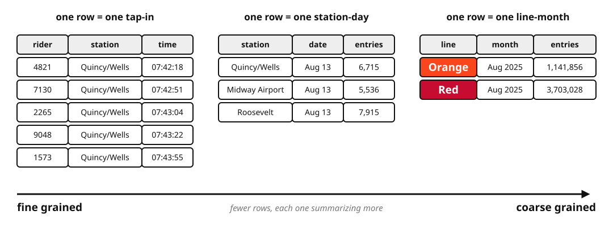
:::

::: {.fragment .fade-in-then-out fragment-index=1}
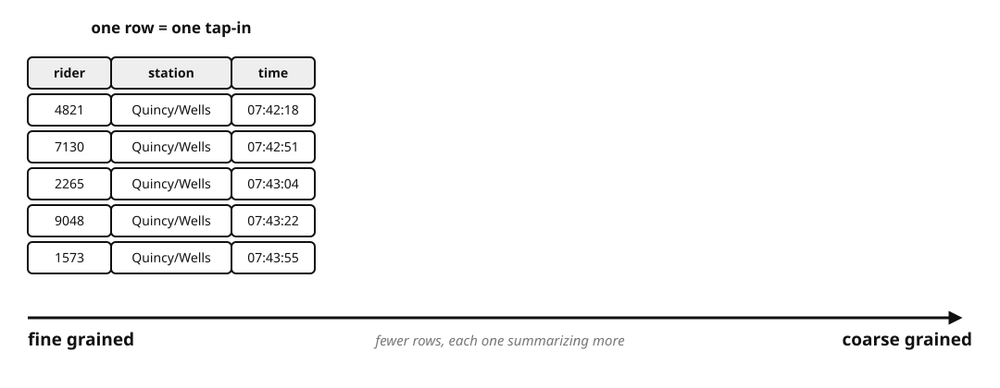
:::

::: {.fragment .fade-in-then-out fragment-index=2}
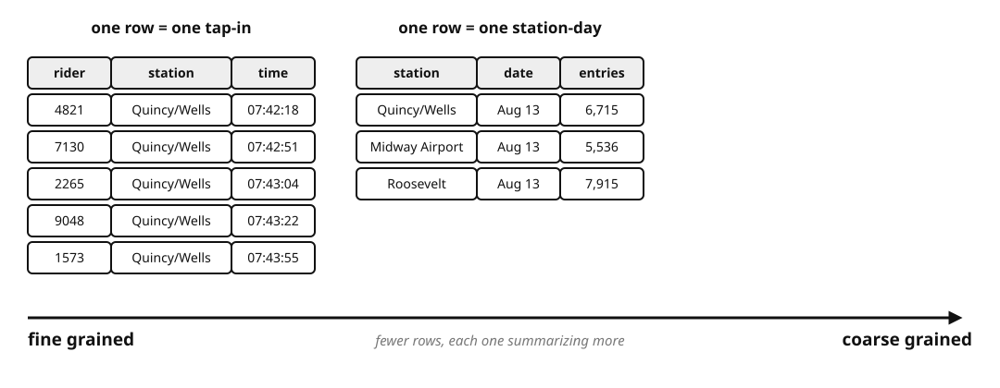
:::

::: {.fragment fragment-index=3}

:::

::::

::: {.caption}
Station-day and line-month counts computed from the [CTA 'L' station entries](https://data.cityofchicago.org/Transportation/CTA-Ridership-L-Station-Entries-Daily-Totals/5neh-572f) dataset, August 2025. The tap-in rows are illustrative — the CTA does not publish individual entries.
:::

---

## Vocab for Granularity {.smaller}

::: {.caption}
Based on Data 100 course notes, [Data Cleaning and EDA](https://ds100.org/course-notes-su23/eda/eda.html)
:::

**Granularity** is how fine or coarse each datum is.

- **What does each record represent?** e.g. one tap-in, one station-day, one line-month
- **Do all records sit at the same level?** Summary rows are sometimes mixed in among detail rows
- **What aggregations are possible?** Station → line, day → month, person → demographic group
- **Which hierarchies apply?** City/county/state, second/minute/hour/day
- **Do two files agree?** They have to sit at the same granularity before you can merge them


---

## Group By, Visualized (Manipulating Granularity) {.image-frame-slide}

**Split** the rows into groups, **apply** an aggregate function to each group, **combine** (merge) results into one table.

:::: {.r-stack}

::: {.fragment .fade-out fragment-index=1}
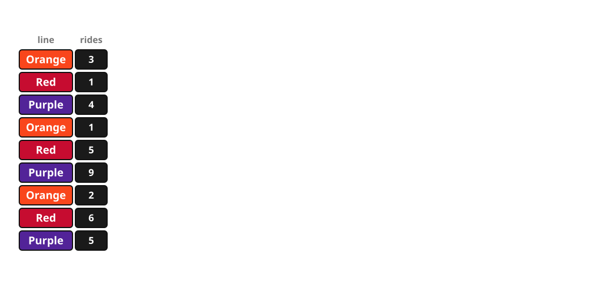
:::

::: {.fragment .fade-in-then-out fragment-index=1}
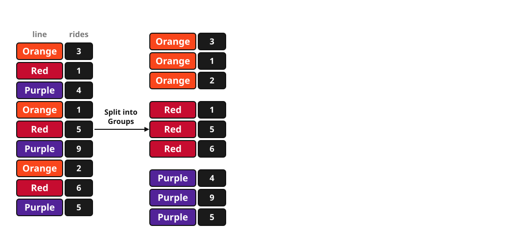
:::

::: {.fragment .fade-in-then-out fragment-index=2}
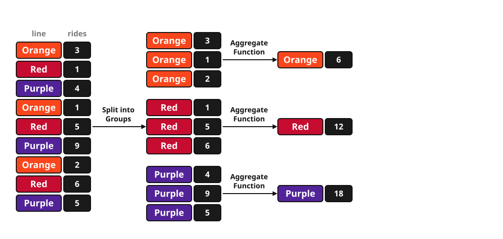
:::

::: {.fragment fragment-index=3}
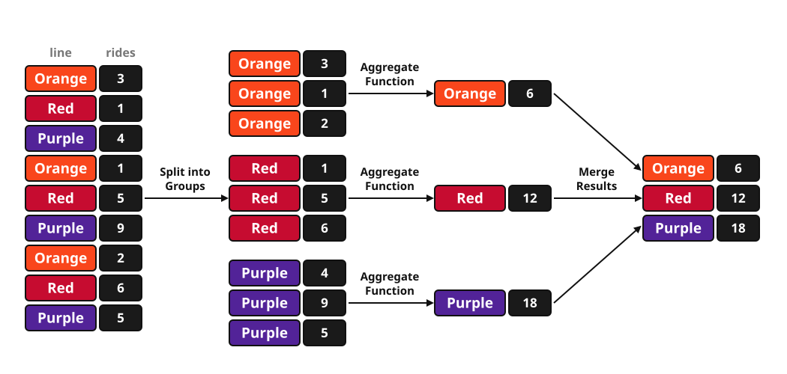
:::

::::

---

## Group By in Code {.smaller}

:::: {.columns}

::: {.column width="60%"}
```python
import polars as pl

rides = pl.DataFrame({
    "line":  ["Orange", "Red", "Purple",
              "Orange", "Red", "Purple",
              "Orange", "Red", "Purple"],
    "rides": [3, 1, 4, 1, 5, 9, 2, 6, 5],
})

# split, apply, and combine, all in one line
rides.group_by("line").agg(pl.col("rides").sum())
```

`group_by` hands each group to `agg`
:::

::: {.column width="40%"}

<p style="margin:0 0 0.3em; text-align:center; font-size:0.62em; font-weight:700; color:#333;">One row per group</p>

<table style="border-collapse:collapse; margin:0 auto; font-size:0.6em;">
<tr>
<td style="border:2px solid #f9461c; background:#f9461c; color:#fff; font-weight:bold; padding:6px 20px; text-align:center;">line</td>
<td style="border:2px solid #f9461c; background:#f9461c; color:#fff; font-weight:bold; padding:6px 20px; text-align:center;">rides</td>
</tr>
<tr>
<td style="border:2px solid #f9461c; padding:6px 20px; text-align:center;">Orange</td>
<td style="border:2px solid #f9461c; padding:6px 20px; text-align:center;">6</td>
</tr>
<tr>
<td style="border:2px solid #f9461c; padding:6px 20px; text-align:center;">Red</td>
<td style="border:2px solid #f9461c; padding:6px 20px; text-align:center;">12</td>
</tr>
<tr>
<td style="border:2px solid #f9461c; padding:6px 20px; text-align:center;">Purple</td>
<td style="border:2px solid #f9461c; padding:6px 20px; text-align:center;">18</td>
</tr>
</table>

:::

::::

---

## Predict the Output {.split .smaller}

::: {.split-content .golden-columns}

::: {}

Consider the following station-day records (`entries`) and the line of code below. Discuss with your elbow neighbor(s):

<table style="border-collapse:collapse; margin:0 auto 0.6em; font-size:0.62em;">
<tr>
<td style="border:2px solid #f9461c; background:#f9461c; color:#fff; font-weight:bold; padding:6px 14px; text-align:center;">station_id</td>
<td style="border:2px solid #f9461c; background:#f9461c; color:#fff; font-weight:bold; padding:6px 14px; text-align:center;">line</td>
<td style="border:2px solid #f9461c; background:#f9461c; color:#fff; font-weight:bold; padding:6px 14px; text-align:center;">rides</td>
</tr>
<tr>
<td style="border:2px solid #f9461c; padding:6px 14px; text-align:center;">40930</td>
<td style="border:2px solid #f9461c; padding:6px 14px; text-align:center;">Orange</td>
<td style="border:2px solid #f9461c; padding:6px 14px; text-align:center;">3</td>
</tr>
<tr>
<td style="border:2px solid #f9461c; padding:6px 14px; text-align:center;">40930</td>
<td style="border:2px solid #f9461c; padding:6px 14px; text-align:center;">Orange</td>
<td style="border:2px solid #f9461c; padding:6px 14px; text-align:center;">1</td>
</tr>
<tr>
<td style="border:2px solid #f9461c; padding:6px 14px; text-align:center;">40930</td>
<td style="border:2px solid #f9461c; padding:6px 14px; text-align:center;">Orange</td>
<td style="border:2px solid #f9461c; padding:6px 14px; text-align:center;">2</td>
</tr>
<tr>
<td style="border:2px solid #f9461c; padding:6px 14px; text-align:center;">40190</td>
<td style="border:2px solid #f9461c; padding:6px 14px; text-align:center;">Red</td>
<td style="border:2px solid #f9461c; padding:6px 14px; text-align:center;">5</td>
</tr>
<tr>
<td style="border:2px solid #f9461c; padding:6px 14px; text-align:center;">40190</td>
<td style="border:2px solid #f9461c; padding:6px 14px; text-align:center;">Red</td>
<td style="border:2px solid #f9461c; padding:6px 14px; text-align:center;">6</td>
</tr>
</table>

```python
entries.group_by("line").sum()
```

1. How many rows come back?
2. Which columns come back?
3. Other thoughts / questions?
:::

<iframe src="https://dodatascience.fun/timer/" title="CTA-style countdown timer" loading="lazy" style="width: 100%; height: 420px; display: block; border: 1px solid #999; box-shadow: 0 10px 28px rgba(0,0,0,0.12); border-radius: 3px;"></iframe>

:::

---

## Predict the Output: What Comes Back {.smaller}

:::: {.columns}

::: {.column width="42%"}

<p class="code-caption" style="margin-bottom:0.4em;">In</p>

<table style="border-collapse:collapse; margin:0 auto 0.6em; font-size:0.62em;">
<tr>
<td style="border:2px solid #f9461c; background:#f9461c; color:#fff; font-weight:bold; padding:6px 14px; text-align:center;">station_id</td>
<td style="border:2px solid #f9461c; background:#f9461c; color:#fff; font-weight:bold; padding:6px 14px; text-align:center;">line</td>
<td style="border:2px solid #f9461c; background:#f9461c; color:#fff; font-weight:bold; padding:6px 14px; text-align:center;">rides</td>
</tr>
<tr>
<td style="border:2px solid #f9461c; padding:6px 14px; text-align:center;">40930</td>
<td style="border:2px solid #f9461c; padding:6px 14px; text-align:center;">Orange</td>
<td style="border:2px solid #f9461c; padding:6px 14px; text-align:center;">3</td>
</tr>
<tr>
<td style="border:2px solid #f9461c; padding:6px 14px; text-align:center;">40930</td>
<td style="border:2px solid #f9461c; padding:6px 14px; text-align:center;">Orange</td>
<td style="border:2px solid #f9461c; padding:6px 14px; text-align:center;">1</td>
</tr>
<tr>
<td style="border:2px solid #f9461c; padding:6px 14px; text-align:center;">40930</td>
<td style="border:2px solid #f9461c; padding:6px 14px; text-align:center;">Orange</td>
<td style="border:2px solid #f9461c; padding:6px 14px; text-align:center;">2</td>
</tr>
<tr>
<td style="border:2px solid #f9461c; padding:6px 14px; text-align:center;">40190</td>
<td style="border:2px solid #f9461c; padding:6px 14px; text-align:center;">Red</td>
<td style="border:2px solid #f9461c; padding:6px 14px; text-align:center;">5</td>
</tr>
<tr>
<td style="border:2px solid #f9461c; padding:6px 14px; text-align:center;">40190</td>
<td style="border:2px solid #f9461c; padding:6px 14px; text-align:center;">Red</td>
<td style="border:2px solid #f9461c; padding:6px 14px; text-align:center;">6</td>
</tr>
</table>

```python
entries.group_by("line").sum()
```
:::

::: {.column width="58%"}

<p class="code-caption" style="margin-bottom:0.4em;">Out</p>

<table style="border-collapse:collapse; margin:0 auto 0.5em; font-size:0.62em;">
<tr>
<td style="border:2px solid #f9461c; background:#f9461c; color:#fff; font-weight:bold; padding:6px 14px; text-align:center;">line</td>
<td style="border:2px solid #f9461c; background:#f9461c; color:#fff; font-weight:bold; padding:6px 14px; text-align:center;">station_id</td>
<td style="border:2px solid #f9461c; background:#f9461c; color:#fff; font-weight:bold; padding:6px 14px; text-align:center;">rides</td>
</tr>
<tr>
<td style="border:2px solid #f9461c; padding:6px 14px; text-align:center;">Orange</td>
<td style="border:2px solid #f9461c; background:#fbe0d8; color:#c0392b; font-weight:bold; font-family:monospace; padding:6px 14px; text-align:center;">122790</td>
<td style="border:2px solid #f9461c; padding:6px 14px; text-align:center;">6</td>
</tr>
<tr>
<td style="border:2px solid #f9461c; padding:6px 14px; text-align:center;">Red</td>
<td style="border:2px solid #f9461c; background:#fbe0d8; color:#c0392b; font-weight:bold; font-family:monospace; padding:6px 14px; text-align:center;">80380</td>
<td style="border:2px solid #f9461c; padding:6px 14px; text-align:center;">11</td>
</tr>
</table>


Fix is to name the intended column:

```python
entries.group_by("line").agg(pl.col("rides").sum())
```
:::

::::


---

## Pivot: One Cell per Combination {.smaller}

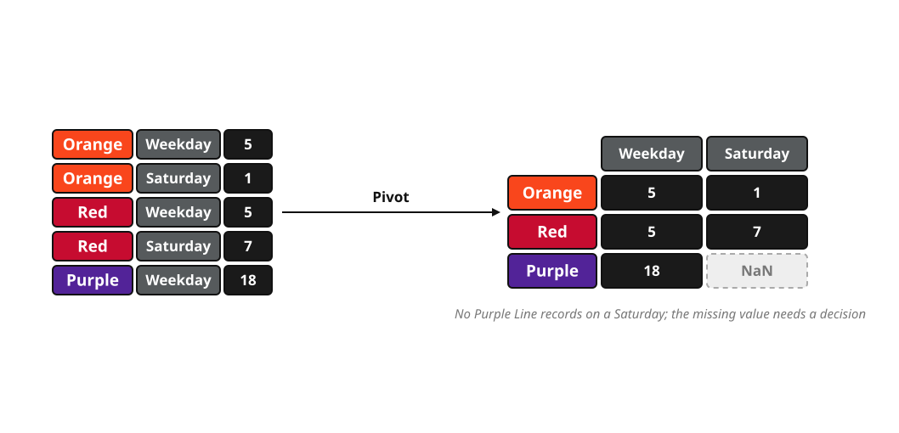

One key goes on the rows, the other on the columns.

```python
df.pivot(index="line", on="daytype", values="rides")
```

---

## Pivot as Manipulating Granularity {.image-frame-slide}

Same three steps with **two** columns for the group key (route, day type)

:::: {.r-stack}

::: {.fragment .fade-out fragment-index=1}
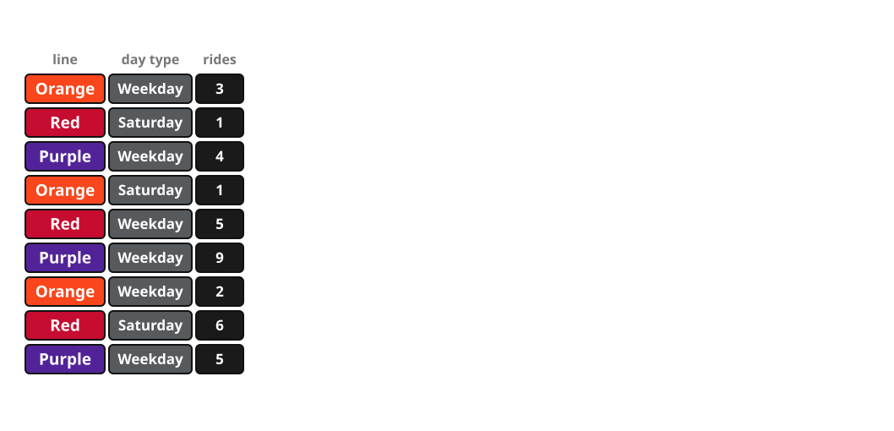
:::

::: {.fragment .fade-in-then-out fragment-index=1}
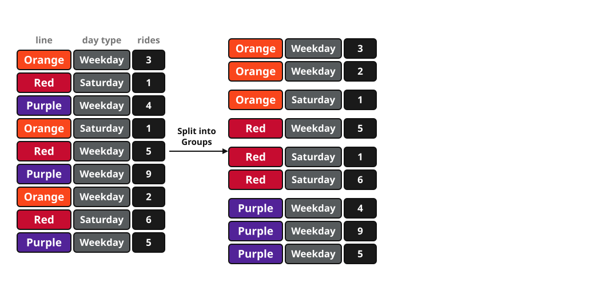
:::

::: {.fragment fragment-index=2}
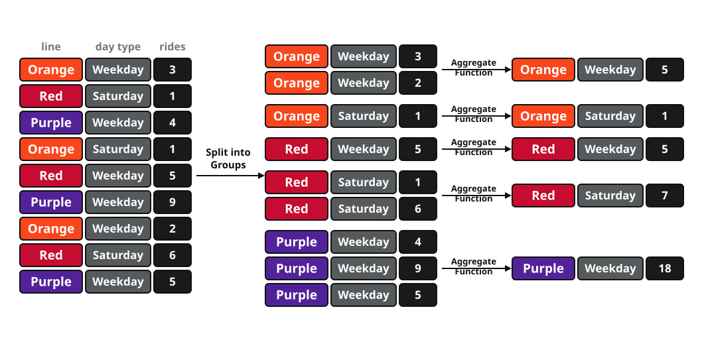
:::

::::

---


## Pivot in Code {.smaller}

Average daily entries by route and day type, August 2025 (`W` weekday, `A` Saturday, `U` Sunday/holiday).

:::: {.columns}

::: {.column width="55%"}
```python
daily = august.group_by("line", "daytype", "date").agg(
    pl.col("rides").sum())

(daily.group_by("line", "daytype")
      .agg(pl.col("rides").mean().round(0))
      .pivot(index="line", on="daytype", values="rides"))
```

Aggregate first, then pivot.
:::

::: {.column width="45%"}

<table style="border-collapse:collapse; margin:0 auto; font-size:0.62em;">
<tr>
<td style="border:2px solid #f9461c; background:#f9461c; color:#fff; font-weight:bold; padding:6px 12px; text-align:center;">line</td>
<td style="border:2px solid #f9461c; background:#f9461c; color:#fff; font-weight:bold; padding:6px 12px; text-align:center;">W</td>
<td style="border:2px solid #f9461c; background:#f9461c; color:#fff; font-weight:bold; padding:6px 12px; text-align:center;">A</td>
<td style="border:2px solid #f9461c; background:#f9461c; color:#fff; font-weight:bold; padding:6px 12px; text-align:center;">U</td>
</tr>
<tr>
<td style="border:2px solid #f9461c; padding:6px 12px; text-align:center;">Red</td>
<td style="border:2px solid #f9461c; padding:6px 12px; text-align:center;">122,289</td>
<td style="border:2px solid #f9461c; background:#fbe0d8; font-weight:bold; padding:6px 12px; text-align:center;">124,475</td>
<td style="border:2px solid #f9461c; padding:6px 12px; text-align:center;">102,517</td>
</tr>
<tr>
<td style="border:2px solid #f9461c; padding:6px 12px; text-align:center;">Purple</td>
<td style="border:2px solid #f9461c; padding:6px 12px; text-align:center;">67,878</td>
<td style="border:2px solid #f9461c; padding:6px 12px; text-align:center;">55,407</td>
<td style="border:2px solid #f9461c; padding:6px 12px; text-align:center;">43,147</td>
</tr>
<tr>
<td style="border:2px solid #f9461c; padding:6px 12px; text-align:center;">Orange</td>
<td style="border:2px solid #f9461c; padding:6px 12px; text-align:center;">41,945</td>
<td style="border:2px solid #f9461c; padding:6px 12px; text-align:center;">28,488</td>
<td style="border:2px solid #f9461c; padding:6px 12px; text-align:center;">23,714</td>
</tr>
</table>

:::

::::

::: {.fragment}


<p class="code-caption">A simple visual for the same data.</p>
:::

---

## Manipulating Datasets via Join {.smaller}
::: {.caption}
Births and population from Eurostat [`demo_fmonth`](https://ec.europa.eu/eurostat/databrowser/view/demo_fmonth/) and [`demo_pjan`](https://ec.europa.eu/eurostat/databrowser/view/demo_pjan/); `per_1000` annualizes the month against the January 1 population. Final dates from Wikipedia.
:::
Back to Week 2: **does winning a World Cup raise the winning country's birth rate nine months later?**

At minimum we would need two tables:

:::: {.columns}

::: {.column width="46%"}

<p style="margin:0 0 0.3em; text-align:center; font-size:0.7em; font-weight:700; color:#333;">World Cup finals, 2006-2018 (Wikipedia)</p>

<table style="border-collapse:collapse; margin:0 auto; font-size:0.6em;">
<tr>
<td style="border:2px solid #f9461c; background:#f9461c; color:#fff; font-weight:bold; padding:6px 12px; text-align:center;">country</td>
<td style="border:2px solid #f9461c; background:#f9461c; color:#fff; font-weight:bold; padding:6px 12px; text-align:center;">year</td>
<td style="border:2px solid #f9461c; background:#f9461c; color:#fff; font-weight:bold; padding:6px 12px; text-align:center;">final_date</td>
</tr>
<tr>
<td style="border:2px solid #f9461c; padding:6px 12px; text-align:center;">Italy</td>
<td style="border:2px solid #f9461c; padding:6px 12px; text-align:center;">2006</td>
<td style="border:2px solid #f9461c; padding:6px 12px; text-align:center;">2006-07-09</td>
</tr>
<tr>
<td style="border:2px solid #f9461c; padding:6px 12px; text-align:center;">Spain</td>
<td style="border:2px solid #f9461c; padding:6px 12px; text-align:center;">2010</td>
<td style="border:2px solid #f9461c; padding:6px 12px; text-align:center;">2010-07-11</td>
</tr>
<tr>
<td style="border:2px solid #f9461c; padding:6px 12px; text-align:center;">Germany</td>
<td style="border:2px solid #f9461c; padding:6px 12px; text-align:center;">2014</td>
<td style="border:2px solid #f9461c; padding:6px 12px; text-align:center;">2014-07-13</td>
</tr>
<tr>
<td style="border:2px solid #f9461c; padding:6px 12px; text-align:center;">France</td>
<td style="border:2px solid #f9461c; padding:6px 12px; text-align:center;">2018</td>
<td style="border:2px solid #f9461c; padding:6px 12px; text-align:center;">2018-07-15</td>
</tr>
</table>

<p class="code-caption">One row = one tournament.</p>
:::

::: {.column width="54%"}

<p style="margin:0 0 0.3em; text-align:center; font-size:0.7em; font-weight:700; color:#333;">Monthly live births (Eurostat)</p>

<table style="border-collapse:collapse; margin:0 auto; font-size:0.6em;">
<tr>
<td style="border:2px solid #f9461c; background:#f9461c; color:#fff; font-weight:bold; padding:6px 12px; text-align:center;">geo</td>
<td style="border:2px solid #f9461c; background:#f9461c; color:#fff; font-weight:bold; padding:6px 12px; text-align:center;">month</td>
<td style="border:2px solid #f9461c; background:#f9461c; color:#fff; font-weight:bold; padding:6px 12px; text-align:center;">births</td>
<td style="border:2px solid #f9461c; background:#f9461c; color:#fff; font-weight:bold; padding:6px 12px; text-align:center;">per_1000</td>
</tr>
<tr>
<td style="border:2px solid #f9461c; padding:6px 12px; text-align:center;">ES</td>
<td style="border:2px solid #f9461c; padding:6px 12px; text-align:center;">2011-03</td>
<td style="border:2px solid #f9461c; padding:6px 12px; text-align:center;">39,900</td>
<td style="border:2px solid #f9461c; padding:6px 12px; text-align:center;">10.07</td>
</tr>
<tr>
<td style="border:2px solid #f9461c; padding:6px 12px; text-align:center;">ES</td>
<td style="border:2px solid #f9461c; padding:6px 12px; text-align:center;">2011-04</td>
<td style="border:2px solid #f9461c; padding:6px 12px; text-align:center;">37,396</td>
<td style="border:2px solid #f9461c; padding:6px 12px; text-align:center;">9.75</td>
</tr>
<tr>
<td style="border:2px solid #f9461c; padding:6px 12px; text-align:center;">DE</td>
<td style="border:2px solid #f9461c; padding:6px 12px; text-align:center;">2015-04</td>
<td style="border:2px solid #f9461c; padding:6px 12px; text-align:center;">56,664</td>
<td style="border:2px solid #f9461c; padding:6px 12px; text-align:center;">8.49</td>
</tr>
<tr>
<td style="border:2px solid #f9461c; padding:6px 12px; text-align:center;">IT</td>
<td style="border:2px solid #f9461c; padding:6px 12px; text-align:center;">2011-04</td>
<td style="border:2px solid #f9461c; padding:6px 12px; text-align:center;">39,395</td>
<td style="border:2px solid #f9461c; padding:6px 12px; text-align:center;">8.00</td>
</tr>
</table>

<p class="code-caption">One row = one country-month.</p>
:::

::::


**Which field do we merge on?**

---

## Making the Keys Match {.smaller}

Simple "Crosswalk table" demo

:::: {.columns}

::: {.column width="58%"}
```python
codes = pl.DataFrame({                    # a crosswalk table!
    "country": ["Italy", "Spain", "Germany", "France"],
    "geo":     ["IT",    "ES",    "DE",      "FR"],
})

wins = (
    finals
    .join(codes, on="country")
    # date augmentation demo column
    .with_columns(
        pl.col("final_date").dt.offset_by("9mo")
                            .dt.strftime("%Y-%m").alias("month")
    )
)

births = births.join(codes, on="geo")     # ES -> Spain, for reading
```
:::

::: {.column width="42%"}

<p style="margin:0 0 0.3em; text-align:center; font-size:0.7em; font-weight:700; color:#333;">wins</p>

<table style="border-collapse:collapse; margin:0 auto; font-size:0.6em;">
<tr>
<td style="border:2px solid #f9461c; background:#f9461c; color:#fff; font-weight:bold; padding:6px 12px; text-align:center;">country</td>
<td style="border:2px solid #f9461c; background:#f9461c; color:#fff; font-weight:bold; padding:6px 12px; text-align:center;">geo</td>
<td style="border:2px solid #f9461c; background:#f9461c; color:#fff; font-weight:bold; padding:6px 12px; text-align:center;">month</td>
</tr>
<tr>
<td style="border:2px solid #f9461c; padding:6px 12px; text-align:center;">Italy</td>
<td style="border:2px solid #f9461c; background:#fdf2ee; font-weight:bold; padding:6px 12px; text-align:center;">IT</td>
<td style="border:2px solid #f9461c; background:#fdf2ee; font-weight:bold; padding:6px 12px; text-align:center;">2007-04</td>
</tr>
<tr>
<td style="border:2px solid #f9461c; padding:6px 12px; text-align:center;">Spain</td>
<td style="border:2px solid #f9461c; background:#fdf2ee; font-weight:bold; padding:6px 12px; text-align:center;">ES</td>
<td style="border:2px solid #f9461c; background:#fdf2ee; font-weight:bold; padding:6px 12px; text-align:center;">2011-04</td>
</tr>
<tr>
<td style="border:2px solid #f9461c; padding:6px 12px; text-align:center;">Germany</td>
<td style="border:2px solid #f9461c; background:#fdf2ee; font-weight:bold; padding:6px 12px; text-align:center;">DE</td>
<td style="border:2px solid #f9461c; background:#fdf2ee; font-weight:bold; padding:6px 12px; text-align:center;">2015-04</td>
</tr>
<tr>
<td style="border:2px solid #f9461c; padding:6px 12px; text-align:center;">France</td>
<td style="border:2px solid #f9461c; background:#fdf2ee; font-weight:bold; padding:6px 12px; text-align:center;">FR</td>
<td style="border:2px solid #f9461c; background:#fdf2ee; font-weight:bold; padding:6px 12px; text-align:center;">2019-04</td>
</tr>
</table>

<p class="code-caption">`geo` and `month` are now the key</p>
:::

::::

`join(codes, on="country")` matches on a column both tables already name the same way.

When column names differ: `finals.join(codes, left_on="winner", right_on="country")`.

---

## Join in Code {.smaller}

With the keys from the crosswalk, the join is straightforward:

:::: {.columns}

::: {.column width="46%"}
```python
merged = births.join(
    wins.select("geo", "month", "year"),
    on=["geo", "month"],
    how="left",
)
```

`how="left"` keeps every row of `births` and leaves `year` null wherever nothing matched (no championship)

(`how="inner"` would keep only the winning months)
:::

::: {.column width="54%"}

<table style="border-collapse:collapse; margin:0 auto; font-size:0.58em;">
<tr>
<td style="border:2px solid #f9461c; background:#f9461c; color:#fff; font-weight:bold; padding:6px 12px; text-align:center;">country</td>
<td style="border:2px solid #f9461c; background:#f9461c; color:#fff; font-weight:bold; padding:6px 12px; text-align:center;">month</td>
<td style="border:2px solid #f9461c; background:#f9461c; color:#fff; font-weight:bold; padding:6px 12px; text-align:center;">per_1000</td>
<td style="border:2px solid #f9461c; background:#f9461c; color:#fff; font-weight:bold; padding:6px 12px; text-align:center;">year</td>
</tr>
<tr>
<td style="border:2px solid #f9461c; padding:6px 12px; text-align:center;">Spain</td>
<td style="border:2px solid #f9461c; padding:6px 12px; text-align:center;">2011-03</td>
<td style="border:2px solid #f9461c; padding:6px 12px; text-align:center;">10.07</td>
<td style="border:2px solid #f9461c; color:#999; font-family:monospace; padding:6px 12px; text-align:center;">null</td>
</tr>
<tr>
<td style="border:2px solid #f9461c; padding:6px 12px; text-align:center;">Spain</td>
<td style="border:2px solid #f9461c; padding:6px 12px; text-align:center;">2011-04</td>
<td style="border:2px solid #f9461c; padding:6px 12px; text-align:center;">9.75</td>
<td style="border:2px solid #f9461c; background:#fdf2ee; font-weight:bold; padding:6px 12px; text-align:center;">2010</td>
</tr>
<tr>
<td style="border:2px solid #f9461c; padding:6px 12px; text-align:center;">Spain</td>
<td style="border:2px solid #f9461c; padding:6px 12px; text-align:center;">2011-05</td>
<td style="border:2px solid #f9461c; padding:6px 12px; text-align:center;">9.92</td>
<td style="border:2px solid #f9461c; color:#999; font-family:monospace; padding:6px 12px; text-align:center;">null</td>
</tr>
<tr>
<td style="border:2px solid #f9461c; padding:6px 12px; text-align:center;">Germany</td>
<td style="border:2px solid #f9461c; padding:6px 12px; text-align:center;">2015-03</td>
<td style="border:2px solid #f9461c; padding:6px 12px; text-align:center;">8.48</td>
<td style="border:2px solid #f9461c; color:#999; font-family:monospace; padding:6px 12px; text-align:center;">null</td>
</tr>
<tr>
<td style="border:2px solid #f9461c; padding:6px 12px; text-align:center;">Germany</td>
<td style="border:2px solid #f9461c; padding:6px 12px; text-align:center;">2015-04</td>
<td style="border:2px solid #f9461c; padding:6px 12px; text-align:center;">8.49</td>
<td style="border:2px solid #f9461c; background:#fdf2ee; font-weight:bold; padding:6px 12px; text-align:center;">2014</td>
</tr>
<tr>
<td style="border:2px solid #f9461c; padding:6px 12px; text-align:center;">Germany</td>
<td style="border:2px solid #f9461c; padding:6px 12px; text-align:center;">2015-05</td>
<td style="border:2px solid #f9461c; padding:6px 12px; text-align:center;">8.84</td>
<td style="border:2px solid #f9461c; color:#999; font-family:monospace; padding:6px 12px; text-align:center;">null</td>
</tr>
</table>

<p class="code-caption">Two rows matched, others came back with a null.</p>
:::

::::

---

## Another Column {.smaller}

Create a yes/no variable to align with the question:

:::: {.columns}

::: {.column width="46%"}
```python
merged = merged.with_columns(
    pl.col("year").is_not_null()
      .alias("won_world_cup_9mo_ago")
)
```

Note this is for demonstration purposes; it is not a thorough, meaningful answer to the research question.

(It does make the question seem slightly more answerable!)
:::

::: {.column width="54%"}

<table style="border-collapse:collapse; margin:0 auto; font-size:0.58em;">
<tr>
<td style="border:2px solid #f9461c; background:#f9461c; color:#fff; font-weight:bold; padding:6px 12px; text-align:center;">country</td>
<td style="border:2px solid #f9461c; background:#f9461c; color:#fff; font-weight:bold; padding:6px 12px; text-align:center;">month</td>
<td style="border:2px solid #f9461c; background:#f9461c; color:#fff; font-weight:bold; padding:6px 12px; text-align:center;">per_1000</td>
<td style="border:2px solid #f9461c; background:#f9461c; color:#fff; font-weight:bold; padding:6px 12px; text-align:center;">won_world_cup_9mo_ago</td>
</tr>
<tr>
<td style="border:2px solid #f9461c; padding:6px 12px; text-align:center;">Spain</td>
<td style="border:2px solid #f9461c; padding:6px 12px; text-align:center;">2011-03</td>
<td style="border:2px solid #f9461c; padding:6px 12px; text-align:center;">10.07</td>
<td style="border:2px solid #f9461c; padding:6px 12px; text-align:center;">false</td>
</tr>
<tr>
<td style="border:2px solid #f9461c; padding:6px 12px; text-align:center;">Spain</td>
<td style="border:2px solid #f9461c; padding:6px 12px; text-align:center;">2011-04</td>
<td style="border:2px solid #f9461c; padding:6px 12px; text-align:center;">9.75</td>
<td style="border:2px solid #f9461c; background:#fdf2ee; font-weight:bold; padding:6px 12px; text-align:center;">true</td>
</tr>
<tr>
<td style="border:2px solid #f9461c; padding:6px 12px; text-align:center;">Spain</td>
<td style="border:2px solid #f9461c; padding:6px 12px; text-align:center;">2011-05</td>
<td style="border:2px solid #f9461c; padding:6px 12px; text-align:center;">9.92</td>
<td style="border:2px solid #f9461c; padding:6px 12px; text-align:center;">false</td>
</tr>
<tr>
<td style="border:2px solid #f9461c; padding:6px 12px; text-align:center;">Germany</td>
<td style="border:2px solid #f9461c; padding:6px 12px; text-align:center;">2015-03</td>
<td style="border:2px solid #f9461c; padding:6px 12px; text-align:center;">8.48</td>
<td style="border:2px solid #f9461c; padding:6px 12px; text-align:center;">false</td>
</tr>
<tr>
<td style="border:2px solid #f9461c; padding:6px 12px; text-align:center;">Germany</td>
<td style="border:2px solid #f9461c; padding:6px 12px; text-align:center;">2015-04</td>
<td style="border:2px solid #f9461c; padding:6px 12px; text-align:center;">8.49</td>
<td style="border:2px solid #f9461c; background:#fdf2ee; font-weight:bold; padding:6px 12px; text-align:center;">true</td>
</tr>
<tr>
<td style="border:2px solid #f9461c; padding:6px 12px; text-align:center;">Germany</td>
<td style="border:2px solid #f9461c; padding:6px 12px; text-align:center;">2015-05</td>
<td style="border:2px solid #f9461c; padding:6px 12px; text-align:center;">8.84</td>
<td style="border:2px solid #f9461c; padding:6px 12px; text-align:center;">false</td>
</tr>
</table>
:::

::::

---


## Scope in the World Cups / Birth Rates example {.smaller}


---


## Is the Data in Scope? {.smaller}

Check that the rows available are the rows your question is about.

:::: {.r-stack}

::: {.fragment .fade-out fragment-index=1}
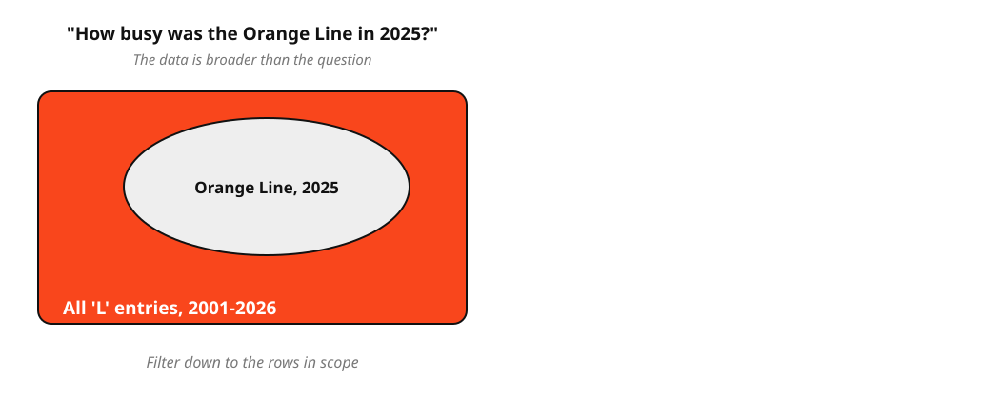
:::

::: {.fragment fragment-index=1}
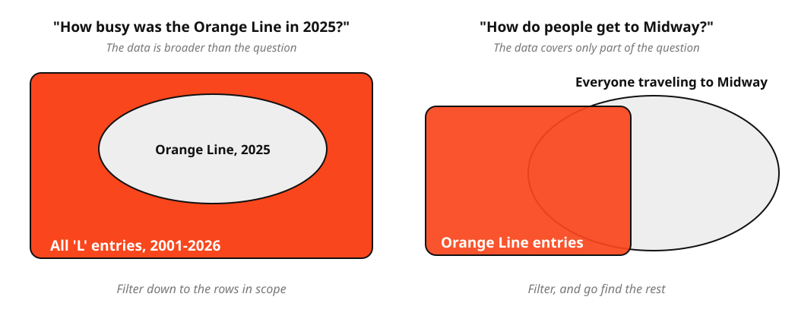
:::

::::

---


## Filtering Changes a Sample {.smaller}

- **Too expansive?** Filter.
    - e.g. *"I want grades for CS 418, but the file has every CS class."*
- **Not expansive enough?** No filter will fix it, try to find more data (or...?)
    - e.g. *"I want 311 requests in Illinois, but the file is Chicago only."*
- Filtering a sample shrinks the sample.
    - Afterward: are there still enough rows, and do they still represent what you're studying?
- A filter is a modeling decision, so write down which rows are dropped and why.

---

## Data Filtering {.smaller}

Data filtering is part of the data wrangling process: "is this data relevant to my analysis?"

:::: {.columns}

::: {.column width="42%"}
- **Keep rows that satisfy a condition** — a comparison returns True/False for every row
- **Select only the columns you need** — based on the question
- **Combine multiple conditions** — `&` is AND (every condition must hold), `|` is OR (either one will do)
:::

::: {.column width="58%"}
```python
# one condition: keep the rows where it is True
df.filter(pl.col("miles") > 15)

# AND: commas mean every condition must hold
df.filter(pl.col("miles") > 15, pl.col("hours") < 1)

# AND: the same thing written with &, parenthesizing each condition
df.filter((pl.col("miles") > 15) & (pl.col("hours") < 1))

# OR: | keeps a row if either condition holds
df.filter((pl.col("miles") > 15) | (pl.col("hours") < 1))

# only the columns you need
df.select("trip", "driver", "miles")

# rows and columns together, in the order you read them
df.filter(pl.col("miles") > 15).select("trip", "miles")
```
:::

::::


# Data Formats {.section-header}

*time permitting*

---

## How Do We Store This Data? {.business-card-slide}


---


## Spreadsheet??

:::: {.columns}

::: {.column width="42%"}
- Grid with cells, rows, columns (and sheets/tabs)
- Excel, Google Sheets, Numbers, LibreOffice Calc, etc.
- Convenient for manual entry, review, sharing
- But data scientists often don't keep data in spreadsheets...
:::

::: {.column width="58%"}
::: {.spreadsheet-demo}
|  | A | B | C | D | E |
|---|---|---|---|---|---|
| 1 | name | company | street | city | phone |
| 2 | Tyler Durden | Paper Street Soap Co. | 537 Paper Street | Bradford | (288) 555-0153 |
:::
:::

::::

---

## Why Not Spreadsheets?

:::: {.columns}

::: {.column width="50%"}
::: {.incremental}
- Formulas and transformations are hidden inside cells
- Data types, missing values can be ambiguous
- Auto-formatting can corrupt values (e.g., [gene name "SEPT2" becomes a date](https://link.springer.com/article/10.1186/s13059-016-1044-7))
- Errors can go undetected for years without automated testing ([spreadsheet horror stories](https://eusprig.org/research-info/horror-stories/), [the Reinhart-Rogoff error](https://theconversation.com/the-reinhart-rogoff-error-or-how-not-to-excel-at-economics-13646))
:::
:::

::: {.column width="50%"}
::: {.incremental}
- No separation between data, logic, and presentation
- Version control can be more difficult
	- Sharing files -> accidental overwrites, conflicts
- Larger datasets become slow
:::
:::

::::

---

## CSV

:::: {.columns}

::: {.column width="42%"}
- Comma-separated values
- Plain-text table: one row per record, one delimiter between fields (can be non-comma)
- Often used for spreadsheets, exports, and simple datasets
- Easy to inspect
- Types and hierarchy are usually implicit until ingested/wrangled
:::

::: {.column width="58%"}
```csv
name,company,product,street,city,postalCode,phone
Tyler Durden,Paper Street Soap Co.,All Natural Handmade,537 Paper Street,Bradford,19808,(288) 555-0153
```
:::

::::

---

## TSV

:::: {.columns}

::: {.column width="42%"}
- Tab-separated values
- Plain-text table like CSV, but fields are separated by tabs
- Still flat: hierarchy and data types need outside context
:::

::: {.column width="58%"}
```tsv
name	company	product	street	city	postalCode	phone
Tyler Durden	Paper Street Soap Co.	All Natural Handmade	537 Paper Street	Bradford	19808	(288) 555-0153
```
:::

::::

---

## JSON

:::: {.columns}

::: {.column width="42%"}
- JavaScript Object Notation
- Text format for data interchange
- Built from objects, arrays, strings, numbers, booleans, and null
- Common for web APIs and configuration files
- Allows for nesting (as opposed to flat)
:::

::: {.column width="58%"}
```json
{
  "name": "Tyler Durden",
  "company": "Paper Street Soap Co.",
  "product": "All Natural Handmade",
  "address": {
    "street": "537 Paper Street",
    "city": "Bradford",
    "postalCode": "19808"
  },
  "phone": "(288) 555-0153"
}
```
:::

::::

---

## XML

:::: {.columns}

::: {.column width="42%"}
- Extensible Markup Language
- Nested tags represent elements and attributes
- Verbose, but widely used by older document systems
- E.g. Excel uses XML under the hood (same for Word)
:::

::: {.column width="58%"}
```xml
<?xml version="1.0" encoding="UTF-8"?>
<person>
  <name>Tyler Durden</name>
  <company>Paper Street Soap Co.</company>
  <product>All Natural Handmade</product>
  <address>
    <street>537 Paper Street</street>
    <city>Bradford</city>
    <postalCode>19808</postalCode>
  </address>
  <phone>(288) 555-0153</phone>
</person>
```
:::

::::

---


## YAML

:::: {.columns}

::: {.column width="42%"}
- YAML Ain't Markup Language
- Human-readable format based on indentation
- Supports mappings, lists, scalars, and comments
- Common for configuration files and data pipelines
:::

::: {.column width="58%"}
```yaml
name: Tyler Durden
company: Paper Street Soap Co.
product: All Natural Handmade
address:
  street: 537 Paper Street
  city: Bradford
  postalCode: 19808
phone: (288) 555-0153
```
:::

::::

---


## Parquet

:::: {.columns}

::: {.column width="42%"}
- Binary columnar storage format
- Efficient for large datasets
- Stores schema and data types with the data
- Common in Spark, DuckDB, Polars, and "data lakes"
:::

::: {.column width="58%"}
```text
message business_card {
  required binary name (STRING);
  required binary company (STRING);
  required binary product (STRING);
  required binary street (STRING);
  required binary city (STRING);
  required binary postalCode (STRING);
  required binary phone (STRING);
}

row 1:
Tyler Durden | Paper Street Soap Co. | All Natural Handmade |
537 Paper Street | Bradford | 19808 | (288) 555-0153
```
:::

::::

---


## What About More Complex Data? {.image-frame-slide}

::: {.content-visible when-format="html"}

:::

::: {.content-visible when-format="pdf"}

:::

---


## NetCDF

:::: {.columns}

::: {.column width="42%"}
- Network Common Data Form
- Binary, self-describing format for array-oriented scientific data
- Stores dimensions, variables, and metadata together
- Better than CSV or JSON for gridded data with coordinates
- Common in scientific workflows (e.g. climate, ocean, weather)
- Harder to quickly inspect than plain text formats
	- (Data stored as binary)
:::

::: {.column width="58%"}
```text
dimensions:
  time = unlimited
  lat = 180
  lon = 360

variables:
  float temperature(time, lat, lon)
    temperature:units = "K"
    temperature:long_name = "air temperature"
  float lat(lat)
  float lon(lon)
```

<p class="code-caption">A simplified example of what a NetCDF file can contain.</p>
:::

::::

---

## Format Summary {.format-summary}

| Format | Best fit | Short example |
|---|---|---|
| CSV | Flat tables, spreadsheet exports, simple datasets | `name,company,phone`<br>`Tyler Durden,Paper Street Soap Co.,(288) 555-0153` |
| TSV | Flat text tables where commas may appear in fields | `name	company	phone` |
| JSON | APIs, nested records, web data | `{"name":"Tyler Durden","city":"Bradford"}` |
| XML | Document-like data with tags and attributes | `<name>Tyler Durden</name>` |
| YAML | Human-edited configuration and pipeline settings | `name: Tyler Durden`<br>`city: Bradford` |
| NetCDF | Labeled multi-dimensional scientific arrays | `temperature(time, lat, lon)` |
| Parquet | Typed, compressed analytics data | `name: STRING`<br>`city: STRING` |
| Spreadsheet | Small, early-stage data; prototypes; manual entry | *(Excel, Google Sheets, Numbers)* |


---

## Conclusion

:::: {.columns}

::: {.column width="50%"}
### ❓Any Questions?
:::

::: {.column width="50%"}
### 📸 Take a picture of your worksheet, upload it in Canvas
:::

::::

---

## Quiz Time!

- PrairieLearn
- Week 3 Quiz
- It should give you your score instantly
- You can leave when finished!


# Sources {.sources}

1. GitHub source: <https://github.com/jackbandy/data-science-fun/blob/main/docs/slides/week3.qmd>.
2. NetCDF reference: Unidata netCDF documentation, <https://www.unidata.ucar.edu/software/netcdf/>.
3. LearningDS chapter 14, "Web Data," netCDF discussion: <https://learningds.org/ch/14/web_netCDF.html>.
4. Format examples adapted from Wikipedia and project documentation: [JSON](https://en.wikipedia.org/wiki/JSON), [XML](https://en.wikipedia.org/wiki/XML), [Comma-separated values](https://en.wikipedia.org/wiki/Comma-separated_values), [YAML](https://en.wikipedia.org/wiki/YAML), [Tab-separated values](https://en.wikipedia.org/wiki/Tab-separated_values), [Spreadsheet](https://en.wikipedia.org/wiki/Spreadsheet), and [Apache Parquet](https://parquet.apache.org/).
5. Tyler Durden business card image: Wikimedia Commons remake by Michaelpreid, modified, [CC BY-SA 4.0](https://creativecommons.org/licenses/by-sa/4.0/), <https://commons.wikimedia.org/wiki/File:Tyler_Durden_Business_Card.png>.
6. Ziemann M., Eren Y., El-Osta A., "Gene name errors are widespread in the scientific literature," *Genome Biology* 17, 177 (2016): <https://link.springer.com/article/10.1186/s13059-016-1044-7>.
7. European Spreadsheet Risks Interest Group (EuSpRIG), Horror Stories — a catalogue of real-world spreadsheet errors in business, government, and research: <https://eusprig.org/research-info/horror-stories/>.
8. Inman, Phillip, "The Reinhart-Rogoff error — or how not to Excel at economics," *The Conversation*, 2013: <https://theconversation.com/the-reinhart-rogoff-error-or-how-not-to-excel-at-economics-13646>.
9. Data quality vocabulary, and the structure / granularity / scope / temporality / faithfulness framework: Lau S., Gonzalez J., Nolan D., *Learning Data Science* (O'Reilly, 2023), [ch. 2, "Questions and Data Scope"](https://learningds.org/ch/02/data_scope_intro.html), [ch. 8, "Wrangling Files"](https://learningds.org/ch/08/files_intro.html), and [ch. 9, "Wrangling Dataframes"](https://learningds.org/ch/09/wrangling_intro.html); Berkeley Data 100 course notes, ["Data Cleaning and EDA"](https://ds100.org/course-notes-su23/eda/eda.html).
10. World Cup and birth rate join example: monthly live births from Eurostat [`demo_fmonth`](https://ec.europa.eu/eurostat/databrowser/view/demo_fmonth/) and population from [`demo_pjan`](https://ec.europa.eu/eurostat/databrowser/view/demo_pjan/), retrieved September 2026; final dates from the Wikipedia articles on the [2006](https://en.wikipedia.org/wiki/2006_FIFA_World_Cup_final), [2010](https://en.wikipedia.org/wiki/2010_FIFA_World_Cup_final), [2014](https://en.wikipedia.org/wiki/2014_FIFA_World_Cup_final), and [2018](https://en.wikipedia.org/wiki/2018_FIFA_World_Cup_final) FIFA World Cup finals.
11. Slides developed using materials from [Elena Zheleva](https://www.cs.uic.edu/~elena/) and [Gonzalo Bello Lander](https://cs.uic.edu/profiles/gonzalo-bello/), the Berkeley DS 100 team, Marine Carpuat, and Brian Ziebart.
12. Slide deck built with [Quarto](https://quarto.org/) revealjs.
13. Title font is Big Shoulders; Body font is [Libre Franklin](https://en.wikipedia.org/wiki/Franklin_Gothic#Libre_Franklin).
14. Ridership numbers computed from [CTA Ridership — 'L' Station Entries, Daily Totals](https://data.cityofchicago.org/Transportation/CTA-Ridership-L-Station-Entries-Daily-Totals/5neh-572f) and [CTA System Information — List of 'L' Stops](https://data.cityofchicago.org/Transportation/CTA-System-Information-List-of-L-Stops/8pix-ypme), City of Chicago Data Portal. The group by and pivot figures use August 2025; the data quality checks use the full file, January 2001 through March 2026.
15. Granularity, group by, pivot, and scope figures drawn for this deck by `docs/assets/wrangling/make_wrangling_figures.py`, based on the split-apply-combine and pivot diagrams in the CS 418 wrangling materials. Route colors follow the [CTA Trademark Guidelines for Developers](https://www.transitchicago.com/developers/branding/)
