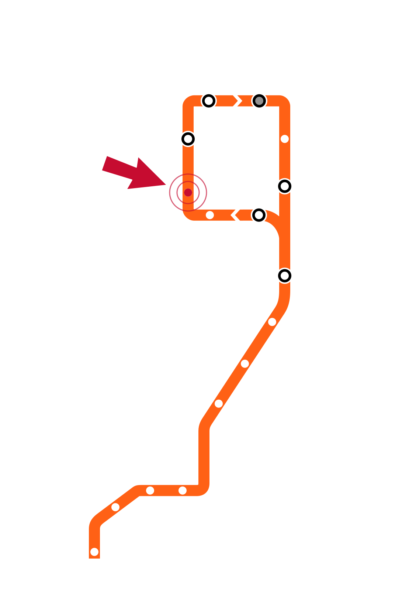
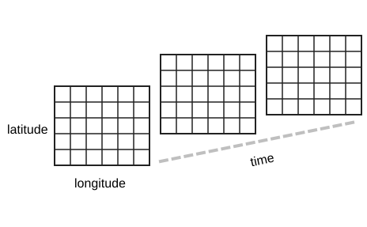

# Week 3 Slide Deck {.course-title}

## Wrangling, Filtering; Formats

Jack Bandy
2026

---

# Week 3, Day 1 {.course-title .photo-title data-state="photo-title" background-image="../assets/orange-line-stops-better/stop03-quincy-c.jpg" background-size="cover"}

CS 418 · Week 3 · 🟠 Quincy 🟠

---

# {.photo-only data-state="photo-only" background-image="../assets/orange-line-stops-better/stop03-quincy-c.jpg" background-size="cover"}

---

# Map {.split}

::: {.split-content .narrow-aside}

::: {}
- Week 3: Quincy
- Day 1
    - Data Wrangling
    - Data Filtering
:::

{.figure alt="Orange Line map with the Quincy stop marked, the Week 3 stop"}

:::

---


# Data Wrangling {.section-header}

---

# What is Data Wrangling? {.smaller}

::: {.incremental}

- Data wrangling is the process of transforming raw, unstructured data into clean, consistent, and useful data that supports its intended application.

- How can we perform data wrangling?
  1. Discover and address quality issues
  2. Reshape data into the structure your analysis needs
  3. Add new information to existing datasets (data augmentation)
  4. Verify accuracy and consistency in the dataset

:::

---

# Discover and address quality issues {.smaller}

Find issues in the raw data before they bias your results.

:::: {.columns}

::: {.column width="55%"}

- **Missing values** — nulls, `NaN`, or disguised blanks like `"N/A"`, `-999`
- **Duplicates** — the same row or entity recorded more than once
- **Inconsistent formatting** — `"IL"` vs `"Illinois"`, `mm/dd/yyyy` vs `yyyy/dd/mm`
- **Wrong data types** — numbers or dates stored as strings
- **Structure issues** — mixed units, e.g. miles vs km
- **Invalid values** — impossible entries such as age = 350
:::

::: {.column width="45%"}

<p class="code-caption" style="margin-bottom:0.4em;">Raw data often looks like this:</p>

<table style="border-collapse:collapse; margin:0.2em auto 0; font-size:0.62em;">
<tr>
<td style="border:2px solid #f9461c; background:#f9461c; color:#fff; font-weight:bold; padding:6px 16px; text-align:center;">id</td>
<td style="border:2px solid #f9461c; background:#f9461c; color:#fff; font-weight:bold; padding:6px 16px; text-align:center;">age</td>
<td style="border:2px solid #f9461c; background:#f9461c; color:#fff; font-weight:bold; padding:6px 16px; text-align:center;">city</td>
</tr>
<tr>
<td style="border:2px solid #f9461c; padding:6px 16px; text-align:center;">1</td>
<td style="border:2px solid #f9461c; padding:6px 16px; text-align:center;">34</td>
<td style="border:2px solid #f9461c; padding:6px 16px; text-align:center;">Chicago</td>
</tr>
<tr>
<td style="border:2px solid #f9461c; padding:6px 16px; text-align:center;">2</td>
<td style="border:2px solid #f9461c; background:#fbe0d8; color:#c0392b; font-weight:bold; font-family:monospace; padding:6px 16px; text-align:center;">NaN</td>
<td style="border:2px solid #f9461c; padding:6px 16px; text-align:center;">Naperville</td>
</tr>
<tr>
<td style="border:2px solid #f9461c; padding:6px 16px; text-align:center;">2</td>
<td style="border:2px solid #f9461c; background:#fbe0d8; color:#c0392b; font-weight:bold; font-family:monospace; padding:6px 16px; text-align:center;">NaN</td>
<td style="border:2px solid #f9461c; padding:6px 16px; text-align:center;">Naperville</td>
</tr>
<tr>
<td style="border:2px solid #f9461c; padding:6px 16px; text-align:center;">3</td>
<td style="border:2px solid #f9461c; background:#fbe0d8; color:#c0392b; font-weight:bold; font-family:monospace; padding:6px 16px; text-align:center;">350</td>
<td style="border:2px solid #f9461c; background:#fbe0d8; color:#c0392b; font-weight:bold; font-family:monospace; padding:6px 16px; text-align:center;">N/A</td>
</tr>
</table>

:::

::::

Pandas: `df.info()`, `df.isna().sum()`, `df.duplicated().sum()`, and `df.describe()`.

---

# Reshape data into the structure your analysis needs {.smaller}

Rearrange rows and columns until the table matches what your analysis needs.

:::: {.columns}

::: {.column width="55%"}

- **Tidy data** — one row per observation, one column per variable
- **Wide → long** — collapse many columns into key/value pairs with df.melt()
- **Long → wide** — spread one column back out into many with df.pivot()
- **Combine tables** — stack rows with pd.concat(), match on keys with pd.merge()
- **Rename and reindex** — clean column names, set an index, sort the rows
:::

::: {.column width="45%"}

<p style="margin:0 0 0.3em; text-align:center; font-size:0.62em; font-weight:700; color:#333;">Wide format</p>

<table style="border-collapse:collapse; margin:0 auto; font-size:0.55em;">
<tr>
<td style="border:2px solid #f9461c; background:#f9461c; color:#fff; font-weight:bold; padding:5px 18px; text-align:center;">id</td>
<td style="border:2px solid #f9461c; background:#f9461c; color:#fff; font-weight:bold; padding:5px 18px; text-align:center;">2023</td>
<td style="border:2px solid #f9461c; background:#f9461c; color:#fff; font-weight:bold; padding:5px 18px; text-align:center;">2024</td>
</tr>
<tr>
<td style="border:2px solid #f9461c; padding:5px 18px; text-align:center;">1</td>
<td style="border:2px solid #f9461c; padding:5px 18px; text-align:center;">30</td>
<td style="border:2px solid #f9461c; padding:5px 18px; text-align:center;">34</td>
</tr>
<tr>
<td style="border:2px solid #f9461c; padding:5px 18px; text-align:center;">2</td>
<td style="border:2px solid #f9461c; padding:5px 18px; text-align:center;">41</td>
<td style="border:2px solid #f9461c; padding:5px 18px; text-align:center;">45</td>
</tr>
</table>

<p style="margin:0.9em 0 0.3em; text-align:center; font-size:0.62em; font-weight:700; color:#333;">Long format</p>

<table style="border-collapse:collapse; margin:0 auto; font-size:0.55em;">
<tr>
<td style="border:2px solid #f9461c; background:#f9461c; color:#fff; font-weight:bold; padding:5px 18px; text-align:center;">id</td>
<td style="border:2px solid #f9461c; background:#f9461c; color:#fff; font-weight:bold; padding:5px 18px; text-align:center;">year</td>
<td style="border:2px solid #f9461c; background:#f9461c; color:#fff; font-weight:bold; padding:5px 18px; text-align:center;">value</td>
</tr>
<tr>
<td style="border:2px solid #f9461c; padding:5px 18px; text-align:center;">1</td>
<td style="border:2px solid #f9461c; padding:5px 18px; text-align:center;">2023</td>
<td style="border:2px solid #f9461c; padding:5px 18px; text-align:center;">30</td>
</tr>
<tr>
<td style="border:2px solid #f9461c; padding:5px 18px; text-align:center;">1</td>
<td style="border:2px solid #f9461c; padding:5px 18px; text-align:center;">2024</td>
<td style="border:2px solid #f9461c; padding:5px 18px; text-align:center;">34</td>
</tr>
<tr>
<td style="border:2px solid #f9461c; padding:5px 18px; text-align:center;">2</td>
<td style="border:2px solid #f9461c; padding:5px 18px; text-align:center;">2023</td>
<td style="border:2px solid #f9461c; padding:5px 18px; text-align:center;">41</td>
</tr>
<tr>
<td style="border:2px solid #f9461c; padding:5px 18px; text-align:center;">2</td>
<td style="border:2px solid #f9461c; padding:5px 18px; text-align:center;">2024</td>
<td style="border:2px solid #f9461c; padding:5px 18px; text-align:center;">45</td>
</tr>
</table>
:::

::::

Pandas: `df.melt()`, `df.pivot()`, `pd.concat()`, and `pd.merge()`.

---

# Add new information to existing datasets {.smaller}

We can add information to a dataset through **data augmentation**.

:::: {.columns}

::: {.column width="55%"}

- **Derived columns** — compute from what you already have, e.g. speed from miles and hours (df.assign())
- **Binning** — classify numeric data into categories based on the ranges you specify (pd.cut())
- **External joins** — attach weather, census, or geographic data on a shared key (pd.merge())
- **Group features** — add a group's summary statistic onto each of its rows (df.groupby().transform())
- **Encoding** — convert text variables into numerical columns of 0s and 1s, model-ready (pd.get_dummies())
:::

::: {.column width="45%"}

<p style="margin:0 0 0.3em; text-align:center; font-size:0.62em; font-weight:700; color:#333;">Raw dataset</p>

<table style="border-collapse:collapse; margin:0 auto; font-size:0.5em;">
<tr>
<td style="border:2px solid #f9461c; background:#f9461c; color:#fff; font-weight:bold; padding:5px 12px; text-align:center;">trip</td>
<td style="border:2px solid #f9461c; background:#f9461c; color:#fff; font-weight:bold; padding:5px 12px; text-align:center;">driver</td>
<td style="border:2px solid #f9461c; background:#f9461c; color:#fff; font-weight:bold; padding:5px 12px; text-align:center;">city</td>
<td style="border:2px solid #f9461c; background:#f9461c; color:#fff; font-weight:bold; padding:5px 12px; text-align:center;">miles</td>
<td style="border:2px solid #f9461c; background:#f9461c; color:#fff; font-weight:bold; padding:5px 12px; text-align:center;">hours</td>
</tr>
<tr>
<td style="border:2px solid #f9461c; padding:5px 12px; text-align:center;">1</td>
<td style="border:2px solid #f9461c; padding:5px 12px; text-align:center;">Kevin</td>
<td style="border:2px solid #f9461c; padding:5px 12px; text-align:center;">Chicago</td>
<td style="border:2px solid #f9461c; padding:5px 12px; text-align:center;">12</td>
<td style="border:2px solid #f9461c; padding:5px 12px; text-align:center;">0.5</td>
</tr>
<tr>
<td style="border:2px solid #f9461c; padding:5px 12px; text-align:center;">2</td>
<td style="border:2px solid #f9461c; padding:5px 12px; text-align:center;">Kevin</td>
<td style="border:2px solid #f9461c; padding:5px 12px; text-align:center;">Naperville</td>
<td style="border:2px solid #f9461c; padding:5px 12px; text-align:center;">30</td>
<td style="border:2px solid #f9461c; padding:5px 12px; text-align:center;">0.6</td>
</tr>
<tr>
<td style="border:2px solid #f9461c; padding:5px 12px; text-align:center;">3</td>
<td style="border:2px solid #f9461c; padding:5px 12px; text-align:center;">Yuseph</td>
<td style="border:2px solid #f9461c; padding:5px 12px; text-align:center;">Chicago</td>
<td style="border:2px solid #f9461c; padding:5px 12px; text-align:center;">8</td>
<td style="border:2px solid #f9461c; padding:5px 12px; text-align:center;">0.4</td>
</tr>
<tr>
<td style="border:2px solid #f9461c; padding:5px 12px; text-align:center;">4</td>
<td style="border:2px solid #f9461c; padding:5px 12px; text-align:center;">Yuseph</td>
<td style="border:2px solid #f9461c; padding:5px 12px; text-align:center;">Naperville</td>
<td style="border:2px solid #f9461c; padding:5px 12px; text-align:center;">45</td>
<td style="border:2px solid #f9461c; padding:5px 12px; text-align:center;">0.9</td>
</tr>
</table>

<p style="margin:1.1em 0 0.3em; text-align:center; font-size:0.62em; font-weight:700; color:#333;">Population<span style="font-weight:400; font-family:monospace; font-size:0.9em; color:#666;"></span></p>

<table style="border-collapse:collapse; margin:0 auto; font-size:0.5em;">
<tr>
<td style="border:2px solid #f9461c; background:#f9461c; color:#fff; font-weight:bold; padding:5px 14px; text-align:center;">city</td>
<td style="border:2px solid #f9461c; background:#f9461c; color:#fff; font-weight:bold; padding:5px 14px; text-align:center;">population</td>
</tr>
<tr>
<td style="border:2px solid #f9461c; padding:5px 14px; text-align:center;">Chicago</td>
<td style="border:2px solid #f9461c; padding:5px 14px; text-align:center;">~2.73</td>
</tr>
<tr>
<td style="border:2px solid #f9461c; padding:5px 14px; text-align:center;">Naperville</td>
<td style="border:2px solid #f9461c; padding:5px 14px; text-align:center;">~0.15</td>
</tr>
</table>

<p class="code-caption" style="margin-top:0.6em;"></p>

:::

::::

---

# Example of application

<table style="border-collapse:collapse; margin:0.6em auto 0; font-size:0.42em;">
<tr>
<td colspan="4"></td>
<td style="padding:2px 6px; text-align:center; font-family:monospace; font-size:0.9em; color:#7a7a7a;">df.assign()</td>
<td style="padding:2px 6px; text-align:center; font-family:monospace; font-size:0.9em; color:#7a7a7a;">pd.cut()</td>
<td style="padding:2px 6px; text-align:center; font-family:monospace; font-size:0.9em; color:#7a7a7a;">pd.merge()</td>
<td style="padding:2px 6px; text-align:center; font-family:monospace; font-size:0.9em; color:#7a7a7a;">.transform()</td>
<td style="padding:2px 6px; text-align:center; font-family:monospace; font-size:0.9em; color:#7a7a7a;">get_dummies()</td>
</tr>
<tr>
<td style="border:2px solid #f9461c; background:#f9461c; color:#fff; font-weight:bold; padding:4px 9px; text-align:center;">trip</td>
<td style="border:2px solid #f9461c; background:#f9461c; color:#fff; font-weight:bold; padding:4px 9px; text-align:center;">driver</td>
<td style="border:2px solid #f9461c; background:#f9461c; color:#fff; font-weight:bold; padding:4px 9px; text-align:center;">miles</td>
<td style="border:2px solid #f9461c; background:#f9461c; color:#fff; font-weight:bold; padding:4px 9px; text-align:center;">hours</td>
<td style="border:2px solid #f9461c; background:#f9461c; color:#fff; font-weight:bold; padding:4px 9px; text-align:center;">mph</td>
<td style="border:2px solid #f9461c; background:#f9461c; color:#fff; font-weight:bold; padding:4px 9px; text-align:center;">distance</td>
<td style="border:2px solid #f9461c; background:#f9461c; color:#fff; font-weight:bold; padding:4px 9px; text-align:center;">population</td>
<td style="border:2px solid #f9461c; background:#f9461c; color:#fff; font-weight:bold; padding:4px 9px; text-align:center;">driver_avg</td>
<td style="border:2px solid #f9461c; background:#f9461c; color:#fff; font-weight:bold; padding:4px 9px; text-align:center;">Naperville</td>
</tr>
<tr>
<td style="border:2px solid #f9461c; padding:4px 9px; text-align:center;">1</td>
<td style="border:2px solid #f9461c; padding:4px 9px; text-align:center;">Kevin</td>
<td style="border:2px solid #f9461c; padding:4px 9px; text-align:center;">12</td>
<td style="border:2px solid #f9461c; padding:4px 9px; text-align:center;">0.5</td>
<td style="border:2px solid #f9461c; background:#fdf2ee; padding:4px 9px; text-align:center;">24.0</td>
<td style="border:2px solid #f9461c; background:#fdf2ee; padding:4px 9px; text-align:center;">short</td>
<td style="border:2px solid #f9461c; background:#fdf2ee; padding:4px 9px; text-align:center;">2.70</td>
<td style="border:2px solid #f9461c; background:#fdf2ee; padding:4px 9px; text-align:center;">16.3</td>
<td style="border:2px solid #f9461c; background:#fdf2ee; padding:4px 9px; text-align:center;">0</td>
</tr>
<tr>
<td style="border:2px solid #f9461c; padding:4px 9px; text-align:center;">2</td>
<td style="border:2px solid #f9461c; padding:4px 9px; text-align:center;">Kevin</td>
<td style="border:2px solid #f9461c; padding:4px 9px; text-align:center;">31</td>
<td style="border:2px solid #f9461c; padding:4px 9px; text-align:center;">0.7</td>
<td style="border:2px solid #f9461c; background:#fdf2ee; padding:4px 9px; text-align:center;">44.3</td>
<td style="border:2px solid #f9461c; background:#fdf2ee; padding:4px 9px; text-align:center;">long</td>
<td style="border:2px solid #f9461c; background:#fdf2ee; padding:4px 9px; text-align:center;">0.15</td>
<td style="border:2px solid #f9461c; background:#fdf2ee; padding:4px 9px; text-align:center;">16.3</td>
<td style="border:2px solid #f9461c; background:#fdf2ee; padding:4px 9px; text-align:center;">1</td>
</tr>
<tr>
<td style="border:2px solid #f9461c; padding:4px 9px; text-align:center;">3</td>
<td style="border:2px solid #f9461c; padding:4px 9px; text-align:center;">Yuseph</td>
<td style="border:2px solid #f9461c; padding:4px 9px; text-align:center;">8</td>
<td style="border:2px solid #f9461c; padding:4px 9px; text-align:center;">0.4</td>
<td style="border:2px solid #f9461c; background:#fdf2ee; padding:4px 9px; text-align:center;">20.0</td>
<td style="border:2px solid #f9461c; background:#fdf2ee; padding:4px 9px; text-align:center;">short</td>
<td style="border:2px solid #f9461c; background:#fdf2ee; padding:4px 9px; text-align:center;">2.70</td>
<td style="border:2px solid #f9461c; background:#fdf2ee; padding:4px 9px; text-align:center;">26.5</td>
<td style="border:2px solid #f9461c; background:#fdf2ee; padding:4px 9px; text-align:center;">0</td>
</tr>
<tr>
<td style="border:2px solid #f9461c; padding:4px 9px; text-align:center;">4</td>
<td style="border:2px solid #f9461c; padding:4px 9px; text-align:center;">Yuseph</td>
<td style="border:2px solid #f9461c; padding:4px 9px; text-align:center;">45</td>
<td style="border:2px solid #f9461c; padding:4px 9px; text-align:center;">0.9</td>
<td style="border:2px solid #f9461c; background:#fdf2ee; padding:4px 9px; text-align:center;">50.0</td>
<td style="border:2px solid #f9461c; background:#fdf2ee; padding:4px 9px; text-align:center;">long</td>
<td style="border:2px solid #f9461c; background:#fdf2ee; padding:4px 9px; text-align:center;">0.15</td>
<td style="border:2px solid #f9461c; background:#fdf2ee; padding:4px 9px; text-align:center;">26.5</td>
<td style="border:2px solid #f9461c; background:#fdf2ee; padding:4px 9px; text-align:center;">1</td>
</tr>
<tr>
<td style="border:2px solid #f9461c; padding:4px 9px; text-align:center;">5</td>
<td style="border:2px solid #f9461c; padding:4px 9px; text-align:center;">Kevin</td>
<td style="border:2px solid #f9461c; padding:4px 9px; text-align:center;">6</td>
<td style="border:2px solid #f9461c; padding:4px 9px; text-align:center;">0.3</td>
<td style="border:2px solid #f9461c; background:#fdf2ee; padding:4px 9px; text-align:center;">20.0</td>
<td style="border:2px solid #f9461c; background:#fdf2ee; padding:4px 9px; text-align:center;">short</td>
<td style="border:2px solid #f9461c; background:#fdf2ee; padding:4px 9px; text-align:center;">2.70</td>
<td style="border:2px solid #f9461c; background:#fdf2ee; padding:4px 9px; text-align:center;">16.3</td>
<td style="border:2px solid #f9461c; background:#fdf2ee; padding:4px 9px; text-align:center;">0</td>
</tr>
</table>

Why do we need to perform *data augmentation* in a dataset?

::: {.incremental}
- Improve machine learning models
- Reduce overfitting
- Correct imbalanced datasets
:::

---

# Verify accuracy and consistency in the dataset {.smaller}

Useful techniques to verify accuracy and consistency:

::: {.incremental}
- Range and format checks
- Consistency checks
- Cross-field logic
- Statistical analysis
:::

---

# Data Filtering {.section-header}

---

# Data Filtering {.smaller}

Data filtering is part of the data wrangling process, but it answers a different question: is this data relevant to my analysis?

:::: {.columns}

::: {.column width="42%"}
- **Keep rows that satisfy a condition** — a comparison returns True/False for every row
- **Select only the columns you need** — based on the question you're asking
- **Combine multiple conditions** — join comparisons with AND or OR
- **Smaller data, clearer analysis**
:::

::: {.column width="58%"}
```python
# rows that satisfy a condition
df[df["miles"] > 15]

# multiple conditions — parenthesize each one
df[(df["miles"] > 15) & (df["hours"] < 1)]

# only the columns you need
df[["trip", "driver", "miles"]]

# .loc[] takes rows and columns together
df.loc[df["miles"] > 15, ["trip", "miles"]]

# .query() reads like the sentence you meant
df.query("miles > 15 and hours < 1")
```
:::

::::

---

# Week 3, Day 2 {.course-title .photo-title data-state="photo-title photo-title-zoom" background-image="../assets/orange-line-stops-better/stop03-quincy-c.jpg" background-size="cover"}

<h2>Data Formats</h2>

Jack Bandy
2026

---

# Map {.split}

::: {.split-content .narrow-aside}

::: {}
- Week 3: Quincy
- Day 2
    - Data Formats
:::

{.figure alt="Orange Line map with the Quincy stop marked, the Week 3 stop"}

:::

---


# Data Formats {.section-header}

---

# How Do We Store This Data? {.business-card-slide}


---


# Spreadsheet??

:::: {.columns}

::: {.column width="42%"}
- You've probably seen lots of spreadsheets
- Grid with cells, rows, columns (and sheets/tabs)
- Excel, Google Sheets, Numbers, LibreOffice Calc, etc.
- Convenient for manual entry, review, sharing
- But data scientists don't keep data in spreadsheets...
:::

::: {.column width="58%"}
::: {.spreadsheet-demo}
|  | A | B | C | D | E |
|---|---|---|---|---|---|
| 1 | name | company | street | city | phone |
| 2 | Tyler Durden | Paper Street Soap Co. | 537 Paper Street | Bradford | (288) 555-0153 |
:::
:::

::::

---

# Why Not Spreadsheets?

:::: {.columns}

::: {.column width="50%"}
::: {.incremental}
- Formulas and transformations are hidden inside cells
- Data types, missing values can be ambiguous
- Auto-formatting can corrupt values (e.g., gene name "SEPT2" becomes a date)<sup>[6]</sup>
- Errors can go undetected for years without automated testing <sup>[7,8]</sup>
:::
:::

::: {.column width="50%"}
::: {.incremental}
- No separation between data, logic, and presentation
- Version control can be more difficult
	- Sharing files -> accidental overwrites, conflicts
- Larger datasets become slow
:::
:::

::::

---

# CSV

:::: {.columns}

::: {.column width="42%"}
- Comma-separated values
- Plain-text table: one row per record, one delimiter between fields
- Often used for spreadsheets, exports, and simple datasets
- Easy to inspect
- Types and hierarchy are usually implicit
:::

::: {.column width="58%"}
```csv
name,company,product,street,city,postalCode,phone
Tyler Durden,Paper Street Soap Co.,All Natural Handmade,537 Paper Street,Bradford,19808,(288) 555-0153
```
:::

::::

---

# TSV

:::: {.columns}

::: {.column width="42%"}
- Tab-separated values
- Plain-text table like CSV, but fields are separated by tabs
- Still flat: hierarchy and data types need outside context
:::

::: {.column width="58%"}
```tsv
name	company	product	street	city	postalCode	phone
Tyler Durden	Paper Street Soap Co.	All Natural Handmade	537 Paper Street	Bradford	19808	(288) 555-0153
```
:::

::::

---

# JSON

:::: {.columns}

::: {.column width="42%"}
- JavaScript Object Notation
- Text format for data interchange
- Built from objects, arrays, strings, numbers, booleans, and null
- Common for web APIs and configuration files
:::

::: {.column width="58%"}
```json
{
  "name": "Tyler Durden",
  "company": "Paper Street Soap Co.",
  "product": "All Natural Handmade",
  "address": {
    "street": "537 Paper Street",
    "city": "Bradford",
    "postalCode": "19808"
  },
  "phone": "(288) 555-0153"
}
```
:::

::::

---

# XML

:::: {.columns}

::: {.column width="42%"}
- Extensible Markup Language
- Nested tags represent elements and attributes
- Verbose, but widely used by older document systems
- E.g. Excel uses XML under the hood
:::

::: {.column width="58%"}
```xml
<?xml version="1.0" encoding="UTF-8"?>
<person>
  <name>Tyler Durden</name>
  <company>Paper Street Soap Co.</company>
  <product>All Natural Handmade</product>
  <address>
    <street>537 Paper Street</street>
    <city>Bradford</city>
    <postalCode>19808</postalCode>
  </address>
  <phone>(288) 555-0153</phone>
</person>
```
:::

::::

---


# YAML

:::: {.columns}

::: {.column width="42%"}
- YAML Ain't Markup Language
- Human-readable format based on indentation
- Supports mappings, lists, scalars, and comments
- Common for configuration files and data pipelines
:::

::: {.column width="58%"}
```yaml
name: Tyler Durden
company: Paper Street Soap Co.
product: All Natural Handmade
address:
  street: 537 Paper Street
  city: Bradford
  postalCode: 19808
phone: (288) 555-0153
```
:::

::::

---


# Parquet

:::: {.columns}

::: {.column width="42%"}
- Binary columnar storage format
- Efficient for large datasets
- Stores schema and data types with the data
- Common in Spark, DuckDB, Polars, and "data lakes"
:::

::: {.column width="58%"}
```text
message business_card {
  required binary name (STRING);
  required binary company (STRING);
  required binary product (STRING);
  required binary street (STRING);
  required binary city (STRING);
  required binary postalCode (STRING);
  required binary phone (STRING);
}

row 1:
Tyler Durden | Paper Street Soap Co. | All Natural Handmade |
537 Paper Street | Bradford | 19808 | (288) 555-0153
```
:::

::::

---


# What About More Complex Data? {.image-frame-slide}

::: {.content-visible when-format="html"}

:::

::: {.content-visible when-format="pdf"}

:::

---


# NetCDF

:::: {.columns}

::: {.column width="42%"}
- Network Common Data Form
- Binary, self-describing format for array-oriented scientific data
- Stores dimensions, variables, and metadata together
- Better than CSV or JSON for gridded data with coordinates
- Common in scientific workflows (e.g. climate, ocean, weather)
- Harder to quickly inspect than plain text formats
	- (Data stored as binary)
:::

::: {.column width="58%"}
```text
dimensions:
  time = unlimited
  lat = 180
  lon = 360

variables:
  float temperature(time, lat, lon)
    temperature:units = "K"
    temperature:long_name = "air temperature"
  float lat(lat)
  float lon(lon)
```

<p class="code-caption">A simplified example of what a NetCDF file can contain.</p>
:::

::::

---

# Format Summary {.format-summary}

| Format | Best fit | Short example |
|---|---|---|
| CSV | Flat tables, spreadsheet exports, simple datasets | `name,company,phone`<br>`Tyler Durden,Paper Street Soap Co.,(288) 555-0153` |
| TSV | Flat text tables where commas may appear in fields | `name	company	phone` |
| JSON | APIs, nested records, web data | `{"name":"Tyler Durden","city":"Bradford"}` |
| XML | Document-like data with tags and attributes | `<name>Tyler Durden</name>` |
| YAML | Human-edited configuration and pipeline settings | `name: Tyler Durden`<br>`city: Bradford` |
| NetCDF | Labeled multi-dimensional scientific arrays | `temperature(time, lat, lon)` |
| Parquet | Typed, compressed analytics data | `name: STRING`<br>`city: STRING` |
| Spreadsheet | Small, early-stage data; prototypes; manual entry | *(Excel, Google Sheets, Numbers)* |

---

# Sources {.sources}

1. GitHub source: <https://github.com/jackbandy/data-science-fun/blob/main/docs/slides/week3.qmd>.
2. NetCDF reference: Unidata netCDF documentation, <https://www.unidata.ucar.edu/software/netcdf/>.
3. LearningDS chapter 14, "Web Data," netCDF discussion: <https://learningds.org/ch/14/web_netCDF.html>.
4. Format examples adapted from Wikipedia and project documentation: [JSON](https://en.wikipedia.org/wiki/JSON), [XML](https://en.wikipedia.org/wiki/XML), [Comma-separated values](https://en.wikipedia.org/wiki/Comma-separated_values), [YAML](https://en.wikipedia.org/wiki/YAML), [Tab-separated values](https://en.wikipedia.org/wiki/Tab-separated_values), [Spreadsheet](https://en.wikipedia.org/wiki/Spreadsheet), and [Apache Parquet](https://parquet.apache.org/).
5. Tyler Durden business card image: Wikimedia Commons remake by Michaelpreid, modified, [CC BY-SA 4.0](https://creativecommons.org/licenses/by-sa/4.0/), <https://commons.wikimedia.org/wiki/File:Tyler_Durden_Business_Card.png>.
6. Ziemann M., Eren Y., El-Osta A., "Gene name errors are widespread in the scientific literature," *Genome Biology* 17, 177 (2016): <https://link.springer.com/article/10.1186/s13059-016-1044-7>.
7. European Spreadsheet Risks Interest Group (EuSpRIG), Horror Stories — a catalogue of real-world spreadsheet errors in business, government, and research: <https://eusprig.org/research-info/horror-stories/>.
8. Inman, Phillip, "The Reinhart-Rogoff error — or how not to Excel at economics," *The Conversation*, 2013: <https://theconversation.com/the-reinhart-rogoff-error-or-how-not-to-excel-at-economics-13646>.
9. Slides developed using materials from [Elena Zheleva](https://www.cs.uic.edu/~elena/) and [Gonzalo Bello Lander](https://cs.uic.edu/profiles/gonzalo-bello/), the Berkeley DS 100 team, Marine Carpuat, and Brian Ziebart.
10. Slide deck built with [Quarto](https://quarto.org/) revealjs.
11. Title font is Big Shoulders; Body font is [Libre Franklin](https://en.wikipedia.org/wiki/Franklin_Gothic#Libre_Franklin).
