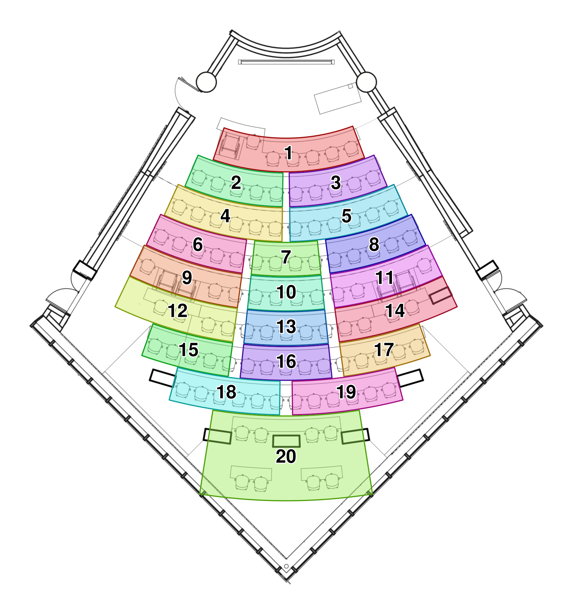

```{python}
#| echo: false
# Shared setup for every figure in this deck.
import numpy as np
import polars as pl
from plotnine import *

ORANGE = "#f9461c"
DARK = "#c83214"
INK = "#1a1a1a"
TEAL = "#1f8a9b"   # secondary accent for the deck

def note(x, y, text, ha="left", color=INK, size=13):
    """A text annotation in the deck's type and colors."""
    return annotate("text", x=x, y=y, label=text, ha=ha, size=size, color=color)

def upto(df, col, levels, k, on=0.8):
    """Alpha column: `on` for the first k levels of `col`, 0 for the rest.

    Used with scale_alpha_identity() to render a faceted figure several times
    with the later panels blank. Every panel frame and axis is still computed
    from the full data, so overlaying the versions in an .r-stack fills the
    panels in one at a time without the layout shifting.
    """
    return df.with_columns(
        pl.when(pl.col(col).cast(pl.Utf8).is_in(levels[:k]))
          .then(on).otherwise(0.0).alias("a"))
```


# Week 4 Slide Deck {.course-title}

<h2>Exploratory analysis; Descriptive statistics</h2>

Jack Bandy
2026


# Week 4, Day 1 {.course-title .photo-title data-state="photo-title" background-image="../assets/orange-line-stops-better/stop04-washington-wells-b.jpg" background-size="cover"}

<h2>Exploratory Data Analysis</h2>

CS 418 · Week 4 · 🟠 Washington/Wells 🟠

---

## {.photo-only data-state="photo-only" background-image="../assets/orange-line-stops-better/stop04-washington-wells-b.jpg" background-size="cover"}

---

## Map {.split}

::: {.split-content .narrow-aside}

::: {}
- Week 4: Washington/Wells
- Day 1
    - Random Roll Call
    - Group Project Intros
    - The Ethos of EDA
    - Homework 5
:::

{.figure alt="Orange Line map with the Washington/Wells stop marked, the Week 4 stop"}

:::

---

## Random Roll Call {.iframe-slide}
<div class="random-draw" data-num="12" data-min="1" data-max="62">
<div class="random-draw-frame">
<div class="random-draw-numbers" role="status" aria-live="polite" data-placeholder="Press “Draw” for 12 random numbers between 1 and 62."></div>
</div>
<p class="random-draw-controls"><button type="button" class="random-draw-button">Draw</button> <label class="random-draw-sort"><input type="checkbox" class="random-draw-sort-input"> Sort</label> <span class="random-draw-status"></span></p>
</div>

<style>
.random-draw { display: flex; flex-direction: column; flex: 1; min-height: 0; }
.random-draw-frame { flex: 1; min-height: 0; display: flex; justify-content: center; }
.random-draw-numbers { height: 100%; aspect-ratio: 1.618 / 1; max-width: 100%; border: 1px solid #999; display: grid; grid-template-columns: repeat(6, 1fr); grid-template-rows: repeat(2, 1fr); place-items: center; }
.random-draw-numbers .random-draw-number { font-size: 3rem; font-weight: 700; line-height: 1; }
.random-draw-numbers .random-draw-placeholder { grid-column: 1 / -1; grid-row: 1 / -1; text-align: center; font-size: 1.4rem; color: #555; padding: 0 1.5em; }
.random-draw-controls { flex: none; margin: 12px 0 0; }
.random-draw-button { font: inherit; font-size: 1.1rem; font-weight: 600; padding: 0.3em 1.2em; border: none; border-radius: 3px; background: #f9461c; color: #fff; cursor: pointer; }
.random-draw-button:hover:not(:disabled) { background: #e03c14; }
.random-draw-button:disabled { opacity: 0.6; cursor: default; }
.random-draw-sort { font-size: 1rem; color: #555; margin-left: 0.75em; cursor: pointer; }
.random-draw-status { font-size: 1rem; color: #555; margin-left: 0.75em; }
</style>

<script>
(() => {
  // The Sequence Generator, not the Integer Generator: /integers/ samples *with*
  // replacement and silently ignores a `unique` parameter, so a roll call could
  // name the same student twice. /sequences/ returns a shuffled permutation of
  // min..max, and the first `num` of that is a sample without replacement.
  const API = "https://www.random.org/sequences/";
  function setup(root) {
    if (root.dataset.wired) return;
    root.dataset.wired = "1";
    const out = root.querySelector(".random-draw-numbers");
    const button = root.querySelector(".random-draw-button");
    const status = root.querySelector(".random-draw-status");
    const sortBox = root.querySelector(".random-draw-sort-input");
    const num = root.dataset.num, min = root.dataset.min, max = root.dataset.max;
    const url = API + "?min=" + min + "&max=" + max + "&col=1&format=plain&rnd=new";
    let drawn = null;
    function placeholder(text) {
      out.innerHTML = "";
      const p = document.createElement("div");
      p.className = "random-draw-placeholder";
      p.textContent = text;
      out.appendChild(p);
    }
    function render() {
      if (!drawn) return;
      const numbers = sortBox.checked ? drawn.slice().sort(function (a, b) { return a - b; }) : drawn;
      out.innerHTML = "";
      numbers.forEach(function (n) {
        const cell = document.createElement("div");
        cell.className = "random-draw-number";
        cell.textContent = n;
        out.appendChild(cell);
      });
    }
    function draw() {
      button.disabled = true;
      status.textContent = "drawing from random.org…";
      fetch(url, { cache: "no-store" })
        .then(function (r) { if (!r.ok) throw new Error("HTTP " + r.status); return r.text(); })
        .then(function (text) {
          const numbers = text.trim().split(/\s+/).filter(Boolean).map(Number);
          if (!numbers.length) throw new Error("empty response");
          drawn = numbers.slice(0, Number(num));
          render();
          status.textContent = "true random numbers from random.org";
        })
        .catch(function (err) {
          drawn = null;
          placeholder("Could not reach random.org (" + err.message + "). Open the draw in a new tab instead.");
          status.textContent = "";
        })
        .then(function () { button.disabled = false; });
    }
    button.addEventListener("click", draw);
    sortBox.addEventListener("change", render);
    placeholder(out.dataset.placeholder);
  }
  function init() {
    document.querySelectorAll(".random-draw").forEach(setup);
  }
  if (document.readyState === "loading") {
    document.addEventListener("DOMContentLoaded", init);
  } else {
    init();
  }
})();
</script>

::: {.iframe-caption}
Numbers drawn live from <a href="https://www.random.org/sequences/?min=1&max=62&col=1&format=plain&rnd=new">random.org/sequences/?min=1&max=62&col=1&format=plain&rnd=new</a> &mdash; a shuffled 1&ndash;62, first 12 taken, so no one is drawn twice
:::


# Group Project Topics! {.section-header}

<style>
/* The overview slide: every topic name in two columns. 0.79em is the largest
   size at which the 22 names (two columns, the longest name wrapping) still
   clear the deck's autofit floor — footer top minus 12px, 656px at the 1280x720
   design size — with the 0.3em gaps below; measured in a rendered deck. */
.reveal .topic-list ul { columns: 2; column-gap: 56px; font-size: 0.79em; line-height: 1.3; padding-left: 1.1em; margin-bottom: 0; }
/* The .slide in the middle of this selector is load-bearing: Quarto injects
   .reveal .slide ul li { margin-top: .4em; margin-bottom: .2em } into every
   deck at (0,2,2), which silently beat .reveal .topic-list li at (0,2,1) —
   the margins below never applied. Matching .slide puts this at (0,3,1), the
   same fix the theme uses for .dense. */
.reveal .slide .topic-list li { break-inside: avoid; margin: 0 0 0.3em; }
/* The group number each topic belongs to, as students signed up. */
.reveal .topic-list .gn, .reveal .group-slide h2 .gn { color: #f9461c; font-weight: 700; margin-right: 0.45em; font-variant-numeric: tabular-nums; }
/* One slide per topic, titled with the topic name, questions below it in the
   theme's .dense size. Capped below the deck's 3.5rem slide title so the
   longest names still land in two lines, leaving the questions the rest. */
.reveal .group-slide h2 { font-size: 2.6rem; line-height: 1.1; }
</style>

---

## The Topics

::: {.topic-list}
- [2]{.gn} Trains and Public Transit
- [3]{.gn} Chicago Housing Analytics
- [4]{.gn} Chicago Traffic Analytics
- [5]{.gn} Comparing Democracies
- [6]{.gn} Economic Trajectories
- [7]{.gn} Effect(s) of Surveillance Cameras on Public Safety
- [8]{.gn} Effects of Commuting on Quality of Life
- [9]{.gn} Exercise and Fitness Analytics (Personal)
- [10]{.gn} External Impacts of Belief Systems
- [11]{.gn} Grocery Stores as Public Health
- [12]{.gn} Film Analytics
- [13]{.gn} Socioeconomic Health Disparities
- [14]{.gn} Learning With/Without AI
- [15]{.gn} Music Analytics
- [16]{.gn} News and Media Framing
- [17]{.gn} Social Media and Society
- [18]{.gn} Relationships and Mental Health
- [19]{.gn} Sports and Performance Analytics (Professional)
- [20]{.gn} "Not sure yet!"
:::

---

## [2]{.gn} Trains and Public Transit {.group-slide}

::: {.dense}
- Which BNSF trains/routes are often the most delayed/latest, and when does this happen most?
- Does public transit reliability vary across Chicago neighborhoods, and what factors drive those differences?
- Do different weather conditions increase public transit delays, such as CTA, Metra, etc. in major cities?
- Can historical transit data be used to predict when and where bus bunching will occur?
- What circumstances are most likely to result in unreported, missing ghost buses?
:::

---

## [3]{.gn} Chicago Housing Analytics {.group-slide}

::: {.dense}
- Which factors best explain why housing prices increase faster in some Chicago neighborhoods than others?
- Does living near a CTA station affect home sale prices in Cook County?
- Does the price of homes in the Cook Country increase if there is an L-Stop nearby or it is similar?
- Which neighborhood-level indicators best predict future increases in commercial rents, property values, and business activity?
:::

---

## [4]{.gn} Chicago Traffic Analytics {.group-slide}

::: {.dense}
- What are the leading causes of traffic accidents? Which locations in Chicago have the most traffic accidents?
- What factors are associated with traffic accident severity in Chicago?
- Which characteristics of Chicago intersections are associated with higher numbers of pedestrian or cyclist crashes?
- How does traffic volume on I-290 in Chicago vary throughout the day, and what proportion of weekday traffic occurs during the 7–9 a.m. morning rush hour?
:::

---

## [5]{.gn} Comparing Democracies {.group-slide}

::: {.dense}
- Do democratic countries with mandatory voting have a greater democratic health index than countries with no such measures?
- Do democratic countries with mandatory voting measures exhibit higher levels of civic engagement compared to countries with no such measures?
- Do more voters in democratic countries with mandatory voting measures (see above definition) report feeling more informed and knowledgeable about candidates on the ballot compared to voters in countries with no such measures?
- Are people who grow up in eastern countries more generous than their western world counterparts?
:::

---

## [6]{.gn} Economic Trajectories {.group-slide}

::: {.dense}
- How do tariffs directly affect job hirings?
- How have entry-level software job postings changed in terms of required skills and experience over the past several years?
- To what degree does the median income of a child's neighborhood predict their median yearly income as an adult?
- Is the economy showing symptoms of being in a AI debt bubble? Is this race towards AI and Data Centers economically viable?
:::

---

## [7]{.gn} Effect(s) of Surveillance Cameras on Public Safety {.group-slide}

::: {.dense}
- Does surveillance camera in public areas reduce the crime rate in its region?
- Do flock cameras actually reduce or solve crime? How are these locations chosen and are there demographics or sociopolitical patterns?
- Do speed cameras actually stop crashes, or do they just make the crashes move to a different location?
- Does being watched change behavior even when nothing is forbidden?
:::

---

## [8]{.gn} Effects of Commuting on Quality of Life {.group-slide}

::: {.dense}
- Coming from a perspective as a student commuter, how does commuting affect college students attendance, academic performance, sleep, and/or stress levels?
- How does commute time relate to class attendance and academic performance among college students?
- How does the amount of time college students spend commuting affect how involved they are in activites or orgs on campus and their sense of connection to the university spirit?
- Do work hours affect grades for students who commute?
:::

---

## [9]{.gn} Exercise and Fitness Analytics (Personal) {.group-slide}

::: {.dense}
- does higher daily strain or training load (as measured by whoop/garmin) predict a measurable dip in recovery metrics (hrv, resting hr) in the following 24-48 hours, and does this relationship differ between trained athletes and casual users?
- do rest days genuinely restore hrv and resting heart rate to baseline, or does recovery lag behind the number of rest days taken, and does this lag get worse with age or fitness level?
- how does sleep quality (time in deep/rem stages, consistency of sleep/wake times) tracked by wearables like fitbit or whoop relate to next-day resting heart rate and hrv?
- Does the time of day or day of the week a person typically works out predict their long-term gym attendance consistency?
:::

---

## [10]{.gn} External Impacts of Belief Systems {.group-slide}

::: {.dense}
- Does believing in afterlife change the way societies value human lives?
- How much of human intelligence is shaped from the languages we think in?
- Are people who grow up in eastern countries more generous than their western world counterparts?
- Is reading fiction more helpful than reading non fiction for general life performance? (TBD measure again)
:::

---

## [11]{.gn} Grocery Stores as Public Health {.group-slide}

::: {.dense}
- Does a grocery store closing actually change what people eat nearby?
- Does living closer to dollar stores instead of grocery stores impact chronic health issues more than just the areas household income?
- How does access to green space affect mental health and physical activity in urban communities?
- How does nutrition and lifestyle affect the amount of young adults being diagnosed with colon cancer?
:::

---

## [12]{.gn} Film Analytics {.group-slide}

::: {.dense}
- Can we predict whether a movie will be commercially successful before its release?
- How do factors such as budget, ratings, etc influence a movies financial success?
- Which features — cast, genre, runtime, release window — best predict how highly audiences rate a film, rather than how much money it makes?
- Do actor and director collaboration networks predict which films get made, and which of them succeed?
- Which recommendation strategy actually works better: "people who liked this also liked…", or matching on genre, cast, and crew?
- How much do critic scores and audience scores agree, and which genres do they disagree about most?
- Have the genres major studios release changed over the past few decades, and does that track what audiences rate highest?
- Do sequels and franchise entries outperform original films once you account for budget?
:::

---

## [13]{.gn} Socioeconomic Health Disparities {.group-slide}

::: {.dense}
- Does Chicago's air pollution burden track income of people and does the answer depend on which particulate matter you look at?
- How does maternal mortality within 1 year of giving birth differ by race in the United States?
- How, if at all, does air quality correlate with rates of pulmonary and cardiovascular issues in Chicago neighborhoods?
- Is there a correlation between neighborhood air pollution, poverty, and neighborhood demographics?
:::

---

## [14]{.gn} Learning With/Without AI {.group-slide}

::: {.dense}
- How does the use of artificial intelligence tools, such as ChatGPT, affect college students' academic performance and study habits?
- How has the use of AI in a classroom setting affected student performance?
- Does the tolerance (as opposed to dismissal) of AI usage in classrooms improve the final exam scores?
- How do longer study sessions compare to shorter ones when studying for exams?
:::

---

## [15]{.gn} Music Analytics {.group-slide}

::: {.dense}
- What actually makes a song a summer hit and does the formula change?
- What factors contribute to a song becoming a summer hit, and how have these factors changed over time?
- Does music listening actually change with the seasons?
- How does the popularity of a song, such as its download count, affect whether people choose to download and listen to it?
:::

---

## [16]{.gn} News and Media Framing {.group-slide}

::: {.dense}
- How does the tone of international media coverage shape understanding of conflicts in Palestine?
- Do a missing persons race, age, gender, and location affect how much news coverage they get and how fast their case is solved?
- How does the sentiment and framing of media coverage about proposed public transit expansions relate to public support for those projects?
- How fast do social media algorithms start recommending extreme political content to a brand new account?
:::

---

## [17]{.gn} Social Media and Society {.group-slide}

::: {.dense}
- How does the presence and activity of bots on social media platforms affect user polarization?
- Does social media actually diversify your perspective, or does it keep you in a bubble, giving you a false perception that youre being exposed to a wider range of perspectives and cultures?
- How does social media use relate to anxiety among young adults, and does the type of social media use make a difference?
- Does social media affect different generations mental health?
:::

---

## [18]{.gn} Relationships and Mental Health {.group-slide}

::: {.dense}
- How does having a strong relationship with parents influence one's self-esteem and ability to form positive relationships with peers and friends?
- How do the people someone surrounds themselves with affect their academic motivation, career goals, and overall outlook on life?
- People with which personality traits are more likely to suffer from mental health problems?
- How do analog hobbies affect a person's mental health?
:::

---

## [19]{.gn} Sports and Performance Analytics (Professional) {.group-slide}

::: {.dense}
- Do teams with higher player payrolls have better winning records than teams with lower payrolls?
- Do EPL clubs display more long-term dominance than NFL teams?
- How does a soccer team's possession percentage affect its chances of winning a match?
- How significantly have major Formula 1 regulation changes disrupted the competitive order and how does the 2026 regulation change compare with previous eras?
:::

---

## Zones {.split}

::: {.split-content .golden-columns}

::: {.dense}
- Each tentative topic gets a **zone** for today
- Find the zone for the topic you want (and move there)
- Not sure yet? Come to the back ("zone 20")
:::

{.figure alt="Floor plan of UIC Lecture Center C001 with the seating divided into numbered zones, one per group project topic"}
:::

---

## Group Project Intros {.split}

::: {.split-content .narrow-aside}

::: {}

Meet the people in your zone:

* What is your name?
* Why this topic?
* Anything you want to know before committing to this topic?
* Preferred communication?
* Anything else?
:::

<iframe src="https://dodatascience.fun/timer/" title="CTA-style countdown timer" loading="lazy" style="width: 100%; height: 420px; display: block; border: 1px solid #999; box-shadow: 0 10px 28px rgba(0,0,0,0.12); border-radius: 3px;"></iframe>

:::


# The Ethos of Exploratory Data Analysis {.section-header}

---

## The Data Science Lifecycle {.image-frame-slide}


::: {.caption}
Exploratory data analysis can be thought of within the **understand the data** stage of the data science lifecycle.
:::

---

## What is Exploratory Data Analysis?

- Exploratory Data Analysis (EDA): analyzing data simply to better understand it, discover patterns, identify potential issues, and determine the best approach for building predictive models.
- The main tools of exploratory data analysis are:
  - **Summary Statistics** (spread, counts, central tendency, etc.)
  - **Descriptive Visualization** (histograms, box plots, scatter plots, more to discuss next week)

---

## Exploratory vs. Confirmatory

::: {.incremental}
- EDA was promoted by statistician **John Tukey** as a contrast to **confirmatory data analysis**, which involves more modeling and hypothesis testing.
- In EDA, there is **no hypothesis** and **no model**.
- We just want to gain intuition about the data.
- Not seeking to confirm anything
:::

---

## Tukey on EDA {.quote-slide}

> "Exploratory data analysis" is an attitude, a state of flexibility, a willingness to look for those things that we believe are not there, as well as those we believe to be there.

::: {.attribution}
John W. Tukey
:::

::: {.quote-source}
*The Collected Works of John W. Tukey*, Vol. IV, ed. Lyle V. Jones (1986), p. 806 — quoted and sourced in [Brillinger, "Data Analysis, Exploratory" (2011)](https://www.stat.berkeley.edu/~brill/Papers/EDASage.pdf)
:::

---


## Steps

Six conventional steps of exploratory data analysis:

::: {.incremental}
1. Data Collection and Loading (setting up your environment)
2. Summary Statistics (*describe()* using polars)
3. Handling anomalies (e.g. missing data)
4. Understanding the shape of the data
5. Detecting outliers
6. Correlation Analysis
:::

---

## Discovering and handling anomalies

Categories include:

::: {.incremental}
- Missing values (e.g. nulls, N/A, NaN)
- Duplicates (multiple rows with same values)
- Inconsistent formatting (e.g. "yyyy/dd/mm" vs "mm/dd/yyyy")
- Wrong data types (dates stored as strings, numbers stored as strings)
- Invalid values (e.g. age = 350)
- Structure issues (mixed units: miles vs km)
:::

---

## Exploring data with polars
Some exploratory methods built into polars:

::: {.incremental}
- `df.shape` — the dimensions of the dataframe (number of rows, number of columns)
- `df.glimpse()` — name, type, and first values of each feature
- `df.null_count()` — how many missing values each feature has
- `df.describe()` — summary statistics (count, null count, mean, standard deviation, min/max, and quartiles) for each feature
:::

```python
import polars as pl
df = pl.read_csv('ages.csv')
print(df.shape)
# (3, 2)
```

---

## What happens if you call `.describe()` on a column of strings? {.smaller}

::: {.aside-note}
`count` and `null_count` work on any type, and `min`/`max` fall back to alphabetical order.
:::

:::: {.columns}

::: {.column width="42%"}
```python
import polars as pl

df = pl.DataFrame({
    "name": ["Ana", "Ben", "Cleo", "Dee"],
    "line": ["Orange", "Blue", "Orange", None],
    "age":  [19, 21, 20, 22],
})

df.describe()
```
:::

::: {.column width="58%"}
```
shape: (9, 4)
┌────────────┬──────┬────────┬──────────┐
│ statistic  ┆ name ┆ line   ┆ age      │
│ ---        ┆ ---  ┆ ---    ┆ ---      │
│ str        ┆ str  ┆ str    ┆ f64      │
╞════════════╪══════╪════════╪══════════╡
│ count      ┆ 4    ┆ 3      ┆ 4.0      │
│ null_count ┆ 0    ┆ 1      ┆ 0.0      │
│ mean       ┆ null ┆ null   ┆ 20.5     │
│ std        ┆ null ┆ null   ┆ 1.290994 │
│ min        ┆ Ana  ┆ Blue   ┆ 19.0     │
│ 25%        ┆ null ┆ null   ┆ 20.0     │
│ 50%        ┆ null ┆ null   ┆ 21.0     │
│ 75%        ┆ null ┆ null   ┆ 21.0     │
│ max        ┆ Dee  ┆ Orange ┆ 22.0     │
└────────────┴──────┴────────┴──────────┘
```
:::

::::


---


## Questions to Guide Exploration

::: {.aside-note}
*Learning Data Science*, [Section 10.5: Guidelines for Exploration](https://learningds.org/ch/10/eda_guidelines.html)
:::
::: {.incremental}
- How are the values of **feature X** distributed?
- How do **X** and **Y** relate to each other?
- Is the distribution of **X** the same across subgroups defined by **Z**?
- Are there unusual observations in **X**? In the pair **(X, Y)**? In **X** within a subgroup of **Z**?
:::


---

## "What Next?" and "So What?"

::: {.aside-note}
*Learning Data Science*, [Section 10.5: Guidelines for Exploration](https://learningds.org/ch/10/eda_guidelines.html).
:::

- Use answers to point at the next question
- Do you have reason to expect an observed difference?
- What additional comparison could be helpful?
- Check with a domain expert if possible!


---

## Any questions?

- PrairieLearn Homeworks?
- Coding exercise 00?
- Group Projects?
- Other logistics?

---

## Upload your worksheet

Take a picture of your worksheet, upload it in Canvas


# Homework 5 {.section-header}

## Homework 5 {.split}

::: {.split-content .narrow-aside .fill-height}

::: {.dense}
- Part I: review of weeks 2–4 (Bayesian vs. frequentist, feature types, Bayes' Theorem)
- Part II: defining exploratory analysis
- Part III: a preview of next week — choosing a visualization
:::

{.figure .figure-sm alt="The PrairieLearn logo, a white line drawing of a purple coneflower on a dark blue panel"}

:::


# Week 4, Day 2 {.course-title .photo-title data-state="photo-title photo-title-zoom" background-image="../assets/orange-line-stops-better/stop04-washington-wells-b.jpg" background-size="cover"}

<h2>Scraping, EDA, and Why We Visualize</h2>

Jack Bandy
2026

---

## Map {.split}

::: {.split-content .narrow-aside}

::: {.dense}
- Week 4: Washington/Wells
- Day 2
    - Whirlwind demo: how to scrape a website
    - Mechanics of EDA
    - Chebyshev's bounds
    - Anatomy of Bayes' Theorem
    - A motivating visualization
    - Coding Exercise 01
:::

{.figure alt="Orange Line map with the Washington/Wells stop marked, the Week 4 stop"}

:::


# Whirlwind Demo: How to Scrape a Website {.section-header}

---

## Basic steps to scraping a website

::: {.aside-note}
Week 2 covered *whether* to scrape — APIs first, terms of service, [*Sandvig v. Barr*](https://www.aclu.org/sites/default/files/field_document/sandvig_opinion.pdf). This is the *how*.
:::

::: {.incremental}
1. **Request** the page — ask the server for the HTML, the same way a browser does
2. **Parse** that HTML into a tree you can search
3. **Select** the elements that hold the values you want
4. **Extract** the text, one row per observation
5. **Stamp** the row with the time you collected it — a scrape is a *snapshot*, not a fact
6. **Save** a tidy file you can re-read later
:::

---

## Our Target: CTA Train Tracker at UIC-Halsted {.smaller}

::: {.aside-note}
[CTA Train Tracker — UIC-Halsted arrival estimates](https://www.transitchicago.com/traintracker/arrivaltimes/?sid=40350) (`sid=40350`). No login, no API key, one page per station.
:::

:::: {.columns}

::: {.column width="42%"}
[WHAT A RIDER SEES]{.eyebrow}

> **Service toward O'Hare**
>
> Blue Line #143 to O'Hare &nbsp;&nbsp; **10** min

- The page is *live*: the same URL says something different a minute from now
- Nothing on it is stored for you — if you want history, you have to keep it
:::

::: {.column width="58%"}
[WHAT THE HTML SAYS]{.eyebrow}

```html
<div class="estimated-arrivals-subheader">
  Service toward O'Hare
</div>

<a class="estimated-arrivals-line blue-line">
  <span class="ea-line-title-top">
    Blue Line #143 to
  </span>
  <span class="ea-line-time">
    <span class="ea-line-time-big">10</span> min
  </span>
</a>
```

- Those **class names** are our selectors
- The direction is a **heading**, not a field: it sits *above* the trains it applies to, and is never repeated inside one
:::

::::

---

## Step 1–2: Request and Parse {.smaller}

```python
from datetime import datetime
import polars as pl
import requests
from bs4 import BeautifulSoup

URL = "https://www.transitchicago.com/traintracker/arrivaltimes/?sid=40350"

html = requests.get(URL).text       # 1. request: the raw HTML, as a string
collected = datetime.now()          # ...and when we asked, to the second
soup = BeautifulSoup(html, "html.parser")   # 2. parse: a searchable tree
```

::: {.fragment}
- `requests.get(URL).text` is the whole page
    - about 250 KB of markup for nine arrival times
- Record `collected` (datetime) **right next to the request**
- timestamp: when the server answered.
:::

---

## Step 3–4: Select and Extract {.smaller}

```python
rows = []
direction = None

for tag in soup.select(".estimated-arrivals-subheader, .estimated-arrivals-line"):
    if "estimated-arrivals-subheader" in tag["class"]:
        # this heading signals where the data is
        direction = tag.get_text(strip=True).removeprefix("Service toward ")
    else:
        # one train as one row in the table
        run = tag.select_one(".ea-line-title-top").get_text(strip=True)
        rows.append({
            "run": run.split("#")[1].split()[0],                     # "130"
            "direction": direction,                                  # "O'Hare"
            "collected": collected,                                  # 2026-09-15 20:19
            "shown": tag.select_one(".ea-line-time").get_text(" ", strip=True),
        })
```

`soup.select(...)` takes a **CSS selector** and returns matches in document order — which is what lets one loop handle headings and trains together.

---

## Step 5–6: Build the Frame and Save It {.smaller}

```python
df = pl.DataFrame(rows)
df.write_csv("arrivals.csv")
```

```
shape: (9, 4)
┌─────┬─────────────┬─────────────────────┬────────┐
│ run ┆ direction   ┆ collected           ┆ shown  │
│ --- ┆ ---         ┆ ---                 ┆ ---    │
│ str ┆ str         ┆ datetime[μs]        ┆ str    │
╞═════╪═════════════╪═════════════════════╪════════╡
│ 130 ┆ O'Hare      ┆ 2026-09-15 20:19:00 ┆ Due    │
│ 143 ┆ O'Hare      ┆ 2026-09-15 20:19:00 ┆ 10 min │
│ 226 ┆ O'Hare      ┆ 2026-09-15 20:19:00 ┆ 18 min │
│ 144 ┆ O'Hare      ┆ 2026-09-15 20:19:00 ┆ 24 min │
│ 132 ┆ Forest Park ┆ 2026-09-15 20:19:00 ┆ 3 min  │
│ 133 ┆ Forest Park ┆ 2026-09-15 20:19:00 ┆ 12 min │
│ 217 ┆ Forest Park ┆ 2026-09-15 20:19:00 ┆ 21 min │
│ 134 ┆ Forest Park ┆ 2026-09-15 20:19:00 ┆ 33 min │
│ 234 ┆ Forest Park ┆ 2026-09-15 20:19:00 ┆ 45 min │
└─────┴─────────────┴─────────────────────┴────────┘
```


---

## Now Make It Answer a Question {.smaller}

`shown` is what the sign said, but to check whether the sign was right, we need something else:

```python
arrivals = (
    df
    .with_columns(
        # "10 min" -> 10 ; "Due" has no digits, so it parses to null -> 0
        pl.col("shown").str.extract(r"(\d+)").cast(pl.Int64)
          .fill_null(0).alias("minutes")
    )
    .with_columns(
        (pl.col("collected") + pl.duration(minutes=pl.col("minutes"))).alias("expected")
    )
)
```

::: {.fragment}
```
│ collected           ┆ shown  ┆ minutes ┆ expected            │
╞═════════════════════╪════════╪═════════╪═════════════════════╡
│ 2026-09-15 20:19:00 ┆ Due    ┆ 0       ┆ 2026-09-15 20:19:00 │
│ 2026-09-15 20:19:00 ┆ 10 min ┆ 10      ┆ 2026-09-15 20:29:00 │
│ 2026-09-15 20:19:00 ┆ 45 min ┆ 45      ┆ 2026-09-15 21:04:00 │
```

8:14pm&nbsp;+&nbsp;5&nbsp;min&nbsp;→&nbsp;**8:19pm**. `expected` is a prediction with a timestamp on it
:::

---


## Scraping Notes {.smaller}

:::
- **Be polite.** One request a minute or so. Check `/robots.txt`; set a `User-Agent` that says who you are.
- **The markup will change.** Class names change and scrapers "rot"
- **`Due` is not a number.**
- **Save the raw HTML**, at least while developing. Re-parsing a saved file is free, but you can never re-requesting a live page.
- **If the numbers appear only after JavaScript runs**, `requests` will not see them, so you would need a real browser engine 👀
:::


# Mechanics of EDA {.section-header}

---

## Four Methods and One Attribute {.smaller}

::: {.aside-note}
The same five moves in both libraries [polars](https://docs.pola.rs/api/python/stable/reference/dataframe/index.html) and [pandas](https://pandas.pydata.org/docs/reference/frame.html).
:::

| What you want to know | polars | pandas |
| --- | --- | --- |
| How big is the dataset? | `df.shape` &nbsp;*(attribute)* | `df.shape` |
| What do the rows look like? | `df.head()` | `df.head()` |
| What are the columns and types? | `df.glimpse()` | `df.info()` |
| What is missing? | `df.null_count()` | `df.isna().sum()` |
| What are the numbers like? | `df.describe()` | `df.describe()` |

::: {.fragment style="margin-top:0.5em;"}
Note: `shape` is an **attribute**, not a method! `df.shape`, not `df.shape()`. It is a plain tuple the frame already knows; the other four have to go do work.
:::

---


## Descriptive vs. Inferential Statistics

:::: {.columns}
::: {.column width="50%"}
::: {.fragment}
**Descriptive statistics**

Summarize data about a *sample* drawn from a population.

- Measures of central tendency (mean, median, mode)
- Measures of dispersion or spread (range, standard deviation, variance)
:::
:::

::: {.column width="50%"}
::: {.fragment}
**Inferential statistics**

Use information from the sample to draw conclusions about the population.
:::
:::
::::


---


## Standard Deviation as "Typical Distance" {.text-figure-slide}

:::: {.columns}
::: {.column width="38%"}
::: {style="font-size:0.82em; padding-right:24px;"}
- Each line is one value's distance from the mean.
- Square them, average, take the root: that is $s$.
- $s \approx 5.7$ — the **typical** distance, in years.
- The shaded band is $\bar{x} \pm s$.
:::
:::
::: {.column width="62%"}
```{python}
#| echo: false
#| fig-width: 5.3
#| fig-height: 4.0
#| fig-alt: "Five ages plotted as orange dots with a horizontal line at the mean of 28; a vertical segment runs from each dot down or up to that line, and a shaded band one standard deviation either side of the mean covers three of the five dots"
ages = np.array([24., 35., 32., 21., 28.])
m = ages.mean()
s = ages.std(ddof=1)

(ggplot(pl.DataFrame({"i": np.arange(1., 6.), "a": ages}), aes("i", "a"))
 + annotate("rect", xmin=0.5, xmax=5.5, ymin=m - s, ymax=m + s, fill=TEAL, alpha=0.13)
 + geom_segment(aes(x="i", xend="i", y="a"), yend=m, color=DARK, size=0.8, alpha=0.85)
 + annotate("segment", x=0.5, xend=5.5, y=m, yend=m, color=INK, size=0.9)
 + geom_point(color=ORANGE, size=5)
 + note(5.7, m, "mean 28")
 + note(5.7, m + s, "+1 s", color=TEAL, size=12)
 + note(5.7, m - s, "−1 s", color=TEAL, size=12)
 + scale_x_continuous(limits=(0.4, 7.4))
 + scale_y_continuous(limits=(19, 37), breaks=[20, 24, 28, 32, 36])
 + labs(y="age")
 + theme_minimal(base_size=14)
 + theme(axis_title_x=element_blank(), axis_text_x=element_blank(),
         panel_grid_major_x=element_blank(), panel_grid_minor=element_blank(),
         axis_title_y=element_text(rotation=0), figure_size=(5.3, 4.0)))
```
:::
::::

---

## Anatomy of a Box Plot {.figure-slide}

```{python}
#| echo: false
#| fig-width: 10
#| fig-height: 4.4
#| fig-alt: "A single vertical box plot annotated with its parts: the box spanning Q1 to Q3 labelled as the interquartile range holding 50% of the data, the median line inside it, whiskers reaching the last points within 1.5 times the IQR, and three outlier dots above the upper whisker"
rng = np.random.default_rng(7)
vals = np.concatenate([rng.normal(30, 11, 220), [70, 74, 79]])
q1, med, q3 = np.percentile(vals, [25, 50, 75])
iqr = q3 - q1
lo = vals[vals >= q1 - 1.5 * iqr].min()
hi = vals[vals <= q3 + 1.5 * iqr].max()
box = pl.DataFrame({"x": np.zeros(len(vals)), "v": vals})

(ggplot(box, aes("x", "v"))
 + geom_boxplot(width=0.5, fill=ORANGE, alpha=0.22, color=DARK,
                outlier_color=DARK, outlier_size=2.5)
 + annotate("segment", x=-0.12, xend=0.12, y=lo, yend=lo, color=DARK)
 + annotate("segment", x=-0.12, xend=0.12, y=hi, yend=hi, color=DARK)
 + annotate("segment", x=-0.52, xend=-0.52, y=q1, yend=q3, color=INK)
 + annotate("segment", x=-0.56, xend=-0.48, y=q1, yend=q1, color=INK)
 + annotate("segment", x=-0.56, xend=-0.48, y=q3, yend=q3, color=INK)
 + note(-0.62, (q1 + q3) / 2, "IQR\n50% of the data", ha="right", size=14)
 + note(0.3, q3, "Q3 — upper quartile", size=14)
 + note(0.3, med, "Median (Q2)", size=14)
 + note(0.3, q1, "Q1 — lower quartile", size=14)
 + note(0.3, hi, "Whisker — last point within 1.5 × IQR", size=14)
 + note(0.3, vals.max(), "Outliers", color=DARK, size=14)
 + scale_x_continuous(limits=(-1.25, 1.55))
 + theme_void()
 + theme(figure_size=(10, 4.4)))
```

---

## The 1.5 × IQR Fence {.text-figure-slide}

:::: {.columns}
::: {.column width="38%"}
::: {style="font-size:0.82em; padding-right:24px;"}
- The fences sit $1.5 \times \text{IQR}$ beyond Q1 and Q3.
- Whiskers stop at the last point **inside** the fence.
- Anything past it gets drawn as its own dot.
:::
:::
::: {.column width="62%"}
```{python}
#| echo: false
#| fig-width: 5.3
#| fig-height: 4.0
#| fig-alt: "A vertical box plot inside a shaded band running from Q1 minus 1.5 times the IQR to Q3 plus 1.5 times the IQR, with dashed lines marking both fences and five points outside them drawn as individual dots labelled as flagged outliers"
rng = np.random.default_rng(3)
v = np.concatenate([rng.normal(50, 9, 150), [88, 92, 14]])
q1, q3 = np.percentile(v, [25, 75])
iqr = q3 - q1
lo, hi = q1 - 1.5 * iqr, q3 + 1.5 * iqr

(ggplot(pl.DataFrame({"x": np.zeros(len(v)), "v": v}), aes("x", "v"))
 + annotate("rect", xmin=-0.9, xmax=0.9, ymin=lo, ymax=hi, fill=TEAL, alpha=0.10)
 + geom_boxplot(width=0.45, fill=ORANGE, alpha=0.22, color=DARK,
                outlier_color=DARK, outlier_size=2.5)
 + annotate("segment", x=-0.9, xend=0.9, y=lo, yend=lo, color=TEAL, linetype="dashed")
 + annotate("segment", x=-0.9, xend=0.9, y=hi, yend=hi, color=TEAL, linetype="dashed")
 + note(0.95, hi, "Q3 + 1.5 × IQR", color=TEAL, size=12)
 + note(0.95, lo, "Q1 − 1.5 × IQR", color=TEAL, size=12)
 + note(0.95, 98, "flagged as outliers", color=DARK, size=12)
 + scale_x_continuous(limits=(-1.0, 2.7))
 + scale_y_continuous(limits=(5, 105))
 + labs(y="value")
 + theme_minimal(base_size=14)
 + theme(axis_title_x=element_blank(), axis_text_x=element_blank(),
         panel_grid_major_x=element_blank(), panel_grid_minor=element_blank(),
         figure_size=(5.3, 4.0)))
```
:::
::::

---


## The Shape of a Distribution {.text-figure-slide}

:::: {.columns}
::: {.column width="38%"}
::: {.incremental style="font-size:0.82em; padding-right:24px;"}
- **Skew** is the direction the long tail points.
- "The mean chases the tail"
- Mean > median ("right-skewed")
- Mean ≈ median ("symmetric")
:::
:::
::: {.column width="62%"}
```{python}
#| echo: false
#| fig-width: 5.3
#| fig-height: 4.4
#| fig-alt: "Three stacked density curves — right-skewed, symmetric, and left-skewed — each with a solid line at the mean and a dashed line at the median; the two lines sit apart in the skewed panels, with the mean toward the long tail, and coincide in the symmetric panel"
rng = np.random.default_rng(5)
SHAPES = ["right-skewed", "symmetric", "left-skewed"]
shapes = pl.DataFrame({
    "shape": np.repeat(SHAPES, 600),
    "v": np.concatenate([rng.lognormal(0, 0.6, 600),
                         rng.normal(2, 0.6, 600),
                         4 - rng.lognormal(0, 0.6, 600)])}
).with_columns(pl.col("shape").cast(pl.Enum(SHAPES)))
centers = shapes.group_by("shape").agg(pl.col("v").mean().alias("mean"),
                                       pl.col("v").median().alias("median"))

(ggplot(shapes, aes("v"))
 + geom_density(fill=ORANGE, alpha=0.25, color=DARK, size=0.8)
 + geom_vline(centers, aes(xintercept="mean"), color=DARK, size=0.9)
 + geom_vline(centers, aes(xintercept="median"), color=TEAL, size=0.9, linetype="dashed")
 + facet_wrap("shape", ncol=1, scales="free")
 + labs(x="value", y="")
 + theme_minimal(base_size=13)
 + theme(strip_text=element_text(size=13, weight="bold", color=INK),
         axis_text_y=element_blank(), panel_grid_minor=element_blank(),
         figure_size=(5.3, 4.4)))
```
:::
::::

---

## Histograms and Bin Width {.text-figure-slide}

:::: {.columns}
::: {.column width="38%"}
::: {.incremental style="font-size:0.82em; padding-right:24px;"}
- Same 400 heights, three bin counts.
- Too few bins hides shape
- Too many bins shows noise.
- Good to try more than one bin width
:::
:::
::: {.column width="62%"}
```{python}
#| echo: false
#| fig-width: 5.3
#| fig-height: 4.4
#| fig-alt: "The same 400 heights drawn as three stacked histograms with 6, 20 and 60 bins; the 6-bin version is a coarse block, the 20-bin version shows a clean single peak, and the 60-bin version breaks into spiky counts"
rng = np.random.default_rng(9)
h = rng.normal(68, 3.2, 400)
LEVELS = ["6 bins", "20 bins", "60 bins"]

def counted(n, label):
    """One np.histogram per bin count, so a single geom_col draws all three panels."""
    cnt, edges = np.histogram(h, bins=n)
    return pl.DataFrame({"mid": (edges[:-1] + edges[1:]) / 2,
                         "count": cnt.astype(float),
                         "w": np.repeat(edges[1] - edges[0], n),
                         "bins": [label] * n})

bars = pl.concat([counted(n, lab) for n, lab in zip([6, 20, 60], LEVELS)]
                 ).with_columns(pl.col("bins").cast(pl.Enum(LEVELS)))

(ggplot(bars, aes("mid", "count"))
 + geom_col(aes(width="w"), fill=ORANGE, alpha=0.8, color="white", size=0.4)
 + facet_wrap("bins", ncol=1, scales="free_y")
 + labs(x="height (in)", y="count")
 + theme_minimal(base_size=13)
 + theme(strip_text=element_text(size=13, weight="bold", color=INK),
         panel_grid_minor=element_blank(), figure_size=(5.3, 4.4)))
```
:::
::::

---

## Standardize or Normalize? {.text-figure-slide}

:::: {.columns}
::: {.column width="38%"}
::: {.incremental style="font-size:0.82em; padding-right:24px;"}
- **Standardize** (z-score): $(x - \bar{x})/s$ — center 0, spread 1.
- **Normalize** (min–max): rescale onto $[0, 1]$.
- What changes in the picture(s)?
:::
:::
::: {.column width="62%"}
```{python}
#| echo: false
#| fig-width: 5.3
#| fig-height: 4.0
#| fig-alt: "The same 90 salaries plotted three times as a row of dots: once on the raw dollar axis, once on a z-score axis running from about −2 to 3, and once on a min–max axis from 0 to 1; the arrangement of the dots is identical in all three, only the axis labels differ"
rng = np.random.default_rng(17)
raw = rng.normal(72_000, 14_000, 90)
FORMS = ["raw salary ($)", "z-score (standardized)", "min–max (normalized)"]
scaled = pl.DataFrame({
    "form": np.repeat(FORMS, len(raw)),
    "v": np.concatenate([raw,
                         (raw - raw.mean()) / raw.std(ddof=1),
                         (raw - raw.min()) / (raw.max() - raw.min())]),
    "y": np.tile(np.zeros(len(raw)), 3)}
).with_columns(pl.col("form").cast(pl.Enum(FORMS)))

(ggplot(scaled, aes("v", "y"))
 + geom_point(color=ORANGE, size=2.5, alpha=0.45)
 + facet_wrap("form", ncol=1, scales="free_x")
 + labs(x="", y="")
 + theme_minimal(base_size=13)
 + theme(strip_text=element_text(size=13, weight="bold", color=INK),
         axis_text_y=element_blank(), panel_grid_major_y=element_blank(),
         panel_grid_minor=element_blank(), figure_size=(5.3, 4.0)))
```
:::
::::


# Chebyshev's Bounds {.section-header}

---

## Chebyshev's Bounds

::: {.aside-note}
*Computational and Inferential Thinking*, [Section 14.2: Variability](https://inferentialthinking.com/chapters/14/2/variability/#chebychevs-bounds)
:::

- "For any distribution, at least $1 - 1/k^2$ of the data must lie within $k$ standard deviations of the mean."
- For example, at least 75% of values fall within 2 standard deviations, even without assuming normality
    - Chebyshev's inequality does not assume a bell curve!

$$P(|X - \mu| \ge k\sigma) \le \frac{1}{k^2}$$


---

## The Bound, Tabulated {.smaller}


::: {.aside-note}
*Computational and Inferential Thinking*, [Section 14.2: Variability](https://inferentialthinking.com/chapters/14/2/Variability.html). Holds for **any** distribution — skewed, bimodal, spiky, anything.
:::

| $k$ | At least this much is within $k$ SDs | At most this much is outside |
| --- | --- | --- |
| 1 | $1 - 1/1 = 0\%$ | 100% |
| 2 | $1 - 1/4 = 75\%$ | 25% |
| 3 | $1 - 1/9 \approx 88.9\%$ | 11.1% |
| 4 | $1 - 1/16 = 93.75\%$ | 6.25% |
| 5 | $1 - 1/25 = 96\%$ | 4% |


---

## Exercise 1: Ride Times {.smaller}

Suppose a week of scraped Blue Line trips from UIC-Halsted to O'Hare has **mean 41 minutes** and **standard deviation 6 minutes**. The distribution is nothing like a bell curve.

::: {.fragment}
**(a)** At least what fraction of trips took between **29 and 53 minutes**?
:::

::: {.fragment style="font-size:0.9em;"}
29 and 53 are $41 \mp 12$, so $k = 12/6 = 2$. &nbsp; $1 - 1/2^2 = 0.75$ — **at least 75%**
:::

::: {.fragment}
**(b)** At most what fraction took **more than 59 minutes or less than 23**?
:::

::: {.fragment style="font-size:0.9em;"}
$k = 18/6 = 3$. &nbsp; $1/3^2 \approx 0.111$ — **at most 11.1%** — and that is *both* tails together, so no more than 11.1% of trips are extreme in either direction.
:::

---

## Exercise 2: Working Backwards {.smaller}

Exam scores have **mean 74** and **standard deviation 8**.

::: {.fragment}
**(a)** Give an interval that is guaranteed to hold **at least 96%** of the scores.
:::

::: {.fragment style="font-size:0.9em;"}
We need $1 - 1/k^2 \ge 0.96$, so $1/k^2 \le 0.04$, so $k \ge 5$. &nbsp; $74 \pm 5(8)$ — **the interval $[34, 114]$**
:::

::: {.fragment style="font-size:0.9em;"}
Which is a *useless* interval — the exam is out of 100. That is the honest lesson: a distribution-free guarantee this strong costs you almost all of your precision.
:::

::: {.fragment}
**(b)** A student scored **98**. Is that unusual?
:::

::: {.fragment style="font-size:0.9em;"}
$z = (98 - 74)/8 = 3$. Chebyshev says at most $1/9 \approx 11\%$ of students are 3 SDs or more from the mean. Unusual, but Chebyshev cannot say *how* unusual.
:::

---

## The Normal Curve and 68-95-99.7

::: {.aside-note}
*Computational and Inferential Thinking*, [Chapter 14: Why the Mean Matters](https://inferentialthinking.com/chapters/14/3/sd-and-the-normal-curve/)
:::

For a roughly normal distribution, the empirical rule is:

- about 68% within 1 standard deviation of the mean
- about 95% within 2 standard deviations
- about 99.7% within 3 standard deviations

A useful trick / mental model for judging whether a value is unusually large or small, but only applies well to approximately bell-shaped data.


---

## Exercise 3: Why the Gap? {.smaller}

For a **normal** distribution, 95% of values are within 2 SDs. Chebyshev only promises **75%**.

::: {.fragment}
**Why is Chebyshev so much weaker?**
:::

::: {.incremental style="font-size:0.9em;"}
- Chebyshev has to be true for *every* distribution at once, including the nastiest one you can construct.
- The 68-95-99.7 rule is true for *one* distribution — the normal — and false in general.
- So Chebyshev is a **guarantee**; the empirical rule is an **estimate that assumes a shape**.
:::

::: {.fragment style="margin-top:0.6em;"}
Chebyshev's bound is *tight*: there really is a distribution with exactly 25% of its mass 2 SDs out. Put 1/8 of the data at $-2\sigma$, 1/8 at $+2\sigma$, and the remaining 3/4 exactly at the mean. Nothing is wasted, and nothing better can be promised.
:::


# Anatomy of Bayes' Theorem {.section-header}

---

## Anatomy: the Probability of A {.split .smaller auto-animate=true}

::: {.split-content .golden-columns}

::: {}

$$\color{#f9461c}{P(A \mid B)} = \frac{P(B \mid A)\,\color{#f9461c}{P(A)}}{P(B)}$$

::: {.dense-smaller}
- $P(A)$ — the **prior**. What you believe about $A$ *before* any evidence arrives.
    - *Charli:* 4% of adults develop lung cancer.
- $P(A \mid B)$ — the **posterior**. What you believe about $A$ *after* $B$ is taken into account.
    - *Charli:* 15%, once we know Charli smokes a pack a day.
:::

::: {.fragment style="font-size:0.78em; margin-top:0.3em;"}
Both are statements about **A**: the prior is where you start, the posterior is where you end. Everything else in the formula exists to carry you from one to the other.
:::

:::

{.figure alt="Pictorial proof of Bayes' theorem: a unit square split by the two events, showing that the joint probability can be read two ways"}

:::

---

## Anatomy: the Probability of B {.split .smaller auto-animate=true}

::: {.split-content .golden-columns}

::: {}

$$P(A \mid B) = \frac{\color{#f9461c}{P(B \mid A)}\,P(A)}{\color{#f9461c}{P(B)}}$$

::: {.dense-smaller}
- $P(B \mid A)$ — the **likelihood**. How expected $B$ would be *if $A$ were true*.
    - *Charli:* 90% of people with lung cancer smoked.
- $P(B)$ — the **evidence**, or marginal probability of $B$. How expected $B$ is *overall*, either way.
    - *Charli:* 24% of adults smoke.
:::

::: {.fragment style="font-size:0.78em; margin-top:0.3em;"}
$P(B \mid A)$ and $P(A \mid B)$ point in **opposite directions** — swapping them is the most common error with this formula. $P(B)$ is the normalizer: evidence that turns up all the time barely moves the belief.
:::

:::

{.figure alt="Pictorial proof of Bayes' theorem: a unit square split by the two events, showing that the joint probability can be read two ways"}

:::

---

## Charli, End to End {.smaller}

::: {.aside-note}
The same example from [Week 2](week2.html). Lifetime risks from Villeneuve & Mao (1994); attribution figure from the [CDC](https://www.cdc.gov/lung-cancer/risk-factors/index.html).
:::

**What are the odds Charli has lung cancer, given that Charli smokes a pack a day?**

:::: {.columns}

::: {.column width="46%"}
$A$ = Charli has lung cancer &nbsp;&nbsp; $B$ = Charli smokes a pack every day

::: {.dense}
- prior &nbsp; $P(A) = 0.04$
- likelihood &nbsp; $P(B \mid A) = 0.90$
- evidence &nbsp; $P(B) = 0.24$
- posterior &nbsp; $P(A \mid B) = \ ?$
:::
:::

::: {.column width="52%"}
[SOLUTION]{.eyebrow}

::: {.fragment}
$$P(A \mid B) = \frac{(0.90)(0.04)}{0.24} = \frac{0.036}{0.24} = 0.15$$
:::

::: {.fragment style="font-size:0.9em;"}
The prior was 4%. The evidence roughly **quadrupled** it, to 15% — but it did not take it anywhere near 90%. A rare $A$ stays fairly rare even after evidence that points right at it.
:::

::: {.fragment style="font-size:0.9em;"}
When $P(B)$ is not handed to you, build it: $$P(B) = P(B \mid A)P(A) + P(B \mid A')P(A')$$
:::
:::

::::


# Motivating Visualization {.section-header}

---

```{python}
#| echo: false
# Setup for the Anscombe slides. The quartet ships with plotnine.
from plotnine.data import anscombe_quartet

anscombe = pl.from_pandas(anscombe_quartet)
ANSCOMBE_SETS = ["I", "II", "III", "IV"]

def trim(v):
    """Round to two decimals, then drop trailing zeros: 0.50 -> 0.5, 3.00 -> 3."""
    return f"{v:.2f}".rstrip("0").rstrip(".")

def anscombe_stats(name):
    """The summary numbers for one dataset, computed from the data itself.

    Every slide in this run prints its own numbers rather than reusing a
    hard-coded table, so the punchline — they are all the same — is something
    the deck demonstrates instead of asserts.
    """
    s = anscombe.filter(pl.col("dataset") == name)
    x = s["x"].to_numpy().astype(float)
    y = s["y"].to_numpy().astype(float)
    slope, intercept = np.polyfit(x, y, 1)
    return [
        ("n", f"{len(x)}"),
        ("mean of x", f"{x.mean():.2f}"),
        ("mean of y", f"{y.mean():.2f}"),
        ("sd of x", f"{x.std(ddof=1):.2f}"),
        ("sd of y", f"{y.std(ddof=1):.2f}"),
        ("correlation", f"{np.corrcoef(x, y)[0, 1]:.2f}"),
        ("fitted line", f"{trim(slope)}x + {trim(intercept)}"),
    ]

def stats_table(*names):
    """Print the deck's orange summary table, one column per dataset so far.

    Each Anscombe slide keeps the columns from the slides before it, so the
    identical numbers pile up side by side instead of having to be remembered.
    """
    cell = "border:2px solid #f9461c; padding:4px 10px; white-space:nowrap;"
    columns = [anscombe_stats(name) for name in names]
    header = "".join(
        f'<th style="{cell} background:#f9461c; color:#fff; text-align:center;">{name}</th>'
        for name in names
    )
    rows = ""
    for i, (label, _) in enumerate(columns[0]):
        values = "".join(
            f'<td style="{cell} text-align:right; font-weight:bold; color:#1a1a1a;">'
            f"{col[i][1]}</td>"
            for col in columns
        )
        rows += f'<tr><td style="{cell}">{label}</td>{values}</tr>'
    # Each added column has to fit in the same 36% column without touching the
    # figure beside it, so the type steps down as columns pile up.
    size = 0.62 - 0.07 * (len(names) - 1)
    print(
        f'<table style="border-collapse:collapse; margin:0.2em auto 0; font-size:{size:.2f}em;">'
        f'<tr><td style="{cell} border-color:transparent;"></td>{header}</tr>{rows}</table>'
    )

def anscombe_plot(name):
    """One panel of the quartet, on axes shared by all four.

    The least-squares line is steel and the points are orange: the line is the
    thing that is identical everywhere, the points are the thing that is not.
    """
    s = anscombe.filter(pl.col("dataset") == name)
    return (ggplot(s, aes("x", "y"))
     + geom_abline(intercept=3.0, slope=0.5, color="#565a5c", linetype="dashed", size=0.9)
     + geom_point(color=ORANGE, size=3.5, alpha=0.9)
     + scale_x_continuous(limits=(3, 20))
     + scale_y_continuous(limits=(2, 14))
     + labs(x="x", y="y")
     + theme_minimal(base_size=15)
     # Upright y label: a one-character axis title reads better standing up
     # than lying on its side. Alignment is left at its default -- overriding
     # ha/va pushes the glyph out of the margin plotnine reserved for it and
     # the browser clips it to a sliver.
     + theme(figure_size=(5.3, 4.6),
             axis_title_y=element_text(rotation=0)))
```


## Anscombe I

:::: {.columns}
::: {.column width="36%"}
::: {.fragment fragment-index=1 style="padding-right:28px;"}
```{python}
#| echo: false
#| output: asis
stats_table("I")
```
:::
:::
::: {.column width="64%"}
```{python}
#| echo: false
#| fig-alt: "Scatter plot of Anscombe's first dataset: eleven points scattered loosely around an upward-sloping dashed line, the way ordinary noisy linear data looks"
anscombe_plot("I")
```
:::
::::

::: {.fragment fragment-index=2 style="font-size:0.8em; margin-top:0.2em;"}
A slightly noisy but linear relationship.
:::

---


## Anscombe IV

:::: {.columns}
::: {.column width="36%"}
::: {.fragment fragment-index=1 style="padding-right:28px;"}
```{python}
#| echo: false
#| output: asis
stats_table("I", "II", "III", "IV")
```
:::
:::
::: {.column width="64%"}
```{python}
#| echo: false
#| fig-alt: "Scatter plot of Anscombe's fourth dataset: ten points stacked vertically at one x value and a single point far to the right, which alone determines the dashed fitted line"
anscombe_plot("IV")
```
:::
::::

::: {.fragment fragment-index=2 style="font-size:0.8em; margin-top:0.2em;"}
Every $x$ is the same but one point that creates the slope.
:::

---

## The Full Quartet {.figure-slide}

```{python}
#| echo: false
#| fig-width: 10
#| fig-height: 4.2
#| fig-alt: "The four Anscombe datasets in one row, each with the same dashed fitted line: noisy linear, a smooth curve, a line with one outlier, and a vertical stack with one distant point"
(ggplot(anscombe.with_columns(pl.col("dataset").cast(pl.Enum(ANSCOMBE_SETS))),
        aes("x", "y"))
 + geom_abline(intercept=3.0, slope=0.5, color="#565a5c", linetype="dashed", size=0.9)
 + geom_point(color=ORANGE, size=2.8, alpha=0.9)
 + facet_wrap("dataset", nrow=1)
 + theme_minimal(base_size=14)
 + theme(strip_text=element_text(size=15, weight="bold", color=INK),
         axis_title_y=element_text(rotation=0),
         panel_spacing=0.05, figure_size=(10, 4.2)))
```

::: {style="text-align:center; font-size:0.72em; margin-top:0.2em;"}
Identical in all four: n = 11, mean of x = 9.00, mean of y = 7.50, sd of x = 3.32, sd of y = 2.03, r = 0.82, fitted line y = 0.5x + 3
:::


---

## Anscombe's Quartet

::: {.incremental}
- In 1973, the statistician **Francis Anscombe** published four small datasets
- They all share the same mean of $x$, mean of $y$, standard deviation, correlation, and least-squares regression line.
- Anscombe's target: the habit of *computing* a dataset and never *looking* at it.
:::

::: {.fragment style="font-size:0.85em; margin-top:0.8em;"}
The dashed line on the next four slides is the same fitted line every time: $y = 0.5x + 3$.
:::


# Overview of Coding Exercise 01 {.section-header}


# Sources {.sources}

1. GitHub source: <https://github.com/jackbandy/data-science-fun/blob/main/docs/slides/week4.qmd>.
2. Slides developed using materials from [Elena Zheleva](https://www.cs.uic.edu/~elena/) and [Gonzalo Bello Lander](https://cs.uic.edu/profiles/gonzalo-bello/), the Berkeley DS 100 team, Marine Carpuat, and Brian Ziebart.
3. Tukey quotation: John W. Tukey, *The Collected Works of John W. Tukey, Volume IV: Philosophy and Principles of Data Analysis 1965–1986*, ed. Lyle V. Jones (Wadsworth & Brooks/Cole, 1986), p. 806. Quoted with its page citation in David R. Brillinger, ["Data Analysis, Exploratory," *Encyclopedia of Political Science* (SAGE, 2011), pp. 530–535](https://www.stat.berkeley.edu/~brill/Papers/EDASage.pdf).
4. Bayes' Theorem diagram: Cmglee, [*Bayes theorem visual proof.svg*](https://commons.wikimedia.org/wiki/File:Bayes_theorem_visual_proof.svg), Wikimedia Commons. [CC BY-SA 4.0](https://creativecommons.org/licenses/by-sa/4.0). The four component names (prior, likelihood, evidence, posterior) follow *Computational and Inferential Thinking*, [Chapter 18: Updating Predictions](https://inferentialthinking.com/chapters/18/updating-predictions/), and match the wording of the Bayes questions in the course's PrairieLearn repository (`pl-uic-cs418`).
5. Lung-cancer figures in the Charli example: lifetime risks from Villeneuve & Mao (1994); smoking attribution from the [CDC](https://www.cdc.gov/lung-cancer/risk-factors/index.html). The worked example is carried over from the Week 2 deck.
6. Scraping demo: [CTA Train Tracker, UIC-Halsted arrival estimates](https://www.transitchicago.com/traintracker/arrivaltimes/?sid=40350) (stop `40350`), scraped 2026-09-15. Route colors follow the [CTA Trademark Guidelines for Developers](https://www.transitchicago.com/developers/branding/); this deck is not affiliated with or endorsed by CTA. Legal framing from Week 2: [*Sandvig v. Barr*, No. 16-1368 (D.D.C. Mar. 27, 2020)](https://www.aclu.org/sites/default/files/field_document/sandvig_opinion.pdf).
7. Chebyshev's inequality and the empirical rule: *Computational and Inferential Thinking*, [Chapter 14: Why the Mean Matters](https://inferentialthinking.com/chapters/14/why-the-mean-matters), esp. [Section 14.2: Variability](https://inferentialthinking.com/chapters/14/2/Variability.html). Exercises written for this deck.
8. Anscombe's quartet: F. J. Anscombe, ["Graphs in Statistical Analysis," *The American Statistician* 27, no. 1 (1973): 17–21](https://www.jstor.org/stable/2682899). The data ship with [plotnine](https://plotnine.org/).
9. Slide deck built with [Quarto](https://quarto.org/) revealjs.
10. Title font is Big Shoulders; Body font is [Libre Franklin](https://en.wikipedia.org/wiki/Franklin_Gothic#Libre_Franklin).
