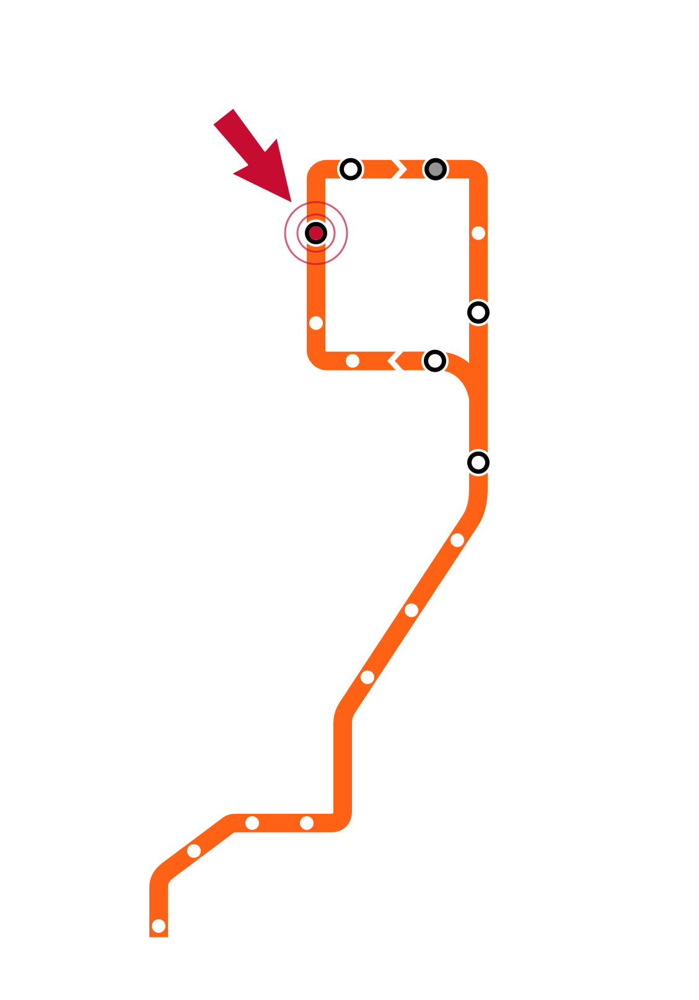
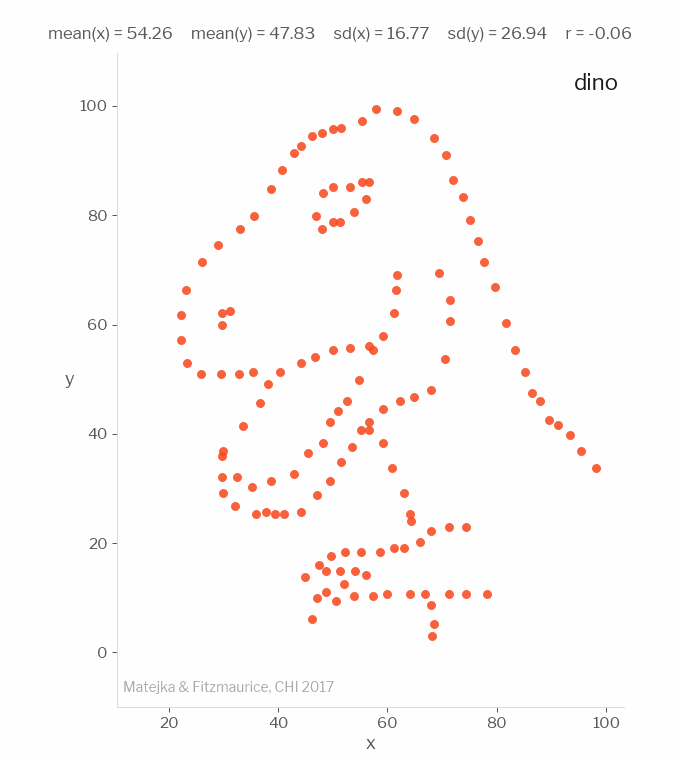
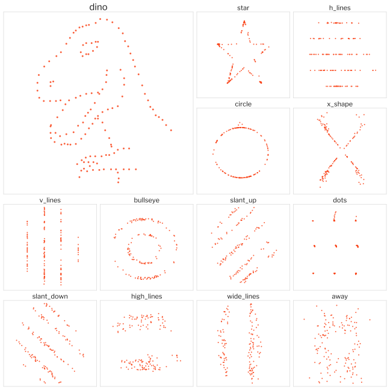

```{python}
#| echo: false
# Shared setup for every figure in this deck.
import numpy as np
import polars as pl
from plotnine import *

ORANGE = "#f9461c"
DARK = "#c83214"
INK = "#1a1a1a"

def note(x, y, text, ha="left", color=INK, size=13):
    """A text annotation in the deck's type and colors."""
    return annotate("text", x=x, y=y, label=text, ha=ha, size=size, color=color)

def upto(df, col, levels, k, on=0.8):
    """Alpha column: `on` for the first k levels of `col`, 0 for the rest.

    Used with scale_alpha_identity() to render a faceted figure several times
    with the later panels blank. Every panel frame and axis is still computed
    from the full data, so overlaying the versions in an .r-stack fills the
    panels in one at a time without the layout shifting.
    """
    return df.with_columns(
        pl.when(pl.col(col).cast(pl.Utf8).is_in(levels[:k]))
          .then(on).otherwise(0.0).alias("a"))
```

# Week 4 Slide Deck {.course-title}

<h2>Exploratory Analysis; Descriptive Stats</h2>

Jack Bandy
2026

---

# Week 4, Day 1 {.course-title .photo-title data-state="photo-title" background-image="../assets/orange-line-stops-better/stop04-washington-wells-b.jpg" background-size="cover"}

<h2>Exploratory Data Analysis</h2>

CS 418 · Week 4 · 🟠 Washington/Wells 🟠

---

## Map {.split}

::: {.split-content .narrow-aside}

::: {}
[Week 4, Day 1]{.eyebrow}

- Exploratory Analysis
- Elements of Visualization
:::

{.figure alt="Orange Line map with the Washington/Wells stop marked, the Week 4 stop"}

:::

---


# Exploratory Analysis {.section-header}

---

## What is Exploratory Data Analysis?

::: {.incremental}
- Exploratory Data Analysis (EDA): the process of exploring and analyzing data to better understand it, discover patterns, identify potential issues, and determine the best approach for building predictive models.
- The main tools of exploratory data analysis are:
  - **Summary Statistics** (mean, median, spread, counts)
  - **Visualization** (histograms, box plots, scatter plots)
:::

---

## Exploratory vs. Confirmatory

::: {.incremental}
- EDA was promoted by statistician **John Tukey** as a contrast to **confirmatory data analysis**, which is concerned with modeling and hypothesis testing.
- In EDA, there is **no hypothesis** and **no model**.
- We just want to gain intuition about the data.
- Not seeking to confirm anything
:::

---

## Tukey on EDA {.quote-slide}

> "Exploratory data analysis" is an attitude, a state of flexibility, a willingness to look for those things that we believe are not there, as well as those we believe to be there.

::: {.attribution}
John W. Tukey
:::

::: {.quote-source}
*The Collected Works of John W. Tukey*, Vol. IV, ed. Lyle V. Jones (1986), p. 806 — quoted and sourced in [Brillinger, "Data Analysis, Exploratory" (2011)](https://www.stat.berkeley.edu/~brill/Papers/EDASage.pdf)
:::

---

## Before you model, understand your data
::: {.incremental}
- Before running analyses or building any machine learning systems, data scientists **always understand the data**.
- If *you* can't identify a trend or make a prediction for your dataset, it will be more difficult to guide an algorithm to do the same
- Exploration also gives you ideas for how to represent and clean your data better.
:::

---

## Steps

The steps of exploratory data analysis are:

::: {.incremental}
1. Data Collection and Loading (setting up your environment)
2. Summary Statistics (*describe()* using polars)
3. Handling anomalies (e.g. missing data)
4. Understanding the shape of the data
5. Detecting outliers
6. Correlation Analysis
:::

---

## Discovering and handling anomalies
Skipping this step often causes problems downstream

Categories include:

::: {.incremental}
- Missing values (e.g. nulls, N/A, NaN)
- Duplicates (multiple rows with same values)
- Inconsistent formatting (e.g. "yyyy/dd/mm" vs "mm/dd/yyyy")
- Wrong data types (dates stored as strings, numbers stored as strings)
- Invalid values (e.g. age = 350)
- Structure issues (mixed units: miles vs km)
:::

---

## Exploring data with polars
The polars package has built-in exploratory methods:

::: {.incremental}
- `df.shape` — the dimensions of the dataframe (number of rows, number of columns)
- `df.glimpse()` — name, type, and first values of each feature
- `df.null_count()` — how many missing values each feature has
- `df.describe()` — summary statistics (count, null count, mean, standard deviation, min/max, and quartiles) for each feature
:::

```python
import polars as pl
df = pl.read_csv('ages.csv')
print(df.shape)
# (3, 2)
```

# Elements of Visualization {.section-header}

```{python}
#| echo: false
# Setup for the "elements of visualization" slides: the Chicago map layers and a
# pair of tiny helpers for the abstract mark demos.
import csv, json
import matplotlib.pyplot as plt
from matplotlib.collections import PatchCollection
from matplotlib.patches import Polygon as MplPolygon

MAPS = "../../datasets/chicago-maps"
TEAL = "#1f8a9b"
SAND = "#efe7d8"
plt.rcParams["hatch.linewidth"] = 0.5


def _thin(ring, tol):
    """Drop points closer than `tol` degrees to the last one kept.

    The city files are surveyor-accurate; at slide size that detail is invisible
    but it inflates the embedded SVG, so every ring is decimated on load.
    """
    out = [ring[0]]
    for x, y in ring[1:-1]:
        px, py = out[-1]
        if abs(x - px) > tol or abs(y - py) > tol:
            out.append((x, y))
    out.append(ring[0])
    return out if len(out) > 3 else ring


def rings(name, tol=0.0009):
    """(properties, exterior ring) for every polygon in a GeoJSON file."""
    out = []
    for f in json.load(open(f"{MAPS}/{name}"))["features"]:
        g = f["geometry"]
        polys = [g["coordinates"]] if g["type"] == "Polygon" else g["coordinates"]
        for p in polys:
            out.append((f["properties"], _thin([tuple(c) for c in p[0]], tol)))
    return out


CITY = rings("chicago-city.geojson")
WARDS = rings("chicago-wards.geojson")
# Keep the lake, the river, the canals and the harbors; drop the retention ponds.
WATER = [(p, r) for p, r in rings("chicago-water.geojson")
         if int(p["AREAWATER"]) >= 250_000]
INCOME = {int(r["ward"]): int(r["median_household_income_est"])
          for r in csv.DictReader(open(f"{MAPS}/chicago-ward-income.csv"))}


def chicago_axes(ax):
    """The city plus the near-shore strip of Lake Michigan."""
    ax.set(xlim=(-87.95, -87.505), ylim=(41.63, 42.03))
    ax.set_aspect(1 / 0.745)  # Mercator correction at ~41.9 degrees north
    ax.axis("off")


def layer(ax, shapes, **kw):
    ax.add_collection(PatchCollection([MplPolygon(r) for _, r in shapes], **kw))


def mark_axes(ax, xlim=(0, 10), ylim=(0, 6)):
    """A blank frame for the abstract mark demos."""
    ax.set(xlim=xlim, ylim=ylim, xticks=[], yticks=[])
    ax.set_aspect("equal")
    for s in ax.spines.values():
        s.set(color="#c9ccce", linewidth=1)
```

## Position {.text-figure-slide}

::: {.columns}
::: {.column width="46%"}
::: {.dense}
::: {.incremental}
- **Position** — where a mark sits in the plane.
- Not a retinal variable: for Bertin it is the **base** of the graphic.
- The only one that is *selective*, *associative*, *ordered* **and** *quantitative*.
- Spend it first. Scatter plots, bars and maps all do.
:::
:::
:::
::: {.column width="54%"}
```{python}
#| echo: false
#| fig-width: 5.2
#| fig-height: 4.0
#| fig-alt: "Three identical orange dots placed at different spots in an empty frame; nothing about the dots varies except where they are"
fig, ax = plt.subplots()
ax.scatter([1.6, 5.0, 8.4], [1.3, 4.4, 2.6], s=340, color=ORANGE, zorder=3)
mark_axes(ax)
```
:::
:::

::: {.notes}
Bertin starts from the plane — two dimensions of position — and then asks what
else a mark can vary. Everything after this slide is one of the six "retinal"
variables layered on top of that base.
:::

---

## Size {.text-figure-slide}

::: {.columns}
::: {.column width="46%"}
::: {.dense}
::: {.incremental}
- **Size**: how big a mark is (length, area, or volume).
- *Ordered* and *quantitative*: bigger reliably reads as more.
- Also dissociative (small marks are more difficult to see)
- Can be difficult to compare similar values
:::
:::
:::
::: {.column width="54%"}
```{python}
#| echo: false
#| fig-width: 5.2
#| fig-height: 4.0
#| fig-alt: "A small orange dot on the left and a much larger orange dot on the right, identical in every way except size"
fig, ax = plt.subplots()
ax.scatter([3.0, 7.0], [3.0, 3.0], s=[120, 2600], color=ORANGE, zorder=3)
mark_axes(ax)
```
:::
:::

::: {.notes}
Dissociative is Bertin's term for a variable that changes the visibility of the
mark. Anything else printed on a tiny mark — its hue, its shape — gets dragged
down with it, so size is never free.
:::

---

## Texture (Grain) {.text-figure-slide}

::: {.columns}
::: {.column width="46%"}
::: {.dense}
::: {.incremental}
- **Texture** (Bertin's **grain**): how coarse or fine a fill pattern is.
- The *amount of black stays constant*; only the scale changes.
- Land is coarse here, water fine.
- *Selective* and *ordered*, but categorical (not *quantitative*)
:::
:::
:::
::: {.column width="54%"}
```{python}
#| echo: false
#| fig-width: 4.6
#| fig-height: 5.0
#| fig-alt: "Map of Chicago drawn only in black and white: the land is filled with a coarse dot pattern and Lake Michigan and the rivers with a much finer dot pattern"
fig, ax = plt.subplots()
layer(ax, CITY, facecolor="white", edgecolor=INK, lw=0.8, hatch="..")
layer(ax, WATER, facecolor="white", edgecolor=INK, lw=0.3, hatch="......")
chicago_axes(ax)
```
:::
:::

::: {.notes}
Grain survives a black-and-white print run
competes with orientation (hatching is both at once)
:::

---

## Color (Hue) {.text-figure-slide}

::: {.columns}
::: {.column width="46%"}
::: {.dense}
::: {.incremental}
- **Color**, for Bertin, means **hue** alone — lightness held fixed.
- Same map, same two areas, only the hue changed.
- **Not ordered.** Blue is not "more" than tan.
- So hue/color encodes *identity*, not magnitude.
:::
:::
:::
::: {.column width="54%"}
```{python}
#| echo: false
#| fig-width: 4.6
#| fig-height: 5.0
#| fig-alt: "The same map of Chicago, now with land filled in sand and Lake Michigan and the rivers filled in teal"
fig, ax = plt.subplots()
layer(ax, CITY, facecolor=SAND, edgecolor=INK, lw=0.8)
layer(ax, WATER, facecolor=TEAL, edgecolor="none")
chicago_axes(ax)
```
:::
:::


---

## Value {.text-figure-slide}

::: {.columns}
::: {.column width="46%"}
::: {.dense}
::: {.incremental}
- **Value** — lightness, independent of hue. Grey here ( no hue )
- Chicago's 50 wards, shaded by median household income.
- *Ordered*: darker reads as more. This is what makes a choropleth work.
- Like size, **dissociative** — pale wards recede, dark wards shout.
- The eye can rank two greys but not divide them (not quantitative)
:::
:::
:::
::: {.column width="54%"}
```{python}
#| echo: false
#| fig-width: 4.6
#| fig-height: 5.0
#| fig-alt: "Choropleth map of Chicago's 50 wards shaded from pale grey to near-black by estimated median household income, with the darkest wards along the north lakefront"
fig, ax = plt.subplots()
vals = [INCOME[int(p["ward"])] for p, _ in WARDS]
pc = PatchCollection([MplPolygon(r) for _, r in WARDS],
                     edgecolor="white", lw=0.5, cmap="Greys")
pc.set_array(np.array(vals))
pc.set_clim(30_000, 190_000)
ax.add_collection(pc)
chicago_axes(ax)
cb = fig.colorbar(pc, ax=ax, fraction=0.035, pad=0.0, shrink=0.75)
cb.set_ticks([50_000, 100_000, 150_000])
cb.set_ticklabels(["$50k", "$100k", "$150k"])
cb.ax.tick_params(labelsize=7, length=2)
cb.outline.set_visible(False)
```
:::
:::

::: {.notes}
Income estimate is derived from the city's ACS 5-year household-income brackets
by ward (2023) — a grouped median, not an official statistic. See the
datasets/chicago-maps README for derivation
:::

---

## Orientation {.text-figure-slide}

::: {.columns}
::: {.column width="46%"}
::: {.dense}
::: {.incremental}
- **Orientation**: the angle a mark is tilted.
- Identical bars; only the angle varies.
- *Selective* and *associative*: easy to spot, and it adds no visual weight.
- **Not ordered** for points and lines — 30° is not "more" than 60°.
- Can conflict with texture.
:::
:::
:::
::: {.column width="54%"}
```{python}
#| echo: false
#| fig-width: 5.2
#| fig-height: 4.0
#| fig-alt: "Five identical orange bars in a row, each tilted to a different angle from horizontal through vertical"
fig, ax = plt.subplots()
for x, deg in zip([1.4, 3.2, 5.0, 6.8, 8.6], [0, 30, 60, 90, 135]):
    t = np.deg2rad(deg)
    dx, dy = 1.05 * np.cos(t), 1.05 * np.sin(t)
    ax.plot([x - dx, x + dx], [3 - dy, 3 + dy], color=ORANGE, lw=7,
            solid_capstyle="round")
mark_axes(ax)
```
:::
:::


---

## Shape {.text-figure-slide}

::: {.columns}
::: {.column width="46%"}
::: {.dense}
::: {.incremental}
- **Shape**: the form of the mark, at constant size and "ink"
- Bertin's weakest variable
- The eye cannot collect "all the triangles", searches one at a time.
- Not ordered, not quantitative, just labels categories.
:::
:::
:::
::: {.column width="54%"}
```{python}
#| echo: false
#| fig-width: 5.2
#| fig-height: 4.0
#| fig-alt: "Five orange marks in a row at the same size: a circle, a square, a triangle, a diamond and a cross"
fig, ax = plt.subplots()
for x, m in zip([1.4, 3.2, 5.0, 6.8, 8.6], ["o", "s", "^", "D", "X"]):
    ax.scatter([x], [3], marker=m, s=560, color=ORANGE, zorder=3)
mark_axes(ax)
```
:::
:::


---

## All Seven Variables{.image-frame-slide}


---


## Munzner's Channels {.smaller}

From Tamara Munzner's *Visualization Analysis & Design* (2014), which uses the term **channels** and splits them by what they can encode:

::: {.columns}
::: {.column width="50%"}
::: {style="font-size:0.82em;"}
**Magnitude channels** — ordered attributes, most to least effective:

1. Position on a common scale
2. Position on an unaligned scale
3. Length (1D size)
4. Tilt / angle
5. Area (2D size)
6. Depth (3D position)
7. Color luminance / saturation
8. Curvature
9. Volume (3D size)
:::
:::
::: {.column width="50%"}
::: {style="font-size:0.82em;"}
**Identity channels** — categorical attributes:

1. Spatial region
2. Color hue
3. **Motion**
4. Shape
:::

:::
:::

::: {.aside-note}
The ranking is empirical: it comes from the Cleveland & McGill graphical-perception
experiments and their later replications, not from taste.
:::

---

## Which Encoding for Which Data? {.image-frame-slide}


::: {.caption}
Based on Noah Iliinsky's table, complexdiagrams.com/properties (2012), CC BY-SA
:::

::: {.notes}
Two things to draw out. First, the "useful values" column is the practical
constraint: color is fine for categories but caps out under about twenty, so a
thirty-category color legend is already a design failure. Second, the last four
rows — enclosure, line pattern, line endings, line weight — are encodings for
*relational* data, which is the one column Bertin's table does not have. That is
the gap this table fills.
:::

---

# Week 4, Day 2 {.course-title .photo-title data-state="photo-title photo-title-zoom" background-image="../assets/orange-line-stops-better/stop04-washington-wells-b.jpg" background-size="cover"}

<h2>Descriptive Statistics</h2>

Jack Bandy
2026

---

## Map {.split}

::: {.split-content .narrow-aside}

::: {}
[Week 4, Day 2]{.eyebrow}

- Descriptive Statistics
- Data Visualization
- Why Visualization?
:::

{.figure alt="Orange Line map with the Washington/Wells stop marked, the Week 4 stop"}

:::

---


# Descriptive Statistics {.section-header}

---

## Descriptive vs. Inferential Statistics

:::: {.columns}
::: {.column width="50%"}
::: {.fragment}
**Descriptive statistics**

Summarize data about a *sample* drawn from a population.

- Measures of central tendency (mean, median, mode)
- Measures of dispersion or spread (range, standard deviation, variance)
:::
:::

::: {.column width="50%"}
::: {.fragment}
**Inferential statistics**

Use information from the sample to draw conclusions about the population.
:::
:::
::::

::: {.fragment}
This week is mostly about descriptive statistics.
:::

---

## Descriptive Statistics

::: {.incremental}
- Summarize and describe what's in the data.
- **Center:** Mean, median, mode.
- **Spread:** Maximum, Minimum, Range, Standard deviation, Variance.
- **Position:** Quartiles and percentiles.
:::

---

## Measures of Center

::: {.incremental}
- **Mean** — the average of all the values.
- **Median** — the middle value of the sorted data.
- **Mode** — the most frequent value (can be more than one).
:::

::: {.fragment}
**Example** A = {7, 9, 9, 12, 13}

**Mean =** (7 + 9 + 9 + 12 + 13) / 5 = 10  
**Median =** 9  
**Mode =** 9
:::

---

## Measures of Center ("Central Tendency")

::: {style="font-size:0.6em; font-style:normal; color:#1f8a9b; font-weight:700; margin-top:-0.3em;"}
Using Python
:::

With a polars DataFrame, each measure is one method call:

::: {.incremental}
- `df.mean()` — the mean of every column
- `df.median()` — the median of every column
- `df["grades"].mode()` — the mode (a Series method; there may be more than one)
:::

---

## Measures of Spread

:::: {.columns}
::: {.column width="20%"}

<table style="border-collapse:collapse; margin:0.2em 26px 0 auto;">
<tr><td style="border:2px solid #f9461c; background:#f9461c; color:#fff; font-weight:bold; padding:6px 22px; text-align:center;">Grades</td></tr>
<tr><td style="border:2px solid #f9461c; padding:6px 30px; text-align:center;">24</td></tr>
<tr><td style="border:2px solid #f9461c; padding:4px 30px; text-align:center;"><span style="display:inline-block; border:3px solid #1f2d3d; border-radius:50%; width:50px; height:50px; line-height:50px; font-weight:bold;">35</span></td></tr>
<tr><td style="border:2px solid #f9461c; padding:6px 30px; text-align:center;">32</td></tr>
<tr><td style="border:2px solid #f9461c; padding:4px 30px; text-align:center;"><span style="display:inline-block; border:3px solid #1f2d3d; border-radius:50%; width:50px; height:50px; line-height:50px; font-weight:bold;">21</span></td></tr>
<tr><td style="border:2px solid #f9461c; padding:6px 30px; text-align:center;">28</td></tr>
</table>

::: {style="font-size:0.5em; text-align:center; margin-top:0.6em; line-height:1.6;"}
[Maximum = 35]{style="color:#1f2d3d; font-weight:bold;"}<br>
[Minimum = 21]{style="color:#1f2d3d; font-weight:bold;"}
:::

:::
::: {.column width="80%"}

::: {style="font-size:0.82em;"}
**Maximum** — The largest value in the data set.

**Minimum** — The smallest value in the data set.

**Range** — How far the data stretches, end to end.
:::

::: {style="text-align:center; margin-top:1.2em;"}
$$\text{Range} = \text{Max} - \text{Min} = 35 - 21 = 14$$
:::

:::
::::

---

## Measures of Spread

:::: {.columns}
::: {.column width="20%"}

<table style="border-collapse:collapse; margin:0.2em 26px 0 auto;">
<tr><td style="border:2px solid #f9461c; background:#f9461c; color:#fff; font-weight:bold; padding:6px 22px; text-align:center;">Grades</td></tr>
<tr><td style="border:2px solid #f9461c; padding:6px 30px; text-align:center;">24</td></tr>
<tr><td style="border:2px solid #f9461c; padding:6px 30px; text-align:center;">35</td></tr>
<tr><td style="border:2px solid #f9461c; padding:6px 30px; text-align:center;">32</td></tr>
<tr><td style="border:2px solid #f9461c; padding:6px 30px; text-align:center;">21</td></tr>
<tr><td style="border:2px solid #f9461c; padding:6px 30px; text-align:center;">28</td></tr>
</table>

::: {style="font-size:0.5em; text-align:right; margin-top:0.6em; line-height:1.6;"}
[Variance = 32.5]{style="color:#000000; font-weight:bold;"}<br>
[Standard Deviation ≈ 5.7]{style="color:#000000; font-weight:bold;"}
:::

:::
::: {.column width="80%"}

::: {style="font-size:0.82em;"}
**Standard deviation** — The typical distance from the mean (in the data's own units).

**Variance** — The variance of a dataset is the square of the standard deviation.

Mean $\bar{x} = 28$.
:::

::: {style="text-align:center; margin-top:1.2em;"}
$$\begin{aligned}
s^2 &= \frac{\sum (a_i-\bar{x})^2}{n-1} = \frac{130}{4} = 32.5 \\[6pt]
s &= \sqrt{32.5} \approx 5.7
\end{aligned}$$
:::

:::
::::

---

## Measures of Position 

:::: {.columns}

::: {.column width="32%"}
<table style="border-collapse:collapse; margin:0.4em auto 0;">
<tr><td style="border:2px solid #f9461c; background:#f9461c; color:#fff; font-weight:bold; padding:6px 24px; text-align:center;">Grades (sorted)</td></tr>
<tr><td style="border:2px solid #f9461c; padding:6px 24px; text-align:center;">21</td></tr>
<tr><td style="border:2px solid #f9461c; padding:4px 24px; text-align:center;"><span style="display:inline-block; border:3px solid #001E62; border-radius:50%; width:50px; height:50px; line-height:50px; color:#1f2d3d; font-weight:bold;">24</span></td></tr>
<tr><td style="border:2px solid #f9461c; padding:4px 24px; text-align:center;"><span style="display:inline-block; border:3px solid #001E62; border-radius:50%; width:50px; height:50px; line-height:50px; color:#1f2d3d; font-weight:bold;">28</span></td></tr>
<tr><td style="border:2px solid #f9461c; padding:4px 24px; text-align:center;"><span style="display:inline-block; border:3px solid #001E62; border-radius:50%; width:50px; height:50px; line-height:50px; color:#1f2d3d; font-weight:bold;">32</span></td></tr>
<tr><td style="border:2px solid #f9461c; padding:6px 24px; text-align:center;">35</td></tr>
</table>
:::

::: {.column width="68%"}

::: {style="font-size:0.8em;"}
**Percentiles** divide a dataset into 100 equal parts such that n% of the data is less than or equal to the nth percentile.

**Quartiles** divide a dataset into quarters.

- First quartile (Q1) = 25% or less of the data.
- Second quartile (Q2) = 50% or less of the data / Median.
- Third quartile (Q3) = 75% or less of the data.
:::

<div style="text-align:center; margin-top:0.6em;">
<span style="display:inline-block; border:2px solid #001E62; border-radius:6px; padding:6px 18px; margin:0 6px; font-weight:bold; color:#1f2d3d;">Q1 = 24</span>
<span style="display:inline-block; border:2px solid #001E62; border-radius:6px; padding:6px 18px; margin:0 6px; font-weight:bold; color:#1f2d3d;">Q2 = 28</span>
<span style="display:inline-block; border:2px solid #001E62; border-radius:6px; padding:6px 18px; margin:0 6px; font-weight:bold; color:#1f2d3d;">Q3 = 32</span>
</div>
:::

::::

---

## The Five-Number Summary

::: {.incremental}
- The minimum, **Q1**, the median (**Q2**), **Q3**, and the maximum together form a set of descriptive statistics called the **five-number summary**.
- The **interquartile range (IQR)** is $Q3 - Q1$ : the range covered by the middle 50% of the data.
- These five numbers are exactly what a **box plot** draws.
:::

---

## Detecting Outliers
::: {.incremental}
- An **outlier** is a value much larger or much smaller than the rest of the data.
- The common rule: a point is an outlier if it falls more than **1.5 × IQR** below Q1 or above Q3.
  - Some implementations use 3 × IQR, or other cutoffs (1.5 is a convention, not a law)
- Box plots are useful for summarizing a distribution *and* for comparing several distributions side by side.
- Outliers are not automatically errors. Investigate before you delete.
:::

---

## Anatomy of a Box Plot {.figure-slide}

```{python}
#| echo: false
#| fig-width: 10
#| fig-height: 4.4
#| fig-alt: "A single vertical box plot annotated with its parts: the box spanning Q1 to Q3 labelled as the interquartile range holding 50% of the data, the median line inside it, whiskers reaching the last points within 1.5 times the IQR, and three outlier dots above the upper whisker"
rng = np.random.default_rng(7)
vals = np.concatenate([rng.normal(30, 11, 220), [70, 74, 79]])
q1, med, q3 = np.percentile(vals, [25, 50, 75])
iqr = q3 - q1
lo = vals[vals >= q1 - 1.5 * iqr].min()
hi = vals[vals <= q3 + 1.5 * iqr].max()
box = pl.DataFrame({"x": np.zeros(len(vals)), "v": vals})

(ggplot(box, aes("x", "v"))
 + geom_boxplot(width=0.5, fill=ORANGE, alpha=0.22, color=DARK,
                outlier_color=DARK, outlier_size=2.5)
 + annotate("segment", x=-0.12, xend=0.12, y=lo, yend=lo, color=DARK)
 + annotate("segment", x=-0.12, xend=0.12, y=hi, yend=hi, color=DARK)
 + annotate("segment", x=-0.52, xend=-0.52, y=q1, yend=q3, color=INK)
 + annotate("segment", x=-0.56, xend=-0.48, y=q1, yend=q1, color=INK)
 + annotate("segment", x=-0.56, xend=-0.48, y=q3, yend=q3, color=INK)
 + note(-0.62, (q1 + q3) / 2, "IQR\n50% of the data", ha="right", size=14)
 + note(0.3, q3, "Q3 — upper quartile", size=14)
 + note(0.3, med, "Median (Q2)", size=14)
 + note(0.3, q1, "Q1 — lower quartile", size=14)
 + note(0.3, hi, "Whisker — last point within 1.5 × IQR", size=14)
 + note(0.3, vals.max(), "Outliers", color=DARK, size=14)
 + scale_x_continuous(limits=(-1.25, 1.55))
 + theme_void()
 + theme(figure_size=(10, 4.4)))
```

---

# Data Visualization {.section-header}

---

##  Kinds of Visualization

::: {.incremental}
- **Exploratory Data Visualization:** figuring out what is true. Mostly for you.
- **Persuasive Data Visualization:** convincing other people something is true. Polished, for an audience.
:::

::: {.fragment style="margin-top:1em;"}
This week is mostly about exploratory visualization.
:::

---

## Choosing a Plot: Quantitative Data

**Plots:** histograms, box plots, rug plots, smoothed interpolations (KDE — kernel density estimators)

::: {.incremental}
- **Histogram** — relative frequency of values; there's a tradeoff in choosing bin sizes.
- **Rug plot** — shows where the actual data points sit.
- **KDE plot** — a smoothed density estimate; there's a tradeoff in the "bandwidth" parameter.
:::

::: {.fragment style="margin-top:0.8em;"}
**Look for:** spread, shape, modes, gaps, outliers, unreasonable values.
:::

---

## Some Made-Up Data

```{python}
#| echo: true
rng = np.random.default_rng(418)
d = np.concatenate([rng.normal(5, 3, 45), rng.normal(30, 6, 170),
                    rng.normal(80, 3, 7)])
dist = pl.DataFrame({"v": d})
```

::: {style="font-size:0.8em; margin-top:0.4em;"}
Three groups together: a small one near 5, a big one near 30, and seven near 80.
:::

---

## Histogram {.code-figure-slide}

```{python}
#| echo: true
#| fig-alt: "Histogram of the made-up data with 32 bins, showing a small mode near 5, a large mode near 30, and a few isolated bars near 80"
(ggplot(dist, aes("v"))
 + geom_histogram(bins=32, fill=ORANGE, alpha=0.85,
                  color="white", size=0.3)
 + labs(x="Value", y="Count")
 + theme_minimal(base_size=14))
```

::: {style="font-size:0.8em;"}
Counts values falling in each bin. `bins` is the main knob to adjust.
:::

---

## Too Few Bins {.code-figure-slide}

```{python}
#| echo: true
#| fig-alt: "Histogram of the same data with only 4 bins, collapsing the two groups into one tall bar and hiding the gap before the outliers"
(ggplot(dist, aes("v"))
 + geom_histogram(bins=4, fill=ORANGE, alpha=0.85,
                  color="white", size=0.3)
 + labs(x="Value", y="Count")
 + theme_minimal(base_size=14))
```

::: {style="font-size:0.8em;"}
**Oversmoothed.** The two groups merge into one bar, and the gap before the outliers disappears. The shape looks simpler than the data actually is.
:::

---

## Too Many Bins {.code-figure-slide}

```{python}
#| echo: true
#| fig-alt: "Histogram of the same data with 300 bins, producing a spiky comb of mostly one- and two-count bars where the overall shape is hard to see"
(ggplot(dist, aes("v"))
 + geom_histogram(bins=300, fill=ORANGE, alpha=0.85,
                  color="white", size=0.3)
 + labs(x="Value", y="Count")
 + theme_minimal(base_size=14))
```

::: {style="font-size:0.8em;"}
**Undersmoothed.** Most bins hold one or two points, so the bars mostly report sampling noise. The modes are in there, but you have to squint past the comb to find them.
:::

---

## Rug Plot {.code-figure-slide}

```{python}
#| echo: true
#| fig-alt: "Rug plot of the made-up data: a dense band of tick marks near 30, a sparser band near 5, an empty stretch, and a handful of ticks near 80"
(ggplot(dist, aes("v", 0))
 + geom_rug(sides="b", color=INK, alpha=0.4, length=0.5)
 + labs(x="Value")
 + theme_minimal(base_size=14)
 + theme(panel_grid=element_blank(),
         axis_title_y=element_blank(),
         axis_text_y=element_blank()))
```

::: {style="font-size:0.8em;"}
One tick per data point (no binning, no smoothing). Great for spotting gaps and outliers; less helpful once the ticks overlap into a solid block.
:::

---

## KDE Plot {.code-figure-slide}

```{python}
#| echo: true
#| fig-alt: "Two kernel density curves over the same data: a smooth solid curve with two clear modes, and a wigglier dashed curve from a smaller bandwidth"
(ggplot(dist, aes("v"))
 + geom_density(size=1.2)                   # default bandwidth
 + geom_density(alpha=0.6, size=1.0, linetype="dashed",
                adjust=0.25)                              # 1/4 the bandwidth
 + labs(x="Value", y="Density")
 + theme_minimal(base_size=14))
```

::: {style="font-size:0.8em;"}
A smoothed estimate of the density. **`adjust` scales the bandwidth:** the dashed curve is wigglier and chases noise, the solid one may smooth real structure away.
:::

---

## All Three at Once {.figure-slide}

```{python}
#| echo: false
#| fig-width: 10
#| fig-height: 4.2
#| fig-alt: "A histogram of a bimodal distribution with a kernel density curve drawn over it and a rug of individual points along the bottom axis, annotated to point out the main mode, a second mode, a right skew, a gap, and a cluster of outliers"
(ggplot(dist, aes("v"))
 + geom_histogram(aes(y=after_stat("density")), bins=32,
                  fill=ORANGE, alpha=0.35, color="white", size=0.3)
 + geom_density(color=DARK, size=1.2)
 + geom_rug(color=INK, alpha=0.4, length=0.04)
 + note(44, 0.052, "Main mode")
 + note(-6, 0.030, "Second mode")
 + note(46, 0.014, "Skew right")
 + note(56, 0.004, "Gap")
 + note(70, 0.012, "Outliers", color=DARK)
 + note(14, 0.040, "KDE", color=DARK)
 + note(-6, 0.006, "Rug")
 + labs(y="Density")
 + theme_minimal(base_size=14)
 + theme(axis_title_x=element_blank(), figure_size=(10, 4.2)))
```

---

## Choosing a Plot: Categorical Data
**Plots:** bar plots, sorted by frequency or by the ordinal dimension

::: {.incremental}
- **Look for:** skew, frequent and rare categories, invalid categories.
- Consider grouping rare categories together and repeating the analysis.
- For **ordinal** data (e.g. education level: < 12th, HS, Trade, Some College, College), keep the natural order — don't sort bars shortest to tallest.
- **Dot plots** (Cleveland dot plots) make it easier to compare values than bars do.
:::

::: {.fragment style="font-size:0.85em; margin-top:0.6em;"}
Bar *width* has no meaning. Only length encodes the value.
:::

---

## Bar Plot (for an Ordinal Variable) {.figure-slide}

```{python}
#| echo: false
#| fig-width: 10
#| fig-height: 4.2
#| fig-alt: "Bar chart of mothers' education level with five bars in their natural order from less than 12th grade through college; high school is the tallest bar and trade school the shortest"
levels = ["< 12th", "HS", "Trade", "Some college", "College"]
edu = pl.DataFrame({
    "level": levels,
    "count": [201, 449, 61, 297, 219],
}).with_columns(pl.col("level").cast(pl.Enum(levels)))

(ggplot(edu, aes("level", "count"))
 + geom_col(fill=ORANGE, alpha=0.85, width=0.6)
 + labs(x="Education level", y="Count")
 + theme_minimal(base_size=15)
 + theme(figure_size=(10, 4.2)))
```

::: {style="font-size:0.6em; margin-top:0.2em;"}
The bars keep the natural order of the levels, not shortest-to-tallest.
:::

---

## Lollipop Chart of the Same Data {.figure-slide}

```{python}
#| echo: false
#| fig-width: 10
#| fig-height: 4.2
#| fig-alt: "Lollipop chart of the same five education-level counts, with one dot per level at the end of an orange stem running out from the axis, which can make the values easier to compare than the bars"
(ggplot(edu, aes("count", "level"))
 + geom_segment(aes(x=0, xend="count", y="level", yend="level"),
                color=ORANGE, size=1.5, alpha=0.85)
 + geom_point(color=ORANGE, size=5)
 + labs(x="Count", y="Education level")
 + theme_minimal(base_size=15)
 + theme(figure_size=(10, 4.2)))
```

::: {style="font-size:0.6em; margin-top:0.2em;"}
Same numbers as the bars, far less ink. The stem carries the value; the dot marks where it ends.
:::

---

## Describing the Shape of Data
Many models assume features are **symmetric** and **unimodal**. Deviations can affect the validity of the model.

::: {.incremental}
- **Symmetric** — looks the same on the left and right sides.
- **Skewed** — one tail is longer than the other (right-skewed, left-skewed).
- **Unimodal** — a single mode (peak).
- **Multimodal** — multiple modes (peaks).
:::

::: {.fragment style="margin-top:0.8em;"}
Histograms are the tool for exploring shape.
:::

---

## Three Shapes {.figure-slide}

```{python}
#| echo: false
rng = np.random.default_rng(1848)
shapes = ["Symmetric, unimodal", "Right-skewed", "Multimodal"]
shape_df = pl.DataFrame({
    "v": np.concatenate([
        rng.normal(0, 1, 600),
        rng.exponential(1, 600),
        np.concatenate([rng.normal(-2, 0.6, 300), rng.normal(2, 0.6, 300)]),
    ]),
    "shape": np.repeat(shapes, 600),
}).with_columns(pl.col("shape").cast(pl.Enum(shapes)))

def shape_plot(k):
    return (ggplot(upto(shape_df, "shape", shapes, k), aes("v"))
     + geom_histogram(aes(alpha="a"), bins=28, fill=ORANGE,
                      color="white", size=0.3)
     + scale_alpha_identity()
     + facet_wrap("shape", scales="free_x")
     + labs(y="Count")
     + theme_minimal(base_size=15)
     + theme(axis_title_x=element_blank(),
             strip_text=element_text(size=16, color=INK),
             panel_spacing=0.06, figure_size=(10, 4)))
```

::: {.r-stack}

::: {.fragment .fade-out fragment-index=1}
```{python}
#| echo: false
#| fig-width: 10
#| fig-height: 4
#| fig-alt: "Three histogram panels side by side; only the first is filled in, showing a symmetric unimodal bell shape"
shape_plot(1)
```
:::

::: {.fragment .fade-in-then-out fragment-index=1}
```{python}
#| echo: false
#| fig-width: 10
#| fig-height: 4
#| fig-alt: "The same three panels with the first two filled in: a symmetric bell shape and a right-skewed distribution with a long tail to the right"
shape_plot(2)
```
:::

::: {.fragment fragment-index=2}
```{python}
#| echo: false
#| fig-width: 10
#| fig-height: 4
#| fig-alt: "All three panels filled in: a symmetric unimodal bell shape, a right-skewed distribution with a long tail to the right, and a multimodal distribution with two separated peaks"
shape_plot(3)
```
:::

:::

---

## Identifying Relationships
::: {.incremental}
- Features in a dataset are usually related to each other. **Linear** relationships are the simplest type.
- **Correlation** describes the *strength* and *direction* of a linear relationship between two features.
  - **Positive** correlation — one feature increases as the other increases.
  - **Negative** correlation — one feature decreases as the other increases.
- We explore relationships using **scatter plots**: positive correlation, negative correlation, or no linear correlation.
:::

---

## Three Scatter Plots {.figure-slide}

```{python}
#| echo: false
rng = np.random.default_rng(418)
x = rng.uniform(0, 10, 90)
kinds = ["Positive correlation", "Negative correlation", "No linear correlation"]
corr_df = pl.DataFrame({
    "x": np.tile(x, 3),
    "y": np.concatenate([x + rng.normal(0, 1.5, 90),
                         -x + rng.normal(0, 1.5, 90),
                         rng.uniform(0, 10, 90)]),
    "kind": np.repeat(kinds, 90),
}).with_columns(pl.col("kind").cast(pl.Enum(kinds)))

def corr_plot(k):
    return (ggplot(upto(corr_df, "kind", kinds, k, on=0.75), aes("x", "y"))
     + geom_point(aes(alpha="a"), color=ORANGE, size=2.5)
     + scale_alpha_identity()
     + facet_wrap("kind", scales="free_y")
     + theme_minimal(base_size=15)
     + theme(axis_title=element_blank(), axis_text=element_blank(),
             strip_text=element_text(size=16, weight="bold", color=INK),
             panel_spacing=0.06, figure_size=(10, 4)))
```

::: {.r-stack}

::: {.fragment .fade-out fragment-index=1}
```{python}
#| echo: false
#| fig-width: 10
#| fig-height: 4
#| fig-alt: "Three scatter plot panels side by side; only the first has points, trending upward for positive correlation"
corr_plot(1)
```
:::

::: {.fragment .fade-in-then-out fragment-index=1}
```{python}
#| echo: false
#| fig-width: 10
#| fig-height: 4
#| fig-alt: "The same three panels with the first two filled in: points trending upward, then points trending downward for negative correlation"
corr_plot(2)
```
:::

::: {.fragment fragment-index=2}
```{python}
#| echo: false
#| fig-width: 10
#| fig-height: 4
#| fig-alt: "All three panels filled in: points trending upward (positive correlation), points trending downward (negative correlation), and points with no visible trend (no linear correlation)"
corr_plot(3)
```
:::

:::

---

## Correlation Coefficient

The correlation coefficient measures the linear relationship between two features $X$ and $Y$. We'll look at **Pearson's correlation coefficient** first.

::: {.incremental}
- The value is always between **-1 and 1**.
- The sign gives the direction; the closer to -1 or 1, the **stronger** the relationship.
- A coefficient of **0** means there is no *linear* relationship — which is not the same as no relationship at all.
:::

---

## Setup: Chicago 'L' ridership, 2019

Are stations that are busy on weekdays also busy on Saturdays?

```{python}
#| echo: true
cta = pl.read_csv("../../datasets/cta-ridership/Station_Entries_-_Daily_Totals_20260527.csv",
                  ignore_errors=True)
cta = cta.with_columns(pl.col("rides").str.replace_all(",", "").cast(pl.Int64))
by_day = (cta.filter(pl.col("date").str.ends_with("2019"))
             .group_by("stationname", "daytype")
             .agg(pl.col("rides").median()))
stations = by_day.pivot("daytype", index="stationname", values="rides")
```

::: {style="font-size:0.8em; margin-top:0.4em;"}
`daytype` is `W` for weekdays, `A` for Saturdays, `U` for Sundays and holidays.
:::

---

## Weekday vs. Saturday {.code-figure-slide}

```{python}
#| echo: true
#| fig-alt: "Scatter plot of 144 Chicago 'L' stations, median weekday entries on the x-axis against median Saturday entries on the y-axis, showing a strong upward linear trend"
(ggplot(stations, aes("W", "A"))
 + geom_point(alpha=0.7)
 + labs(x="Median weekday entries", y="Median Saturday entries")
 + theme_minimal())
```

---

## How strong is it?

```{python}
#| echo: true
stations.select(pl.corr("W", "A")).item()
```

::: {style="font-size:0.85em; margin-top:0.8em;"}
Strong and positive: busy stations are busy on both days. Not *perfect* — Loop stations serving commuters drop off far more on a Saturday than neighborhood stations do.
:::

---

## Setup: Cook County home sales, 2025

Do bigger houses sell for more money?

```{python}
#| echo: true
sales = pl.read_csv("../../datasets/cook-county-home-sales-2025/cook-county-home-sales-2025.csv",
                    ignore_errors=True)
homes = sales.filter(
    (pl.col("property_group") == "Single-Family")   # condos have no sqft
    & (pl.col("is_multisale") == False)             # one price per home
    & (pl.col("sale_price") > 10_000)               # drop nominal transfers
    & pl.col("building_sqft").is_not_null()
)
homes.height
```

::: {style="font-size:0.8em; margin-top:0.4em;"}
Three filters before a single plot. Each one is a decision about what counts as a "home sale."
:::

---

## Square Footage vs. Price {.code-figure-slide .build-slide}

::: {.r-stack}

::: {.fragment .fade-out fragment-index=1}
```{python}
#| echo: true
#| fig-alt: "Scatter plot of Cook County home sales, square footage against sale price, drawn with default styling so a few multi-million-dollar sales stretch the y-axis and flatten the rest of the cloud"
(ggplot(homes, aes("building_sqft", "sale_price"))
 + geom_point(color="#f9461c", alpha=0.08, size=0.8, raster=True))
```
:::

::: {.fragment .fade-in-then-out fragment-index=1}
```{python}
#| echo: true
#| fig-alt: "The same scatter plot with the y-axis limited to two million dollars, which spreads the bulk of the sales out over the full height of the panel"
(ggplot(homes, aes("building_sqft", "sale_price"))
 + geom_point(color="#f9461c", alpha=0.08, size=0.8, raster=True)
 + scale_y_continuous(limits=(0, 2_000_000),
                      labels=lambda v: [f"${x/1e6:g}M" for x in v]))
```
:::

::: {.fragment .fade-in-then-out fragment-index=2}
```{python}
#| echo: true
#| fig-alt: "The same scatter plot with both axes cropped, to two million dollars and six thousand square feet, bringing the cone shape of the main cloud into view"
(ggplot(homes, aes("building_sqft", "sale_price"))
 + geom_point(color="#f9461c", alpha=0.08, size=0.8, raster=True)
 + scale_y_continuous(limits=(0, 2_000_000),
                      labels=lambda v: [f"${x/1e6:g}M" for x in v])
 + scale_x_continuous(limits=(0, 6000)))
```
:::

::: {.fragment .fade-in-then-out fragment-index=3}
```{python}
#| echo: true
#| fig-alt: "The same cropped scatter plot, now with the axes labelled building square footage and sale price"
(ggplot(homes, aes("building_sqft", "sale_price"))
 + geom_point(color="#f9461c", alpha=0.08, size=0.8, raster=True)
 + scale_y_continuous(limits=(0, 2_000_000),
                      labels=lambda v: [f"${x/1e6:g}M" for x in v])
 + scale_x_continuous(limits=(0, 6000))
 + labs(x="Building square footage", y="Sale price"))
```
:::

::: {.fragment fragment-index=4}
```{python}
#| echo: true
#| fig-alt: "Scatter plot of about 24,800 Cook County single-family home sales, building square footage on the x-axis against sale price on the y-axis, showing an upward trend that fans out widely at larger sizes"
(ggplot(homes, aes("building_sqft", "sale_price"))
 + geom_point(color="#f9461c", alpha=0.08, size=0.8, raster=True)
 + scale_y_continuous(limits=(0, 2_000_000),
                      labels=lambda v: [f"${x/1e6:g}M" for x in v])
 + scale_x_continuous(limits=(0, 6000))
 + labs(x="Building square footage", y="Sale price")
 + theme_minimal())
```
:::

:::

---

## How strong is it?

```{python}
#| echo: true
homes.select(pl.corr("building_sqft", "sale_price")).item()
```

::: {style="font-size:0.85em; margin-top:0.8em;"}
Positive, but weaker than the CTA example (0.88).
:::

---

## The Cone Shape
::: {.incremental}
- The points **fan out** as houses get larger
    - Small homes cluster in a narrow price band, large homes are all over
- A single correlation coefficient reports one number for the whole cloud, and hides that the relationship is much tighter at one end than the other.
- Always look at the scatter plot.
- **The coefficient is only a summary.**
:::

::: {.fragment style="font-size:0.85em; margin-top:0.6em;"}
The plot above also hides 393 sales — those above \$2M or over 6,000 sq. ft. — which we cropped off the axes. They are still in the correlation.
:::

---

# Why Visualization? {.section-header}

---

```{python}
#| echo: false
# Setup for the Anscombe slides. The quartet ships with plotnine.
from plotnine.data import anscombe_quartet

anscombe = pl.from_pandas(anscombe_quartet)
ANSCOMBE_SETS = ["I", "II", "III", "IV"]

def trim(v):
    """Round to two decimals, then drop trailing zeros: 0.50 -> 0.5, 3.00 -> 3."""
    return f"{v:.2f}".rstrip("0").rstrip(".")

def anscombe_stats(name):
    """The summary numbers for one dataset, computed from the data itself.

    Every slide in this run prints its own numbers rather than reusing a
    hard-coded table, so the punchline — they are all the same — is something
    the deck demonstrates instead of asserts.
    """
    s = anscombe.filter(pl.col("dataset") == name)
    x = s["x"].to_numpy().astype(float)
    y = s["y"].to_numpy().astype(float)
    slope, intercept = np.polyfit(x, y, 1)
    return [
        ("n", f"{len(x)}"),
        ("mean of x", f"{x.mean():.2f}"),
        ("mean of y", f"{y.mean():.2f}"),
        ("sd of x", f"{x.std(ddof=1):.2f}"),
        ("sd of y", f"{y.std(ddof=1):.2f}"),
        ("correlation", f"{np.corrcoef(x, y)[0, 1]:.2f}"),
        ("fitted line", f"{trim(slope)}x + {trim(intercept)}"),
    ]

def stats_table(*names):
    """Print the deck's orange summary table, one column per dataset so far.

    Each Anscombe slide keeps the columns from the slides before it, so the
    identical numbers pile up side by side instead of having to be remembered.
    """
    cell = "border:2px solid #f9461c; padding:4px 10px; white-space:nowrap;"
    columns = [anscombe_stats(name) for name in names]
    header = "".join(
        f'<th style="{cell} background:#f9461c; color:#fff; text-align:center;">{name}</th>'
        for name in names
    )
    rows = ""
    for i, (label, _) in enumerate(columns[0]):
        values = "".join(
            f'<td style="{cell} text-align:right; font-weight:bold; color:#1a1a1a;">'
            f"{col[i][1]}</td>"
            for col in columns
        )
        rows += f'<tr><td style="{cell}">{label}</td>{values}</tr>'
    # Each added column has to fit in the same 36% column without touching the
    # figure beside it, so the type steps down as columns pile up.
    size = 0.62 - 0.07 * (len(names) - 1)
    print(
        f'<table style="border-collapse:collapse; margin:0.2em auto 0; font-size:{size:.2f}em;">'
        f'<tr><td style="{cell} border-color:transparent;"></td>{header}</tr>{rows}</table>'
    )

def anscombe_plot(name):
    """One panel of the quartet, on axes shared by all four.

    The least-squares line is steel and the points are orange: the line is the
    thing that is identical everywhere, the points are the thing that is not.
    """
    s = anscombe.filter(pl.col("dataset") == name)
    return (ggplot(s, aes("x", "y"))
     + geom_abline(intercept=3.0, slope=0.5, color="#565a5c", linetype="dashed", size=0.9)
     + geom_point(color=ORANGE, size=3.5, alpha=0.9)
     + scale_x_continuous(limits=(3, 20))
     + scale_y_continuous(limits=(2, 14))
     + labs(x="x", y="y")
     + theme_minimal(base_size=15)
     # Upright y label: a one-character axis title reads better standing up
     # than lying on its side. Alignment is left at its default -- overriding
     # ha/va pushes the glyph out of the margin plotnine reserved for it and
     # the browser clips it to a sliver.
     + theme(figure_size=(5.3, 4.6),
             axis_title_y=element_text(rotation=0)))
```

## Anscombe's Quartet

::: {.incremental}
- In 1973, the statistician **Francis Anscombe** published four small datasets of 11 $(x, y)$ pairs each.
- They were built to share the same mean of $x$, mean of $y$, standard deviation of both, correlation, and least-squares regression line.
- Anscombe's target: the habit of *computing* a dataset and never *looking* at it.
:::

::: {.fragment style="font-size:0.85em; margin-top:0.8em;"}
The dashed line on the next four slides is the same fitted line every time: $y = 0.5x + 3$.
:::

---

## Anscombe I

:::: {.columns}
::: {.column width="36%"}
::: {.fragment fragment-index=1 style="padding-right:28px;"}
```{python}
#| echo: false
#| output: asis
stats_table("I")
```
:::
:::
::: {.column width="64%"}
```{python}
#| echo: false
#| fig-alt: "Scatter plot of Anscombe's first dataset: eleven points scattered loosely around an upward-sloping dashed line, the way ordinary noisy linear data looks"
anscombe_plot("I")
```
:::
::::

::: {.fragment fragment-index=2 style="font-size:0.8em; margin-top:0.2em;"}
A noisy but genuinely linear relationship — the summary describes it well.
:::

---

## Anscombe II

:::: {.columns}
::: {.column width="36%"}
::: {.fragment fragment-index=1 style="padding-right:28px;"}
```{python}
#| echo: false
#| output: asis
stats_table("I", "II")
```
:::
:::
::: {.column width="64%"}
```{python}
#| echo: false
#| fig-alt: "Scatter plot of Anscombe's second dataset: eleven points tracing a smooth downward-opening curve that crosses the dashed straight line three times"
anscombe_plot("II")
```
:::
::::

::: {.fragment fragment-index=2 style="font-size:0.8em; margin-top:0.2em;"}
A perfect curve. The relationship is exact — and it is not a line.
:::

---

## Anscombe III

:::: {.columns}
::: {.column width="36%"}
::: {.fragment fragment-index=1 style="padding-right:28px;"}
```{python}
#| echo: false
#| output: asis
stats_table("I", "II", "III")
```
:::
:::
::: {.column width="64%"}
```{python}
#| echo: false
#| fig-alt: "Scatter plot of Anscombe's third dataset: ten points lying exactly on a straight line, plus one far above it that pulls the dashed fitted line off the others"
anscombe_plot("III")
```
:::
::::

::: {.fragment fragment-index=2 style="font-size:0.8em; margin-top:0.2em;"}
Ten points on a perfect line, and one outlier that drags the fit off them.
:::

---

## Anscombe IV

:::: {.columns}
::: {.column width="36%"}
::: {.fragment fragment-index=1 style="padding-right:28px;"}
```{python}
#| echo: false
#| output: asis
stats_table("I", "II", "III", "IV")
```
:::
:::
::: {.column width="64%"}
```{python}
#| echo: false
#| fig-alt: "Scatter plot of Anscombe's fourth dataset: ten points stacked vertically at one x value and a single point far to the right, which alone determines the dashed fitted line"
anscombe_plot("IV")
```
:::
::::

::: {.fragment fragment-index=2 style="font-size:0.8em; margin-top:0.2em;"}
Every $x$ is the same but one. That single point *is* the slope.
:::

---

## The Full Quartet{.figure-slide}

```{python}
#| echo: false
#| fig-width: 10
#| fig-height: 4.2
#| fig-alt: "The four Anscombe datasets in one row, each with the same dashed fitted line: noisy linear, a smooth curve, a line with one outlier, and a vertical stack with one distant point"
(ggplot(anscombe.with_columns(pl.col("dataset").cast(pl.Enum(ANSCOMBE_SETS))),
        aes("x", "y"))
 + geom_abline(intercept=3.0, slope=0.5, color="#565a5c", linetype="dashed", size=0.9)
 + geom_point(color=ORANGE, size=2.8, alpha=0.9)
 + facet_wrap("dataset", nrow=1)
 + theme_minimal(base_size=14)
 + theme(strip_text=element_text(size=15, weight="bold", color=INK),
         axis_title_y=element_text(rotation=0),
         panel_spacing=0.05, figure_size=(10, 4.2)))
```

::: {style="text-align:center; font-size:0.72em; margin-top:0.2em;"}
Identical in all four: n = 11, mean of x = 9.00, mean of y = 7.50, sd of x = 3.32, sd of y = 2.03, r = 0.82, fitted line y = 0.5x + 3
:::


---

## The Datasaurus Dozen {.image-frame-slide auto-animate=true}

::: {.fragment}

:::

<script>
// Hold the GIF until the fragment is clicked. A looping animation that loads
// with the slide is already halfway through by the time anyone looks at it;
// swapping the src on reveal means the dinosaur is always the first thing you
// see. Clearing it again on the way back re-arms the slide.
document.addEventListener("fragmentshown", (e) => {
  e.fragment.querySelectorAll("img[data-gif-src]").forEach((img) => {
    img.src = img.dataset.gifSrc;
  });
});
document.addEventListener("fragmenthidden", (e) => {
  e.fragment.querySelectorAll("img[data-gif-src]").forEach((img) => {
    img.removeAttribute("src");
  });
});
</script>

---

## The Datasaurus Dozen {auto-animate=true}

:::: {.columns}
::: {.column width="52%"}
::: {.incremental style="font-size:0.72em;"}
- Matejka & Fitzmaurice (CHI 2017) took Alberto Cairo's "Datasaurus" and generated **twelve more datasets** from it.
- Each is nudged point by point toward a target shape, using only moves that leave the summary statistics alone.
- All thirteen agree on mean, standard deviation, and correlation **to two decimals**.
- Summary statistics are a *lossy compression*. Visualization is how you find out what got thrown away.
:::
:::
::: {.column width="48%"}



```{python}
#| echo: false
#| output: asis
dino = pl.read_csv("../../datasets/datasaurus-dozen/datasaurus-dozen.csv")
agg = dino.group_by("dataset").agg(
    pl.col("x").mean().alias("mx"), pl.col("y").mean().alias("my"),
    pl.col("x").std().alias("sx"), pl.col("y").std().alias("sy"),
    pl.corr("x", "y").alias("r"))
# U+2212 minus, since a hyphen next to a digit reads as a dash on a slide.
r_bar = f'{agg["r"].mean():.2f}'.replace("-", "−")
print(
    '<div style="text-align:center; font-size:0.55em; color:#565a5c; margin-top:0.3em;">'
    f'across all {agg.height} datasets — '
    f'mean(x) {agg["mx"].mean():.2f} · mean(y) {agg["my"].mean():.2f} · '
    f'sd(x) {agg["sx"].mean():.2f} · sd(y) {agg["sy"].mean():.2f} · '
    f'r {r_bar}</div>'
)
```

:::
::::

---

## Concluding Notes
::: {.fragment}
**One-dimensional data**

- Summarize with summary statistics (mean, standard deviation, max, min, quartiles).
- Visualize the distribution with histograms and box plots.
:::

::: {.fragment}
**Two-dimensional data**

- Visualize the relationship with scatter plots.
- Measure the relationship by computing correlations.
:::

::: {.fragment}
**High-dimensional data**

- Create a **scatterplot matrix** showing all pairwise scatter plots.
- Create a **correlation matrix** showing all pairwise correlations.
:::

---

# Sources {.sources}

1. GitHub source: <https://github.com/jackbandy/data-science-fun/blob/main/docs/slides/week4.qmd>.
2. Slides developed using materials from [Elena Zheleva](https://www.cs.uic.edu/~elena/) and [Gonzalo Bello Lander](https://cs.uic.edu/profiles/gonzalo-bello/), the Berkeley DS 100 team, Marine Carpuat, and Brian Ziebart.
3. Tukey quotation: John W. Tukey, *The Collected Works of John W. Tukey, Volume IV: Philosophy and Principles of Data Analysis 1965–1986*, ed. Lyle V. Jones (Wadsworth & Brooks/Cole, 1986), p. 806. Quoted with its page citation in David R. Brillinger, ["Data Analysis, Exploratory," *Encyclopedia of Political Science* (SAGE, 2011), pp. 530–535](https://www.stat.berkeley.edu/~brill/Papers/EDASage.pdf).
4. Visual variables: Jacques Bertin, *Sémiologie graphique: Les diagrammes, les réseaux, les cartes* (Gauthier-Villars, 1967); English translation *Semiology of Graphics: Diagrams, Networks, Maps*, trans. William J. Berg (University of Wisconsin Press, 1983; reissued by Esri Press, 2010).
5. Channels and the effectiveness ranking: Tamara Munzner, *Visualization Analysis & Design* (CRC Press, 2014), ch. 5. Open companion site: <https://www.cs.ubc.ca/~tmm/vadbook/>.
6. Chicago map layers: [chicago-maps](https://github.com/jackbandy/data-science-fun/tree/main/datasets/chicago-maps) — city and ward boundaries and ward-level ACS income from the [Chicago Data Portal](https://data.cityofchicago.org/); water polygons from U.S. Census Bureau [TIGERweb](https://tigerweb.geo.census.gov/) areal hydrography.
7. Slide deck built with [Quarto](https://quarto.org/) revealjs.
8. Title font is Big Shoulders; Body font is [Libre Franklin](https://en.wikipedia.org/wiki/Franklin_Gothic#Libre_Franklin).
