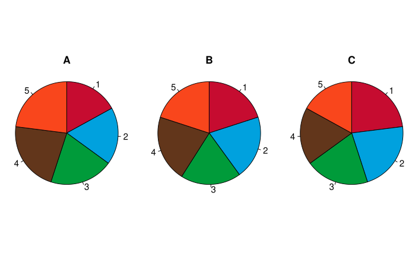
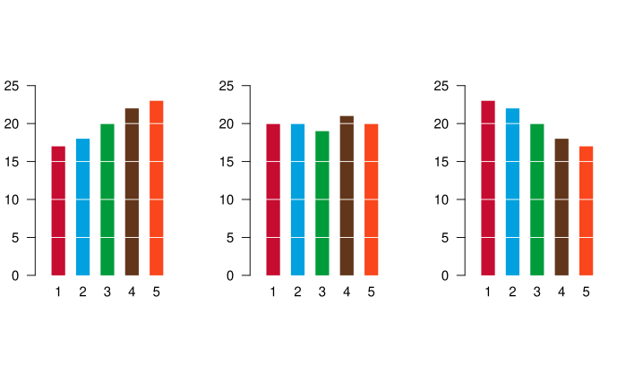
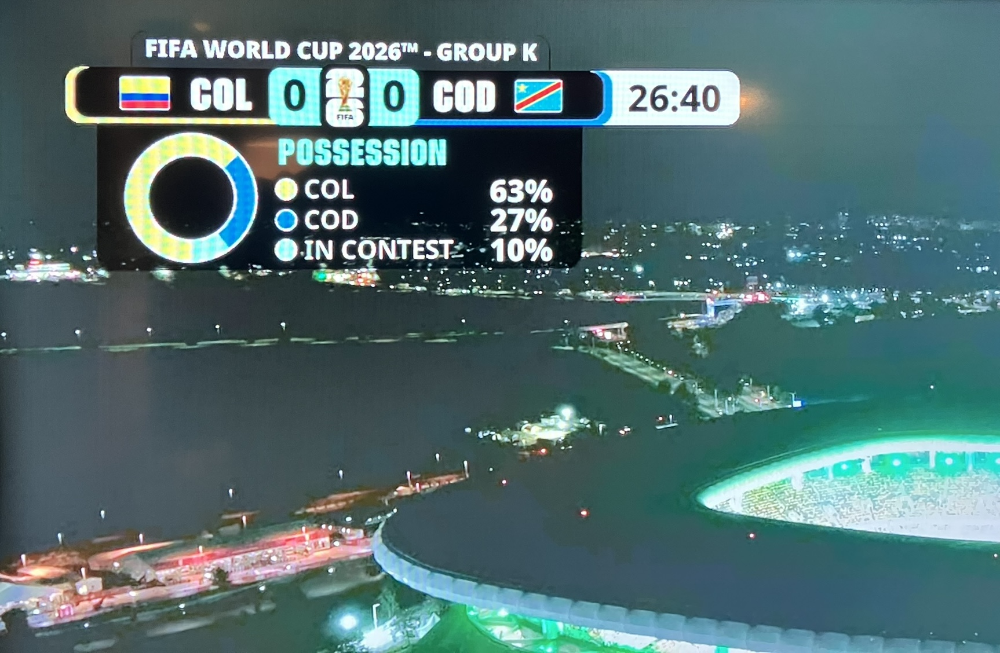

```{r}
#| include: false
library(reticulate)
# Prefer the local dev venv (built by build_all_quarto.sh); fall back to
# whatever python3 is on PATH when it's absent (e.g. CI, which installs
# dependencies system-wide via SKIP_VENV=true).
venv_python <- here::here(".venv/bin/python")
use_python(if (file.exists(venv_python)) venv_python else Sys.which("python3"), required = TRUE)
```

```{python}
#| include: false
import matplotlib
matplotlib.use("Agg")
```

# Week 5 Slide Deck {.course-title}

## Visualizations

Jack Bandy
2026

---

# Topic Title Placeholder {.course-title .photo-title data-state="photo-title" background-image="../assets/orange-line-stops-better/stop05-clark-lake-a.jpg" background-size="cover"}

CS 418 · Week 5 · 🟠 Clark/Lake 🟠

---

# {.photo-only data-state="photo-only" background-image="../assets/orange-line-stops-better/stop05-clark-lake-a.jpg" background-size="cover"}

---

# Demo Content Slide

Placeholder content for Week 5.

- Visualization goals
- Encodings
- Chart selection

---

# Pie & Donut Charts {.section-header}

---

# Pie Charts Intuition

- A pie chart encodes **proportion** as **angle** (and area)
- Works okay for "roughly half" or "roughly a quarter"
- Difficult to compare multiple slices

---


# Pie vs. Bar Example {.image-frame-slide}

::: {.content-visible when-format="html"}

:::

::: {.content-visible when-format="pdf"}

:::

---

# Pie vs. Bar Example {.image-frame-slide}

::: {.content-visible when-format="html"}

:::

::: {.content-visible when-format="pdf"}

:::

---

# The Donut Chart

- A **donut chart** is a pie chart with the center cut out
- Maintain the "this is all part of a whole" message
- Area comparison

---

# Donut in the Wild: FIFA World Cup 2026 {.image-frame-slide}

::: {.content-visible when-format="html"}

:::

::: {.content-visible when-format="pdf"}

:::

---

# Recreating the FIFA Chart: Setup

```{python}
#| echo: true
#| output: false
import matplotlib.pyplot as plt

sizes  = [63, 27, 10]
labels = ['COL', 'COD', 'In Contest']
colors = ['#f5c800', '#0057a8', '#00a896']

fig, ax = plt.subplots(figsize=(4, 4))
```

---

# Recreating the FIFA Chart: Draw {.code-figure-slide}

```{python}
#| echo: true
#| fig-format: svg
#| fig-alt: "Donut chart of FIFA World Cup 2026 Group K possession: Colombia 63% in yellow, DR Congo 27% in blue, In Contest 10% in teal"
ax.pie(sizes, labels=labels, autopct='%1.0f%%',
       colors=colors, startangle=90, counterclock=False,
       wedgeprops=dict(width=0.5), pctdistance=0.75)
ax.set_title('Possession', fontweight='bold')
plt.tight_layout()
```

---

# Recreating the FIFA Chart {.code-figure-slide}

```{python}
#| echo: true
#| fig-alt: "Donut chart of FIFA World Cup 2026 Group K possession: Colombia 63% in yellow, DR Congo 27% in blue, In Contest 10% in teal"
#| fig-format: svg
#| fig-width: 5
#| fig-height: 5
import matplotlib.pyplot as plt

sizes  = [63, 27, 10]
labels = ['COL', 'COD', 'In Contest']
colors = ['#f5c800', '#0057a8', '#00a896']
_, ax = plt.subplots()
ax.pie(sizes, labels=labels, autopct='%1.0f%%', colors=colors,
       startangle=90, counterclock=False,
       wedgeprops=dict(width=0.5), pctdistance=0.75)
ax.set_title('Possession', fontweight='bold');
```

---

# Recreating the FIFA Chart: Polished

```{python}
#| echo: false
#| fig-format: svg
#| fig-alt: "Donut chart styled after the FIFA World Cup 2026 broadcast graphic: Colombia 63% yellow, DR Congo 27% blue, In Contest 10% teal, with legend on the right inside a semi-transparent dark rounded rectangle."
#| out-width: 100%
import matplotlib.pyplot as plt
import matplotlib.gridspec as gridspec
from matplotlib.patches import FancyBboxPatch

phi = (1 + 5**0.5) / 2  # golden ratio ≈ 1.618
fig_h = 4.5
fig_w = fig_h * phi

fig = plt.figure(figsize=(fig_w, fig_h))
fig.patch.set_alpha(0)

bg = FancyBboxPatch(
    (0.02, 0.03), 0.96, 0.94,
    boxstyle="round,pad=0.03",
    facecolor=(0, 0, 0, 0.72),
    edgecolor="none",
    transform=fig.transFigure,
    zorder=0,
)
fig.add_artist(bg)

gs = gridspec.GridSpec(
    1, 2, width_ratios=[2, 3],
    left=0.03, right=0.97, bottom=0.05, top=0.95, wspace=0,
)
ax_d = fig.add_subplot(gs[0])
ax_l = fig.add_subplot(gs[1])
for ax in (ax_d, ax_l):
    ax.set_facecolor("none")

sizes  = [63, 27, 10]
labels = ["COL", "COD", "IN CONTEST"]
colors = ["#fcd116", "#0057a8", "#00a896"]

# startangle=-90 → Colombia starts at 6 o'clock, counterclock=False → runs clockwise to ~1 o'clock
ax_d.pie(
    sizes, colors=colors, startangle=-90, counterclock=False,
    wedgeprops=dict(width=0.5, edgecolor="white", linewidth=2.5),
)

ax_l.axis("off")
ax_l.set_xlim(0, 1)
ax_l.set_ylim(0, 1)

ax_l.text(0.08, 0.82, "POSSESSION", color="white", fontsize=19,
          fontweight="bold", va="center")

for i, (label, color, pct) in enumerate(zip(labels, colors, sizes)):
    y = 0.60 - i * 0.20
    # white ring behind colored fill
    ax_l.plot(0.10, y, "o", color="white",  markersize=19, zorder=4)
    ax_l.plot(0.10, y, "o", color=color,    markersize=14, zorder=5)
    ax_l.text(0.22, y, label,      color="white", fontsize=16, va="center")
    ax_l.text(0.72, y, f"{pct}%",  color="white", fontsize=16, va="center",
              fontweight="bold");
```

---

# Recreating the FIFA Chart: R Setup

```{r}
#| echo: true
library(ggplot2)

sizes  <- c(63, 27, 10)
labels <- c("COL", "COD", "In Contest")
colors <- c("#fcd116", "#0057a8", "#00a896")

df <- data.frame(
  label = factor(labels, levels = labels),
  pct   = sizes,
  color = colors
)
```

---

# Recreating the FIFA Chart: R / ggplot {.code-figure-slide}

```{r}
#| echo: true
#| dev: svglite
#| fig-alt: "Basic donut chart using ggplot2 coord_polar with default colors: Colombia, DR Congo, In Contest"
ggplot(df, aes(x = 2, y = pct, fill = label)) +
  geom_col(width = 1) +
  coord_polar(theta = "y", start = pi, direction = -1)
```

---

# Recreating the FIFA Chart: R / ggplot {.code-figure-slide}

```{r}
#| echo: true
#| dev: svglite
#| code-line-numbers: "4-5"
#| fig-alt: "Donut chart with FIFA colors applied and donut hole created via xlim"
ggplot(df, aes(x = 2, y = pct, fill = label)) +
  geom_col(width = 1) +
  coord_polar(theta = "y", start = pi, direction = -1) +
  scale_fill_manual(values = setNames(df$color, df$label)) +
  xlim(0.5, 2.5)
```

---

# Recreating the FIFA Chart: R / ggplot {.code-figure-slide}

```{r}
#| echo: true
#| dev: svglite
#| code-line-numbers: "6-8"
#| fig-alt: "Completed ggplot2 donut chart: Colombia 63% yellow, DR Congo 27% blue, In Contest 10% teal, with Possession title and minimal theme"
ggplot(df, aes(x = 2, y = pct, fill = label)) +
  geom_col(width = 1) +
  coord_polar(theta = "y", start = pi, direction = -1) +
  scale_fill_manual(values = setNames(df$color, df$label)) +
  xlim(0.5, 2.5) +
  labs(title = "Possession", fill = NULL) +
  theme_void() +
  theme(plot.title = element_text(face = "bold", hjust = 0.5))
```

---

# Recreating the FIFA Chart: R Polished

```{r}
#| echo: false
#| dev: svglite
#| fig-alt: "Polished donut chart styled after FIFA broadcast graphic, made with ggplot2: dark background, Colombia 63% yellow, DR Congo 27% blue, In Contest 10% teal, with colored dot legend"
library(ggplot2)
library(ggtext)
library(patchwork)

sizes  <- c(63, 27, 10)
labels <- c("COL", "COD", "IN CONTEST")
colors <- c("#fcd116", "#0057a8", "#00a896")
df <- data.frame(
  label = factor(labels, levels = labels),
  pct   = sizes,
  color = colors
)

donut <- ggplot(df, aes(x = 2, y = pct, fill = label)) +
  geom_col(width = 1, color = "white", linewidth = 1) +
  coord_polar(theta = "y", start = pi, direction = -1) +
  scale_fill_manual(values = setNames(df$color, df$label)) +
  xlim(0.5, 2.5) +
  theme_void() +
  theme(legend.position = "none",
        plot.background = element_rect(fill = NA, color = NA))

legend_df <- data.frame(
  label = factor(labels, levels = labels),
  pct   = paste0(sizes, "%"),
  color = colors,
  y     = c(0.65, 0.45, 0.25)
)
legend_panel <- ggplot(legend_df, aes(y = y)) +
  annotate("text", x = 0.1, y = 0.85, label = "POSSESSION",
           color = "white", size = 6, fontface = "bold", hjust = 0) +
  geom_point(aes(x = 0.12, color = label), size = 7) +
  geom_text(aes(x = 0.24, label = label), color = "white",
            size = 5, hjust = 0) +
  geom_text(aes(x = 0.80, label = pct), color = "white",
            size = 5, hjust = 1, fontface = "bold") +
  scale_color_manual(values = setNames(df$color, df$label)) +
  xlim(0, 1) + ylim(0, 1) +
  theme_void() +
  theme(legend.position = "none",
        plot.background = element_rect(fill = NA, color = NA))

donut + legend_panel +
  plot_layout(widths = c(2, 3)) &
  theme(plot.background = element_rect(fill = "#000000bb", color = NA))
```

---

# Sources {.sources}

1. GitHub source: <https://github.com/jackbandy/data-science-fun/blob/main/docs/slides/week5.qmd>.
2. Pie vs. bar comparison: Schutz, [*Piecharts.svg*](https://commons.wikimedia.org/wiki/File:Piecharts.svg), Wikimedia Commons, 2008. [CC BY 1.0](https://creativecommons.org/licenses/by/1.0/).
3. Slides developed using materials from [Elena Zheleva](https://www.cs.uic.edu/~elena/) and [Gonzalo Bello Lander](https://cs.uic.edu/profiles/gonzalo-bello/), the Berkeley DS 100 team, Marine Carpuat, and Brian Ziebart.
4. Slide deck built with [Quarto](https://quarto.org/) revealjs.
5. Title font is Big Shoulders; Body font is [Libre Franklin](https://en.wikipedia.org/wiki/Franklin_Gothic#Libre_Franklin).
