```{r}
#| include: false
library(reticulate)
# Prefer the local dev venv (built by build_all_quarto.sh); fall back to
# whatever python3 is on PATH when it's absent (e.g. CI, which installs
# dependencies system-wide via SKIP_VENV=true).
venv_python <- here::here(".venv/bin/python")
use_python(if (file.exists(venv_python)) venv_python else Sys.which("python3"), required = TRUE)
```

```{python}
#| include: false
import matplotlib
matplotlib.use("Agg")
```

```{python}
#| echo: false
# Shared setup for every figure in this deck.
import numpy as np
import polars as pl
from plotnine import *

ORANGE = "#f9461c"
DARK = "#c83214"
INK = "#1a1a1a"

def note(x, y, text, ha="left", color=INK, size=13):
    """A text annotation in the deck's type and colors."""
    return annotate("text", x=x, y=y, label=text, ha=ha, size=size, color=color)

def upto(df, col, levels, k, on=0.8):
    """Alpha column: `on` for the first k levels of `col`, 0 for the rest.

    Used with scale_alpha_identity() to render a faceted figure several times
    with the later panels blank. Every panel frame and axis is still computed
    from the full data, so overlaying the versions in an .r-stack fills the
    panels in one at a time without the layout shifting.
    """
    return df.with_columns(
        pl.when(pl.col(col).cast(pl.Utf8).is_in(levels[:k]))
          .then(on).otherwise(0.0).alias("a"))
```

# Week 5 Slide Deck {.course-title}

<h2>Visualizations</h2>

Jack Bandy
2026


# Week 5, Day 1 {.course-title .photo-title data-state="photo-title" background-image="../assets/orange-line-stops-better/stop05-clark-lake-a.jpg" background-size="cover"}

<h2>Visualization Basics</h2>

CS 418 · Week 5 · 🟠 Clark/Lake 🟠

---


## {.photo-only data-state="photo-only" background-image="../assets/orange-line-stops-better/stop05-clark-lake-a.jpg" background-size="cover"}


## Map {.split}

::: {.split-content .narrow-aside}

::: {}
- Week 5: Clark/Lake
- Day 1
    - Dimensionality
    - Pie & Donut Charts
:::

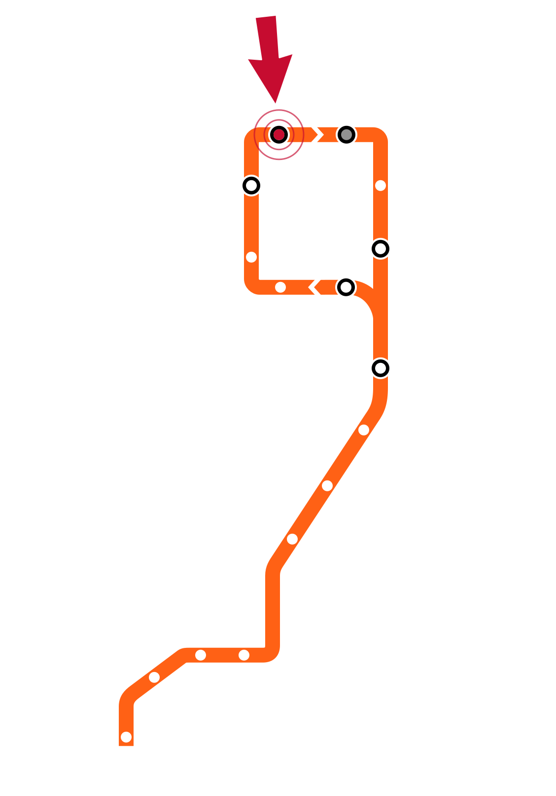{.figure alt="Orange Line map with the Clark/Lake stop marked, the Week 5 stop"}

:::

---

# Elements of Visualization {.section-header}

```{python}
#| echo: false
# Setup for the "elements of visualization" slides: one tiny helper for the
# abstract mark demos. The three Chicago map figures (texture, color, value) are
# built ahead of time by datasets/chicago-maps/make_bertin_figures.py and read in
# as SVGs, so this deck no longer loads the geojson.
import matplotlib.pyplot as plt


def mark_axes(ax, xlim=(0, 10), ylim=(0, 6)):
    """A blank frame for the abstract mark demos."""
    ax.set(xlim=xlim, ylim=ylim, xticks=[], yticks=[])
    ax.set_aspect("equal")
    for s in ax.spines.values():
        s.set(color="#c9ccce", linewidth=1)
```

## Position {.text-figure-slide}

::: {.columns}
::: {.column width="46%"}
::: {.dense}
::: {.incremental}
- **Position** — the location of a mark within a plane.
- According to Bertin, it is the **base** of the graphic (not a "retinal" variable)
- The only element that is *selective*, *associative*, *ordered* **and** *quantitative*.
- Scatter plots, bars, maps: position-forward
:::
:::
:::
::: {.column width="54%"}
```{python}
#| echo: false
#| fig-width: 5.2
#| fig-height: 4.0
#| fig-alt: "Three identical orange dots placed at different spots in an empty frame; nothing about the dots varies except where they are"
fig, ax = plt.subplots()
ax.scatter([1.6, 5.0, 8.4], [1.3, 4.4, 2.6], s=340, color=ORANGE, zorder=3)
mark_axes(ax)
```
:::
:::

::: {.notes}
Bertin starts from the plane — two dimensions of position — and then asks what
else a mark can vary. Everything after this slide is one of the six "retinal"
variables layered on top of that base.
:::

---

## Size {.text-figure-slide}

::: {.columns}
::: {.column width="46%"}
::: {.dense}
::: {.incremental}
- **Size**: how large or small a mark is (length, area, or volume).
- *Ordered* and *quantitative*: bigger reliably reads as more.
- Also dissociative (small marks are less prominent)
- Can be difficult to compare similar values
:::
:::
:::
::: {.column width="54%"}
```{python}
#| echo: false
#| fig-width: 5.2
#| fig-height: 4.0
#| fig-alt: "A small orange dot on the left and a much larger orange dot on the right, identical in every way except size"
fig, ax = plt.subplots()
ax.scatter([3.0, 7.0], [3.0, 3.0], s=[120, 2600], color=ORANGE, zorder=3)
mark_axes(ax)
```
:::
:::

::: {.notes}
Dissociative is Bertin's term for a variable that changes the visibility of the
mark. Anything else printed on a tiny mark — its hue, its shape — gets dragged
down with it, so size is never free.
:::

---

## Texture (Grain) {.text-figure-slide}

::: {.columns}
::: {.column width="46%"}
::: {.dense}
::: {.incremental}
- **Texture** (Bertin's **grain**): how coarse or fine a fill pattern is.
- only the scale changes changes in this example
- Land is coarse, water is fine
- Categorical (not *quantitative*)
:::
:::
:::
::: {.column width="54%"}
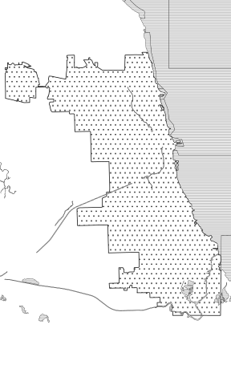{.figure alt="Map of Chicago drawn only in black and white: the land is filled with a coarse dot pattern and Lake Michigan and the rivers with a much finer dot pattern"}
:::
:::

::: {.notes}
Grain survives a black-and-white print run
competes with orientation (hatching is both at once)
:::

---

## Color (Hue) {.text-figure-slide}

::: {.columns}
::: {.column width="46%"}
::: {.dense}
::: {.incremental}
- **Color** for Bertin means only **hue** alone (lightness is fixed)
- Example: same map, same two areas, only the hue changed.
- **Not ordered.** (Blue is not "more" than tan)
- So hue/color encodes identity/category, not magnitude.
:::
:::
:::
::: {.column width="54%"}
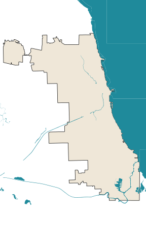{.figure alt="The same map of Chicago, now with land filled in sand and Lake Michigan and the rivers filled in teal"}
:::
:::


---

## Value {.text-figure-slide}

::: {.columns}
::: {.column width="46%"}
::: {.dense}
::: {.incremental}
- **Value** — lightness (independent of hue)
- "Hue" is grey in this example, "value" is how dark
- Chicago's 50 wards, shaded by median household income
- *ordered*: darker reads as "more."
- **dissociative** (like size), i.e. affects prominence / hierarchy
- Two different greys can be visually "ranked" (but that's about it)
:::
:::
:::
::: {.column width="54%"}
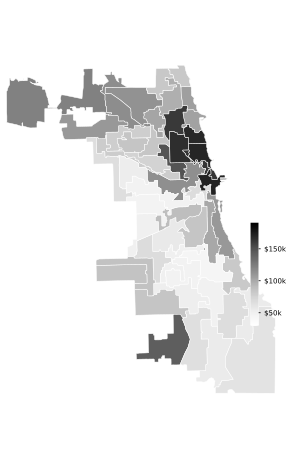{.figure alt="Choropleth map of Chicago's 50 wards shaded from pale grey to near-black by estimated median household income, with the darkest wards along the north lakefront"}
:::
:::

::: {.notes}
Income estimate is derived from the city's ACS 5-year household-income brackets
by ward (2023) — a grouped median, not an official statistic. See the
datasets/chicago-maps README for derivation
:::

---

## Orientation {.text-figure-slide}

::: {.columns}
::: {.column width="46%"}
::: {.dense}
::: {.incremental}
- **Orientation**: the angle a mark is tilted.
- Identical bars; only the angle varies.
- *Selective* and *associative*: easy to see, adds no "ink"
- Not necessarily ordered, for points and lines — 30° is not "more" than 60°.
- Can conflict with texture.
:::
:::
:::
::: {.column width="54%"}
```{python}
#| echo: false
#| fig-width: 5.2
#| fig-height: 4.0
#| fig-alt: "Five identical orange bars in a row, each tilted to a different angle from horizontal through vertical"
fig, ax = plt.subplots()
for x, deg in zip([1.4, 3.2, 5.0, 6.8, 8.6], [0, 30, 60, 90, 135]):
    t = np.deg2rad(deg)
    dx, dy = 1.05 * np.cos(t), 1.05 * np.sin(t)
    ax.plot([x - dx, x + dx], [3 - dy, 3 + dy], color=ORANGE, lw=7,
            solid_capstyle="round")
mark_axes(ax)
```
:::
:::


---

## Shape {.text-figure-slide}

::: {.columns}
::: {.column width="46%"}
::: {.dense}
::: {.incremental}
- **Shape**: the form of the mark, at constant size and "ink"
- Weakest variable according to Bertin
- The eye cannot easily collect "all the triangles"
    - searches one at a time.
- Not ordered, not quantitative, just labels categories.
:::
:::
:::
::: {.column width="54%"}
```{python}
#| echo: false
#| fig-width: 5.2
#| fig-height: 4.0
#| fig-alt: "Five orange marks in a row at the same size: a circle, a square, a triangle, a diamond and a cross"
fig, ax = plt.subplots()
for x, m in zip([1.4, 3.2, 5.0, 6.8, 8.6], ["o", "s", "^", "D", "X"]):
    ax.scatter([x], [3], marker=m, s=560, color=ORANGE, zorder=3)
mark_axes(ax)
```
:::
:::


---

## Shape Anecdote {.image-frame-slide}

::: {style="position:relative; flex:0 0 auto; width:798px; height:432px; margin:0.2em auto 1.1em;"}


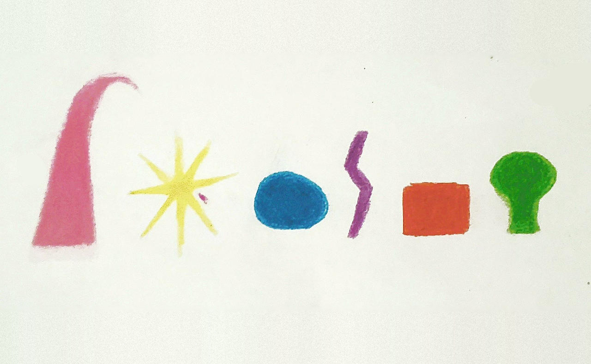

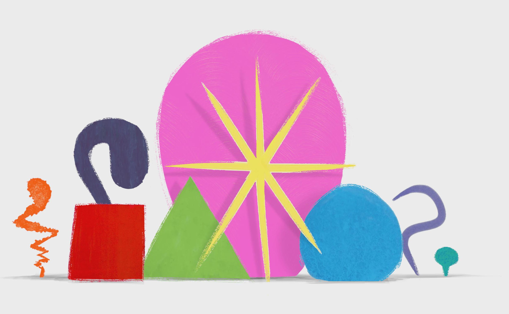

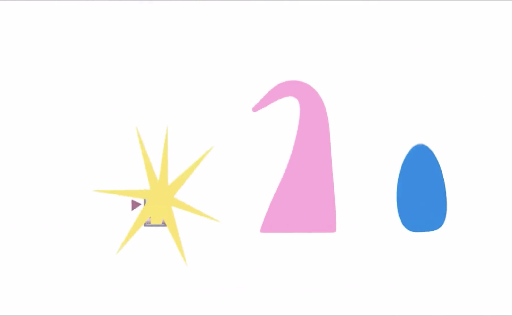


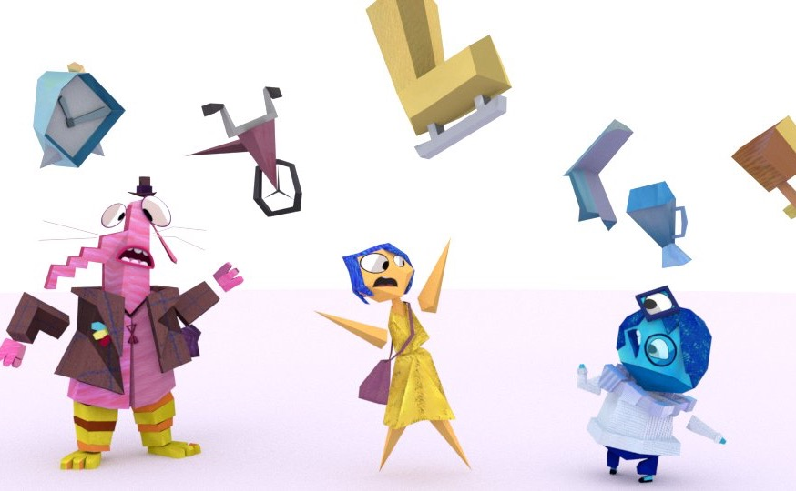

:::

::: {.caption}
See [GitHub](https://github.com/jackbandy/data-science-fun/tree/main/docs/assets/abstraction) for sources.
:::


---

## All Seven Variables{.image-frame-slide}

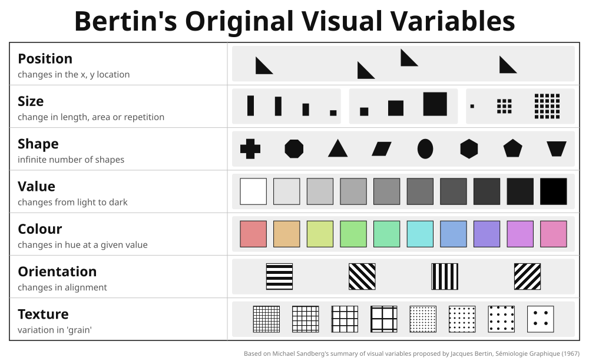

---


## Munzner's Channels {.smaller}

From Tamara Munzner's *Visualization Analysis & Design* (2014), which uses the term **channels** and splits them by what they can encode:

::: {.columns}
::: {.column width="50%"}
::: {style="font-size:0.82em;"}
**Magnitude channels** — ordered attributes, most to least effective:

1. Position on a common scale
2. Position on an unaligned scale
3. Length (1D size)
4. Tilt / angle
5. Area (2D size)
6. Depth (3D position)
7. Color luminance / saturation
8. Curvature
9. Volume (3D size)
:::
:::
::: {.column width="50%"}
::: {style="font-size:0.82em;"}
**Identity channels** — categorical attributes:

1. Spatial region
2. Color hue
3. **Motion**
4. Shape
:::

:::
:::

::: {.aside-note}
The ranking is empirical: it comes from the Cleveland & McGill graphical-perception
experiments and their later replications, not from taste.
:::

---

## Which Encoding for Which Data? {.image-frame-slide}


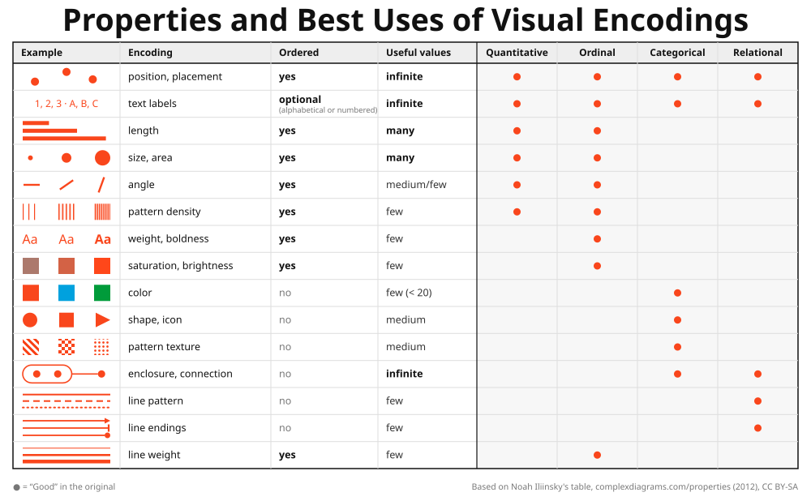

::: {.caption}
Based on Noah Iliinsky's table, complexdiagrams.com/properties (2012), CC BY-SA
:::

::: {.notes}
Two things to draw out. First, the "useful values" column is the practical
constraint: color is fine for categories but caps out under about twenty, so a
thirty-category color legend is already a design failure. Second, the last four
rows — enclosure, line pattern, line endings, line weight — are encodings for
*relational* data, which is the one column Bertin's table does not have. That is
the gap this table fills.
:::

---

# Dimensionality {.section-header}

---


## One Variable, Linear {.image-frame-slide}

A single feature, and the score moves with it at a constant rate.

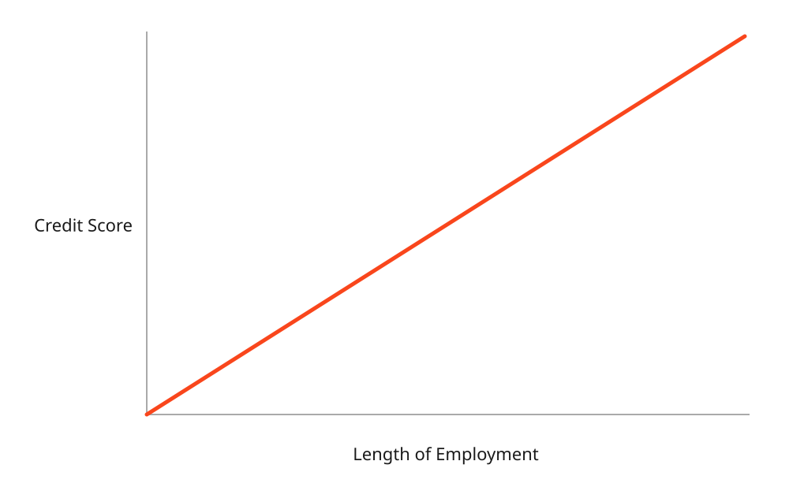

::: {.caption}
Figures from Solon Barocas and Chandler May, *Understanding Inscrutability* (NYU, 2017), found via Meredith Broussard, *More Than a Glitch* (MIT Press, 2023)
:::

---

## One Variable, Nonlinear {.image-frame-slide}

Still one feature, but the rate of change is not constant.

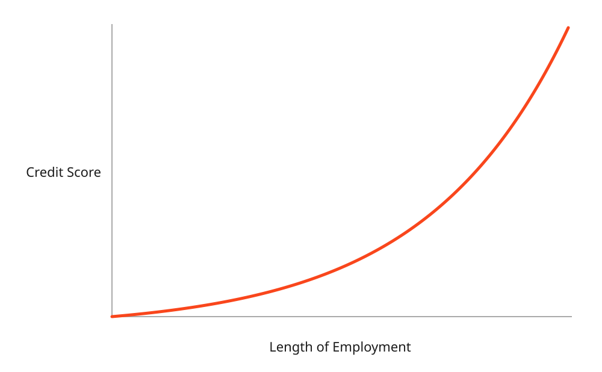

::: {.caption}
Figures from Solon Barocas and Chandler May, *Understanding Inscrutability* (NYU, 2017), found via Meredith Broussard, *More Than a Glitch* (MIT Press, 2023)
:::

---

## One Variable, Non-Monotonic {.image-frame-slide}

"More X" does not alwasy mean "more Y."

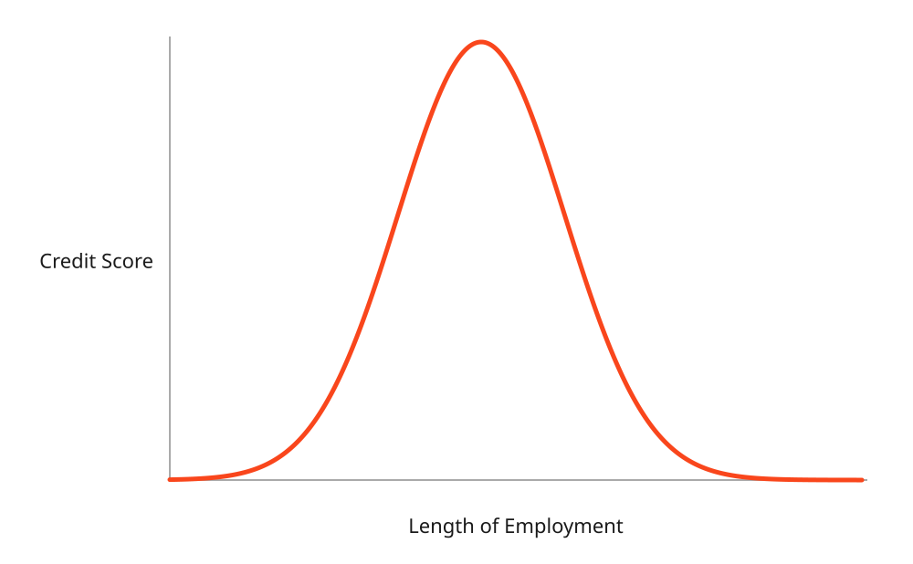

::: {.caption}
Figures from Solon Barocas and Chandler May, *Understanding Inscrutability* (NYU, 2017), found via Meredith Broussard, *More Than a Glitch* (MIT Press, 2023)
:::

---

## Two Variables, Linear {.image-frame-slide}

The relationship becomes a surface (i.e. a tilted plane).

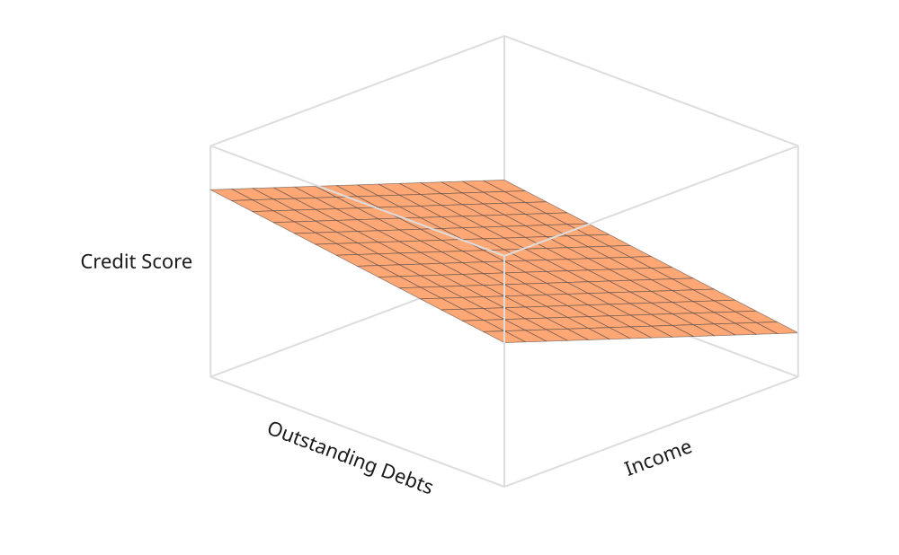

::: {.caption}
Figures from Solon Barocas and Chandler May, *Understanding Inscrutability* (NYU, 2017), found via Meredith Broussard, *More Than a Glitch* (MIT Press, 2023)
:::

---

## Two Variables, Nonlinear {.image-frame-slide}

Curved surface: the effect of one feature depends on where you are.

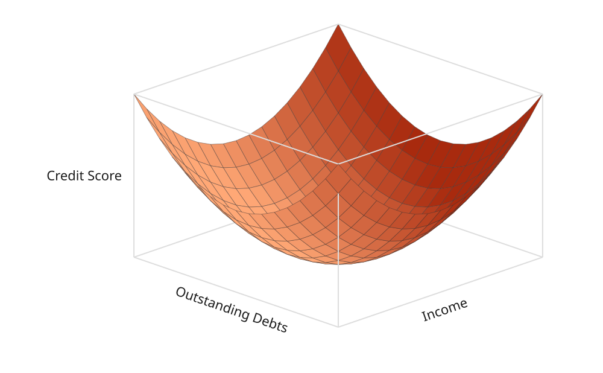

::: {.caption}
Figures from Solon Barocas and Chandler May, *Understanding Inscrutability* (NYU, 2017), found via Meredith Broussard, *More Than a Glitch* (MIT Press, 2023)
:::

---

## Two Variables, Non-Monotonic {.image-frame-slide}

Interaction: income's effect on score depends on the level of debt.

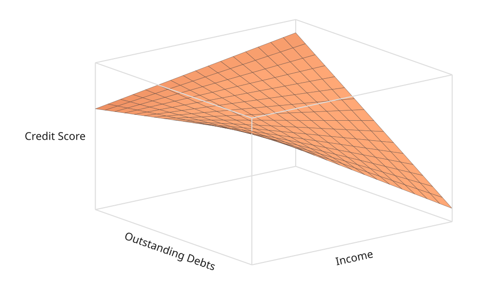

::: {.caption}
Figures from Solon Barocas and Chandler May, *Understanding Inscrutability* (NYU, 2017), found via Meredith Broussard, *More Than a Glitch* (MIT Press, 2023)
:::

---

## Two Variables, Many Turns {.image-frame-slide}

Same two features, a more tangled surface, hard to summarize in words.

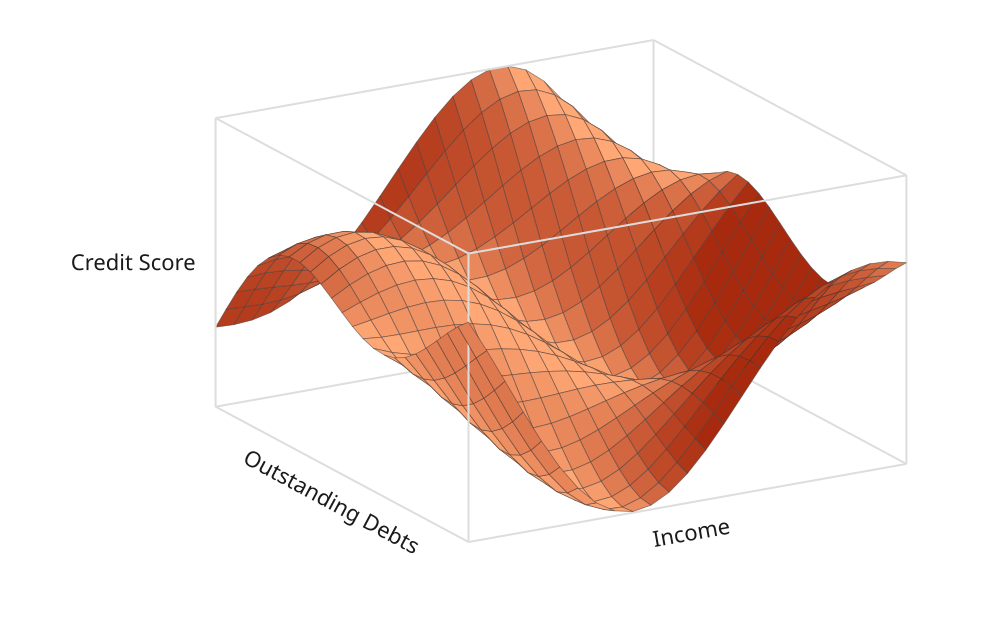

::: {.caption}
Figures from Solon Barocas and Chandler May, *Understanding Inscrutability* (NYU, 2017), found via Meredith Broussard, *More Than a Glitch* (MIT Press, 2023)
:::

---

## What a Neural Network Learns {.image-frame-slide}

The output of an actual four-layer network over the same two features.

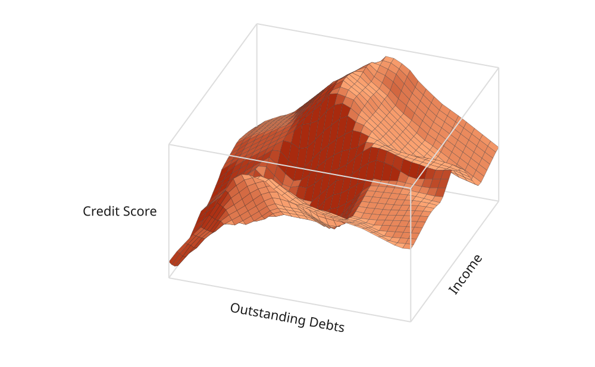

::: {.caption}
Figures from Solon Barocas and Chandler May, *Understanding Inscrutability* (NYU, 2017), found via Meredith Broussard, *More Than a Glitch* (MIT Press, 2023)
:::

::: {.notes}
Figures redrawn from Solon Barocas, "Understanding Inscrutability" (NYU ILI, 2017),
which I came to by way of Meredith Broussard's *More Than a Glitch* (MIT Press, 2023) —
she uses Barocas and Chandler May's version of this sequence to make the point that
inscrutability is not a mystery, just more dimensions than we can draw.
See assets/barocas-inscrutability/SOURCES.md.
:::


# Pie & Donut Charts {.section-header}


## Pie Charts Intuition

- A pie chart encodes **proportion** as **angle** (and area)
- Works okay for simple comparisons, single data points
- E.g. "roughly half" or "roughly a quarter"
- Difficult to compare multiple slices

---


## Pie vs. Bar Example {.image-frame-slide}

::: {.content-visible when-format="html"}

:::

::: {.content-visible when-format="pdf"}

:::

---

## Pie vs. Bar Example {.image-frame-slide}

::: {.content-visible when-format="html"}

:::

::: {.content-visible when-format="pdf"}

:::

---

## Pie vs. Bar: Three Comparisons {.image-frame-slide}

::: {.content-visible when-format="html"}
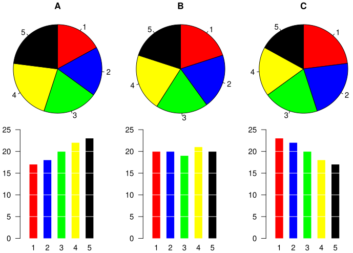
:::

::: {.content-visible when-format="pdf"}

:::

::: {.caption}
Schutz, [*Piecharts.svg*](https://commons.wikimedia.org/wiki/File:Piecharts.svg), Wikimedia Commons, 2008. [CC BY 1.0](https://creativecommons.org/licenses/by/1.0/)
:::

---

## Never Do a 3D Pie Chart

::: {.incremental}
- Never ever ever ever ever ever ever do a 3D pie chart
- Why?
    - Perspective distorts angle and area
    - Slices in the front (near the viewer) look larger
    - The tilt  changes how big a slice appears (independent of  data)
    - A 3D pie adds a dimension that carries no information
:::

---

## 3D Pie Chart in the Wild: Steve Jobs at Macworld 2008 {.image-frame-slide}

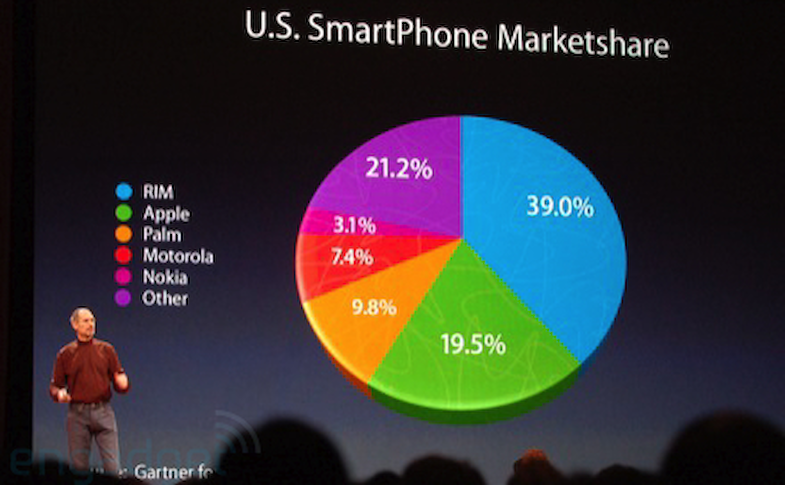{fig-alt="Steve Jobs' infamous U.S. SmartPhone Marketshare slide showing a 3D pie chart tilted toward the viewer. Apple's green slice sits at the front with a thick extruded edge. Source line reads Gartner for CQ3."}

::: {.caption}
Macworld San Francisco, 15 January 2008 — [smartphone market share segment, 8:24 to 10:10](https://www.youtube.com/watch?v=i9XU6wk_mWY&t=504s)
:::

---

## 3D Pie Chart in the Wild: Steve Jobs at Macworld 2008 {.image-frame-slide}

<iframe src="https://www.youtube-nocookie.com/embed/i9XU6wk_mWY?start=504&end=610&rel=0" title="Macworld San Francisco 2008 keynote — US smartphone market share segment (8:24–10:10)" loading="lazy" allow="accelerometer; clipboard-write; encrypted-media; gyroscope; picture-in-picture; web-share" allowfullscreen style="border: 1px solid #999; box-shadow: 0 10px 28px rgba(0,0,0,0.12); border-radius: 3px;"></iframe>

::: {.caption}
Macworld San Francisco, 15 January 2008 — [smartphone market share segment, 8:24 to 10:10](https://www.youtube.com/watch?v=i9XU6wk_mWY&t=504s)
:::

---

## Why did Steve Jobs make a 3D pie chart? {.split}

:::: {.split-content}

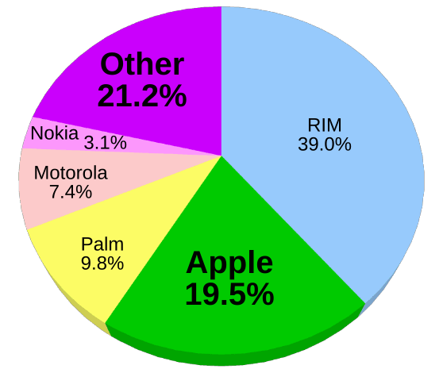

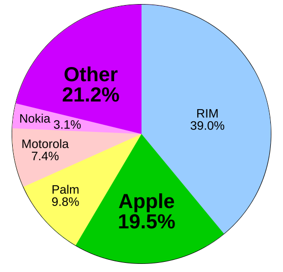

::::

::: {.notes}
Apple's 19.5% sits at the front of the tilted plate, where perspective stretches it
and the extruded edge adds visible area; RIM's 39.0% sits at the back, where
perspective shrinks it. Nothing in the data changed between the two panels — only the
projection. This is the same lesson as the Dimensionality section, run backwards:
a third dimension was added that carries no information at all.

Comparison figure by Cmglee (CC BY-SA 4.0); traced from Edward
Tufte's notebook page on pie charts.
:::

---

## The Donut Chart

- A **donut chart** is a pie chart with the center cut out
- Keeps the "this is all part of a whole" message
- Slices are still difficult to compare

---

## Donut in the Wild: FIFA World Cup 2026 {.image-frame-slide}

::: {.content-visible when-format="html"}

:::

::: {.content-visible when-format="pdf"}

:::

---

## Recreating the FIFA Chart: Setup

```{python}
#| echo: true
#| output: false
import matplotlib.pyplot as plt

sizes  = [63, 27, 10]
labels = ['COL', 'COD', 'In Contest']
colors = ['#f5c800', '#0057a8', '#00a896']

fig, ax = plt.subplots(figsize=(4, 4))
```

---

## Recreating the FIFA Chart: Draw {.code-figure-slide}

```{python}
#| echo: true
#| fig-format: svg
#| fig-alt: "Donut chart of FIFA World Cup 2026 Group K possession: Colombia 63% in yellow, DR Congo 27% in blue, In Contest 10% in teal"
ax.pie(sizes, labels=labels, autopct='%1.0f%%',
       colors=colors, startangle=90, counterclock=False,
       wedgeprops=dict(width=0.5), pctdistance=0.75)
ax.set_title('Possession', fontweight='bold')
plt.tight_layout()
```

---

## Recreating the FIFA Chart {.code-figure-slide}

```{python}
#| echo: true
#| fig-alt: "Donut chart of FIFA World Cup 2026 Group K possession: Colombia 63% in yellow, DR Congo 27% in blue, In Contest 10% in teal"
#| fig-format: svg
#| fig-width: 5
#| fig-height: 5
import matplotlib.pyplot as plt

sizes  = [63, 27, 10]
labels = ['COL', 'COD', 'In Contest']
colors = ['#f5c800', '#0057a8', '#00a896']
_, ax = plt.subplots()
ax.pie(sizes, labels=labels, autopct='%1.0f%%', colors=colors,
       startangle=90, counterclock=False,
       wedgeprops=dict(width=0.5), pctdistance=0.75)
ax.set_title('Possession', fontweight='bold');
```

---

## Recreating the FIFA Chart: Polished

```{python}
#| echo: false
#| fig-format: svg
#| fig-alt: "Donut chart styled after the FIFA World Cup 2026 broadcast graphic: Colombia 63% yellow, DR Congo 27% blue, In Contest 10% teal, with legend on the right inside a semi-transparent dark rounded rectangle."
#| out-width: 100%
import matplotlib.pyplot as plt
import matplotlib.gridspec as gridspec
from matplotlib.patches import FancyBboxPatch

phi = (1 + 5**0.5) / 2  # golden ratio ≈ 1.618
fig_h = 4.5
fig_w = fig_h * phi

fig = plt.figure(figsize=(fig_w, fig_h))
fig.patch.set_alpha(0)

bg = FancyBboxPatch(
    (0.02, 0.03), 0.96, 0.94,
    boxstyle="round,pad=0.03",
    facecolor=(0, 0, 0, 0.72),
    edgecolor="none",
    transform=fig.transFigure,
    zorder=0,
)
fig.add_artist(bg)

gs = gridspec.GridSpec(
    1, 2, width_ratios=[2, 3],
    left=0.03, right=0.97, bottom=0.05, top=0.95, wspace=0,
)
ax_d = fig.add_subplot(gs[0])
ax_l = fig.add_subplot(gs[1])
for ax in (ax_d, ax_l):
    ax.set_facecolor("none")

sizes  = [63, 27, 10]
labels = ["COL", "COD", "IN CONTEST"]
colors = ["#fcd116", "#0057a8", "#00a896"]

# startangle=-90 → Colombia starts at 6 o'clock, counterclock=False → runs clockwise to ~1 o'clock
ax_d.pie(
    sizes, colors=colors, startangle=-90, counterclock=False,
    wedgeprops=dict(width=0.5, edgecolor="white", linewidth=2.5),
)

ax_l.axis("off")
ax_l.set_xlim(0, 1)
ax_l.set_ylim(0, 1)

ax_l.text(0.08, 0.82, "POSSESSION", color="white", fontsize=19,
          fontweight="bold", va="center")

for i, (label, color, pct) in enumerate(zip(labels, colors, sizes)):
    y = 0.60 - i * 0.20
    # white ring behind colored fill
    ax_l.plot(0.10, y, "o", color="white",  markersize=19, zorder=4)
    ax_l.plot(0.10, y, "o", color=color,    markersize=14, zorder=5)
    ax_l.text(0.22, y, label,      color="white", fontsize=16, va="center")
    ax_l.text(0.72, y, f"{pct}%",  color="white", fontsize=16, va="center",
              fontweight="bold");
```

---

## What do you think of this code? {.smaller .scrollable}

```{python}
#| echo: true
#| output-location: column
#| fig-format: svg
#| fig-alt: "Donut chart styled after the FIFA World Cup 2026 broadcast graphic: Colombia 63% yellow, DR Congo 27% blue, In Contest 10% teal, with legend on the right inside a semi-transparent dark rounded rectangle."
import matplotlib.pyplot as plt
import matplotlib.gridspec as gridspec
from matplotlib.patches import FancyBboxPatch

phi = (1 + 5**0.5) / 2  # golden ratio ≈ 1.618
fig_h = 4.5
fig_w = fig_h * phi

fig = plt.figure(figsize=(fig_w, fig_h))
fig.patch.set_alpha(0)

bg = FancyBboxPatch(
    (0.02, 0.03), 0.96, 0.94,
    boxstyle="round,pad=0.03",
    facecolor=(0, 0, 0, 0.72),
    edgecolor="none",
    transform=fig.transFigure,
    zorder=0,
)
fig.add_artist(bg)

gs = gridspec.GridSpec(
    1, 2, width_ratios=[2, 3],
    left=0.03, right=0.97, bottom=0.05, top=0.95, wspace=0,
)
ax_d = fig.add_subplot(gs[0])
ax_l = fig.add_subplot(gs[1])
for ax in (ax_d, ax_l):
    ax.set_facecolor("none")

sizes  = [63, 27, 10]
labels = ["COL", "COD", "IN CONTEST"]
colors = ["#fcd116", "#0057a8", "#00a896"]

# startangle=-90 → Colombia starts at 6 o'clock, counterclock=False → runs clockwise to ~1 o'clock
ax_d.pie(
    sizes, colors=colors, startangle=-90, counterclock=False,
    wedgeprops=dict(width=0.5, edgecolor="white", linewidth=2.5),
)

ax_l.axis("off")
ax_l.set_xlim(0, 1)
ax_l.set_ylim(0, 1)

ax_l.text(0.08, 0.82, "POSSESSION", color="white", fontsize=19,
          fontweight="bold", va="center")

for i, (label, color, pct) in enumerate(zip(labels, colors, sizes)):
    y = 0.60 - i * 0.20
    # white ring behind colored fill
    ax_l.plot(0.10, y, "o", color="white",  markersize=19, zorder=4)
    ax_l.plot(0.10, y, "o", color=color,    markersize=14, zorder=5)
    ax_l.text(0.22, y, label,      color="white", fontsize=16, va="center")
    ax_l.text(0.72, y, f"{pct}%",  color="white", fontsize=16, va="center",
              fontweight="bold");
```

::: {.notes}
Open discussion slide. The code on the left is what drew the chart on the right —
it runs, it is not a listing.
Possible angles: how much of it is data versus styling; the pile of magic numbers
(0.02, 0.03, 0.96, 0.94, 0.60, 0.20) with nothing naming them; the hand-placed
legend that a real legend could have done; how it would hold up if a fourth
category showed up, or if someone asked for the same chart for a different match.
:::


# Week 5, Day 2 {.course-title .photo-title data-state="photo-title photo-title-zoom" background-image="../assets/orange-line-stops-better/stop05-clark-lake-a.jpg" background-size="cover"}

<h2>Descriptive Visualization</h2>

Jack Bandy
2026

---

## Map {.split}

::: {.split-content .narrow-aside}

::: {}
- Week 5: Clark/Lake
- Day 2
    - ggplot demo
:::

{.figure alt="Orange Line map with the Clark/Lake stop marked, the Week 5 stop"}

:::

---


# Data Visualization {.section-header}

---

##  Kinds of Visualization

::: {.incremental}
- **Exploratory Data Visualization:** figuring out what is true. Mostly for you.
- **Persuasive Data Visualization:** convincing other people something is true. Polished, for an audience.
:::

::: {.fragment style="margin-top:1em;"}
We will start with exploratory/descriptive visualization, then move to persuasive visualization ("visualization rhetoric")
:::

---

## Choosing a Plot: Quantitative Data

**Plots:** histograms, box plots, rug plots, smoothed interpolations (KDE — kernel density estimators)

::: {.incremental}
- **Histogram** — relative frequency of values; there's a tradeoff in choosing bin sizes.
- **Rug plot** — shows where the actual data points sit.
- **KDE plot** — a smoothed density estimate; there's a tradeoff in the "bandwidth" parameter.
:::

::: {.fragment style="margin-top:0.8em;"}
**Look for:** spread, shape, modes, gaps, outliers, unreasonable values.
:::

---

## Some Made-Up Data

```{python}
#| echo: true
rng = np.random.default_rng(418)
d = np.concatenate([rng.normal(5, 3, 45), rng.normal(30, 6, 170),
                    rng.normal(80, 3, 7)])
dist = pl.DataFrame({"v": d})
```

::: {style="font-size:0.8em; margin-top:0.4em;"}
Three groups together: a small one near 5, a big one near 30, and seven near 80.
:::

---

## Histogram {.code-figure-slide}

```{python}
#| echo: true
#| fig-alt: "Histogram of the made-up data with 32 bins, showing a small mode near 5, a large mode near 30, and a few isolated bars near 80"
(ggplot(dist, aes("v"))
 + geom_histogram(bins=32, fill=ORANGE, alpha=0.85,
                  color="white", size=0.3)
 + labs(x="Value", y="Count")
 + theme_minimal(base_size=14))
```

::: {style="font-size:0.8em;"}
Counts values falling in each bin. `bins` is the main knob to adjust.
:::

---

## Too Few Bins {.code-figure-slide}

```{python}
#| echo: true
#| fig-alt: "Histogram of the same data with only 4 bins, collapsing the two groups into one tall bar and hiding the gap before the outliers"
(ggplot(dist, aes("v"))
 + geom_histogram(bins=4, fill=ORANGE, alpha=0.85,
                  color="white", size=0.3)
 + labs(x="Value", y="Count")
 + theme_minimal(base_size=14))
```

::: {style="font-size:0.8em;"}
**Oversmoothed.** The two groups merge into one bar, and the gap before the outliers disappears. The shape looks simpler than the data actually is.
:::

---

## Too Many Bins {.code-figure-slide}

```{python}
#| echo: true
#| fig-alt: "Histogram of the same data with 300 bins, producing a spiky comb of mostly one- and two-count bars where the overall shape is hard to see"
(ggplot(dist, aes("v"))
 + geom_histogram(bins=300, fill=ORANGE, alpha=0.85,
                  color="white", size=0.3)
 + labs(x="Value", y="Count")
 + theme_minimal(base_size=14))
```

::: {style="font-size:0.8em;"}
**Undersmoothed.** Most bins hold one or two points, so the bars mostly report sampling noise. The modes are in there, but you have to squint past the comb to find them.
:::

---

## Rug Plot {.code-figure-slide}

```{python}
#| echo: true
#| fig-alt: "Rug plot of the made-up data: a dense band of tick marks near 30, a sparser band near 5, an empty stretch, and a handful of ticks near 80"
(ggplot(dist, aes("v", 0))
 + geom_rug(sides="b", color=INK, alpha=0.4, length=0.5)
 + labs(x="Value")
 + theme_minimal(base_size=14)
 + theme(panel_grid=element_blank(),
         axis_title_y=element_blank(),
         axis_text_y=element_blank()))
```

::: {style="font-size:0.8em;"}
One tick per data point (no binning, no smoothing). Great for spotting gaps and outliers; less helpful once the ticks overlap into a solid block.
:::

---

## KDE Plot {.code-figure-slide}

```{python}
#| echo: true
#| fig-alt: "Two kernel density curves over the same data: a smooth solid curve with two clear modes, and a wigglier dashed curve from a smaller bandwidth"
(ggplot(dist, aes("v"))
 + geom_density(size=1.2)                   # default bandwidth
 + geom_density(alpha=0.6, size=1.0, linetype="dashed",
                adjust=0.25)                              # 1/4 the bandwidth
 + labs(x="Value", y="Density")
 + theme_minimal(base_size=14))
```

::: {style="font-size:0.8em;"}
A smoothed estimate of the density. **`adjust` scales the bandwidth:** the dashed curve is wigglier and chases noise, the solid one may smooth real structure away.
:::

---

## All Three at Once {.figure-slide}

```{python}
#| echo: false
#| fig-width: 10
#| fig-height: 4.2
#| fig-alt: "A histogram of a bimodal distribution with a kernel density curve drawn over it and a rug of individual points along the bottom axis, annotated to point out the main mode, a second mode, a right skew, a gap, and a cluster of outliers"
(ggplot(dist, aes("v"))
 + geom_histogram(aes(y=after_stat("density")), bins=32,
                  fill=ORANGE, alpha=0.35, color="white", size=0.3)
 + geom_density(color=DARK, size=1.2)
 + geom_rug(color=INK, alpha=0.4, length=0.04)
 + note(44, 0.052, "Main mode")
 + note(-6, 0.030, "Second mode")
 + note(46, 0.014, "Skew right")
 + note(56, 0.004, "Gap")
 + note(70, 0.012, "Outliers", color=DARK)
 + note(14, 0.040, "KDE", color=DARK)
 + note(-6, 0.006, "Rug")
 + labs(y="Density")
 + theme_minimal(base_size=14)
 + theme(axis_title_x=element_blank(), figure_size=(10, 4.2)))
```

---

## Choosing a Plot: Categorical Data
**Plots:** bar plots, sorted by frequency or by the ordinal dimension

::: {.incremental}
- **Look for:** skew, frequent and rare categories, invalid categories.
- Consider grouping rare categories together and repeating the analysis.
- For **ordinal** data (e.g. education level: < 12th, HS, Trade, Some College, College), keep the natural order — don't sort bars shortest to tallest.
- **Dot plots** (Cleveland dot plots) make it easier to compare values than bars do.
:::

::: {.fragment style="font-size:0.85em; margin-top:0.6em;"}
Bar *width* has no meaning. Only length encodes the value.
:::

---

## Bar Plot (for an Ordinal Variable) {.figure-slide}

```{python}
#| echo: false
#| fig-width: 10
#| fig-height: 4.2
#| fig-alt: "Bar chart of mothers' education level with five bars in their natural order from less than 12th grade through college; high school is the tallest bar and trade school the shortest"
levels = ["< 12th", "HS", "Trade", "Some college", "College"]
edu = pl.DataFrame({
    "level": levels,
    "count": [201, 449, 61, 297, 219],
}).with_columns(pl.col("level").cast(pl.Enum(levels)))

(ggplot(edu, aes("level", "count"))
 + geom_col(fill=ORANGE, alpha=0.85, width=0.6)
 + labs(x="Education level", y="Count")
 + theme_minimal(base_size=15)
 + theme(figure_size=(10, 4.2)))
```

::: {style="font-size:0.6em; margin-top:0.2em;"}
The bars keep the natural order of the levels, not shortest-to-tallest.
:::

---

## Lollipop Chart of the Same Data {.figure-slide}

```{python}
#| echo: false
#| fig-width: 10
#| fig-height: 4.2
#| fig-alt: "Lollipop chart of the same five education-level counts, with one dot per level at the end of an orange stem running out from the axis, which can make the values easier to compare than the bars"
(ggplot(edu, aes("count", "level"))
 + geom_segment(aes(x=0, xend="count", y="level", yend="level"),
                color=ORANGE, size=1.5, alpha=0.85)
 + geom_point(color=ORANGE, size=5)
 + labs(x="Count", y="Education level")
 + theme_minimal(base_size=15)
 + theme(figure_size=(10, 4.2)))
```

::: {style="font-size:0.6em; margin-top:0.2em;"}
Same numbers as the bars, far less ink. The stem carries the value; the dot marks where it ends.
:::

---

## Describing the Shape of Data
Many models assume features are **symmetric** and **unimodal**. Deviations can affect the validity of the model.

::: {.incremental}
- **Symmetric** — looks the same on the left and right sides.
- **Skewed** — one tail is longer than the other (right-skewed, left-skewed).
- **Unimodal** — a single mode (peak).
- **Multimodal** — multiple modes (peaks).
:::

::: {.fragment style="margin-top:0.8em;"}
Histograms are the tool for exploring shape.
:::

---

## Three Shapes {.figure-slide}

```{python}
#| echo: false
rng = np.random.default_rng(1848)
shapes = ["Symmetric, unimodal", "Right-skewed", "Multimodal"]
shape_df = pl.DataFrame({
    "v": np.concatenate([
        rng.normal(0, 1, 600),
        rng.exponential(1, 600),
        np.concatenate([rng.normal(-2, 0.6, 300), rng.normal(2, 0.6, 300)]),
    ]),
    "shape": np.repeat(shapes, 600),
}).with_columns(pl.col("shape").cast(pl.Enum(shapes)))

def shape_plot(k):
    return (ggplot(upto(shape_df, "shape", shapes, k), aes("v"))
     + geom_histogram(aes(alpha="a"), bins=28, fill=ORANGE,
                      color="white", size=0.3)
     + scale_alpha_identity()
     + facet_wrap("shape", scales="free_x")
     + labs(y="Count")
     + theme_minimal(base_size=15)
     + theme(axis_title_x=element_blank(),
             strip_text=element_text(size=16, color=INK),
             panel_spacing=0.06, figure_size=(10, 4)))
```

::: {.r-stack}

::: {.fragment .fade-out fragment-index=1}
```{python}
#| echo: false
#| fig-width: 10
#| fig-height: 4
#| fig-alt: "Three histogram panels side by side; only the first is filled in, showing a symmetric unimodal bell shape"
shape_plot(1)
```
:::

::: {.fragment .fade-in-then-out fragment-index=1}
```{python}
#| echo: false
#| fig-width: 10
#| fig-height: 4
#| fig-alt: "The same three panels with the first two filled in: a symmetric bell shape and a right-skewed distribution with a long tail to the right"
shape_plot(2)
```
:::

::: {.fragment fragment-index=2}
```{python}
#| echo: false
#| fig-width: 10
#| fig-height: 4
#| fig-alt: "All three panels filled in: a symmetric unimodal bell shape, a right-skewed distribution with a long tail to the right, and a multimodal distribution with two separated peaks"
shape_plot(3)
```
:::

:::

---

## Identifying Relationships
::: {.incremental}
- Features in a dataset are usually related to each other. **Linear** relationships are the simplest type.
- **Correlation** describes the *strength* and *direction* of a linear relationship between two features.
  - **Positive** correlation — one feature increases as the other increases.
  - **Negative** correlation — one feature decreases as the other increases.
- We explore relationships using **scatter plots**: positive correlation, negative correlation, or no linear correlation.
:::

---

## Three Scatter Plots {.figure-slide}

```{python}
#| echo: false
rng = np.random.default_rng(418)
x = rng.uniform(0, 10, 90)
kinds = ["Positive correlation", "Negative correlation", "No linear correlation"]
corr_df = pl.DataFrame({
    "x": np.tile(x, 3),
    "y": np.concatenate([x + rng.normal(0, 1.5, 90),
                         -x + rng.normal(0, 1.5, 90),
                         rng.uniform(0, 10, 90)]),
    "kind": np.repeat(kinds, 90),
}).with_columns(pl.col("kind").cast(pl.Enum(kinds)))

def corr_plot(k):
    return (ggplot(upto(corr_df, "kind", kinds, k, on=0.75), aes("x", "y"))
     + geom_point(aes(alpha="a"), color=ORANGE, size=2.5)
     + scale_alpha_identity()
     + facet_wrap("kind", scales="free_y")
     + theme_minimal(base_size=15)
     + theme(axis_title=element_blank(), axis_text=element_blank(),
             strip_text=element_text(size=16, weight="bold", color=INK),
             panel_spacing=0.06, figure_size=(10, 4)))
```

::: {.r-stack}

::: {.fragment .fade-out fragment-index=1}
```{python}
#| echo: false
#| fig-width: 10
#| fig-height: 4
#| fig-alt: "Three scatter plot panels side by side; only the first has points, trending upward for positive correlation"
corr_plot(1)
```
:::

::: {.fragment .fade-in-then-out fragment-index=1}
```{python}
#| echo: false
#| fig-width: 10
#| fig-height: 4
#| fig-alt: "The same three panels with the first two filled in: points trending upward, then points trending downward for negative correlation"
corr_plot(2)
```
:::

::: {.fragment fragment-index=2}
```{python}
#| echo: false
#| fig-width: 10
#| fig-height: 4
#| fig-alt: "All three panels filled in: points trending upward (positive correlation), points trending downward (negative correlation), and points with no visible trend (no linear correlation)"
corr_plot(3)
```
:::

:::

---

## Correlation Coefficient

The correlation coefficient measures the linear relationship between two features $X$ and $Y$. We'll look at **Pearson's correlation coefficient** first.

::: {.incremental}
- The value is always between **-1 and 1**.
- The sign gives the direction; the closer to -1 or 1, the **stronger** the relationship.
- A coefficient of **0** means there is no *linear* relationship — which is not the same as no relationship at all.
:::

---

## Setup: Chicago 'L' ridership, 2019

Are stations that are busy on weekdays also busy on Saturdays?

```{python}
#| echo: true
cta = pl.read_csv("../../datasets/cta-ridership/Station_Entries_-_Daily_Totals_20260527.csv",
                  ignore_errors=True)
cta = cta.with_columns(pl.col("rides").str.replace_all(",", "").cast(pl.Int64))
by_day = (cta.filter(pl.col("date").str.ends_with("2019"))
             .group_by("stationname", "daytype")
             .agg(pl.col("rides").median()))
stations = by_day.pivot("daytype", index="stationname", values="rides")
```

::: {style="font-size:0.8em; margin-top:0.4em;"}
`daytype` is `W` for weekdays, `A` for Saturdays, `U` for Sundays and holidays.
:::

---

## Weekday vs. Saturday {.code-figure-slide}

```{python}
#| echo: true
#| fig-alt: "Scatter plot of 144 Chicago 'L' stations, median weekday entries on the x-axis against median Saturday entries on the y-axis, showing a strong upward linear trend"
(ggplot(stations, aes("W", "A"))
 + geom_point(alpha=0.7)
 + labs(x="Median weekday entries", y="Median Saturday entries")
 + theme_minimal())
```

---

## How strong is it?

```{python}
#| echo: true
stations.select(pl.corr("W", "A")).item()
```

::: {style="font-size:0.85em; margin-top:0.8em;"}
Strong and positive: busy stations are busy on both days. Not *perfect* — Loop stations serving commuters drop off far more on a Saturday than neighborhood stations do.
:::

---

## Setup: Cook County home sales, 2025

Do bigger houses sell for more money?

```{python}
#| echo: true
sales = pl.read_csv("../../datasets/cook-county-home-sales-2025/cook-county-home-sales-2025.csv",
                    ignore_errors=True)
homes = sales.filter(
    (pl.col("property_group") == "Single-Family")   # condos have no sqft
    & (pl.col("is_multisale") == False)             # one price per home
    & (pl.col("sale_price") > 10_000)               # drop nominal transfers
    & pl.col("building_sqft").is_not_null()
)
homes.height
```

::: {style="font-size:0.8em; margin-top:0.4em;"}
Three filters before a single plot. Each one is a decision about what counts as a "home sale."
:::

---

## Square Footage vs. Price {.code-figure-slide .build-slide}

::: {.r-stack}

::: {.fragment .fade-out fragment-index=1}
```{python}
#| echo: true
#| fig-alt: "Scatter plot of Cook County home sales, square footage against sale price, drawn with default styling so a few multi-million-dollar sales stretch the y-axis and flatten the rest of the cloud"
(ggplot(homes, aes("building_sqft", "sale_price"))
 + geom_point(color="#f9461c", alpha=0.08, size=0.8, raster=True))
```
:::

::: {.fragment .fade-in-then-out fragment-index=1}
```{python}
#| echo: true
#| fig-alt: "The same scatter plot with the y-axis limited to two million dollars, which spreads the bulk of the sales out over the full height of the panel"
(ggplot(homes, aes("building_sqft", "sale_price"))
 + geom_point(color="#f9461c", alpha=0.08, size=0.8, raster=True)
 + scale_y_continuous(limits=(0, 2_000_000),
                      labels=lambda v: [f"${x/1e6:g}M" for x in v]))
```
:::

::: {.fragment .fade-in-then-out fragment-index=2}
```{python}
#| echo: true
#| fig-alt: "The same scatter plot with both axes cropped, to two million dollars and six thousand square feet, bringing the cone shape of the main cloud into view"
(ggplot(homes, aes("building_sqft", "sale_price"))
 + geom_point(color="#f9461c", alpha=0.08, size=0.8, raster=True)
 + scale_y_continuous(limits=(0, 2_000_000),
                      labels=lambda v: [f"${x/1e6:g}M" for x in v])
 + scale_x_continuous(limits=(0, 6000)))
```
:::

::: {.fragment .fade-in-then-out fragment-index=3}
```{python}
#| echo: true
#| fig-alt: "The same cropped scatter plot, now with the axes labelled building square footage and sale price"
(ggplot(homes, aes("building_sqft", "sale_price"))
 + geom_point(color="#f9461c", alpha=0.08, size=0.8, raster=True)
 + scale_y_continuous(limits=(0, 2_000_000),
                      labels=lambda v: [f"${x/1e6:g}M" for x in v])
 + scale_x_continuous(limits=(0, 6000))
 + labs(x="Building square footage", y="Sale price"))
```
:::

::: {.fragment fragment-index=4}
```{python}
#| echo: true
#| fig-alt: "Scatter plot of about 24,800 Cook County single-family home sales, building square footage on the x-axis against sale price on the y-axis, showing an upward trend that fans out widely at larger sizes"
(ggplot(homes, aes("building_sqft", "sale_price"))
 + geom_point(color="#f9461c", alpha=0.08, size=0.8, raster=True)
 + scale_y_continuous(limits=(0, 2_000_000),
                      labels=lambda v: [f"${x/1e6:g}M" for x in v])
 + scale_x_continuous(limits=(0, 6000))
 + labs(x="Building square footage", y="Sale price")
 + theme_minimal())
```
:::

:::

---

## How strong is it?

```{python}
#| echo: true
homes.select(pl.corr("building_sqft", "sale_price")).item()
```

::: {style="font-size:0.85em; margin-top:0.8em;"}
Positive, but weaker than the CTA example (0.88).
:::

---

## The Cone Shape
::: {.incremental}
- The points **fan out** as houses get larger
    - Small homes cluster in a narrow price band, large homes are all over
- A single correlation coefficient reports one number for the whole cloud, and hides that the relationship is much tighter at one end than the other.
- Always look at the scatter plot.
- **The coefficient is only a summary.**
:::

::: {.fragment style="font-size:0.85em; margin-top:0.6em;"}
The plot above also hides 393 sales — those above \$2M or over 6,000 sq. ft. — which we cropped off the axes. They are still in the correlation.
:::

---


## Concluding Notes
::: {.fragment}
**One-dimensional data**

- Summarize with summary statistics (mean, standard deviation, max, min, quartiles).
- Visualize the distribution with histograms and box plots.
:::

::: {.fragment}
**Two-dimensional data**

- Visualize the relationship with scatter plots.
- Measure the relationship by computing correlations.
:::

::: {.fragment}
**High-dimensional data**

- Create a **scatterplot matrix** showing all pairwise scatter plots.
- Create a **correlation matrix** showing all pairwise correlations.
:::

---

# ggplot demo {.section-header}


## Recreating the FIFA Chart: R Setup

```{r}
#| echo: true
library(ggplot2)

sizes  <- c(63, 27, 10)
labels <- c("COL", "COD", "In Contest")
colors <- c("#fcd116", "#0057a8", "#00a896")

df <- data.frame(
  label = factor(labels, levels = labels),
  pct   = sizes,
  color = colors
)
```

---

## Recreating the FIFA Chart: R / ggplot {.code-figure-slide}

```{r}
#| echo: true
#| dev: svglite
#| fig-alt: "Basic donut chart using ggplot2 coord_polar with default colors: Colombia, DR Congo, In Contest"
ggplot(df, aes(x = 2, y = pct, fill = label)) +
  geom_col(width = 1) +
  coord_polar(theta = "y", start = pi, direction = -1)
```

---

## Recreating the FIFA Chart: R / ggplot {.code-figure-slide}

```{r}
#| echo: true
#| dev: svglite
#| code-line-numbers: "4-5"
#| fig-alt: "Donut chart with FIFA colors applied and donut hole created via xlim"
ggplot(df, aes(x = 2, y = pct, fill = label)) +
  geom_col(width = 1) +
  coord_polar(theta = "y", start = pi, direction = -1) +
  scale_fill_manual(values = setNames(df$color, df$label)) +
  xlim(0.5, 2.5)
```

---

## Recreating the FIFA Chart: R / ggplot {.code-figure-slide}

```{r}
#| echo: true
#| dev: svglite
#| code-line-numbers: "6-8"
#| fig-alt: "Completed ggplot2 donut chart: Colombia 63% yellow, DR Congo 27% blue, In Contest 10% teal, with Possession title and minimal theme"
ggplot(df, aes(x = 2, y = pct, fill = label)) +
  geom_col(width = 1) +
  coord_polar(theta = "y", start = pi, direction = -1) +
  scale_fill_manual(values = setNames(df$color, df$label)) +
  xlim(0.5, 2.5) +
  labs(title = "Possession", fill = NULL) +
  theme_void() +
  theme(plot.title = element_text(face = "bold", hjust = 0.5))
```

---

## Recreating the FIFA Chart: R Polished

```{r}
#| echo: false
#| dev: svglite
#| fig-alt: "Polished donut chart styled after FIFA broadcast graphic, made with ggplot2: dark background, Colombia 63% yellow, DR Congo 27% blue, In Contest 10% teal, with colored dot legend"
library(ggplot2)
library(ggtext)
library(patchwork)

sizes  <- c(63, 27, 10)
labels <- c("COL", "COD", "IN CONTEST")
colors <- c("#fcd116", "#0057a8", "#00a896")
df <- data.frame(
  label = factor(labels, levels = labels),
  pct   = sizes,
  color = colors
)

donut <- ggplot(df, aes(x = 2, y = pct, fill = label)) +
  geom_col(width = 1, color = "white", linewidth = 1) +
  coord_polar(theta = "y", start = pi, direction = -1) +
  scale_fill_manual(values = setNames(df$color, df$label)) +
  xlim(0.5, 2.5) +
  theme_void() +
  theme(legend.position = "none",
        plot.background = element_rect(fill = NA, color = NA))

legend_df <- data.frame(
  label = factor(labels, levels = labels),
  pct   = paste0(sizes, "%"),
  color = colors,
  y     = c(0.65, 0.45, 0.25)
)
legend_panel <- ggplot(legend_df, aes(y = y)) +
  annotate("text", x = 0.1, y = 0.85, label = "POSSESSION",
           color = "white", size = 6, fontface = "bold", hjust = 0) +
  geom_point(aes(x = 0.12, color = label), size = 7) +
  geom_text(aes(x = 0.24, label = label), color = "white",
            size = 5, hjust = 0) +
  geom_text(aes(x = 0.95, label = pct), color = "white",
            size = 5, hjust = 1, fontface = "bold") +
  scale_color_manual(values = setNames(df$color, df$label)) +
  xlim(0, 1) + ylim(0, 1) +
  theme_void() +
  theme(legend.position = "none",
        plot.background = element_rect(fill = NA, color = NA))

donut + legend_panel +
  plot_layout(widths = c(2, 3)) &
  theme(plot.background = element_rect(fill = "#000000bb", color = NA))
```

---

## What do you think of this code? {.smaller .scrollable}

```{r}
#| echo: true
#| output-location: column
#| dev: svglite
#| fig-alt: "Polished donut chart styled after FIFA broadcast graphic, made with ggplot2: dark background, Colombia 63% yellow, DR Congo 27% blue, In Contest 10% teal, with colored dot legend"
library(ggplot2)
library(ggtext)
library(patchwork)

sizes  <- c(63, 27, 10)
labels <- c("COL", "COD", "IN CONTEST")
colors <- c("#fcd116", "#0057a8", "#00a896")
df <- data.frame(
  label = factor(labels, levels = labels),
  pct   = sizes,
  color = colors
)

donut <- ggplot(df, aes(x = 2, y = pct, fill = label)) +
  geom_col(width = 1, color = "white", linewidth = 1) +
  coord_polar(theta = "y", start = pi, direction = -1) +
  scale_fill_manual(values = setNames(df$color, df$label)) +
  xlim(0.5, 2.5) +
  theme_void() +
  theme(legend.position = "none",
        plot.background = element_rect(fill = NA, color = NA))

legend_df <- data.frame(
  label = factor(labels, levels = labels),
  pct   = paste0(sizes, "%"),
  color = colors,
  y     = c(0.65, 0.45, 0.25)
)
legend_panel <- ggplot(legend_df, aes(y = y)) +
  annotate("text", x = 0.1, y = 0.85, label = "POSSESSION",
           color = "white", size = 6, fontface = "bold", hjust = 0) +
  geom_point(aes(x = 0.12, color = label), size = 7) +
  geom_text(aes(x = 0.24, label = label), color = "white",
            size = 5, hjust = 0) +
  geom_text(aes(x = 0.95, label = pct), color = "white",
            size = 5, hjust = 1, fontface = "bold") +
  scale_color_manual(values = setNames(df$color, df$label)) +
  xlim(0, 1) + ylim(0, 1) +
  theme_void() +
  theme(legend.position = "none",
        plot.background = element_rect(fill = NA, color = NA))

donut + legend_panel +
  plot_layout(widths = c(2, 3)) &
  theme(plot.background = element_rect(fill = "#000000bb", color = NA))
```

::: {.notes}
Same discussion, ggplot edition. Worth comparing against the matplotlib version:
the chart itself is a stacked bar in polar coordinates, and the legend is still
hand-built as a second plot glued on with patchwork. Which of the two is easier to
change? Which one would you rather inherit?
:::

---

## Comparing matplotlib and ggplot {.smaller}

::: {.columns}
::: {.column width="50%"}

**Python / matplotlib**

```python
import matplotlib.pyplot as plt

sizes  = [63, 27, 10]
labels = ['COL', 'COD', 'In Contest']
colors = ['#fcd116', '#0057a8', '#00a896']

# wedge order + label positions handled by pie()
_, ax = plt.subplots()

ax.pie(sizes, labels=labels, colors=colors,
       autopct='%1.0f%%', pctdistance=0.75,
       startangle=90, counterclock=False,
       wedgeprops=dict(width=0.5))
ax.set_title('Possession', fontweight='bold')
```

:::
::: {.column width="50%"}

**R / ggplot2**

```r
library(ggplot2)

sizes  <- c(63, 27, 10)
labels <- c("COL", "COD", "In Contest")
colors <- c("#fcd116", "#0057a8", "#00a896")

# wedge order + label positions computed by hand
df <- data.frame(label = factor(labels, levels = labels),
                 pct = sizes)
df$pos <- cumsum(df$pct) - df$pct / 2

ggplot(df, aes(x = 2, y = pct, fill = label)) +
  geom_col(width = 1,
           position = position_stack(reverse = TRUE)) +
  geom_text(aes(x = 1.75, y = pos,
                label = paste0(pct, "%"))) +
  geom_text(aes(x = 2.75, y = pos, label = label)) +
  coord_polar(theta = "y", start = 0, direction = 1) +
  scale_fill_manual(values = setNames(colors, labels)) +
  xlim(0.5, 3) +
  labs(title = "Possession") +
  theme_void() +
  theme(legend.position = "none",
        plot.title = element_text(face = "bold",
                                  hjust = 0.5))
```

:::
:::


---

## Color Blindness

::: {style="border:3px dashed #f9461c; border-radius:12px; padding:0.8em 1em; margin-top:0.4em;"}
[TODO]{style="background:#f9461c; color:#fff; font-weight:bold; letter-spacing:2px; font-size:0.55em; border-radius:4px; padding:2px 10px;"}

``` markdown
<!-- TODO: ~8% of men have red-green color vision deficiency.
     Cover: why the default red/green pairing fails; colorblind-safe
     palettes (viridis, Okabe-Ito); redundant encoding (shape, position,
     direct labels) so hue is never the only channel carrying the data.
     Possible demo: simulate the FIFA donut above under deuteranopia. -->
```
:::


# Sources {.sources}

1. GitHub source: <https://github.com/jackbandy/data-science-fun/blob/main/docs/slides/week5.qmd>.
2. Pie vs. bar comparison: Schutz, [*Piecharts.svg*](https://commons.wikimedia.org/wiki/File:Piecharts.svg), Wikimedia Commons, 2008. [CC BY 1.0](https://creativecommons.org/licenses/by/1.0/).
3. Dimensionality figures redrawn from Solon Barocas, *Understanding Inscrutability*, presented at ["Algorithms and Explanations,"](https://www.law.nyu.edu/centers/ili/events/algorithms-and-explanations) Information Law Institute, NYU School of Law, 27–28 April 2017. Found by way of Meredith Broussard, *More Than a Glitch: Confronting Race, Gender, and Ability Bias in Tech* (MIT Press, 2023; ISBN 9780262047654, paperback 9780262548328), which cites Barocas and Chandler May on visualizing data relationships.
4. 3D pie chart comparison: Cmglee, [*Misleading macworld 3d pie chart.svg*](https://commons.wikimedia.org/wiki/File:Misleading_macworld_3d_pie_chart.svg), Wikimedia Commons. [CC BY-SA 4.0](https://creativecommons.org/licenses/by-sa/4.0). Redrawn from the chart shown at Macworld 2008, via [Edward Tufte's notebook on pie charts](https://www.edwardtufte.com/notebook/pie-charts/).
5. Slides developed using materials from [Elena Zheleva](https://www.cs.uic.edu/~elena/) and [Gonzalo Bello Lander](https://cs.uic.edu/profiles/gonzalo-bello/), the Berkeley DS 100 team, Marine Carpuat, and Brian Ziebart.
6. Macworld 2008 keynote clip: ["Macworld San Francisco 2008 Keynote Address (MacBook Air & iTunes Movie Rentals) by Steve Jobs"](https://www.youtube.com/watch?v=i9XU6wk_mWY), Apple Keynote Videos (YouTube); market share segment at 8:24–10:10.
7. Visual variables: Jacques Bertin, *Sémiologie graphique: Les diagrammes, les réseaux, les cartes* (Gauthier-Villars, 1967); English translation *Semiology of Graphics: Diagrams, Networks, Maps*, trans. William J. Berg (University of Wisconsin Press, 1983; reissued by Esri Press, 2010).
8. Channels and the effectiveness ranking: Tamara Munzner, *Visualization Analysis & Design* (CRC Press, 2014), ch. 5. Open companion site: <https://www.cs.ubc.ca/~tmm/vadbook/>.
9. Chicago map layers: [chicago-maps](https://github.com/jackbandy/data-science-fun/tree/main/datasets/chicago-maps) — city and ward boundaries and ward-level ACS income from the [Chicago Data Portal](https://data.cityofchicago.org/); water polygons from U.S. Census Bureau [TIGERweb](https://tigerweb.geo.census.gov/) areal hydrography.
10. Shape anecdote: Pete Docter on designing characters from basic geometry, in [*Pete Docter | Geometry of Characters*](https://youtu.be/i2tkCBFlXyc?t=398) (Any-mation, 2016), from 6:38. Images in the build: [docs/assets/abstraction](https://github.com/jackbandy/data-science-fun/tree/main/docs/assets/abstraction) — see that folder's `SOURCES.md` for per-image credits.
11. Slide deck built with [Quarto](https://quarto.org/) revealjs.
12. Title font is Big Shoulders; Body font is [Libre Franklin](https://en.wikipedia.org/wiki/Franklin_Gothic#Libre_Franklin).
