```{r}
#| include: false
library(reticulate)
# Prefer the local dev venv (built by build_all_quarto.sh); fall back to
# whatever python3 is on PATH when it's absent (e.g. CI, which installs
# dependencies system-wide via SKIP_VENV=true).
venv_python <- here::here(".venv/bin/python")
use_python(if (file.exists(venv_python)) venv_python else Sys.which("python3"), required = TRUE)
```

```{python}
#| include: false
import matplotlib
matplotlib.use("Agg")
```

```{python}
#| echo: false
# Shared setup for every figure in this deck.
import numpy as np
import polars as pl
from plotnine import *

ORANGE = "#f9461c"
DARK = "#c83214"
INK = "#1a1a1a"

def note(x, y, text, ha="left", color=INK, size=13):
    """A text annotation in the deck's type and colors."""
    return annotate("text", x=x, y=y, label=text, ha=ha, size=size, color=color)

def upto(df, col, levels, k, on=0.8):
    """Alpha column: `on` for the first k levels of `col`, 0 for the rest.

    Used with scale_alpha_identity() to render a faceted figure several times
    with the later panels blank. Every panel frame and axis is still computed
    from the full data, so overlaying the versions in an .r-stack fills the
    panels in one at a time without the layout shifting.
    """
    return df.with_columns(
        pl.when(pl.col(col).cast(pl.Utf8).is_in(levels[:k]))
          .then(on).otherwise(0.0).alias("a"))
```

# Week 5 Slide Deck {.course-title}

<h2>Visualizations</h2>

Jack Bandy
2026

# Week 5, Day 1 {.course-title .photo-title data-state="photo-title" background-image="../assets/orange-line-stops-better/stop05-clark-lake-a.jpg" background-size="cover"}

<h2>Visualization Basics</h2>

CS 418, Week 5 🟠 Clark/Lake 🟠

---


## {.photo-only data-state="photo-only" background-image="../assets/orange-line-stops-better/stop05-clark-lake-a.jpg" background-size="cover"}

---

## Random Roll Call {.iframe-slide}
<div class="random-draw" data-num="12" data-min="1" data-max="62">
<div class="random-draw-frame">
<div class="random-draw-numbers" role="status" aria-live="polite" data-placeholder="Press “Draw” for 12 random numbers between 1 and 62."></div>
</div>
<p class="random-draw-controls"><button type="button" class="random-draw-button">Draw</button> <label class="random-draw-sort"><input type="checkbox" class="random-draw-sort-input"> Sort</label> <span class="random-draw-status"></span></p>
</div>

<style>
.random-draw { display: flex; flex-direction: column; flex: 1; min-height: 0; }
.random-draw-frame { flex: 1; min-height: 0; display: flex; justify-content: center; }
.random-draw-numbers { height: 100%; aspect-ratio: 1.618 / 1; max-width: 100%; border: 1px solid #999; display: grid; grid-template-columns: repeat(6, 1fr); grid-template-rows: repeat(2, 1fr); place-items: center; }
.random-draw-numbers .random-draw-number { font-size: 3rem; font-weight: 700; line-height: 1; }
.random-draw-numbers .random-draw-placeholder { grid-column: 1 / -1; grid-row: 1 / -1; text-align: center; font-size: 1.4rem; color: #555; padding: 0 1.5em; }
.random-draw-controls { flex: none; margin: 12px 0 0; }
.random-draw-button { font: inherit; font-size: 1.1rem; font-weight: 600; padding: 0.3em 1.2em; border: none; border-radius: 3px; background: #f9461c; color: #fff; cursor: pointer; }
.random-draw-button:hover:not(:disabled) { background: #e03c14; }
.random-draw-button:disabled { opacity: 0.6; cursor: default; }
.random-draw-sort { font-size: 1rem; color: #555; margin-left: 0.75em; cursor: pointer; }
.random-draw-status { font-size: 1rem; color: #555; margin-left: 0.75em; }
</style>

<script>
(() => {
  // The Sequence Generator, not the Integer Generator: /integers/ samples *with*
  // replacement and silently ignores a `unique` parameter, so a roll call could
  // name the same student twice. /sequences/ returns a shuffled permutation of
  // min..max, and the first `num` of that is a sample without replacement.
  const API = "https://www.random.org/sequences/";
  function setup(root) {
    if (root.dataset.wired) return;
    root.dataset.wired = "1";
    const out = root.querySelector(".random-draw-numbers");
    const button = root.querySelector(".random-draw-button");
    const status = root.querySelector(".random-draw-status");
    const sortBox = root.querySelector(".random-draw-sort-input");
    const num = root.dataset.num, min = root.dataset.min, max = root.dataset.max;
    const url = API + "?min=" + min + "&max=" + max + "&col=1&format=plain&rnd=new";
    let drawn = null;
    function placeholder(text) {
      out.innerHTML = "";
      const p = document.createElement("div");
      p.className = "random-draw-placeholder";
      p.textContent = text;
      out.appendChild(p);
    }
    function render() {
      if (!drawn) return;
      const numbers = sortBox.checked ? drawn.slice().sort(function (a, b) { return a - b; }) : drawn;
      out.innerHTML = "";
      numbers.forEach(function (n) {
        const cell = document.createElement("div");
        cell.className = "random-draw-number";
        cell.textContent = n;
        out.appendChild(cell);
      });
    }
    function draw() {
      button.disabled = true;
      status.textContent = "drawing from random.org…";
      fetch(url, { cache: "no-store" })
        .then(function (r) { if (!r.ok) throw new Error("HTTP " + r.status); return r.text(); })
        .then(function (text) {
          const numbers = text.trim().split(/\s+/).filter(Boolean).map(Number);
          if (!numbers.length) throw new Error("empty response");
          drawn = numbers.slice(0, Number(num));
          render();
          status.textContent = "true random numbers from random.org";
        })
        .catch(function (err) {
          drawn = null;
          placeholder("Could not reach random.org (" + err.message + "). Open the draw in a new tab instead.");
          status.textContent = "";
        })
        .then(function () { button.disabled = false; });
    }
    button.addEventListener("click", draw);
    sortBox.addEventListener("change", render);
    placeholder(out.dataset.placeholder);
  }
  function init() {
    document.querySelectorAll(".random-draw").forEach(setup);
  }
  if (document.readyState === "loading") {
    document.addEventListener("DOMContentLoaded", init);
  } else {
    init();
  }
})();
</script>

::: {.iframe-caption}
Numbers drawn live from <a href="https://www.random.org/sequences/?min=1&max=62&col=1&format=plain&rnd=new">random.org/sequences/?min=1&max=62&col=1&format=plain&rnd=new</a> &mdash; shuffle 1&ndash;62, take first 12.
:::

---


## The Datasaurus Dozen: Same Statistics {.image-frame-slide auto-animate=true}

::: {.fragment}

:::

<script>
// Hold the GIF until the fragment is clicked. A looping animation that loads
// with the slide is already halfway through by the time anyone looks at it;
// swapping the src on reveal means the dinosaur is always the first thing you
// see. Clearing it again on the way back re-arms the slide.
document.addEventListener("fragmentshown", (e) => {
  e.fragment.querySelectorAll("img[data-gif-src]").forEach((img) => {
    img.src = img.dataset.gifSrc;
  });
});
document.addEventListener("fragmenthidden", (e) => {
  e.fragment.querySelectorAll("img[data-gif-src]").forEach((img) => {
    img.removeAttribute("src");
  });
});
</script>

---

## The Datasaurus Dozen: Why Visualize? {auto-animate=true}

:::: {.columns}
::: {.column width="52%"}
::: {.incremental style="font-size:0.72em;"}
- Matejka & Fitzmaurice (CHI 2017) took Alberto Cairo's "Datasaurus" and generated **twelve more datasets** from it.
- Each is nudged point by point toward a target shape, using only moves that leave the summary statistics alone.
- All thirteen have the same mean, standard deviation, and correlation (to two decimals!)
- Summary statistics are a "*lossy compression*"
- Visualization helps
:::
:::
::: {.column width="48%"}


```{python}
#| echo: false
#| output: asis
dino = pl.read_csv("../../datasets/datasaurus-dozen/datasaurus-dozen.csv")
agg = dino.group_by("dataset").agg(
    pl.col("x").mean().alias("mx"), pl.col("y").mean().alias("my"),
    pl.col("x").std().alias("sx"), pl.col("y").std().alias("sy"),
    pl.corr("x", "y").alias("r"))
# U+2212 minus, since a hyphen next to a digit reads as a dash on a slide.
r_bar = f'{agg["r"].mean():.2f}'.replace("-", "−")
print(
    '<div style="text-align:center; font-size:0.55em; color:#565a5c; margin-top:0.3em;">'
    f'across all {agg.height} datasets — '
    f'mean(x) {agg["mx"].mean():.2f}, mean(y) {agg["my"].mean():.2f}, '
    f'sd(x) {agg["sx"].mean():.2f}, sd(y) {agg["sy"].mean():.2f}, '
    f'r {r_bar}</div>'
)
```

:::
::::

---

## Map: Day 1 {.split}

::: {.split-content .narrow-aside}

::: {}
- Week 5: Clark/Lake
- Day 1
    - Elements of visualization
    - Distributions of one variable
    - Relationships between variables
    - Perception: color & length
    - Pie & donut charts
:::

{.figure alt="Orange Line map with the Clark/Lake stop marked, the Week 5 stop"}

:::

# Elements of Visualization {.section-header}

```{python}
#| echo: false
# Setup for the "elements of visualization" slides: one tiny helper for the
# abstract mark demos. The three Chicago map figures (texture, color, value) are
# built ahead of time by datasets/chicago-maps/make_bertin_figures.py and read in
# as SVGs, so this deck no longer loads the geojson.
import matplotlib.pyplot as plt


# Marker paths traced from ../assets/abstraction/0-shapes.svg, so the abstract
# shape demo and the "Shape Anecdote" slide speak the same visual vocabulary.
from matplotlib.path import Path as MplPath

def _poly(points):
    """A closed subpath through `points` (SVG user units, y growing downward)."""
    pts = list(points) + [points[0]]
    codes = [MplPath.MOVETO] + [MplPath.LINETO] * (len(points) - 1) + [MplPath.CLOSEPOLY]
    return pts, codes

def _circle(cx, cy, r, n=64):
    a = np.linspace(0, 2 * np.pi, n, endpoint=False)
    return _poly(list(zip(cx + r * np.cos(a), cy + r * np.sin(a))))

def _rect(x, y, w, h):
    return _poly([(x, y), (x + w, y), (x + w, y + h), (x, y + h)])

def _join(*parts):
    verts, codes = [], []
    for v, c in parts:
        verts += list(v)
        codes += list(c)
    return verts, codes

def _marker(part):
    """Normalize an SVG-space subpath set into a unit-height scatter marker.

    Flipping y and dividing by the bounding-box height means every shape is
    drawn at the same height for a given `s`, so only the form varies.
    """
    verts, codes = part
    v = np.asarray(verts, dtype=float)
    v[:, 1] *= -1
    v /= v[:, 1].max() - v[:, 1].min()
    v -= [(v[:, 0].max() + v[:, 0].min()) / 2, (v[:, 1].max() + v[:, 1].min()) / 2]
    return MplPath(v, codes)

def _teardrop(cx=809.0, cy=488.4, r=104.0, tip=660.0, n=48):
    """Point at the bottom, round over the top -- the upside-down tear.

    Traced curve-for-curve from the SVG: the flanks are cubics that leave the
    tip and meet the semicircle tangentially, so there is no corner where the
    straight sides would otherwise hit the dome.
    """
    a = np.linspace(np.pi, 2 * np.pi, n)  # over the top in SVG's y-down space
    arc = list(zip(cx + r * np.cos(a), cy + r * np.sin(a)))
    verts = ([(cx, tip), (734.12, 576.80), (cx - r, 535.20), (cx - r, cy)]
             + arc[1:]
             + [(cx + r, 535.20), (883.88, 576.80), (cx, tip), (cx, tip)])
    codes = ([MplPath.MOVETO] + [MplPath.CURVE4] * 3
             + [MplPath.LINETO] * (len(arc) - 1)
             + [MplPath.CURVE4] * 3 + [MplPath.CLOSEPOLY])
    return verts, codes

# The Chicago flag's star: six points, one straight up, inner vertices at 0.367 of the
# outer radius -- the flag's own proportion, measured off Chicago-star.png.
STAR = _marker(_poly([
    (219.00, 387.00), (244.05, 480.12), (337.21, 455.25), (269.10, 523.50),
    (337.21, 591.75), (244.05, 566.88), (219.00, 660.00), (193.95, 566.88),
    (100.79, 591.75), (168.90, 523.50), (100.79, 455.25), (193.95, 480.12)]))
SQUARE = _marker(_rect(419.75, 471.50, 188.50, 188.50))
TEARDROP = _marker(_teardrop())
BROCCOLI = _marker(_join(
    _circle(1027.43, 486.71, 80.60), _circle(1104.00, 436.74, 80.60),
    _circle(1180.57, 486.71, 80.60), _rect(1063.70, 486.71, 80.60, 173.29)))
BOLT = _marker(_poly([
    (1419.80, 341.50), (1305.40, 507.12), (1388.60, 507.12), (1336.60, 660.00),
    (1492.60, 468.90), (1403.16, 468.90), (1486.36, 341.50)]))

def mark_axes(ax, xlim=(0, 10), ylim=(0, 6)):
    """A blank frame for the abstract mark demos."""
    ax.set(xlim=xlim, ylim=ylim, xticks=[], yticks=[])
    ax.set_aspect("equal")
    for s in ax.spines.values():
        s.set(color="#c9ccce", linewidth=1)
```

## Position {.text-figure-slide}

::: {.columns}
::: {.column width="46%"}
::: {.dense}
- **Position**: the location of a mark within a plane.
- According to Bertin, it is the **base** of the graphic (not a "retinal" variable)
- Scatter plots, bars, maps: position-forward
:::
:::
::: {.column width="54%"}
```{python}
#| echo: false
#| fig-width: 5.2
#| fig-height: 4.0
#| fig-alt: "Three identical orange dots placed at different spots in an empty frame; nothing about the dots varies except where they are"
fig, ax = plt.subplots()
ax.scatter([1.6, 5.0, 8.4], [1.3, 4.4, 2.6], s=340, color=ORANGE, zorder=3)
mark_axes(ax)
```
:::
:::


---

## Size {.text-figure-slide}

::: {.columns}
::: {.column width="46%"}
::: {.dense}
- **Size**: how large or small a mark is (length, area, or volume).
- *Ordered* and *quantitative*: bigger reliably reads as more.
- Also dissociative (small marks are less prominent)
- Can be difficult to compare similar values
:::
:::
::: {.column width="54%"}
```{python}
#| echo: false
#| fig-width: 5.2
#| fig-height: 4.0
#| fig-alt: "A small orange dot on the left and a much larger orange dot on the right, identical in every way except size"
fig, ax = plt.subplots()
ax.scatter([3.0, 7.0], [3.0, 3.0], s=[120, 2600], color=ORANGE, zorder=3)
mark_axes(ax)
```
:::
:::


---

## Texture (Grain) {.text-figure-slide}

::: {.columns}
::: {.column width="46%"}
::: {.dense}
- **Texture** (Bertin's **grain**): how coarse or fine a fill pattern is.
- only the scale changes changes in this example
- Land is coarse, water is fine
- Categorical (not *quantitative*)
:::
:::
::: {.column width="54%"}
{.figure alt="Map of Chicago drawn only in black and white: the land is filled with a coarse dot pattern and Lake Michigan and the rivers with a much finer dot pattern"}
:::
:::


---

## Color (Hue) {.text-figure-slide}

::: {.columns}
::: {.column width="46%"}
::: {.dense}
::: {}
- **Color** for Bertin means only **hue** (lightness is fixed)
- Example: same map, same two areas, only hue is different.
- **Not ordered.** (Blue is not "more" than tan)
- So hue/color encodes identity/category (not magnitude)
:::
:::
:::
::: {.column width="54%"}
{.figure alt="The same map of Chicago, now with land filled in sand and Lake Michigan and the rivers filled in teal"}
:::
:::


---

## Value {.text-figure-slide}

::: {.columns}
::: {.column width="46%"}
::: {.dense}
- **Value**: lightness (independent of hue)
- "Hue" is grey in this example, "value" is how dark
- Chicago's 50 wards, shaded by median household income
- *ordered*: darker reads as "more."
- **dissociative** (like size), i.e. affects prominence / hierarchy
- Two different greys can be visually "ranked" (but that's about it)
:::
:::
::: {.column width="54%"}
{.figure alt="Choropleth map of Chicago's 50 wards shaded from pale grey to near-black by estimated median household income, with the darkest wards along the north lakefront"}
:::
:::


---

## Orientation {.text-figure-slide}

::: {.columns}
::: {.column width="46%"}
::: {.dense}
- **Orientation**: the angle a mark is tilted.
- Identical bars; only the angle varies.
- *Selective* and *associative*: easy to see, adds no "ink"
- Not necessarily ordered, for points and lines : 30° is not "more" than 60°.
- Can conflict with texture.
:::
:::
::: {.column width="54%"}
```{python}
#| echo: false
#| fig-width: 5.2
#| fig-height: 4.0
#| fig-alt: "Five identical orange bars in a row, each tilted to a different angle from horizontal through vertical"
fig, ax = plt.subplots()
for x, deg in zip([1.4, 3.2, 5.0, 6.8, 8.6], [0, 30, 60, 90, 135]):
    t = np.deg2rad(deg)
    dx, dy = 1.05 * np.cos(t), 1.05 * np.sin(t)
    ax.plot([x - dx, x + dx], [3 - dy, 3 + dy], color=ORANGE, lw=7,
            solid_capstyle="round")
mark_axes(ax)
```
:::
:::


---

## Shape {.text-figure-slide}

::: {.columns}
::: {.column width="46%"}
::: {.dense}
::: {}
- **Shape**: the form of the mark, at constant size and "ink"
- Weakest variable according to Bertin
- The eye cannot easily collect "all the triangles"
    - searches one at a time.
- Not ordered, not quantitative, just labels categories.
:::
:::
:::
::: {.column width="54%"}
```{python}
#| echo: false
#| fig-width: 5.2
#| fig-height: 4.0
#| fig-alt: "Five orange marks in a row at the same height: a six-pointed Chicago-flag star, a square, an upside-down teardrop, a broccoli floret and a lightning bolt"
fig, ax = plt.subplots()
for x, m in zip([1.4, 3.2, 5.0, 6.8, 8.6], [STAR, SQUARE, TEARDROP, BROCCOLI, BOLT]):
    ax.scatter([x], [3], marker=m, s=1600, color=ORANGE, zorder=3)
mark_axes(ax)
```
:::
:::


---

## All Seven Variables{.image-frame-slide}


---


## Munzner's Channels {.smaller}

From Tamara Munzner's *Visualization Analysis & Design* (2014), which uses the term **channels**. Ranking is based on the Cleveland & McGill graphical-perception experiments.
 :

::: {.columns}
::: {.column width="50%"}
::: {style="font-size:0.82em;"}
**Magnitude channels** : ordered attributes, most to least effective:

1. Position on a common scale
2. Position on an unaligned scale
3. Length (1D size)
4. Tilt / angle
5. Area (2D size)
6. Depth (3D position)
7. Color luminance / saturation
8. Curvature
9. Volume (3D size)
:::
:::
::: {.column width="50%"}
::: {style="font-size:0.82em;"}
**Identity channels** : categorical attributes:

1. Spatial region
2. Color hue
3. **Motion**
4. Shape
:::

:::
:::


---

## Cheat Sheet: Which Encoding for Which Data? {.image-frame-slide}


::: {.caption}
Based on Noah Iliinsky's table, complexdiagrams.com/properties (2012), CC BY-SA
:::

# Distributions of One Variable {.section-header}

---

##  Kinds of Visualization

::: {}
- **Exploratory Data Visualization:** figuring out what is true. Mostly for you and/or your team.
- **Persuasive Data Visualization:** convincing other people something is true. Polished, for an audience.
:::

::: {style="margin-top:1em;"}
We will start with exploratory/descriptive visualization, then move to persuasive visualization ("visualization rhetoric")
:::

---

## Choosing a Plot: Quantitative Data

**Plots:** histograms, box plots, rug plots, smoothed interpolations (KDE : kernel density estimators)

::: {}
- **Histogram** : relative frequency of values; there's a tradeoff in choosing bin sizes.
- **Rug plot** : shows where the actual data points sit.
- **KDE plot** : a smoothed density estimate; there's a tradeoff in the "bandwidth" parameter.
:::

::: {style="margin-top:0.8em;"}
**Look for:** spread, shape, modes, gaps, outliers, unreasonable values.
:::

---

## Some Made-Up Data

```{python}
#| echo: true
rng = np.random.default_rng(418)
d = np.concatenate([rng.normal(5, 3, 45), rng.normal(30, 6, 170),
                    rng.normal(80, 3, 7)])
dist = pl.DataFrame({"v": d})
```

::: {style="font-size:0.8em; margin-top:0.4em;"}
Three groups together: a small one near 5, a big one near 30, and seven near 80.
:::

---

## Histogram {.code-figure-slide}

```{python}
#| echo: true
#| fig-alt: "Histogram of the made-up data with 32 bins, showing a small mode near 5, a large mode near 30, and a few isolated bars near 80"
(ggplot(dist, aes("v"))
 + geom_histogram(bins=32, fill=ORANGE, alpha=0.85,
                  color="white", size=0.3)
 + labs(x="Value", y="Count")
 + theme_minimal(base_size=14))
```

::: {style="font-size:0.8em;"}
Counts values falling in each bin (`bins` is the main knob to adjust)
:::

---

## Too Few Bins {.code-figure-slide}

```{python}
#| echo: true
#| fig-alt: "Histogram of the same data with only 4 bins, collapsing the two groups into one tall bar and hiding the gap before the outliers"
(ggplot(dist, aes("v"))
 + geom_histogram(bins=4, fill=ORANGE, alpha=0.85,
                  color="white", size=0.3)
 + labs(x="Value", y="Count")
 + theme_minimal(base_size=14))
```

::: {style="font-size:0.8em;"}
**Oversmoothed.** The two groups merge into one bar, and the gap before the outliers disappears. The shape looks simpler than the data actually is.
:::

---

## Too Many Bins {.code-figure-slide}

```{python}
#| echo: true
#| fig-alt: "Histogram of the same data with 300 bins, producing a spiky comb of mostly one- and two-count bars where the overall shape is hard to see"
(ggplot(dist, aes("v"))
 + geom_histogram(bins=300, fill=ORANGE, alpha=0.85,
                  color="white", size=0.3)
 + labs(x="Value", y="Count")
 + theme_minimal(base_size=14))
```

::: {style="font-size:0.8em;"}
**Undersmoothed.** Most bins hold one or two points, so the bars mostly report sampling noise.
:::

---

## Rug Plot {.code-figure-slide}

```{python}
#| echo: true
#| fig-alt: "Rug plot of the made-up data: a dense band of tick marks near 30, a sparser band near 5, an empty stretch, and a handful of ticks near 80"
(ggplot(dist, aes("v", 0))
 + geom_rug(sides="b", color=INK, alpha=0.4, length=0.5)
 + labs(x="Value")
 + theme_minimal(base_size=14)
 + theme(panel_grid=element_blank(),
         axis_title_y=element_blank(),
         axis_text_y=element_blank()))
```

::: {style="font-size:0.8em;"}
One tick per data point (no binning, no smoothing). Great for spotting gaps and outliers; less helpful once the ticks overlap into a solid block.
:::

---

## KDE Plot {.code-figure-slide}

```{python}
#| echo: true
#| fig-alt: "Two kernel density curves over the same data: a smooth solid curve with two clear modes, and a wigglier dashed curve from a smaller bandwidth"
(ggplot(dist, aes("v"))
 + geom_density(size=1.2)                   # default bandwidth
 + geom_density(alpha=0.6, size=1.0, linetype="dashed",
                adjust=0.25)                              # 1/4 the bandwidth
 + labs(x="Value", y="Density")
 + theme_minimal(base_size=14))
```

::: {style="font-size:0.8em;"}
A smoothed estimate of the density. **`adjust` scales the bandwidth:** the dashed curve is noisy, the solid one may smooth over real structure.
:::

---

## All Three at Once {.figure-slide}

```{python}
#| echo: false
#| fig-width: 10
#| fig-height: 4.2
#| fig-alt: "A histogram of a bimodal distribution with a kernel density curve drawn over it and a rug of individual points along the bottom axis, annotated to point out the main mode, a second mode, a right skew, a gap, and a cluster of outliers"
(ggplot(dist, aes("v"))
 + geom_histogram(aes(y=after_stat("density")), bins=32,
                  fill=ORANGE, alpha=0.35, color="white", size=0.3)
 + geom_density(color=DARK, size=1.2)
 + geom_rug(color=INK, alpha=0.4, length=0.04)
 + note(44, 0.052, "Main mode")
 + note(-6, 0.030, "Second mode")
 + note(46, 0.014, "Skew right")
 + note(56, 0.004, "Gap")
 + note(70, 0.012, "Outliers", color=DARK)
 + note(14, 0.040, "KDE", color=DARK)
 + note(-6, 0.006, "Rug")
 + labs(y="Density")
 + theme_minimal(base_size=14)
 + theme(axis_title_x=element_blank(), figure_size=(10, 4.2)))
```

---

## Choosing a Plot: Categorical Data
**Plots:** bar plots, sorted by frequency or by the ordinal dimension

::: {}
- **Look for:** skew, frequent and rare categories, invalid categories.
- For **ordinal** data (e.g. education level: < 12th, HS, Trade, Some College, College), keep the relevant order.
- **Dot plots** (Cleveland dot plots) make it easier to compare
:::


---

## Bar Plot (for an Ordinal Variable) {.figure-slide}

```{python}
#| echo: false
#| fig-width: 10
#| fig-height: 4.2
#| fig-alt: "Bar chart of mothers' education level with five bars in their natural order from less than 12th grade through college; high school is the tallest bar and trade school the shortest"
levels = ["< 12th", "HS", "Trade", "Some college", "College"]
edu = pl.DataFrame({
    "level": levels,
    "count": [201, 449, 61, 297, 219],
}).with_columns(pl.col("level").cast(pl.Enum(levels)))

(ggplot(edu, aes("level", "count"))
 + geom_col(fill=ORANGE, alpha=0.85, width=0.6)
 + labs(x="Education level", y="Count")
 + theme_minimal(base_size=15)
 + theme(figure_size=(10, 4.2)))
```

::: {style="font-size:0.6em; margin-top:0.2em;"}
The bars keep the natural order of the levels, not shortest-to-tallest.
:::

---

## "Lollipop" Chart of the Same Data {.figure-slide}

```{python}
#| echo: false
#| fig-width: 10
#| fig-height: 4.2
#| fig-alt: "Lollipop chart of the same five education-level counts, with one dot per level at the end of an orange stem running out from the axis, which can make the values easier to compare than the bars"
(ggplot(edu, aes("count", "level"))
 + geom_segment(aes(x=0, xend="count", y="level", yend="level"),
                color=ORANGE, size=1.5, alpha=0.85)
 + geom_point(color=ORANGE, size=5)
 + labs(x="Count", y="Education level")
 + theme_minimal(base_size=15)
 + theme(figure_size=(10, 4.2)))
```

::: {style="font-size:0.6em; margin-top:0.2em;"}
Same numbers as the bars, less "ink."
:::

---

## Line Graphs and Time Series {.figure-aside}

::: {.aside-note}
*Computational and Inferential Thinking*, [Chapter 7: Visualization](https://inferentialthinking.com/chapters/07/visualization)
:::

::: {.columns}
::: {.column}
- A **line graph** connects points in the order of the x variable : usually time.
- A line between two points implies order
- When categories are on the x-axis, avoid lines.
- *More on time series soon.*
:::
::: {.column}

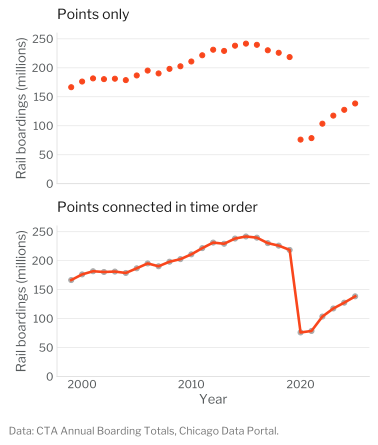
:::
:::


---

## Reading a Histogram by Area {.figure-aside .smaller}

::: {.aside-note}
*Computational and Inferential Thinking*, [Section 7.2: Visualizing Numerical Distributions](https://inferentialthinking.com/chapters/07/2/visualizing-numerical-distributions)
:::

::: {.columns}
::: {.column}
- In a bar chart, **height** is the value. In a histogram, **area** is the value.
- The **area principle**: a two-dimensional figure should encode the magnitude in its *area*, not just its height.
- So the height is $\dfrac{\text{percent in bin}}{\text{bin width}}$ : a **density**
- All the areas sum to 100%.
- Bins do not have to be equal width. If they are not, only the density scale is readable.
:::
::: {.column}

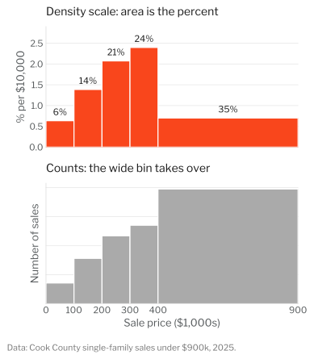

::: {.caption}
The widest bin holds the most sales (35%) and is nearly the *shortest* bar : it is the least crowded.
:::
:::
:::


---

## Vocabulary for Describing Common Shapes
Many models assume features are **symmetric** and **unimodal**. Deviations can affect the validity of the model.

::: {}
- **Symmetric** : looks the same on the left and right sides.
- **Skewed** : one tail is longer than the other (right or left).
- **Unimodal** : a single mode (peak).
- **Multimodal** : multiple modes (peaks).
:::


---

## Three Shapes {.figure-slide}

```{python}
#| echo: false
rng = np.random.default_rng(1848)
shapes = ["Symmetric, unimodal", "Right-skewed", "Multimodal"]
shape_df = pl.DataFrame({
    "v": np.concatenate([
        rng.normal(0, 1, 600),
        rng.exponential(1, 600),
        np.concatenate([rng.normal(-2, 0.6, 300), rng.normal(2, 0.6, 300)]),
    ]),
    "shape": np.repeat(shapes, 600),
}).with_columns(pl.col("shape").cast(pl.Enum(shapes)))

def shape_plot(k):
    return (ggplot(upto(shape_df, "shape", shapes, k), aes("v"))
     + geom_histogram(aes(alpha="a"), bins=28, fill=ORANGE,
                      color="white", size=0.3)
     + scale_alpha_identity()
     + facet_wrap("shape", scales="free_x")
     + labs(y="Count")
     + theme_minimal(base_size=15)
     + theme(axis_title_x=element_blank(),
             strip_text=element_text(size=16, color=INK),
             panel_spacing=0.06, figure_size=(10, 4)))
```

::: {.r-stack}

::: {.fragment .fade-out fragment-index=1}
```{python}
#| echo: false
#| fig-width: 10
#| fig-height: 4
#| fig-alt: "Three histogram panels side by side; only the first is filled in, showing a symmetric unimodal bell shape"
shape_plot(1)
```
:::

::: {.fragment .fade-in-then-out fragment-index=1}
```{python}
#| echo: false
#| fig-width: 10
#| fig-height: 4
#| fig-alt: "The same three panels with the first two filled in: a symmetric bell shape and a right-skewed distribution with a long tail to the right"
shape_plot(2)
```
:::

::: {.fragment fragment-index=2}
```{python}
#| echo: false
#| fig-width: 10
#| fig-height: 4
#| fig-alt: "All three panels filled in: a symmetric unimodal bell shape, a right-skewed distribution with a long tail to the right, and a multimodal distribution with two separated peaks"
shape_plot(3)
```
:::

:::

# Relationships Between Variables {.section-header}

---

## Identifying Relationships
::: {}
- Features in a dataset are usually related to each other. **Linear** relationships are the simplest type.
- **Correlation** describes the *strength* and *direction* of a linear relationship between two features.
  - **Positive** correlation : one feature increases as the other increases.
  - **Negative** correlation : one feature decreases as the other increases.
- We explore relationships using **scatter plots**: positive correlation, negative correlation, or no linear correlation.
:::

---

## Three Scatter Plots {.figure-slide}

```{python}
#| echo: false
rng = np.random.default_rng(418)
x = rng.uniform(0, 10, 90)
kinds = ["Positive correlation", "Negative correlation", "No linear correlation"]
corr_df = pl.DataFrame({
    "x": np.tile(x, 3),
    "y": np.concatenate([x + rng.normal(0, 1.5, 90),
                         -x + rng.normal(0, 1.5, 90),
                         rng.uniform(0, 10, 90)]),
    "kind": np.repeat(kinds, 90),
}).with_columns(pl.col("kind").cast(pl.Enum(kinds)))

def corr_plot(k):
    return (ggplot(upto(corr_df, "kind", kinds, k, on=0.75), aes("x", "y"))
     + geom_point(aes(alpha="a"), color=ORANGE, size=2.5)
     + scale_alpha_identity()
     + facet_wrap("kind", scales="free_y")
     + theme_minimal(base_size=15)
     + theme(axis_title=element_blank(), axis_text=element_blank(),
             strip_text=element_text(size=16, weight="bold", color=INK),
             panel_spacing=0.06, figure_size=(10, 4)))
```

::: {.r-stack}

::: {.fragment .fade-out fragment-index=1}
```{python}
#| echo: false
#| fig-width: 10
#| fig-height: 4
#| fig-alt: "Three scatter plot panels side by side; only the first has points, trending upward for positive correlation"
corr_plot(1)
```
:::

::: {.fragment .fade-in-then-out fragment-index=1}
```{python}
#| echo: false
#| fig-width: 10
#| fig-height: 4
#| fig-alt: "The same three panels with the first two filled in: points trending upward, then points trending downward for negative correlation"
corr_plot(2)
```
:::

::: {.fragment fragment-index=2}
```{python}
#| echo: false
#| fig-width: 10
#| fig-height: 4
#| fig-alt: "All three panels filled in: points trending upward (positive correlation), points trending downward (negative correlation), and points with no visible trend (no linear correlation)"
corr_plot(3)
```
:::

:::

---

## Correlation Coefficient

The correlation coefficient measures the linear relationship between two features $X$ and $Y$. We'll use **Pearson's correlation coefficient** first.

::: {}
- The value is always between **-1 and 1**.
- The sign gives the direction
- The closer to -1 or 1, the stronger the relationship.
- A coefficient of **0** means there is no *linear* relationship
    - not the same as no relationship
:::

---

## Setup: Chicago 'L' ridership, 2019

Are stations that are busy on weekdays also busy on Saturdays?

```{python}
#| echo: true
cta = pl.read_csv("../../datasets/cta-ridership/Station_Entries_-_Daily_Totals_20260527.csv",
                  ignore_errors=True)
cta = cta.with_columns(pl.col("rides").str.replace_all(",", "").cast(pl.Int64))
by_day = (cta.filter(pl.col("date").str.ends_with("2019"))
             .group_by("stationname", "daytype")
             .agg(pl.col("rides").median()))
stations = by_day.pivot("daytype", index="stationname", values="rides")
```

::: {style="font-size:0.8em; margin-top:0.4em;"}
`daytype` is `W` for weekdays, `A` for Saturdays, `U` for Sundays and holidays.
:::

---

## Weekday vs. Saturday {.code-figure-slide}

```{python}
#| echo: true
#| fig-alt: "Scatter plot of 144 Chicago 'L' stations, median weekday entries on the x-axis against median Saturday entries on the y-axis, showing a strong upward linear trend"
(ggplot(stations, aes("W", "A"))
 + geom_point(alpha=0.7)
 + labs(x="Median weekday entries", y="Median Saturday entries")
 + theme_minimal())
```

---

## How strong is it? (CTA Ridership)

```{python}
#| echo: true
# W = median weekday entries, A = median Saturday entries
stations.select(pl.corr("W", "A")).item()
```

::: {style="font-size:0.85em; margin-top:0.8em;"}
Strong and positive: busy stations are busy on both days. Not *perfect* : Loop stations serving commuters drop off far more on a Saturday than neighborhood stations do.
:::

---

## Setup: Cook County home sales, 2025

Do bigger houses sell for more money?

```{python}
#| echo: true
sales = pl.read_csv("../../datasets/cook-county-home-sales-2025/cook-county-home-sales-2025.csv",
                    ignore_errors=True)
homes = sales.filter(
    (pl.col("property_group") == "Single-Family")   # condos have no sqft
    & (pl.col("is_multisale") == False)             # one price per home
    & (pl.col("sale_price") > 10_000)               # drop nominal transfers
    & pl.col("building_sqft").is_not_null()
)
homes.height
```


---

## Square Footage vs. Price {.code-figure-slide .build-slide}

::: {.r-stack}

::: {.fragment .fade-out fragment-index=1}
```{python}
#| echo: true
#| fig-alt: "Scatter plot of Cook County home sales, square footage against sale price, drawn with default styling so a few multi-million-dollar sales stretch the y-axis and flatten the rest of the cloud"
(ggplot(homes, aes("building_sqft", "sale_price"))
 + geom_point(color="#f9461c", alpha=0.08, size=0.8, raster=True))
```
:::

::: {.fragment .fade-in-then-out fragment-index=1}
```{python}
#| echo: true
#| fig-alt: "The same scatter plot with the y-axis limited to two million dollars, which spreads the bulk of the sales out over the full height of the panel"
(ggplot(homes, aes("building_sqft", "sale_price"))
 + geom_point(color="#f9461c", alpha=0.08, size=0.8, raster=True)
 + scale_y_continuous(limits=(0, 2_000_000),
                      labels=lambda v: [f"${x/1e6:g}M" for x in v]))
```
:::

::: {.fragment .fade-in-then-out fragment-index=2}
```{python}
#| echo: true
#| fig-alt: "The same scatter plot with both axes cropped, to two million dollars and six thousand square feet, bringing the cone shape of the main cloud into view"
(ggplot(homes, aes("building_sqft", "sale_price"))
 + geom_point(color="#f9461c", alpha=0.08, size=0.8, raster=True)
 + scale_y_continuous(limits=(0, 2_000_000),
                      labels=lambda v: [f"${x/1e6:g}M" for x in v])
 + scale_x_continuous(limits=(0, 6000)))
```
:::

::: {.fragment .fade-in-then-out fragment-index=3}
```{python}
#| echo: true
#| fig-alt: "The same cropped scatter plot, now with the axes labelled building square footage and sale price"
(ggplot(homes, aes("building_sqft", "sale_price"))
 + geom_point(color="#f9461c", alpha=0.08, size=0.8, raster=True)
 + scale_y_continuous(limits=(0, 2_000_000),
                      labels=lambda v: [f"${x/1e6:g}M" for x in v])
 + scale_x_continuous(limits=(0, 6000))
 + labs(x="Building square footage", y="Sale price"))
```
:::

::: {.fragment fragment-index=4}
```{python}
#| echo: true
#| fig-alt: "Scatter plot of about 24,800 Cook County single-family home sales, building square footage on the x-axis against sale price on the y-axis, showing an upward trend that fans out widely at larger sizes"
(ggplot(homes, aes("building_sqft", "sale_price"))
 + geom_point(color="#f9461c", alpha=0.08, size=0.8, raster=True)
 + scale_y_continuous(limits=(0, 2_000_000),
                      labels=lambda v: [f"${x/1e6:g}M" for x in v])
 + scale_x_continuous(limits=(0, 6000))
 + labs(x="Building square footage", y="Sale price")
 + theme_minimal())
```
:::

:::

---

## How strong is it? (Home Sales)

```{python}
#| echo: true
homes.select(pl.corr("building_sqft", "sale_price")).item()
```

::: {style="font-size:0.85em; margin-top:0.8em;"}
Positive, but weaker than the CTA example (0.88).
:::

---

## The Cone Shape
::: {}
- The points **fan out** as houses get larger
    - Small homes cluster in a price band, large homes all over
- A single correlation coefficient reports one number for the whole cloud,
- can hide a stronger relationship at one end versus the other.
- Always look at the scatter plot.
- **The coefficient is only a summary.**
:::


---

## Correlation Pitfalls: The Simpson's Paradox {.image-frame-slide}

::: {.columns}
::: {.column width="50%"}
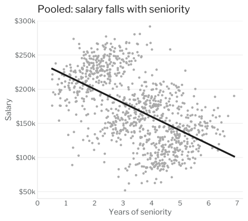
:::
::: {.column width="50%"}
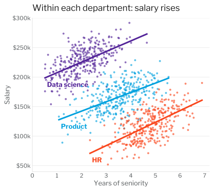
:::
:::

::: {.caption .fragment}
Synthetic data. Pooled, salary **falls** with seniority; within every department it **rises**.
:::

---

## Simpson's Paradox in the Wild: Batting Averages {.smaller}

::: {.aside-note}
Ken Ross, *A Mathematician at the Ballpark* : Derek Jeter and David Justice, 1995 and 1996.
:::

::: {.batting}
|                  | 1995 | 1996 | Combined |
|------------------|:---:|:---:|:---:|
| **Derek Jeter**  | 12/48 = .250 | 183/582 = .314 | 195/630 = **.310** |
| **David Justice**| 104/411 = **.253** | 45/140 = **.321** | 149/551 = .270 |
:::

<style>
/* Four columns of the same width, so the two name cells stop eating the row
   and no at-bats line has to wrap mid-fraction. */
.batting td, .batting th { white-space: nowrap; }
.batting td:first-child, .batting th:first-child { width: 25%; }
.batting td:not(:first-child), .batting th:not(:first-child) { width: 25%; }
</style>

::: {.fragment}
- Justice hit for a higher average in **each** season and a lower average **combined**
- Check the at-bats:
    - Jeter's better year is his "heavy" year
    - Justice's better year is his "light" year
:::

---

## Visualizing Bivariate Relationships

::: {}
- A **scatter plot** helps uncover the *form* of the relationship between two quantitative variables.
- **Linear** relationships are the simplest to interpret : and there is a lot of clean statistical theory for them.
- Models are approximations. Prefer the simpler one until the data forces you to a more complex one.
:::


---

## Common Forms a Scatter Plot Can Show {.image-frame-slide}

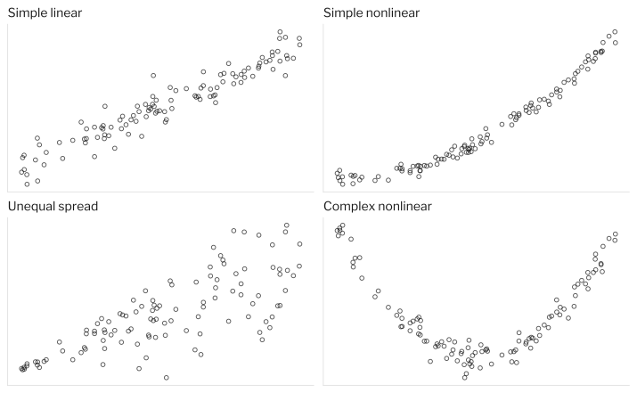

::: {.caption}
Synthetic data, similar to PrairieLearn questions.
:::

---

## Two Categorical Variables {.smaller}

::: {.columns}
::: {.column width="50%"}
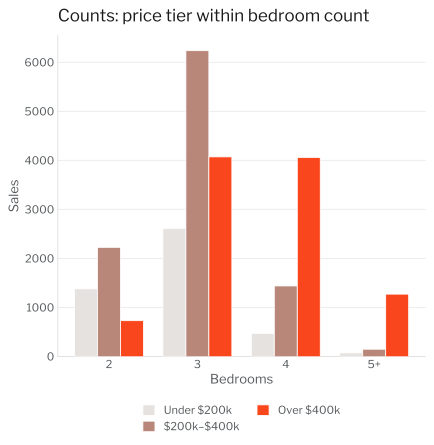
:::
::: {.column width="50%"}
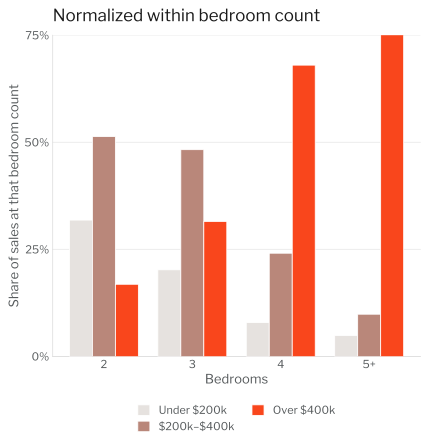
:::
:::


---

## One Quantitative, One Categorical {.smaller}

::: {.columns}
::: {.column width="50%"}
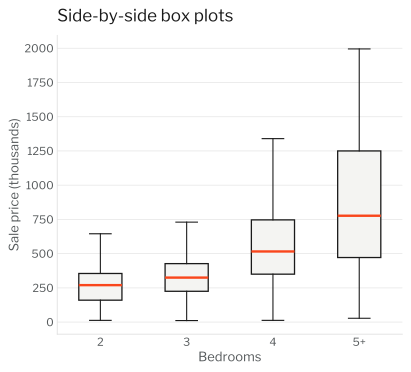
:::
::: {.column width="50%"}
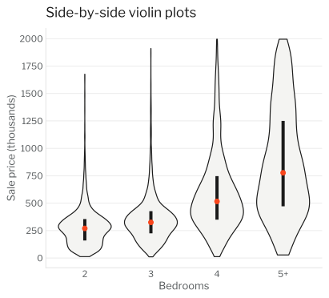
:::
:::

::: {style="font-size:0.78em; margin-top:0.3em;"}
(Note that a box plot cannot show if a group is bimodal)
:::

---

## Overlaying Distributions {.image-frame-slide}

::: {.r-stack}
<div class="fragment fade-out" data-fragment-index="1">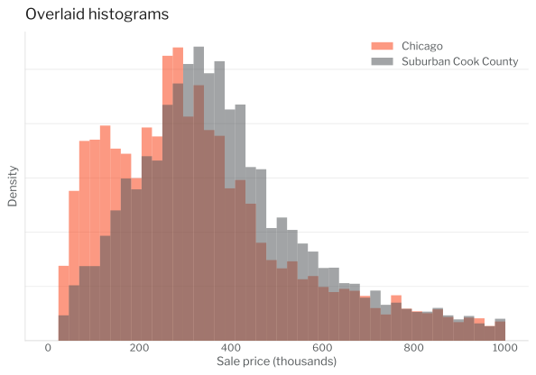</div>

<div class="fragment" data-fragment-index="1">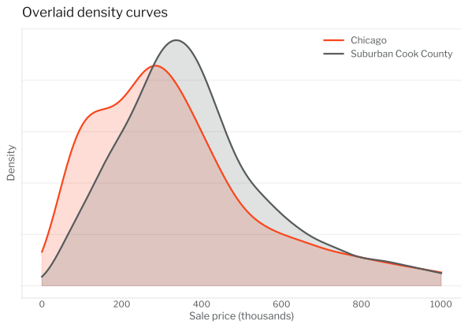</div>

:::


---

## Univariate vs. Multivariate {.image-frame-slide}

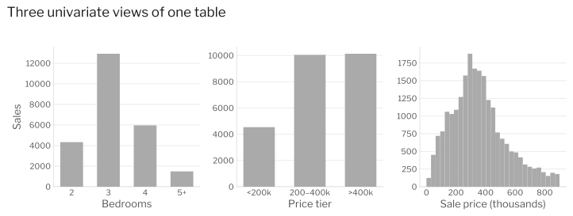

::: {style="font-size:0.8em; margin-top:0.5em;"}
Note that none of these shows a relationship.
:::


---

## Geospatial Data {.figure-aside}

::: {.aside-note}
*Fundamentals of Data Visualization*, [Chapter 5: Directory of Visualizations](https://clauswilke.com/dataviz/directory-of-visualizations.html)
:::

::: {.columns}
::: {.column}
- A map already includes position
- data need a second channel.
- **Choropleth**: color the regions.
- **Proportional symbol**: size a mark at each point.
- *More details soon.*
:::
::: {.column}

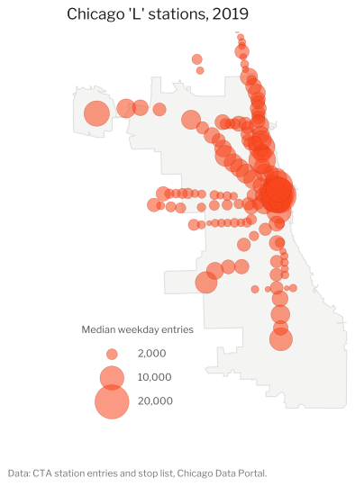
:::
:::


---

## Visualizing Uncertainty {.figure-aside}

::: {.aside-note}
*Fundamentals of Data Visualization*, [Chapter 16: Visualizing Uncertainty](https://clauswilke.com/dataviz/visualizing-uncertainty.html)
:::

- Almost every number in a plot is an **estimate**
- **Error bars** (or a band) show how the estimate could move.
- *More details soon.*

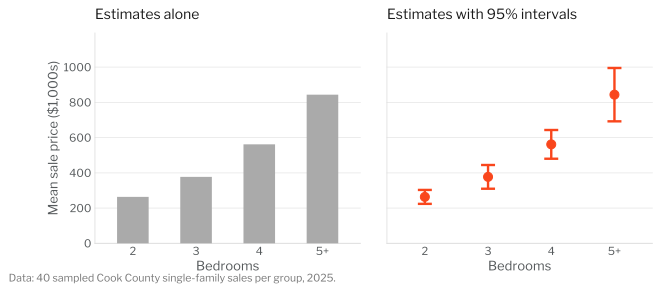

::: {.caption}
The 4- and 5+ intervals overlap: on this sample those two means are not distinguishable.
:::


# Perception: Color & Length {.section-header}

---

## Color Blindness {.text-figure-slide}

::: {.columns}
::: {.column width="38%"}
::: {.dense}
::: {}
- Picking colors that work together can be difficult
- **7–10% of men** have red-green color vision deficiency (deuteranomaly is the common one).
- Blue-yellow deficiency is far less common.
- Red and green is the worst pair (try to avoid)
:::
:::
:::
::: {.column width="62%"}
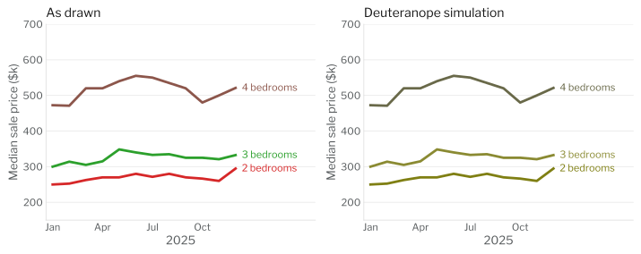

::: {.caption}
Simulation uses Viénot, Brettel & Mollon (1999).
:::
:::
:::

---

## Redundant Encoding {.image-frame-slide}

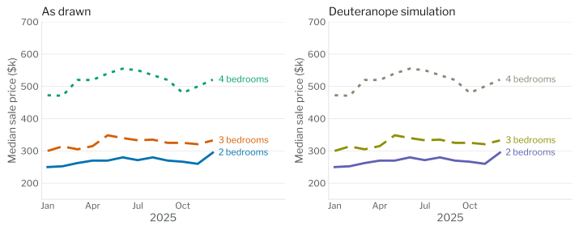

::: {style="font-size:0.8em; margin-top:0.4em;"}
In general, try to avoid hue being the only channel (add dash, shape, and/or direct label)
:::

---

## Colorfulness {.image-frame-slide}

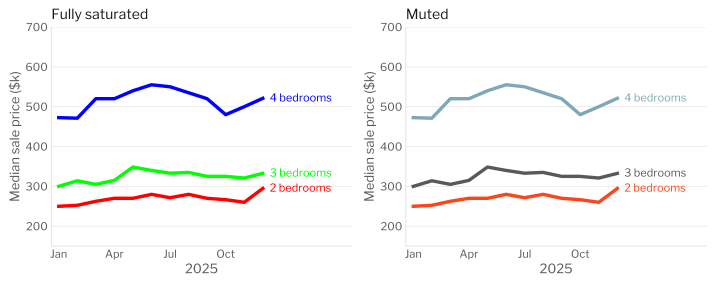


---

## Perceptually Uniform Colormaps {.image-frame-slide}

::: {.caption}
Design story: Nathaniel Smith and Stéfan van der Walt, "A Better Default Colormap for Matplotlib" (SciPy 2015), <https://bids.github.io/colormap>.
:::

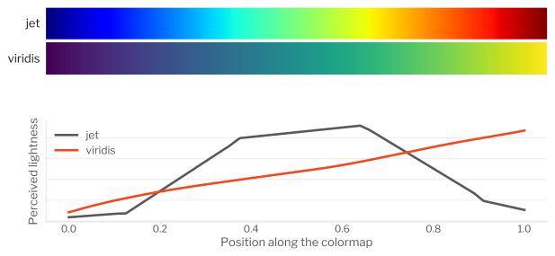

::: {style="font-size:0.8em; margin-top:0.4em;"}
A colormap should have **uniform perceptual deltas**: equal steps in the data should look like equal steps. `jet` does not
:::


---

## Data Type and Color {.text-figure-slide}

::: {.columns}
::: {.column width="42%"}
::: {.dense}
::: {}
- **Categorical** : pick a scheme that makes categories easy to *tell apart*.
    - No order implied.
- **Quantitative, low→high** : use **sequential** schemes; light for low.
- **Quantitative, two meaningful ends** : use a **diverging** scheme; light in the middle.
- Getting this wrong can be a real mistake (not just aesthetic / subjective)
:::
:::
:::
::: {.column width="58%"}
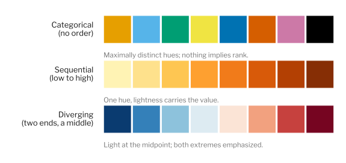

::: {.caption}
Categorical row is the Okabe & Ito palette, ["Color Universal Design"](https://jfly.uni-koeln.de/color/) (2008).
:::
:::
:::

---

## Length Versus Area {.image-frame-slide}

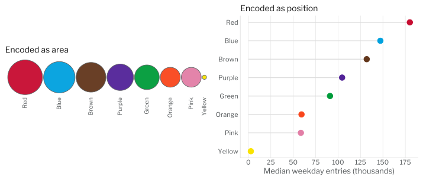

::: {.caption}
Median 2019 weekday entries, summed by line. Stations serving several lines count once per line.
:::

---

## Stacking {.image-frame-slide}

::: {.r-stack}
<div class="fragment fade-out" data-fragment-index="1">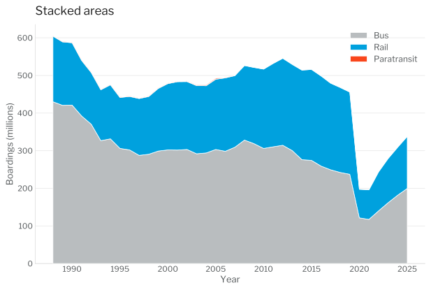</div>

<div class="fragment fade-in-then-out" data-fragment-index="1">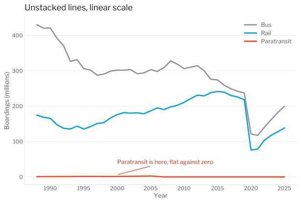</div>

<div class="fragment" data-fragment-index="2">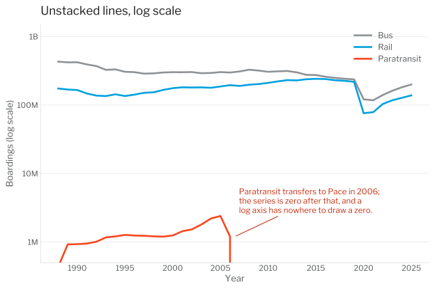</div>

:::

::: {style="font-size:0.78em; margin-top:0.3em;"}
"wobbling floor" problem
:::

---

## Which plot? {.split}

::: {.split-content .golden-columns}

::: {}

For each question, discuss with your elbow neighbors which plot(s) you could use:

1. "What share of CTA trips are on rail?"
2. "Did boardings recover after 2020?"
3. "Where should CTA add service?"
4. "Which stops are most active?"
5. Others? For your project maybe?
:::

<iframe src="https://dodatascience.fun/timer/" title="CTA-style countdown timer" loading="lazy" style="width: 100%; height: 420px; display: block; border: 1px solid #999; box-shadow: 0 10px 28px rgba(0,0,0,0.12); border-radius: 3px;"></iframe>

:::

# Pie & Donut Charts {.section-header}


## Pie Charts Intuition

- A pie chart encodes **proportion** as **angle** (and area)
- Works okay for simple comparisons, single data points
- E.g. "roughly half" or "roughly a quarter"
- Difficult to compare multiple slices

---


## Pie vs. Bar Example: The Pies {.image-frame-slide}

::: {.content-visible when-format="html"}

:::

::: {.content-visible when-format="pdf"}

:::

---

## Pie vs. Bar Example: The Bars {.image-frame-slide}

::: {.content-visible when-format="html"}

:::

::: {.content-visible when-format="pdf"}

:::

---

## Pie vs. Bar: Three Comparisons {.image-frame-slide}

::: {.content-visible when-format="html"}

:::

::: {.content-visible when-format="pdf"}

:::

::: {.caption}
Schutz, [*Piecharts.svg*](https://commons.wikimedia.org/wiki/File:Piecharts.svg), Wikimedia Commons, 2008. [CC BY 1.0](https://creativecommons.org/licenses/by/1.0/)
:::

---

## The Principle of Proportional Ink {.figure-aside}

::: {.aside-note}
Bergstrom & West, *Calling Bullshit*, [7.3: The Principle of Proportional Ink](https://www.callingbullshit.org/tools/tools_proportional_ink.html)
:::

::: {.columns}
::: {.column}
- **The "ink" used should be directly proportional to the quantity shown.**
- A bar is a length *from zero*
- Same rule applies to Steve Jobs' 3D pie chart
- Lines and dots encode **position**
    - can start wherever the data starts
:::
::: {.column}

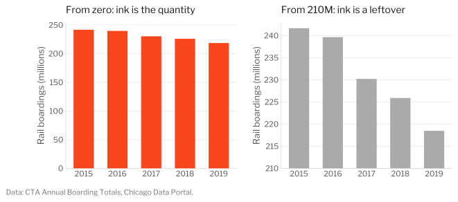

::: {.caption}
Ridership fell, but the panels tell different stories.
:::
:::
:::

---

## 3D Pie Chart in the Wild: Steve Jobs at Macworld 2008 {.image-frame-slide}

{fig-alt="Steve Jobs' infamous U.S. SmartPhone Marketshare slide showing a 3D pie chart tilted toward the viewer. Apple's green slice sits at the front with a thick extruded edge. Source line reads Gartner for CQ3."}

::: {.caption}
Macworld San Francisco, 15 January 2008 : [smartphone market share segment, 8:24 to 10:10](https://www.youtube.com/watch?v=i9XU6wk_mWY&t=504s)
:::

---

## Never Do a 3D Pie Chart

::: {}
- Never ever ever ever ever ever ever do a 3D pie chart
- Why?
    - Perspective distorts angle and area
    - Slices in the front (near the viewer) look larger
    - The tilt changes how big a slice appears (independent of data)
    - adds a dimension that carries no information
:::

---


## 3D Pie Chart in the Wild: Steve Jobs on Video {.iframe-slide}

<iframe src="https://www.youtube-nocookie.com/embed/i9XU6wk_mWY?start=504&end=610&rel=0" title="Macworld San Francisco 2008 keynote : US smartphone market share segment (8:24–10:10)" loading="lazy" allow="accelerometer; clipboard-write; encrypted-media; gyroscope; picture-in-picture; web-share" allowfullscreen style="border: 1px solid #999; box-shadow: 0 10px 28px rgba(0,0,0,0.12); border-radius: 3px;"></iframe>

::: {.iframe-caption}
Macworld San Francisco, 15 January 2008 : [smartphone market share segment, 8:24 to 10:10](https://www.youtube.com/watch?v=i9XU6wk_mWY&t=504s)
:::

---

## Why did Steve Jobs make a 3D pie chart? {.split}

:::: {.split-content}


::::

---

## The Donut Chart {.figure-aside}

::: {.columns}
::: {.column}
- A **donut chart** is a pie chart with the center cut out
- Keeps the "this is all part of a whole" message
- Slices are still difficult to compare
- Here are Steve Jobs' numbers again, as a donut
:::
::: {.column}

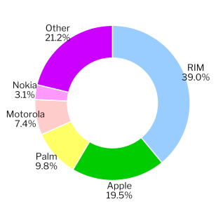

::: {.caption}
Same six numbers, same order, same colors, as a donut (torus?)
:::
:::
:::

---

## Donut in the Wild: FIFA World Cup 2026 {.image-frame-slide}

::: {.content-visible when-format="html"}

:::

::: {.content-visible when-format="pdf"}

:::


---

## Concluding Notes: Visual EDA

::: {}
**One-dimensional data**

- Summarize with summary statistics (`df.describe()`)
- Visualize the distribution with histograms and box plots.
:::

::: {}
**Two-dimensional data**

- Visualize the relationship with scatter plots.
- Measure relationships with correlations.
:::

::: {}
**High-dimensional data**

- Create a **scatterplot matrix** (all pairwise scatter plots)
- Create a **correlation matrix** (all pairwise correlations)
:::

::: {}
**Correlations can mislead**

- Additional variables may reveal unexpected and contrasting results.
:::

---

## Any questions?

- PrairieLearn Homeworks?
- Group Projects?
- Coding Exercise 01?
- Other logistics?
- (You can also stay after class for questions)

---

## Upload your worksheet

Take a picture of your worksheet, upload it in Canvas


# Week 5, Day 2 {.course-title .photo-title data-state="photo-title photo-title-zoom" background-image="../assets/orange-line-stops-better/stop05-clark-lake-a.jpg" background-size="cover"}

<h2>Visualization, Continued</h2>

Jack Bandy
2026

---

## Map: Day 2 {.split}

::: {.split-content .narrow-aside}

::: {}
- Week 5: Clark/Lake
- Day 2
    - Visualization considerations
    - Scale, conditioning & context
    - Transformations
    - Correlation & causality
    - Large N, smoothing & dimensionality
    - matplotlib & ggplot
:::

{.figure alt="Orange Line map with the Clark/Lake stop marked, the Week 5 stop"}

:::

---

## Nearby Event of Interest! {.iframe-slide}

<iframe src="https://www.cj2026.northwestern.edu" title="Nearby Event of Interest" loading="lazy" style="border: 1px solid #999; box-shadow: 0 10px 28px rgba(0,0,0,0.12); border-radius: 3px;"></iframe>

# Visualization Considerations {.section-header}

---

## The Same Marks, Two Readings

::: {.columns}
::: {.column width="50%"}
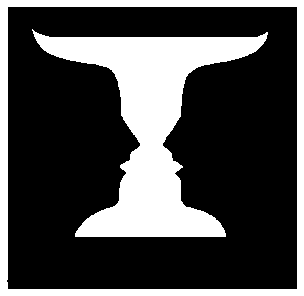
:::
::: {.column width="50%" .fragment}
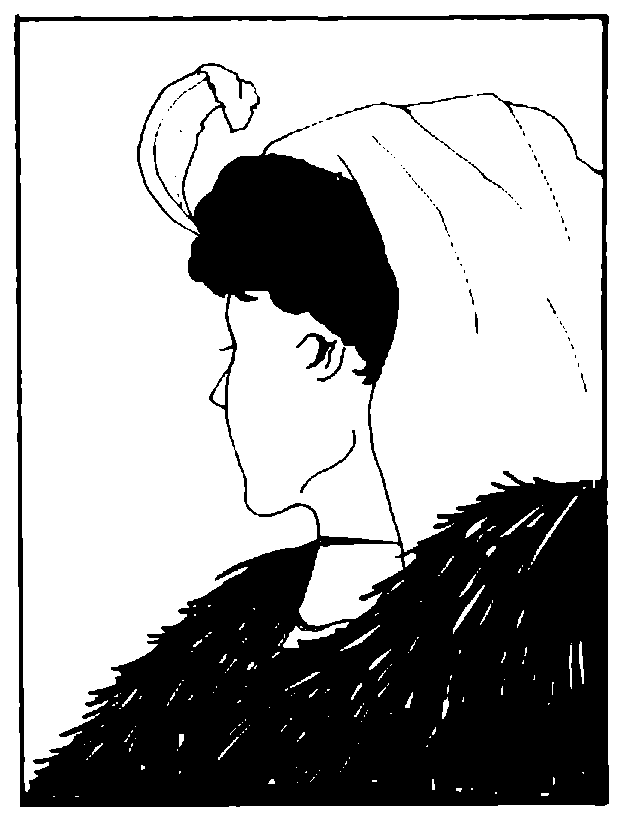
:::
:::

::: {style="font-size:0.78em; margin-top:0.5em;"}
"people discover what they want to see more easily."
:::

::: {.caption}
Rubin's vase (Edgar Rubin, 1915) and "My Wife and My Mother-in-Law" (W. E. Hill, *Puck*, 1915), as printed in Victor Papanek, *Design for the Real World* (Pantheon, 1972), p. 159.
:::

---

## Shape Anecdote {.image-frame-slide}

::: {style="position:relative; flex:0 0 auto; width:798px; height:432px; margin:0.2em auto 1.1em;"}


:::

::: {.caption}
See [GitHub](https://github.com/jackbandy/data-science-fun/tree/main/docs/assets/abstraction) for sources.
:::

---

## Seven Things to Watch

::: {}
1. **Scale** : what are the axes, and do they start where they should?
2. **Conditioning** : what did you hold fixed to make the comparison?
3. **Context** : units, reference values, labels, a caption.
4. **Transformations** : logs and their friends.
5. **Perception: color** : hue is a weak channel and not everyone sees it the same.
6. **Perception: length** : length beats angle, area, and volume.
7. **Causality** and **large N** : two ways a correct plot still misleads.
:::


---

## Glass Slippers

::: {style="border:3px dashed #f9461c; border-radius:12px; padding:0.8em 1em; margin-top:0.4em;"}
[TODO]{.eyebrow .todo}

::: {.aside-note}
*Calling Bullshit*, [6.5: Glass Slippers](https://www.youtube.com/watch?v=59teS0SUHtI) (video, 9 min)
:::
:::


# Scale, Conditioning & Context {.section-header}

---

## 2015 Congressional Hearing: Planned Parenthood

::: {}
- Rep. Jason Chaffetz (R-UT), then chair of the House Oversight Committee, was questioning federal funding of Planned Parenthood.
- He displayed a chart that had first appeared in a report by Americans United for Life.
- The chart plots two services : cancer screenings and abortions : from 2006 to 2013.
:::


---

## The Chart as Shown {.image-frame-slide}

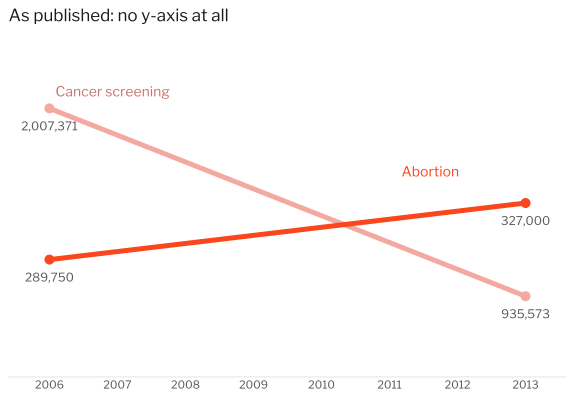

::: {.caption}
Redrawn from the chart displayed at the House Oversight Committee hearing, 29 September 2015 (originally from an Americans United for Life report).
:::

---

## What is suspicious about this plot? {.split .smaller}

::: {.split-content .golden-columns}

::: {}


1. **How many data points** are actually in this plot?
2. What is the **y-axis**?
3. Why do the two lines cross?
4. How would you fix it?
:::

<iframe src="https://dodatascience.fun/timer/" title="CTA-style countdown timer" loading="lazy" style="width: 100%; height: 420px; display: block; border: 1px solid #999; box-shadow: 0 10px 28px rgba(0,0,0,0.12); border-radius: 3px;"></iframe>

:::

---

## The Same Four Numbers, One Scale {.image-frame-slide}

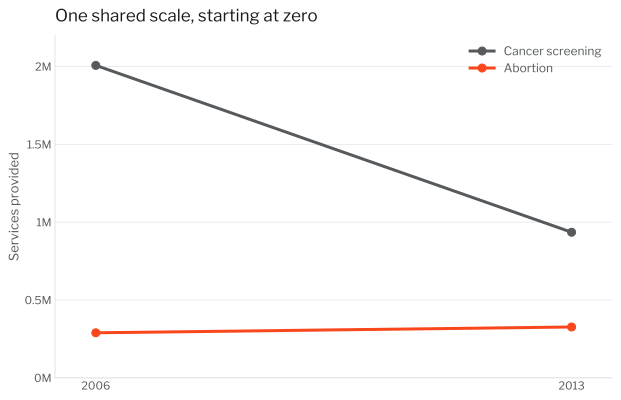

::: {style="font-size:0.8em; margin-top:0.4em;"}
Now the dominant fact is visible: cancer screenings **fell by half**, and abortions barely moved. Nothing crosses.
:::

---

## Or Plot the Quantity in Dispute {.image-frame-slide}

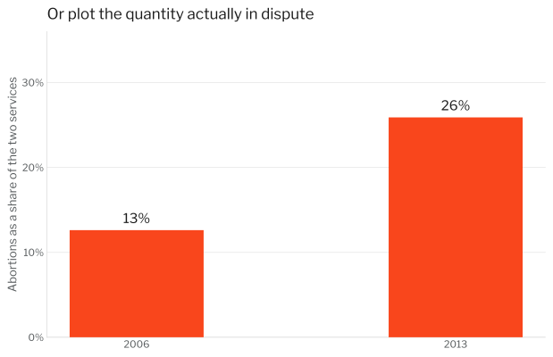

::: {style="font-size:0.8em; margin-top:0.4em;"}
The argument was about **mix**, not counts. As a share, abortions went from 13% to 26% : which the original chart never actually showed, even though it was trying to.
:::

---

## Conditioning

**Conditioning** means holding one variable fixed : or slicing by it : so that a comparison means something.

::: {}
- Split into groups and draw side-by-side bars, boxes, or panels.
- Bin a continuous variable (ages in decades, homes by bedroom count) and compare within bins.
- The Bertin/Munzner language for this is a **small multiple**: same encoding, repeated.
:::

::: {style="margin-top:0.6em;"}
Every conditioning choice is a claim about what else was going on. Say it out loud.
:::

---

## Grouped Bars {.image-frame-slide}

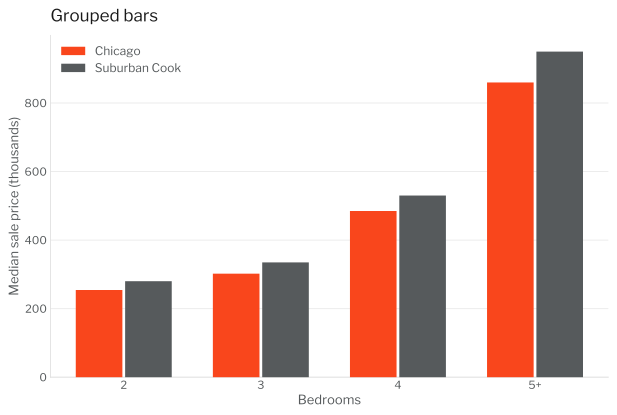

::: {style="font-size:0.8em; margin-top:0.4em;"}
Median sale price, conditioned on bedroom count and on Chicago vs. suburban Cook County.
:::

---

## Which comparisons are easy here? {.split .smaller}

::: {.split-content .golden-columns}

::: {}


1. Which comparisons can you make **easily**?
2. Which comparison is most **interesting** or important?
3. Are those the same comparison?
:::

<iframe src="https://dodatascience.fun/timer/" title="CTA-style countdown timer" loading="lazy" style="width: 100%; height: 420px; display: block; border: 1px solid #999; box-shadow: 0 10px 28px rgba(0,0,0,0.12); border-radius: 3px;"></iframe>

:::

---

## Same Numbers, Less Ink {.image-frame-slide}

::: {.r-stack}
<div class="fragment fade-out" data-fragment-index="1">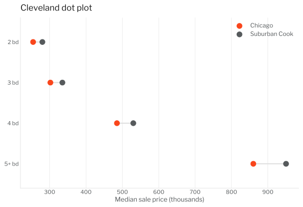</div>

<div class="fragment" data-fragment-index="1">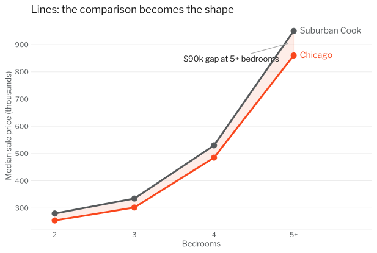</div>

:::

::: {style="font-size:0.78em; margin-top:0.3em;"}
Dots put both values on a common scale. Lines make the **gap** itself the shape of the chart : which is the comparison we actually wanted.
:::

---

## What is missing? {.split .smaller}

::: {.split-content .golden-columns}

::: {}

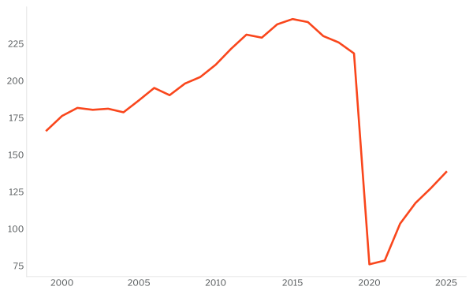

Everything here is correct. Discuss with your elbow neighbors: what does this not tell you?
:::

<iframe src="https://dodatascience.fun/timer/" title="CTA-style countdown timer" loading="lazy" style="width: 100%; height: 420px; display: block; border: 1px solid #999; box-shadow: 0 10px 28px rgba(0,0,0,0.12); border-radius: 3px;"></iframe>

:::

---

## The Same Line, With Context {.text-figure-slide}

::: {.columns}
::: {.column width="40%"}
::: {.dense}
::: {}
- Label the axes, and **include units**.
- Add **reference lines** for values that matter.
- Label the unusual or interesting **points**.
- Write a **caption**: what the data is, how it is plotted, what to look at.
:::
:::
:::
::: {.column width="60%"}
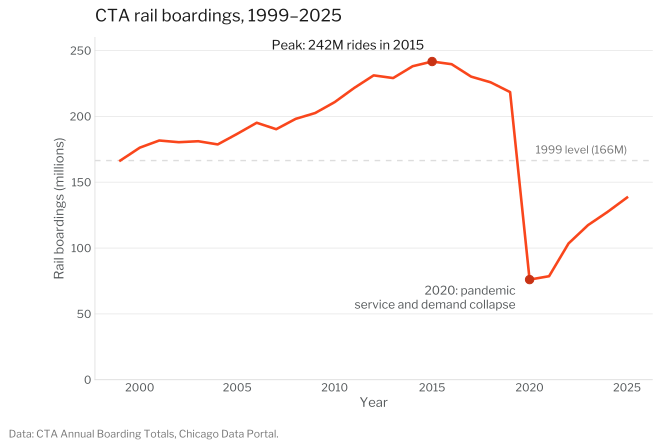
:::
:::

# Transformations {.section-header}

---

## Why Transform a Variable?

::: {}
- To **reveal the distribution of most of the observations** : otherwise the bulk of the data is squashed into a corner.
- To **reveal anomalies** on the far side of a long tail.
- To turn a **curved** relationship into a straight one you can reason about.
:::

::: {style="margin-top:0.8em;"}
**Logarithmic transformations take care of most needs.**
:::

---

## Standardize or Normalize? {.text-figure-slide}

::: {.aside-note}
*Computational and Inferential Thinking*, [Section 14.2: Standard Units](https://inferentialthinking.com/chapters/14/2/variability/#standard-units)
:::

:::: {.columns}
::: {.column width="38%"}
::: {.incremental style="font-size:0.82em; padding-right:24px;"}
- **Standardize** (z-score): $(x - \bar{x})/s$: center 0, spread 1.
- **Normalize** (min–max): rescale onto $[0, 1]$.
- What changes in the picture(s)?
:::
:::
::: {.column width="62%"}
```{python}
#| echo: false
#| fig-width: 5.3
#| fig-height: 4.0
#| fig-alt: "The same 90 salaries plotted three times as a row of dots: once on the raw dollar axis, once on a z-score axis running from about −2 to 3, and once on a min–max axis from 0 to 1; the arrangement of the dots is identical in all three, only the axis labels differ"
rng = np.random.default_rng(17)
raw = rng.normal(72_000, 14_000, 90)
FORMS = ["raw salary ($)", "z-score (standardized)", "min–max (normalized)"]
scaled = pl.DataFrame({
    "form": np.repeat(FORMS, len(raw)),
    "v": np.concatenate([raw,
                         (raw - raw.mean()) / raw.std(ddof=1),
                         (raw - raw.min()) / (raw.max() - raw.min())]),
    "y": np.tile(np.zeros(len(raw)), 3)}
).with_columns(pl.col("form").cast(pl.Enum(FORMS)))

(ggplot(scaled, aes("v", "y"))
 + geom_point(color=ORANGE, size=2.5, alpha=0.45)
 + facet_wrap("form", ncol=1, scales="free_x")
 + labs(x="", y="")
 + theme_minimal(base_size=13)
 + theme(strip_text=element_text(size=13, weight="bold", color=INK),
         axis_text_y=element_blank(), panel_grid_major_y=element_blank(),
         panel_grid_minor=element_blank(), figure_size=(5.3, 4.0)))
```
:::
::::


---

## Skew, Before and After {.image-frame-slide}

::: {.r-stack}
<div class="fragment fade-out" data-fragment-index="1">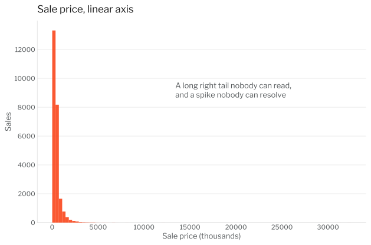</div>

<div class="fragment" data-fragment-index="1">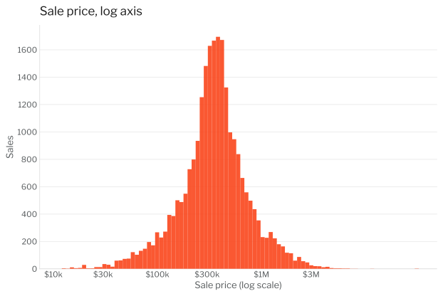</div>

:::

::: {style="font-size:0.78em; margin-top:0.3em;"}
Same column, same 24,775 sales. The log axis is the only thing that changed.
:::

---

## Basic Functional Relations {.image-frame-slide}

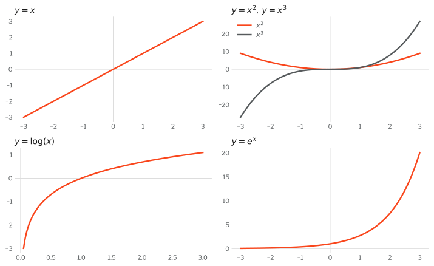


---

## Log: the "Swiss Army Knife" {.text-figure-slide}

::: {.columns}
::: {.column width="46%"}
::: {.dense}
A log can turn non-linear relationships into linear ones:

**1. Exponential**

$y = a^{x} \;\Rightarrow\; \log(y) = x \log(a)$

**2. Power law**

$y = a x^{k} \;\Rightarrow\; \log(y) = \log(a) + k \log(x)$

::: {style="font-size:0.85em; margin-top:0.6em;"}
Exponential → log the **y**. Power law → log **both**.
:::
:::
:::
::: {.column width="54%"}
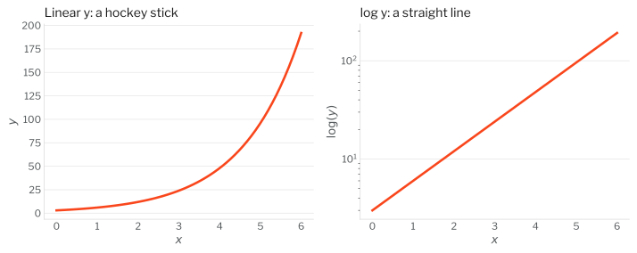
:::
:::

---

## Kepler's Third Law (1619) {.text-figure-slide}

::: {.columns}
::: {.column width="42%"}
::: {style="font-size:0.72em;"}
| Planet | Distance (AU) | Period (days) |
|---|---:|---:|
| Mercury | 0.389 | 87.77 |
| Venus | 0.724 | 224.70 |
| Earth | 1.000 | 365.25 |
| Mars | 1.524 | 686.95 |
| Jupiter | 5.200 | 4332.62 |
| Saturn | 9.510 | 10759.2 |
:::
:::
::: {.column width="58%"}
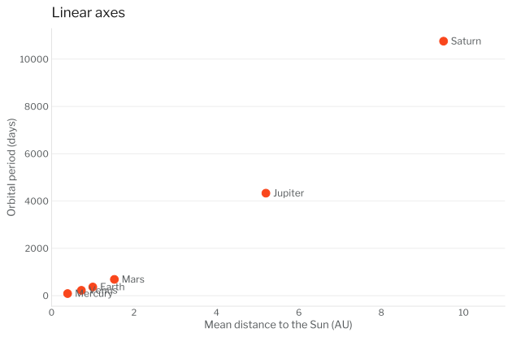
:::
:::


---

## Log-Log: the Slope is the Exponent {.smaller}

::: {.columns}
::: {.column width="50%"}

:::
::: {.column width="50%"}
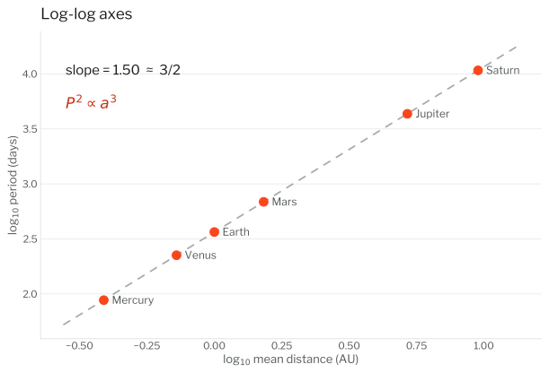
:::
:::

::: {style="font-size:0.78em; margin-top:0.3em;"}
Same six planets. Log both axes and they fall on a line of slope $3/2$: the square of the orbital period is proportional to the cube of the semi-major axis.
:::

# Correlation and Causality {.section-header}

---

## The Correlation Matrix {.figure-aside}

::: {.columns}
::: {.column}
- With $p$ variables there are $\binom{p}{2}$ pairs. A **correlation matrix** puts all of them in one table.
- Symmetric, with 1.00 down the diagonal : so only one triangle carries information.
- Color it on a **diverging** scale: two meaningful ends, a meaningful middle at zero.
- Read it as a *shortlist*, not a result: it tells you which scatter plots to go draw.
:::
::: {.column}

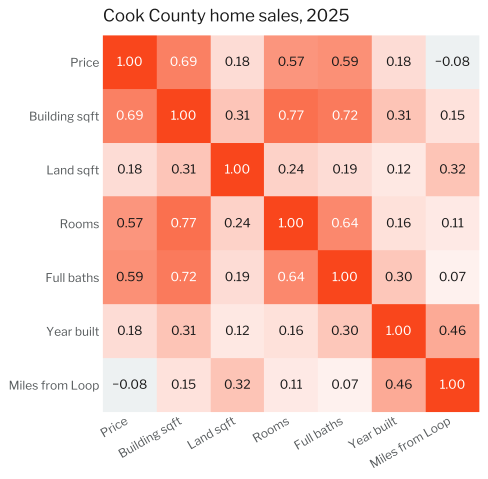

::: {.caption}
Data: Cook County single-family sales, 2025.
:::
:::
:::

---

## Reading a Correlation Matrix {.figure-aside}

::: {.columns}
::: {.column}
- Every cell is one number standing in for a whole cloud : the Datasaurus problem, $\binom{p}{2}$ times over.
- A near-zero cell is **not** "no relationship." Price vs. miles from the Loop is $-0.08$ because two effects cancel: far-out homes are bigger and newer, but less central.
- A **scatterplot matrix** costs more ink and keeps the shape.
- Correlation is still not causation : that is the next slide.
:::
::: {.column}


::: {.caption}
Data: Cook County single-family sales, 2025.
:::
:::
:::

---

## Can we conclude that one causes the other? {.split}

::: {.split-content .golden-columns}

::: {}

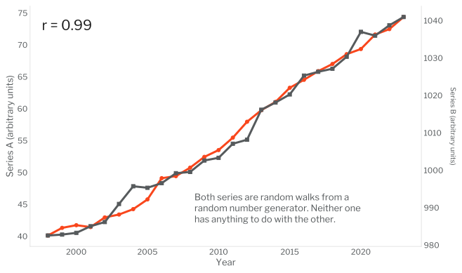

**A.** Yes &nbsp;&nbsp; **B.** No

- What does $r = 0.99$ buy you here?
- What would you need in order to say "causes"?
:::

<iframe src="https://dodatascience.fun/timer/" title="CTA-style countdown timer" loading="lazy" style="width: 100%; height: 420px; display: block; border: 1px solid #999; box-shadow: 0 10px 28px rgba(0,0,0,0.12); border-radius: 3px;"></iframe>

:::

---

## Correlation ≠ Causation {.text-figure-slide}

::: {.columns}
::: {.column width="46%"}
::: {.dense}
::: {}
- A correlation is consistent with $X \to Y$, with $Y \to X$, with a **common cause** $Z$, and with pure coincidence.
- The **fork** is the classic one: $Z$ causes both, so $X$ and $Y$ move together without touching.
- No amount of extra data points settles which it is. It is not a sample-size problem.
:::
:::
:::
::: {.column width="54%"}

:::
:::

::: {style="font-size:0.78em; margin-top:0.3em;"}
We come back to this properly later in the course. For now, the visualization lesson is that **a chart cannot show you an arrow**.
:::

# Large N, Smoothing & Dimensionality {.section-header}

---

## Nearly 25,000 Points {.image-frame-slide}


::: {style="font-size:0.8em; margin-top:0.4em;"}
Every point is on the page, and the shape of the data is gone. **Overplotting** : the ink saturates and the plot stops being a distribution.
:::

---

## What would be a better plot? {.split}

::: {.split-content .golden-columns}

::: {}

Think about the **type** of data before you answer.

**A.** Histogram / density plot

**B.** Bar plot

**C.** Violin plot

**D.** Box plot

:::

<iframe src="https://dodatascience.fun/timer/" title="CTA-style countdown timer" loading="lazy" style="width: 100%; height: 420px; display: block; border: 1px solid #999; box-shadow: 0 10px 28px rgba(0,0,0,0.12); border-radius: 3px;"></iframe>

:::

---

## Two Fixes for Overplotting {.image-frame-slide}

::: {.r-stack}
<div class="fragment fade-out" data-fragment-index="1"></div>

<div class="fragment" data-fragment-index="1">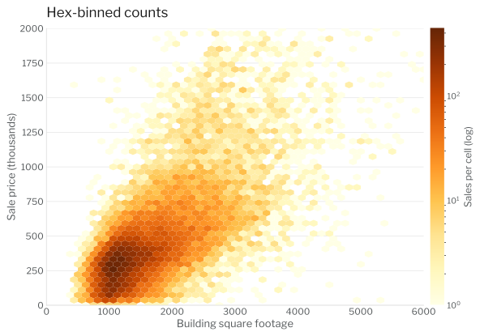</div>

:::

::: {style="font-size:0.78em; margin-top:0.3em;"}
**Alpha** lets overlap accumulate into shade. **Hex binning** is the honest version of the same idea: a two-dimensional histogram with a colorbar you can read.
:::

---

## The Conditional Center {.image-frame-slide}


::: {style="font-size:0.8em; margin-top:0.4em;"}
A smooth curve of **local averages**: for each $x$, the average $y$ in a neighborhood of $x$. That is the conditional center, and it is what your eye was trying to trace anyway.
:::

---

## Histograms and Bin Width {.text-figure-slide}

::: {.aside-note}
*Learning Data Science*, [Section 11.2: Smoothing and Aggregating Data](https://learningds.org/ch/11/viz_smoothing.html)
:::

:::: {.columns}
::: {.column width="42%"}
::: {.incremental style="font-size:0.72em; padding-right:20px;"}
- Same 400 heights, three bin counts.
- Too few bins hides shape; too many shows noise.
- Good to try more than one bin width.
- A bin width is a **smoothing choice**, like the bandwidth coming up next.
:::
:::
::: {.column width="58%"}
```{python}
#| echo: false
#| fig-width: 5.3
#| fig-height: 4.4
#| fig-alt: "The same 400 heights drawn as three stacked histograms with 6, 20 and 60 bins; the 6-bin version is a coarse block, the 20-bin version shows a clean single peak, and the 60-bin version breaks into spiky counts"
rng = np.random.default_rng(9)
h = rng.normal(68, 3.2, 400)
LEVELS = ["6 bins", "20 bins", "60 bins"]

def counted(n, label):
    """One np.histogram per bin count, so a single geom_col draws all three panels."""
    cnt, edges = np.histogram(h, bins=n)
    return pl.DataFrame({"mid": (edges[:-1] + edges[1:]) / 2,
                         "count": cnt.astype(float),
                         "w": np.repeat(edges[1] - edges[0], n),
                         "bins": [label] * n})

bars = pl.concat([counted(n, lab) for n, lab in zip([6, 20, 60], LEVELS)]
                 ).with_columns(pl.col("bins").cast(pl.Enum(LEVELS)))

(ggplot(bars, aes("mid", "count"))
 + geom_col(aes(width="w"), fill=ORANGE, alpha=0.8, color="white", size=0.4)
 + facet_wrap("bins", ncol=1, scales="free_y")
 + labs(x="height (in)", y="count")
 + theme_minimal(base_size=13)
 + theme(strip_text=element_text(size=13, weight="bold", color=INK),
         panel_grid_minor=element_blank(), figure_size=(5.3, 4.4)))
```
:::
::::

---

## Smoothing Detour: Kernel Density {.image-frame-slide}

::: {.r-stack}
<div class="fragment fade-out" data-fragment-index="1">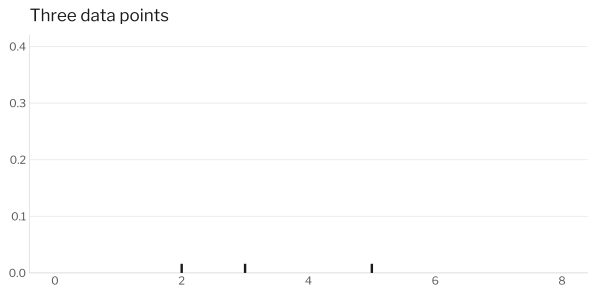</div>

<div class="fragment fade-in-then-out" data-fragment-index="1">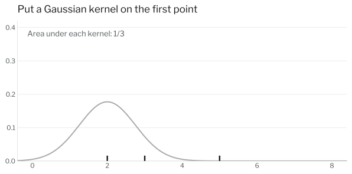</div>

<div class="fragment fade-in-then-out" data-fragment-index="2">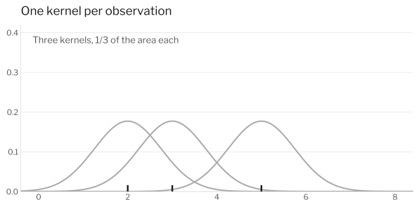</div>

<div class="fragment" data-fragment-index="3">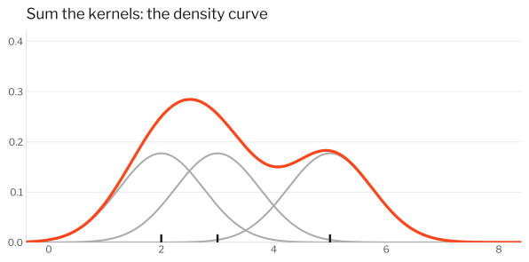</div>

:::

::: {style="font-size:0.78em; margin-top:0.3em;"}
$\hat{f}(x) = \dfrac{1}{n}\sum_{i=1}^{n} K_h(x - x_i)$ : put a kernel on each observation, then add them up. **No bins, no bin edges.**
:::

---

## Bandwidth {.image-frame-slide}

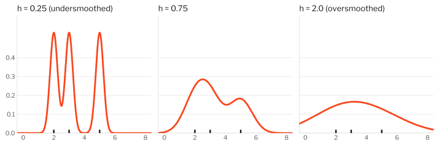

::: {style="font-size:0.8em; margin-top:0.4em;"}
$h$ decides how peaked or spread each kernel is.
:::

---

## Smoothing a Scatter Plot {.image-frame-slide}

::: {.r-stack}
<div class="fragment fade-out" data-fragment-index="1">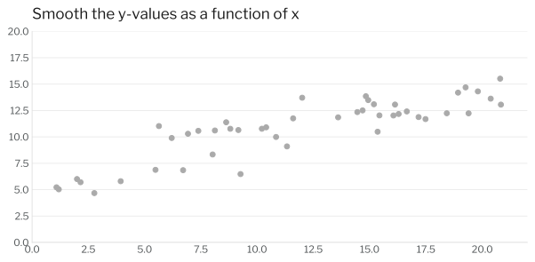</div>

<div class="fragment fade-in-then-out" data-fragment-index="1">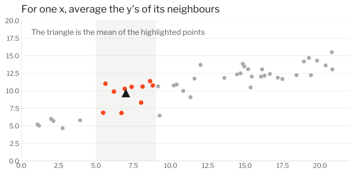</div>

<div class="fragment fade-in-then-out" data-fragment-index="2">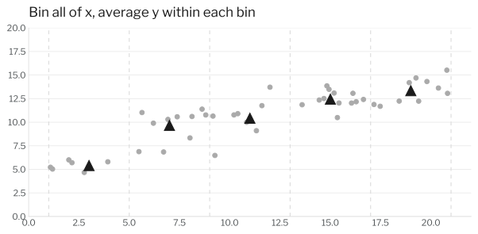</div>

<div class="fragment fade-in-then-out" data-fragment-index="3">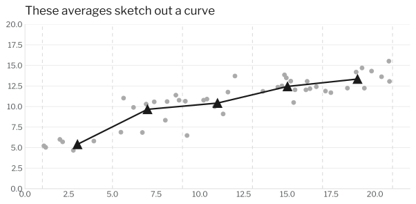</div>

<div class="fragment" data-fragment-index="4">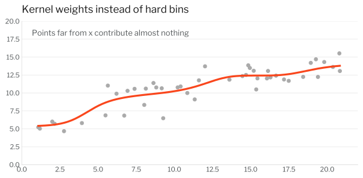</div>

:::

::: {style="font-size:0.78em; margin-top:0.3em;"}
$g(x) = \sum_i \dfrac{K_h(x - x_i)\,y_i}{\sum_j K_h(x - x_j)}$ : a **weighted average of the $y_i$**, with weights from the kernel. The denominator is there so the weights sum to 1.
:::

---

## Local Smoothing {.text-figure-slide}

::: {.columns}
::: {.column width="42%"}
::: {.dense}
::: {}
- A **moving window** over $x$; average (or fit) the $y$ values inside it.
- Many ways to do it: **kernel** methods, cubic and thin-plate **splines**, **lowess**.
- All of them have a bandwidth-shaped knob, and it is always the real decision.
- Reveals the *shape* of the relationship between $y$ and $x$.
:::
:::
:::
::: {.column width="58%"}
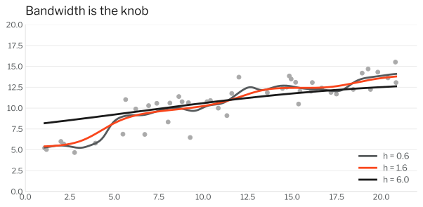
:::
:::

---

## Smoothing Plus Conditioning {.text-figure-slide}

::: {.columns}
::: {.column width="40%"}
::: {.dense}
::: {}
- One smooth curve **per bedroom count**: we have controlled for bedrooms.
- The curves separate, so square footage alone was never the whole story.
- Careful: these are **not longitudinal** (no house was followed as it grew).
- Conditioning removes one alternative explanation. It does not remove the rest.
:::
:::
:::
::: {.column width="60%"}
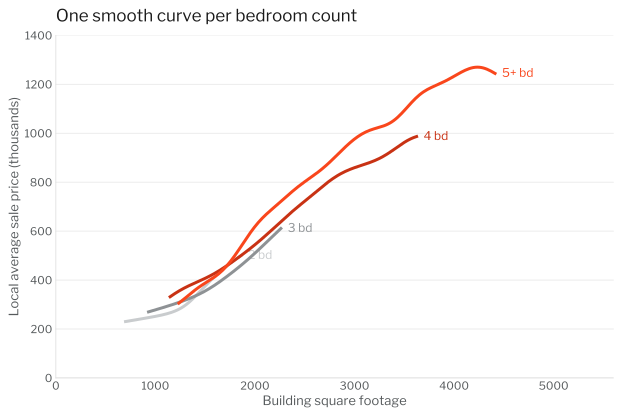
:::
:::

---


## One Variable, Linear {.image-frame-slide}

A single feature, and the score moves with it at a constant rate.


::: {.caption}
Figures from Solon Barocas and Chandler May, *Understanding Inscrutability* (NYU, 2017), found via Meredith Broussard, *More Than a Glitch* (MIT Press, 2023)
:::

---

## One Variable, Nonlinear {.image-frame-slide}

Still one feature, but the rate of change is not constant.


::: {.caption}
Figures from Solon Barocas and Chandler May, *Understanding Inscrutability* (NYU, 2017), found via Meredith Broussard, *More Than a Glitch* (MIT Press, 2023)
:::

---

## One Variable, Non-Monotonic {.image-frame-slide}

"More X" does not alwasy mean "more Y."


::: {.caption}
Figures from Solon Barocas and Chandler May, *Understanding Inscrutability* (NYU, 2017), found via Meredith Broussard, *More Than a Glitch* (MIT Press, 2023)
:::

---

## Two Variables, Linear {.image-frame-slide}

The relationship becomes a surface (i.e. a tilted plane).


::: {.caption}
Figures from Solon Barocas and Chandler May, *Understanding Inscrutability* (NYU, 2017), found via Meredith Broussard, *More Than a Glitch* (MIT Press, 2023)
:::

---

## Two Variables, Nonlinear {.image-frame-slide}

Curved surface: the effect of one feature depends on where you are.


::: {.caption}
Figures from Solon Barocas and Chandler May, *Understanding Inscrutability* (NYU, 2017), found via Meredith Broussard, *More Than a Glitch* (MIT Press, 2023)
:::

---

## Two Variables, Non-Monotonic {.image-frame-slide}

Interaction: income's effect on score depends on the level of debt.


::: {.caption}
Figures from Solon Barocas and Chandler May, *Understanding Inscrutability* (NYU, 2017), found via Meredith Broussard, *More Than a Glitch* (MIT Press, 2023)
:::

---

## Two Variables, Many Turns {.image-frame-slide}

Same two features, a more tangled surface, hard to summarize in words.


::: {.caption}
Figures from Solon Barocas and Chandler May, *Understanding Inscrutability* (NYU, 2017), found via Meredith Broussard, *More Than a Glitch* (MIT Press, 2023)
:::

---

## What a Neural Network Learns {.image-frame-slide}

The output of an actual four-layer network over the same two features.


::: {.caption}
Figures from Solon Barocas and Chandler May, *Understanding Inscrutability* (NYU, 2017), found via Meredith Broussard, *More Than a Glitch* (MIT Press, 2023)
:::

# matplotlib & ggplot {.section-header}

---

## Recreating the FIFA Chart: Setup

```{python}
#| echo: true
#| output: false
import matplotlib.pyplot as plt

sizes  = [63, 27, 10]
labels = ['COL', 'COD', 'In Contest']
colors = ['#f5c800', '#0057a8', '#00a896']

fig, ax = plt.subplots(figsize=(4, 4))
```

---

## Recreating the FIFA Chart: Draw {.code-figure-slide}

```{python}
#| echo: true
#| fig-format: svg
#| fig-alt: "Donut chart of FIFA World Cup 2026 Group K possession: Colombia 63% in yellow, DR Congo 27% in blue, In Contest 10% in teal"
ax.pie(sizes, labels=labels, autopct='%1.0f%%',
       colors=colors, startangle=90, counterclock=False,
       wedgeprops=dict(width=0.5), pctdistance=0.75)
ax.set_title('Possession', fontweight='bold')
plt.tight_layout()
```

---

## Recreating the FIFA Chart {.code-figure-slide}

```{python}
#| echo: true
#| fig-alt: "Donut chart of FIFA World Cup 2026 Group K possession: Colombia 63% in yellow, DR Congo 27% in blue, In Contest 10% in teal"
#| fig-format: svg
#| fig-width: 5
#| fig-height: 5
import matplotlib.pyplot as plt

sizes  = [63, 27, 10]
labels = ['COL', 'COD', 'In Contest']
colors = ['#f5c800', '#0057a8', '#00a896']
_, ax = plt.subplots()
ax.pie(sizes, labels=labels, autopct='%1.0f%%', colors=colors,
       startangle=90, counterclock=False,
       wedgeprops=dict(width=0.5), pctdistance=0.75)
ax.set_title('Possession', fontweight='bold');
```

---

## Recreating the FIFA Chart: Polished

```{python}
#| echo: false
#| fig-format: svg
#| fig-alt: "Donut chart styled after the FIFA World Cup 2026 broadcast graphic: Colombia 63% yellow, DR Congo 27% blue, In Contest 10% teal, with legend on the right inside a semi-transparent dark rounded rectangle."
#| out-width: 100%
import matplotlib.pyplot as plt
import matplotlib.gridspec as gridspec
from matplotlib.patches import FancyBboxPatch

phi = (1 + 5**0.5) / 2  # golden ratio ≈ 1.618
fig_h = 4.5
fig_w = fig_h * phi

fig = plt.figure(figsize=(fig_w, fig_h))
fig.patch.set_alpha(0)

bg = FancyBboxPatch(
    (0.02, 0.03), 0.96, 0.94,
    boxstyle="round,pad=0.03",
    facecolor=(0, 0, 0, 0.72),
    edgecolor="none",
    transform=fig.transFigure,
    zorder=0,
)
fig.add_artist(bg)

gs = gridspec.GridSpec(
    1, 2, width_ratios=[2, 3],
    left=0.03, right=0.97, bottom=0.05, top=0.95, wspace=0,
)
ax_d = fig.add_subplot(gs[0])
ax_l = fig.add_subplot(gs[1])
for ax in (ax_d, ax_l):
    ax.set_facecolor("none")

sizes  = [63, 27, 10]
labels = ["COL", "COD", "IN CONTEST"]
colors = ["#fcd116", "#0057a8", "#00a896"]

# startangle=-90 → Colombia starts at 6 o'clock, counterclock=False → runs clockwise to ~1 o'clock
ax_d.pie(
    sizes, colors=colors, startangle=-90, counterclock=False,
    wedgeprops=dict(width=0.5, edgecolor="white", linewidth=2.5),
)

ax_l.axis("off")
ax_l.set_xlim(0, 1)
ax_l.set_ylim(0, 1)

ax_l.text(0.08, 0.82, "POSSESSION", color="white", fontsize=19,
          fontweight="bold", va="center")

for i, (label, color, pct) in enumerate(zip(labels, colors, sizes)):
    y = 0.60 - i * 0.20
    # white ring behind colored fill
    ax_l.plot(0.10, y, "o", color="white",  markersize=19, zorder=4)
    ax_l.plot(0.10, y, "o", color=color,    markersize=14, zorder=5)
    ax_l.text(0.22, y, label,      color="white", fontsize=16, va="center")
    ax_l.text(0.72, y, f"{pct}%",  color="white", fontsize=16, va="center",
              fontweight="bold");
```

---

## What do you think of this code? (Python) {.smaller .scrollable}

```{python}
#| echo: true
#| output-location: column
#| fig-format: svg
#| fig-alt: "Donut chart styled after the FIFA World Cup 2026 broadcast graphic: Colombia 63% yellow, DR Congo 27% blue, In Contest 10% teal, with legend on the right inside a semi-transparent dark rounded rectangle."
import matplotlib.pyplot as plt
import matplotlib.gridspec as gridspec
from matplotlib.patches import FancyBboxPatch

phi = (1 + 5**0.5) / 2  # golden ratio ≈ 1.618
fig_h = 4.5
fig_w = fig_h * phi

fig = plt.figure(figsize=(fig_w, fig_h))
fig.patch.set_alpha(0)

bg = FancyBboxPatch(
    (0.02, 0.03), 0.96, 0.94,
    boxstyle="round,pad=0.03",
    facecolor=(0, 0, 0, 0.72),
    edgecolor="none",
    transform=fig.transFigure,
    zorder=0,
)
fig.add_artist(bg)

gs = gridspec.GridSpec(
    1, 2, width_ratios=[2, 3],
    left=0.03, right=0.97, bottom=0.05, top=0.95, wspace=0,
)
ax_d = fig.add_subplot(gs[0])
ax_l = fig.add_subplot(gs[1])
for ax in (ax_d, ax_l):
    ax.set_facecolor("none")

sizes  = [63, 27, 10]
labels = ["COL", "COD", "IN CONTEST"]
colors = ["#fcd116", "#0057a8", "#00a896"]

# startangle=-90 → Colombia starts at 6 o'clock, counterclock=False → runs clockwise to ~1 o'clock
ax_d.pie(
    sizes, colors=colors, startangle=-90, counterclock=False,
    wedgeprops=dict(width=0.5, edgecolor="white", linewidth=2.5),
)

ax_l.axis("off")
ax_l.set_xlim(0, 1)
ax_l.set_ylim(0, 1)

ax_l.text(0.08, 0.82, "POSSESSION", color="white", fontsize=19,
          fontweight="bold", va="center")

for i, (label, color, pct) in enumerate(zip(labels, colors, sizes)):
    y = 0.60 - i * 0.20
    # white ring behind colored fill
    ax_l.plot(0.10, y, "o", color="white",  markersize=19, zorder=4)
    ax_l.plot(0.10, y, "o", color=color,    markersize=14, zorder=5)
    ax_l.text(0.22, y, label,      color="white", fontsize=16, va="center")
    ax_l.text(0.72, y, f"{pct}%",  color="white", fontsize=16, va="center",
              fontweight="bold");
```

---

## Recreating the FIFA Chart: R Setup

```{r}
#| echo: true
library(ggplot2)

sizes  <- c(63, 27, 10)
labels <- c("COL", "COD", "In Contest")
colors <- c("#fcd116", "#0057a8", "#00a896")

df <- data.frame(
  label = factor(labels, levels = labels),
  pct   = sizes,
  color = colors
)
```

---

## Recreating the FIFA Chart: R / ggplot, Bare {.code-figure-slide}

```{r}
#| echo: true
#| dev: svglite
#| fig-alt: "Basic donut chart using ggplot2 coord_polar with default colors: Colombia, DR Congo, In Contest"
ggplot(df, aes(x = 2, y = pct, fill = label)) +
  geom_col(width = 1) +
  coord_polar(theta = "y", start = pi, direction = -1)
```

---

## Recreating the FIFA Chart: R / ggplot, Colors {.code-figure-slide}

```{r}
#| echo: true
#| dev: svglite
#| code-line-numbers: "4-5"
#| fig-alt: "Donut chart with FIFA colors applied and donut hole created via xlim"
ggplot(df, aes(x = 2, y = pct, fill = label)) +
  geom_col(width = 1) +
  coord_polar(theta = "y", start = pi, direction = -1) +
  scale_fill_manual(values = setNames(df$color, df$label)) +
  xlim(0.5, 2.5)
```

---

## Recreating the FIFA Chart: R / ggplot, Labels {.code-figure-slide}

```{r}
#| echo: true
#| dev: svglite
#| code-line-numbers: "6-8"
#| fig-alt: "Completed ggplot2 donut chart: Colombia 63% yellow, DR Congo 27% blue, In Contest 10% teal, with Possession title and minimal theme"
ggplot(df, aes(x = 2, y = pct, fill = label)) +
  geom_col(width = 1) +
  coord_polar(theta = "y", start = pi, direction = -1) +
  scale_fill_manual(values = setNames(df$color, df$label)) +
  xlim(0.5, 2.5) +
  labs(title = "Possession", fill = NULL) +
  theme_void() +
  theme(plot.title = element_text(face = "bold", hjust = 0.5))
```

---

## Recreating the FIFA Chart: R Polished

```{r}
#| echo: false
#| dev: svglite
#| fig-alt: "Polished donut chart styled after FIFA broadcast graphic, made with ggplot2: dark background, Colombia 63% yellow, DR Congo 27% blue, In Contest 10% teal, with colored dot legend"
library(ggplot2)
library(ggtext)
library(patchwork)

sizes  <- c(63, 27, 10)
labels <- c("COL", "COD", "IN CONTEST")
colors <- c("#fcd116", "#0057a8", "#00a896")
df <- data.frame(
  label = factor(labels, levels = labels),
  pct   = sizes,
  color = colors
)

donut <- ggplot(df, aes(x = 2, y = pct, fill = label)) +
  geom_col(width = 1, color = "white", linewidth = 1) +
  coord_polar(theta = "y", start = pi, direction = -1) +
  scale_fill_manual(values = setNames(df$color, df$label)) +
  xlim(0.5, 2.5) +
  theme_void() +
  theme(legend.position = "none",
        plot.background = element_rect(fill = NA, color = NA))

legend_df <- data.frame(
  label = factor(labels, levels = labels),
  pct   = paste0(sizes, "%"),
  color = colors,
  y     = c(0.65, 0.45, 0.25)
)
legend_panel <- ggplot(legend_df, aes(y = y)) +
  annotate("text", x = 0.1, y = 0.85, label = "POSSESSION",
           color = "white", size = 6, fontface = "bold", hjust = 0) +
  geom_point(aes(x = 0.12, color = label), size = 7) +
  geom_text(aes(x = 0.24, label = label), color = "white",
            size = 5, hjust = 0) +
  geom_text(aes(x = 0.95, label = pct), color = "white",
            size = 5, hjust = 1, fontface = "bold") +
  scale_color_manual(values = setNames(df$color, df$label)) +
  xlim(0, 1) + ylim(0, 1) +
  theme_void() +
  theme(legend.position = "none",
        plot.background = element_rect(fill = NA, color = NA))

donut + legend_panel +
  plot_layout(widths = c(2, 3)) &
  theme(plot.background = element_rect(fill = "#000000bb", color = NA))
```

---

## What do you think of this code? (R) {.smaller .scrollable}

```{r}
#| echo: true
#| output-location: column
#| dev: svglite
#| fig-alt: "Polished donut chart styled after FIFA broadcast graphic, made with ggplot2: dark background, Colombia 63% yellow, DR Congo 27% blue, In Contest 10% teal, with colored dot legend"
library(ggplot2)
library(ggtext)
library(patchwork)

sizes  <- c(63, 27, 10)
labels <- c("COL", "COD", "IN CONTEST")
colors <- c("#fcd116", "#0057a8", "#00a896")
df <- data.frame(
  label = factor(labels, levels = labels),
  pct   = sizes,
  color = colors
)

donut <- ggplot(df, aes(x = 2, y = pct, fill = label)) +
  geom_col(width = 1, color = "white", linewidth = 1) +
  coord_polar(theta = "y", start = pi, direction = -1) +
  scale_fill_manual(values = setNames(df$color, df$label)) +
  xlim(0.5, 2.5) +
  theme_void() +
  theme(legend.position = "none",
        plot.background = element_rect(fill = NA, color = NA))

legend_df <- data.frame(
  label = factor(labels, levels = labels),
  pct   = paste0(sizes, "%"),
  color = colors,
  y     = c(0.65, 0.45, 0.25)
)
legend_panel <- ggplot(legend_df, aes(y = y)) +
  annotate("text", x = 0.1, y = 0.85, label = "POSSESSION",
           color = "white", size = 6, fontface = "bold", hjust = 0) +
  geom_point(aes(x = 0.12, color = label), size = 7) +
  geom_text(aes(x = 0.24, label = label), color = "white",
            size = 5, hjust = 0) +
  geom_text(aes(x = 0.95, label = pct), color = "white",
            size = 5, hjust = 1, fontface = "bold") +
  scale_color_manual(values = setNames(df$color, df$label)) +
  xlim(0, 1) + ylim(0, 1) +
  theme_void() +
  theme(legend.position = "none",
        plot.background = element_rect(fill = NA, color = NA))

donut + legend_panel +
  plot_layout(widths = c(2, 3)) &
  theme(plot.background = element_rect(fill = "#000000bb", color = NA))
```

---

## Comparing matplotlib and ggplot {.smaller}

::: {.columns}
::: {.column width="50%"}

**Python / matplotlib**

```python
import matplotlib.pyplot as plt

sizes  = [63, 27, 10]
labels = ['COL', 'COD', 'In Contest']
colors = ['#fcd116', '#0057a8', '#00a896']

# wedge order + label positions handled by pie()
_, ax = plt.subplots()

ax.pie(sizes, labels=labels, colors=colors,
       autopct='%1.0f%%', pctdistance=0.75,
       startangle=90, counterclock=False,
       wedgeprops=dict(width=0.5))
ax.set_title('Possession', fontweight='bold')
```

:::
::: {.column width="50%"}

**R / ggplot2**

```r
library(ggplot2)

sizes  <- c(63, 27, 10)
labels <- c("COL", "COD", "In Contest")
colors <- c("#fcd116", "#0057a8", "#00a896")

# wedge order + label positions computed by hand
df <- data.frame(label = factor(labels, levels = labels),
                 pct = sizes)
df$pos <- cumsum(df$pct) - df$pct / 2

ggplot(df, aes(x = 2, y = pct, fill = label)) +
  geom_col(width = 1,
           position = position_stack(reverse = TRUE)) +
  geom_text(aes(x = 1.75, y = pos,
                label = paste0(pct, "%"))) +
  geom_text(aes(x = 2.75, y = pos, label = label)) +
  coord_polar(theta = "y", start = 0, direction = 1) +
  scale_fill_manual(values = setNames(colors, labels)) +
  xlim(0.5, 3) +
  labs(title = "Possession") +
  theme_void() +
  theme(legend.position = "none",
        plot.title = element_text(face = "bold",
                                  hjust = 0.5))
```

:::
:::

---

## Visualizations

::: {}
- Style rules/conventions are different from claims about **what the eye can decode**.
- UIC has an entire course: **CS 424, Visualization and Visual Analytics**.
- TODO
:::


---

## Interactive Visualization

::: {}
- **D3** : JavaScript library; lots of flexibility
- **Vega-Lite / Altair**, **Plotly**, **Bokeh** : declarative, and can embed in Jupyter notebooks.
- Interaction adds a channel the printed page does not have: *detail on demand*.
- It also adds a way to hide things.
:::


---

## A Bit About Fonts

::: {}
- TK
- TK
:::

# Sources {.sources}

1. GitHub source: <https://github.com/jackbandy/data-science-fun/blob/main/docs/slides/week5.qmd>.
2. Pie vs. bar comparison: Schutz, [*Piecharts.svg*](https://commons.wikimedia.org/wiki/File:Piecharts.svg), Wikimedia Commons, 2008. [CC BY 1.0](https://creativecommons.org/licenses/by/1.0/).
3. Dimensionality figures redrawn from Solon Barocas, *Understanding Inscrutability*, presented at ["Algorithms and Explanations,"](https://www.law.nyu.edu/centers/ili/events/algorithms-and-explanations) Information Law Institute, NYU School of Law, 27–28 April 2017. Found by way of Meredith Broussard, *More Than a Glitch: Confronting Race, Gender, and Ability Bias in Tech* (MIT Press, 2023; ISBN 9780262047654, paperback 9780262548328), which cites Barocas and Chandler May on visualizing data relationships.
4. 3D pie chart comparison: Cmglee, [*Misleading macworld 3d pie chart.svg*](https://commons.wikimedia.org/wiki/File:Misleading_macworld_3d_pie_chart.svg), Wikimedia Commons. [CC BY-SA 4.0](https://creativecommons.org/licenses/by-sa/4.0). Redrawn from the chart shown at Macworld 2008, via [Edward Tufte's notebook on pie charts](https://www.edwardtufte.com/notebook/pie-charts/).
5. Slides developed using materials from [Elena Zheleva](https://www.cs.uic.edu/~elena/) and [Gonzalo Bello Lander](https://cs.uic.edu/profiles/gonzalo-bello/), the Berkeley DS 100 team, Marine Carpuat, and Brian Ziebart.
6. Macworld 2008 keynote clip: ["Macworld San Francisco 2008 Keynote Address (MacBook Air & iTunes Movie Rentals) by Steve Jobs"](https://www.youtube.com/watch?v=i9XU6wk_mWY), Apple Keynote Videos (YouTube); market share segment at 8:24–10:10.
7. Visual variables: Jacques Bertin, *Sémiologie graphique: Les diagrammes, les réseaux, les cartes* (Gauthier-Villars, 1967); English translation *Semiology of Graphics: Diagrams, Networks, Maps*, trans. William J. Berg (University of Wisconsin Press, 1983; reissued by Esri Press, 2010).
8. Channels and the effectiveness ranking: Tamara Munzner, *Visualization Analysis & Design* (CRC Press, 2014), ch. 5. Open companion site: <https://www.cs.ubc.ca/~tmm/vadbook/>.
9. Chicago map layers: [chicago-maps](https://github.com/jackbandy/data-science-fun/tree/main/datasets/chicago-maps): city and ward boundaries and ward-level ACS income from the [Chicago Data Portal](https://data.cityofchicago.org/); water polygons from U.S. Census Bureau [TIGERweb](https://tigerweb.geo.census.gov/) areal hydrography.
10. Shape anecdote: Pete Docter on designing characters from basic geometry, in [*Pete Docter | Geometry of Characters*](https://youtu.be/i2tkCBFlXyc?t=398) (Any-mation, 2016), from 6:38. Images in the build: [docs/assets/abstraction](https://github.com/jackbandy/data-science-fun/tree/main/docs/assets/abstraction) : see that folder's `SOURCES.md` for per-image credits.
11. Figures in [docs/assets/viz-basics](https://github.com/jackbandy/data-science-fun/tree/main/docs/assets/viz-basics) are generated by `make_viz_basics_figures.py` from three in-repo datasets : [cook-county-home-sales-2025](https://github.com/jackbandy/data-science-fun/tree/main/datasets/cook-county-home-sales-2025) (Cook County Assessor's Office), [cta-ridership](https://github.com/jackbandy/data-science-fun/tree/main/datasets/cta-ridership) and [chicago-l-stations](https://github.com/jackbandy/data-science-fun/tree/main/datasets/chicago-l-stations) ([Chicago Data Portal](https://data.cityofchicago.org/)) : plus the sources below. See that folder's `SOURCES.md` for the per-figure mapping. CTA route colors follow the [CTA Trademark Guidelines for Developers](https://www.transitchicago.com/developers/branding/).
12. Scale example: the chart Rep. Jason Chaffetz displayed at the House Committee on Oversight and Government Reform hearing, 29 September 2015, reproducing a figure from an [Americans United for Life](https://aul.org/) report. Service counts are Planned Parenthood's own published annual figures for 2006 and 2013.
13. Color: Masataka Okabe and Kei Ito, ["Color Universal Design"](https://jfly.uni-koeln.de/color/) (2008); Françoise Viénot, Hans Brettel and John D. Mollon, "Digital video colourbars for testing dichromatic colour vision," *Color Research & Application* 24, no. 4 (1999): 243–252; Nathaniel Smith and Stéfan van der Walt, ["A Better Default Colormap for Matplotlib"](https://bids.github.io/colormap/) (SciPy 2015).
14. Smoothing and the Cherry Blossom run analysis the Large-N section is modeled on: Deborah Nolan and Duncan Temple Lang, *Data Science in R: A Case Studies Approach to Computational Reasoning and Problem Solving* (CRC Press, 2015), ch. 2.
15. Slide deck built with [Quarto](https://quarto.org/) revealjs. Title font is Big Shoulders; body font is [Libre Franklin](https://en.wikipedia.org/wiki/Franklin_Gothic#Libre_Franklin).
16. Simpson's paradox figures are generated from synthetic data; the two-panel layout is modeled on Gordon Goodwin, ["Simpson's Paradox: One Chart, Two Realities"](https://www.linkedin.com/pulse/simpsons-paradox-one-chart-two-realities-gordon-goodwin-hhhte).
17. Line graphs, the area principle, and the density scale: Ani Adhikari, John DeNero and David Wagner, *Computational and Inferential Thinking: The Foundations of Data Science*, [ch. 7](https://inferentialthinking.com/chapters/07/visualization) and [§7.2](https://inferentialthinking.com/chapters/07/2/visualizing-numerical-distributions). The area principle example there is from [Flowing Data](https://flowingdata.com/).
18. Geospatial idioms and uncertainty: Claus O. Wilke, *Fundamentals of Data Visualization* (O'Reilly, 2019), [ch. 5](https://clauswilke.com/dataviz/directory-of-visualizations.html) and [ch. 16](https://clauswilke.com/dataviz/visualizing-uncertainty.html).
19. The principle of proportional ink: Carl Bergstrom and Jevin West, *Calling Bullshit*, [7.3](https://www.callingbullshit.org/tools/tools_proportional_ink.html); the phrase is Bergstrom's restatement of Tufte's lie factor.
20. Batting averages: Ken Ross, *A Mathematician at the Ballpark: Odds and Probabilities for Baseball Fans* (Pi Press, 2004); Derek Jeter's and David Justice's 1995 and 1996 lines are as published by [Baseball Reference](https://www.baseball-reference.com/).
21. Donut version of the Macworld chart: drawn by `make_macworld_donut.py` in [docs/assets/pi-donut-demos](https://github.com/jackbandy/data-science-fun/tree/main/docs/assets/pi-donut-demos), from the market share figures (Gartner, CQ3 2007) printed on the keynote slide; wedge order and colors match the flat pie panel above.
