# Week 6, Day 1 {.course-title .photo-title data-state="photo-title" background-image="../assets/orange-line-stops-better/stop07-washington-wabash-b.jpg" background-size="cover"}

<h2>Time Series; Communicating Uncertainty</h2>

Jack Bandy
2026


## {.photo-only data-state="photo-only" background-image="../assets/orange-line-stops-better/stop07-washington-wabash-b.jpg" background-size="cover"}

---

## Random Roll Call {.iframe-slide}
<div class="random-draw" data-num="12" data-min="1" data-max="62">
<div class="random-draw-frame">
<div class="random-draw-numbers" role="status" aria-live="polite" data-placeholder="Press “Draw” for 12 random numbers between 1 and 62."></div>
</div>
<p class="random-draw-controls"><button type="button" class="random-draw-button">Draw</button> <label class="random-draw-sort"><input type="checkbox" class="random-draw-sort-input"> Sort</label> <span class="random-draw-status"></span></p>
</div>

<style>
.random-draw { display: flex; flex-direction: column; flex: 1; min-height: 0; }
.random-draw-frame { flex: 1; min-height: 0; display: flex; justify-content: center; }
.random-draw-numbers { height: 100%; aspect-ratio: 1.618 / 1; max-width: 100%; border: 1px solid #999; display: grid; grid-template-columns: repeat(6, 1fr); grid-template-rows: repeat(2, 1fr); place-items: center; }
.random-draw-numbers .random-draw-number { font-size: 3rem; font-weight: 700; line-height: 1; }
.random-draw-numbers .random-draw-placeholder { grid-column: 1 / -1; grid-row: 1 / -1; text-align: center; font-size: 1.4rem; color: #555; padding: 0 1.5em; }
.random-draw-controls { flex: none; margin: 12px 0 0; }
.random-draw-button { font: inherit; font-size: 1.1rem; font-weight: 600; padding: 0.3em 1.2em; border: none; border-radius: 3px; background: #f9461c; color: #fff; cursor: pointer; }
.random-draw-button:hover:not(:disabled) { background: #e03c14; }
.random-draw-button:disabled { opacity: 0.6; cursor: default; }
.random-draw-sort { font-size: 1rem; color: #555; margin-left: 0.75em; cursor: pointer; }
.random-draw-status { font-size: 1rem; color: #555; margin-left: 0.75em; }
</style>

<script>
(() => {
  // The Sequence Generator, not the Integer Generator: /integers/ samples *with*
  // replacement and silently ignores a `unique` parameter, so a roll call could
  // name the same student twice. /sequences/ returns a shuffled permutation of
  // min..max, and the first `num` of that is a sample without replacement.
  const API = "https://www.random.org/sequences/";
  function setup(root) {
    if (root.dataset.wired) return;
    root.dataset.wired = "1";
    const out = root.querySelector(".random-draw-numbers");
    const button = root.querySelector(".random-draw-button");
    const status = root.querySelector(".random-draw-status");
    const sortBox = root.querySelector(".random-draw-sort-input");
    const num = root.dataset.num, min = root.dataset.min, max = root.dataset.max;
    const url = API + "?min=" + min + "&max=" + max + "&col=1&format=plain&rnd=new";
    let drawn = null;
    function placeholder(text) {
      out.innerHTML = "";
      const p = document.createElement("div");
      p.className = "random-draw-placeholder";
      p.textContent = text;
      out.appendChild(p);
    }
    function render() {
      if (!drawn) return;
      const numbers = sortBox.checked ? drawn.slice().sort(function (a, b) { return a - b; }) : drawn;
      out.innerHTML = "";
      numbers.forEach(function (n) {
        const cell = document.createElement("div");
        cell.className = "random-draw-number";
        cell.textContent = n;
        out.appendChild(cell);
      });
    }
    function draw() {
      button.disabled = true;
      status.textContent = "drawing from random.org…";
      fetch(url, { cache: "no-store" })
        .then(function (r) { if (!r.ok) throw new Error("HTTP " + r.status); return r.text(); })
        .then(function (text) {
          const numbers = text.trim().split(/\s+/).filter(Boolean).map(Number);
          if (!numbers.length) throw new Error("empty response");
          drawn = numbers.slice(0, Number(num));
          render();
          status.textContent = "true random numbers from random.org";
        })
        .catch(function (err) {
          drawn = null;
          placeholder("Could not reach random.org (" + err.message + "). Open the draw in a new tab instead.");
          status.textContent = "";
        })
        .then(function () { button.disabled = false; });
    }
    button.addEventListener("click", draw);
    sortBox.addEventListener("change", render);
    placeholder(out.dataset.placeholder);
  }
  function init() {
    document.querySelectorAll(".random-draw").forEach(setup);
  }
  if (document.readyState === "loading") {
    document.addEventListener("DOMContentLoaded", init);
  } else {
    init();
  }
})();
</script>

::: {.iframe-caption}
Numbers drawn live from <a href="https://www.random.org/sequences/?min=1&max=62&col=1&format=plain&rnd=new">random.org/sequences/?min=1&max=62&col=1&format=plain&rnd=new</a> &mdash; shuffle 1&ndash;62, take first 12.
:::

---

## Map {.split}

::: {.split-content .narrow-aside}

::: {}
- Week 6: Washington/Wabash
- Day 1
    - Data Visualization Demos
    - Visualization Rhetoric & Fonts
    - Visualizing Uncertainty
    - Visualizing Time Series
    - Example: CTA Ridership
:::

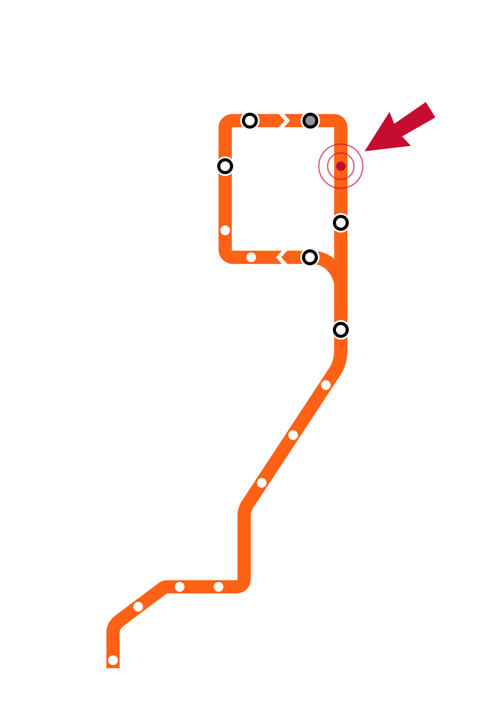{.figure alt="Orange Line map with the Washington/Wabash stop marked, the Week 6 stop"}

:::

---

## Logistics

- A few tweaks based on feedback!
- PrairieLearn homeworks due Monday nights, 11:59pm
- Coding Exercise 01 due Wednesday 11:59pm
- Asynchronous class next Monday, Oct 5
- Quiz next Wednesday
- Next project checkpoint: Monday, Oct 12 (EDA)
- Questions? Comments?

---

## Example Viz 1 {.image-frame-slide}

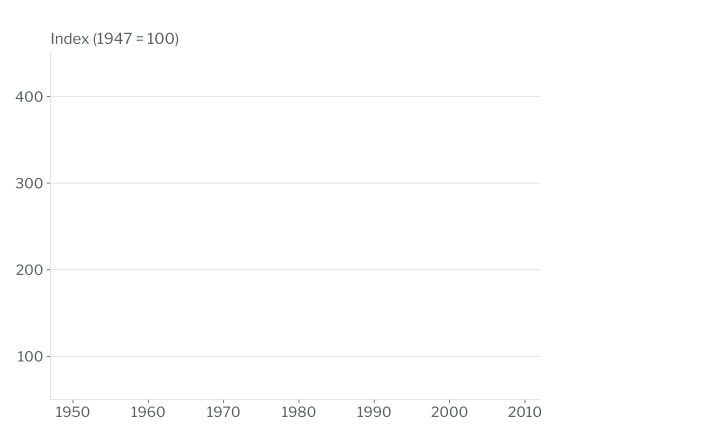

::: {.caption}
Recreated from Erik Brynjolfsson & Andrew McAfee, ["The Great Decoupling,"](https://hbr.org/2015/06/the-great-decoupling) *Harvard Business Review* (June 2015). Data: BLS and BEA via [FRED](https://fred.stlouisfed.org/); U.S. Census Bureau, [Table F-7](https://www.census.gov/data/tables/time-series/demo/income-poverty/historical-income-families.html).
:::


---

## Example Viz 1: "The Great Decoupling" {.image-frame-slide}

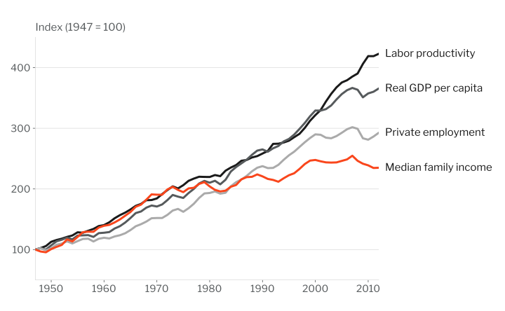

::: {.caption}
Recreated from Erik Brynjolfsson & Andrew McAfee, ["The Great Decoupling,"](https://hbr.org/2015/06/the-great-decoupling) *Harvard Business Review* (June 2015). Data: BLS and BEA via [FRED](https://fred.stlouisfed.org/); U.S. Census Bureau, [Table F-7](https://www.census.gov/data/tables/time-series/demo/income-poverty/historical-income-families.html).
:::

::: {.notes}
Recreated from current FRED and Census data, so values differ slightly from the HBR original. Regenerate with docs/assets/great-decoupling/make_great_decoupling.py.
:::

---

## Example Viz 2 {.image-frame-slide}


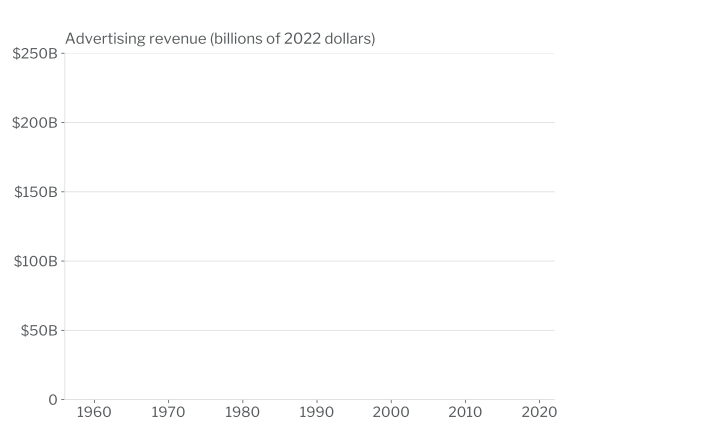

::: {.caption}
Data: Pew Research Center, [Newspapers Fact Sheet](https://www.pewresearch.org/journalism/fact-sheet/newspapers/) (News Media Alliance through 2012; Pew estimates after); Google/Alphabet and Facebook/Meta 10-K and S-1 filings, [SEC EDGAR](https://www.sec.gov/edgar/search/). Adjusted for inflation with CPI-U.
:::

---

## Example Viz 2: "Newspapers" {.image-frame-slide}


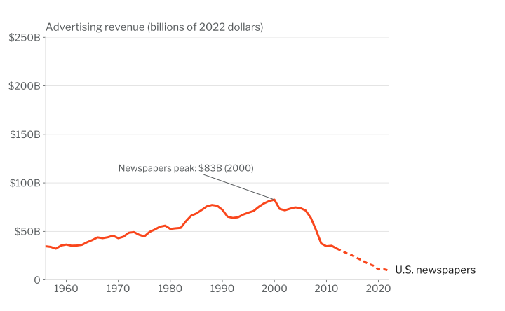

::: {.caption}
Data: Pew Research Center, [Newspapers Fact Sheet](https://www.pewresearch.org/journalism/fact-sheet/newspapers/) (News Media Alliance through 2012; Pew estimates after); Google/Alphabet and Facebook/Meta 10-K and S-1 filings, [SEC EDGAR](https://www.sec.gov/edgar/search/). Adjusted for inflation with CPI-U.
:::


---

## Example Viz 2: "Newspapers and Big Tech" {.image-frame-slide}


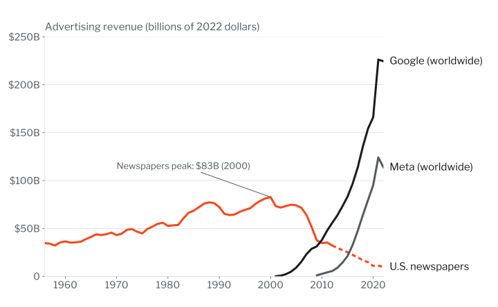

::: {.caption}
Data: Pew Research Center, [Newspapers Fact Sheet](https://www.pewresearch.org/journalism/fact-sheet/newspapers/) (News Media Alliance through 2012; Pew estimates after); Google/Alphabet and Facebook/Meta 10-K and S-1 filings, [SEC EDGAR](https://www.sec.gov/edgar/search/). Adjusted for inflation with CPI-U.
:::

::: {.notes}
Newspapers are U.S.-only; Google and Meta are worldwide (about half of each is U.S.). Regenerate with docs/assets/newspaper-ad-revenue/make_newspaper_ad_revenue.py.
:::

---

## Example Viz 3 {.image-frame-slide}

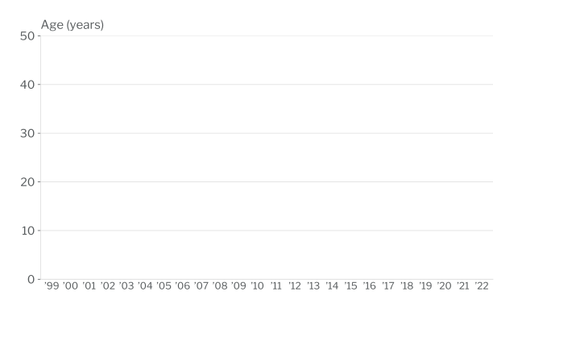

::: {.caption}
Chart: *Daily Mail*, posted by u/Far-Building3569, ["Leonardo DiCaprio's age contrasted with his girlfriends,"](https://www.reddit.com/r/charts/comments/1owzkul/leonardo_dicaprios_age_contrasted_with_his/) r/charts (14 Nov 2025).
:::

---

## Example Viz: DiCaprio's Girlfriends {.image-frame-slide}

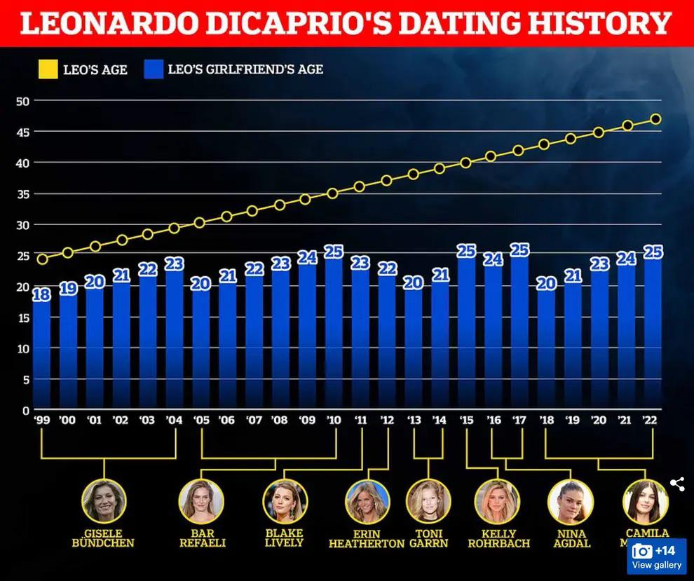

::: {.caption}
Chart: *Daily Mail*, posted by u/Far-Building3569, ["Leonardo DiCaprio's age contrasted with his girlfriends,"](https://www.reddit.com/r/charts/comments/1owzkul/leonardo_dicaprios_age_contrasted_with_his/) r/charts (14 Nov 2025).
:::

---

## Gapminder: Hans Rosling at TED (2006) {.iframe-slide}

<iframe src="https://www.youtube-nocookie.com/embed/hVimVzgtD6w?start=150&end=315&rel=0" title="Hans Rosling, The best stats you've ever seen, TED2006: the Gapminder bubble chart segment (2:30–5:15)" loading="lazy" allow="accelerometer; clipboard-write; encrypted-media; gyroscope; picture-in-picture; web-share" allowfullscreen style="border: 1px solid #999; box-shadow: 0 10px 28px rgba(0,0,0,0.12); border-radius: 3px;"></iframe>

::: {.iframe-caption}
Hans Rosling, ["The best stats you've ever seen,"](https://www.ted.com/talks/hans_rosling_the_best_stats_you_ve_ever_seen) TED2006, Monterey, CA (February 2006): [bubble chart segment, 2:30 to 5:15](https://www.youtube.com/watch?v=hVimVzgtD6w&t=150s)
:::

::: {.notes}
Clip runs from "This is where I realized that there was really a need to communicate" through the applause after "a completely new world." The YouTube upload runs about 27 seconds behind TED's own transcript, where the same segment is 2:04 to 4:48.
:::

---

## Gapminder {.iframe-slide}

<iframe src="https://www.gapminder.org/tools/#$chart-type=bubbles&url=v2" style="border: 1px solid #999; box-shadow: 0 10px 28px rgba(0,0,0,0.12); border-radius: 3px;"></iframe>


---

## Interactive Visualization: Pyramids {.image-frame-slide}

<object type="image/svg+xml" data="../assets/pyramid/comparison-of-pyramids-smil.svg" aria-label="Profiles of well-known pyramid and near-pyramid structures — from the Great Pyramid of Giza and the Pyramid of Djoser to the Louvre Pyramid, the Transamerica Pyramid, and the Ryugyong Hotel — all drawn to a common scale with a height axis in metres." style="width:auto; height:452px; aspect-ratio:560/350; display:block; margin:0 auto; background:#fff; border:1px solid rgba(0, 0, 0, 0.12); box-shadow:0 10px 28px rgba(0, 0, 0, 0.12);"></object>

::: {.caption}
From [week 1](week1.html): click a structure. Cmglee, [*Comparison of pyramids SMIL*](https://commons.wikimedia.org/wiki/File:Comparison_of_pyramids_SMIL.svg), [CC BY-SA 3.0](https://creativecommons.org/licenses/by-sa/3.0/).
:::


# Visualization Rhetoric {.section-header}


## Defining Visualization Rhetoric {.quote-slide}

> "We use the term rhetoric to refer to the set of processes by which **intended meanings** are represented in the visualization...""

::: {.attribution}
Jessica Hullman & Nicholas Diakopoulos
:::

::: {.quote-source}
["Visualization Rhetoric: Framing Effects in Narrative Visualization,"](https://doi.org/10.1109/TVCG.2011.255) *IEEE TVCG* 17(12), 2011, p. 2232.
:::

::: {.notes}
The authors separate rhetoric from "bias": they "seek to objectively describe the rhetorical nature of visualization design rather than to comment on the appropriateness of persuasion in visualization design" (p. 2232).
:::

---

## Four "Editorial Layers" of Rhetoric

::: {.caption}
Hullman & Diakopoulos, ["Visualization Rhetoric,"](https://doi.org/10.1109/TVCG.2011.255) *IEEE TVCG* (2011), pp. 2232–2233.
:::

"creating a visual representation necessitates simplification ... Thus a rhetorical dimension is present in any design."

::: {.dense}
| Layer | Rhetorical choices |
|---|-----------|
| **Data** | "what variables to include and which to leave out"; "removing outliers, scaling, or aggregating values" |
| **Visual representation** | "how the data will be mapped to the visual domain" |
| **Annotation** | titles, labels, callouts, "focusing a user's attention on specific areas" |
| **Interactivity** | e.g. "navigation menus that limit the number of views of the data set that are possible" |
:::

::: {.fragment}
"omissions, emphases, and ambiguity can be accomplished at each level."
:::

---


## Designer Responsibility {.quote-slide}

> [T]he power of rhetorical techniques to manipulate user interpretations supports a call for increased responsibility among designers [and data scientists!] to **consider the possibly unintended effects their choices may have**.

::: {.attribution}
Jessica Hullman & Nicholas Diakopoulos
:::

::: {.quote-source}
["Visualization Rhetoric: Framing Effects in Narrative Visualization,"](https://doi.org/10.1109/TVCG.2011.255) *IEEE TVCG* 17(12), 2011, p. 2239.
:::


# A Bit About Fonts {.section-header}


## A Bit About Fonts {.text-figure-slide}

::: {.aside-note}
*Fundamentals of Data Visualization*, [Chapter 24: Use Larger Axis Labels](https://clauswilke.com/dataviz/small-axis-labels.html)
:::

::: {.columns}
::: {.column width="50%"}
::: {.dense}
- "Pay attention to your axis labels, axis tick labels, and other assorted plot annotations. Chances are they are too small." (Wilke)
- Plotting libraries often have poor defaults, so set the size yourself
- Each layer of the DIKW pyramid on the right uses a different font
- Serif vs. Sans-serif
:::
:::
::: {.column width="50%"}
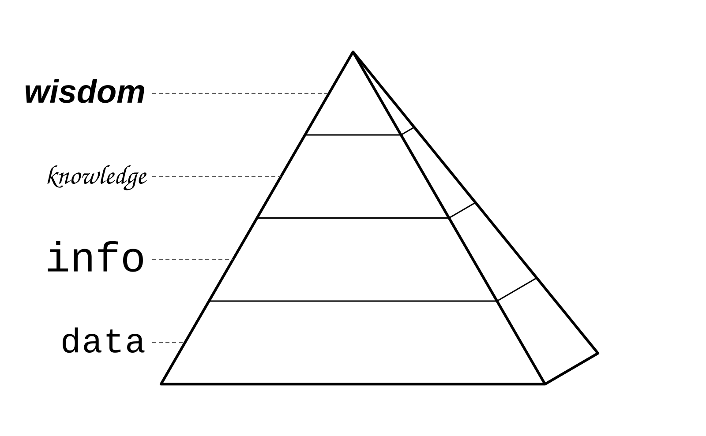
:::
:::

---

## Recognize This Font? {.image-frame-slide}


::: {.caption}
Sample text in the typeface, black on white.
:::

---

## Recognize This Font? {.image-frame-slide}


::: {.caption}
Papyrus (Chris Costello, Letraset, 1983). A modified version is the logo of *Avatar* (2009).
:::

---

## Recognize This Font? {.image-frame-slide}


::: {.caption}
Sample text in the typeface
:::

---

## Recognize This Font? {.image-frame-slide}


::: {.caption}
Just Like Heaven (Jes Sheldon), the typeface of Olivia Rodrigo's *you seem pretty sad for a girl so in love* (2026).
:::

---

## Recognize This Font? {.image-frame-slide}


::: {.caption}
Sample text in the typeface
:::

---

## Recognize This Font? {.image-frame-slide}


::: {.caption}
Hunters K-Pop (Chequered Ink, 2025), a free lookalike of the custom logo lettering of *KPop Demon Hunters* (2025).
:::

---

## Recognize This Font? {.image-frame-slide}


::: {.caption}
Sample text in the typeface
:::

---

## Recognize This Font? {.image-frame-slide}


::: {.caption}
Verdana (Matthew Carter, 1996). IKEA switched to it from Futura in 2009 ("Verdanagate"), then to a custom Noto Sans in 2019.
:::

---

## Recognize This Font? {.image-frame-slide}


::: {.caption}
Sample text in the typeface
:::

---

## Recognize This Font? {.image-frame-slide}


::: {.caption}
Arial, slightly stretched, on Pantone 3507C: the cover of Charli XCX's *Brat* (2024).
:::

---

## Serif vs. Sans-Serif {.figure-aside}

::: {.columns}
::: {.column}
- [Serif]{.term}: "a small line or stroke regularly attached to the end of a larger stroke in a letter or symbol"
- [Serif typeface]{.term}: one that uses serifs (Times, Georgia)
- [Sans-serif]{.term}: one that "does not include them" (Helvetica, Arial)
- This deck is all sans-serif (Big Shoulders, Libre Franklin)
:::
::: {.column}
[serif]{.eyebrow}


[serifs in red]{.eyebrow}


[sans-serif]{.eyebrow}


::: {.caption}
Serif: Superclarendon. Sans-serif: Helvetica.
:::
:::
:::


---

## Choosing a Font Family in Matplotlib {.code-figure-slide}

```{python}
#| echo: true
#| fig-alt: "The word Data drawn twice in large type. Left, labeled family equals serif, in DejaVu Serif with small finishing strokes on the D and the a's. Right, labeled family equals sans-serif, in DejaVu Sans with plain stroke ends."
import matplotlib.pyplot as plt
fig, axes = plt.subplots(1, 2, figsize=(10, 3.09))
for ax, family in zip(axes, ["serif", "sans-serif"]):
    ax.text(0.5, 0.45, "Data", family=family, fontsize=96, ha="center", va="center")
    ax.set_title(f'family="{family}"', fontsize=16)
    ax.axis("off")
```

::: {.notes}
Matplotlib's default font.family is sans-serif (DejaVu Sans); "serif" resolves to DejaVu Serif. Both ship with matplotlib, so this renders the same on every machine.
:::


# Visualizing Uncertainty {.section-header}


## Ways to Visualize Intervals

- **Summary** displays: error bars, shaded bands, violin plots
- **Frequency** displays: quantile dotplots, icon arrays
- **Ensemble** displays: draw many possible outcomes at once
- **Animated** displays: Hypothetical Outcome Plots (HOPs)


# Example: Hurricanes {.section-header}


## The Cone of Uncertainty {.image-frame-slide auto-animate=true}

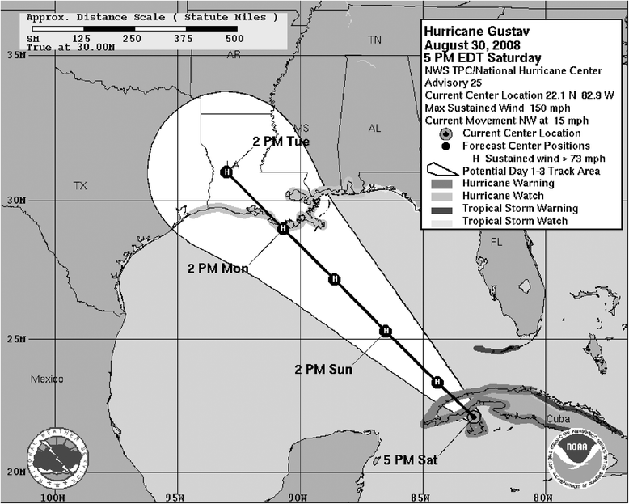

::: {.caption}
Padilla, Ruginski & Creem-Regehr, ["Effects of Ensemble and Summary Displays on Interpretations of Geospatial Uncertainty Data,"](https://doi.org/10.1186/s41235-017-0076-1) *Cognitive Research* (2017), Fig. 1. CC BY 4.0.
:::

---

## The Cone of Uncertainty {.split auto-animate=true}

::: {.split-content .golden-columns}

::: {}


1. What does the white cone represent?
2. Why does it get wider over time?
3. Just outside the cone: evacuate?
:::

<iframe src="https://dodatascience.fun/timer/" title="CTA-style countdown timer" loading="lazy" style="width: 100%; height: 420px; display: block; border: 1px solid #999; box-shadow: 0 10px 28px rgba(0,0,0,0.12); border-radius: 3px;"></iframe>

:::

::: {.notes}
The National Hurricane Center's standard forecast graphic uses a point that widens into a "swath" where the storm center might cross.
:::

---

## What Do People Think the Cone Means?

::: {.incremental}
- The cone shows where the **center** of the storm might go
    - Width comes from *historical forecast error*
    - not from the storm
- But many readers see it as the **size of the storm**, growing over time
- "Visual depictions of information can help clarify the uncertainty—or compound confusion" (Hullman, ["How to Get Better at Embracing Unknowns,"](https://www.scientificamerican.com/article/how-to-get-better-at-embracing-unknowns/) *Scientific American*, 2019)
:::

---

## The Cone Today: Hurricane Polo {.image-frame-slide}


::: {.caption}
NOAA/NWS National Hurricane Center, [Hurricane Polo](https://www.nhc.noaa.gov/archive/2026/POLO_graphics.php), Intermediate Advisory 24A, 11 AM MST, 26 September 2026. Public domain.
:::


---

## Visualizing Multiple Possibilities {.image-frame-slide}

Summary displays (a, c) vs. ensemble displays (b, d) of the same forecast.

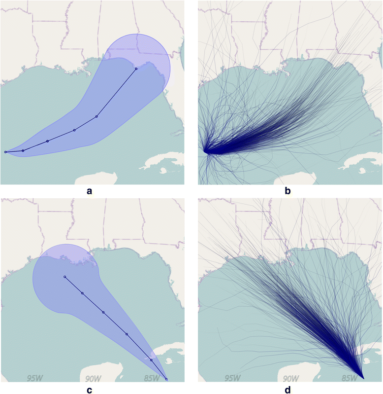

---

## One Hiccup with Multiple Possibilities {.split}

:::: {.split-content}

::: {}
- some readers now over-weight the lines
- "Damage is likely *where a line hits land*, and unlikely between them"
- Each line is one draw, not a literal path/road
:::

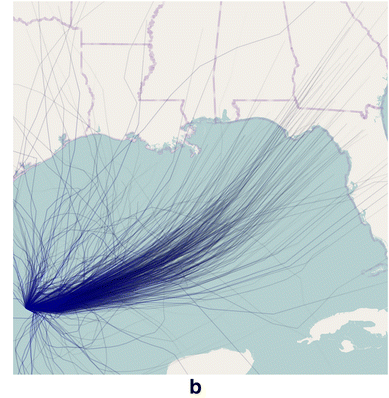

::::

---

## Hypothetical Outcome Plots (HOPs) {.split}

:::: {.split-content}

::: {}
Instead of showing the distribution, **animate draws**.

- Each frame is one plausible draw
- Viewers judge uncertainty by watching many draws
- Can be more accessible / readable for audiences
:::

::: {}
<iframe src="../assets/hops/hop-live.html" title="Live hypothetical outcome plot: static error bars for A and B beside an animation that redraws one random value of each per frame" loading="lazy" style="width: 100%; height: 420px; display: block; border: 1px solid rgba(0, 0, 0, 0.12); box-shadow: 0 10px 28px rgba(0,0,0,0.12);"></iframe>

::: {.caption}
Live demo based on Hullman, Resnick & Adar, [*PLOS ONE*](https://doi.org/10.1371/journal.pone.0142444) (2015), Fig. 2.
:::
:::

::::

---

## Live HOP Demo {.image-frame-slide}

Two Orange Line stops, one real weekday per frame. Which stop is busier?

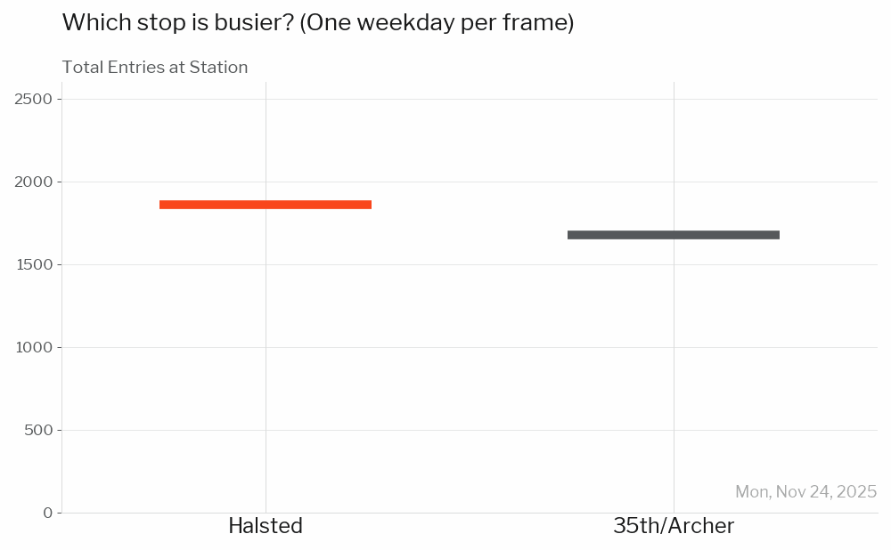

::: {.notes}
Real CTA weekday entries, sampled at random from 2025 onward.

The flips are not pure noise. Seasonal differences: — 35th/Archer leads on nearly every summer weekday, Halsted through much of the winter. The animation samples random weekdays. Setup for the decomposition material.

Asset regenerated by docs/assets/hops/make_hops_animation.py.
:::

---

## Box Plot Demo {.image-frame-slide}

Two Orange Line stops, the same 60 weekdays in one static summary. Which stop is busier?

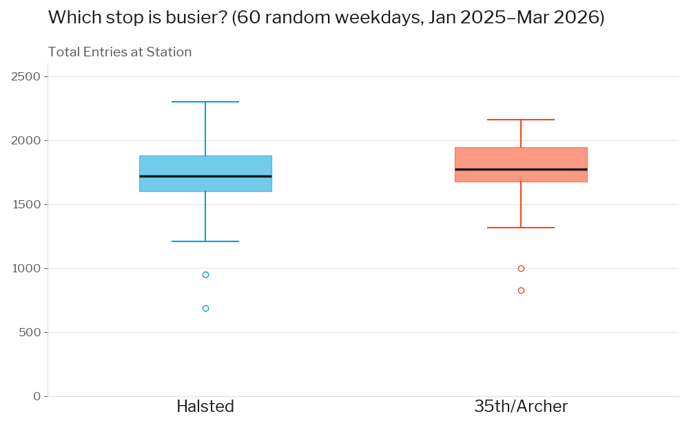

::: {.notes}
Same 60 sampled weekdays as the HOP (same seed). Standard Tukey box: the box is the middle 50% of days, whiskers reach 1.5 IQR, circles are the days beyond that.

Asset regenerated by docs/assets/hops/make_summary_plots.py.
:::

---

## Violin Plot Demo {.image-frame-slide}

Two Orange Line stops, the same 60 weekdays in one static summary. Which stop is busier?

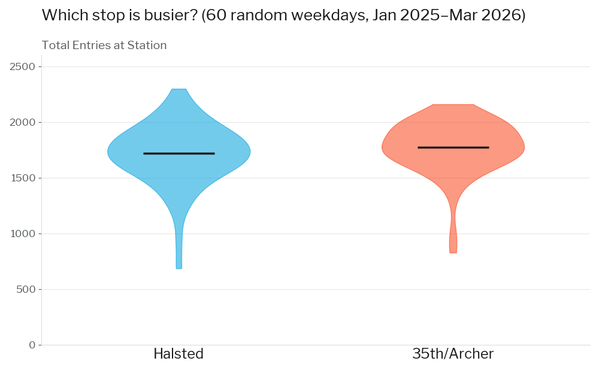

::: {.notes}
Same 60 sampled weekdays as the HOP (same seed). The violins overlap so much that the ordering is hard to read, even though 35th/Archer is busier on 36 of 60 days.

Asset regenerated by docs/assets/hops/make_violin_plot.py.
:::

---

## Dot/Interval Demo {.image-frame-slide}

Two Orange Line stops, the same 60 weekdays in one static summary. Which stop is busier?


::: {.notes}
Same 60 sampled weekdays as the HOP (same seed). Dot = median, thick bar = middle 50% of days (25th–75th percentile), thin line = middle 95% (2.5th–97.5th). These intervals describe day-to-day variation, not a confidence interval for the mean.

Asset regenerated by docs/assets/hops/make_summary_plots.py.
:::

---

## Swarm Plot Demo {.image-frame-slide}

Two Orange Line stops, the same 60 weekdays with every day drawn. Which stop is busier?

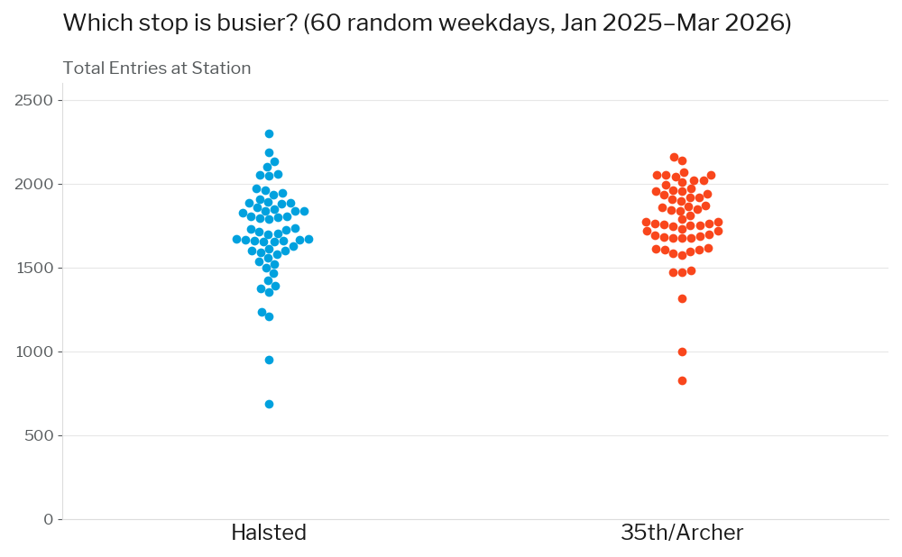

::: {.notes}
Same 60 sampled weekdays as the HOP (same seed). One dot per day, so nothing is summarized away, but the pairing is still lost: you can't tell which blue dot and which orange dot are the same day. The HOP keeps that pairing.

Asset regenerated by docs/assets/hops/make_summary_plots.py.
:::

---

## Notes on Uncertainty

::: {.dense}
- a visualization adopts and/or reinforces a mental model
- ask/explore **"what will people conclude?"**
- "both summary and ensemble displays have inherent biases based on their salient visual features" (Padilla et al., 2017)
    - Cone viewers said the storm got larger over time 70% of the time, vs. 39% for ensemble viewers (Padilla et al., 2017, Exp. 1)
- Text often carries the uncertainty, though not necessarily ideal (Hullman & Diakopoulos, 2011)
    - e.g. the note now printed on NHC's cone
:::


# Visualizing Time Series {.section-header}


## Time Series Basics

::: {.incremental}
- A **univariate time series** is a sequence of observations of the same variable collected over time
    - not just a "bag of values"
- Two common goals of time series analysis:
- **Understand** or explain processes that produced the data
- **Forecast** future values of the series (i.e. prediction)
:::

---


## Why I love time series

::: {.incremental}
Time series can contextualize (almost) any arbitrary datum

- e.g. "UIC had $X$ graduates last year"
- e.g. "Chicago's budget grew by \$$X$ million last year"
- e.g. "the mortgage interest rate is $X.X$%"
- e.g. "$X$ people have died from the flu this year"
- e.g. "the U.S. spent \$$X$ on social security last year"
:::

---

## Time Series Examples

::: {.incremental}
- Airline passengers
- Public transit ridership
- Hourly/Daily/Monthly temperatures
- Annual spending
- Other time series you can think of?
:::

---

## Airline Passengers: Setup

```{python}
#| echo: true
import polars as pl
import seaborn as sns
import matplotlib.pyplot as plt

airline = pl.read_csv("../../datasets/airline-passengers/airline-passengers.csv")
airline.sample(5, seed=42).sort("Month")

```

---

## Airline Passengers Example {.code-figure-slide auto-animate=true}

```{python}
#| echo: true
#| label: airline-line
#| fig-alt: "Line plot of monthly international airline passengers from 1949 to 1960, showing an upward trend with repeating seasonal peaks each summer that grow larger over time"
airline = airline.with_columns(pl.col("Month").str.to_date("%Y-%m-%d"))
ax = sns.lineplot(x=airline["Month"], y=airline["Passengers"])
ax.set_ylim(bottom=0)
plt.tight_layout()
```

---

## Airline Passengers: What Do You Notice? {.split auto-animate=true}

::: {.split-content .golden-columns}

::: {}


1. How to describe this series?
2. Overall trend(s)? Seasonal changes?
3. Potential explanations?
:::

<iframe src="https://dodatascience.fun/timer/" title="CTA-style countdown timer" loading="lazy" style="width: 100%; height: 420px; display: block; border: 1px solid #999; box-shadow: 0 10px 28px rgba(0,0,0,0.12); border-radius: 3px;"></iframe>

:::

---

## Rolling Average

```{python}
#| echo: true
#| code-line-numbers: "2"
airline = airline.with_columns(
    pl.col("Passengers").rolling_mean(window_size=12).alias("trend")
)
airline.sample(5, seed=42).sort("Month")
```

---

## Rolling Average {.code-figure-slide}

```{python}
#| echo: true
#| fig-alt: "Line plot of airline passengers with a smoothed 12-month rolling average overlaid as an orange line, making the underlying upward trend clearly visible through the seasonal noise"
ax = sns.lineplot(x=airline["Month"], y=airline["Passengers"], alpha=0.35, label="observed")
trend_not_null = airline.filter(pl.col("trend").is_not_null())
sns.lineplot(x=trend_not_null["Month"], y=trend_not_null["trend"], label="12-month avg", ax=ax)
ax.legend()
ax.set_ylim(bottom=0)
plt.tight_layout()
```

---

## Four-part Decomposition

Time series can be decomposed into four parts:

::: {.incremental}
- **Level**: Baseline average value
- **Trend**: Long-term increase or decrease
- **Seasonality**: Repeating periodic pattern(s)
- **Noise**: Random/unexplained variation
:::


---

## Additive vs. Multiplicative Seasonality

::: {.columns}
::: {.column width="50%"}
**Additive**

$$y(t) = T + S + N$$

Seasonal swings are **constant**: regardless of trend level, variation is a fixed amount.

Use when amplitudes stay flat.
:::
::: {.column .fragment width="50%"}
**Multiplicative**

$$y(t) = T \times S \times N$$

Seasonality **scales as the trendline continues** (bigger baseline means bigger swings).

Use when amplitudes grow over time.
:::
:::


---

## Additive vs. Multiplicative Example {.code-figure-side}

```{python}
#| echo: true
#| fig-alt: "Two stacked toy series over four years of months, each with a dashed gray trend line rising from 100 to about 335, on a shared y-axis. Top, additive: the series hugs the trend with small swings that stay the same height the whole way. Bottom, multiplicative: the swings start small and grow much wider as the trend rises."
import numpy as np
t = np.arange(48)  # 48 months
trend = 100 + 5 * t
wave = np.sin(2 * np.pi * t / 12)
add = trend + 12 * wave
mult = trend * (1 + 0.45 * wave)
fig, axes = plt.subplots(
    2, 1, figsize=(5, 5),
    sharex=True, sharey=True)
toys = {"Additive": add,
        "Multiplicative": mult}
for ax, name in zip(axes, toys):
    ax.plot(trend, "--", c="gray")
    ax.plot(toys[name])
    ax.set_title(name)
axes[-1].set_xlabel("Month")
plt.tight_layout()
```

---

## Additive vs. Multiplicative, Side by Side {.text-figure-slide}

::: {.columns}
::: {.column width="50%"}
```{python}
#| echo: true
#| output: false
from statsmodels.tsa.seasonal import (
    seasonal_decompose)
y = airline["Passengers"].to_numpy()
fig, axes = plt.subplots(
    1, 2, figsize=(5.6, 2.2))
for ax, model, unit, base in zip(axes,
        ["additive", "multiplicative"],
        ["± passengers (k)", "× trend"],
        [0, 1]):
    r = seasonal_decompose(
        y, model=model, period=12)
    ax.plot(r.seasonal[:36])
    ax.axhline(base, c="gray", ls="--")
    ax.set(title=model, ylabel=unit,
           xlabel="Month")
plt.tight_layout()
```
:::
::: {.column width="50%"}
```{python}
#| echo: false
#| fig-alt: "Two side-by-side seasonal components from seasonal_decompose on the airline data, first three years. Both are the same repeating 12-month wave peaking in July. Left, additive: labeled in passengers (thousands) relative to trend, swinging from about -54 to +64 around a dashed zero line. Right, multiplicative: labeled as a multiple of trend, swinging from about 0.80 to 1.23 around a dashed line at 1."
fig
```

::: {.dense-smaller}
**The decomposition:** `seasonal_decompose` removes a 12-month moving-average trend, then averages what's left by calendar month. That average, repeated every year, is the seasonal component; the rest is residual.
:::

::: {.dense-smaller}
**Reading the plots:** same wave, different units. Additive: July = trend **+64k** passengers. Multiplicative: July = trend **×1.23**, so the bump grows as the trend does.
:::
:::
:::


---

## Choosing a Seasonality Model

**Use additive when** seasonal swings are consistently the same size.

 - _Example: a stadium closes outdoor seating during the winter, which reduces capacity by a fixed amount (e.g. 2,000 seats)._

**Use multiplicative when** seasonal swings scale with the trend.

- _Example: airline passengers — summer peaks are larger as the overall baseline gets higher (more people flying)._

Plot the raw data and check if the peaks get taller.


---


## `seasonal_decompose`: Four Components

```{python}
#| echo: true
#| code-line-numbers: "4"
from statsmodels.tsa.seasonal import seasonal_decompose

values = airline["Passengers"].to_numpy().astype(float)
result = seasonal_decompose(values, model="multiplicative", period=12)
```

---

## `seasonal_decompose`: Four Components {.code-figure-slide}

```{python}
#| echo: true
#| fig-alt: "Four-panel decomposition plot of airline passenger data showing observed, trend, seasonal, and residual components stacked vertically"
fig = result.plot()
fig.set_size_inches(7, 4.3)
fig.get_axes()[-1].set_xlabel("Month")
plt.tight_layout()
```

---

## The Trend Component {.code-figure-slide}

```{python}
#| echo: true
#| code-line-numbers: "3"
#| fig-alt: "Smooth upward-sloping line showing only the trend component extracted from airline passenger data, with missing values at both ends where the rolling average cannot be computed"
trend_df = pl.DataFrame({
    "Month": airline["Month"],
    "trend": pl.Series("trend", result.trend).fill_nan(None),
}).drop_nulls("trend")

ax = sns.lineplot(x=trend_df["Month"], y=trend_df["trend"])
ax.set_ylim(bottom=0)
ax.set_ylabel("Passengers (trend)")
ax.set_title("Trend Component")
plt.tight_layout()
```

---

## The Seasonal Component

```{python}
#| echo: true
#| output: false
seasonal_df = pl.DataFrame({
    "Month": airline["Month"],
    "seasonal": pl.Series("seasonal", result.seasonal),
})
first_two = seasonal_df.head(24)
last_two = seasonal_df.tail(24)
```

We'll check to see if the seasonal factor stays **constant** over time (with a multiplicative model)

---

## The Seasonal Component: Stable Over Time? {.code-figure-slide}

```{python}
#| echo: true
#| fig-alt: "Two side-by-side panels of the multiplicative seasonal component: the first two years on the left and the last two years on the right. Both show an identical repeating wave with summer peaks and winter troughs, illustrating that the seasonal factor is constant over time."
fig, axes = plt.subplots(1, 2, figsize=(10, 3.09), sharey=True)
for df, ax, label in zip([first_two, last_two], axes, ["First 2 years", "Last 2 years"]):
    sns.lineplot(x=df["Month"], y=df["seasonal"], ax=ax)
    ax.axhline(1.0, color="gray", linestyle="--", alpha=0.5)
    ax.set(xlabel="Month", title=label)
    plt.setp(ax.xaxis.get_majorticklabels(), rotation=45, ha="right")
axes[0].set_ylabel("Seasonal factor")
fig.suptitle("Seasonal Component (multiplicative)")
plt.tight_layout()
```

---

## The Residuals (Noise) {.code-figure-slide}

```{python}
#| echo: true
#| code-line-numbers: "3"
#| fig-alt: "Residuals after removing trend and seasonality from airline data, showing mostly random noise hovering around 1.0 with a few small spikes"
resid_df = pl.DataFrame({
    "Month": airline["Month"],
    "resid": pl.Series("resid", result.resid).fill_nan(None),
}).drop_nulls("resid")

ax = sns.lineplot(x=resid_df["Month"], y=resid_df["resid"])
ax.axhline(1.0, color="gray", linestyle="--", alpha=0.5)
ax.set_ylabel("Residual")
ax.set_title("Residuals (multiplicative: ideal noise ≈ 1.0)")
plt.tight_layout()
```


# Time Series Example with CTA Rides {.section-header}


## Live Demo?!?!

- [https://dodatascience.fun](https://dodatascience.fun)
- Based on your feedback last week...
- Give it a try if you want


## Load UIC-Halsted Daily Ridership

```{python}
#| echo: true
cta = pl.read_csv("../../datasets/cta-ridership/Station_Entries_-_Daily_Totals_20260527.csv")
uic = cta.filter(pl.col("stationname") == "UIC-Halsted")
uic.sample(5, seed=42)
```

---

## Load UIC-Halsted Daily Ridership {.code-figure-slide}

```{python}
#| echo: true
#| fig-alt: "Line plot of daily CTA ridership at UIC-Halsted station over the last 10 years, showing a sharp drop in 2020 during COVID and gradual recovery, with rapid short-term oscillations from weekly seasonality"
uic = (
    cta.filter(pl.col("stationname") == "UIC-Halsted")
    .with_columns(
        pl.col("date").str.to_date("%m/%d/%Y"),
        pl.col("rides").str.replace_all(",", "").cast(pl.Int64),
    ).sort("date").filter(pl.col("date") >= pl.date(2016, 1, 1))
)
ax = sns.lineplot(x=uic["date"], y=uic["rides"], linewidth=0.5)
ax.set_ylim(bottom=0)
plt.tight_layout()
```

---

## Just for Fun {.code-figure-slide}

```{python}
#| echo: true
#| code-line-numbers: "1,2"
#| fig-alt: "Line plot of daily CTA ridership at UIC-Halsted station colored in the CTA Blue Line color (#00A1DE)"
CTA_BLUE = "#00A1DE"
ax = sns.lineplot(x=uic["date"], y=uic["rides"], linewidth=0.5, color=CTA_BLUE)
ax.set_xlabel("Date")
ax.set_ylim(bottom=0)
plt.tight_layout()
```

---


## Weekday variation {.code-figure-slide}

```{python}
#| echo: true
#| fig-alt: "Box plot of UIC-Halsted ridership by day of week, showing much higher ridership Monday through Friday and very low ridership on Saturdays and Sundays, confirming a strong commuter and student pattern"
day_order = ["Monday", "Tuesday", "Wednesday", "Thursday", "Friday", "Saturday", "Sunday"]
uic_dow = uic.with_columns(pl.col("date").dt.strftime("%A").alias("day_name"))
ax = sns.boxplot(x=uic_dow["day_name"], y=uic_dow["rides"], order=day_order, color=CTA_BLUE)
ax.set_xlabel("")
ax.tick_params(axis="x", rotation=30)
ax.set_title("Ridership by Day of Week — UIC-Halsted")
plt.tight_layout()
```

---

## Decomposing with Period = 7 {.code-figure-slide}

```{python}
#| echo: true
#| fig-alt: "Four-panel decomposition of UIC-Halsted daily ridership using a 7-day period, revealing the long-term trend including the COVID crash in 2020 and a clear weekly seasonal pattern"
rides = uic["rides"].to_numpy().astype(float)
cta_result = seasonal_decompose(rides, model="additive", period=7)
fig = cta_result.plot()
fig.set_size_inches(7, 4.3)
fig.get_axes()[-1].set_xlabel("Day # (since Jan 2016)")
plt.tight_layout()
```

---

## Period=7 Decomposition: What's Still There? {.code-figure-slide}

```{python}
#| echo: true
#| fig-alt: "Line plot of seasonally-adjusted UIC-Halsted ridership after subtracting the weekly seasonal component, showing a much smoother underlying trend with the COVID drop clearly visible"
deseasonalized = pl.DataFrame({
    "date": uic["date"],
    "rides": pl.Series("rides", cta_result.observed - cta_result.seasonal),
})
ax = sns.lineplot(x=deseasonalized["date"], y=deseasonalized["rides"], color=CTA_BLUE, linewidth=0.5)
ax.set_xlabel("Date")
ax.set_ylabel("Rides (seasonally adjusted)")
ax.set_title("Observed − Seasonal Component")
ax.set_ylim(bottom=0)
plt.tight_layout()
```

---

## Monthly Variation(s) for UIC-Halsted Stop {.code-figure-slide}

```{python}
#| echo: true
#| fig-alt: "Box plot of UIC-Halsted ridership by month of the year, showing lower ridership in January, the summer months June through August, and December, tracking the UIC academic calendar."
month_order = ["Jan", "Feb", "Mar", "Apr", "May", "Jun",
               "Jul", "Aug", "Sep", "Oct", "Nov", "Dec"]
uic_month = uic.with_columns(pl.col("date").dt.strftime("%b").alias("month"))
ax = sns.boxplot(x=uic_month["month"], y=uic_month["rides"], order=month_order, color=CTA_BLUE)
ax.set_xlabel("")
ax.set_ylim(bottom=0)
ax.set_title("Ridership by Month — UIC-Halsted")
plt.tight_layout()
```


---

## MSTL: Multiple Seasonal Decomposition {.code-figure-slide}

```{python}
#| echo: true
#| fig-alt: "Five-panel MSTL decomposition of UIC-Halsted daily ridership, separating the long-term trend, a 7-day weekly seasonal component, a 365-day annual seasonal component that tracks the academic calendar, and the residual noise."
from statsmodels.tsa.seasonal import MSTL

mstl = MSTL(rides, periods=(7, 365)).fit()
fig = mstl.plot()
fig.set_size_inches(7, 4.6)
fig.get_axes()[-1].set_xlabel("Day # (since Jan 2016)")
plt.tight_layout()
```

---

## Understanding the Decomposition {.text-figure-slide}

::: {.columns}
::: {.column width="45%"}
::: {.incremental .dense}
- **Trend**: steady through ~2019, collapse in spring 2020 (COVID), gradual recovery
- **Weekly seasonality**: weekday vs weekend ridership
- **Annual seasonality**: dips in January, summer, and December (academic calendar)
- **Residuals**: large spikes or dips mark unusual days — holidays, extreme weather, special events
:::
:::
::: {.column width="55%"}
```{python}
#| echo: false
#| fig-alt: "Five-panel MSTL decomposition of UIC-Halsted daily ridership, 2016 onward, each panel labeled on its y-axis: Observed, Trend, Weekly (7-day) seasonal, Annual (365-day) seasonal, and Residual."
panels = [
    ("Observed", mstl.observed),
    ("Trend", mstl.trend),
    ("Weekly\n(7-day)", mstl.seasonal[:, 0]),
    ("Annual\n(365-day)", mstl.seasonal[:, 1]),
    ("Residual", mstl.resid),
]
with plt.rc_context({"font.size": 13}):
    fig, axes = plt.subplots(len(panels), 1, sharex=True, figsize=(6.3, 5.4))
    for ax, (label, y) in zip(axes, panels):
        ax.plot(uic["date"], y, lw=0.6, color=CTA_BLUE)
        ax.set_ylabel(label, rotation=0, ha="right", va="center")
        ax.yaxis.set_major_locator(plt.MaxNLocator(3))
    plt.tight_layout(h_pad=0.4)
```
:::
:::


# A Different Station (Washington/Wabash) {.section-header}


## Load Washington/Wabash

```{python}
#| echo: true
CTA_ORANGE = "#F9461C"
wabash = (
    cta.filter(pl.col("stationname") == "Washington/Wabash")
    .with_columns(
        pl.col("date").str.to_date("%m/%d/%Y"),
        pl.col("rides").str.replace_all(",", "").cast(pl.Int64),
    ).sort("date").filter(pl.col("date") >= pl.date(2016, 1, 1))
)
wabash.sample(5, seed=42).sort("date")
```

---

## Washington/Wabash Ridership Over Time {.code-figure-slide}

```{python}
#| echo: true
#| fig-alt: "Line plot of daily ridership at the Washington/Wabash station colored in CTA Orange, beginning in late 2017 when the station opened, with the 2020 COVID drop and partial recovery."
ax = sns.lineplot(x=wabash["date"], y=wabash["rides"], linewidth=0.5, color=CTA_ORANGE)
ax.set_xlabel("Date")
ax.set_ylim(bottom=0)
ax.set_title("Washington/Wabash — Daily Ridership")
plt.tight_layout()
```

---

## Washington/Wabash Daily Patterns {.code-figure-slide}

```{python}
#| echo: true
#| fig-alt: "Box plot of Washington/Wabash ridership by day of week. Weekdays are busiest, but Saturday and Sunday ridership stays relatively high compared to a student station, reflecting downtown shopping, tourism, and events."
wabash_dow = wabash.with_columns(pl.col("date").dt.strftime("%A").alias("day_name"))
ax = sns.boxplot(x=wabash_dow["day_name"], y=wabash_dow["rides"], order=day_order, color=CTA_ORANGE)
ax.set_xlabel("")
ax.tick_params(axis="x", rotation=30)
ax.set_title("Ridership by Day of Week — Washington/Wabash")
plt.tight_layout()
```

---

## Two Stations, Two Rhythms? (Daily) {.code-figure-slide}

```{python}
#| echo: true
#| fig-alt: "Two side-by-side day-of-week box plots. UIC-Halsted (blue) collapses on weekends, while Washington/Wabash (orange) keeps substantial weekend ridership, showing a flatter weekly profile for the downtown Loop station."
fig, axes = plt.subplots(1, 2, figsize=(10, 3.09), sharey=True)
sns.boxplot(x=uic_dow["day_name"], y=uic_dow["rides"], order=day_order, color=CTA_BLUE, ax=axes[0])
sns.boxplot(x=wabash_dow["day_name"], y=wabash_dow["rides"], order=day_order, color=CTA_ORANGE, ax=axes[1])
axes[0].set_title("UIC-Halsted (student / commuter)")
axes[1].set_title("Washington/Wabash (downtown Loop)")
for ax in axes: ax.set_xlabel(""); ax.tick_params(axis="x", rotation=45)
plt.tight_layout()
```

---

## Two Stations, Two Rhythms? (Monthly) {.code-figure-slide}

```{python}
#| echo: true
#| fig-alt: "Two side-by-side month-of-year box plots. UIC-Halsted (blue) shows pronounced dips in January, June through August, and December that track the academic calendar. Washington/Wabash (orange) shows a much flatter annual profile without summer lows."
wabash_month = wabash.with_columns(pl.col("date").dt.strftime("%b").alias("month"))
fig, axes = plt.subplots(1, 2, figsize=(10, 3.09), sharey=True)
sns.boxplot(x=uic_month["month"], y=uic_month["rides"], order=month_order, color=CTA_BLUE, ax=axes[0])
sns.boxplot(x=wabash_month["month"], y=wabash_month["rides"], order=month_order, color=CTA_ORANGE, ax=axes[1])
axes[0].set_title("UIC-Halsted (student / commuter)")
axes[1].set_title("Washington/Wabash (downtown Loop)")
for ax in axes: ax.set_xlabel(""); ax.tick_params(axis="x", rotation=45)
plt.tight_layout()
```

---

## Intuition

- **Academic calendar**
    - UIC dips in January, summer, and December
    - the Loop's annual seasonal swing is weaker
- **History**
    - Washington/Wabash only opened in **Aug 2017**
    - (replaced Madison/Wabash and Randolph/Wabash)
    - its series is much shorter
    - the Loop has more weekend traffic (shopping, tourism, events, etc.)


---

## Any questions?

- PrairieLearn Homeworks?
- Group Projects? (data acquisition checkpoint due Sunday)
- Coding Exercise 01? (due Wednesday)
- Other logistics?
- (You can also stay after class for questions)

---

## Upload your worksheet {#upload-worksheet-day-1}

Take a picture of your worksheet, upload it in Canvas


# Week 6, Day 2 {.course-title .photo-title data-state="photo-title photo-title-zoom" background-image="../assets/orange-line-stops-better/stop07-washington-wabash-b.jpg" background-size="cover"}

<h2>Toward Causality</h2>

Jack Bandy
2026


## Map: Week 6, Day 2 (Washington/Wabash) {.split}

::: {.split-content .narrow-aside}

::: {}
- Group Check-In Time
- Revisit Demo
- Concluding Notes on Rhetoric
- Time Series: From Viz to Models
- Elemental Confounds
:::

{.figure alt="Orange Line map with the Washington/Wabash stop marked, the Week 6 stop"}

:::

---

## Group Check-In Time {.image-frame-slide auto-animate=true}

Try to sit with your group (new spots this week!)

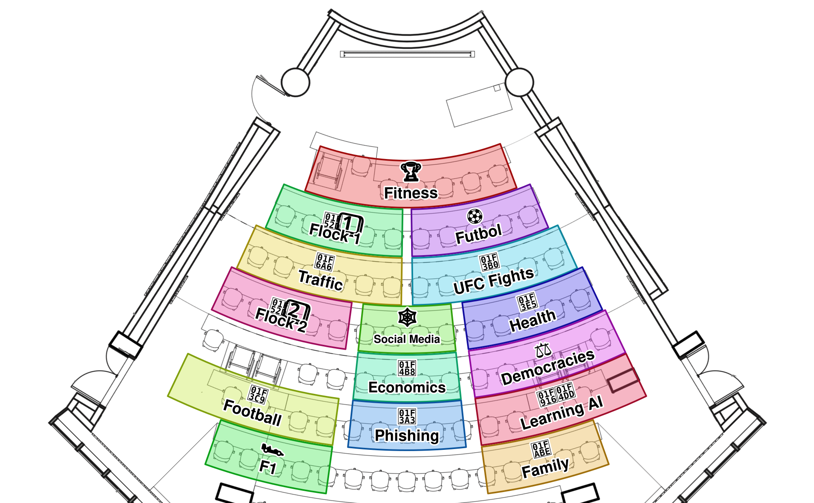

---

## Group Check-In Time {.split auto-animate=true}

::: {.split-content .golden-columns}

::: {}


1. Does your group have a name yet? If not, list a few ideas.
2. What will *you* do next for your group project?
:::

<iframe src="https://dodatascience.fun/timer/" title="CTA-style countdown timer" loading="lazy" style="width: 100%; height: 420px; display: block; border: 1px solid #999; box-shadow: 0 10px 28px rgba(0,0,0,0.12); border-radius: 3px;"></iframe>

:::

---

## Revisit Demo

- [Python Yard (beta)](https://dodatascience.fun/yard/notebooks/index.html?path=welcome.ipynb): open "Demo: a year at UIC-Halsted"
- New: a four-part decomposition of 2025 ridership, one cell at a time
- Back to [Monday's live demo](#live-demo) for the full 2016–2025 version


# Concluding Notes on Visualization Rhetoric {.section-header}

---

## Same Data, Two Stories {.code-figure-slide}

```{python}
#| echo: true
#| fig-alt: "Two line charts of UIC-Halsted rides per year. Left, 2023 to 2025 only, with the y-axis zoomed to the data: a steep climb titled 'Surging: up 37% since 2023'. Right, 2016 to 2025 with the y-axis from zero: a plateau near 1.7 million, a collapse to about half a million in 2020, and a partial recovery to 1.17 million, titled 'Still 32% below 2019'."
yearly = (uic.group_by(pl.col("date").dt.year().alias("year"))
          .agg(pl.col("rides").sum()).sort("year").filter(pl.col("year") <= 2025))
recent = yearly.filter(pl.col("year") >= 2023)
fig, axes = plt.subplots(1, 2, figsize=(10, 3.09))
axes[0].plot(recent["year"], recent["rides"], marker="o", color=CTA_BLUE)
axes[0].set(title="Surging: up 37% since 2023", xticks=[2023, 2024, 2025])
axes[1].plot(yearly["year"], yearly["rides"], marker="o", color=CTA_BLUE)
axes[1].set(title="Still 32% below 2019", ylim=(0, None))
for ax in axes: ax.yaxis.set_major_formatter(lambda v, _: f"{v / 1e3:,.0f}k")
plt.tight_layout()
```


---


## Misleading Axes

::: {.caption}
Bergstrom & West, *Calling Bullshit*, ["Misleading Axes on Graphs"](https://www.callingbullshit.org/tools/tools_misleading_axes.html) ([video 6.2](https://www.youtube.com/watch?v=9pNWVMxaFuM)).
:::

::: {.dense}
- Bar charts: the axis should include zero (week 5: proportional ink)
- Line charts: does not need to include zero
    - Sometimes it *shouldn't*: e.g. a zero-based temperature chart would make warming look flat;
- "An axis should not change scales midstream"
- An inverted axis can make a rise look like a fall
:::


---

## Note for Bubbles: Area, Not Radius {.code-figure-slide}

::: {.caption}
"In the Gapminder chart above, the area of each disk is proportional to the value indicated by size." Bergstrom & West, *Calling Bullshit*, ["The Principle of Proportional Ink"](https://www.callingbullshit.org/tools/tools_proportional_ink.html) ([video 6.6](https://www.youtube.com/watch?v=oNhusd3xFC4)).
:::

```{python}
#| echo: false
#| fig-alt: "UIC-Halsted rides in 2019 and 2021 drawn as pairs of circles. Left, area proportional to rides: the 2021 circle is a bit over half the width of the 2019 circle. Right, radius proportional to rides: the 2021 circle is under a third the width and looks about ten times smaller."
import numpy as np
from matplotlib.patches import Circle
big, small = yearly.filter(pl.col("year").is_in([2019, 2021]))["rides"].to_list()
fig, axes = plt.subplots(1, 2, figsize=(10, 3.09))
scales = {"Area ∝ rides": np.sqrt, "Radius ∝ rides": lambda x: x}
for ax, (title, radius) in zip(axes, scales.items()):
    for x, v, label in [(0, big, "2019"), (2.3, small, "2021")]:
        ax.add_patch(Circle((x, 0), radius(v / big), color=CTA_BLUE))
        ax.annotate(label, (x, -1.3), ha="center")
    ax.set(title=title, xlim=(-1.2, 3.5), ylim=(-1.5, 1.1), aspect="equal")
    ax.axis("off")
plt.tight_layout()
```

::: {.notes}
2019 had about 3.1 times the rides of 2021. Scaling radius by value makes the area ratio about 9.8, a lie factor of about 3 (Tufte's term; Calling Bullshit uses it for a radius-scaled bubble chart with a lie factor of 2.5).
:::


# Time Series: From Viz to Models {.section-header}


## Some Vocabulary for Modeling

::: {.incremental}
- So far, the date was essentially the model: each step based on previous step
- But ridership responds to factors (dare we say **causes??**), which can be identified and measured.
- Could we treat each day as an **independent observation**?
- Could we predict the observation based on **covariates** like enrollment, weekday, holiday, special event, weather, etc.?
- This is a **causal** framing
    - We can use it to design a regression model
:::

---

## Covariates for Ridership {.image-frame-slide auto-animate=true}

Say we want to estimate how many people will go through the UIC-Halsted station on a given date. What would you want to know?

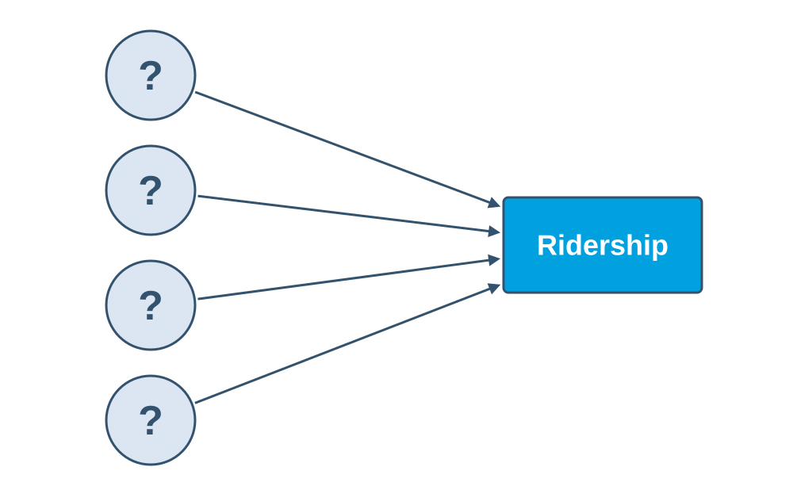

---

## Covariates for Ridership {.split auto-animate=true}

::: {.split-content .golden-columns}

::: {}


1. What covariates could help predict daily ridership at UIC-Halsted?
2. Why would each one affect ridership?
:::

<iframe src="https://dodatascience.fun/timer/" title="CTA-style countdown timer" loading="lazy" style="width: 100%; height: 420px; display: block; border: 1px solid #999; box-shadow: 0 10px 28px rgba(0,0,0,0.12); border-radius: 3px;"></iframe>

:::

---

## Causality Example: A Simple DAG for Ridership {.image-frame-slide}

```{python}
#| echo: false
#| fig-alt: "A simple directed acyclic graph with all root causes (UIC enrollment, month/term, weekday, holiday, weather, special event) pointing directly to Ridership."
import networkx as nx

G_simple = nx.DiGraph()
root_causes = ["UIC enrollment", "Month / term", "Weekday", "Holiday", "Weather", "Special event"]
G_simple.add_edges_from([(c, "Ridership") for c in root_causes])

pos_simple = {
    "UIC enrollment": (0, 5.0),
    "Month / term":   (0, 4.0),
    "Weekday":        (0, 3.0),
    "Holiday":        (0, 2.0),
    "Weather":        (0, 1.0),
    "Special event":  (0, 0.0),
    "Ridership":      (2.6, 2.5),
}

fig, ax = plt.subplots(figsize=(9, 5.5))
nx.draw_networkx_nodes(G_simple, pos_simple, nodelist=root_causes,
                       node_color="#dce6f2", edgecolors="#33526e", node_size=4200, ax=ax)
nx.draw_networkx_nodes(G_simple, pos_simple, nodelist=["Ridership"],
                       node_color=CTA_BLUE, edgecolors="#33526e", node_size=5800, ax=ax)
nx.draw_networkx_labels(G_simple, pos_simple, font_size=8, ax=ax)
nx.draw_networkx_edges(G_simple, pos_simple, arrowsize=18, node_size=5800,
                       edge_color="#888", width=1.5, ax=ax)
ax.set_axis_off()
plt.tight_layout()
```

---

## Causality Example: Indirect Causes of Ridership

Some causes work through **intermediate factors**.

::: {}
- **UIC enrollment** + **month/term** + **weather** → **UIC student attendance**
- **Weekday** + **holiday** → student attendance, **UIC staff on campus**
    - note the *academic calendar* affects students but **not** staff
- **Special event** like concerts, games, speakers → directly boosts ridership (could also do this as a hierarchy)
- **Ridership** ← student attendance + staff + special events + ...
:::


---


## Causality Example: A Hierarchical DAG for Ridership {.image-frame-slide}

```{python}
#| echo: false
#| fig-alt: "A directed acyclic graph with three columns: root causes on the left (UIC enrollment, month/term, weekday, holiday, weather, special event), two intermediary nodes in the middle (UIC student attendance and UIC staff on campus), and Ridership on the right. Arrows show which causes flow through which intermediary before reaching ridership."
import networkx as nx

G = nx.DiGraph()

root_causes = ["UIC enrollment", "Month / term", "Weekday", "Holiday", "Weather", "Special event"]
intermediaries = ["UIC student\nattendance", "UIC staff\non campus"]
outcome = ["Ridership"]

G.add_edges_from([(c, "UIC student\nattendance")
                  for c in ["UIC enrollment", "Month / term", "Weekday", "Holiday", "Weather"]])
G.add_edges_from([(c, "UIC staff\non campus") for c in ["Weekday", "Holiday"]])
G.add_edge("UIC student\nattendance", "Ridership")
G.add_edge("UIC staff\non campus", "Ridership")
G.add_edge("Special event", "Ridership")

pos = {
    "UIC enrollment": (0, 5.0),
    "Month / term":   (0, 4.0),
    "Weekday":        (0, 3.0),
    "Holiday":        (0, 2.0),
    "Weather":        (0, 1.0),
    "Special event":  (0, 0.0),
    "UIC student\nattendance": (2.6, 3.5),
    "UIC staff\non campus":    (2.6, 1.0),
    "Ridership":      (5.2, 2.25),
}

fig, ax = plt.subplots(figsize=(9, 5.5))
nx.draw_networkx_nodes(G, pos, nodelist=root_causes,
                       node_color="#dce6f2", edgecolors="#33526e", node_size=4200, ax=ax)
nx.draw_networkx_nodes(G, pos, nodelist=intermediaries,
                       node_color="#fce8d5", edgecolors="#c85e00", node_size=5200, ax=ax)
nx.draw_networkx_nodes(G, pos, nodelist=outcome,
                       node_color=CTA_BLUE, edgecolors="#33526e", node_size=5800, ax=ax)
nx.draw_networkx_labels(G, pos, font_size=8, ax=ax)
straight_edges = [e for e in G.edges() if e != ("Special event", "Ridership")]
nx.draw_networkx_edges(G, pos, edgelist=straight_edges, arrowsize=18, node_size=5200,
                       edge_color="#888", width=1.5, ax=ax)
nx.draw_networkx_edges(G, pos, edgelist=[("Special event", "Ridership")],
                       arrowsize=18, node_size=5200, edge_color="#888", width=1.5, ax=ax,
                       connectionstyle="arc3,rad=-0.3")
ax.set_axis_off()
plt.tight_layout()
```

---


## Preview: A Bayesian Ridership Model

One station (UIC-Halsted, daily entries since 2023), and date only for now: each day is **intercept + weekday effect + month effect + noise** (none of the other DAG nodes yet).

```python
# dow, month, y: weekday, month, and UIC-Halsted rides for each day since 2023
with pm.Model() as model:
    intercept = pm.Normal("intercept", mu=y.mean(), sigma=2000)
    dow_eff   = pm.ZeroSumNormal("dow_eff", sigma=1500, shape=7)
    month_eff = pm.ZeroSumNormal("month_eff", sigma=1500, shape=12)
    sigma     = pm.HalfNormal("sigma", 2000)
    mu = intercept + dow_eff[dow] + month_eff[month]
    pm.Normal("obs", mu=mu, sigma=sigma, observed=y)
    idata = pm.sample()
```

```{python}
#| echo: false
#| output: false
# Load the posterior saved by datasets/cta-ridership/fit_uic_halsted_posterior.py (same model as above) so rendering skips sampling.
# A plain xarray DataTree, since arviz.InferenceData's constructor differs between ArviZ 0.x and 1.x.
import xarray as xr
idata = xr.DataTree.from_dict({"posterior": xr.load_dataset("../../datasets/cta-ridership/uic_halsted_posterior.nc", engine="scipy")})
```

---

## Example Posterior: Weekday Effects {.figure-slide}

```{python}
#| echo: false
#| fig-alt: "Dot-and-interval plot of the posterior weekday effects on UIC-Halsted ridership. Weekdays sit well above zero and weekends well below, each shown with an 89% credible interval, so we see both the estimate and its uncertainty."
post = idata.posterior
dow_s = post["dow_eff"].values.reshape(-1, 7)
means = dow_s.mean(0); lo, hi = np.percentile(dow_s, [5.5, 94.5], 0)
fig, ax = plt.subplots(figsize=(7, 4.3))
ax.errorbar(means, range(7), xerr=[means-lo, hi-means], fmt="o", color=CTA_BLUE, capsize=0)
ax.axvline(0, color="gray", linestyle="--", alpha=0.5)
ax.set_yticks(range(7)); ax.set_yticklabels(["Mon","Tue","Wed","Thu","Fri","Sat","Sun"]); ax.invert_yaxis()
ax.set(xlabel="Effect on daily UIC-Halsted rides (vs. average)", title="UIC-Halsted: posterior weekday effects (89% CI)")
plt.tight_layout()
```

---

## Predicting a Given Day

Each posterior draw is one **plausible version of the world**, so one (weekday, month) pushed through every draw gives a **distribution** of UIC-Halsted rides.

```{python}
#| echo: false
#| output: false
intercept_s = post["intercept"].values.flatten()
month_s     = post["month_eff"].values.reshape(-1, 12)
sigma_s     = post["sigma"].values.flatten()
rng = np.random.default_rng(0)

def predict(day, mon):
    mu = intercept_s + dow_s[:, day] + month_s[:, mon]
    return rng.normal(mu, sigma_s)

scenarios = {"Tue · Dec": (1, 11), "Wed · Sep": (2, 8), "Sun · Oct": (6, 9)}
frames = []
for k, v in scenarios.items():
    r = predict(*v)
    frames.append(pl.DataFrame({"scenario": [k] * len(r), "rides": r}))
draws = pl.concat(frames)
```

::: {.columns}
::: {.column width="50%"}
- **Tue in December**: ≈ 2,530 rides, 89% CI: 480 – 4,620
- **Wed in September**: ≈ 5,150 rides, 89% CI: 2,950 – 7,260
- **Sun in October**: ≈ 2,680 rides, 89% CI: 610 – 4,860
- Intervals are wide (lots of **day-to-day noise** remains after weekday, month)
:::
::: {.column width="50%"}
```{python}
#| echo: false
#| fig-alt: "Violin plot of the posterior predictive UIC-Halsted ridership for three scenarios: a Tuesday in December, a Wednesday in September, and a Sunday in October. The September weekday distribution sits much higher than the December weekday and October weekend, each with visible spread."
ax = sns.violinplot(x=draws["scenario"], y=draws["rides"], color=CTA_BLUE, cut=0)
ax.set_ylim(bottom=0); ax.set_xlabel(""); ax.set_ylabel("UIC-Halsted rides")
plt.tight_layout()
```
:::
:::

---

## Extrapolation Cautions: The 2156 Olympics {.split}

:::: {.split-content}

::: {.dense}
- Olympic 100 m winning times since 1900
- Tatem et al. (2004, *Nature*) had the filled dots
- What will the winning times be in 50 years? In 150?
:::

::: {}
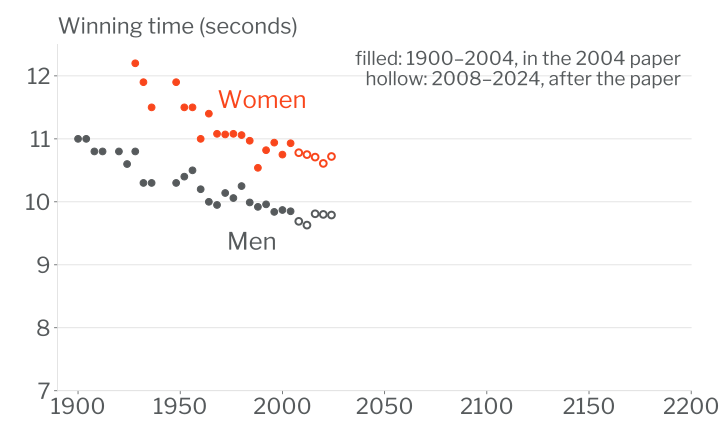

::: {.caption}
Bergstrom & West, *Calling Bullshit*, ["Case Study: The Gender Gap in 100-meter Dash Times"](https://www.callingbullshit.org/case_studies/case_study_gender_gap_running.html). Data: Tatem et al. (2004), [Table S1](https://doi.org/10.1038/431525a); 2008–2024 from Wikipedia.
:::
:::

::::

---

## Extrapolation: The 2156 Olympics {.split}

:::: {.split-content}

::: {.incremental .dense}
- Tatem et al. (2004, *Nature*) fit straight lines to Olympic 100 m winning times
    - women's times were falling faster, so the lines cross: women beat men in **2156**
- 104 years of data, extended hundreds of years out
    - "in the absence of any underlying conceptual or mechanistic model"
:::

::: {}
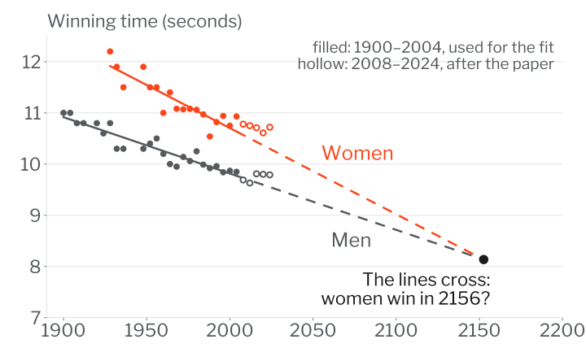

::: {.caption}
Bergstrom & West, *Calling Bullshit*, ["Case Study: The Gender Gap in 100-meter Dash Times"](https://www.callingbullshit.org/case_studies/case_study_gender_gap_running.html). Data: Tatem et al. (2004), [Table S1](https://doi.org/10.1038/431525a); 2008–2024 from Wikipedia.
:::
:::

::::

::: {.notes}
Refit on the paper's Table S1, the lines cross in 2152.6, so 2156 is the first Games after the crossing. The hollow 2008–2024 points were not in the fit: the men's sit near their line, the women's sit well above theirs (10.61–10.78 s vs. a predicted 10.3–10.6 s).
:::

---

## A Reply in *Nature* {.quote-slide}

> They omit to mention, however, that (according to their analysis) a far more interesting race should occur in about 2636, when times of less than zero seconds will be recorded.

::: {.attribution}
Kenneth Rice
:::

::: {.quote-source}
Based on [*Nature* 432:147 (2004)](https://doi.org/10.1038/432147b), responding to Tatem et al., ["Momentous sprint at the 2156 Olympics?"](https://doi.org/10.1038/431525a), *Nature* 431:525 (2004). Quoted in [*Calling Bullshit*](https://www.callingbullshit.org/case_studies/case_study_gender_gap_running.html).
:::

---

## Extrapolating CTA's Recovery? {.code-figure-side}

```{python}
#| echo: true
#| fig-width: 5
#| fig-height: 4
#| fig-alt: "UIC-Halsted rides per year from 2016 to 2025 with a dashed straight line fit to 2021 through 2025 and extended from 2014 to 2040. The line crosses zero in 2016, a year that actually had about 1.7 million rides, and climbs past 3 million by 2040, well above any year on record."
rec = yearly.filter(pl.col("year") >= 2021)
slope, intercept = np.polyfit(
    rec["year"], rec["rides"], 1)
years = np.arange(2014, 2041)
ax = sns.lineplot(
    x=yearly["year"], y=yearly["rides"],
    marker="o", color=CTA_BLUE,
    label="observed")
ax.plot(years, slope * years + intercept,
        "--", color="gray",
        label="line fit to 2021–2025")
ax.axhline(0, color="black", linewidth=0.8)
ax.yaxis.set_major_formatter(
    lambda v, _: f"{v / 1e3:,.0f}k")
ax.set(xlabel="Year", ylabel="Rides/year")
ax.legend()
plt.tight_layout()
```

::: {.notes}
The fit gains about 139,000 rides a year. Backward, it reaches zero in 2016 (actual: 1.73 million). Forward, 3.2 million a year by 2040, far above the 2019 peak. Same move as Rice's reply.
:::


# Moving Toward Causality {.section-header}


## The Elemental Confounds

For now, just know what they are (we will look at workflow implications soon).

::: {.incremental}
- **Fork**
- **Pipe**
- **Collider**
- **Descendant**
:::


---

## The Fork {.split}

:::: {.split-content}

::: {.dense}
$Z$ causes $X$ **and** it causes $Y$.

- So $X$ and $Y$ move together, even though neither one causes the other
- More ice cream consumption, more drownings
	- Both increase from Summer
- The rooster crows, then the sun rises
	- Both follow the Earth's rotation
:::

::: {}
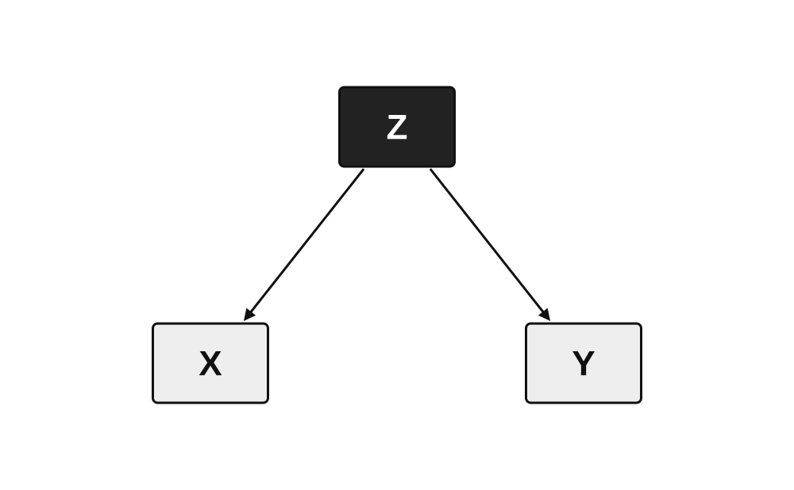

::: {.caption}
Based on Richard McElreath, *Statistical Rethinking*, 2nd ed. (CRC Press, 2020), ch. 6.
:::
:::

::::

---

## The Pipe {.split}

:::: {.split-content}

::: {.dense}
$X$ causes $Z$, and $Z$ causes $Y$ ($Z$ is the step in between)

- Amazon's résumé screener: gender → résumé content → score
	- It never saw gender, but "women's" on a résumé still lowered the score
- Hold $Z$ fixed (same résumé content) and $X$ looks like it does nothing
:::

::: {}
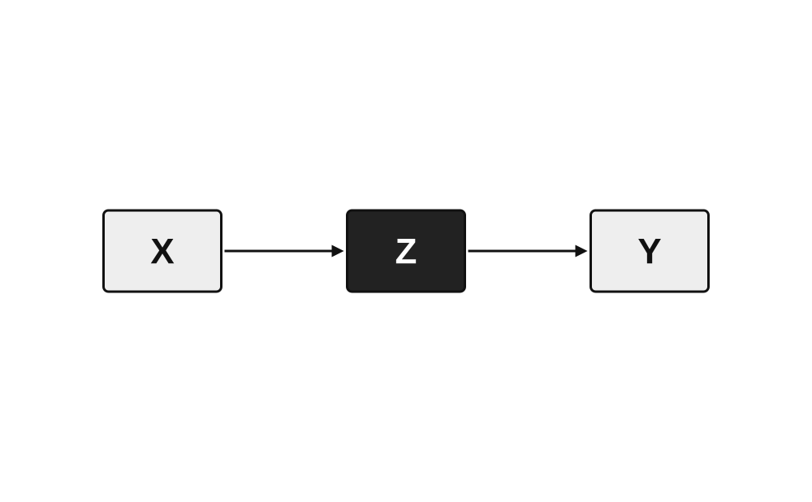

::: {.caption}
Based on Richard McElreath, *Statistical Rethinking*, 2nd ed. (CRC Press, 2020), ch. 6. Examples from [Chapter 4: Ethics in Understanding](../ethics-in-data-science/book/04-ethics-in-understanding.html).
:::
:::

::::

---

## The Collider {.split}

:::: {.split-content}

::: {}
$X$ and $Y$ both cause $Z$ (the arrows crash into it)

- $X$ and $Y$ have nothing to do with each other
- Two buckets dumped on a fire at once: either alone might've put it out (overdetermination)
:::

::: {}
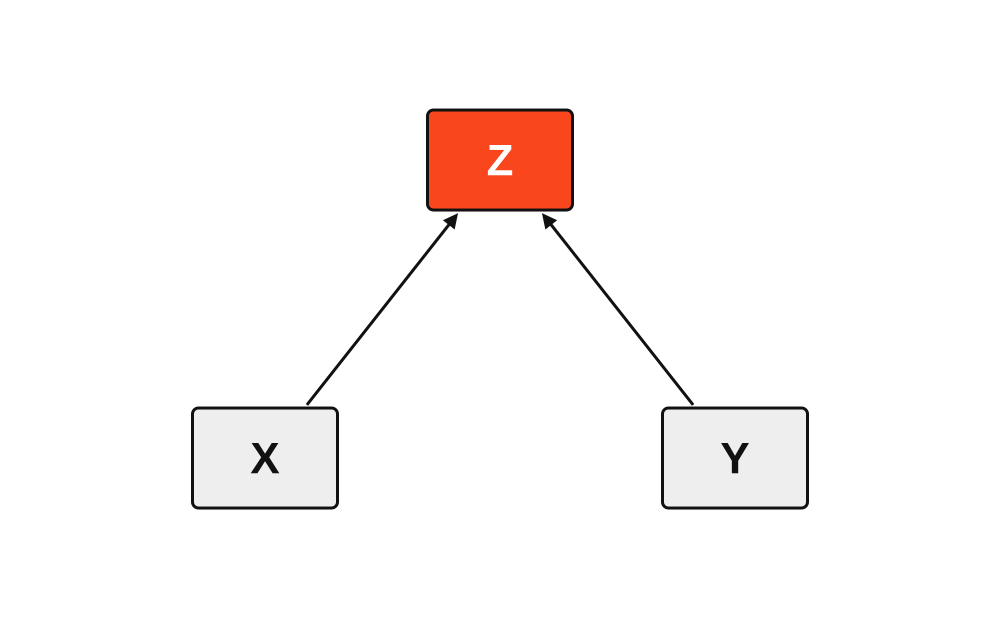

::: {.caption}
Based on Richard McElreath, *Statistical Rethinking*, 2nd ed. (CRC Press, 2020), ch. 6.
:::
:::

::::


---

## Descendant Example: A Grill {.split}

:::: {.split-content}

::: {.dense}
The gas level $X$ and the igniter $Y$ both feed the flame $Z$, and the flame decides how well the asaparagus cooks $D$.

- Imagine nobody wrote down the flame
- The only record is how the asaparagus came out
- Can the doneness of the asaparagus stand in for the flame?
:::

::: {}
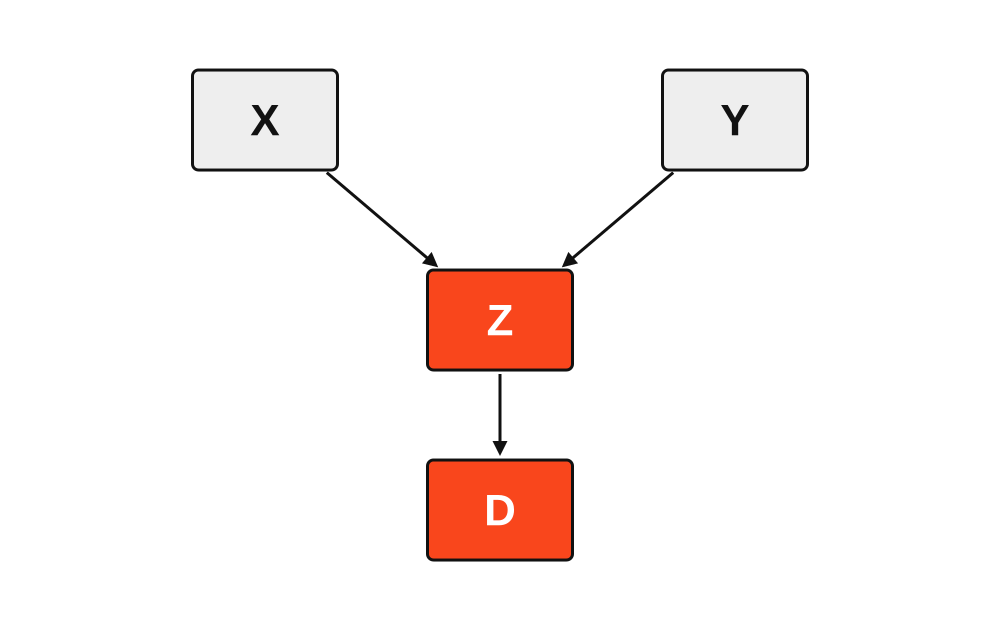

::: {.caption}
Example from Christopher Hitchcock, ["Causal Models"](https://plato.stanford.edu/archives/sum2024/entries/causal-models/), *SEP* (2024).
:::
:::

::::

---

## The Descendant {.split}

:::: {.split-content}

::: {}
$D$ doesn't cause anything, but is a side effect of $Z$.

- Using $D$ is a bit like using $Z$, since $D$ carries *some* of $Z$'s information
- Like a watered-down version of whatever $Z$ was
- E.g. doneness of asparagus
:::

::: {}
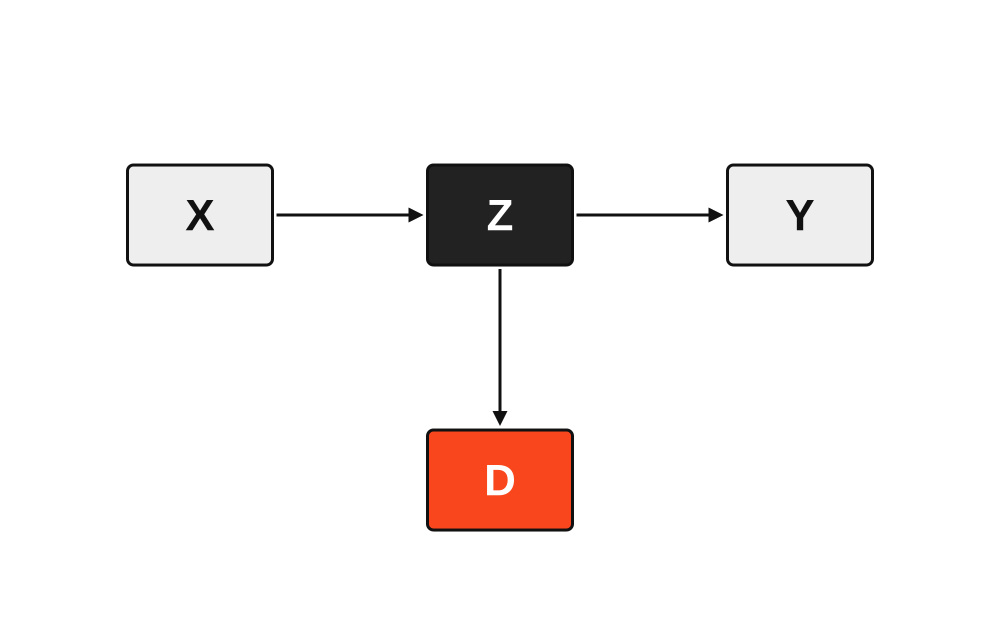

::: {.caption}
Based on Richard McElreath, *Statistical Rethinking*, 2nd ed. (CRC Press, 2020), ch. 6.
:::
:::

::::

---

## Any questions? {#any-questions-day-2}

- PrairieLearn Homeworks?
- Group Projects? (data acquisition checkpoint due Sunday)
- Coding Exercise 01? (due tonight, 11:59pm)
- Asynchronous class next Monday, Oct 5; quiz next Wednesday
- Other logistics?
- (You can also stay after class for questions)

---

## Upload your worksheet {#upload-worksheet-day-2}

Take a picture of your worksheet, upload it in Canvas


# Appendix: Visualization Rhetoric {.section-header}


## Families of Rhetorical Techniques

::: {.caption}
Hullman & Diakopoulos, ["Visualization Rhetoric,"](https://doi.org/10.1109/TVCG.2011.255) *IEEE TVCG* (2011), from 51 professionally-produced narrative visualizations, pp. 2233–2236.
:::

::: {.dense}
| Family | Function | Examples from the paper |
|---|---|---|
| **Information access** | "limit the amount of information presented" | omission, axis thresholding, aggregating |
| **Provenance** | "provide background information" | citing data sources, noting uncertainty |
| **Mapping** | "map elements of the visualization to non-explicit concepts" | "up = more or better, down = less or bad"; party colors |
| **Linguistic** | "an origin in linguistic rhetoric" | irony, metaphor, rhetorical questions, bold fonts |
| **Procedural** | "constrain interaction over time" | default views, fixed comparisons |
:::

::: {.notes}
Bridge to fonts: "Typographic emphases like font bolding or italicizing derives meaning from conventions long associated with typography" (p. 2235).

Bridge to uncertainty: in their sample, uncertainty mostly appeared as text, and "The reliance on textual means may indicate a lack of adequate methods or commonly understood codes for visually representing uncertainty to non-experts" (p. 2234).
:::

---

## Viewing Codes: Denotation and Connotation

::: {.caption}
Hullman & Diakopoulos, ["Visualization Rhetoric,"](https://doi.org/10.1109/TVCG.2011.255) *IEEE TVCG* (2011), p. 2237.
:::

::: {.incremental}
- [Denotation]{.term}: "descriptive elements, including either textual or visual statements (such as iconography) that directly attribute features to objects"
- [Connotation]{.term}: "a secondary symbol cues, but does not directly associate, a meaning"
- Chart types connote: "line graphs tend to evoke temporal interpretations regardless of the data"
    - Heights of men and women drawn as a line: "as a person gets taller they become more male"
:::

::: {.notes}
The height example is from the study they cite as [54]: Zacks & Tversky (1999), "Bars and lines: A study of graphic communication." This sets up the time series section: a line says "time" before anyone reads the axis.
:::


# Appendix: Forecasting Models {.section-header}


## Stationarity

- Some forecasting models assume stationarity
- So you must know whether a series is stationary before modeling

A stationary series is defined by:

::: {.incremental}
- **Constant mean** — no long-term drift up or down
- **Constant variance** — spread stays the same over time
- **No trend or seasonality**
:::


---

## Stationary? {.code-figure-slide}

```{python}
#| echo: true
#| fig-alt: "Line plot of monthly airline passengers from 1949 to 1960, showing an upward trend with growing seasonal oscillations before differencing"
airline_diff = airline.with_columns(
    pl.col("Passengers").diff().alias("first_diff")
).drop_nulls()

ax = sns.lineplot(x=airline["Month"], y=airline["Passengers"])
ax.set_ylim(bottom=0)
ax.set_ylabel("Passengers")
ax.set_title("Original Series")
plt.tight_layout()
```

---

## Making a Series Stationary: Differencing

**Differencing** removes trend by computing the difference between consecutive observations:

$$Y'_t = Y_t - Y_{t-1}$$

This is called **first-order differencing** (difference order = 1).

::: {.incremental}
- (Recognize this concept?)
- Repeat the process for stronger trends
    - second-order differencing removes quadratic trends
- _Example: if passengers are 100 → 120 → 139, the first differences are 20, 19 (much flatter)_
:::

---


## Differencing: Before and After {.code-figure-slide}

```{python}
#| echo: true
#| fig-alt: "Two side-by-side panels: the original airline passenger series on the left with its upward trend and growing seasonal swings, and the first-order differenced series on the right oscillating around zero with no visible trend"
fig, axes = plt.subplots(1, 2, figsize=(10, 3.09))
sns.lineplot(x=airline["Month"], y=airline["Passengers"], ax=axes[0])
axes[0].set_ylim(bottom=0); axes[0].set_title("Before: Original Series")
sns.lineplot(x=airline_diff["Month"], y=airline_diff["first_diff"], ax=axes[1])
axes[1].axhline(0, color="gray", linestyle="--", alpha=0.5)
axes[1].set_ylabel("Difference"); axes[1].set_title("After: First-Order Differencing")
plt.tight_layout()
```

---

## Forecasting Models: Overview

May be useful when working with more complex time series.

::: {.incremental}
- **AR(p)** — predict from the last *p* observations
- **MA(q)** — predict from the last *q* forecast errors
- **ARMA(p, q)** — combines AR and MA; requires a stationary series
- **ARIMA(p, d, q)** — ARMA after *d* rounds of differencing; handles trend
- **SARIMA(p, d, q)(P, D, Q)m** — adds seasonal AR, differencing, MA
:::


# Sources {.sources}

1. GitHub source: <https://github.com/jackbandy/data-science-fun/blob/main/docs/slides/week6.qmd>.
2. Time series decomposition: Jason Brownlee, [*How to Decompose Time Series Data into Trend and Seasonality*](https://machinelearningmastery.com/decompose-time-series-data-trend-seasonality/), Machine Learning Mastery.
3. Airline passengers dataset:
   - Box, G.E.P., Jenkins, G.M. (1976). *Time Series Analysis: Forecasting and Control.* Holden-Day. ISBN 978-0-8162-1104-3. ([Internet Archive scan](https://archive.org/details/timeseriesanalys0000boxg)) ([5th edition via Wiley](https://www.wiley.com/en-us/Time+Series+Analysis:+Forecasting+and+Control,+5th+Edition-p-9781118675021))
   - Dataset in R's base `datasets` package: [`AirPassengers`](https://rdrr.io/r/datasets/AirPassengers.html) — official R documentation with column definitions and citation
   - Rdatasets mirror (CSV download): https://vincentarelbundock.github.io/Rdatasets/doc/datasets/AirPassengers.html
4. CTA ridership data: [Chicago Data Portal — CTA Ridership: Station Entries — Daily Totals](https://data.cityofchicago.org/Transportation/CTA-Ridership-Station-Entries-Daily-Totals/5neh-572f).
5. Four elemental confounds: Richard McElreath, *Statistical Rethinking: A Bayesian Course with Examples in R and Stan*, 2nd ed. (CRC Press, 2020), ch. 6 — and the [Statistical Rethinking 2026 lecture series](https://github.com/rmcelreath/stat_rethinking_2026).
   - Fork, pipe, collider, and descendant examples follow [Chapter 4: Ethics in Understanding](../ethics-in-data-science/book/04-ethics-in-understanding.html). Pipe examples: Jeffrey Dastin, ["Amazon Scraps Secret AI Recruiting Tool That Showed Bias against Women"](https://doi.org/10.1201/9781003278290-44), in Kirsten Martin (ed.), *Ethics of Data and Analytics* (Auerbach, 2022), 296–299; Charles Duhigg, ["How Companies Learn Your Secrets"](https://opencasebook.org/casebooks/521-internet-society-the-technologies-and-politics-of-control-spring-2019/resources/2.2.4-how-companies-learn-your-secrets-by-charles-duhigg-new-york-times-2012/), *The New York Times Magazine* (16 February 2012).
6. W. Jake Thompson, [*Statistical Rethinking: Solutions (2nd ed.) — Ch. 6, The Haunted DAG & The Causal Terror*](https://sr2-solutions.wjakethompson.com/causes-confounds-colliders).
7. Gas grill (descendant) example: Christopher Hitchcock, ["Causal Models"](https://plato.stanford.edu/archives/sum2024/entries/causal-models/), *The Stanford Encyclopedia of Philosophy* (Summer 2024) — as discussed in [Chapter 4: Ethics in Understanding](../ethics-in-data-science/book/04-ethics-in-understanding.html).
8. Uncertainty visualization and the hurricane "cone of uncertainty":
   - Jessica Hullman, ["Confronting Unknowns"](https://doi.org/10.1038/scientificamerican0919-80), *Scientific American* 321(3), p. 80 (September 2019) — published online as "How to Get Better at Embracing Unknowns."
   - Lace M. Padilla, Ian T. Ruginski, Sarah H. Creem-Regehr, ["Effects of Ensemble and Summary Displays on Interpretations of Geospatial Uncertainty Data"](https://doi.org/10.1186/s41235-017-0076-1), *Cognitive Research: Principles and Implications* 2(1):40 (2017) — CC BY 4.0; source of the cone and ensemble figures.
   - Le Liu, Lace Padilla, Sarah H. Creem-Regehr, Donald H. House, ["Visualizing Uncertain Tropical Cyclone Predictions using Representative Samples from Ensembles of Forecast Tracks"](https://doi.org/10.1109/TVCG.2018.2865193), *IEEE TVCG* 25(1):882–891 (2019).
   - Jessica Hullman, Paul Resnick, Eytan Adar, ["Hypothetical Outcome Plots Outperform Error Bars and Violin Plots for Inferences about Reliability of Variable Ordering"](https://doi.org/10.1371/journal.pone.0142444), *PLOS ONE* 10(11):e0142444 (2015) — CC BY 4.0; source of the HOPs figure.
   - Alex Kale, Francis Nguyen, Matthew Kay, Jessica Hullman, ["Hypothetical Outcome Plots Help Untrained Observers Judge Trends in Ambiguous Data"](https://doi.org/10.1109/TVCG.2018.2864909), *IEEE TVCG* 25(1):892–902 (2019).
   - Lace Padilla, Matthew Kay, Jessica Hullman, ["Uncertainty Visualization"](https://doi.org/10.1002/9781118445112.stat08296), *Wiley StatsRef: Statistics Reference Online* (2021).

# Sources (continued) {.sources}

9. The Great Decoupling: Erik Brynjolfsson & Andrew McAfee, ["The Great Decoupling"](https://hbr.org/2015/06/the-great-decoupling), *Harvard Business Review* (June 2015). Recreated from FRED series [OPHNFB](https://fred.stlouisfed.org/series/OPHNFB), [A939RX0Q048SBEA](https://fred.stlouisfed.org/series/A939RX0Q048SBEA), [USPRIV](https://fred.stlouisfed.org/series/USPRIV), and U.S. Census Bureau [Historical Income Table F-7](https://www.census.gov/data/tables/time-series/demo/income-poverty/historical-income-families.html).
10. Newspapers vs. platforms: Pew Research Center, [Newspapers Fact Sheet](https://www.pewresearch.org/journalism/fact-sheet/newspapers/) (News Media Alliance data through 2012, Pew estimates 2013–2022); Google/Alphabet and Facebook/Meta advertising revenue from their 10-K and S-1 filings on [SEC EDGAR](https://www.sec.gov/edgar/search/); inflation-adjusted with CPI-U ([CPIAUCSL](https://fred.stlouisfed.org/series/CPIAUCSL)). Filing-by-filing sources in `docs/assets/newspaper-ad-revenue/SOURCES.md`.
11. DiCaprio's girlfriends: *Daily Mail* chart as posted by u/Far-Building3569, ["Leonardo DiCaprio's age contrasted with his girlfriends"](https://www.reddit.com/r/charts/comments/1owzkul/leonardo_dicaprios_age_contrasted_with_his/), r/charts (14 Nov 2025); shown as posted, after a blank frame redrawn from its axes.
12. Slides developed using materials from [Elena Zheleva](https://www.cs.uic.edu/~elena/) and [Gonzalo Bello Lander](https://cs.uic.edu/profiles/gonzalo-bello/), the Berkeley DS 100 team, Marine Carpuat, and Brian Ziebart.
13. Slide deck built with [Quarto](https://quarto.org/) revealjs.
14. Title font is Big Shoulders; Body font is [Libre Franklin](https://en.wikipedia.org/wiki/Franklin_Gothic#Libre_Franklin).
15. Axis label and font sizes: Claus O. Wilke, *Fundamentals of Data Visualization* (O'Reilly, 2019), [ch. 24](https://clauswilke.com/dataviz/small-axis-labels.html). DIKW pyramid figure from [week 1](week1.html).
16. Gapminder clip: Hans Rosling, ["The best stats you've ever seen"](https://www.ted.com/talks/hans_rosling_the_best_stats_you_ve_ever_seen), TED2006, Monterey, CA (February 2006); segment 2:30–5:15 of the [TED upload on YouTube](https://www.youtube.com/watch?v=hVimVzgtD6w).
17. Visualization rhetoric: Jessica Hullman and Nicholas Diakopoulos, ["Visualization Rhetoric: Framing Effects in Narrative Visualization"](https://doi.org/10.1109/TVCG.2011.255), *IEEE Transactions on Visualization and Computer Graphics* 17(12):2231–2240 (2011) ([author PDF](https://mucollective.northwestern.edu/files/2011-VisRhetoric-InfoVis.pdf)). The line-graph height example they cite is Jeff Zacks and Barbara Tversky, "Bars and Lines: A Study of Graphic Communication," *Memory & Cognition* 27(6) (1999).
18. Current hurricane cone: NOAA/NWS National Hurricane Center, [Hurricane Polo graphics archive](https://www.nhc.noaa.gov/archive/2026/POLO_graphics.php), 5-day cone, Intermediate Advisory 24A, 11 AM MST, 26 September 2026; public domain. Download details in `docs/assets/hurricane-cone/SOURCES.md`. The live HOP demo (`docs/assets/hops/hop-live.html`) follows the error-bar vs. HOP comparison in Hullman, Resnick & Adar (2015), Fig. 2.
19. Misleading axes and proportional ink: Carl T. Bergstrom and Jevin D. West, *Calling Bullshit*, ["Misleading Axes on Graphs"](https://www.callingbullshit.org/tools/tools_misleading_axes.html) and ["The Principle of Proportional Ink"](https://www.callingbullshit.org/tools/tools_proportional_ink.html); videos [6.2](https://www.youtube.com/watch?v=9pNWVMxaFuM) and [6.6](https://www.youtube.com/watch?v=oNhusd3xFC4).
20. Extrapolation: Bergstrom and West, ["Case Study: The Gender Gap in 100-meter Dash Times"](https://www.callingbullshit.org/case_studies/case_study_gender_gap_running.html); Andrew J. Tatem, Carlos A. Guerra, Peter M. Atkinson and Simon I. Hay, ["Momentous sprint at the 2156 Olympics?"](https://doi.org/10.1038/431525a), *Nature* 431:525 (2004); Kenneth Rice, ["Sprint research runs into a credibility gap"](https://doi.org/10.1038/432147b), *Nature* 432:147 (2004). The 2156 figure refits the paper's Supplementary Table S1 and adds 2008–2024 winning times from Wikipedia; details in `docs/assets/olympics-100m/SOURCES.md`.
21. Serif vs. sans-serif: definitions from Wikipedia, ["Serif"](https://en.wikipedia.org/w/index.php?title=Serif&oldid=1366160623) (revision of 26 July 2026); letter images set in Superclarendon and Helvetica by `docs/assets/serif-sans/make_serif_figures.py`, with the serifs-in-red layout after Stannered and Chmod007's [Wikimedia Commons series](https://commons.wikimedia.org/wiki/File:Serif_and_sans-serif_03.svg).
22. Recognize this font: Wikipedia, ["Papyrus (typeface)"](https://en.wikipedia.org/wiki/Papyrus_(typeface)) (Avatar logo); dafont forum, ["How can I get the new font of OR3"](https://www.dafont.com/forum/read/594399/how-can-i-get-the-new-font-of-or3) (Just Like Heaven by Jes Sheldon); Chequered Ink, [Hunters K-Pop](https://www.dafont.com/hunters-k-pop.font) (free for personal use); Wikipedia, ["Verdana"](https://en.wikipedia.org/wiki/Verdana) (IKEA); Wikipedia, ["Brat (album)"](https://en.wikipedia.org/wiki/Brat_(album)). Text is drawn as outlined paths; details in `docs/assets/recognize-this-font/SOURCES.md`.
