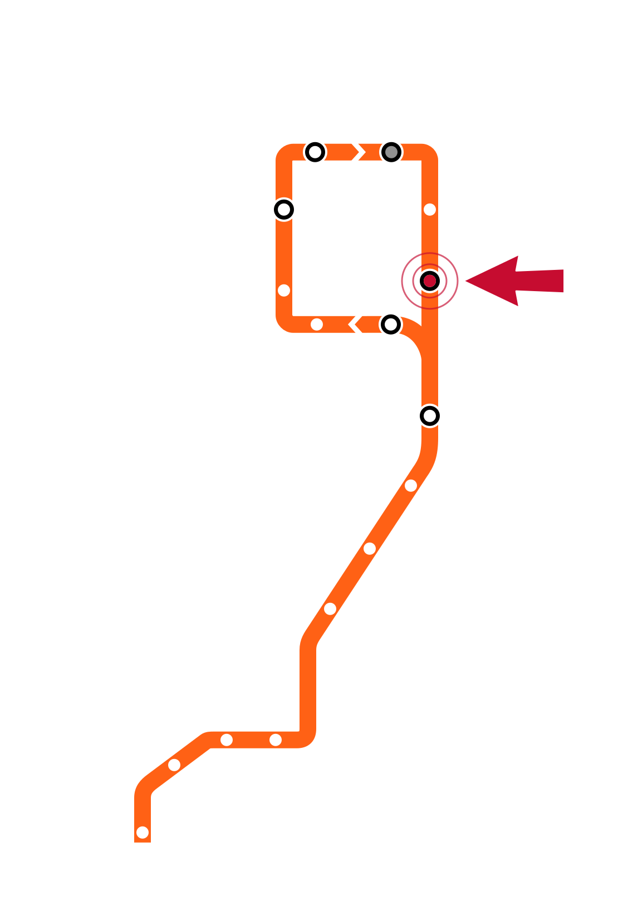

# Week 7 Slide Deck {.course-title}

## Hypothesis Testing; Estimation/Sampling/Randomness

Jack Bandy
2026

---

# Week 7, Day 1 {.course-title .photo-title data-state="photo-title" background-image="../assets/orange-line-stops-better/stop08-adams-wabash-b.jpg" background-size="cover"}

CS 418 · Week 7 · 🟠 Adams/Wabash 🟠

---

# {.photo-only data-state="photo-only" background-image="../assets/orange-line-stops-better/stop08-adams-wabash-b.jpg" background-size="cover"}

---

# Map {.split}

::: {.split-content .narrow-aside}

::: {}
- Week 7: Adams/Wabash
- Day 1
    - Hypothesis Testing
    - The Trouble With p < .05
:::

{.figure alt="Orange Line map with the Adams/Wabash stop marked, the Week 7 stop"}

:::

---

# Hypothesis Testing {.section-header}

---

# Hypothesis Testing

::: {style="border:3px dashed #f9461c; border-radius:12px; padding:0.8em 1em; margin-top:0.4em;"}
[TODO]{.eyebrow .todo}

::: {.dense}
- **TK**
:::
:::

---

# The Trouble With p < .05 {.section-header}

---

# p-Hacking: A Peculiar Prevalence

*Placeholder — to be developed.*

- p-values should be smoothly distributed
- Instead, there is a suspicious pile-up of values *just below* .05 [@masicampo2012]
- researcher degrees of freedom
- selective reporting

---

# Many Analysts, One Data Set

*Placeholder — to be developed.*

- 29 teams, same data, same question: does skin tone predict red cards? [@silberzahn2018]
- analytic choices alone produced varying effect estimates
- for pre-registration and transparent reporting

---

# Remember the elephant? {.image-frame-slide}

::: {style="text-align:center; font-size:0.4em; color:#565a5c; margin-top:0.3em;"}
Hanabusa Itchō, *Blind Monks Examining an Elephant* (1888 woodblock print reproduction), public domain. [Wikimedia Commons](https://commons.wikimedia.org/wiki/File:Blind_monks_examining_an_elephant.jpg).
:::

---

# Week 7, Day 2 {.course-title .photo-title data-state="photo-title photo-title-zoom" background-image="../assets/orange-line-stops-better/stop08-adams-wabash-b.jpg" background-size="cover"}

<h2>Estimation, Sampling, and Randomness</h2>

Jack Bandy
2026

---

# Map {.split}

::: {.split-content .narrow-aside}

::: {}
- Week 7: Adams/Wabash
- Day 2
    - Estimation and Sampling
    - Randomness
:::

{.figure alt="Orange Line map with the Adams/Wabash stop marked, the Week 7 stop"}

:::

---

# Estimation and Sampling {.section-header}

---

# Estimation and Sampling

::: {style="border:3px dashed #f9461c; border-radius:12px; padding:0.8em 1em; margin-top:0.4em;"}
[TODO]{.eyebrow .todo}

::: {.dense}
- **TK**
:::
:::

---

# Randomness {.section-header}

---

# Randomness

::: {style="border:3px dashed #f9461c; border-radius:12px; padding:0.8em 1em; margin-top:0.4em;"}
[TODO]{.eyebrow .todo}

::: {.dense}
- **TK**
:::
:::

---

# Sources {.sources}

1. GitHub source: <https://github.com/jackbandy/data-science-fun/blob/main/docs/slides/week7.qmd>.
2. Slides developed using materials from [Elena Zheleva](https://www.cs.uic.edu/~elena/) and [Gonzalo Bello Lander](https://cs.uic.edu/profiles/gonzalo-bello/), the Berkeley DS 100 team, Marine Carpuat, and Brian Ziebart.
3. Slide deck built with [Quarto](https://quarto.org/) revealjs.
4. Title font is Big Shoulders; Body font is [Libre Franklin](https://en.wikipedia.org/wiki/Franklin_Gothic#Libre_Franklin).
