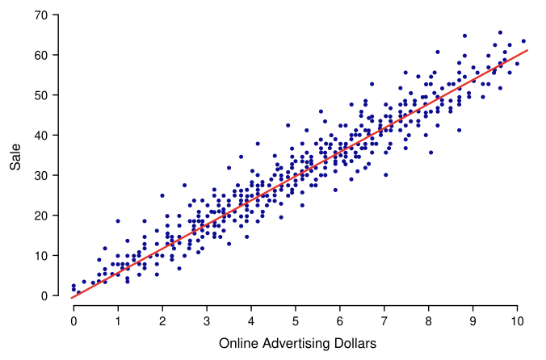
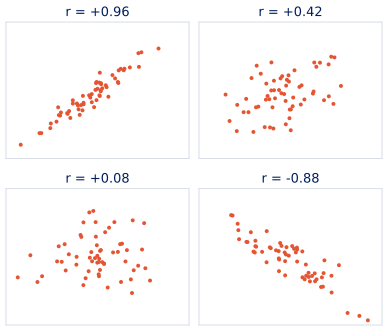

# Week 8 Slide Deck {.course-title}

## Linear Regression; Intro to Classification

Jack Bandy
2026

---

# Topic Title Placeholder {.course-title .photo-title data-state="photo-title" background-image="../assets/orange-line-stops-better/stop09-roosevelt-c.jpg" background-size="cover"}

CS 418 · Week 8 · 🟠 Roosevelt 🟠

---

# {.photo-only data-state="photo-only" background-image="../assets/orange-line-stops-better/stop09-roosevelt-c.jpg" background-size="cover"}

---

# Demo Content Slide

Placeholder content for Week 8.

- Linear regression
- Prediction
- Intro to classification

---

# Linear Regression {.smaller}
Linear regression models a linear relationship between two variables.

:::: {.columns}

::: {.column width="55%"}

- The variable being modeled or predicted is called the response variable.
- The variable used to predict the response is called the predictor variable.
- One predictor gives a line; several predictors give a plane.

:::

::: {.column width="45%"}

:::

::::

---

# Linear regression equation {.smaller}
A fitted model uses this regression line equation:

$$\hat{y} = b_0 + b_1 x$$

where

::: {.incremental}
- $\hat{y}$ — the response variable, which we are trying to predict based on $x$
- $x$ — the predictor variable
- $b_0$ — the intercept, the predicted value of $y$ when $x$ is zero
- $b_1$ — the slope, how much the predicted value of $y$ changes for every one-unit increase in the value of $x$
:::

---

# Correlation coefficient {.smaller}

The correlation coefficient $r$ measures the strength and direction of a linear relationship.

:::: {.columns}

::: {.column width="55%"}

::: {.incremental}
- $r$ always falls between $-1$ and $+1$.
- The sign gives the direction: positive rises, negative falls.
- The closer $|r|$ is to 1, the tighter the points hug the line.
- $r$ near 0 means no linear pattern — a curved one may still exist.
:::

:::

::: {.column width="45%"}

Same idea at four strengths

:::

::::

::: {.notes}
r is symmetric — swapping x and y leaves it unchanged — while the regression slope is not. The near-zero panel is the one to dwell on: no linear pattern is not the same as no pattern. Correlation says nothing about cause; that comes from the study design.
:::

---

# Correlation coefficient example {.smaller}

::: {style="font-size:1.5em;"}
$$r = \frac{\sum (x_i-\bar{x})(y_i-\bar{y})}{\sqrt{\sum (x_i-\bar{x})^2 \; \sum (y_i-\bar{y})^2}}$$
:::

::: {.incremental}
- Each term pairs how far a point sits from $\bar{x}$ with how far it sits from $\bar{y}$.
- That product is positive when both deviate the same way, negative when they deviate oppositely.
- The denominator rescales the total so the result always lands between $-1$ and $+1$.
:::

::: {.notes}
Walk the numerator first: it is a sum of products of deviations, so it grows when x and y move together. The denominator is just normalization — it is what forces the range, and it is why r has no units.
:::

---

---

# What is classification? {.smaller}
Classification is the task of predicting the class label of an observation from a set of predictor variables.

:::: {.columns}

::: {.column width="55%"}

::: {.incremental}
- The response variable is categorical rather than continuous.
- Predictor variables may be numeric, categorical, or a mixture.
- The model is fitted on training observations with known labels.
- Each new observation is assigned to one of the defined classes.
:::

:::

::: {.column width="45%"}

Two features from a labelled set of emails

:::

::::

::: {.notes}
Anchor this against regression, which the class has just seen: the same structure of predictors and a response, but the response is now categorical. Fitting to known examples and predicting for new ones carries over unchanged.
:::

---

# Sources {.sources}

1. GitHub source: <https://github.com/jackbandy/data-science-fun/blob/main/docs/slides/week8.md>.
2. Slides developed using materials from [Elena Zheleva](https://www.cs.uic.edu/~elena/) and [Gonzalo Bello Lander](https://cs.uic.edu/profiles/gonzalo-bello/), the Berkeley DS 100 team, Marine Carpuat, and Brian Ziebart.
3. Slide deck built with [Quarto](https://quarto.org/) revealjs.
4. Title font is Big Shoulders; Body font is [Libre Franklin](https://en.wikipedia.org/wiki/Franklin_Gothic#Libre_Franklin).
