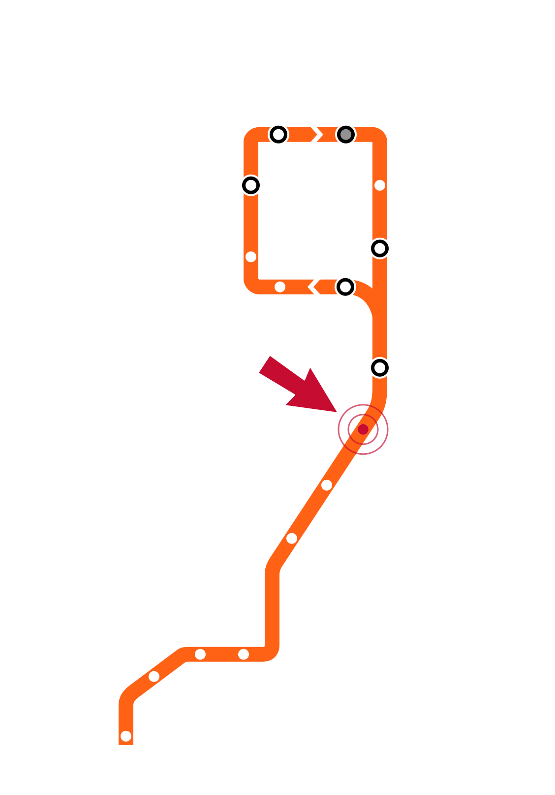

# Week 9 Slide Deck {.course-title}

## Decision Trees; SVMs and Kernels

Jack Bandy
2026

---

# Week 9, Day 1 {.course-title .photo-title data-state="photo-title" background-image="../assets/orange-line-stops-better/stop10-halsted-a.jpg" background-size="cover"}

CS 418 · Week 9 · 🟠 Halsted 🟠

---

# {.photo-only data-state="photo-only" background-image="../assets/orange-line-stops-better/stop10-halsted-a.jpg" background-size="cover"}

---

# Map {.split}

::: {.split-content .narrow-aside}

::: {}
[Week 9, Day 1]{.eyebrow}

- Decision Trees
:::

{.figure alt="Orange Line map with the Halsted stop marked, the Week 9 stop"}

:::

---

# Decision Trees {.section-header}

---

# Decision Trees

::: {style="border:3px dashed #f9461c; border-radius:12px; padding:0.8em 1em; margin-top:0.4em;"}
[TODO]{.eyebrow .todo}

::: {.dense}
- **TK**
:::
:::

---

# Week 9, Day 2 {.course-title .photo-title data-state="photo-title photo-title-zoom" background-image="../assets/orange-line-stops-better/stop10-halsted-a.jpg" background-size="cover"}

<h2>SVMs and Kernels</h2>

Jack Bandy
2026

---

# Map {.split}

::: {.split-content .narrow-aside}

::: {}
[Week 9, Day 2]{.eyebrow}

- Support Vector Machines
- Kernels
:::

{.figure alt="Orange Line map with the Halsted stop marked, the Week 9 stop"}

:::

---

# Support Vector Machines {.section-header}

---

# Support Vector Machines

::: {style="border:3px dashed #f9461c; border-radius:12px; padding:0.8em 1em; margin-top:0.4em;"}
[TODO]{.eyebrow .todo}

::: {.dense}
- **TK**
:::
:::

---

# Kernels {.section-header}

---

# Kernels

::: {style="border:3px dashed #f9461c; border-radius:12px; padding:0.8em 1em; margin-top:0.4em;"}
[TODO]{.eyebrow .todo}

::: {.dense}
- **TK**
:::
:::

---

# Sources {.sources}

1. GitHub source: <https://github.com/jackbandy/data-science-fun/blob/main/docs/slides/week9.qmd>.
2. Slides developed using materials from [Elena Zheleva](https://www.cs.uic.edu/~elena/) and [Gonzalo Bello Lander](https://cs.uic.edu/profiles/gonzalo-bello/), the Berkeley DS 100 team, Marine Carpuat, and Brian Ziebart.
3. Slide deck built with [Quarto](https://quarto.org/) revealjs.
4. Title font is Big Shoulders; Body font is [Libre Franklin](https://en.wikipedia.org/wiki/Franklin_Gothic#Libre_Franklin).
